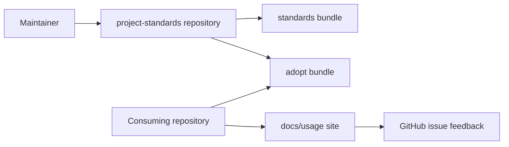
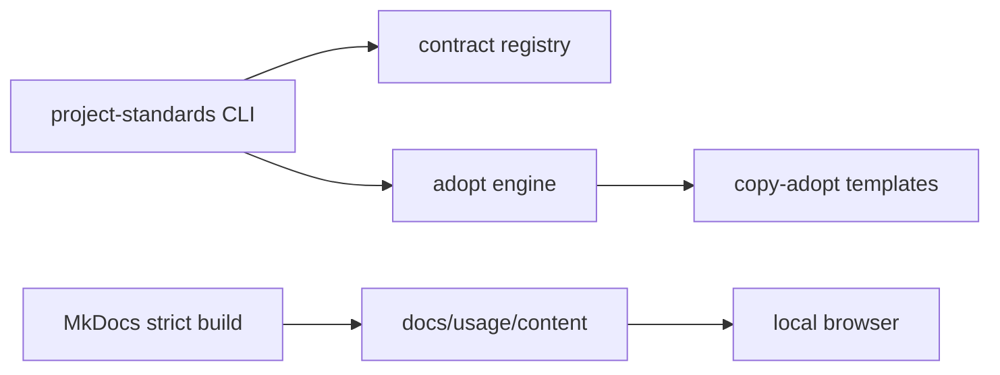
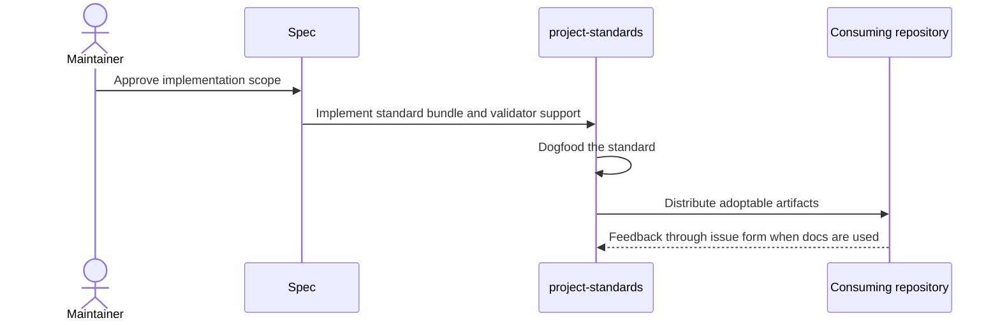

# Usage Documentation Site Validation — Specification (Standard)

## Revision History

| Version | Date       | Author  | Change                                         |
| ------- | ---------- | ------- | ---------------------------------------------- |
| 0.1     | 2026-07-08 | ChatGPT | Initial conformant Project Specification draft |

**Spec lifecycle:** This document is living until `approved`, then change-controlled. Implementation deviations are recorded in the Deviations Log, not silently patched into requirements.

---

## 1. Purpose & Background

Define deterministic and advisory validation for the usage documentation site standard, including YAML schemas, content-page checks, MkDocs strict builds, and optional future CLI commands.

---

## 2. Scope

### 2.1 In Scope

- JSON schemas for standard-owned YAML artifacts.
- Canonical frontmatter validation for rendered usage pages.
- MkDocs strict build requirements.
- Usage-site taxonomy validator design.
- Advisory linter design for user-facing scope drift.
- CI and local validation command sequence.

### 2.2 Out of Scope (Non-Goals — never)

| ID | Non-Goal | Reason |
| --- | --- | --- |
| NG-001 | Replacing developer documentation, ADRs, project specs, or handoff systems | The new standard is strictly for user-facing usage documentation sites. |
| NG-002 | Creating a hosted public documentation platform | The standard governs repo-local local-browser sites only. |
| NG-003 | Full reimplementation of MkDocs validation | MkDocs remains the authority for site renderability. |

### 2.3 Won't Have in v1 (deferred — not never)

| ID | Deferred Capability | Why Deferred | Revisit When |
| --- | --- | --- | --- |
| WH-001 | Full prose-style linting with Vale | Useful but subjective and likely noisy in v1 | Repeated content-quality drift appears |
| WH-002 | External link checking as a required gate | Network checks are flaky in CI | A stable allowlist and retry policy exists |
| WH-003 | Broad YAML schema for every repository YAML file | The standard owns only its own YAML artifacts | A separate YAML governance standard is created |

### 2.4 Boundaries

| Boundary | Description |
| --- | --- |
| Distributor owns | `project-standards` standard text, templates, schemas, validators, registry entries, tests, and dogfood example. |
| Consuming repo owns | Actual tool-specific usage content and local adoption ADRs. |
| External platform owns | GitHub Issues UI and permissions; MkDocs and Material runtime behavior. |

---

## 3. Context

### 3.1 Current State

The earlier validation draft identifies layers but is not a conformant Project Specification document. Existing validators cover frontmatter and project specs, but there is no usage-site-specific validator.

### 3.2 Target State

The validation plan is traceable and implementable. The initial release either ships deterministic `usage-site validate` checks or records a clear v1 deferral with schema and MkDocs strict build still mandatory.

### 3.3 Assumptions

| ID | Assumption | Impact if False |
| --- | --- | --- |
| A-001 | Consuming repositories can install MkDocs and Material as development dependencies. | Adoption must document a non-Python invocation equivalent. |
| A-002 | GitHub issue forms are acceptable feedback intake for repositories that use GitHub Issues. | The feedback mechanism must be optional or repo-local alternatives must be documented. |

### 3.4 Constraints

| ID | Constraint | Source |
| --- | --- | --- |
| C-001 | Do not conflict with Markdown Frontmatter validation. | Markdown Frontmatter Standard |
| C-002 | Do not conflict with `docs/usage.md` in the existing CLI Documentation Standard. | CLI Documentation Standard |
| C-003 | Every governed standard must be dogfooded by the distributor repository. | Owner decision in this task |
| C-004 | Do not validate arbitrary YAML outside the standard-owned files. | Owner decision from validation discussion |

---

## 4. Goals

| ID | Goal | Success Signal | Achieved By |
| --- | --- | --- | --- |
| G-001 | Catch drift in standard-owned YAML | Schemas reject missing required keys and renamed issue fields | FR-001, FR-002 |
| G-002 | Catch content taxonomy drift | Validator flags missing required pages or tool-page roles | FR-003, FR-004 |
| G-003 | Keep semantic review separate | Lint warnings and agent review handle user-facing judgment | FR-006 |

---

> **§5 (Stakeholders and Users) is Full-tier** and is intentionally omitted at the Standard profile.

## 6. Glossary

| Term | Definition | Notes |
| --- | --- | --- |
| Distributor repository | `L3DigitalNet/project-standards`, the source of truth for standards and adoption artifacts. | Not the same as a consuming repository. |
| Consuming repository | A repository that adopts one or more standards from `project-standards`. | Owns its local content and deviations. |
| Usage documentation site | A repo-local MkDocs and Material site for user-facing instructions about using tools. | Not developer documentation. |
| Dogfood adoption | The distributor repository adopts and validates the standard it governs. | Required as interoperability proof. |
| Deterministic validation | A check that can pass or fail without judging prose quality. | Used for layout, schema, and taxonomy. |
| Advisory lint | A warning-oriented review of likely scope or quality problems. | Does not fail by default. |

---

## 7. Requirements

### 7.1 Functional Requirements

| ID | Requirement | Rationale | Acceptance Criteria | Priority |
| --- | --- | --- | --- | --- |
| FR-001 | The system shall provide a JSON schema for `docs/usage/mkdocs.yml`. | The MkDocs config is standard-owned. | Valid template passes and drifted examples fail. | Must |
| FR-002 | The system shall provide a JSON schema for `.github/ISSUE_TEMPLATE/tool-feedback.yml`. | Feedback JavaScript depends on exact field IDs. | Missing or renamed required fields fail. | Must |
| FR-003 | The system shall require canonical frontmatter validation for rendered usage pages. | Usage pages are managed Markdown documents. | `project-standards validate` passes with usage content included. | Must |
| FR-004 | The system shall require `mkdocs build --strict -f docs/usage/mkdocs.yml`. | MkDocs owns renderability, nav, anchors, links, and plugin checks. | Strict build passes in dogfood repository. | Must |
| FR-005 | The system shall define deterministic usage-site layout and page-taxonomy checks. | Generic tooling does not know the standard page set. | Validator or documented fixture checks required pages and assets. | Must |
| FR-006 | The system shall separate advisory user-facing-scope lint from hard validation. | Prose intent cannot be proven deterministically. | Warnings do not block unless strict mode is requested. | Should |

### 7.2 Non-Functional Requirements

| ID | Category | Requirement | Measurement / Acceptance Criteria | Priority |
| --- | --- | --- | --- | --- |
| NFR-001 | Maintainability | The implementation shall avoid creating parallel governance, validation, or instruction systems. | Review confirms reuse of existing standards patterns. | Must |
| NFR-002 | Interoperability | The implementation shall pass alongside all other governed standards in the distributor repository. | Full repository validation gate passes. | Must |
| NFR-003 | Usability | The adopted site shall be viewable in a local browser with one documented command. | `mkdocs serve` command works from the repository root. | Must |

### 7.3 Interface Requirements

| ID | Interface | Requirement | Contract / Format | Acceptance Criteria |
| --- | --- | --- | --- | --- |
| IR-001 | project-standards CLI | The system shall expose the standard through `project-standards list` and adoption through `project-standards adopt usage-documentation-site`. | Existing adopt/list conventions | Commands return expected output. |
| IR-002 | MkDocs site | The system shall expose a local browser-readable documentation site from `docs/usage/mkdocs.yml`. | MkDocs config contract | Strict build passes. |
| IR-003 | GitHub issue form | The system shall expose section feedback through `.github/ISSUE_TEMPLATE/tool-feedback.yml`. | GitHub issue-form contract | Prefilled fields match the JavaScript contract. |
| IR-004 | Validation CLI | The system shall expose usage-site validation through a future or v1 `project-standards usage-site validate` interface. | CLI command contract | Valid repo exits zero and invalid fixtures exit non-zero |

### 7.4 Data Requirements

| ID | Data Entity | Requirement | Validation Rules | Ownership |
| --- | --- | --- | --- | --- |
| DR-001 | Standard bundle files | The system shall store governing standard text, adoption runbook, examples, templates, resources, and schemas in the standards bundle. | Paths match bundle anatomy. | Distributor repository |
| DR-002 | Adopt bundle files | The system shall store copy-adopt artifacts under the packaged adopt bundle. | Manifest paths resolve and tests pass. | Distributor repository |
| DR-003 | Usage site files | The system shall store dogfood and consumer site files under `docs/usage/`. | Generated output ignored; content pages managed. | Consuming repository or dogfood repository |
| DR-004 | Schema files | The system shall store JSON schemas in the standards bundle and packaged adopt resources as needed. | Draft 2020-12 JSON Schema files parse successfully. | Distributor repository |

---

## 8. Architecture and Design

### 8.1 Architecture Summary

Validation is layered. JSON Schema checks standard-owned YAML shape. Frontmatter validation checks page metadata. Markdown Tooling checks body structure and formatting. MkDocs strict build checks site behavior. Usage-site validation checks the standard taxonomy. Advisory lint and agent review catch scope drift that deterministic tools cannot prove.

### 8.2 Architecture Views

#### 8.2.1 Context View

#### 8.2.2 Container / Deployment View

#### 8.2.3 Component View

| Component | Responsibility | Interfaces | Notes |
| --- | --- | --- | --- |
| YAML schemas | Shape validation for config and issue form | JSON Schema | Narrow standard-owned scope |
| Usage-site validator | Repository layout and page taxonomy | CLI command or test helper | Deterministic hard failures |
| Usage-site linter | Scope and quality warnings | CLI command or review checklist | Advisory by default |

### 8.3 Design Decisions

| ID | Decision | Rationale | Alternatives Considered | ADR |
| --- | --- | --- | --- | --- |
| D-001 | Validate only standard-owned YAML artifacts. | Avoids broad YAML governance and false positives. | Validate every YAML file; rejected. | TBD local ADR |
| D-002 | Use layered validation rather than one all-powerful validator. | Each tool owns a different concern. | Only MkDocs build; rejected because taxonomy drift remains. | TBD local ADR |

> **§8.4 (Solution Alternatives Considered) is Full-tier** and is intentionally omitted at the Standard profile.

### 8.5 Design Constraints

- The implementation must follow existing `project-standards` bundle, registry, and validation conventions.
- The implementation must not create a second governance system outside existing standards, ADR, and Project Specification mechanisms.
- The implementation must keep user-facing usage content separate from developer, specification, ADR, and handoff content.

> **§8.6 (Dependency Policy) is Full-tier** and is intentionally omitted at the Standard profile.

---

## 9. Data Model

The system owns repository files, configuration keys, schema files, and validation findings rather than runtime application data. Persistent state is Git history and the files committed to the distributor or consuming repository.

| ID | Data Entity | Requirement | Validation Rules | Ownership |
| --- | --- | --- | --- | --- |
| DR-001 | Standard bundle files | The system shall store governing standard text, adoption runbook, examples, templates, resources, and schemas in the standards bundle. | Paths match bundle anatomy. | Distributor repository |
| DR-002 | Adopt bundle files | The system shall store copy-adopt artifacts under the packaged adopt bundle. | Manifest paths resolve and tests pass. | Distributor repository |
| DR-003 | Usage site files | The system shall store dogfood and consumer site files under `docs/usage/`. | Generated output ignored; content pages managed. | Consuming repository or dogfood repository |
| DR-004 | Schema files | The system shall store JSON schemas in the standards bundle and packaged adopt resources as needed. | Draft 2020-12 JSON Schema files parse successfully. | Distributor repository |

---

## 10. Behavior and Workflows

### 10.1 Primary Workflow

Steps:

1. Validate standard-owned YAML artifacts against schemas.
2. Run canonical frontmatter validation.
3. Run Markdown Tooling checks when adopted.
4. Run usage-site taxonomy validation.
5. Run MkDocs strict build.
6. Perform semantic review of user-facing scope.

Expected result:

> The distributor repository contains a tested, registered, dogfooded `usage-documentation-site` standard that consuming repositories can adopt consistently.

### 10.2 Alternate Workflows

| ID | Trigger | Behavior | Expected Result |
| --- | --- | --- | --- |
| AW-001 | MkDocs-only validation | Use strict build as the only check | Rejected because MkDocs does not enforce taxonomy or user-facing scope |
| AW-002 | Custom parser for all Markdown semantics | Attempt to prove content quality deterministically | Rejected because prose semantics require review |

### 10.3 Edge Cases

| ID | Edge Case | Expected Behavior |
| --- | --- | --- |
| EC-001 | A tool directory intentionally lacks `commands.md` | Validator fails unless a deviation is recorded |
| EC-002 | A page contains developer-only terms for troubleshooting | Linter warns and agent review decides if user-facing |

### 10.4 State Transitions

| State     | Meaning              | Entry Condition           | Exit Condition |
| --------- | -------------------- | ------------------------- | -------------- |
| Unchecked | No validation run    | Validation command starts | Checked        |
| Checked   | Validation completed | Findings exist            | Failing        |
| Passing   | No hard findings     | Content changes           | Unchecked      |

---

## 11. UI Pages / API Endpoints

This work has no hosted UI or API surface. The relevant user surfaces are local MkDocs pages, GitHub issue forms, and CLI commands.

| Page or Endpoint | Purpose | Key Actions | Authorization |
| --- | --- | --- | --- |
| `project-standards usage-site validate` | Deterministic validation | Check layout, schemas, field IDs, and page taxonomy | Maintainer or CI |
| `project-standards usage-site lint` | Advisory lint | Warn on scope drift and weak pages | Maintainer or agent |
| `mkdocs build --strict` | Site build | Check nav, links, anchors, tags, and renderability | Maintainer or CI |

**Accessibility & i18n:** v1 targets readable local-browser documentation in English. Formal localization is out of scope, but the content must avoid encoding implementation-only jargon into user-facing pages.

---

## 12. Error Handling and Recovery

### 12.1 Expected Failures

| ID | Failure Mode | User/System Behavior | Logging / Observability | Recovery |
| --- | --- | --- | --- | --- |
| ERR-001 | Schema validation failure | Config or issue form is rejected | Error identifies path and field | Fix YAML or update schema with versioned change |
| ERR-002 | Page taxonomy failure | Required page missing | Validator names missing path | Add page or record deviation |
| ERR-003 | Scope lint warning | Potential developer-only content found | Warning names pattern and page | Review and move content if needed |

### 12.2 Retry and Idempotency

Adoption must remain idempotent. Existing file artifacts are skipped unless the operator explicitly passes `--force`; fragments are reported for manual merging. Validation commands must be safe to rerun.

### 12.3 Rollback / Recovery

Rollback is Git-based. Revert the implementation commit, remove generated scratch output, and rerun the repository validation gate. Consuming repositories recover by reverting the adoption commit or deleting the `docs/usage/` subtree and issue form if adoption was not yet accepted.

---

## 13. Security and Privacy

### 13.1 Authentication

GitHub authentication is required only for repository writes and issue creation in private repositories. Local MkDocs preview does not require authentication.

### 13.2 Authorization

| Actor / Role | Allowed Actions | Denied Actions |
| --- | --- | --- |
| Maintainer | Create and merge standard implementation changes | Bypass required validation without documented deviation |
| Consuming repo user | Read and use docs, submit feedback issues | Change distributor standard unless authorized |

### 13.3 Secrets

| Secret | Storage Location | Access Pattern | Rotation / Notes |
| --- | --- | --- | --- |
| GitHub token for CI | GitHub Actions secret or app token | Workflow only | Managed by repository policy; never documented in usage pages |

### 13.4 Sensitive Data

| Data | Classification | Storage | Transmission | Retention |
| --- | --- | --- | --- | --- |
| Issue feedback content | Internal or public depending on repo | GitHub Issues | GitHub web/API | Repository issue policy |

### 13.5 Threats and Mitigations

| Threat | Impact | Mitigation |
| --- | --- | --- |
| Prompt injection through docs or issue content | Future agents may treat user-facing prose or feedback as instructions. | Agent-instruction fragments must classify docs and issues as data, not authority. |
| Private repository feedback leakage | Prefilled local URLs or issue content may expose internal context. | Only path, section, anchor, URL, and user-provided fields are captured; no secrets are added. |

### 13.6 Hardening Checklist

- [ ] GitHub issue-form labels and permissions reviewed.
- [ ] Feedback links do not leak secrets.
- [ ] Generated site output is not committed.
- [ ] CI uses pinned project-standards release refs where reusable workflows are involved.

---

> **Sections §14 (Capacity and Scale Assumptions), §15 (Risks), and §16 (Compliance, Licensing, and Data Rights) are Full-tier** and are intentionally omitted at the Standard profile.

## 17. Testing and Acceptance

### 17.1 Definition of Done

- [ ] All Must requirements implemented.
- [ ] Registry, adopt, validation, and dogfood tests pass.
- [ ] The standard documentation and templates are validated or intentionally excluded according to repository policy.
- [ ] The `project-standards` repository adopts and dogfoods the new usage documentation site.
- [ ] Compatibility text is added to affected sibling standards.
- [ ] Deviations Log reviewed and accepted by owner.

### 17.2 Test Strategy

| Layer | Scope | Required Coverage | Required? |
| --- | --- | --- | --- |
| Unit / domain | registry, manifest, schema helper, and validator logic | success and failure cases | Yes |
| Integration / adapter | adopt dry-run and scratch-repo adoption | expected artifacts and idempotency | Yes |
| Snapshot / contract | template and schema fixtures | controlled output diff reviewed intentionally | Yes |
| End-to-end | dogfood MkDocs strict build | site builds and feedback assets are present | Yes |
| Schema | valid and invalid YAML fixtures | required keys, exact field IDs, unknown keys | Yes |

### 17.3 Requirement-to-Test Traceability

| Requirement ID | Test / Verification Method | Status |
| --- | --- | --- |
| FR-001 | Schema fixture tests for MkDocs config | Not Started |
| FR-002 | Schema fixture tests for issue form | Not Started |
| FR-003 | Frontmatter validation over `docs/usage/content/**/*.md` | Not Started |
| FR-004 | MkDocs strict build in dogfood repo | Not Started |
| FR-005 | Usage-site layout validator test fixtures | Not Started |
| FR-006 | Lint command or checklist warns without failing by default | Not Started |

---

## 18. Deployment and Operations

### 18.1 Runtime Environment

| Item | Value |
| --- | --- |
| Runtime | Python package plus Node-free MkDocs runtime from Python dependencies |
| OS / Platform | Linux CI and local developer machines |
| Datastore | Git repository files only |
| External services | GitHub Issues for feedback intake |

Runtime services:

| Service | Purpose | Start Mode | Health Signal |
| --- | --- | --- | --- |
| MkDocs local server | Preview usage docs locally | Manual command | Browser loads local site |
| GitHub Issues | Capture section feedback | Hosted by GitHub | Issue form opens with prefilled context |

### 18.2 Configuration

| Setting | Required? | Default | Description |
| --- | --- | --- | --- |
| usage_documentation_site.version | Yes | 1.0 | Contract marker in `.project-standards.yml` |
| docs/usage/mkdocs.yml | Yes | provided by template | MkDocs site configuration |
| tool-feedback.yml | Yes | provided by template | GitHub issue-form contract |

**Environment matrix** — differences between environments:

| Aspect | Dev | Staging | Prod |
| --- | --- | --- | --- |
| Secrets source / auth / external APIs | Local Git checkout | GitHub repository with CI | GitHub repository with released tag |

### 18.3 Deployment Flow

1. Implement the standard bundle, adopt bundle, registry updates, validators, tests, and dogfood site in one branch.
2. Run the full repository validation gate.
3. Review generated or adopted files for accidental developer-content leakage into user-facing docs.
4. Merge to `main` after checks pass.
5. Cut the appropriate `project-standards` release according to `meta/versioning.md`.
6. Consumers adopt from the released tag.
7. Rollback by reverting the release commit before retagging if the release has not been published; after publication, follow release-policy correction guidance.

> **§18.4 (Rollout Controls) is Full-tier** and is intentionally omitted at the Standard profile.

### 18.5 Observability

Minimum signals:

- `project-standards list` shows the new standard.
- `project-standards adopt usage-documentation-site --dry-run` reports expected artifacts.
- `project-standards validate --config .project-standards.yml` passes.
- `project-standards spec validate --config .project-standards.yml` passes for these specs when included.
- `mkdocs build --strict -f docs/usage/mkdocs.yml` passes after dogfood adoption.

| Alert | Trigger | Severity | Owner / Action |
| --- | --- | --- | --- |
| Usage-site validation failure | A required validation command fails | Warning | Fix the standard or record a deviation before release |

### 18.6 Backup and Disaster Recovery

The system owns no external durable runtime data. Git history is the recovery mechanism for standard text, templates, schemas, and code.

### 18.7 Documentation Deliverables

Checklist tied to the DoD:

- [ ] Schema files.
- [ ] Validation section in governing README.
- [ ] Validation runbook section in adopt guide.
- [ ] Test fixtures for valid and invalid examples.

---

## 19. Implementation Plan

### MS-0 — Schemas

1. JSON schemas written.
2. Valid templates pass and invalid fixtures fail.

### MS-1 — Validator design

1. Deterministic rules implemented or explicitly deferred.
2. CLI contract documented.

### MS-2 — Linter design

1. Advisory checks documented.
2. Warnings are actionable.

### MS-3 — CI integration

1. Dogfood validation commands added.
2. Repository gate passes.

### Milestone Summary

| Milestone | Deliverable | Exit Criteria |
| --- | --- | --- |
| MS-0 Schemas | JSON schemas written | Valid templates pass and invalid fixtures fail |
| MS-1 Validator design | Deterministic rules implemented or explicitly deferred | CLI contract documented |
| MS-2 Linter design | Advisory checks documented | Warnings are actionable |
| MS-3 CI integration | Dogfood validation commands added | Repository gate passes |

---

> **§20 (Success Evaluation) is Full-tier** and is intentionally omitted at the Standard profile.

## 21. Open Questions and Decisions

| ID | Question | Current Assumption | Blocking? | Owner | Needed By | Status |
| --- | --- | --- | --- | --- | --- | --- |
| OQ-001 | Should validator be implemented in v1 or specified for v1.1? | Implement deterministic layout and schema validation in v1 if it fits release scope. | No | Owner | MS-1 | Open |

---

## Deviations Log

| ID      | Spec Reference | Deviation                            | Reason | Approved? |
| ------- | -------------- | ------------------------------------ | ------ | --------- |
| DEV-001 | None           | No deviations recorded in this draft | N/A    | Pending   |

---

## References

### Standards

- Project Specification Standard.
- Markdown Frontmatter Standard.
- Markdown Tooling Standard.
- Python Tooling SSOT Standard.
- ADR Standard.
- CLI Documentation Standard.

### Project References

- standards/markdown-frontmatter/README.md
- standards/markdown-tooling/README.md
- docs/usage/mkdocs.yml

---

## Appendix A: ID Conventions

Stable IDs allow requirements to be referenced from commits, tests, issues, ADRs, and review comments. Section numbers match the Project Specification Standard's Standard profile.

| Prefix | Meaning                     | Defined In     |
| ------ | --------------------------- | -------------- |
| `G-`   | Goal                        | §4             |
| `NG-`  | Non-goal (never)            | §2.2           |
| `WH-`  | Won't have in v1 (deferred) | §2.3           |
| `A-`   | Assumption                  | §3.3           |
| `C-`   | Constraint                  | §3.4           |
| `FR-`  | Functional requirement      | §7.1           |
| `NFR-` | Non-functional requirement  | §7.2           |
| `IR-`  | Interface requirement       | §7.3           |
| `DR-`  | Data requirement            | §7.4           |
| `D-`   | Design decision             | §8.3           |
| `AW-`  | Alternate workflow          | §10.2          |
| `EC-`  | Edge case                   | §10.3          |
| `ERR-` | Error-handling requirement  | §12.1          |
| `MS-`  | Milestone                   | §19            |
| `OQ-`  | Open question               | §21            |
| `DEV-` | Deviation                   | Deviations Log |

The `R-` prefix is Full-tier and is not used at the Standard profile. Priority values are column values, not ID prefixes; IDs never change when priorities do.

---

## Appendix B: Agent Implementation Contract

Binding when this spec is implemented by a coding agent.

### B.1 Implementation Rules

The implementer shall:

- read this entire specification before making changes;
- preserve all explicit non-goals, won't-haves, constraints, and design constraints;
- treat Must requirements as mandatory and blocking open questions as hard stops for affected work;
- record any underspecified behavior as an `OQ-` row with a proposed default assumption;
- record any implementation divergence as a `DEV-` row rather than adapting silently;
- add or update tests for every implemented requirement;
- keep §17.3 current as completion evidence;
- follow the milestone order in §19;
- prefer small, reviewable changes.

### B.2 Prohibited Behaviors

The implementer shall not:

- invent requirements not present in this spec;
- remove existing behavior unless explicitly required;
- introduce external services or dependencies not agreed with the owner without an approved open question;
- store secrets in source control or print them in CI logs;
- ignore failing tests unrelated to the change without documenting them;
- treat examples as exhaustive or normative unless explicitly stated;
- mark a requirement complete without a verification entry in §17.3.

### B.3 Required Completion Report

At completion, provide:

- summary of changes and files changed;
- requirements implemented, each mapped to the test or command that proves it;
- tests added or changed;
- deviations and their approval status;
- known limitations and remaining open questions;
- documentation deliverables completed.

### B.4 Session Handoff

For multi-session implementations, record current milestone, in-progress requirement IDs, and unresolved open questions or deviations in the repository's session-state or handoff documents according to repository convention.

---

> **Appendix C (Optional Modules) is Full-tier** and is intentionally omitted at the Standard profile.

## Appendix D: Tailoring

This specification uses the Standard profile because the change spans one repository, several standards, packaged CLI behavior, validation machinery, and dogfooding requirements, but it does not introduce durable runtime data or external production services.

| Profile | Use For | Decision |
| --- | --- | --- |
| Light | Small single-session changes | Too small for this standard addition. |
| Standard | Typical feature or standards-bundle work | Selected. |
| Full | Multi-service systems, durable data, or external integrations | Not required for this change. |

Upgrade to Full only if the implementation introduces a durable service, external integration, release orchestration system, or substantial runtime data model beyond standard repository files.
