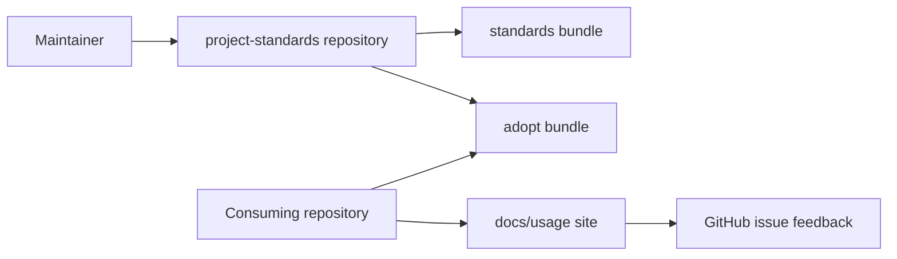
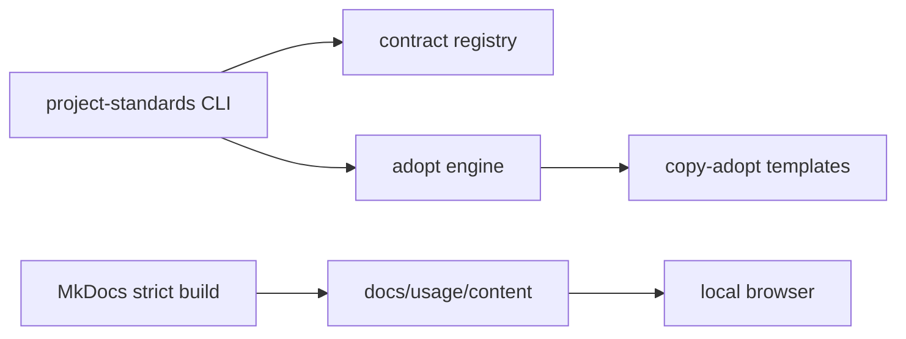
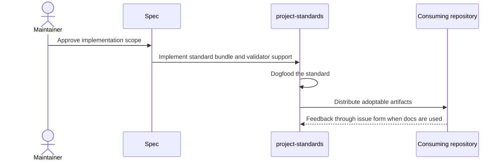

# Usage Documentation Site Distributor and Dogfood — Specification (Standard)

## Revision History

| Version | Date | Author | Change |
| ------- | ---- | ------ | ------ |
| 0.1 | 2026-07-08 | ChatGPT | Initial conformant Project Specification draft |

**Spec lifecycle:** This document is living until `approved`, then change-controlled. Implementation deviations are recorded in the Deviations Log, not silently patched into requirements.

---

## 1. Purpose & Background

Define distributor-repository requirements for shipping `usage-documentation-site` from `L3DigitalNet/project-standards` and adopting it in the same repository as proof that every governed standard interoperates without conflict.

---

## 2. Scope

### 2.1 In Scope

- Distributor-specific registry, versioning, packaging, and release work.
- Dogfood adoption under `docs/usage/` in `project-standards`.
- Proof that the new standard works with all governed standards.
- Example content and validation commands for the distributor repository.

### 2.2 Out of Scope (Non-Goals — never)

| ID     | Non-Goal                                                                   | Reason                                                                  |
| ------ | -------------------------------------------------------------------------- | ----------------------------------------------------------------------- |
| NG-001 | Replacing developer documentation, ADRs, project specs, or handoff systems | The new standard is strictly for user-facing usage documentation sites. |
| NG-002 | Creating a hosted public documentation platform                            | The standard governs repo-local local-browser sites only.               |
| NG-003 | Consuming-repo-specific tool content beyond distributor dogfood example    | Consumers own their own usage pages.                                    |

### 2.3 Won't Have in v1 (deferred — not never)

| ID     | Deferred Capability                       | Why Deferred                                       | Revisit When                               |
| ------ | ----------------------------------------- | -------------------------------------------------- | ------------------------------------------ |
| WH-001 | Full prose-style linting with Vale        | Useful but subjective and likely noisy in v1       | Repeated content-quality drift appears     |
| WH-002 | External link checking as a required gate | Network checks are flaky in CI                     | A stable allowlist and retry policy exists |
| WH-003 | Release without dogfood adoption          | Owner requires dogfood for every governed standard | Never for this standard                    |

### 2.4 Boundaries

| Boundary               | Description                                                                                                      |
| ---------------------- | ---------------------------------------------------------------------------------------------------------------- |
| Distributor owns       | `project-standards` standard text, templates, schemas, validators, registry entries, tests, and dogfood example. |
| Consuming repo owns    | Actual tool-specific usage content and local adoption ADRs.                                                      |
| External platform owns | GitHub Issues UI and permissions; MkDocs and Material runtime behavior.                                          |

---

## 3. Context

### 3.1 Current State

The distributor repository dogfoods several standards but does not yet dogfood a usage-documentation-site standard because the standard does not exist. The existing CLI usage reference lives at `docs/usage.md`.

### 3.2 Target State

`L3DigitalNet/project-standards` contains and validates the new standard, adopts it locally under `docs/usage/`, and uses that dogfood site as an example for consuming repositories.

### 3.3 Assumptions

| ID    | Assumption                                                                                 | Impact if False                                                                        |
| ----- | ------------------------------------------------------------------------------------------ | -------------------------------------------------------------------------------------- |
| A-001 | Consuming repositories can install MkDocs and Material as development dependencies.        | Adoption must document a non-Python invocation equivalent.                             |
| A-002 | GitHub issue forms are acceptable feedback intake for repositories that use GitHub Issues. | The feedback mechanism must be optional or repo-local alternatives must be documented. |

### 3.4 Constraints

| ID    | Constraint                                                                       | Source                        |
| ----- | -------------------------------------------------------------------------------- | ----------------------------- |
| C-001 | Do not conflict with Markdown Frontmatter validation.                            | Markdown Frontmatter Standard |
| C-002 | Do not conflict with `docs/usage.md` in the existing CLI Documentation Standard. | CLI Documentation Standard    |
| C-003 | Every governed standard must be dogfooded by the distributor repository.         | Owner decision in this task   |
| C-004 | Dogfood adoption is mandatory for every standard governed by this repository.    | Owner direction in this task  |

---

## 4. Goals

| ID    | Goal                                  | Success Signal                                                       | Achieved By            |
| ----- | ------------------------------------- | -------------------------------------------------------------------- | ---------------------- |
| G-001 | Ship as a distributor standard        | Standards index, registry, versioning, and adopt bundles are updated | FR-001, FR-002, FR-003 |
| G-002 | Dogfood inside distributor repository | `docs/usage/` exists and builds strictly                             | FR-004, FR-005         |
| G-003 | Prove interoperability                | All existing validation gates pass together                          | FR-006                 |

---

> **§5 (Stakeholders and Users) is Full-tier** and is intentionally omitted at the Standard profile.

## 6. Glossary

| Term                     | Definition                                                                                       | Notes                                      |
| ------------------------ | ------------------------------------------------------------------------------------------------ | ------------------------------------------ |
| Distributor repository   | `L3DigitalNet/project-standards`, the source of truth for standards and adoption artifacts.      | Not the same as a consuming repository.    |
| Consuming repository     | A repository that adopts one or more standards from `project-standards`.                         | Owns its local content and deviations.     |
| Usage documentation site | A repo-local MkDocs and Material site for user-facing instructions about using tools.            | Not developer documentation.               |
| Dogfood adoption         | The distributor repository adopts and validates the standard it governs.                         | Required as interoperability proof.        |
| Distributable standard   | A standard shipped by `project-standards` with registry, docs, templates, and adoption behavior. | May be copy-adopted or validator-enforced. |

---

## 7. Requirements

### 7.1 Functional Requirements

| ID     | Requirement                                                                                | Rationale                                                      | Acceptance Criteria                                                                    | Priority |
| ------ | ------------------------------------------------------------------------------------------ | -------------------------------------------------------------- | -------------------------------------------------------------------------------------- | -------- |
| FR-001 | The distributor shall add the new standard to `standards/README.md`.                       | The standards index is the entry point for governed standards. | Index row links bundle and adopt guide.                                                | Must     |
| FR-002 | The distributor shall update registry and CLI parity lists for `usage-documentation-site`. | Adopt/list commands enforce parity.                            | `project-standards list` succeeds.                                                     | Must     |
| FR-003 | The distributor shall update `meta/versioning.md` for the new contract marker.             | Consumers need release-contract semantics.                     | Versioning table includes `usage_documentation_site.version`.                          | Must     |
| FR-004 | The distributor shall adopt the standard in `project-standards` under `docs/usage/`.       | Dogfood is mandatory demonstration and interoperability proof. | Dogfood files exist and strict build passes.                                           | Must     |
| FR-005 | The dogfood site shall document the user-facing usage of the `project-standards` tools.    | The repository must model the standard it ships.               | Site contains user-facing pages for the public command surface.                        | Must     |
| FR-006 | The distributor shall validate every governed standard together after adoption.            | Interoperability is the proof point.                           | Repository validation, spec validation, Markdown checks, and MkDocs strict build pass. | Must     |

### 7.2 Non-Functional Requirements

| ID      | Category         | Requirement                                                                                         | Measurement / Acceptance Criteria                      | Priority |
| ------- | ---------------- | --------------------------------------------------------------------------------------------------- | ------------------------------------------------------ | -------- |
| NFR-001 | Maintainability  | The implementation shall avoid creating parallel governance, validation, or instruction systems.    | Review confirms reuse of existing standards patterns.  | Must     |
| NFR-002 | Interoperability | The implementation shall pass alongside all other governed standards in the distributor repository. | Full repository validation gate passes.                | Must     |
| NFR-003 | Usability        | The adopted site shall be viewable in a local browser with one documented command.                  | `mkdocs serve` command works from the repository root. | Must     |

### 7.3 Interface Requirements

| ID     | Interface             | Requirement                                                                                                                                    | Contract / Format               | Acceptance Criteria                             |
| ------ | --------------------- | ---------------------------------------------------------------------------------------------------------------------------------------------- | ------------------------------- | ----------------------------------------------- |
| IR-001 | project-standards CLI | The system shall expose the standard through `project-standards list` and adoption through `project-standards adopt usage-documentation-site`. | Existing adopt/list conventions | Commands return expected output.                |
| IR-002 | MkDocs site           | The system shall expose a local browser-readable documentation site from `docs/usage/mkdocs.yml`.                                              | MkDocs config contract          | Strict build passes.                            |
| IR-003 | GitHub issue form     | The system shall expose section feedback through `.github/ISSUE_TEMPLATE/tool-feedback.yml`.                                                   | GitHub issue-form contract      | Prefilled fields match the JavaScript contract. |
| IR-004 | Dogfood usage site    | The system shall expose the distributor repository usage docs from `docs/usage/`.                                                              | MkDocs local site               | Site builds and is navigable                    |

### 7.4 Data Requirements

| ID     | Data Entity           | Requirement                                                                                                                            | Validation Rules                                 | Ownership                                  |
| ------ | --------------------- | -------------------------------------------------------------------------------------------------------------------------------------- | ------------------------------------------------ | ------------------------------------------ |
| DR-001 | Standard bundle files | The system shall store governing standard text, adoption runbook, examples, templates, resources, and schemas in the standards bundle. | Paths match bundle anatomy.                      | Distributor repository                     |
| DR-002 | Adopt bundle files    | The system shall store copy-adopt artifacts under the packaged adopt bundle.                                                           | Manifest paths resolve and tests pass.           | Distributor repository                     |
| DR-003 | Usage site files      | The system shall store dogfood and consumer site files under `docs/usage/`.                                                            | Generated output ignored; content pages managed. | Consuming repository or dogfood repository |
| DR-004 | Dogfood content       | The system shall store distributor usage-site content under `docs/usage/content/`.                                                     | Canonical frontmatter and nav coverage.          | Distributor repository                     |

---

## 8. Architecture and Design

### 8.1 Architecture Summary

The distributor implementation has two tracks: shipping the standard to consumers and adopting the standard locally. Both must land together so the repository proves the new standard works with the existing standards suite.

### 8.2 Architecture Views

#### 8.2.1 Context View

#### 8.2.2 Container / Deployment View

#### 8.2.3 Component View

| Component                   | Responsibility                  | Interfaces                                                | Notes                        |
| --------------------------- | ------------------------------- | --------------------------------------------------------- | ---------------------------- |
| Distributor standard bundle | Normative standard and examples | `standards/usage-documentation-site/`                     | Governs consumers            |
| Packaged adopt bundle       | Templates and fragments         | `src/project_standards/bundles/usage-documentation-site/` | Distributed by CLI           |
| Dogfood site                | Local example and proof         | `docs/usage/`                                             | Validated in repository gate |

### 8.3 Design Decisions

| ID    | Decision                                                               | Rationale                                                                   | Alternatives Considered                                   | ADR           |
| ----- | ---------------------------------------------------------------------- | --------------------------------------------------------------------------- | --------------------------------------------------------- | ------------- |
| D-001 | Dogfood adoption is mandatory in the same implementation.              | A standard should prove interoperability in the repository that governs it. | Ship standard first and dogfood later; rejected by owner. | TBD local ADR |
| D-002 | Dogfood site should absorb or supersede `docs/usage.md` intentionally. | Avoids two canonical usage docs.                                            | Leave both without guidance; rejected.                    | TBD local ADR |

> **§8.4 (Solution Alternatives Considered) is Full-tier** and is intentionally omitted at the Standard profile.

### 8.5 Design Constraints

- The implementation must follow existing `project-standards` bundle, registry, and validation conventions.
- The implementation must not create a second governance system outside existing standards, ADR, and Project Specification mechanisms.
- The implementation must keep user-facing usage content separate from developer, specification, ADR, and handoff content.

> **§8.6 (Dependency Policy) is Full-tier** and is intentionally omitted at the Standard profile.

---

## 9. Data Model

The system owns repository files, configuration keys, schema files, and validation findings rather than runtime application data. Persistent state is Git history and the files committed to the distributor or consuming repository.

| ID     | Data Entity           | Requirement                                                                                                                            | Validation Rules                                 | Ownership                                  |
| ------ | --------------------- | -------------------------------------------------------------------------------------------------------------------------------------- | ------------------------------------------------ | ------------------------------------------ |
| DR-001 | Standard bundle files | The system shall store governing standard text, adoption runbook, examples, templates, resources, and schemas in the standards bundle. | Paths match bundle anatomy.                      | Distributor repository                     |
| DR-002 | Adopt bundle files    | The system shall store copy-adopt artifacts under the packaged adopt bundle.                                                           | Manifest paths resolve and tests pass.           | Distributor repository                     |
| DR-003 | Usage site files      | The system shall store dogfood and consumer site files under `docs/usage/`.                                                            | Generated output ignored; content pages managed. | Consuming repository or dogfood repository |
| DR-004 | Dogfood content       | The system shall store distributor usage-site content under `docs/usage/content/`.                                                     | Canonical frontmatter and nav coverage.          | Distributor repository                     |

---

## 10. Behavior and Workflows

### 10.1 Primary Workflow

Steps:

1. Implement distributor standard and adopt bundle.
2. Update registry, CLI, validation config, versioning, tests, and standards index.
3. Adopt the standard in the distributor repository.
4. Migrate or cross-link existing CLI usage content into the dogfood site.
5. Run every relevant validation gate.
6. Record local adoption ADR under `docs/decisions/`.

Expected result:

> The distributor repository contains a tested, registered, dogfooded `usage-documentation-site` standard that consuming repositories can adopt consistently.

### 10.2 Alternate Workflows

| ID     | Trigger                 | Behavior                                 | Expected Result                                                        |
| ------ | ----------------------- | ---------------------------------------- | ---------------------------------------------------------------------- |
| AW-001 | No dogfood adoption     | Ship standard as templates only          | Rejected by owner direction                                            |
| AW-002 | Dogfood in another repo | Use a sample repo instead of distributor | Rejected because interoperability must be proven in the governing repo |

### 10.3 Edge Cases

| ID     | Edge Case                                           | Expected Behavior                                                         |
| ------ | --------------------------------------------------- | ------------------------------------------------------------------------- |
| EC-001 | Dogfood build fails due to existing docs conflicts  | Release is blocked until compatibility is fixed                           |
| EC-002 | Existing CLI usage reference too large for one page | Split into tool pages while preserving CLI Documentation content contract |

### 10.4 State Transitions

| State       | Meaning                                      | Entry Condition            | Exit Condition |
| ----------- | -------------------------------------------- | -------------------------- | -------------- |
| Not Shipped | Standard absent                              | Implementation begins      | Implemented    |
| Implemented | Standard files exist                         | Dogfood adoption completes | Dogfooded      |
| Dogfooded   | Repository validates standard against itself | Release tag cut            | Released       |

---

## 11. UI Pages / API Endpoints

This work has no hosted UI or API surface. The relevant user surfaces are local MkDocs pages, GitHub issue forms, and CLI commands.

| Page or Endpoint    | Purpose                | Key Actions                   | Authorization          |
| ------------------- | ---------------------- | ----------------------------- | ---------------------- |
| Dogfood MkDocs site | Example usage docs     | Browse and search local docs  | Maintainer or consumer |
| Standards bundle    | Distributor standard   | Read rules and adopt guide    | Consumer agent         |
| Adopt CLI           | Distribution mechanism | Seed consuming repo artifacts | Consumer agent         |

**Accessibility & i18n:** v1 targets readable local-browser documentation in English. Formal localization is out of scope, but the content must avoid encoding implementation-only jargon into user-facing pages.

---

## 12. Error Handling and Recovery

### 12.1 Expected Failures

| ID      | Failure Mode                              | User/System Behavior         | Logging / Observability             | Recovery                                 |
| ------- | ----------------------------------------- | ---------------------------- | ----------------------------------- | ---------------------------------------- |
| ERR-001 | Dogfood omitted                           | Standard ships without proof | Acceptance check fails              | Add dogfood adoption before release      |
| ERR-002 | Standards conflict emerges during dogfood | Validation or review fails   | Failing command identifies conflict | Amend standard or sibling before release |

### 12.2 Retry and Idempotency

Adoption must remain idempotent. Existing file artifacts are skipped unless the operator explicitly passes `--force`; fragments are reported for manual merging. Validation commands must be safe to rerun.

### 12.3 Rollback / Recovery

Rollback is Git-based. Revert the implementation commit, remove generated scratch output, and rerun the repository validation gate. Consuming repositories recover by reverting the adoption commit or deleting the `docs/usage/` subtree and issue form if adoption was not yet accepted.

---

## 13. Security and Privacy

### 13.1 Authentication

GitHub authentication is required only for repository writes and issue creation in private repositories. Local MkDocs preview does not require authentication.

### 13.2 Authorization

| Actor / Role        | Allowed Actions                                  | Denied Actions                                          |
| ------------------- | ------------------------------------------------ | ------------------------------------------------------- |
| Maintainer          | Create and merge standard implementation changes | Bypass required validation without documented deviation |
| Consuming repo user | Read and use docs, submit feedback issues        | Change distributor standard unless authorized           |

### 13.3 Secrets

| Secret              | Storage Location                   | Access Pattern | Rotation / Notes                                              |
| ------------------- | ---------------------------------- | -------------- | ------------------------------------------------------------- |
| GitHub token for CI | GitHub Actions secret or app token | Workflow only  | Managed by repository policy; never documented in usage pages |

### 13.4 Sensitive Data

| Data                   | Classification                       | Storage       | Transmission   | Retention               |
| ---------------------- | ------------------------------------ | ------------- | -------------- | ----------------------- |
| Issue feedback content | Internal or public depending on repo | GitHub Issues | GitHub web/API | Repository issue policy |

### 13.5 Threats and Mitigations

| Threat                                         | Impact                                                                 | Mitigation                                                                                    |
| ---------------------------------------------- | ---------------------------------------------------------------------- | --------------------------------------------------------------------------------------------- |
| Prompt injection through docs or issue content | Future agents may treat user-facing prose or feedback as instructions. | Agent-instruction fragments must classify docs and issues as data, not authority.             |
| Private repository feedback leakage            | Prefilled local URLs or issue content may expose internal context.     | Only path, section, anchor, URL, and user-provided fields are captured; no secrets are added. |

### 13.6 Hardening Checklist

- [ ] GitHub issue-form labels and permissions reviewed.
- [ ] Feedback links do not leak secrets.
- [ ] Generated site output is not committed.
- [ ] CI uses pinned project-standards release refs where reusable workflows are involved.

---

> **Sections §14 (Capacity and Scale Assumptions), §15 (Risks), and §16 (Compliance, Licensing, and Data Rights) are Full-tier** and are intentionally omitted at the Standard profile.

## 17. Testing and Acceptance

### 17.1 Definition of Done

- [ ] All Must requirements implemented.
- [ ] Registry, adopt, validation, and dogfood tests pass.
- [ ] The standard documentation and templates are validated or intentionally excluded according to repository policy.
- [ ] The `project-standards` repository adopts and dogfoods the new usage documentation site.
- [ ] Compatibility text is added to affected sibling standards.
- [ ] Deviations Log reviewed and accepted by owner.

### 17.2 Test Strategy

| Layer                 | Scope                                                  | Required Coverage                             | Required? |
| --------------------- | ------------------------------------------------------ | --------------------------------------------- | --------- |
| Unit / domain         | registry, manifest, schema helper, and validator logic | success and failure cases                     | Yes       |
| Integration / adapter | adopt dry-run and scratch-repo adoption                | expected artifacts and idempotency            | Yes       |
| Snapshot / contract   | template and schema fixtures                           | controlled output diff reviewed intentionally | Yes       |
| End-to-end            | dogfood MkDocs strict build                            | site builds and feedback assets are present   | Yes       |
| Dogfood               | full distributor repository                            | all governed standards pass together          | Yes       |

### 17.3 Requirement-to-Test Traceability

| Requirement ID | Test / Verification Method                                  | Status      |
| -------------- | ----------------------------------------------------------- | ----------- |
| FR-001         | `standards/README.md` contains new row                      | Not Started |
| FR-002         | `project-standards list` succeeds and includes new standard | Not Started |
| FR-003         | `meta/versioning.md` includes contract marker               | Not Started |
| FR-004         | `docs/usage/mkdocs.yml` and content exist                   | Not Started |
| FR-005         | Dogfood site covers public `project-standards` tool usage   | Not Started |
| FR-006         | Full repository validation gate passes                      | Not Started |

---

## 18. Deployment and Operations

### 18.1 Runtime Environment

| Item              | Value                                                                 |
| ----------------- | --------------------------------------------------------------------- |
| Runtime           | Python package plus Node-free MkDocs runtime from Python dependencies |
| OS / Platform     | Linux CI and local developer machines                                 |
| Datastore         | Git repository files only                                             |
| External services | GitHub Issues for feedback intake                                     |

Runtime services:

| Service             | Purpose                    | Start Mode       | Health Signal                           |
| ------------------- | -------------------------- | ---------------- | --------------------------------------- |
| MkDocs local server | Preview usage docs locally | Manual command   | Browser loads local site                |
| GitHub Issues       | Capture section feedback   | Hosted by GitHub | Issue form opens with prefilled context |

### 18.2 Configuration

| Setting                          | Required? | Default              | Description                                 |
| -------------------------------- | --------- | -------------------- | ------------------------------------------- |
| usage_documentation_site.version | Yes       | 1.0                  | Contract marker in `.project-standards.yml` |
| docs/usage/mkdocs.yml            | Yes       | provided by template | MkDocs site configuration                   |
| tool-feedback.yml                | Yes       | provided by template | GitHub issue-form contract                  |

**Environment matrix** — differences between environments:

| Aspect                                | Dev                | Staging                   | Prod                                |
| ------------------------------------- | ------------------ | ------------------------- | ----------------------------------- |
| Secrets source / auth / external APIs | Local Git checkout | GitHub repository with CI | GitHub repository with released tag |

### 18.3 Deployment Flow

1. Implement the standard bundle, adopt bundle, registry updates, validators, tests, and dogfood site in one branch.
2. Run the full repository validation gate.
3. Review generated or adopted files for accidental developer-content leakage into user-facing docs.
4. Merge to `main` after checks pass.
5. Cut the appropriate `project-standards` release according to `meta/versioning.md`.
6. Consumers adopt from the released tag.
7. Rollback by reverting the release commit before retagging if the release has not been published; after publication, follow release-policy correction guidance.

> **§18.4 (Rollout Controls) is Full-tier** and is intentionally omitted at the Standard profile.

### 18.5 Observability

Minimum signals:

- `project-standards list` shows the new standard.
- `project-standards adopt usage-documentation-site --dry-run` reports expected artifacts.
- `project-standards validate --config .project-standards.yml` passes.
- `project-standards spec validate --config .project-standards.yml` passes for these specs when included.
- `mkdocs build --strict -f docs/usage/mkdocs.yml` passes after dogfood adoption.

| Alert                         | Trigger                             | Severity | Owner / Action                                        |
| ----------------------------- | ----------------------------------- | -------- | ----------------------------------------------------- |
| Usage-site validation failure | A required validation command fails | Warning  | Fix the standard or record a deviation before release |

### 18.6 Backup and Disaster Recovery

The system owns no external durable runtime data. Git history is the recovery mechanism for standard text, templates, schemas, and code.

### 18.7 Documentation Deliverables

Checklist tied to the DoD:

- [ ] Dogfood usage site.
- [ ] Dogfood adoption ADR.
- [ ] Updated standards index and versioning docs.
- [ ] Migration note for `docs/usage.md`.

---

## 19. Implementation Plan

### MS-0 — Distributor integration

1. Standard registered and adoptable.
2. List and adopt dry-run pass.
### MS-1 — Dogfood adoption

1. Repository adopts its own site.
2. MkDocs strict build passes.
### MS-2 — Interoperability proof

1. All standards validate together.
2. Repository gate passes.
### MS-3 — Release

1. Release notes and migration notes complete.
2. Consumers can adopt from tagged release.

### Milestone Summary

| Milestone                    | Deliverable                                | Exit Criteria                           |
| ---------------------------- | ------------------------------------------ | --------------------------------------- |
| MS-0 Distributor integration | Standard registered and adoptable          | List and adopt dry-run pass             |
| MS-1 Dogfood adoption        | Repository adopts its own site             | MkDocs strict build passes              |
| MS-2 Interoperability proof  | All standards validate together            | Repository gate passes                  |
| MS-3 Release                 | Release notes and migration notes complete | Consumers can adopt from tagged release |

---

> **§20 (Success Evaluation) is Full-tier** and is intentionally omitted at the Standard profile.

## 21. Open Questions and Decisions

| ID     | Question                                                                                      | Current Assumption                                                         | Blocking? | Owner | Needed By | Status |
| ------ | --------------------------------------------------------------------------------------------- | -------------------------------------------------------------------------- | --------- | ----- | --------- | ------ |
| OQ-001 | Should dogfood fully migrate `docs/usage.md` into `docs/usage/content/` in the first release? | Yes unless implementation risk suggests a temporary compatibility pointer. | No        | Owner | MS-1      | Open   |

---

## Deviations Log

| ID      | Spec Reference | Deviation                            | Reason | Approved? |
| ------- | -------------- | ------------------------------------ | ------ | --------- |
| DEV-001 | None           | No deviations recorded in this draft | N/A    | Pending   |

---

## References

### Standards

- Project Specification Standard.
- Markdown Frontmatter Standard.
- Markdown Tooling Standard.
- Python Tooling SSOT Standard.
- ADR Standard.
- CLI Documentation Standard.

### Project References

- standards/README.md
- meta/versioning.md
- docs/usage.md
- .project-standards.yml

---

## Appendix A: ID Conventions

Stable IDs allow requirements to be referenced from commits, tests, issues, ADRs, and review comments. Section numbers match the Project Specification Standard's Standard profile.

| Prefix | Meaning | Defined In |
| ------ | ------- | ---------- |
| `G-` | Goal | §4 |
| `NG-` | Non-goal (never) | §2.2 |
| `WH-` | Won't have in v1 (deferred) | §2.3 |
| `A-` | Assumption | §3.3 |
| `C-` | Constraint | §3.4 |
| `FR-` | Functional requirement | §7.1 |
| `NFR-` | Non-functional requirement | §7.2 |
| `IR-` | Interface requirement | §7.3 |
| `DR-` | Data requirement | §7.4 |
| `D-` | Design decision | §8.3 |
| `AW-` | Alternate workflow | §10.2 |
| `EC-` | Edge case | §10.3 |
| `ERR-` | Error-handling requirement | §12.1 |
| `MS-` | Milestone | §19 |
| `OQ-` | Open question | §21 |
| `DEV-` | Deviation | Deviations Log |

The `R-` prefix is Full-tier and is not used at the Standard profile. Priority values are column values, not ID prefixes; IDs never change when priorities do.

---

## Appendix B: Agent Implementation Contract

Binding when this spec is implemented by a coding agent.

### B.1 Implementation Rules

The implementer shall:

- read this entire specification before making changes;
- preserve all explicit non-goals, won't-haves, constraints, and design constraints;
- treat Must requirements as mandatory and blocking open questions as hard stops for affected work;
- record any underspecified behavior as an `OQ-` row with a proposed default assumption;
- record any implementation divergence as a `DEV-` row rather than adapting silently;
- add or update tests for every implemented requirement;
- keep §17.3 current as completion evidence;
- follow the milestone order in §19;
- prefer small, reviewable changes.

### B.2 Prohibited Behaviors

The implementer shall not:

- invent requirements not present in this spec;
- remove existing behavior unless explicitly required;
- introduce external services or dependencies not agreed with the owner without an approved open question;
- store secrets in source control or print them in CI logs;
- ignore failing tests unrelated to the change without documenting them;
- treat examples as exhaustive or normative unless explicitly stated;
- mark a requirement complete without a verification entry in §17.3.

### B.3 Required Completion Report

At completion, provide:

- summary of changes and files changed;
- requirements implemented, each mapped to the test or command that proves it;
- tests added or changed;
- deviations and their approval status;
- known limitations and remaining open questions;
- documentation deliverables completed.

### B.4 Session Handoff

For multi-session implementations, record current milestone, in-progress requirement IDs, and unresolved open questions or deviations in the repository's session-state or handoff documents according to repository convention.

---

> **Appendix C (Optional Modules) is Full-tier** and is intentionally omitted at the Standard profile.

## Appendix D: Tailoring

This specification uses the Standard profile because the change spans one repository, several standards, packaged CLI behavior, validation machinery, and dogfooding requirements, but it does not introduce durable runtime data or external production services.

| Profile | Use For | Decision |
| --- | --- | --- |
| Light | Small single-session changes | Too small for this standard addition. |
| Standard | Typical feature or standards-bundle work | Selected. |
| Full | Multi-service systems, durable data, or external integrations | Not required for this change. |

Upgrade to Full only if the implementation introduces a durable service, external integration, release orchestration system, or substantial runtime data model beyond standard repository files.

