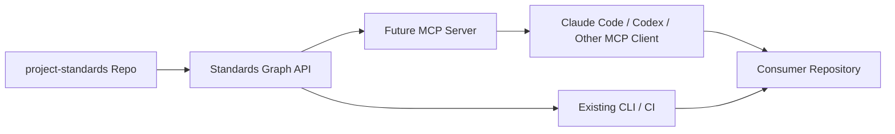
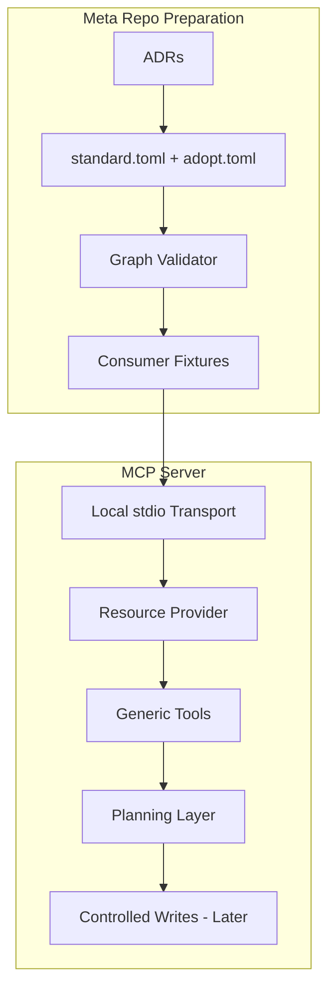
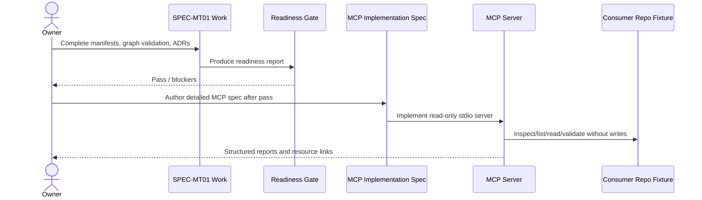
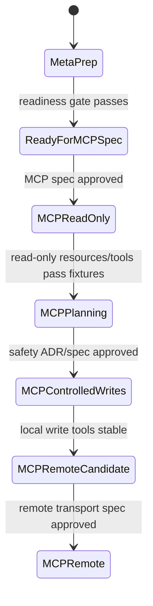

# Project Standards MCP Enablement Roadmap — Specification (Full)

## Revision History

| Version | Date | Author | Change |
| --- | --- | --- | --- |
| 0.5 | 2026-07-09 | Coding agent | Added package-methodology ADR references so future MCP phases inherit adoption, lifecycle, provenance, versioning, and skill-installation policy. |
| 0.4 | 2026-07-09 | Coding agent | Resolved accepted ADR references while leaving future MCP ADR placeholders unchanged. |
| 0.3 | 2026-07-07 | ChatGPT | Review pass: aligned sequencing with independent-standard-package validation, SDK caution, and tool/resource safety constraints. |
| 0.2 | 2026-07-07 | ChatGPT | Normalized `spec_id` from mnemonic placeholder to Project Spec-compatible `SPEC-[0-9A-Z]{4}` form and updated prior-spec references. |
| 0.1 | 2026-07-07 | ChatGPT | Initial ordered roadmap from meta-repository preparation through future MCP server implementation. |

**Spec lifecycle:** This document is living until `approved`, then change-controlled. This roadmap depends on the meta-repository preparation spec (`SPEC-MT01`) and includes MCP server design/implementation only after the readiness gate passes.

---

## 1. Purpose & Background

This roadmap defines the ordered design and implementation sequence for turning the `project-standards` repository into a scalable standards platform and then building a Project Standards MCP server on top of that platform.

The key sequencing rule is:

> Do not build the MCP server until the standards repository is manifest-driven, graph-validated, and composition-safe enough that the server can remain generic.

Without that ordering, the MCP server would likely hardcode today's standards, duplicate repository policy in server code, and make every new standard a server maintenance event. With the ordering in this roadmap, the repository first becomes self-describing and proves that standards remain independently adoptable by default; only then does the MCP server become a thin local server that exposes repository resources, generic planning/validation/drift tools, and standard-defined prompts.

This roadmap is not the detailed MCP implementation spec. It is the program plan and dependency order. It states what must exist before each phase starts, what each phase must deliver, and what gates must pass before proceeding.

---

## 2. Scope

### 2.1 In Scope

- Ordered implementation phases from baseline inventory through MCP server hardening.
- Explicit sequencing to prove independent standard packages and relationship metadata before MCP consumes the graph.
- Dependencies and exit criteria for each phase.
- Design gates that prevent premature MCP implementation.
- A no-hard-dependency gate proving standards remain independently adoptable before MCP tooling relies on the graph.
- Required ADR/spec/doc deliverables by phase.
- Future MCP server inclusion at the correct point in the sequence.
- A recommended local-first MCP path: read-only resources first, generic tools second, controlled writes later, remote transport last if ever needed.
- Traceability between roadmap steps, requirements, and validation gates.

### 2.2 Out of Scope (Non-Goals — never)

| ID | Non-Goal | Reason |
| --- | --- | --- |
| NG-001 | Begin MCP implementation before `SPEC-MT01` readiness passes. | Premature implementation would encode missing repository metadata into server code. |
| NG-002 | Build a remote MCP service as the first MCP version. | Local stdio is simpler, safer, and enough for coding-agent workflows. |
| NG-003 | Make MCP required for standards adoption. | Standards must remain consumable through docs, CLI, and CI. |
| NG-004 | Create per-standard MCP tools. | The scalable model is generic tools over manifest-discovered standards. |
| NG-005 | Use MCP as the canonical source of standards truth. | The repository remains canonical; MCP exposes it. |
| NG-006 | Automate destructive writes without explicit review. | MCP tools can be model-controlled; write operations require plan-first and approval boundaries. |
| NG-007 | Introduce hidden hard standard-to-standard dependencies while preparing MCP. | Future MCP must consume an explicit graph; agents must not infer dependency order from prose. |

### 2.3 Won't Have in v1 (deferred — not never)

| ID | Deferred Capability | Why Deferred | Revisit When |
| --- | --- | --- | --- |
| WH-001 | Streamable HTTP remote MCP transport. | Local stdio covers the initial agent workflow and avoids auth/network risk. | After local MCP proves useful and remote/multi-user needs are concrete. |
| WH-002 | GitHub write/mutation tools inside MCP. | Local repo workflows should prove plan/apply semantics first. | After controlled local writes are stable and audited. |
| WH-003 | Semantic contradiction detector for standards prose. | Requires separate review/eval design. | After deterministic graph and resource contracts are stable. |
| WH-004 | Full multi-repo fleet dashboard. | Needs reliable per-repo status and drift primitives first. | After MCP can report one repo accurately. |
| WH-005 | Third-party standard plugin ecosystem. | First-party standard composition must mature first. | After first-party provider model is stable. |

### 2.4 Boundaries

| Boundary | Description |
| --- | --- |
| Roadmap owns | Sequencing, prerequisites, gates, deliverables, and phase dependencies from meta-prep through MCP rollout. |
| Roadmap depends on | `SPEC-MT01`, existing standards repository structure, existing CLI/adopt engine, project-spec tooling, and future MCP implementation specs. |
| Roadmap does not own | The exact MCP code design, exact server SDK choice, remote hosting, or final UX of every MCP client. |

---

## 3. Context

### 3.1 Current State

The standards repository has a strong starting foundation: standards are already organized as bundles, the package already includes validators and adopt tooling, and the Project Specification Standard already defines a machine-checkable spec format with validation/lint/extract/next/new/upgrade commands.

The repository is not yet fully ready for a maximally scalable MCP server because standards are not uniformly self-describing. A future MCP server needs metadata that is currently split across prose, registry entries, package code, adoption manifests, and implicit knowledge. The roadmap therefore begins with repository preparation and only later moves into MCP implementation.

### 3.2 Target State

The final target state is a layered system:

```text
Layer 0 — Canonical standards repository
  Markdown standards, ADRs, templates, examples, schemas, manifests, generated indexes.

Layer 1 — Standards graph package/API
  Loads manifests, validates composition, provides resource/provider indexes.

Layer 2 — Existing CLI and CI
  Enforces standards for humans, agents, and consumer repositories without MCP.

Layer 3 — Project Standards MCP server
  Local stdio server exposing resources, prompts, and generic tools over Layer 1/2.

Layer 4 — Optional future expansion
  Controlled writes, multi-repo reporting, remote transport, GitHub integration.
```

### 3.3 Assumptions

| ID | Assumption | Impact if False |
| --- | --- | --- |
| A-001 | The future MCP server will target coding-agent workflows first. | If human UI is the primary target, roadmap should add UI/reporting work earlier. |
| A-002 | Local stdio MCP is sufficient for v1. | If remote is mandatory, auth and transport design must move earlier and become blocking. |
| A-003 | The standards graph API can be built before MCP and reused by MCP. | If not, MCP would need to own graph logic, which violates the architecture goal. |
| A-004 | Controlled writes are useful but not required for first value. | If writes are mandatory, plan-token and approval semantics become earlier blockers. |
| A-005 | Current repository tests can be expanded without major restructuring. | If not, a test architecture cleanup phase is required before graph validation. |

### 3.4 Constraints

| ID | Constraint | Source |
| --- | --- | --- |
| C-001 | Use the Full Project Specification format. | User instruction. |
| C-002 | `SPEC-MT01` must precede MCP implementation. | Architecture sequencing decision. |
| C-003 | MCP tools remain generic over standards. | Scalability requirement. |
| C-004 | MCP server must not replace docs/CLI/CI. | Standards repository governance requirement. |
| C-005 | Local stdio is preferred before remote transport. | Security and complexity control. |
| C-006 | Sensitive/destructive operations require explicit review and plan-first semantics. | MCP tool safety and agent trust boundary. |

---

## 4. Goals

| ID | Goal | Success Signal | Achieved By |
| --- | --- | --- | --- |
| G-001 | Put the standards repository in ideal MCP-ready condition before server work. | `SPEC-MT01` readiness gate passes. | MS-0 through MS-5 |
| G-002 | Build MCP on stable internal contracts, not hardcoded standards. | MCP reads graph API/manifests and exposes generic resources/tools. | MS-1 through MS-4 |
| G-003 | Deliver value incrementally. | Read-only resource server works before planners, writes, or remote features. | FR-007 through FR-014 |
| G-004 | Keep operations safe. | Write tools require prior plan identity and explicit approval. | FR-015, FR-016 |
| G-005 | Preserve non-MCP usability. | Consumer repos can still adopt and validate standards without MCP. | FR-004, FR-005 |
| G-006 | Make the roadmap actionable by coding agents. | Each phase has dependencies, required inputs, and exit criteria. | §19 |
| G-007 | Preserve independent standard packages through the whole program. | The roadmap blocks MCP implementation until the standards graph proves no hidden hard dependencies and surfaces companion/extension relations. | FR-018, Step 04, Step 06, Step 07 |

---

## 5. Stakeholders and Users

| Role / Stakeholder | Concern | Involvement |
| --- | --- | --- |
| Standards owner / architect | Correct order, durable architecture, no premature server coupling. | Approves phase gates and ADRs. |
| Coding agent implementer | Needs unambiguous step order and exit criteria. | Implements phase work under this roadmap. |
| MCP server implementer | Needs clear prerequisites and server scope. | Starts only after readiness gate. |
| Consumer repo maintainer | Needs current adoption workflows to remain stable. | Tests real-world adoption and drift checks. |
| Human reviewer | Needs evidence that each phase is complete before the next starts. | Reviews completion reports and traceability matrix. |

---

## 6. Glossary

| Term | Definition | Notes / Not to be confused with |
| --- | --- | --- |
| Readiness gate | The set of repository conditions that must pass before MCP design/implementation starts. | Defined by `SPEC-MT01` and this roadmap. |
| Phase gate | Exit criteria that must pass before starting the next major phase. | Stronger than a task checklist. |
| Read-only MCP | MCP server exposing resources/prompts and non-mutating analysis tools only. | First server version. |
| Planning tool | Tool that returns an adoption, validation, drift, or write plan without mutating files. | Required before write tools. |
| Controlled write | Mutating operation constrained by prior reviewed plan and explicit user approval. | Deferred until read-only/planning layers are stable. |
| Generic MCP tool | Tool whose arguments include `standard_id`, operation, repo root, ref, or profile. | Opposite of per-standard tool. |
| Standards graph API | Internal package layer that loads/validates manifests and exposes standard metadata/resources/providers. | MCP consumes it but does not own it. |
| Transport | MCP communication mechanism, e.g. stdio or Streamable HTTP. | Local stdio first; remote deferred. |

---

## 7. Requirements

### 7.1 Functional Requirements

| ID | Requirement | Rationale | Acceptance Criteria | Priority |
| --- | --- | --- | --- | --- |
| FR-001 | The roadmap shall require baseline inventory before design changes. | Existing strengths and gaps must be known before refactoring. | Inventory covers standards, registry, adopt manifests, validators, workflows, tests, and docs. | Must |
| FR-002 | The roadmap shall require ADRs before implementing irreversible architecture choices. | Decisions should be durable and reviewable. | ADRs for manifest model, authority graph, generic tooling interface, provider model, and MCP readiness are approved or explicitly deferred. | Must |
| FR-003 | The roadmap shall require `SPEC-MT01` implementation before MCP implementation. | MCP must consume stable repo contracts. | `SPEC-MT01` Definition of Done passes. | Must |
| FR-004 | The roadmap shall preserve docs/CLI/CI as first-class interfaces. | MCP is optional access/orchestration, not the canonical system. | No phase removes existing non-MCP workflows. | Must |
| FR-005 | The roadmap shall define a standards graph API before MCP server work. | MCP should not duplicate manifest parsing and graph logic. | Graph API has tests and JSON/human CLI output. | Must |
| FR-006 | The roadmap shall require existing standards to be retrofitted before MCP resource exposure. | MCP resources should be complete and uniform. | Existing standards have manifests/resources/authority declarations. | Must |
| FR-007 | The first MCP implementation phase shall be read-only and local. | Early value with low risk. | Local stdio server lists/reads standards resources and returns repo status without writes. | Must |
| FR-008 | MCP resources shall be manifest-generated. | New standards should appear without tool-code updates. | Adding a fixture standard creates resources automatically. | Must |
| FR-009 | MCP tools shall be generic, not per-standard. | Tool surface must remain small and scalable. | Tool list remains stable when a new fixture standard is added. | Must |
| FR-010 | The roadmap shall add planning tools before write tools. | Writes should be reviewable and deterministic. | `adoption_plan`, `drift_plan`, or equivalent exists before any apply tool. | Must |
| FR-011 | The roadmap shall require structured MCP tool outputs. | Agents and clients need reliable parsing and traceability. | Tool outputs include JSON structured content and human text where appropriate. | Should |
| FR-012 | The roadmap shall require validation/drift tools before adoption apply tools. | Users need confidence before mutating repos. | Read-only validation and drift reports work against at least one consumer fixture. | Must |
| FR-013 | The roadmap shall defer remote transport until local MCP proves useful. | Remote transport adds auth and DNS rebinding concerns. | Remote phase remains blocked until local server adoption criteria pass. | Must |
| FR-014 | The roadmap shall require security review before exposing write tools. | MCP tools can perform arbitrary actions if poorly scoped. | Write-tool ADR/spec includes approval, path allowlist, plan identity, and audit behavior. | Must |
| FR-015 | Controlled write tools shall require prior reviewed plan identity. | Prevents agent from applying unreviewed mutation. | Apply tool rejects stale/missing/mismatched plan IDs. | Should |
| FR-016 | The roadmap shall require a separate detailed MCP implementation spec before coding the server. | This roadmap is sequencing, not implementation design. | MCP spec exists and is approved before Step 10 / MS-1 server coding starts. | Must |
| FR-017 | The roadmap shall include fleet/multi-repo reporting only after single-repo accuracy. | Fleet reports multiply errors if primitives are wrong. | Single-repo resource, status, validation, and drift tools pass fixtures first. | Should |
| FR-018 | The roadmap shall require independent-standard-package validation before server implementation. | The MCP server should consume explicit relationships, not infer hidden dependencies. | `SPEC-MT01` graph tests reject hidden hard dependencies and generated indexes show companions/extensions before Step 08 starts. | Must |
| FR-019 | The roadmap shall require MCP protocol/SDK source recheck before dependency selection. | MCP Python SDK and protocol guidance are version-sensitive. | MCP server MS-0 cannot start until the current MCP spec, Python SDK stable/pre-release status, and client compatibility assumptions are rechecked and recorded. | Must |

### 7.2 Non-Functional Requirements

| ID | Category | Requirement | Measurement / Acceptance Criteria | Priority |
| --- | --- | --- | --- | --- |
| NFR-001 | Sequencing | Later phases shall not start until prerequisite gates pass. | Completion report for each milestone names gate evidence. | Must |
| NFR-002 | Safety | Mutating features shall be delayed until read-only and planning features are stable. | No apply/write tools in first MCP release. | Must |
| NFR-003 | Maintainability | MCP implementation shall call internal graph/CLI/provider APIs instead of parsing prose. | Code review verifies no per-standard switch statements except provider registration. | Must |
| NFR-004 | Context efficiency | MCP resources shall support lazy access to standard docs/summaries/templates. | Client can fetch one standard summary without loading all standards. | Must |
| NFR-005 | Portability | Local server shall run from source checkout and installed package. | Tests cover both path assumptions where practical. | Should |
| NFR-006 | Observability | MCP tools shall return explicit findings and traceable resource links. | Structured outputs include rule IDs, standard IDs, paths, severity, and remediation. | Should |
| NFR-007 | Security | Remote transport shall require a separate threat model. | No remote phase begins without security ADR/spec. | Must |

### 7.3 Interface Requirements

| ID | Interface | Requirement | Contract / Format | Acceptance Criteria |
| --- | --- | --- | --- | --- |
| IR-001 | Project specs | Each major phase shall have or reference an approved spec. | Full/Standard/Light project-spec docs as appropriate. | MCP coding does not begin without MCP-specific spec. |
| IR-002 | ADRs | Architecture decisions shall be recorded in ADRs. | ADR Standard. | ADRs referenced from specs and implementation PRs. |
| IR-003 | Internal graph API | MCP shall consume typed graph/resource/provider APIs. | Python package API. | Read-only MCP can list resources from graph. |
| IR-004 | MCP transport | First MCP version shall use stdio. | MCP stdio server process. | Client can launch server locally as subprocess. |
| IR-005 | MCP resources | Standards resources shall use manifest-derived URIs. | `standards://...` scheme or equivalent. | Resource list matches generated index. |
| IR-006 | MCP tools | Tools shall expose generic operations. | Stable tool names and input/output schemas. | New standard fixture does not add tools. |
| IR-007 | Controlled writes | Apply tools shall require plan ID/hash. | Plan output + apply input contract. | Apply rejects mismatched plan. |

### 7.4 Data Requirements

| ID | Data Entity | Requirement | Validation Rules | Ownership |
| --- | --- | --- | --- | --- |
| DR-001 | Roadmap phase | Track step order, prerequisites, required inputs, exit criteria, and unlocks. | Unique step label; dependencies exist; no circular dependency. | This roadmap spec. |
| DR-002 | Readiness gate | Track blocking conditions before MCP. | All Must checklist items pass. | `SPEC-MT01`. |
| DR-003 | MCP resource descriptor | Generated from standard manifests. | URI unique; path exists; MIME/audience declared. | Standards graph API. |
| DR-004 | MCP tool descriptor | Stable generic tool schemas. | Names stable; input/output schema defined; safety class declared. | MCP implementation spec. |
| DR-005 | Plan identity | Identifies reviewed mutation plan. | Hash or opaque ID tied to standard IDs, repo state, and action list. | Future write-tool design. |

---

## 8. Architecture and Design

### 8.1 Architecture Summary

The roadmap uses a staged dependency architecture. First, the repository becomes self-describing and graph-validated. Second, the internal graph API becomes stable enough for consumers. Third, a local read-only MCP server exposes graph-derived resources and generic analysis tools. Fourth, planning tools add structured adoption/drift plans. Fifth, controlled writes are introduced only after the safety model is reviewed. Remote transport and multi-repo reporting remain later optional phases.

### 8.2 Architecture Views

#### 8.2.1 Context View



#### 8.2.2 Container / Deployment View



#### 8.2.3 Component View

| Component | Responsibility | Interfaces | Notes |
| --- | --- | --- | --- |
| `SPEC-MT01` | Defines the meta-repo changes required before MCP. | Full project spec. | Blocking prerequisite. |
| Standards graph API | Provides typed standard/resource/provider graph. | Python API, CLI JSON. | MCP dependency. |
| Read-only MCP server | Exposes standards resources and safe analysis. | MCP stdio. | First server version. |
| Generic MCP tool layer | Provides `standards_list`, `repo_inspect`, `adoption_plan`, `validate_repo`, `drift_check`, etc. | MCP tools with schemas. | No per-standard tools. |
| Controlled write layer | Applies reviewed plans. | MCP tools with plan IDs. | Later phase only. |
| Remote transport layer | Optional Streamable HTTP. | MCP HTTP endpoint. | Requires separate security spec. |

### 8.3 Design Decisions

| ID | Decision | Rationale | Alternatives Considered | ADR |
| --- | --- | --- | --- | --- |
| D-001 | Complete `SPEC-MT01` before MCP implementation. | Prevents hardcoded server assumptions. | Start MCP now and refactor later. | `adr-0012-mcp-readiness-before-server-implementation.md` |
| D-002 | Local stdio first for MCP. | Simplest local agent integration and lowest security surface. | Streamable HTTP first. | `adr-NNNN-local-stdio-first-mcp-transport.md` |
| D-003 | Read-only MCP first. | Early value without mutation risk. | Start with adoption apply/write tools. | `adr-NNNN-read-only-first-mcp-scope.md` |
| D-004 | Generic tools only. | Stable tool surface as standards grow. | Per-standard tools. | `adr-0005-stable-generic-agent-tooling-interface.md` |
| D-005 | Manifest-generated resources. | New standards become visible automatically. | Hardcoded resource list. | `adr-NNNN-manifest-generated-mcp-resources.md` |
| D-006 | Plan-first controlled writes. | Mutations need reviewable intent and replay protection. | Direct apply commands from agent request. | `adr-NNNN-plan-first-controlled-mcp-writes.md` |
| D-007 | Remote transport deferred. | HTTP transport requires auth/origin/security design. | Remote server first. | `adr-NNNN-defer-remote-mcp-transport.md` |
| D-008 | Independent-standard-package validation gates MCP implementation. | MCP must consume a composable graph, not repair dependency problems at runtime. | Let MCP auto-adopt or auto-require standards; rejected. | `adr-0013-independent-standard-packages-and-relationship-taxonomy.md` |
| D-009 | Recheck MCP spec/SDK before implementation starts. | MCP SDK and protocol releases are active; dependency decisions can stale quickly. | Freeze July 2026 research as final; rejected. | `adr-NNNN-mcp-protocol-and-sdk-version-selection.md` |

### 8.4 Solution Alternatives Considered

| Alternative | Why Rejected |
| --- | --- |
| Build MCP immediately from current docs. | Would duplicate implicit repo knowledge and slow future standards additions. |
| Build a CLI-only solution and skip MCP. | CLI remains required, but MCP adds lazy resource and tool integration for agents. |
| Build a remote MCP service first. | Adds security/auth complexity before proving local value. |
| Implement write tools first. | Higher risk; read-only and planning tools deliver value sooner and establish safety contracts. |
| Expose one MCP tool per standard. | Tool surface grows linearly with standards and wastes context. |

### 8.5 Design Constraints

- No MCP coding before `SPEC-MT01` readiness gate.
- No write tools before read-only and planning tools.
- No remote transport before local stdio proof and security spec.
- No per-standard tools unless an approved ADR proves a generic operation cannot represent the need.
- No standards canonical data stored only in MCP server code.
- No hidden mutation; every write requires plan review and explicit authorization.

### 8.6 Dependency Policy

| Dependency | Allowed? | Reason |
| --- | --- | --- |
| MCP Python SDK | Conditional in MCP implementation phase | Exact SDK choice belongs to MCP implementation spec, not this roadmap. |
| Existing `project-standards` package | Yes | Canonical implementation substrate. |
| New web framework | No for local stdio phase | Remote HTTP is deferred. |
| GitHub API client | Deferred | GitHub mutations and fleet reporting are later phases. |
| Persistent database | No for v1 | Local server can derive state from repo files and package metadata. |

---

## 9. Data Model

The roadmap itself uses phase records. The future MCP spec should turn relevant records into implementation tickets or project-spec milestones.

| Field             | Meaning                                                 |
| ----------------- | ------------------------------------------------------- |
| `step_label`      | Ordered phase identifier, e.g. `Step 03`.               |
| `name`            | Short phase name.                                       |
| `depends_on`      | Required earlier phases/gates.                          |
| `required_inputs` | Specs, ADRs, tests, docs, or artifacts needed to start. |
| `deliverables`    | Concrete files/code/docs produced.                      |
| `exit_criteria`   | Observable completion gate.                             |
| `unlocks`         | Next phase(s) allowed after completion.                 |

---

## 10. Behavior and Workflows

### 10.1 Primary Workflow



Steps:

1. Complete baseline inventory and ADR foundation.
2. Implement manifest/graph preparation in `SPEC-MT01`.
3. Retrofit standards and prove composition.
4. Pass MCP-readiness gate.
5. Write and approve detailed MCP implementation spec.
6. Implement local read-only stdio MCP resources.
7. Add generic non-mutating tools.
8. Add planning tools.
9. Add controlled write tools only after a separate safety review.
10. Consider remote/multi-repo features only after local proof.

Expected result:

> The MCP server arrives after the repository is ready, remains generic, and can scale with new standards through manifests and providers.

### 10.2 Alternate Workflows

| ID | Trigger | Behavior | Expected Result |
| --- | --- | --- | --- |
| AW-001 | Readiness gate fails. | Stop MCP work and repair meta-repo blockers. | No server work starts on unstable contracts. |
| AW-002 | MCP client requires an operation not covered by generic tools. | Add to OQ/ADR; prefer generic operation or prompt/resource. | Tool surface remains disciplined. |
| AW-003 | A write use case becomes urgent before planning tools. | Create separate safety spec; do not bypass plan-first order. | Writes remain controlled. |
| AW-004 | Remote MCP becomes mandatory. | Insert security/transport spec before implementation. | Remote is designed, not bolted on. |
| AW-005 | Existing consumer repo reveals standards graph gap. | Treat as regression against `SPEC-MT01`; fix graph/manifest before server workaround. | Repository remains canonical. |

### 10.3 Edge Cases

| ID | Edge Case | Expected Behavior |
| --- | --- | --- |
| EC-001 | New standard added after MCP v1 ships. | MCP resources and generic tools discover it through manifests without new tool names. |
| EC-002 | Standard declares no validator. | MCP reports no validator provider rather than inventing one. |
| EC-003 | Consumer repo has local exception. | MCP reports exception and links ADR/config if declared; otherwise reports unmanaged drift. |
| EC-004 | MCP server sees stale generated index. | It should rely on graph loader or report stale index; not silently trust stale generated docs. |
| EC-005 | Client asks MCP to apply unplanned change. | Apply tool rejects request and asks for a plan-first workflow. |

### 10.4 State Transitions



| State | Meaning | Entry Condition | Exit Condition |
| --- | --- | --- | --- |
| MetaPrep | Repository is being prepared. | Start of roadmap. | `SPEC-MT01` gate passes. |
| ReadyForMCPSpec | Detailed MCP spec may be written. | Manifests/graph/ADRs complete. | MCP implementation spec approved. |
| MCPReadOnly | Local read-only MCP exists. | Stdio server exposes resources and safe status tools. | Read-only fixture tests pass. |
| MCPPlanning | MCP can produce plans/reports. | Generic planning/drift/validation tools work. | Safety design approved. |
| MCPControlledWrites | MCP can apply reviewed plans. | Plan-first write tools exist. | Local use proves stable. |
| MCPRemoteCandidate | Remote may be considered. | Local controlled workflows stable. | Remote security spec approved. |
| MCPRemote | Optional remote MCP exists. | Transport/auth/security implemented. | Ongoing maintenance. |

---

## 11. UI Pages / API Endpoints

No web UI is in scope. Future MCP surfaces are protocol interfaces.

| Surface | Purpose | Key Actions | Authorization |
| --- | --- | --- | --- |
| Local MCP stdio server | Agent-facing local integration. | List/read resources, run generic tools. | User launches local process. |
| MCP resource URIs | Lazy standard content. | Read canonical standard docs/templates/summaries. | Local repo/package read access. |
| MCP tool schemas | Generic actions. | Inspect repo, validate, plan, drift check. | Client/user approval model. |
| Future remote MCP endpoint | Optional later transport. | Same capabilities over HTTP. | Requires separate auth/security design. |

---

## 12. Error Handling and Recovery

### 12.1 Expected Failures

| ID | Failure Mode | User/System Behavior | Logging / Observability | Recovery |
| --- | --- | --- | --- | --- |
| ERR-001 | MCP work requested before readiness. | Roadmap blocks and points to failing readiness items. | Completion report lists blockers. | Finish `SPEC-MT01` gates. |
| ERR-002 | Read-only MCP cannot load graph. | Server fails closed with structured startup error. | stderr/log plus tool/resource error. | Fix graph package/import/config. |
| ERR-003 | Resource path missing. | Resource read returns structured error. | Error includes standard ID and URI. | Fix manifest/resource. |
| ERR-004 | Tool request targets unknown standard. | Tool returns validation error, not fallback guess. | Structured tool error. | Add manifest or correct ID. |
| ERR-005 | Apply requested without plan. | Apply tool refuses. | Tool error says plan required. | Run planning tool first. |
| ERR-006 | Remote transport security unknown. | Remote phase blocked. | OQ/ADR remains open. | Complete remote transport security spec. |

### 12.2 Retry and Idempotency

- Read-only tools may be retried safely.
- Planning tools are deterministic for a given repo state and standards ref.
- Apply tools, once introduced, must bind to a plan ID/hash and target repo state.
- Remote transport retry behavior is deferred to the remote MCP spec.

### 12.3 Rollback / Recovery

If MCP implementation exposes architecture gaps:

1. Stop adding MCP-specific workarounds.
2. Record the gap against `SPEC-MT01` or the MCP implementation spec.
3. Fix the manifest/graph/provider contract first.
4. Regenerate MCP resources/tools from the corrected contract.
5. Add regression tests so the gap does not reappear.

---

## 13. Security and Privacy

### 13.1 Authentication

Local stdio v1 requires no network authentication. The user/client launches the server as a subprocess. Remote authentication is deferred.

### 13.2 Authorization

| Actor / Role | Allowed Actions | Denied Actions |
| --- | --- | --- |
| Local user | Launch MCP server, approve tool calls, review plans. | N/A within local account boundary. |
| MCP server read-only phase | Read manifests, standards resources, consumer repo metadata. | Mutate files, call external services, perform writes. |
| MCP controlled-write phase | Apply approved plans to allowed paths. | Apply unplanned/stale/destructive changes. |
| Remote MCP phase | Deferred. | No remote access until security spec exists. |

### 13.3 Secrets

No secrets are required for local read-only MCP. Remote or GitHub-integrated phases may introduce credentials and require a separate secret model.

| Secret | Storage Location | Access Pattern | Rotation / Notes |
| --- | --- | --- | --- |
| None in v1 | N/A | N/A | Do not add tokens for local read-only server. |

### 13.4 Sensitive Data

| Data | Classification | Storage | Transmission | Retention |
| --- | --- | --- | --- | --- |
| Standards resources | Public/internal depending repo visibility | Local repo/package | Local stdio messages | No separate persistence |
| Consumer repo metadata | Internal | Local repo | Local stdio messages | No separate persistence in v1 |
| Plans/reports | Internal | Optional local files or transient tool results | Local stdio | Defined by MCP implementation spec |
| Secrets | Restricted | Not accessed in v1 | Not transmitted | N/A |

### 13.5 Threats and Mitigations

| Threat | Impact | Mitigation |
| --- | --- | --- |
| Premature MCP hardcoding. | New standards require code changes and server becomes policy source. | Readiness gate and graph API prerequisite. |
| Tool poisoning / untrusted output. | Agent may treat repo data as instructions. | Keep instruction hierarchy explicit; expose standard docs as resources/data. |
| Unsafe write tool. | File corruption or unintended repo mutation. | Read-only first; plan-first writes; explicit approval; path allowlists. |
| Remote local-server attack. | Remote site interacts with local server. | Remote deferred; if used, bind localhost, validate origins, require auth. |
| Overbroad resource exposure. | Sensitive files leak into context. | Manifest-declared resources only; consumer root boundaries. |

### 13.6 Hardening Checklist

- [x] Read-only MCP before writes.
- [x] Local stdio before remote.
- [x] Generic tools before standard-specific exceptions.
- [ ] MCP implementation spec completed before coding server.
- [ ] Write-tool safety ADR completed before apply tools.
- [ ] Remote transport security spec completed before HTTP.
- [ ] Tool outputs structured and sanitized.
- [ ] Resource exposure restricted to manifests and approved repo roots.

---

## 14. Capacity and Scale Assumptions

| Dimension | v1 Expectation | Growth Assumption | Design Consequence |
| --- | --- | --- | --- |
| Standards count | 7–12 | Dozens | Generic tools and manifest resources. |
| Consumer repos | 1–5 early dogfood repos | 20+ personal/org repos | Single-repo accuracy before fleet reporting. |
| MCP clients | Claude Code/Codex-like local agents | More clients later | Use protocol-conformant stdio and stable schemas. |
| Resource count | Hundreds at most | More with examples/templates | Lazy loading and resource annotations. |
| Tool count | Small stable set | Should remain small | Avoid per-standard tools. |

---

## 15. Risks

| ID | Risk | Likelihood | Impact | Mitigation | Owner |
| --- | --- | --- | --- | --- | --- |
| R-001 | MCP work starts before meta readiness. | Med | High | Make readiness gate blocking and ADR-backed. | Standards owner |
| R-002 | Read-only MCP lacks enough value. | Low | Med | Include repo inspection, resource reading, validation status, and drift report in early tools. | MCP spec owner |
| R-003 | Tool surface grows too large. | Med | High | Generic tool ADR; review every proposed new tool as a new operation, not new standard. | MCP owner |
| R-004 | Controlled writes introduce risk. | Med | High | Defer writes; require plan identity and safety spec. | Security reviewer |
| R-005 | Different MCP clients behave differently. | Med | Med | Keep server protocol-simple, structured, and local first. | MCP implementer |
| R-006 | Remote transport becomes tempting too early. | Med | High | Explicitly defer until local adoption criteria pass. | Standards owner |
| R-007 | Standards graph API is too coupled to MCP. | Low | High | Build graph API for CLI/CI first; MCP consumes it later. | Tooling owner |

---

## 16. Compliance, Licensing, and Data Rights

- [ ] MCP SDK licensing reviewed before adding dependency.
- [ ] No remote data transmission in local read-only v1.
- [ ] Consumer repo privacy boundaries documented before repo inspection tools ship.
- [ ] Remote transport threat model completed before HTTP.
- [ ] Any GitHub integration reviews token scopes and repository access boundaries.

---

## 17. Testing and Acceptance

### 17.1 Definition of Done

- [ ] `SPEC-MT01` readiness gate passes.
- [ ] Required ADRs for MCP sequencing are approved.
- [ ] Detailed MCP implementation spec is created and approved before MCP coding.
- [ ] Read-only local MCP can list/read manifest-generated standards resources.
- [ ] Generic tools work against a standards repo and at least one consumer fixture.
- [ ] Adding a fixture standard changes resources/data but not top-level tools.
- [ ] Planning tools precede write tools.
- [ ] Write tools, if implemented, reject missing/stale/mismatched plan identity.
- [ ] Remote transport remains deferred unless separately approved.

### 17.2 Test Strategy

| Layer | Scope | Required Coverage | Required? |
| --- | --- | --- | --- |
| Meta readiness | `SPEC-MT01` graph/manifests/fixtures. | All Must readiness checks. | Yes |
| MCP unit | Resource URI generation, tool schemas, structured outputs. | Valid/invalid arguments and unknown standards. | Yes for MCP phase |
| MCP integration | Local stdio server lifecycle. | Start server, initialize, list resources/tools, read resource, call tools. | Yes for MCP phase |
| Consumer fixture | Repo inspection, adoption plan, validate, drift check. | At least one Python/docs repo fixture. | Yes |
| Safety | Controlled write plan/apply. | Missing plan, stale plan, path escape, symlink/path allowlist. | Required before write phase |
| Remote | HTTP transport/auth/origin. | Deferred. | No for v1 |

### 17.3 Requirement-to-Test Traceability

| Requirement ID | Test / Verification Method | Status |
| --- | --- | --- |
| FR-001 | Baseline inventory artifact. | Not Started |
| FR-002 | ADR files and review checklist. | Not Started |
| FR-003 | `SPEC-MT01` completion report. | Not Started |
| FR-004 | Existing CLI/docs/CI tests remain passing. | Not Started |
| FR-005 | Standards graph API tests. | Not Started |
| FR-006 | Existing standards manifest coverage report. | Not Started |
| FR-007 | Local read-only MCP smoke test. | Not Started |
| FR-008 | Fixture standard resource discovery test. | Not Started |
| FR-009 | Tool list snapshot test across fixture standard addition. | Not Started |
| FR-010 | Planning tool exists before apply tool registration. | Not Started |
| FR-011 | Structured output schema review. | Not Started |
| FR-012 | Validation/drift consumer fixture tests. | Not Started |
| FR-013 | Remote transport blocked until local evidence criteria. | Not Started |
| FR-014 | Write safety ADR/spec review. | Not Started |
| FR-015 | Apply tool plan identity tests, when write phase starts. | Not Started |
| FR-016 | `SPEC-MS01` approved before server coding. | Not Started |
| FR-017 | Single-repo primitive fixture tests. | Not Started |
| FR-018 | Readiness report and graph tests show no hidden hard dependencies before Step 08. | Not Started |
| FR-019 | MCP protocol/SDK source recheck entry recorded before server MS-0. | Not Started |

---

## 18. Deployment and Operations

### 18.1 Runtime Environment

| Item              | Value                                                   |
| ----------------- | ------------------------------------------------------- |
| Runtime           | Python package and local MCP subprocess.                |
| OS / Platform     | Developer workstation / local coding-agent environment. |
| Datastore         | Repository files and transient in-memory graph.         |
| External services | None for read-only local v1.                            |
| Scheduling        | None.                                                   |
| Hosting           | Local process launched by MCP client.                   |

Runtime services:

| Service | Purpose | Start Mode | Health Signal |
| --- | --- | --- | --- |
| Project Standards MCP | Expose standards resources and generic tools. | Client-launched stdio subprocess. | Successful initialize/list/read/tool calls. |

### 18.2 Configuration

| Setting | Required? | Default | Description |
| --- | --- | --- | --- |
| `PROJECT_STANDARDS_REPO_ROOT` | Conditional | current working directory | Explicit standards repo root for server/dev testing. |
| `PROJECT_STANDARDS_CONSUMER_ROOT` | Conditional | client root / argument | Consumer repo root for repo-inspection tools. |
| `PROJECT_STANDARDS_MCP_READ_ONLY` | No | true for v1 | Safety mode disabling writes. |

**Environment matrix:**

| Aspect | Dev | CI | User Local |
| --- | --- | --- | --- |
| MCP launch | Source checkout. | Integration test subprocess. | Installed package command. |
| Resources | Fixture + real standards. | Fixture + real standards. | Installed package or cloned repo. |
| Writes | Disabled until later phase. | Safety tests only. | Disabled by default. |

### 18.3 Deployment Flow

1. Complete `SPEC-MT01` readiness.
2. Write detailed MCP implementation spec.
3. Add MCP package entrypoint behind read-only server mode.
4. Add local stdio integration tests.
5. Add resource listing/reading from standards graph.
6. Add generic non-mutating tools.
7. Dogfood with one consumer repo.
8. Expand to planning tools.
9. Review write-tool safety spec before any mutation.
10. Release only when existing non-MCP gates still pass.

### 18.4 Rollout Controls

- Server starts read-only.
- Write tools disabled by default even after implemented.
- Remote transport absent until approved.
- Tool count reviewed in every server PR.
- New standard fixture must not add top-level tools.

### 18.5 Observability

Minimum signals:

- MCP startup errors to stderr only, never stdout outside protocol messages.
- Structured tool results with rule IDs and severities.
- Debug logging optional and disabled by default.
- Test fixtures capture protocol exchange failures.

| Alert | Trigger | Severity | Owner / Action |
| --- | --- | --- | --- |
| MCP startup failure | Server cannot load graph. | Warning during dev / blocking in CI | Fix graph imports/manifests. |
| Tool schema regression | Integration test fails. | Blocking | Restore schema compatibility or version intentionally. |
| Resource drift | Resource list differs from manifest/index. | Blocking | Regenerate/fix manifests. |

### 18.6 Backup and Disaster Recovery

No durable runtime data in read-only v1. Plans/reports, if later persisted, should be ordinary repo artifacts or temporary files documented by the MCP implementation spec.

### 18.7 Documentation Deliverables

- [ ] This roadmap approved.
- [ ] `SPEC-MT01` completed.
- [ ] MCP implementation spec created after readiness.
- [ ] MCP ADRs for local stdio, read-only-first, generic tools, controlled writes, and remote deferral.
- [ ] User setup instructions for local MCP.
- [ ] Tool/resource reference generated from server schemas.
- [ ] Security notes for write and remote phases.

---

## 19. Implementation Plan

### Waves

| Wave | Scope | Exit Criteria |
| --- | --- | --- |
| Wave 0 | Repository readiness and contracts. | `SPEC-MT01` complete. |
| Wave 1 | Detailed MCP design. | MCP implementation spec and ADRs approved. |
| Wave 2 | Local read-only MCP. | Resource server and safe generic tools pass fixtures. |
| Wave 3 | Planning and drift workflows. | Plans and reports work without writes. |
| Wave 4 | Controlled writes. | Safety model approved and apply tools pass tests. |
| Wave 5 | Optional expansion. | Remote/fleet specs approved separately. |

### Ordered Step List

| Step | Name | Depends On | Required Before Starting | Deliverables | Exit Criteria | Unlocks |
| --- | --- | --- | --- | --- | --- | --- |
| Step 00 | Baseline inventory | None | Current repo available. | Inventory of standards, registry, bundles, manifests, validators, tests, workflows. | Inventory reviewed. | Step 01 |
| Step 01 | ADR foundation | Step 00 | Inventory complete. | ADR drafts for manifest, authority graph, generic tooling, provider model, readiness. | ADR direction approved enough for implementation. | Step 02 |
| Step 02 | Meta-standard draft | Step 01 | ADR direction. | Standard Bundle Authoring Standard draft. | Defines required bundle contract. | Step 03 |
| Step 03 | Manifest schema/model | Step 02 | Meta-standard draft. | `standard.toml` schema/model and fixtures. | Valid/invalid fixtures pass/fail. | Step 04 |
| Step 04 | Standards graph validator | Step 03 | Manifest model. | Graph loader, authority/capability/resource/relationship validation, CLI. | Fake and real repo graph tests pass, including hidden dependency rejection. | Step 05 |
| Step 05 | Retrofit existing standards | Step 04 | Graph validator available. | Manifests/resources/authorities for all existing standards. | All existing standards pass graph validation. | Step 06 |
| Step 06 | Dogfood fixtures and generated index | Step 05 | Standards retrofitted. | Consumer fixtures, generated standards index, relationship catalog, freshness checks. | Pairwise/all-standard fixture checks pass and companion/extension metadata is visible. | Step 07 |
| Step 07 | MCP-readiness gate | Step 06 | `SPEC-MT01` traceability complete. | Readiness report. | No blocking gaps, no hidden hard dependencies, no stale generated indexes. | Step 08 |
| Step 08 | MCP implementation spec | Step 07 | Readiness gate pass. | Full project spec for MCP server. | Spec approved. | Step 09 |
| Step 09 | MCP ADRs | Step 08 | MCP spec draft. | ADRs for stdio-first, read-only-first, generic tools, resource URI scheme. | ADRs approved. | Step 10 |
| Step 10 | MCP skeleton | Step 09 | MCP spec + ADRs; SDK dependency rechecked and pinned behind adapter. | Package entrypoint, local stdio lifecycle, initialization tests. | Server starts and responds to basic protocol tests without stdout contamination. | Step 11 |
| Step 11 | Resource layer | Step 10 | Graph API available. | Manifest-generated `standards://` resources. | List/read resources pass tests. | Step 12 |
| Step 12 | Generic read-only tools | Step 11 | Resource layer. | `standards_list`, `repo_inspect`, `standards_resolve`, plus `standard_read` only if client resource UX requires it. | Tool schemas and fixture calls pass; optional fallback is justified if present. | Step 13 |
| Step 13 | Validation and drift tools | Step 12 | Repo inspection working. | `validate_repo`, `drift_check`, structured findings. | Consumer fixture reports accurately. | Step 14 |
| Step 14 | Planning tools | Step 13 | Validation/drift stable. | `adoption_plan`, `upgrade_plan`, `exception_plan`. | Plans are deterministic and reviewable. | Step 15 |
| Step 15 | Controlled write safety spec | Step 14 | Planning tools stable. | Separate safety spec/ADR for apply tools. | Approved by owner. | Step 16 |
| Step 16 | Controlled local write tools | Step 15 | Safety spec approved. | `adoption_apply`, `fix_apply`, plan ID/hash checks. | Apply tests reject unsafe/stale/unplanned writes. | Step 17 |
| Step 17 | Multi-repo/fleet design | Step 16 | Single-repo workflows stable. | Separate fleet reporting spec. | Approved if needed. | Step 18 |
| Step 18 | Remote transport design | Step 16 | Local use proves value; remote need exists. | Remote security/transport spec. | Approved threat model, auth, origin handling. | Optional remote implementation |

### MS-0 — Foundation

1. Complete Step 00 through Step 07.
2. Do not write MCP code.
3. Ensure standards graph and readiness report exist.
4. Ensure existing non-MCP workflows still pass.

### MS-1 — Core workflow

1. Complete Step 08 through Step 12.
2. Implement only local read-only MCP server features.
3. Prove resources and generic read-only tools.

### MS-2 — Domain logic

1. Complete Step 13 and Step 14.
2. Add validation, drift, and planning semantics.
3. Ensure outputs are structured and deterministic.

### MS-3 — User and admin experience

1. Document local MCP setup.
2. Document resource URI scheme and tool reference.
3. Dogfood with at least one consumer repo.
4. Improve error messages and remediation hints.

### MS-4 — Automation / notifications / external actions

1. Complete Step 15 and Step 16 only after safety approval.
2. Add controlled local write tools.
3. Keep remote/GitHub writes out of scope.

### MS-5 — Hardening and production readiness

1. Run full repo gate and MCP integration tests.
2. Validate no per-standard tool sprawl.
3. Validate new fixture standard is discovered without tool-code changes.
4. Produce final completion report.

### Milestone Summary

| Milestone | Deliverable | Exit Criteria |
| --- | --- | --- |
| MS-0 Foundation | MCP-ready standards repository | `SPEC-MT01` passes readiness gate |
| MS-1 Read-only MCP | Local stdio resources and generic read-only tools | MCP lists/reads resources and inspects repo fixtures |
| MS-2 Planning | Validation, drift, adoption/upgrade/exception plans | Plans deterministic and structured |
| MS-3 UX/docs | Setup and tool/resource docs | A coding agent can use server from docs alone |
| MS-4 Controlled writes | Plan-first local apply tools | Safety tests pass and writes are disabled-by-default or explicitly approved |
| MS-5 Hardening | Stable local release candidate | Full gate, integration tests, dogfood pass |

---

## 20. Success Evaluation

| Area | Target | Measurement |
| --- | --- | --- |
| Sequencing | No MCP implementation before readiness. | Step 07 complete before Step 10 starts. |
| Repository readiness | Standards are manifest-driven and graph-validated. | `SPEC-MT01` DoD passes. |
| MCP scalability | Adding a standard changes manifests/resources, not tools. | Fixture new standard test. |
| Safety | Writes are deferred and plan-first. | No write tools in read-only release; later apply rejects missing/stale plan. |
| Context efficiency | Agents lazy-load standard content. | Read one resource/summary without reading all standards. |
| Non-MCP compatibility | Existing docs/CLI/CI still work. | Existing test/check gate passes. |
| Operational usefulness | MCP helps inspect/adopt/validate standards in real repo. | Dogfood consumer repo evaluation. |

---

## 21. Open Questions and Decisions

| ID | Question | Current Assumption | Blocking? | Owner | Needed By | Status |
| --- | --- | --- | --- | --- | --- | --- |
| OQ-001 | Which Python MCP SDK/package should be used? | Decide in the detailed MCP implementation spec, not this roadmap. | Yes | MCP implementer | Step 08 | Open |
| OQ-002 | What exact `standards://` URI scheme should be used? | Define in MCP resource ADR/spec after manifest resource IDs exist. | Yes | MCP implementer | Step 09 | Open |
| OQ-003 | Should MCP use package-bundled standards, live repo checkout, or both? | Support both; exact resolution order belongs in MCP spec. | Yes | MCP implementer | Step 08 | Open |
| OQ-004 | Should controlled writes ever call GitHub directly? | No for v1; local repo writes first. | No | Standards owner | Step 15 | Open |
| OQ-005 | How should MCP clients surface approval for apply tools? | Server enforces plan identity; client UX varies. | No | MCP implementer | Step 15 | Open |
| OQ-006 | Should semantic review be an MCP prompt or tool? | Prompt first; tool only if output becomes structured and deterministic enough. | No | Standards owner | Step 14 | Open |
| OQ-007 | When is remote MCP justified? | Only after local server has recurring use and a concrete remote use case. | No | Standards owner | Step 18 | Open |

---

## Deviations Log

| ID      | Spec Reference | Deviation          | Reason         | Approved? |
| ------- | -------------- | ------------------ | -------------- | --------- |
| DEV-001 | N/A            | No deviations yet. | Initial draft. | Pending   |

---

## References

### Standards

- Project Specification Standard — `standards/project-spec/README.md`.
- Full Project Specification Template — `standards/project-spec/templates/spec-full-template.md`.
- Meta-repository MCP Readiness Preparation Spec — `SPEC-MT01`.
- Existing `project-standards` package docs — `src/project_standards/README.md`.
- Existing adopt manifest loader — `src/project_standards/adopt/manifest.py`.
- Existing adopt engine — `src/project_standards/adopt/engine.py`.
- MCP Specification 2025-06-18 — especially Resources, Tools, Prompts, Roots, Transports, and Authorization.
- MCP Python SDK main/v1 README — source for SDK stability and exact-pin dependency decision.
- Project Standards MCP Specification Reference Pack — supporting source register and reference summaries.

### Project References

- `docs/adr/` — ADRs created by Step 01/Step 09/Step 15.
- `docs/specs/` — durable location for maintained Project Specification documents.
- `.project-standards.yml` — existing repository validation config.

---

## Appendix A: ID Conventions

| Prefix | Meaning                     | Defined In     |
| ------ | --------------------------- | -------------- |
| `G-`   | Goal                        | §4             |
| `NG-`  | Non-goal (never)            | §2.2           |
| `WH-`  | Won't have in v1 (deferred) | §2.3           |
| `A-`   | Assumption                  | §3.3           |
| `C-`   | Constraint                  | §3.4           |
| `FR-`  | Functional requirement      | §7.1           |
| `NFR-` | Non-functional requirement  | §7.2           |
| `IR-`  | Interface requirement       | §7.3           |
| `DR-`  | Data requirement            | §7.4           |
| `D-`   | Design decision             | §8.3           |
| `AW-`  | Alternate workflow          | §10.2          |
| `EC-`  | Edge case                   | §10.3          |
| `ERR-` | Error-handling requirement  | §12.1          |
| `R-`   | Risk                        | §15            |
| `MS-`  | Milestone                   | §19            |
| `OQ-`  | Open question               | §21            |
| `DEV-` | Deviation                   | Deviations Log |

Priority values (`Must/Should/Could`) are column values, not ID prefixes.

---

## Appendix B: Agent Implementation Contract

### B.1 Implementation Rules

The implementer shall:

- Read this roadmap, `SPEC-MT01`, and relevant ADRs before starting any phase.
- Do phases in order unless an approved `DEV-` row permits reordering.
- Treat Step 07 as a hard gate before MCP implementation.
- Treat Step 15 as a hard gate before controlled writes.
- Record phase completion evidence in §17.3 or a linked completion report.
- Keep tool additions generic and justify any new top-level MCP tool through ADR/OQ.
- Preserve non-MCP workflows and tests throughout.

### B.2 Prohibited Behaviors

The implementer shall not:

- Start MCP server code before readiness gate.
- Add per-standard MCP tools by default.
- Add remote transport before local stdio proof and remote security spec.
- Add write tools before planning tools and safety ADR.
- Store standards policy only in MCP server code.
- Bypass existing CLI/CI to make MCP tests pass.

### B.3 Required Completion Report (verification gate)

At completion of each phase, provide:

- Step label and summary.
- Deliverables completed.
- Requirements/milestones satisfied.
- Tests and commands run.
- ADRs/specs updated.
- Deviations and open questions.
- Whether the next phase is unblocked.

### B.4 Session Handoff

For multi-session work, record current step, next blocked/unblocked phase, unresolved `OQ-`/`DEV-` items, failing checks, and the next required gate in repository handoff docs.

---

## Appendix C: Optional Modules

### C.1 External Data Integration

No external data integration in early phases. Future GitHub/fleet integration must be specified separately.

### C.2 Scheduled Work, Throttling, and Circuit Breaker

No scheduled work for local v1. Remote/fleet phases may add polling, but require a separate spec.

### C.3 Identity / Entity Resolution

Relevant identities:

1. Standard IDs from manifests.
2. Resource URIs from resource descriptors.
3. Consumer repo roots from client roots or explicit arguments.
4. Plan IDs/hashes for controlled writes.

Ambiguous identities must fail closed.

### C.4 Scoring / Ranking / Decision Logic

No ranking in v1. Future standards relevance ranking should be derived from capabilities, repo inspection, and resource annotations, but should not hide deterministic applicability results.

### C.5 Relational Schema Examples

No database in v1.

---

## Appendix D: Tailoring Guide

This is a Full spec because the roadmap spans repository governance, standards metadata, validation architecture, ADRs, future MCP server design, safety gates, and multi-phase sequencing. Smaller profiles would under-specify dependencies and gates.
