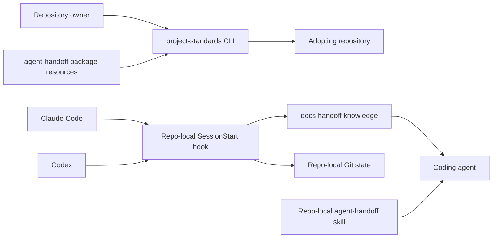
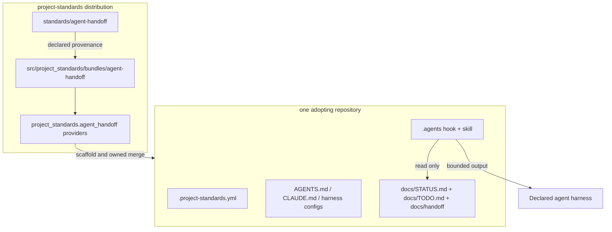
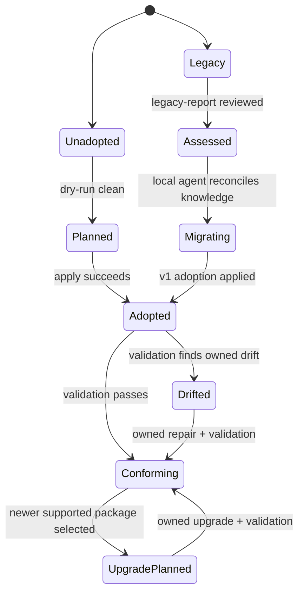

# Agent Handoff Standard Package — Specification (Full)

## Revision History

| Version | Date | Author | Change |
| --- | --- | --- | --- |
| 0.1 | 2026-07-09 | Codex with owner review | Initial full specification from the approved agent-handoff ingestion design. |
| 0.2 | 2026-07-09 | Codex with adversarial review | Map package commands to generic providers, specify platform and artifact-lifecycle work, add hook-placement ADR, scope config strictness, and restore workflow/error identifiers. |
| 0.3 | 2026-07-09 | Codex with owner approval | Name the canonical hook source and bundle-anatomy change required by accepted ADR 0022; approve the specification for implementation planning. |
| 0.4 | 2026-07-09 | Codex with owner-directed plan review | Make the installed hook path the repository trust anchor and correct the repository/legacy licensing contract. |
| 0.5 | 2026-07-09 | Codex with owner direction | Remove a package-specific license for `agent-handoff`; inherit the repository license while preserving notices for MIT-licensed legacy inputs. |
| 0.6 | 2026-07-18 | Codex with owner direction | Record the approved Catalog 5/V2 supersession, current package `1.1` implementation, approved/change-controlled lifecycle, and remaining legacy-engine retirement gate without rewriting the V1 baseline. |

**Spec lifecycle:** This document is approved and change-controlled. Post-approval scope changes require a revision row and owner re-approval; implementation deviations are recorded in the [Deviations Log](#deviations-log), not silently patched into requirements. The standard defined here starts at package version `1.0`; it does not continue any legacy engine or schema version line.

**Normative precedence and current implementation:** This specification preserves the approved V1 baseline and its stable requirement IDs. For Catalog 5 package anatomy, configuration, version selection, adoption, reconciliation, and lifecycle mechanics, [SPEC-CP01](2026-07-10-consumer-standards-control-plane-spec.md), [SPEC-BA02](2026-07-10-standard-bundle-authoring-v2-spec.md), [ADR 0023](../adr/adr-0023-unified-consumer-standards-control-plane.md), and [ADR 0024](../adr/adr-0024-catalog-scoped-package-version-channels.md) take precedence over conflicting V1 mechanics below. The accepted successor implementation is the `agent-handoff` `1.1` payload selected in `.standards/config.toml` and recorded in the central lock. The repository-local ownership, knowledge layout, safety, validation, and migration principles remain normative unless one of those authorities explicitly supersedes them. Technical implementation is complete under that successor contract; Task 18 legacy-engine retirement remains pending its consumer-validation, dependency-search, and owner-deletion gates.

---

## 1. Purpose & Background

Agent-managed repositories need durable project knowledge that survives across sessions, agents, machines, and clones. The useful knowledge has different lifetimes: active work changes within hours, deployment truth changes around releases, conventions persist for months, and bug lessons may remain valuable indefinitely. Loading all of it on every session wastes context, while leaving all of it lazy causes agents to begin without the current state.

The legacy handoff implementation proved the lifetime-partitioned model but coupled it to a separate factory checkout, workstation-wide installation, home-directory state, inconsistent names, and historical layouts that changed substantially across versions. That distribution model does not satisfy this repository's standard-package methodology. A project adopts a standard, so its handoff state, skill, hooks, and integration configuration must remain within that project's repository.

This specification defines `agent-handoff` as a new standards package. Version `1.0` has one canonical identity, one canonical owner, and no runtime dependency on the retired implementation repository. The `project-standards` package distributes the standard, adoption artifacts, providers, hook, policy, validator, migration guidance, and repo-local skill. Consumer repositories own their project knowledge after scaffolding.

The outcome is a reproducible project-local memory layer with automatic startup context for Claude Code and Codex, a manual path for other agents, deterministic conformance checks, and a judgment-preserving migration path for legacy consumers.

---

## 2. Scope

### 2.1 In Scope

- An adoptable `standards/agent-handoff/` bundle at package version `1.0`.
- A canonical repository layout rooted at `docs/STATUS.md`, `docs/TODO.md`, and `docs/handoff/`.
- A repo-local skill at `.agents/skills/agent-handoff/`.
- One shared repo-local SessionStart hook under `.agents/hooks/agent-handoff/`.
- First-class Claude Code and Codex harness profiles with required automatic startup injection when declared.
- A manual startup procedure for agents without a supported automatic-injection profile.
- Static, create-only project-knowledge templates and upgradeable standard-owned artifacts.
- Structured, idempotent integration with project `.claude/settings.json`, `.codex/config.toml`, `CLAUDE.md`, and `AGENTS.md`.
- Delimiter-bounded `agent-handoff` instruction blocks whose ownership does not extend to the surrounding file.
- CLI-backed scaffold, validate, drift, size, shape, and read-only legacy-report behavior.
- A general migration guide that delegates semantic reconciliation to the consuming repository's local agent.
- Ingestion of reusable hook, policy, validation, test, template, and skill behavior from the legacy repository.
- Artifact provenance, package parity, graph/catalog integration, dogfood fixtures, and release documentation.
- Migration of this repository and all known consumers before the legacy repository is deleted.

### 2.2 Out of Scope (Non-Goals — never)

| ID | Non-Goal | Reason |
| --- | --- | --- |
| NG-001 | Own, modify, validate, or install user-global, agent-global, home-directory, machine-level, or filesystem-root state. | Standard-packaged skills and hooks are project-local under ADRs 0021 and 0022. |
| NG-002 | Scan, mutate, or coordinate sibling repositories or an entire projects directory through standard adoption. | Each consumer adopts and validates independently; any separately authorized operator workflow remains external to the standard. |
| NG-003 | Require a clone, fork, service, daemon, database, or separately released runtime package. | The `project-standards` distribution is the complete source. |
| NG-004 | Deterministically transform every historical legacy layout. | Historical structures vary too widely for a safe universal transformer. |
| NG-005 | Overwrite or semantically rewrite consumer project knowledge during adoption or upgrade. | Knowledge requires project-local judgment and remains consumer-owned. |
| NG-006 | Store secret values in handoff documents, templates, fixtures, logs, or reports. | Handoff files contain credential references only. |
| NG-007 | Automatically execute content found in handoff documents. | Repository knowledge is untrusted reference data, not executable instruction. |
| NG-008 | Make automatic injection mandatory for harnesses without a supported, testable project-local lifecycle interface. | Unsupported agents use the manual startup path until a profile is added. |
| NG-009 | Preserve legacy product names as aliases for the new standard. | The canonical identity is `agent-handoff`; old names exist only in migration material and detection rules. |

### 2.3 Won't Have in v1 (deferred — not never)

| ID | Deferred Capability | Why Deferred | Revisit When |
| --- | --- | --- | --- |
| WH-001 | Automatic-injection profiles beyond Claude Code and Codex. | V1 should ship only interfaces that can be verified end to end. | Another harness exposes a stable, project-local startup hook with an authoritative contract. |
| WH-002 | Consumer-defined policy overrides. | A single default policy reduces ambiguity during initial adoption. | Two or more consumers need legitimate, non-conflicting budget or shape variations. |
| WH-003 | Automated semantic migration or content classification. | An agent must reconcile project-specific knowledge and conflicting historical files. | A later corpus proves a narrow transformation safe across real consumers. |
| WH-004 | A write-capable MCP surface. | CLI and CI are the authoritative mutation and validation paths. | The Project Standards MCP server has a reviewed write model and explicit apply semantics. |
| WH-005 | Separately authorized multi-repository migration operator workflow. | V1 is proving independent repository migration before adding fleet-level coordination outside the standard. | V1 migration evidence is complete and the owner authorizes a separate operator tool. |

### 2.4 Boundaries

| Boundary | Description |
| --- | --- |
| System owns | The `agent-handoff` standard bundle, package resources, default policy, repo-local skill, shared hook, integration providers, validators, migration guide, legacy detector, tests, and generated catalog data. |
| System depends on | The `project-standards` CLI/provider platform, filesystem and Git access inside the target repository, Python for the installed hook, and declared Claude Code or Codex project-hook interfaces. |
| System does not own | Consumer knowledge content after creation; unmarked content in `AGENTS.md` or `CLAUDE.md`; unrelated Claude/Codex configuration; global agent configuration; credentials; other repositories; or workstation administration. |

---

## 3. Context

### 3.1 Current State

The legacy implementation is distributed from a separate checkout. Its Python package is metadata-only, while hooks, validators, templates, policy, skill, and installers live in the repository tree. The installer combines project adoption with workstation rollout and historically installed or inspected home-level resources. Consumer repositories may contain different generations of root status/task files, monolithic or partitioned handoff documents, duplicated harness hooks, varying skill names, and bespoke configuration.

The current implementation also contains reusable work worth preserving: lifetime-based fact routing, small eager context, SessionStart injection, UTF-8-safe size limits, document-shape policy, repo-local skill deployment, drift checks, and public-safe secret-reference rules.

This repository now has the platform contracts needed to ingest that behavior correctly: unified adoption, lifecycle rules, artifact provenance, per-standard versioning, project-local packaged skills, provider declarations, a graph validator, an artifact plane, and dogfood composition fixtures.

### 3.2 Target State

`project-standards` is the sole canonical and distributable source for `agent-handoff`. A consumer installs or invokes the released CLI without cloning this repository, selects its supported harnesses, and receives only repository-local artifacts.

```text
consumer-repo/
├── AGENTS.md                       # consumer-owned, bounded agent-handoff block
├── CLAUDE.md                       # consumer-owned, bounded agent-handoff block
├── .project-standards.yml          # agent_handoff 1.0 + declared harnesses
├── .agents/
│   ├── hooks/agent-handoff/session_start.py  # automatic mode
│   └── skills/agent-handoff/SKILL.md
├── .claude/settings.json           # agent-handoff owns one hook registration
├── .codex/config.toml              # agent-handoff owns one hook registration
└── docs/
    ├── STATUS.md
    ├── TODO.md
    └── handoff/
        ├── state.md
        ├── deployed.md
        ├── architecture.md
        ├── credentials.md
        ├── conventions.md
        ├── specs-plans.md
        ├── sessions/
        └── bugs/
```

The standard-owned hook and skill are reproducible, upgradeable copies. The knowledge documents are create-only scaffolds and remain consumer-owned. Validation proves the layout, integrations, provenance, safety, and context budgets without rewriting knowledge.

### 3.3 Assumptions

| ID | Assumption | Impact if False |
| --- | --- | --- |
| A-001 | Consumers can invoke a released `project-standards` CLI through `uvx`, an installed tool, or equivalent packaging. | Adoption and validation need another supported package runner, but still must not require a source checkout. |
| A-002 | Supported consumer environments provide a `python3` runtime compatible with the standalone hook. | The hook needs another dependency-free runtime or a harness-native implementation. |
| A-003 | Claude Code and Codex continue to support trusted project-local SessionStart command hooks. | The affected profile must be revised or temporarily marked unsupported in a package release. |
| A-004 | Git is available in repositories that want branch, commit, and working-tree context. | The hook degrades to document-only context and reports Git context as unavailable. |
| A-005 | Consumer agents can make semantic decisions while following a migration guide. | Legacy migration becomes manual owner work; automatic transformation remains unsafe. |
| A-006 | The adopting repository is the complete authority boundary for project handoff knowledge. | Multi-repository products need independent adoption in each repository or a future explicitly scoped design. |

### 3.4 Constraints

| ID | Constraint | Source |
| --- | --- | --- |
| C-001 | Use `agent-handoff` as the product, standard, bundle, skill, command-group, and resource identity; use `agent_handoff` only where language syntax requires an identifier. | Owner decision. |
| C-002 | Start the standard package at version `1.0`, independent of every legacy version. | Owner decision and ADR 0020. |
| C-003 | Place canonical status and task documents at `docs/STATUS.md` and `docs/TODO.md`. | Owner decision. |
| C-004 | Read and write only inside the explicitly declared target repository. | Owner decision and project-local adoption boundary. |
| C-005 | Install standard-packaged skills only at `.agents/skills/agent-handoff/`. | ADR 0021. |
| C-006 | Preserve one canonical source and declared provenance for every reusable artifact. | ADR 0019. |
| C-007 | Preserve unrelated consumer configuration and instruction content. | Narrow authority boundary and safe adoption requirement. |
| C-008 | Fail closed before mutation when ownership, syntax, containment, or integration state is ambiguous. | Existing adopt-engine safety model. |
| C-009 | Keep the hook dependency-free, fast, read-only, and functional without importing the installed `project-standards` package. | Startup reliability and clone independence. |
| C-010 | Do not delete the legacy repository until every known consumer conforms to v1. | Owner retirement plan. |
| C-011 | Install this standard's hook only at `.agents/hooks/agent-handoff/` unless a later ADR authorizes another project-local destination. | Proposed ADR 0022. |

---

## 4. Goals

| ID | Goal | Success Signal | Achieved By |
| --- | --- | --- | --- |
| G-001 | Make `agent-handoff` a first-class, independently adoptable standards package. | A released wheel contains the full bundle and operates without either source checkout. | FR-001, FR-002, FR-019 |
| G-002 | Keep all adopted state and behavior within the consumer repository. | Boundary tests observe no consumer-state access or writes outside the declared root. | FR-003, FR-004, NFR-001 |
| G-003 | Provide reliable, bounded session context for supported harnesses. | Claude Code and Codex fixture probes receive the expected context within the byte cap. | FR-007–FR-010, FR-013, NFR-003 |
| G-004 | Preserve consumer knowledge and unrelated configuration. | Adoption and upgrade fixtures show no knowledge overwrite and semantic preservation of unrelated config. | FR-005, FR-011, FR-012, NFR-002 |
| G-005 | Migrate legacy consumers without pretending their histories are uniform. | Local agents can use a read-only report and guide, then pass v1 validation. | FR-016, FR-017, FR-021 |
| G-006 | Retire the separate implementation repository safely. | All known consumers pass v1 validation and no operational references remain before deletion. | FR-018, FR-020, FR-022 |

---

## 5. Stakeholders and Users

| Role / Stakeholder | Concern | Involvement |
| --- | --- | --- |
| Repository owner | Correct ownership boundaries, low-friction adoption, safe legacy retirement | Approves the spec, release, migrations, and final repository deletion |
| Consumer repository maintainer | Reproducible setup without hidden workstation state | Runs adoption, reviews diffs, and maintains project knowledge |
| Coding agent | Small startup context and unambiguous fact routing | Reads injected context and applies the repo-local skill |
| `project-standards` maintainer | Manifest, artifact, provider, and release coherence | Implements and releases the standard package |
| Harness profile maintainer | Compatibility with Claude Code or Codex lifecycle contracts | Revalidates profile behavior when upstream interfaces change |

---

## 6. Glossary

| Term | Definition | Notes / Not to be confused with |
| --- | --- | --- |
| `agent-handoff` | The v1 standards package defined by this specification. | Not an alias for any legacy product name. |
| Adopting repository | The repository root explicitly passed to an adoption or validation operation. | It is the maximum filesystem authority boundary. |
| Consumer knowledge | Project-specific Markdown maintained after scaffolding. | Never overwritten by standard upgrades. |
| Eager context | The small state and Git slice injected at session start. | Distinct from lazy handoff documents read on demand. |
| Harness profile | A tested project-local integration for one agent harness. | V1 profiles are `claude-code` and `codex`. |
| Integration block | A delimiter-bounded section owned by `agent-handoff` inside a consumer-owned instruction file. | Ownership does not extend outside the markers. |
| Legacy report | A read-only inventory of recognized old repo-local artifacts and conflicts. | It is evidence for an agent, not a migration plan or transformer. |
| Package artifact | A standard-owned file bundled for adoption or provider execution. | Its provenance is declared under ADR 0019. |
| Project knowledge | Status, tasks, active state, deployment, architecture, credentials references, conventions, plans, sessions, and bug lessons for one repository. | It excludes global preferences and workstation state. |

---

## 7. Requirements

### 7.1 Functional Requirements

| ID | Requirement | Rationale | Acceptance Criteria | Priority |
| --- | --- | --- | --- | --- |
| FR-001 | The system shall publish an adoptable `standards/agent-handoff/` bundle with `standard.toml`, `README.md`, `adopt.md`, templates, resources, `hooks/session-start/session_start.py`, and the `agent-handoff` skill, and shall choose to ship the optional `agent-summary.md` resource. | The package must satisfy the Standard Bundle Authoring contract, follow ADR 0022's canonical hook-source convention, and choose the optional summary for agent discoverability. | Graph validation accepts the bundle, the hook source resolves under the declared package, and generated catalog output includes the standard. | Must |
| FR-002 | The system shall declare `agent-handoff` package version `1.0` and shall not continue a legacy version line. | The new package has a new contract and ownership model. | Manifest, docs, config fragments, policy, and tests consistently identify version `1.0`. | Must |
| FR-003 | Every operation shall confine consumer-data access and all mutation to the resolved adopting repository; it may read immutable resources from the installed `project-standards` distribution and invoke declared toolchain executables. | The standard owns project-level knowledge only but must load its own package resources. | Boundary tests reject absolute consumer paths, traversal, symlink escape, outside-root consumer reads, and every attempted write outside the root while permitting package-resource loads. | Must |
| FR-004 | The system shall define `docs/STATUS.md`, `docs/TODO.md`, and the required `docs/handoff/` files and directories as the canonical v1 knowledge layout. | Root status/task files are no longer desired. | Fresh adoption produces the exact required layout and validation rejects misplaced canonical files. | Must |
| FR-005 | Adoption shall create missing consumer-knowledge files but shall never overwrite existing consumer-knowledge content during adoption, repair, drift checking, or package upgrade. | Project knowledge belongs to the consumer. | Fixtures with existing content remain byte-identical after every mutation command. | Must |
| FR-006 | Adoption shall install the standard-owned skill only at `.agents/skills/agent-handoff/` and validation shall detect missing or drifted skill files. | Agents need the operating procedure that matches the adopted standard version. | Package parity, installation, drift, and invalid-global-destination tests pass. | Must |
| FR-007 | Automatic-mode adoption shall install one dependency-free shared hook at `.agents/hooks/agent-handoff/session_start.py`; manual mode shall not require or register it. | One repo-local hook avoids duplicated harness copies and external sources without adding unused runtime files to manual consumers. | Both supported profiles reference the same file and hook parity validation passes; manual fixtures conform without it. | Must |
| FR-008 | The Claude Code profile shall register the shared hook as a project-local `SessionStart` command hook and shall inject startup context through a documented Claude Code output path. | Claude Code is a first-class v1 harness. | A Claude-shaped input probe receives valid context for startup, resume, clear, and compact sources. | Must |
| FR-009 | The Codex profile shall register the shared hook in the trusted project `.codex/config.toml` layer and shall inject startup context through a documented Codex output path. | Codex is a first-class v1 harness. | A Codex-shaped input probe receives valid context, and the adoption guide documents project trust and hook review. | Must |
| FR-010 | The system shall record startup mode and selected harness profiles in the `agent_handoff` namespace of `.project-standards.yml`; automatic mode shall require working injection for each declared supported profile, while manual mode shall claim no automatic profile. | Declared conformance must be mechanically testable without excluding unsupported agents. | Validation rejects unknown keys inside `agent_handoff`, fails when automatic mode lacks a registration, hook, or expected output behavior, and fails when manual mode declares an automatic profile; it makes no whole-file unknown-key claim. | Must |
| FR-011 | Adoption shall add or update one delimiter-bounded `agent-handoff` block in each selected profile's root instruction file, or in `AGENTS.md` for manual mode, while preserving all content outside the markers. | The skill and session-end procedure must be reliably discoverable without owning the entire file. | First-run, update, automatic/manual, duplicate-marker, malformed-marker, and byte-preservation fixtures pass. | Must |
| FR-012 | Adoption shall structurally merge only the required hook registration into existing Claude Code and Codex project configuration while preserving unrelated values. | Consumer configurations are often bespoke. | Semantic before/after comparisons prove unrelated configuration unchanged; malformed or ambiguous input blocks all mutation. | Must |
| FR-013 | The hook shall inject bounded `docs/handoff/state.md` content, current Git branch, recent commits, working-tree status, and lazy pointers to the canonical knowledge files. | The next session needs current state without loading the whole knowledge base. | Golden-output tests cover Git and non-Git repositories, missing optional files, Unicode boundaries, and both transports. | Must |
| FR-014 | The hook shall wrap repository-derived content as untrusted reference data and shall never execute, source, import, or interpolate commands from handoff documents. | Tracked content can contain prompt injection or malicious text. | Adversarial fixtures remain inert text and cannot alter the hook command or output envelope. | Must |
| FR-015 | The system shall provide a non-mutating validator that accumulates layout, config, instruction-block, skill, hook, provenance, path, reference, shape, and budget failures in one run. | Consumers need a useful conformance gate. | Human and JSON outputs enumerate all fixture failures and use documented exit codes. | Must |
| FR-016 | The system shall provide a repository-confined, read-only legacy report for recognized old paths, names, registrations, duplicates, stale engine references, and likely conflicts. | Local agents need evidence without unsafe automatic transformation. | Historical-layout fixtures produce deterministic findings with no created, updated, or deleted paths. | Must |
| FR-017 | The standard shall publish a general legacy migration guide centered on preservation, reconciliation, target-state installation, cleanup, and final validation. | Migration requires project-local judgment. | The guide covers known layout families without promising exhaustive detection or automated conversion. | Must |
| FR-018 | Every reusable artifact ingested from the legacy repository shall receive one canonical owner here, declared provenance, and parity or deterministic-transform tests before the old source is retired. | Deleting the old repository must not discard required behavior or create parallel sources. | An ingestion inventory maps each retained artifact and proves no package artifact lacks provenance. | Must |
| FR-019 | The released `project-standards` distribution shall contain all resources and executable providers needed for adoption and validation without either repository checkout. | Clone independence is a primary goal. | Installed-wheel tests pass from a temporary directory with both source repositories unavailable. | Must |
| FR-020 | Package upgrades shall refresh standard-owned hook, skill, policy, and integration blocks while preserving consumer knowledge and unrelated configuration. | Standard-owned artifacts need an explicit lifecycle. | Upgrade and drift fixtures cover current, stale, locally modified, and ambiguous artifacts. | Must |
| FR-021 | Unsupported agents shall have a documented manual startup path that reads the same eager state and uses the same repo-local skill. | Project knowledge should remain useful beyond the first-class profiles. | The adoption guide contains a harness-neutral procedure without claiming automatic conformance. | Should |
| FR-022 | The project shall define and enforce a retirement gate requiring release, representative pilots, migration of all known consumers, and absence of operational legacy dependencies before repository deletion. | The old source must remain available until migration is proven complete. | A signed-off retirement checklist and final cross-repository inventory are complete before deletion. | Must |
| FR-023 | Handoff credential documentation shall permit references only and shall prohibit secret values in standard-owned artifacts and consumer guidance. | Tracked project knowledge must not become a secret store. | Templates contain reference-only examples and secret-pattern fixtures are rejected or reported. | Must |
| FR-024 | Mutation commands shall support preview output and shall report exact planned, created, updated, skipped, and blocked paths. | Reviewable changes reduce adoption risk. | `--dry-run` produces the same plan as apply without filesystem mutation; JSON output matches its schema. | Must |

### 7.2 Non-Functional Requirements

| ID | Category | Requirement | Measurement / Acceptance Criteria | Priority |
| --- | --- | --- | --- | --- |
| NFR-001 | Isolation | The system shall perform no consumer-state access or mutation outside the resolved repository root; read-only access to its installed package resources and execution of declared toolchain binaries are the only exceptions. | Instrumented boundary tests observe no outside-root consumer reads and no outside-root writes, while package-resource loading remains functional. | Must |
| NFR-002 | Idempotency | Repeating a successful adoption or repair with the same inputs shall produce no further diff. | All fresh and existing-config fixtures are clean on the second run. | Must |
| NFR-003 | Context efficiency | `state.md` input shall not exceed 2 KiB and total injected context shall not exceed 4 KiB, counted as UTF-8 bytes with truncation on a valid boundary. | Boundary tests cover ASCII, multibyte Unicode, exact caps, and over-cap inputs. | Must |
| NFR-004 | Startup performance | The hook shall finish within 2 seconds at the 95th percentile across 100 local fixture runs on the repository's supported Linux test environment. | Benchmark test records p95 below 2 seconds with network disabled. | Should |
| NFR-005 | Portability | The hook shall use only the Python standard library and shall not import `project_standards`. | An isolated hook test succeeds with only a compatible `python3`, Git, and fixture repository. | Must |
| NFR-006 | Diagnostics | Human errors shall name the path, violated rule, and safe next action; JSON findings shall have stable codes and loci. | Error-contract tests cover every expected failure class. | Must |
| NFR-007 | Maintainability | New Python code shall satisfy the repository's Ruff, BasedPyright, pytest, coverage, and audit gates. | The complete repository verification gate passes with coverage not reduced below the enforced threshold. | Must |
| NFR-008 | Determinism | Identical repository content and command arguments shall produce identical plans, findings, and generated artifacts. | Snapshot and repeated-run tests match byte-for-byte except explicitly documented timestamps. | Must |
| NFR-009 | Compatibility | Harness-profile contracts shall be pinned to verified upstream behavior and rechecked before each `agent-handoff` release. | Release checklist records current Claude Code and Codex hook documentation/schema evidence. | Must |

### 7.3 Interface Requirements

| ID | Interface | Requirement | Contract / Format | Acceptance Criteria |
| --- | --- | --- | --- | --- |
| IR-001 | Adoption CLI | Scaffold the standard with explicit automatic profiles or explicit manual mode. | `project-standards adopt agent-handoff --dest PATH (--harness {claude-code,codex}... \| --manual) [--dry-run] [--json]` | At least one repeated harness is required for automatic mode; `--manual` is mutually exclusive and claims no automatic profile. The manifest maps this mutation to generic `scaffold`. |
| IR-002 | Command group | Expose package-specific read and maintenance operations without a second executable. | `project-standards agent-handoff {validate,drift-check,size-report,shape-check,legacy-report,upgrade}` | Help, human output, JSON output, and exit-code tests pass. `validate`, `size-report`, and `shape-check` use the generic `validate` provider; `drift-check` uses `drift-check`; `legacy-report` uses read-only `extract`; and `upgrade` uses `upgrade`. Diagnostic view names are CLI subcommands, not new manifest operations. |
| IR-003 | Consumer config | Declare contract version, startup mode, and selected profiles. | `.project-standards.yml` key `agent_handoff` with quoted `version: "1.0"`, `startup: automatic\|manual`, and `harnesses` list | Automatic mode requires one or more unique known harnesses; manual mode requires an empty list; unknown keys inside this namespace fail validation. Other top-level namespaces remain outside this parser's authority. |
| IR-004 | Claude Code hook | Register one project `SessionStart` command hook. | `.claude/settings.json` points to `.agents/hooks/agent-handoff/session_start.py` using a repository-anchored command | Official input/output fixtures and real smoke probe pass. |
| IR-005 | Codex hook | Register one trusted project `SessionStart` command hook. | `.codex/config.toml` inline hook table points to `.agents/hooks/agent-handoff/session_start.py` | Official schema fixtures, trust guidance, and real smoke probe pass. |
| IR-006 | Instruction integration | Own one marked block without owning the file. | HTML-comment start/end markers containing the exact token `agent-handoff` | Duplicate, nested, missing-end, and reordered markers fail closed. |
| IR-007 | Validation output | Report all conformance findings. | Human text by default; JSON schema with repository, standard version, findings, and summary | Exit `0` clean, `1` findings, `2` usage/config error, `3` prerequisite/internal failure. |
| IR-008 | Legacy output | Report recognized evidence without mutation. | Human text or JSON findings with `kind`, `path`, `evidence`, `severity`, and `guidance` | Unknown layouts are reported as unclassified evidence, not guessed migrations. |

### 7.4 Data Requirements

| ID | Data Entity | Requirement | Validation Rules | Ownership |
| --- | --- | --- | --- | --- |
| DR-001 | Standard manifest | Describe identity, version, `adoption = "cli"`, `[config].namespaces = ["agent_handoff"]`, resources, capabilities, authorities, relationships, artifacts, and providers. Declare only the existing generic provider operations `scaffold`, `validate`, `drift-check`, `extract`, and `upgrade`. | Must pass standard-manifest and graph validation; CLI diagnostic views map to these providers and do not expand `ProviderOperation`. | `standards/agent-handoff/standard.toml` |
| DR-002 | Default policy | Define required files, shape profiles, hard byte caps, working targets, and blocked content patterns. | TOML parses dependency-free; docs and tooling derive the same values. | `standards/agent-handoff/resources/policy.toml` |
| DR-003 | Artifact manifest | Describe all materialized files, destinations, modes, provenance, and `install_policy = "managed" \| "create-only"`. | The schema defaults to `managed` for existing manifests. Knowledge templates declare `create-only` and cannot be overwritten even by force or upgrade; hook and skill artifacts declare `managed` and refresh only through the owned upgrade path after drift/precondition checks. No unsafe destination, collision, undeclared mirror, or global skill/hook path is allowed. | Packaged `adopt.toml` |
| DR-004 | Consumer configuration | Record version, startup mode, and selected harnesses. | Version is quoted and supported; automatic mode has a unique non-empty known list; manual mode has an empty list. | Consumer `.project-standards.yml` |
| DR-005 | Consumer knowledge | Store current and durable project facts by lifetime. | Required paths and document profiles pass; credentials contain references only. | Consumer repository |
| DR-006 | Standard-owned copies | Carry hook, skill, policy, and integration content matching the package version. | Drift and provenance checks identify exact expected source and local changes. | Standard package; installed copies in consumer repo |
| DR-007 | Finding | Represent one validation, drift, or legacy observation. | Stable code, severity, path/locus, message, and remediation; deterministic order. | Provider output only; not persisted by default |
| DR-008 | Change plan | Represent proposed creates and owned updates. | Every path is contained; no consumer knowledge overwrite; full preflight succeeds before apply. | Provider memory/output; not persisted by default |

---

## 8. Architecture and Design

### 8.1 Architecture Summary

The architecture has four bounded units. The authored standard bundle owns the contract and human-maintained source artifacts. The packaged bundle mirrors or transforms those artifacts under declared provenance. Provider code plans, validates, and applies repo-local integration changes. The standalone hook and skill operate inside each consumer after adoption without contacting the package or another repository.

Static create-only knowledge templates use the artifact plane. Dynamic work uses providers because it must parse existing consumer configuration, preserve unrelated content, select harness profiles, and fail closed on conflicts. The validator uses the same models, policy, path resolver, and integration recognizers as adoption so the write and read paths cannot silently disagree.

The hook is intentionally smaller than the provider layer. It reads one capped eager file, collects bounded Git facts, emits lazy pointers, and exits. It performs no migration, validation sweep, network access, package import, or persistent write.

### 8.2 Architecture Views

#### 8.2.1 Context View



The repository boundary contains every runtime artifact and every project fact. The package is needed for adoption, validation, drift checking, and upgrades, but not for routine hook execution.

#### 8.2.2 Container / Deployment View



#### 8.2.3 Component View

| Component | Responsibility | Depends On |
| --- | --- | --- |
| Bundle source | Canonical standard prose, templates, skill, policy, and migration guide | Standard Bundle Authoring contract |
| Artifact package | Installable mirrors and create-only templates | Provenance declarations and package-data configuration |
| Path guard | Resolve the repository root and reject traversal/symlink escape | `pathlib`, filesystem metadata |
| Planner | Build deterministic create/update/skip/block actions | Artifact manifest, harness profiles, integration parsers |
| Integration adapters | Parse, recognize, and update owned Claude/Codex/instruction surfaces | JSON/TOML/Markdown boundary rules |
| Validator | Accumulate conformance, shape, budget, drift, and reference findings | Shared policy and recognizers |
| Legacy detector | Identify known old repo-local evidence without mutation | Version-neutral signature registry |
| SessionStart hook | Emit bounded eager project context | Python standard library, optional Git |
| Repo-local skill | Teach fact routing, startup behavior, closeout, and validation | Standard resources and consumer paths |

### 8.3 Design Decisions

| ID | Decision | Rationale | Consequence |
| --- | --- | --- | --- |
| D-001 | Use one integrated CLI-backed standard package with `adoption = "cli"`. | It provides one owner and eliminates clone/runtime split. | Provider implementation and package-specific CLI dispatch join the `project-standards` package. |
| D-002 | Treat all knowledge documents as consumer-owned after create-only scaffolding. | Their content is project-specific and cannot be safely refreshed from templates. | The artifact schema gains optional `install_policy`; knowledge declares `create-only`, while standard-owned artifacts declare `managed`. Upgrades validate shape but never overwrite knowledge. |
| D-003 | Store one shared hook under `.agents/hooks/agent-handoff/` for both profiles. | One installed source prevents duplicate drift. | Both harness configs reference the same repo-local executable file, subject to proposed ADR 0022. |
| D-004 | Require automatic injection for declared Claude Code and Codex profiles. | Reliable startup is central to the standard's value. | A declared but broken profile is non-conforming. |
| D-005 | Use bounded instruction blocks and structural config merges. | Narrow ownership preserves consumer customization. | Ambiguous ownership blocks mutation. |
| D-006 | Use a guide plus read-only legacy report, not automatic migration. | Historical layouts and content need local judgment. | The local agent performs semantic reconciliation. |
| D-007 | Keep all operations repository-confined. | The standard governs project knowledge, not workstation state. | Fleet rollout and global cleanup remain separate owner operations. |
| D-008 | Start at standard package version `1.0`. | The new contract is independent of legacy lineage. | No compatibility promise is inferred from old version numbers. |
| D-009 | Map package-specific commands onto the existing generic provider vocabulary. | Generic operations should remain stable while a standard may expose focused diagnostic views. | The manifest declares `scaffold`, `validate`, `drift-check`, `extract`, and `upgrade`; `size-report`, `shape-check`, and `legacy-report` remain CLI names mapped to those operations. |

### 8.4 Solution Alternatives Considered

| Alternative | Advantages | Rejection Reason |
| --- | --- | --- |
| Static copy-adopt package with printed config fragments | Small implementation and low parser complexity | Hook registration and upgrades remain manual and less verifiable. |
| Standard plus separate runtime package | Avoids a source clone while retaining implementation separation | Preserves two ownership and release surfaces contrary to the deletion and SSOT goals. |
| Move the legacy repository wholesale into this repository | Retains existing scripts with less initial rewrite | Imports workstation/global behavior, inconsistent names, and a factory model that violates package boundaries. |
| Deterministic all-version migration command | Potentially fast for uniform consumers | Unsafe and high-friction across structurally divergent historical repositories. |

### 8.5 Design Constraints

- Package resources must work from an installed wheel, not only a source tree.
- Provider entrypoints are Python import paths declared in `standard.toml`, never filesystem paths.
- The current provider declarations are metadata-only. Implementation must add an executable dispatch boundary plus a specialized `agent-handoff` CLI branch without broadening the generic operation enum.
- The current `adopt` parser lacks `--harness`, `--manual`, and `--json`. Implementation must add and forward those arguments for `agent-handoff` while preserving existing standards' behavior.
- The hard-coded adoptable/version-tracked registry parity guards must include `agent-handoff` when its artifact bundle and contract version are added.
- The artifact manifest/model/engine must add optional `install_policy` with `managed` as the backward-compatible default and enforce `create-only` independently of `--force` and upgrade.
- The hook must remain a standalone source-owned artifact and must not rely on the provider runtime.
- Integration adapters may edit only the exact semantic key or bounded block owned by `agent-handoff`.
- Consumer-owned Markdown may be validated for conformance but never regenerated after creation.
- Consumer-path checks happen before reads as well as writes; read-only commands receive no broader consumer-data boundary. Installed package-resource reads remain allowed.
- Harness profile behavior is version-sensitive and requires upstream contract revalidation before release.

### 8.6 Dependency Policy

`agent-handoff` is independently adoptable. It consumes generic `project-standards` platform capabilities for package resources, scaffold providers, validation, drift checking, and graph discovery; it does not require adoption of another standard.

The provider implementation should reuse existing package dependencies where they preserve configuration safely. A new dependency requires documented need, maintenance review, license compatibility, and `pip-audit` coverage. The installed hook uses only the Python standard library and optional `git` subprocess calls with fixed argument arrays. It performs no shell interpolation and no network access.

---

## 9. Data Model

The implementation uses typed in-memory models; no database or service state exists.

| Model | Key Fields | Invariant |
| --- | --- | --- |
| `AgentHandoffConfig` | `version`, `startup`, `harnesses` | Version supported; automatic/manual mode consistent with the harness list |
| `Policy` | required paths, byte caps, working targets, document profiles | One canonical bundled policy for v1 |
| `HarnessProfile` | id, config path, registration recognizer, registration renderer, transport | Profile logic is explicit and testable |
| `ArtifactRule` | source, destination, provenance, ownership, install policy, mode | Destination contained; ownership and `managed`/`create-only` lifecycle declared |
| `IntegrationBlock` | file, start marker, end marker, expected body | Exactly zero or one well-formed block |
| `Action` | kind, destination, expected precondition, rendered content | No consumer-knowledge overwrite |
| `Plan` | repository, config, actions, blocked findings | Apply allowed only when blocked findings are empty |
| `Finding` | code, severity, path, locus, message, guidance | Stable code and deterministic ordering |
| `LegacySignature` | id, paths/patterns, evidence type, guidance | Detection only; never implies a safe transform |

Consumer knowledge follows lifetime-specific document profiles:

| Path | Lifetime / Purpose | Ownership |
| --- | --- | --- |
| `docs/STATUS.md` | Current human-facing project snapshot | Consumer |
| `docs/TODO.md` | User-visible future work queue | Consumer |
| `docs/handoff/state.md` | In-flight state, eager and capped | Consumer |
| `docs/handoff/deployed.md` | Current deployment truth | Consumer |
| `docs/handoff/architecture.md` | Structural reference and standing backlog | Consumer |
| `docs/handoff/credentials.md` | Credential names and lookup references only | Consumer |
| `docs/handoff/conventions.md` | Long-lived project patterns | Consumer |
| `docs/handoff/specs-plans.md` | Pointers to active specs and plans | Consumer |
| `docs/handoff/sessions/` | Append-only compact session history | Consumer |
| `docs/handoff/bugs/` | Durable bug and gotcha records | Consumer |

---

## 10. Behavior and Workflows

### 10.1 Primary Workflow

#### Fresh adoption

1. The owner runs adoption with one or both supported `--harness` values, or explicit `--manual`, and optional `--dry-run`.
2. The CLI resolves the repository root and loads package resources.
3. The provider parses consumer config and instruction files without mutation.
4. The path guard validates every source, destination, and existing leaf.
5. The planner produces create, owned-update, skip, and blocked actions.
6. If any action is blocked, the command reports all blockers and writes nothing.
7. Dry-run prints the plan and exits without mutation.
8. Apply creates missing knowledge scaffolds, installs standard-owned artifacts, and updates only owned integrations.
9. The provider runs post-apply validation.
10. The owner reviews the diff and commits adoption with the repository's normal workflow.

#### Session start

1. A declared harness invokes the shared hook with its lifecycle input.
2. The hook derives the repository root from its canonical installed path under `.agents/hooks/agent-handoff/`; event working-directory and environment paths are untrusted metadata and may not broaden that authority.
3. The hook reads and byte-clamps `docs/handoff/state.md`.
4. It gathers bounded Git branch, recent-commit, and status output with fixed timeouts.
5. It adds lazy pointers to canonical knowledge files.
6. It wraps repository-derived text as untrusted session data.
7. It UTF-8-clamps the complete payload and emits the harness-specific transport.
8. The agent uses the repo-local skill for on-demand reads and session closeout.

#### Session closeout

1. The agent identifies only facts changed during the session.
2. It routes each fact by lifetime to the canonical knowledge document.
3. It keeps `state.md` and injected context within budget by moving longer-lived facts, not deleting them.
4. It stores credential references only.
5. It runs relevant validation and records durable session/bug facts when warranted.

### 10.2 Alternate Workflows

| ID | Trigger | Behavior | Expected Result |
| --- | --- | --- | --- |
| AW-001 | A repository contains a legacy handoff layout. | Run `legacy-report`; review recognized and unclassified evidence; read the migration guide; reconcile content into the v1 layout with local-agent judgment; adopt the selected profiles; remove obsolete repo-local artifacts only after preservation; then validate and inspect the diff. | Useful project knowledge is preserved, legacy uncertainty remains explicit, and only a clean v1 validation establishes migration. |
| AW-002 | No supported automatic harness profile is selected. | Adopt with `--manual`; at startup, read `docs/handoff/state.md`, Git state, and lazy pointers; load the repo-local skill; and follow the same closeout rules. | Validation reports manual-only status and makes no automatic-injection conformance claim. |
| AW-003 | A consumer selects a newer supported `agent-handoff` package version. | Run drift-check and preview `upgrade`; refresh only managed hook, skill, policy-derived integration, and bounded-block artifacts after precondition checks; preserve create-only knowledge and unrelated config; require manual resolution of ambiguous local drift; then validate. | Managed artifacts match the selected package, create-only knowledge is byte-identical, and the consumer conforms to the selected version. |

### 10.3 Edge Cases

| ID | Edge Case | Expected Behavior |
| --- | --- | --- |
| EC-001 | The target is not a Git repository. | Adoption may scaffold; the hook reports Git context unavailable. |
| EC-002 | The command starts in a repository subdirectory. | CLI operations anchor access to the declared Git root; the hook anchors access to the repository containing its canonical installed path. |
| EC-003 | A required knowledge file is missing. | Validation reports it; repair may create it only when no conflicting path exists. |
| EC-004 | A knowledge file exists with unexpected shape. | Preserve it byte-for-byte and report findings; never replace it. |
| EC-005 | A config file is invalid JSON or TOML. | Block all mutations and identify the parse locus. |
| EC-006 | Instruction markers are duplicated, nested, or incomplete. | Block that integration and all apply actions. |
| EC-007 | A destination is a symlink or resolves outside the root. | Reject it even when forced. |
| EC-008 | Git is absent, times out, or returns nonzero. | Emit document context with an explicit unavailable marker. |
| EC-009 | Hook input is malformed. | Exit nonzero with a concise diagnostic and no traceback or write. |
| EC-010 | Legacy artifacts are unknown. | Report unclassified evidence and direct the local agent to inspect manually. |
| EC-011 | Both old and new hooks are active. | Report duplicate startup injection as a migration blocker. |
| EC-012 | A declared Codex project is untrusted or its hook is unapproved. | Explain the trust prerequisite without modifying user-global trust state. |

### 10.4 State Transitions



No command marks a legacy repository migrated merely because known files were moved. Only v1 validation establishes conformance.

---

## 11. UI Pages / API Endpoints

The system has no graphical UI, HTTP API, or remote service. Its user interface is the `project-standards` CLI.

| Command | Purpose | Mutates? |
| --- | --- | --- |
| `project-standards adopt agent-handoff ...` | Preview or apply fresh adoption and owned integration | Yes unless `--dry-run` |
| `project-standards agent-handoff validate` | Run the complete conformance gate | No |
| `project-standards agent-handoff drift-check` | Compare standard-owned artifacts and integrations with package expectations | No |
| `project-standards agent-handoff size-report` | Report eager-context caps and working targets | No |
| `project-standards agent-handoff shape-check` | Validate mechanical document profiles | No |
| `project-standards agent-handoff legacy-report` | Inventory recognized old repo-local evidence and conflicts | No |
| `project-standards agent-handoff upgrade` | Preview or refresh managed package artifacts and owned integrations | Yes unless `--dry-run` |

All commands accept an explicit repository path, default to the current repository where safe, support human-readable output, and support JSON when intended for automation.

---

## 12. Error Handling and Recovery

### 12.1 Expected Failures

| ID | Failure Mode | User/System Behavior | Logging / Observability | Recovery |
| --- | --- | --- | --- | --- |
| ERR-001 | Invalid config syntax or unknown `agent_handoff` key | Block all mutation. | Report parser/key and locus in human and JSON output. | Repair the owned namespace, then rerun preview. |
| ERR-002 | Ambiguous markers or duplicate registrations | Block all mutation and enumerate conflicts. | Emit every conflicting marker or registration locus. | Reconcile the duplicated integration manually. |
| ERR-003 | Existing create-only consumer knowledge | Preserve content and mark the create action skipped. | Report the path and any independent shape findings. | Review and edit only with project judgment. |
| ERR-004 | Drifted managed artifact | Refuse ambiguous refresh and report expected provenance plus local digest. | Include the package source, expected digest, and local digest. | Review local changes, then use the owned upgrade path or record an intentional deviation. |
| ERR-005 | Unsafe path or symlink | Reject the operation as a safety error. | Emit the resolved path and violated containment rule without reading escaped content. | Replace it with a contained regular path if intended. |
| ERR-006 | Missing Git or Git failure | Continue the hook with explicit unavailable context. | Emit a bounded local diagnostic; create no persistent log. | Repair Git only if Git context is required. |
| ERR-007 | Unsupported harness selected for automatic mode | Reject profile selection. | Name the unsupported profile and supported alternatives. | Use the manual path or wait for a supported profile. |
| ERR-008 | Legacy uncertainty | Report evidence without a proposed transform. | Emit deterministic classified or unclassified findings. | Let the local agent inspect and reconcile. |
| ERR-009 | Upstream hook contract drift | Fail the profile smoke/release gate. | Preserve fixture/schema mismatch evidence in test or release output. | Update the profile and package version before release. |

### 12.2 Retry and Idempotency

Read-only commands are safe to repeat. Mutation planning is deterministic. A successful apply followed by the same command produces no diff. A failed preflight produces no writes. The provider does not automatically retry parsing, conflicts, permission failures, or path-safety failures because repetition cannot change them.

Git subprocesses in the hook use short timeouts and no retries. A startup hook must degrade promptly rather than delay the session. Transient package-install failures belong to the user's package runner and are outside the hook runtime.

### 12.3 Rollback / Recovery

The provider validates every input and renders every candidate before replacing any destination. If a filesystem failure occurs during apply, it reports every completed and incomplete path rather than claiming transactionality across multiple files. Recovery uses the repository diff: retain consumer knowledge, restore or reapply standard-owned artifacts, reconcile integration blocks, and rerun validation.

The command never creates backup files outside the repository. Git is the expected rollback and audit mechanism. Adoption documentation tells the user to review and commit the resulting diff only after validation.

---

## 13. Security and Privacy

### 13.1 Authentication

The package has no authentication system. Local operating-system permissions and the repository's version-control workflow authorize reads and writes. Harness-specific project/hook trust remains under the harness and user; the standard does not bypass or mutate trust decisions.

### 13.2 Authorization

The explicit repository root is the sole consumer-data and mutation authority scope. The path guard applies to consumer reads, writes, stats, symlink resolution, subprocess working directories, config includes, and report targets. Providers may read their immutable installed package resources and invoke declared toolchain binaries. No `--force` option may broaden the consumer or write boundary.

### 13.3 Secrets

Standard resources contain no secret values. `docs/handoff/credentials.md` stores only env-var names, secret names, vault paths, and retrieval references. The hook does not read environment-secret values, credential stores, home config, or secret files. Reports redact suspicious value-like content and identify only its location and rule.

### 13.4 Sensitive Data

Project knowledge may contain internal architecture, deployment, or incident facts. It remains in the repository and flows into the selected agent harness through normal session context. The standard performs no telemetry or network transmission. Repository owners remain responsible for classifying what may be committed and sent to their configured agent provider.

### 13.5 Threats and Mitigations

| Threat | Mitigation |
| --- | --- |
| Malicious tracked handoff text attempts prompt injection | Wrap repository-derived content as untrusted data, keep agent instructions in the standard-owned block/skill, and never execute document content |
| Symlink or traversal escapes the target repository | Resolve and contain every accessed path; reject symlink destinations and escaped ancestors |
| Config merge clobbers unrelated settings | Parse first, own exact semantic entries, compare unrelated values, preview diffs, and fail on ambiguity |
| Hook command injection through paths or config | Render a fixed command, use argument arrays internally, and prohibit interpolation from repository content |
| Legacy report exposes global/private state | Inspect only the target repository and emit no secret values |
| Drifted hook silently changes startup behavior | Track one canonical source, validate digests/provenance, and require trust review after legitimate updates |
| Duplicate hooks inject contradictory state | Recognize old and new registrations and make duplicates a migration blocker |
| Oversized context causes truncation or hides state | Enforce binary UTF-8 caps, report truncation, and point to lazy documents |

### 13.6 Hardening Checklist

- [ ] Every filesystem operation is covered by repository-containment tests.
- [ ] Mutation preflight completes before the first write.
- [ ] Symlinks, traversal, null bytes, drive-letter escapes, and malformed paths are rejected.
- [ ] The hook uses fixed subprocess arguments, timeouts, bounded output, and no shell evaluation.
- [ ] Claude Code and Codex transport fixtures match current authoritative contracts.
- [ ] Adversarial handoff content remains inert data.
- [ ] Secret-value fixtures never appear in command output or committed resources.
- [ ] Installed-wheel tests run with source checkouts unavailable.

---

## 14. Capacity and Scale Assumptions

| Dimension | V1 Assumption | Enforcement / Response |
| --- | --- | --- |
| Adopting repository | One repository per command | Cross-repository paths rejected |
| Declared harnesses | Zero in manual mode; one or two in automatic mode | Unique enum values and startup-mode consistency in config |
| Eager state | At most 2 KiB injected from `state.md` | UTF-8 byte cap and shape validation |
| Total hook output | At most 4 KiB | Final UTF-8 clamp |
| Git history | Five recent commits | Fixed command limit |
| Handoff files | Hundreds, including sessions and bugs | Linear validation with deterministic traversal |
| Legacy signatures | Tens to low hundreds | Static registry with deterministic matching |
| Config size | Typical project-local JSON/TOML, under 1 MiB | Larger files remain supported but benchmarked; no unbounded recursion |

The hook reads only the eager file and Git summary; its cost does not grow with session or bug history. Full validators may traverse the handoff tree but must avoid loading unrelated repository content.

---

## 15. Risks

| ID | Risk | Likelihood | Impact | Mitigation |
| --- | --- | --- | --- | --- |
| R-001 | Upstream harness hook contracts change after release. | Medium | High | Pin profile tests to authoritative docs/schemas and recheck at every release. |
| R-002 | Safe TOML/JSON merging is more complex than the current adopt engine. | Medium | High | Isolate adapters, use semantic preservation tests, preview by default during development, and fail closed. |
| R-003 | Historical consumers contain unknown legacy layouts. | High | Medium | Keep migration agent-guided and report unclassified evidence without guessing. |
| R-004 | Moving status/task files breaks stale links or agent instructions. | Medium | Medium | Legacy report searches references; migration guide requires reference reconciliation and final validation. |
| R-005 | A locally modified standard-owned hook or skill contains useful custom behavior. | Medium | High | Never overwrite ambiguous drift; require explicit review and capture legitimate needs before refresh. |
| R-006 | The old repository is deleted before every dependency is ingested. | Low | High | Enforce the retirement gate and exact source inventory at the pinned legacy commit. |
| R-007 | Users mistake the manual unsupported-harness path for automatic conformance. | Medium | Low | Validation labels profile status and docs distinguish automatic from manual startup. |
| R-008 | The Full spec expands implementation beyond one manageable plan. | Medium | Medium | Implement in milestones with package foundation, providers, runtime, migration, and rollout gates. |
| R-009 | The new provider execution boundary or package-specific CLI dispatch destabilizes existing commands. | Medium | High | Isolate dispatch, retain the generic provider enum, cover old CLI help/behavior, and enforce adoptable/version-registry parity. |
| R-010 | The new artifact install policy changes existing bundle overwrite behavior. | Medium | High | Default existing manifests to `managed`, regression-test current bundle behavior, and add explicit create-only force/upgrade rejection tests. |

---

## 16. Compliance, Licensing, and Data Rights

`agent-handoff` declares no package-specific license and ships no nested license file; its new content inherits this repository's root license. Before ingestion, the implementation plan shall verify that every retained legacy file is covered by the legacy repository's MIT license or authored under compatible ownership, and shall preserve any required MIT notice when copied or substantially derived. Third-party code is not copied merely because it appears in research or examples.

The package makes no claim of formal ISO, SOC, HIPAA, or other regulatory compliance. Its repository boundary, reference-only credential policy, and no-telemetry behavior support secure operation but do not replace consumer data-governance review.

Consumer project knowledge remains owned and governed by the consumer repository. The standard does not upload, aggregate, or retain it outside normal version control and harness context.

---

## 17. Testing and Acceptance

### 17.1 Definition of Done

The completed items below are accepted through the Catalog 5 successor recorded in DEV-001; they do not assert that the superseded V1 packaging mechanics remain current.

- [x] The `agent-handoff` family, payload, resources, skill, hook, and providers are complete and graph-valid.
- [x] The released package operates from an installed wheel with no source checkout.
- [x] Fresh manual, Claude-only, Codex-only, and dual-profile adoption fixtures pass and rerun idempotently.
- [x] Existing complex config and instruction fixtures preserve all unrelated content.
- [x] Hook behavior, transport, byte limits, failure degradation, and security boundaries pass.
- [x] Validator, drift, size, shape, and legacy-report human/JSON contracts pass.
- [x] Multiple historical legacy-layout fixtures are detected without mutation.
- [x] Package provenance and parity tests cover every reusable artifact.
- [x] The release acceptance toolchain and coherence gate passed.
- [x] This repository dogfoods the accepted `agent-handoff` `1.1` Catalog 5 successor.
- [ ] Every remaining known consumer completes migration and passes current Agent Handoff validation.
- [x] The owner approved the package release.
- [ ] The owner approves legacy-engine deletion after every Task 18 retirement gate passes.

### 17.2 Test Strategy

| Layer | Coverage |
| --- | --- |
| Unit | Config models, path containment, byte clamps, marker parsing, harness adapters, policy parsing, legacy signatures, finding codes, plan ordering |
| Provider integration | Fresh manual/automatic adoption, existing configs, dry-run/apply parity, idempotency, owned upgrades, conflicts, partial I/O diagnostics |
| Hook contract | Claude and Codex input/output schemas, lifecycle sources, Git degradation, Unicode boundaries, timeouts, inert adversarial content |
| Packaging | Wheel contents, resource loading, artifact parity, executable modes, no-checkout operation |
| Dogfood fixtures | Individual `agent-handoff`, pairwise composition with existing standards, and all-standard composition |
| Security | Traversal, absolute paths, symlink leaves/ancestors, null bytes, secret patterns, command injection, outside-root instrumentation |
| Migration | Known historical layouts, mixed generations, duplicates, stale references, unknown evidence, no mutation |
| Acceptance | Real Claude Code and Codex smoke probes in a disposable repository plus full v1 validation |

Every bug found during implementation receives a regression test at the narrowest reliable layer.

### 17.3 Requirement-to-Test Traceability

| Requirement | Verification |
| --- | --- |
| FR-001, FR-002 | Manifest/schema/graph/catalog tests and standard-version assertions |
| FR-003, NFR-001 | Instrumented repository-boundary and unsafe-path test suite |
| FR-004, FR-005, FR-006 | Fresh/existing scaffold, create-only, skill-installation, and drift fixtures |
| FR-007, FR-008, FR-009, FR-010 | Shared-hook installation plus Claude/Codex contract and config tests |
| FR-011, FR-012 | Marker and structured-merge preservation/conflict matrices |
| FR-013, FR-014, NFR-003, NFR-004, NFR-005 | Hook golden, Unicode, security, benchmark, and isolated-runtime tests |
| FR-015, FR-023, FR-024 | Validator/report schema, accumulated findings, secrets, and dry-run parity tests |
| FR-016, FR-017 | Historical legacy-report fixtures and migration-guide conformance review |
| FR-018, FR-019, FR-020 | Provenance, package parity, wheel-install, drift, and upgrade tests |
| FR-021 | Unsupported-harness documentation and manual-procedure review |
| FR-022 | Release checklist and final consumer/dependency inventory |
| IR-001–IR-008, DR-001–DR-008 | CLI/provider mapping, manifest/config/artifact schemas, package data, and output-contract tests |
| AW-001–AW-003, EC-001–EC-012, ERR-001–ERR-009 | Workflow acceptance, edge-case regression, and error-contract fixtures |
| Cross-cutting quality | NFR-002, NFR-006, NFR-007, NFR-008, and NFR-009: idempotency, diagnostics, full toolchain, snapshots, and release evidence |

---

## 18. Deployment and Operations

### 18.1 Runtime Environment

The standard ships inside the `project-standards` Python distribution. Adoption and validation use the repository's supported Python/tooling environment, commonly through `uvx` or `uv run`. The installed hook is a standalone executable Python file using the standard library and optional Git commands.

The supported harness profiles are:

| Profile | Project Integration | Runtime Requirement |
| --- | --- | --- |
| `claude-code` | `.claude/settings.json` `SessionStart` command hook | Trusted project hook support and compatible Python |
| `codex` | `.codex/config.toml` inline `SessionStart` hook | Trusted project layer, hook approval, enabled hooks, and compatible Python |

The release process re-verifies both profiles against current authoritative documentation and schemas.

### 18.2 Configuration

```yaml
agent_handoff:
  version: '1.0'
  startup: automatic
  harnesses:
    - claude-code
    - codex
```

`agent_handoff` is the syntax-safe config namespace for the canonical `agent-handoff` standard and is declared in the standard manifest as `[config].namespaces = ["agent_handoff"]`. A manual-only consumer sets `startup: manual` and `harnesses: []`. V1 has no consumer policy override. The `agent-handoff` parser rejects unknown keys inside its own namespace. Other top-level keys and namespaces remain governed by the shared config loader or their owning standards; this package makes no whole-file strictness claim.

### 18.3 Deployment Flow

1. Implement and verify the standard in `project-standards` on the v5 development branch.
2. Dogfood adoption in this repository using package-local execution.
3. Build the wheel and run installed-package tests outside the checkout.
4. Release `agent-handoff` standard package version `1.0` as part of the selected `project-standards` release.
5. Migrate representative low-risk consumers and collect missing legacy signatures or guide corrections.
6. Migrate every remaining known consumer independently.
7. Run the final dependency inventory and retirement checklist.
8. Delete the old repository only after explicit owner approval.

### 18.4 Rollout Controls

- Do not alter all consumers through a fleet installer.
- Migrate one repository per reviewed change set.
- Require clean v1 validation before calling a consumer migrated.
- Keep the legacy repository available and immutable during migration.
- Pin the ingestion source at commit `56b24df7279572c485c2512783b0cc7e5395429b` and record any later approved source changes explicitly.
- Pilot at least one Claude-only, one Codex-only, and one dual-profile repository when available.
- Stop rollout when a new legacy structure, content-loss risk, or upstream hook incompatibility appears; update the guide/tests before continuing.

### 18.5 Observability

There is no telemetry service. Operations are observable through deterministic CLI output, JSON reports, exit codes, repository diffs, and CI logs. The hook emits only the context payload on success and a concise local diagnostic on failure. It does not create persistent log files by default.

### 18.6 Backup and Disaster Recovery

Git is the backup, audit, and recovery system for adopted artifacts and project knowledge. Adoption guidance requires reviewing and committing the migration diff. Consumer repositories retain their ordinary remote and backup policies.

The old repository remains available until the retirement gate proves all necessary source has moved. The pinned commit in §18.4 is the final ingestion baseline. No runtime recovery may depend on that repository after v1 release.

### 18.7 Documentation Deliverables

- `standards/agent-handoff/README.md` — canonical standard contract.
- `standards/agent-handoff/adopt.md` — fresh adoption, supported profiles, manual path, trust, upgrade, and validation.
- `standards/agent-handoff/agent-summary.md` — concise agent-facing overview.
- `standards/agent-handoff/resources/legacy-migration.md` — agent-guided migration procedure and known legacy families.
- `standards/agent-handoff/hooks/session-start/session_start.py` — canonical dependency-free shared SessionStart hook source.
- `standards/agent-handoff/skills/agent-handoff/SKILL.md` — fact routing, startup, closeout, and validation workflow.
- CLI usage documentation for every `agent-handoff` command and exit code.
- Manifest/catalog/index updates and CHANGELOG/UPGRADING release notes.
- Retirement checklist documenting consumer completion and absence of old dependencies.

---

## 19. Implementation Plan

Implementation is split into dependency-ordered milestones. A detailed executable plan follows only after this specification is approved.

### Waves

| Wave | Milestones | Exit Gate |
| --- | --- | --- |
| Foundation | MS-0 | Contract and source inventory approved |
| Package | MS-1 | Bundle, resources, manifests, and provenance graph-valid |
| Adoption | MS-2 | Safe planning, config integration, and CLI behavior pass |
| Runtime | MS-3 | Hook, skill, validator, and harness profiles pass |
| Migration | MS-4 | Legacy report/guide and dogfood migration pass |
| Release and retirement | MS-5 | Package released, consumers migrated, deletion gate approved |

### MS-0 — Foundation

- Preserve this approved specification and accepted ADR 0022 as the implementation contract.
- Inventory every potentially reusable file and behavior at the pinned legacy commit.
- Classify each item as ingest, rewrite, document-only reference, or discard.
- Apply accepted ADR 0022 for standard-packaged hook source and installation placement.
- Freeze canonical naming, paths, strict `agent_handoff` config schema, the existing generic provider mapping, and CLI contracts.
- Revise the Standard Bundle Authoring contract with the `hooks/{hook-id}/` bundle-anatomy entry and the artifact plane with optional `install_policy`, without changing existing manifests' default behavior.
- Add red package/graph/fixture tests for the new bundle.

### MS-1 — Standard Package

- Author the standard, adoption guide, agent summary, policy, templates, migration resource, and skill.
- Add `standard.toml`, artifact manifest, authorities, resources, capabilities, and providers.
- Package every resource with explicit provenance and parity/transform tests.
- Add the artifact `install_policy` schema/model and tests; mark knowledge create-only and standard-owned hook/skill files managed.
- Update graph fixtures, catalog generation, adoptable/version-tracked registries, indexes, and package-data tests.

### MS-2 — Adoption and Integration

- Implement config model, repository path guard, deterministic planner, and report schemas.
- Implement create-only knowledge scaffolding.
- Implement bounded instruction-block and Claude/Codex config adapters.
- Add dry-run/apply parity, idempotency, preservation, conflict, and unsafe-path coverage.
- Add the `agent-handoff` early-dispatch/subparser, `--harness`/`--manual`/adopt `--json` argument forwarding, and the executable provider bridge.
- Wire CLI views to generic `scaffold`, `validate`, `drift-check`, `extract`, and `upgrade` providers without adding manifest operations.

### MS-3 — Runtime and Validation

- Rewrite and ingest the shared standalone hook under the new path and identity.
- Implement Claude Code and Codex transports from current authoritative contracts.
- Implement validation, drift, size, shape, reference, and provenance checks.
- Add security, Unicode, failure-degradation, performance, and installed-runtime coverage.
- Run real disposable-repository smoke probes for both harnesses.

### MS-4 — Legacy Migration and Dogfood

- Implement the non-mutating legacy signature registry and report.
- Complete the general migration guide with preservation and reconciliation rules.
- Add multiple historical-layout fixtures without transformation logic.
- Migrate this repository to v1, including moving root status/task files into `docs/`.
- Validate this repository and representative pilot consumers.

### MS-5 — Release and Retirement Readiness

- Run the complete repository and wheel-installed verification gates.
- Release `agent-handoff` package version `1.0` in the selected `project-standards` release.
- Migrate every known consumer through independent reviewed changes.
- Search all managed repositories and workstation references for operational legacy dependencies.
- Produce the owner-reviewed retirement checklist.
- Delete the old repository only after explicit approval; repository deletion itself is an owner-authorized external action.

### Milestone Summary

| Milestone | Primary Requirements | Completion Evidence |
| --- | --- | --- |
| MS-0 | FR-002, FR-018, DR-001, DR-003 | Approved contract, ADR 0022 disposition, provider mapping, artifact lifecycle, and source inventory |
| MS-1 | FR-001–FR-002, FR-006, FR-017–FR-019, DR-001–DR-003 | Graph/package/provenance/install-policy tests and registry parity |
| MS-2 | FR-003–FR-005, FR-010–FR-012, FR-020, FR-024, IR-001–IR-003 | CLI/provider dispatch and integration suite |
| MS-3 | FR-007–FR-015, FR-021, FR-023 | Hook/validator/harness acceptance suite |
| MS-4 | FR-016–FR-017, FR-022 | Migration fixtures, dogfood, pilot evidence |
| MS-5 | FR-019, FR-022 | Release evidence and signed retirement gate |

---

## 20. Success Evaluation

| Measure | Target | Evidence |
| --- | --- | --- |
| Clone independence | 100% of adoption and validation tests pass with both source checkouts unavailable | Installed-wheel CI job |
| Repository confinement | Zero outside-root consumer reads and zero outside-root writes; only immutable package-resource reads are allowed | Instrumented boundary suite |
| Fresh adoption | Manual, Claude-only, Codex-only, and dual-profile fixtures pass on first apply | Provider acceptance suite |
| Idempotency | Zero diff on every second successful adoption/upgrade run | Fixture snapshots |
| Knowledge preservation | Zero byte changes to pre-existing consumer knowledge during standard operations | Preservation tests |
| Context budget | 100% of hook outputs at or below 4096 UTF-8 bytes | Boundary and property tests |
| Legacy safety | Zero mutations from all legacy-report fixtures | Read-only filesystem assertions |
| Package quality | Full repository gate green with no coverage regression or dependency vulnerability | Release verification log |
| Consumer migration | Every known consumer passes v1 validation | Retirement inventory |
| Legacy retirement | No operational references remain before owner-approved deletion | Final search and checklist |

Success is not measured by reproducing every legacy behavior. It is measured by a clean project-local contract, safe adoption, reliable startup context, preserved knowledge, and complete removal of the old runtime dependency.

---

## 21. Open Questions and Decisions

No implementation-blocking questions remain after design approval.

| ID | Decision | Status | Resolution |
| --- | --- | --- | --- |
| OQ-001 | Distribution architecture | resolved | One integrated CLI-backed standards package in `project-standards`. |
| OQ-002 | Legacy migration strategy | resolved | General guide plus read-only report; local agent performs reconciliation. |
| OQ-003 | Automatic startup requirement | resolved | Required for declared supported profiles. |
| OQ-004 | V1 harness support | resolved | Claude Code and Codex only; other agents use the manual path. |
| OQ-005 | Agent instruction ownership | resolved | One delimiter-bounded owned block in each selected instruction file. |
| OQ-006 | Status/task location | resolved | `docs/STATUS.md` and `docs/TODO.md`. |
| OQ-007 | Identity and version | resolved | `agent-handoff` package version `1.0`; no legacy aliases or lineage. |

---

## Deviations Log

| ID | Date | Requirement | Deviation | Reason | Approved By | Status |
| --- | --- | --- | --- | --- | --- | --- |
| DEV-001 | 2026-07-18 | FR-001, FR-002, FR-010, IR-001, IR-003, DR-001, DR-003, DR-004 | Catalog 5 implements Agent Handoff as immutable package `1.1` selected through `.standards/config.toml`, with payload providers and central-lock reconciliation replacing the V1 copy-adopt, manifest, and YAML-configuration mechanics. | SPEC-CP01, SPEC-BA02, ADR 0023, and ADR 0024 superseded the shared package platform after this V1 baseline was approved. | Chris Purcell / L3DigitalNet | accepted |

---

## References

### Standards

- [Standard Bundle Authoring Standard](../../standards/standard-bundle-authoring/README.md)
- [Project Specification Standard](../../standards/project-spec/README.md)
- [ADR 0017 — Unified Standard Adoption](../adr/adr-0017-unified-standard-adoption-methodology.md)
- [ADR 0018 — Standard Package Lifecycle](../adr/adr-0018-standard-package-lifecycle-methodology.md)
- [ADR 0019 — Packaged Artifact Parity and Provenance](../adr/adr-0019-packaged-artifact-parity-and-provenance.md)
- [ADR 0020 — Standard Package Versioning](../adr/adr-0020-standard-package-versioning-methodology.md)
- [ADR 0021 — Standard-Packaged Skill Installation](../adr/adr-0021-standard-packaged-skill-installation-methodology.md)
- [ADR 0022 — Standard-Packaged Hook Installation](../adr/adr-0022-standard-packaged-hook-installation-methodology.md)
- [ADR 0023 — Unified Consumer Standards Control Plane](../adr/adr-0023-unified-consumer-standards-control-plane.md)
- [ADR 0024 — Catalog-Scoped Package Version Channels](../adr/adr-0024-catalog-scoped-package-version-channels.md)

### Harness Contracts

- [Claude Code Hooks Reference](https://code.claude.com/docs/en/hooks)
- [Claude Code Hooks Guide](https://code.claude.com/docs/en/hooks-guide)
- [Codex Hooks Reference](https://learn.chatgpt.com/docs/hooks)
- [Codex Configuration Basics](https://learn.chatgpt.com/docs/config-file/config-basic)
- [Codex SessionStart Command Input Schema](https://raw.githubusercontent.com/openai/codex/main/codex-rs/hooks/schema/generated/session-start.command.input.schema.json)

### Project References

- Legacy ingestion baseline: repository commit `56b24df7279572c485c2512783b0cc7e5395429b`.
- [Prior repository-local handoff migration design](archive/2026-06-05-handoff-v3-migration-design.md) — legacy context only, not the v1 contract.
- [MCP meta-repository readiness specification](2026-07-07-project-standards-meta-repo-mcp-readiness-spec.md)

---

## Appendix A: ID Conventions

| Prefix | Meaning                                       | Defined In     |
| ------ | --------------------------------------------- | -------------- |
| `G-`   | Goal                                          | §4             |
| `NG-`  | Permanent non-goal                            | §2.2           |
| `WH-`  | Deferred v1 capability                        | §2.3           |
| `A-`   | Assumption                                    | §3.3           |
| `C-`   | Constraint                                    | §3.4           |
| `FR-`  | Functional requirement                        | §7.1           |
| `NFR-` | Non-functional requirement                    | §7.2           |
| `IR-`  | Interface requirement                         | §7.3           |
| `DR-`  | Data requirement                              | §7.4           |
| `D-`   | Design decision                               | §8.3           |
| `AW-`  | Alternate workflow                            | §10.2          |
| `EC-`  | Edge case                                     | §10.3          |
| `ERR-` | Error-handling requirement                    | §12.1          |
| `R-`   | Project risk                                  | §15            |
| `MS-`  | Implementation milestone                      | §19            |
| `OQ-`  | Design question or recorded resolution        | §21            |
| `DEV-` | Approved or proposed implementation deviation | Deviations Log |

IDs are stable. Rows may be added but existing IDs are not renumbered. Commits, plans, tests, review findings, and completion reports reference these IDs directly.

---

## Appendix B: Agent Implementation Contract

### B.1 Implementation Rules

- Treat this specification and accepted ADRs as the implementation contract.
- Use the approved TDD workflow for every feature and bug fix.
- Preserve unrelated dirty-tree work, especially consumer knowledge and configuration.
- Keep the package generic: provider behavior is declared through bundle metadata, not hardcoded into unrelated standards.
- Reuse one policy/model/path-guard implementation across scaffold and validation paths.
- Verify current upstream harness contracts before implementing or changing a profile.
- Use source-owned artifacts, deterministic transforms, and package parity tests as declared.
- Update requirement traceability as each milestone completes.
- Record any scope or behavior divergence in the Deviations Log and obtain approval before continuing.

### B.2 Prohibited Behaviors

- Do not copy the legacy repository wholesale.
- Do not retain old product names outside migration evidence, fixtures, and history references.
- Do not add global installation, home-directory inspection, sibling-repository scans, or fleet rollout.
- Do not overwrite consumer project knowledge or unrelated config.
- Do not follow symlinks or paths beyond the resolved repository root.
- Do not create a deterministic legacy transformer disguised as repair logic.
- Do not make the hook import the installed package, contact a network, resolve secrets, or write persistent state.
- Do not delete the old repository or mutate external consumers without explicit owner authorization.
- Do not mark a requirement complete without the verification evidence required by §17.3.

### B.3 Required Completion Report (verification gate)

At completion, provide:

- Summary of the standard, provider, runtime, migration, and rollout changes.
- Files changed, grouped by canonical source, packaged mirror, provider code, tests, and docs.
- Every implemented requirement mapped to its test or verification command.
- Fresh results for the complete repository gate and installed-wheel gate.
- Harness contract versions/evidence used for the release.
- Deviations and approval status.
- Known limitations, especially manual migration and unsupported harnesses.
- Consumer migration and retirement-gate status.

### B.4 Session Handoff

At the end of each implementation session, update only changed facts in this repository's current handoff layout. Until MS-4 migrates this repository, follow the existing layout and skill. After dogfood migration, use `docs/STATUS.md`, `docs/TODO.md`, and `.agents/skills/agent-handoff/`. Keep the spec in `docs/handoff/specs-plans.md`, record the active milestone and requirement IDs in state, and never duplicate the full specification into handoff files.

---

## Appendix C: Optional Modules

No optional Full-template modules apply. `agent-handoff` has no external data integration, scheduled job, entity resolution, scoring, automated decision engine, or relational database. Its only external compatibility surfaces are the local Claude Code and Codex lifecycle contracts specified in §7.3 and §18.1.

---

## Appendix D: Tailoring Guide

The Full profile is intentional because this work spans a durable standards contract, packaged artifacts, mutation providers, two external harness profiles, a security boundary, legacy migration, multi-repository rollout, and retirement of a separate source repository.

The implementation plan may split milestones into separate execution sessions, but it must not split the following cross-cutting contracts into inconsistent sources:

- Repository containment and path safety.
- Consumer-owned versus standard-owned artifacts.
- Harness declarations and automatic-injection conformance.
- Policy, size, and shape semantics.
- Legacy detection versus migration judgment.
- Artifact provenance and package parity.
- Release and retirement gates.

If scope grows to include a new harness profile, consumer policy overrides, remote services, global administration, or automatic semantic migration, revise and reapprove this specification before implementation.
