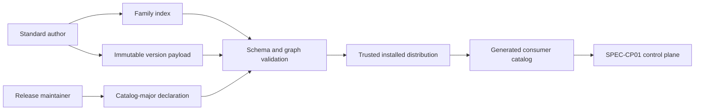
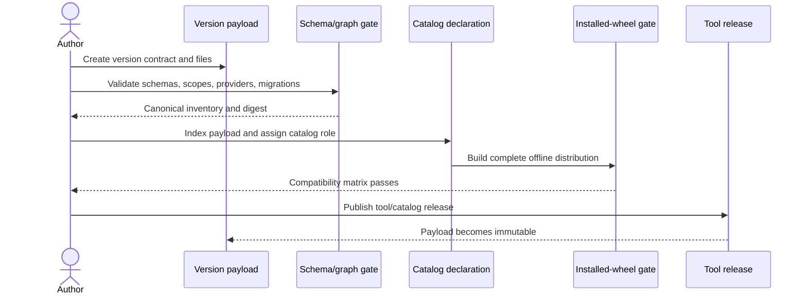

# `Standard Bundle Authoring V2` — Specification (Full)

## Revision History

| Version | Date | Author | Change |
| --- | --- | --- | --- |
| 0.1 | 2026-07-10 | Coding agent with owner-approved design | Initial Full specification for the V2 package-family index, immutable payload, catalog-channel, semantic-contribution, provider, migration, and conformance contract. |
| 0.2 | 2026-07-10 | Coding agent with round-1 review | Corrected provider phase vocabulary and goal traceability; sourced the 11-family V5 estimate; defined exact legacy managed-block signatures and migration behavior; normalized catalog placeholders and legacy current-state terminology. |
| 0.3 | 2026-07-10 | Chris Purcell / L3DigitalNet | Owner approval after round-1 remediation; SPEC-BA01 superseded and implementation planning authorized. |
| 0.4 | 2026-07-10 | Coding agent with foundation-plan review | Clarified the existing aggregate-digest algorithm: every inventory entry uses the full lowercase `sha256:` digest form, all entries sort together, and one exact golden vector fixes the byte contract. No scope or requirement changed. |
| 0.5 | 2026-07-10 | Chris Purcell / L3DigitalNet with coding agent | Added the missing declaration mechanisms already required by FR-006 and FR-018: payload-owned relation evidence and explicit legacy-state registration. Also corrected the semantic-contribution example to use the normative TOML selector grammar. |
| 0.6 | 2026-07-10 | Coding agent with owner-authorized foundation implementation | Recorded the BA02 foundation evidence in requirement traceability. This evidence-only revision changes no requirement or scope; provider execution, live semantic mutation, current-package reconstruction, and release activation remain follow-on work. |
| 0.7 | 2026-07-12 | Codex package-migration closeout | Reconcile traceability with all nine reconstructed packages, real composition, installed-wheel providers, legacy migration, release-baseline, projection, and disposable release-cut evidence through `a891973`. No requirement or scope changes. |
| 0.8 | 2026-07-12 | Chris Purcell / L3DigitalNet with coding agent | Revised the V5 launch estimate from 11 to the nine catalog 5 families. `project-toolbox` and `agent-managed-repo` are dedicated post-v5 programs and do not gate SPEC-MT01 Step 07 or the v5.0.0 release. Capacity requirements and the generic authoring contract are unchanged. |
| 0.9 | 2026-07-12 | Chris Purcell / L3DigitalNet with Codex | Reviewed and accepted the empty implementation Deviations Log. No requirement or scope changed. |
| 0.10 | 2026-07-12 | Chris Purcell / L3DigitalNet with Codex | Added the owner-approved, fail-closed contract for explicitly relinquishing an unrecognized whole file to consumer ownership during legacy migration. Known package-history signatures remain mandatory for ownership-acquiring, destructive, shared, lock-import, and bounded-block transitions. |
| 0.11 | 2026-07-12 | Chris Purcell / L3DigitalNet with Codex and combined contract audit | Make ownership relinquishment target-verifiable through a static single-target signature pointer binding, preserve unknown-and-unclaimed fail-closed behavior and known-claim compatibility, and reconcile the amended migration traceability. |
| 0.12 | 2026-07-13 | Codex implementation reconciliation with independent adversarial review | Record passing source/wheel, migration, stale-plan, no-write/no-lock, and managed-transition evidence for FR-037. No requirement or package-authoring scope changed. |

**Spec lifecycle:** This document is approved and change-controlled. Post-approval scope changes require a revision row and owner re-approval. Implementation deviations belong in the [Deviations Log](#deviations-log). This specification supersedes SPEC-BA01 as the authoring design contract; the implemented V1 package remains migration history until the approved plan replaces it.

---

## 1. Purpose & Background

SPEC-BA01 established one `standard.toml` per standard, a separate `adopt.toml` artifact plane, package versions described as a supported list plus one global `latest`, and several package-specific adoption modes. That contract was sufficient for the manifest graph and V5 readiness foundation, but it cannot describe the approved consumer control plane.

The V5 platform needs multiple immutable versions of one standard to coexist in an installed distribution. It must resolve catalog-scoped defaults and candidates, validate version-specific options, compose semantic units in consumer-owned files, invoke only bounded trusted providers, and migrate both package versions and legacy consumers without a network dependency. A mutable bundle with one current manifest and one current artifact set cannot satisfy those requirements.

This specification defines the breaking V2 Standard Bundle Authoring contract. It separates stable package-family identity, immutable version payloads, and catalog-major channel policy. It gives package authors one exact, machine-checkable format for documentation, configuration, resources, artifacts, semantic contributions, providers, migrations, integrity, and acceptance evidence. It also defines the reconstruction gate every current package must pass before the control plane may advertise it as V5-compatible.

The resulting authoring surface is deliberately declarative. Adding a package or package version changes package data, schemas, and trusted payload code; it does not add a package-ID branch to the shared resolver, planner, executor, or validator.

---

## 2. Scope

### 2.1 In Scope

- The V2 `standards/{id}/` package-family anatomy and `standard.toml` family-index schema.
- Complete immutable `versions/{major.minor}/` payloads and the `payload.toml` schema.
- Package option schemas, resources, versioned documentation, artifacts, semantic contributions, referenced extensions, providers, and migrations.
- Repository-level `catalogs/{catalog-major}.toml` channel declarations.
- Payload integrity, publication immutability, authoring workflow, graph/catalog validation, and conformance evidence.
- Reconstruction and compatibility requirements for every current package.
- The V2 Standard Bundle Authoring package's own `2.0` payload and author templates.

### 2.2 Out of Scope (Non-Goals — never)

| ID | Non-Goal | Reason |
| --- | --- | --- |
| NG-001 | Re-specify consumer init, resolution, planning, application, locking, recovery, or CLI behavior. | SPEC-CP01 owns runtime/control-plane behavior; this specification owns the package inputs it consumes. |
| NG-002 | Permit package precedence, order-dependent results, or implicit conflict resolution. | ADR 0023 requires conflict-free composition without precedence. |
| NG-003 | Let consumer configuration name executable providers, remote content, or artifact sources. | Only immutable catalog-trusted payloads may supply executable behavior or managed content. |
| NG-004 | Use package manifests as a second consumer desired-state or applied-state authority. | `.standards/config.toml` and `.standards/lock.toml` own those planes. |
| NG-005 | Make one standard depend on another merely for platform services, config containers, or shared files. | Packages consume the generic platform and remain independently selectable under ADR 0013. |

### 2.3 Won't Have in v1 (deferred — not never)

| ID | Deferred Capability | Why Deferred | Revisit When |
| --- | --- | --- | --- |
| WH-001 | Remote third-party package registries or downloaded payload content. | V5 requires deterministic offline operation from one trusted installed distribution. | A separately secured distribution and trust specification is approved. |
| WH-002 | Consumer-authored provider plugins or adapter implementations. | They would weaken payload trust, preflight completeness, and portable composition. | A sandboxed extension contract is designed and threat-modeled. |
| WH-003 | Patch components in package payload versions. | The approved package identity is `major.minor`; tool releases carry patch-level delivery fixes. | Operational evidence shows package-level patch identity is necessary. |
| WH-004 | Automatic publication to external package services. | V5 needs repository and wheel correctness, not another release channel. | The project adopts an external standards-package ecosystem. |

### 2.4 Boundaries

| Boundary | Description |
| --- | --- |
| System owns | Package-family and payload schemas, authoring rules, catalog-source declarations, integrity rules, templates, generated schema artifacts, graph/catalog conformance, and package compatibility evidence. |
| System depends on | SPEC-CP01; ADRs 0023-0024; the project-spec, Markdown Tooling, and applicable package standards; the trusted `project-standards` distribution. |
| System does not own | Consumer config/lock contents, live repository mutation, adapter library selection, package-specific policy choices, MCP transport, or Git-host repository settings. |

---

## 3. Context

### 3.1 Current State

Nine bundles carry one mutable `standard.toml`. Seven link to current `adopt.toml` artifact manifests; Python Coding uses legacy adoption `reference-only`, and Standard Bundle Authoring uses legacy adoption `none`. The manifest combines family identity, adoption mode, current/supported package versions, legacy YAML namespaces, resources, authorities, relationships, providers, and artifact linkage. `registry.json` separately tracks consumer contract versions. Runtime bundle mirrors and graph/catalog tests prove current-tree parity, not installability of multiple historical versions.

Shared root artifacts still expose the limitations of that model: whole-file ownership collisions, printed but unapplied fragments, byte-identical `_shared` files with no semantic ownership, direct-write package tooling, and package-specific provenance state. The approved root-artifact design and SPEC-CP01 replace those behaviors with immutable payloads, package-owned semantic units, typed providers, migrations, and one central lock.

### 3.2 Target State

Each package has one mutable family index and any number of immutable version payloads. Every advertised payload is complete, offline-installable, independently validated, and content-addressed. Repository catalog declarations assign channel roles without changing the payload. The generated consumer catalog can therefore expose defaults, retained releases, and breaking candidates while the ordinary meaning of `latest` remains stable for a catalog major.

Package authors describe desired semantics rather than imperative installation steps. The control plane validates all declarations, resolves one payload, plans the complete virtual tree, invokes only declared providers, and applies through its executor. Historical payloads remain byte-stable and usable until a breaking catalog release intentionally removes them.

### 3.3 Assumptions

| ID | Assumption | Impact if False |
| --- | --- | --- |
| A-001 | Catalog-advertised payload content ships inside the trusted `project-standards` distribution. | Remote retrieval, signature trust, caching, and availability require a separate specification. |
| A-002 | Package payload versions use exact `major.minor` identity. | Schemas, selectors, paths, and migration endpoints must be revised together. |
| A-003 | A package's root landing documentation may evolve while released payload documentation remains immutable. | The family/payload authority split would need a different documentation model. |
| A-004 | Current package behavior can be represented by whole artifacts, typed semantic contributions, bounded providers, and explicit migrations. | Any exception blocks V5 advertisement until the package or generic model is redesigned. |
| A-005 | Git tags and released catalog snapshots provide the baseline against which post-publication payload mutation can be detected. | An independent immutable artifact store would be required. |

### 3.4 Constraints

| ID | Constraint | Source |
| --- | --- | --- |
| C-001 | A plain control-plane initialization enables no package. | SPEC-CP01 FR-001 and FR-002. |
| C-002 | `latest` is catalog-scoped and non-breaking absent explicit package-major authorization. | ADR 0024. |
| C-003 | Shared containers remain consumer-owned; packages own only declared semantic units. | ADR 0023 and the root-artifact design. |
| C-004 | The platform executor is the sole supported live repository writer during reconciliation. | SPEC-CP01 FR-035. |
| C-005 | Every advertised payload and operation works with network access disabled. | SPEC-CP01 FR-016 and FR-028. |
| C-006 | Referenced extensions remain consumer-owned and cannot overlap managed inputs or outputs. | SPEC-CP01 FR-036. |
| C-007 | Existing package behavior is preserved or changed through an approved and tested V5 migration. | SPEC-CP01 NFR-007. |

---

## 4. Goals

| ID | Goal | Success Signal | Achieved By |
| --- | --- | --- | --- |
| G-001 | Make every advertised package version a real immutable offline payload. | Installed-wheel tests load and reconcile every catalog entry without network access. | FR-004-FR-009, FR-020-FR-021, FR-024, FR-034; NFR-001-NFR-003 |
| G-002 | Separate package identity, payload behavior, and catalog channel policy. | No family or payload manifest contains a global `latest` or candidate/default role. | FR-001-FR-003, FR-022-FR-025 |
| G-003 | Make package composition declarative and conflict-free. | All declared scopes validate before providers run; pairwise/full-set plans are order-independent. | FR-010-FR-014, FR-017; NFR-004, NFR-006 |
| G-004 | Bound package behavior behind typed trusted provider and migration contracts. | Mutation spies observe no direct writes and all effects match declarations; explicit ownership relinquishment neither materializes nor locks the preserved target. | FR-015-FR-019, FR-037; NFR-005 |
| G-005 | Give authors one repeatable release and compatibility gate. | A new version requires data/schema/test additions, not shared package-ID dispatch. | FR-026-FR-033; NFR-007-NFR-009 |

---

## 5. Stakeholders and Users

| Role / Stakeholder | Concern | Involvement |
| --- | --- | --- |
| Standard author | Exact package anatomy, schemas, migrations, and evidence required for publication. | Authors and maintains family/payload content. |
| Control-plane implementer | Stable, generic, complete package inputs. | Builds validators, catalog generation, reconciliation, and compatibility tests. |
| Consumer repository owner | Predictable package selection, preservation of local content, and safe upgrades/removal. | Reviews config and reconciliation plans; authorizes application. |
| Release maintainer | Immutability, catalog role correctness, offline wheel completeness, and version classification. | Reviews and publishes tool/catalog releases. |
| Future MCP implementer | Manifest-first, read-only discoverability without a parallel standards model. | Consumes generated catalog and package resources after the readiness gate. |

---

## 6. Glossary

| Term | Definition | Notes / Not to be confused with |
| --- | --- | --- |
| Package family | One standard's stable identity and lifecycle across all payload versions. | Represented by root `standard.toml`; not a selectable version. |
| Family index | The V2 root `standard.toml` that identifies the family and inventories payload paths/digests. | Contains no global latest/channel or consumer state. |
| Payload | Complete immutable contract and content for one exact package `major.minor`. | Distinct from tool release and package-owned internal contract options. |
| Catalog declaration | Repository source assigning payloads a role for one catalog major. | Generates consumer `catalog.toml`; not part of a payload. |
| Semantic contribution | Package-owned value at one target path, adapter, and normalized scope. | The surrounding container stays consumer-owned. |
| Shared identity | Stable content identity intentionally referenced by several packages for one identical normalized contribution. | Reference-counted; never precedence. |
| Whole artifact | Exclusive file destination managed as one unit. | Used only when semantic composition is unnecessary. |
| Referenced extension | Typed consumer-owned file input selected through package config and recorded by path/digest. | Never stored in the package-owned namespace or deleted by the package. |
| Provider | Trusted payload-declared implementation of a generic operation with a phase/effect/schema contract. | Consumer config cannot name or replace it. |
| Migration endpoint | Typed package-version or legacy-state identifier connected by a migration declaration. | Package disablement is not a version endpoint. |
| Advertised payload | Payload included by a released catalog declaration and installed distribution. | Immutable after first release; a repository-only draft may still change. |

---

## 7. Requirements

### 7.1 Functional Requirements

| ID | Requirement | Rationale | Acceptance Criteria | Priority |
| --- | --- | --- | --- | --- |
| FR-001 | The V2 standard shall define `standards/{id}/README.md`, `standard.toml`, and `versions/{major.minor}/` as the package-family baseline. | Stable identity must remain separate from version behavior. | Schema/layout fixtures accept the normative tree and reject missing family files, version paths outside `versions/`, and mismatched IDs. | Must |
| FR-002 | The V2 family index shall use `schema_version = "2.0"`, one `[standard]` table (`id`, `name`, `summary`, `status`), and one `[[versions]]` entry (`version`, `payload`, `digest`) per payload. | Family discovery needs a small stable contract. | Generated schema requires exactly these fields, rejects extras, enforces unique exact versions, and matches directory identity. | Must |
| FR-003 | Family indexes and payloads shall not declare `latest`, default, retained, candidate, reference-only, or internal catalog roles. | One immutable payload can have different roles across catalog majors. | Negative fixtures reject channel fields outside catalog declarations. | Must |
| FR-004 | Each indexed version shall provide `payload.toml`, `config.schema.json`, `README.md`, and `agent-summary.md`; consumer-available payloads shall also provide `adopt.md`. | Every resolved package needs complete version-specific behavior and documentation. | Payload-tree validation rejects missing required resources and rejects `adopt.md` for reference-only or internal payloads. | Must |
| FR-005 | `payload.toml` shall use `schema_version = "1.0"` and declare exact standard ID, exact package version, and availability of `consumer`, `reference-only`, or `internal`. | The legacy adoption-mode enum no longer describes unified control-plane packages. | Schema fixtures reject legacy `validator`, `copy-adopt`, `cli`, and `none` values and mismatches with the family index. | Must |
| FR-006 | A payload shall declare version-specific capabilities, platform capabilities consumed, and companion/extends/conflicts relations; independent shall remain the undeclared default and `requires` shall be invalid. Every extends/conflicts relation shall identify one payload-owned, digest-covered ADR evidence resource. | Capabilities and relationships may evolve between package versions without hidden dependencies, while constraining relations need immutable justification. | Graph fixtures validate relationships per payload, require exact non-orphan ADR evidence for extends/conflicts, and reject hidden requirements. | Must |
| FR-007 | Every payload shall publish a Draft 2020-12 JSON Schema for its package options, with `additionalProperties: false`; options shall resolve only under `standards.STANDARD_ID.config`. | Package settings need one version-aware and collision-free authority. | Schema/default tests reject unknown options and any package claim over another namespace or control-plane meta key. | Must |
| FR-008 | Every configurable option shall be required or carry a deterministic default; a schema/behavior selector such as `contract_version` shall be an ordinary package option distinct from package version. | Effective config must be complete and package/contract versions must remain separate. | Default extraction and migration fixtures prove deterministic effective config and independent selectors. | Must |
| FR-009 | Every payload resource shall declare a stable resource ID, role, safe payload-relative path, media type, and SHA-256 digest. | Documentation and future MCP consumers need version-correct content-addressed resources. | Resource fixtures reject invalid IDs, unsafe paths, missing files, media mismatches, and digest drift. | Must |
| FR-010 | Each whole artifact shall declare stable ID, source path/digest, repository-relative target, `managed` or `create-only` policy, exclusive ownership, and optional POSIX mode. | Exclusive files retain safe update/removal behavior without semantic overreach. | Artifact fixtures cover create, equal-adopt, update, drift, create-only preservation, removal, mode, and collision. | Must |
| FR-011 | Each semantic contribution shall declare stable ID, target, adapter, normalized scope selector, ownership policy, and exactly one static source or render provider. | Shared containers require smallest-unit ownership and preflight completeness. | Contribution schema and adapter fixtures reject missing, ambiguous, parent/child-overlapping, or multiply sourced units. | Must |
| FR-012 | A contribution shared by independent packages shall declare a stable shared identity and normalize to the same adapter, scope, value, and digest in every referencing payload. | Shared values need reference counting without package precedence. | Graph fixtures accept identical references and reject shared-ID value, digest, adapter, or scope disagreement. | Must |
| FR-013 | V1 adapters and selectors shall cover whole files, TOML keys/tables, JSON/JSONC keys and stable set entries, YAML mappings and stable keyed entries, EditorConfig section/property pairs, and delimiter-bounded Markdown blocks. | Current packages need typed ownership for every shared surface. | Adapter schema fixtures and the root-artifact surface matrix cover every current destination. | Must |
| FR-014 | Contribution bounds shall be statically valid before provider execution, and provider output shall be rejected when it exceeds the declared target, adapter, scope, or allowed action. | A provider must not acquire broader ownership dynamically. | Malicious/invalid output fixtures fail before executor invocation and preserve the live tree. | Must |
| FR-015 | Each provider shall declare stable ID, generic operation, kind, phase, allowed effect, payload-resource entrypoint, input/output schema, and referenced resources. | Provider behavior must be version-correct, typed, and schedulable. | Schema and installed-wheel tests resolve entrypoints only inside the selected payload and reject undeclared phases/effects or global/unqualified implementations. | Must |
| FR-016 | Read-only providers shall return findings or content from declared immutable snapshots; mutation-intent providers shall return typed mutation plans and shall never write the live repository. | The platform executor is the sole reconciliation writer. | Filesystem/network spies cover every provider; direct writes, undeclared reads, and undeclared effects fail conformance. | Must |
| FR-017 | Each referenced extension shall bind one config option to an allowed content type, repository-relative path policy, and optional preferred `.standards/extensions/{id}/` location while retaining consumer ownership. | Specialized inputs need reproducibility without managed ownership. | Path/digest/disable fixtures reject package-namespace and output overlap and preserve extension content. | Must |
| FR-018 | Each migration shall declare stable ID, typed `package:VERSION` or `legacy:STATE` endpoints, automatic or manual mode, provider or instruction resource, reversibility, affected config/artifact/contribution identities, and any exact legacy signatures it recognizes. Every legacy endpoint shall resolve to an explicit payload-owned legacy-state declaration. | Version and legacy transitions need explicit bounded plans, and state tokens must not become typo-tolerant implicit registrations. | Migration graph validation rejects unknown package versions, unregistered legacy states, unknown signatures outside FR-037's owner-resolution path, unrelated edges, incomplete effect inventories, and automatic migrations without providers. | Must |
| FR-019 | Every advertised package-major entry and exit shall have a declared path; a non-automatic rollback shall identify its exact manual instructions and limitations. | Candidate authorization is useful only when transition consequences are known. | Candidate fixtures cover forward entry, exact-target exit, automatic rollback, manual rollback, and missing-path rejection. | Must |
| FR-020 | Every regular file inside an indexed payload directory shall be declared and digested, except `payload.toml`, which is included directly in the aggregate inventory. | Undeclared content would escape catalog integrity and lifecycle rules. | Inventory fixtures reject undeclared, missing, duplicate, and symlink-escaped files. | Must |
| FR-021 | The family index aggregate digest shall be SHA-256 over a canonical sorted inventory containing the raw `payload.toml` digest and every declared path/digest pair. | Catalogs and locks need a deterministic non-self-referential payload identity. | Independent implementations produce the same lowercase `sha256:HEX` value and detect any byte change. | Must |
| FR-022 | Repository catalog sources shall live at `catalogs/{catalog-major}.toml`, declare `schema_version = "1.0"` and `catalog_major`, and assign every included package/version/digest one role: `default`, `retained`, `candidate`, `reference-only`, or `internal`. | Channel policy belongs to the catalog, not the package. | Catalog schema and generation tests reject mismatched digests, invalid roles, and versions absent from family indexes. | Must |
| FR-023 | Each catalog major shall declare exactly one default version for every consumer package it offers ordinarily; candidate and retained entries shall not change that default implicitly, and a candidate shall use a non-default package major. | Ordinary `latest` must remain unambiguous and non-breaking. | Catalog-channel tests cover default uniqueness, same-major compatible advancement, retained/candidate coexistence, candidate-major separation, and cross-major promotion. | Must |
| FR-024 | A payload may change before release but shall become immutable after first inclusion in a released catalog; any correction shall use a new package version. | Exact pins and historical migrations require byte-stable payloads. | Release checks compare published payload digests with tagged catalog baselines and fail mutation or deletion. | Must |
| FR-025 | Removing an advertised payload, incompatibly changing an ordinary default, or promoting a breaking candidate shall follow ADR 0024's tool/catalog-major rules. | Author actions must preserve consumer version guarantees. | Release classification tests and review evidence map every catalog diff to the required tool release level. | Must |
| FR-026 | Package adoption guides shall cover suitability, package options, artifacts/contributions, companions, migrations, and verification while linking to—not restating—common control-plane mechanics. | One entry point should reduce contradictory package procedures. | Documentation checks detect legacy imperative adoption instructions and required package-specific sections. | Must |
| FR-027 | Root `README.md` shall be a mutable family landing page; the selected payload's `README.md` shall be authoritative for that version, and its agent summary shall link to that versioned README with the canonical-authority notice. | Current navigation and historical normative content have different lifecycles. | Link/authority/3,000-byte checks pass for every payload summary. | Must |
| FR-028 | The standard shall define an author workflow that creates the payload, validates schemas/content, computes digests, indexes it, proves conformance, assigns a catalog role, and only then publishes it. | Publication ordering prevents incomplete catalog entries. | The V2 README and template checklist enumerate the workflow and CI enforces its prepublication gates. | Must |
| FR-029 | Every current package shall be reconstructed as V2 payload data and pass fresh, migrated, individual, pairwise, and all-package compatibility tests before being advertised as V5-compatible. | V5 must not strand or silently weaken current standards. | A compatibility matrix records all current packages, payloads, surfaces, migrations, and passing evidence. | Must |
| FR-030 | Legacy `standard.toml`, `adopt.toml`, `registry.json`, YAML fragments, `_shared` files, package-specific locks, and deployed Markdown/TOML/YAML managed-block marker formats shall be migration inputs only after V2 activation, not parallel V2 authorities. | Split authoring and consumer authority would make reconciliation non-deterministic, while deployed bounded blocks need an explicit ownership transition. | Dependency/runtime searches find no V2 reads except explicit migration adapters; Agent Handoff fixtures recognize its exact legacy instruction, Codex-hook, and project-config markers without treating them as canonical V2 delimiters. | Must |
| FR-031 | The Standard Bundle Authoring package shall dogfood this contract as internal package version `2.0`, ship family/payload/catalog templates, and replace its V1 README only after SPEC-BA02 approval. | The meta-standard must demonstrate its own contract without prematurely retiring BA01. | Self-hosting schema/graph/catalog tests pass; BA01 remains historical and is marked superseded only on approval. | Must |
| FR-032 | Family, payload, option, and catalog schemas shall be generated from strict typed models and checked into the distribution with drift tests. | Prose alone cannot enforce the exact V2 contract. | Schema snapshots use Draft 2020-12, reject unknown fields, and match generated output byte-for-byte. | Must |
| FR-033 | Shared control-plane and graph code shall dispatch by declared adapter/provider/schema data and contain no ordinary package-ID branches. | New standards must remain data additions rather than platform rewrites. | Architecture tests and review reject package-ID conditionals outside explicit legacy migrations and package-owned provider code. | Must |
| FR-034 | The build shall package each indexed payload under `project_standards/payloads/{standard-id}/{version}/` with a byte-identical relative tree; repository payload directories remain the sole authoring authority. | Runtime discovery needs one exact installed path without creating a second editable payload source. | Source-to-wheel parity tests cover every file/digest and reject missing, extra, transformed, or separately maintained runtime copies. | Must |
| FR-037 | A migration provider may resolve an unrecognized `whole-file` legacy signature only by explicitly relinquishing that exact target to consumer ownership. The payload's matching legacy-signature declaration shall include a canonical `consumer_owned_intent_pointer`; that field is valid only on a `whole-file` signature with exactly one target, and one pointer may bind at most one signature target in a payload. Raw package migration input shall explicitly select the target's consumer-owned mode through that pointer. The provider shall return `ownership = "consumer-owned"`, `disposition = "preserve"`, the exact observed target and digest, and an `intent_pointer` that exactly echoes the declaration; that pointer shall be one of the provider's recognized settings and its raw pre-default value shall be the literal string `consumer-owned`; the engine shall prove the claim signature, target, and pointer match the static declaration; and the resolved payload shall materialize no artifact or contribution at that target. `intent_pointer` is an optional claim field required only for this unknown-signature exception and forbidden when the claim matches declared package history or uses another ownership/disposition pair. Every observed unknown signature shall retain `CP-MIGRATION-LEGACY-DIGEST` unless one fully valid FR-037 claim clears that exact observation, including when the provider returns no claim. The result records owner resolution rather than adding package history. | A package must be able to decline ownership without allowing defaults, a provider-selected target, or a broad package switch to substitute for target-specific owner authorization; changing existing known-signature preserve behavior; or claiming that consumer-authored bytes were previously shipped or semantically validated by the package. | Source/wheel fixtures prove the static pointer-to-signature-target binding; reject invalid, duplicate, mismatched, reused, or extraneous declarations/claims and a provider-selected different target; retain the digest finding for unknown observations with rejected or absent claims; preserve existing known consumer-owned claims without the field; show the relinquishment in preview with the observed digest; bind stale-plan apply; perform no write; and create no artifact, contribution, package-unit, or lock entry. Unknown bounded blocks and all managed, destructive, shared, or lock-import claims continue to require declared known digests and fail closed. | Must |

### 7.2 Non-Functional Requirements

| ID | Category | Requirement | Measurement / Acceptance Criteria | Priority |
| --- | --- | --- | --- | --- |
| NFR-001 | Determinism | Identical package files shall generate byte-identical family digests, schemas, catalogs, and compatibility plans. | Repeated generation and randomized discovery-order tests produce no diff. | Must |
| NFR-002 | Offline operation | Every catalog-advertised payload and provider shall validate and execute with network access disabled. | Installed-wheel matrix passes under a network-deny fixture. | Must |
| NFR-003 | Integrity | Any advertised payload byte change, undeclared file, or digest mismatch shall fail before resolution or provider execution. | Tamper fixtures cover every payload file class. | Must |
| NFR-004 | Composition | Package discovery or request order shall not change normalized ownership, conflicts, or final planned bytes. | Permutation tests cover pairs and the full current catalog. | Must |
| NFR-005 | Safety | Provider and path contracts shall prevent supported writes or reads outside declared repository-confined bounds. | Filesystem/symlink/network spies cover every provider and referenced path. | Must |
| NFR-006 | Preservation | Applying and removing package contributions shall preserve all undeclared consumer bytes and semantic units. | Round-trip fixtures retain comments, ordering, quoting, trailing commas, and unrelated content byte-for-byte. | Must |
| NFR-007 | Maintainability | Adding a package version shall require only package/payload/catalog declarations, generated artifacts, and package-owned tests. | No shared resolver/planner/executor source change is needed for a fixture package using existing generic contracts. | Must |
| NFR-008 | Scale | Validation and catalog generation for 100 packages, 1,000 payloads, and 10,000 declared units shall complete within ten seconds on the normal Linux CI runner. | Deterministic benchmark records the threshold excluding external validators. | Should |
| NFR-009 | Diagnostics | Every authoring validation failure shall name the package, version, manifest path, stable code, and offending identity without exposing file content or secrets. | Snapshot tests cover schema, digest, overlap, provider, migration, and catalog failures. | Should |

### 7.3 Interface Requirements

| ID | Interface | Requirement | Contract / Format | Acceptance Criteria |
| --- | --- | --- | --- | --- |
| IR-001 | Family index | The system shall parse and validate V2 `standards/{id}/standard.toml`. | Strict TOML schema described by FR-002. | Valid/invalid fixture corpus and generated JSON Schema pass. |
| IR-002 | Payload manifest | The system shall parse and validate `versions/{version}/payload.toml`. | Strict TOML schema covering FR-005-FR-020. | Valid/invalid fixture corpus and generated JSON Schema pass. |
| IR-003 | Package option schema | The system shall validate package config against the selected payload's schema. | JSON Schema Draft 2020-12; closed object rooted at package `config`. | Defaults, invalid values, and unknown-key tests pass. |
| IR-004 | Catalog source | The system shall parse and validate `catalogs/{catalog-major}.toml`. | Strict TOML schema described by FR-022-FR-023. | Catalog generation/channel fixtures pass. |
| IR-005 | Generic provider | The system shall invoke version-qualified packaged providers through typed immutable-snapshot input and finding/content/mutation-plan output contracts. | Phase/effect-specific JSON-compatible schemas. | Installed-wheel dispatch and mutation-spy tests pass. |
| IR-006 | Generated consumer catalog | Package authoring output shall supply every package/version/channel/digest fact required by `.standards/catalog.toml`. | SPEC-CP01 catalog schema; generated, never hand-edited. | Generator round-trip and drift checks pass. |
| IR-007 | Installed payload root | The distribution shall expose byte-identical payload trees at one version-qualified package-data path. | `project_standards/payloads/{standard-id}/{version}/`. | Source/wheel inventory and digest parity pass for every indexed payload. |

### 7.4 Data Requirements

| ID | Data Entity | Requirement | Validation Rules | Ownership |
| --- | --- | --- | --- | --- |
| DR-001 | Package family | Preserve stable identity and lifecycle independently of versions. | Unique kebab ID equals directory name; strict status vocabulary. | Root family index. |
| DR-002 | Payload inventory | Preserve exact version, manifest digest, declared-file inventory, and aggregate digest. | Unique `major.minor`; complete safe paths; SHA-256 format. | Family index plus payload. |
| DR-003 | Package config contract | Preserve option types, constraints, defaults, references, and internal contract selectors per payload. | Closed Draft 2020-12 schema; deterministic defaults. | Selected payload. |
| DR-004 | Managed output declaration | Preserve whole-artifact and semantic-unit identity, target, ownership, source/provider provenance, policy, and digest bounds. | Unique stable IDs; non-overlapping normalized scopes. | Selected payload; applied facts copied to central lock. |
| DR-005 | Provider contract | Preserve provider identity, phase/effect, implementation resource, schemas, and declared resources. | Selected-payload resource entrypoint; closed enums and schemas. | Selected payload. |
| DR-006 | Migration graph | Preserve typed endpoints, direction, effects, reversibility, provider/manual evidence, and any explicit whole-file owner-resolution evidence. | Endpoints exist or use registered legacy states; major transitions have paths. For an unrecognized whole-file relinquishment only, the signature statically binds one `consumer_owned_intent_pointer` to its sole target; the claim echoes that pointer and the exact observed target/digest; the raw value is `consumer-owned`; and the resolved payload excludes that target. A known-history consumer-owned preserve claim carries no `intent_pointer`. | Payload declaring the transition; observed digest and claim intent pointer are preview/apply evidence only and never package-history authority. |
| DR-007 | Catalog role | Preserve catalog-major-specific package/version/digest and channel role. | Exact family/payload match; one ordinary default per consumer package. | Repository catalog declaration. |
| DR-008 | Installed payload tree | Preserve the canonical payload's complete relative structure and bytes in the distribution. | Exact file/digest parity; no extra runtime mirror authority. | Generated wheel package data. |

---

## 8. Architecture and Design

### 8.1 Architecture Summary

The V2 authoring model has three separate layers. A package-family index identifies one standard and inventories its payloads. Each version directory contains the complete immutable package contract and every file needed to use it. A repository catalog declaration assigns those payloads roles for one tool/catalog major. Generated schemas and graph/catalog validators join the layers and reject any incomplete, contradictory, unsafe, or mutable publication.

The family layer changes when identity, lifecycle, or the available-version inventory changes. The payload layer changes only before publication; afterward a new version is required. The catalog layer may reuse one immutable payload in several catalog majors with different roles. Consumer desired/applied state never enters any layer.

Payload declarations are inputs to generic control-plane components. Whole artifacts go through the exclusive-file adapter. Semantic contributions go through syntax-preserving adapters selected by manifest data. Providers receive immutable snapshots and return bounded typed outputs. Migrations connect exact package or registered legacy endpoints. The executor and central lock remain outside this specification under SPEC-CP01.

### 8.2 Architecture Views

#### 8.2.1 Context View



#### 8.2.2 Package Container View

```text
standards/{id}/
├── README.md
├── standard.toml
└── versions/
    └── {major.minor}/
        ├── payload.toml
        ├── config.schema.json
        ├── README.md
        ├── agent-summary.md
        ├── adopt.md                 # consumer availability only
        ├── artifacts/               # when declared
        ├── resources/               # when declared
        ├── providers/               # when declared
        └── migrations/              # when declared

catalogs/
└── {catalog-major}.toml
```

Optional directories are absent when unused; empty directories are not package content. Every regular payload file is declared and inventoried.

#### 8.2.3 Component View

| Component | Responsibility | Interfaces | Notes |
| --- | --- | --- | --- |
| Family index model | Validate stable identity and payload inventory. | `standard.toml`, family JSON Schema. | Replaces BA01's combined current-state manifest. |
| Payload model | Validate one complete version contract. | `payload.toml`, payload JSON Schema. | Contains no catalog channel or consumer state. |
| Option-schema validator | Validate version-specific package settings and defaults. | `config.schema.json`. | Fixed namespace derives from standard ID. |
| Integrity builder | Inventory declared files and compute aggregate digest. | Raw files and canonical digest algorithm. | Rejects undeclared/symlink-escaped content. |
| Graph validator | Validate relationships, scopes, shared identities, provider bounds, and migrations. | All family/payload models. | Runs before provider execution. |
| Catalog-source model/generator | Validate catalog roles and produce consumer catalog facts. | `catalogs/{catalog-major}.toml`. | Channel policy remains outside payloads. |
| Compatibility suite | Prove package behavior individually and in composition. | Repository and installed-wheel fixtures. | Gates V5-compatible advertisement. |
| Payload packager | Copy canonical indexed payloads into the version-qualified installed package-data root. | Source payload tree and wheel contents. | Mechanical byte-preserving build step only. |

### 8.3 Design Decisions

| ID | Decision | Rationale | Alternatives Considered | ADR |
| --- | --- | --- | --- | --- |
| D-001 | Use a family index plus immutable version directories. | Separates stable identity from complete historical behavior without repeating family data in every version. | Fully independent repeated bundles; monolithic inline version manifest. | ADR 0023 |
| D-002 | Keep catalog roles outside both family and payload manifests. | One payload may be default, retained, or candidate in different catalog majors. | Global package latest; payload-owned candidate flag. | ADR 0024 |
| D-003 | Replace adoption modes with payload availability plus capabilities/providers. | All new consumer adoption uses one control plane; legacy modes conflate delivery with behavior. | Retain validator/copy-adopt/cli enum. | ADR 0023 |
| D-004 | Use one `payload.toml` structural manifest with referenced supporting files. | One validation root preserves atomic package meaning while keeping schemas, docs, and source files maintainable. | Many independently authoritative sub-manifests; one monolithic file with embedded content. | ADR 0023 |
| D-005 | Derive the package option namespace from standard ID. | Fixed namespacing removes duplicate ownership declarations and top-level collisions. | Arbitrary dotted namespace claims. | ADR 0023 |
| D-006 | Declare semantic units rather than package ownership of shared containers. | Preserves consumer content and enables order-independent composition. | Whole-file package ownership; precedence; fragment printing. | ADR 0023 |
| D-007 | Require provider phases/effects and executor-only live mutation. | Complete preflight and read-only validation are impossible with direct-write providers. | Trust providers to write; classify only by operation. | ADR 0023 |
| D-008 | Declare migrations in the payload that introduces the transition. | Older immutable payloads need not change when a new major or rollback path is published. | Edit both endpoints; central hardcoded migrations. | ADR 0024 |
| D-009 | Make released payload bytes immutable and corrections new versions. | Exact pins, rollback, provenance, and offline reproducibility require stable content. | Mutable historical payloads with updated digests. | ADR 0024 |

### 8.4 Solution Alternatives Considered

| Alternative | Why Rejected |
| --- | --- |
| Fully independent version bundles | Repeats identity and lifecycle metadata across every version and creates unnecessary drift opportunities. |
| Monolithic family manifest with inline versions | Makes historical review, payload-local validation, and immutable content boundaries harder. |
| Extend current `standard.toml` plus `adopt.toml` in place | Preserves global latest, legacy adoption modes, and one-current-payload assumptions that conflict with the approved control plane. |
| Put channel roles in payloads | Prevents one immutable payload from serving different roles across catalog majors. |

### 8.5 Design Constraints

- No payload or catalog validation may execute provider code.
- No payload path may be absolute, contain traversal/backslashes/null bytes, or escape through symlinks.
- No consumer config value may introduce a provider, adapter, source path for managed content, or remote URL.
- No semantic unit may overlap another package's mutable parent or child scope.
- No generated schema, catalog, or integrity file may be hand-maintained without drift enforcement.
- No released payload may be edited or removed within the same supported catalog major.
- No shared platform component may special-case a package ID except inside an explicit legacy migration adapter.

### 8.6 Dependency Policy

| Dependency | Allowed? | Reason |
| --- | --- | --- |
| Python standard library (`tomllib`, `hashlib`, `pathlib`) | Yes | Parsing, integrity, and path primitives already required by the repository. |
| Pydantic | Yes | Existing strict typed manifest/schema generation contract. |
| JSON Schema Draft 2020-12 validator | Yes | Package options and generated schema fixtures require standards-based validation. |
| Syntax-preserving TOML/JSONC/YAML/EditorConfig libraries | Conditional | SPEC-CP01 implementation planning selects and verifies them against preservation fixtures. |
| Network clients or remote package loaders | No | Advertised payloads must operate offline. |
| Package-specific shared-core plugins | No | Generic adapters/providers consume declarations; package-specific code stays payload-owned. |

---

## 9. Data Model

### Family Index

The family index has this normative shape:

```toml
schema_version = "2.0"

[standard]
id = "python-tooling"
name = "Python Tooling"
summary = "A reproducible Python project toolchain and verification gate."
status = "active"

[[versions]]
version = "1.2"
payload = "versions/1.2/payload.toml"
digest = "sha256:0123456789abcdef0123456789abcdef0123456789abcdef0123456789abcdef"
```

`standard.id` is the natural key and matches the package directory. `versions.version` is unique within the family and matches `major.minor`. Entries sort by numeric major then minor. `payload` must equal the canonical path for that exact version. `digest` is the aggregate payload digest from §9.5. Family status follows ADR 0018: `draft`, `review`, `active`, `deprecated`, `archived`, or `superseded`.

### Payload Manifest

The payload is strict TOML. The tables below define the contract; unknown tables or fields are invalid.

```toml
schema_version = "1.0"

[payload]
standard = "python-tooling"
version = "1.2"
availability = "consumer" # consumer | reference-only | internal

[config]
schema_resource = "config-schema"

[capabilities]
provides = ["python.verify", "python.tooling"]
consumes_platform = ["project-standards.reconcile"]

[relations]
companions = ["python-coding"]
extends = ["base-standard"]
conflicts = []

[[relation_evidence]]
kind = "extends" # extends | conflicts
target = "base-standard"
resource = "base-standard-extension-adr"
```

`companions` need no decision evidence. Every `(kind, target)` pair in `extends` or `conflicts` has exactly one `[[relation_evidence]]` entry; duplicate, missing, or orphan evidence is invalid. `resource` identifies a declared `relation-evidence` Markdown resource in the same immutable payload. The evidence records why the relationship is necessary without creating a hidden installation dependency.

All resources use array-of-table entries so each carries typed metadata:

```toml
[[resources]]
id = "readme"
role = "canonical-standard"
path = "README.md"
media_type = "text/markdown"
digest = "sha256:..."

[[resources]]
id = "agent-summary"
role = "agent-summary"
path = "agent-summary.md"
media_type = "text/markdown"
digest = "sha256:..."

[[resources]]
id = "config-schema"
role = "config-schema"
path = "config.schema.json"
media_type = "application/schema+json"
digest = "sha256:..."

[[resources]]
id = "base-standard-extension-adr"
role = "relation-evidence"
path = "decisions/base-standard-extension.md"
media_type = "text/markdown"
digest = "sha256:..."
```

Resource IDs are unique lowercase kebab tokens. Required roles are `canonical-standard`, `agent-summary`, `config-schema`, and, for consumer availability, `adoption-guide`. A relation-evidence entry requires a same-payload resource with role `relation-evidence` and media type `text/markdown`. Additional roles may describe templates, examples, policies, schemas, migration instructions, or package-local resources.

### Managed Outputs and Extensions

Whole artifacts declare exclusive destination ownership:

```toml
[[artifacts]]
id = "python-version"
target = ".python-version"
source = "artifacts/python-version"
digest = "sha256:..."
policy = "managed" # managed | create-only
mode = "0644"      # optional
```

Semantic contributions declare the smallest adapter-owned unit:

```toml
[[contributions]]
id = "ruff-config"
target = "pyproject.toml"
adapter = "toml"
scope = "table:/tool/ruff"
source = "resources/ruff.toml"
source_digest = "sha256:..."
policy = "managed"

[[contributions]]
id = "editorconfig-root"
target = ".editorconfig"
adapter = "editorconfig"
scope = "property:$global#root"
source = "resources/editorconfig-root.txt"
source_digest = "sha256:..."
policy = "managed"
shared_identity = "project-standards/editorconfig/root/true"
```

Exactly one of `source` or `provider` is present. Static sources carry a digest. Provider-rendered values are bounded by the same adapter/scope and gain an applied digest in the central lock. Scope grammar is adapter-specific and normalized before graph comparison. `shared_identity` is optional; when present, every reference must normalize identically.

V1 scope selectors use these exact canonical forms:

| Adapter | Selector forms | Examples |
| --- | --- | --- |
| `whole-file` | `$file` | `$file` |
| `toml` | `key:JSON_POINTER` or `table:JSON_POINTER` | `key:/project/requires-python`, `table:/tool/ruff` |
| `json` / `jsonc` | `key:JSON_POINTER`, `set:JSON_POINTER#value=IDENTITY`, or `keyed-set:JSON_POINTER#KEY=IDENTITY` | `set:/recommendations#value=ms-python.python`, `keyed-set:/tasks#label=lint` |
| `yaml` | `key:JSON_POINTER` or `keyed-set:JSON_POINTER#KEY=IDENTITY` | `key:/jobs/check`, `keyed-set:/hooks#id=session-start` |
| `editorconfig` | `property:SECTION#KEY`; `$global` is the pre-section scope | `property:$global#root`, `property:*.py#indent_size` |
| `markdown-block` | `block:BLOCK_ID` | `block:agent-handoff-instructions` |

`JSON_POINTER` uses RFC 6901 escaping. `IDENTITY`, `KEY`, section text, and block IDs use percent-encoded UTF-8 when they contain selector delimiters. Table/mapping selectors own their descendants and therefore overlap any nested table/key selector. Set identities compare normalized values; keyed sets require unique scalar identity keys. New V2 Markdown delimiters are derived from the block ID as `BEGIN project-standards:BLOCK_ID` and `END project-standards:BLOCK_ID` inside valid HTML comments. Adapter schemas reject any selector form not listed for that adapter.

Pre-V2 delimiters are never interpreted as canonical V2 block IDs. A payload migration claims them only through exact `[[legacy_signatures]]` data, maps the recognized content to declared V2 contributions, and removes the old markers in the same previewed mutation plan. This applies to deployed Agent Handoff HTML instruction blocks, TOML Codex-hook blocks, and YAML project-config blocks. Unknown or locally modified content between recognized delimiters remains consumer-owned and blocks automatic migration.

Referenced extensions bind config to consumer-owned input:

```toml
[[extensions]]
id = "extra-ruff-rules"
option = "extra_rules_file"
media_type = "application/toml"
path_policy = "repository-relative"
preferred_root = ".standards/extensions/python-tooling/"
```

The option schema must type the bound option as a path string. The control plane resolves containment and output overlap. The package records but never owns or deletes the referenced file.

### Providers and Migrations

Providers use a closed phase/effect contract:

```toml
[[providers]]
id = "render-ruff-config"
operation = "render"
kind = "python"
phase = "plan"               # plan | inspect | validate | verify | authoring
effect = "content"           # findings | content | mutation-plan
entrypoint = "payload:provider-render-ruff#render_ruff"
input_schema = "render-ruff-input"
output_schema = "render-ruff-output"
resources = []
```

An executable entrypoint uses `payload:RESOURCE_ID#EXPORTED_SYMBOL`. The resource ID, input schema, and output schema identify files and digests declared in `[[resources]]`; resolution is therefore automatically scoped to the selected package version and aggregate digest. `command` and `workflow` kinds use the same payload-resource boundary and typed protocol, not shell strings, global executable names, or consumer repository paths. `documentation-only` has no entrypoint and cannot satisfy a required executable operation. Network access is prohibited for catalog reconciliation providers.

The V2 operation vocabulary is `validate`, `verify`, `fix`, `lint`, `drift-check`, `id-next`, `extract`, `render`, `scaffold`, `upgrade`, `migrate`, and `semantic-review`. Phase/effect combinations are closed:

| Phase | Allowed effects | Use |
| --- | --- | --- |
| `plan` | `findings`, `content`, `mutation-plan` | Reconciliation rendering, analysis, and migration planning against immutable snapshots. |
| `inspect` | `findings`, `content` | Read-only extraction, ID calculation, and diagnostic views. |
| `validate` | `findings` | Read-only conformance and lint checks. |
| `verify` | `findings` | Read-only post-apply verification. |
| `authoring` | `findings`, `content`, `mutation-plan` | Explicit non-reconciliation authoring commands such as scaffold, fix, or upgrade. |

Operation mappings are also closed: `validate`, `lint`, `drift-check`, and `semantic-review` use `validate/findings`; `verify` uses `verify/findings`; `id-next` and `extract` use `inspect/content`; `render` uses `plan/content`; `migrate` uses `plan/mutation-plan`; and `fix`, `scaffold`, and `upgrade` use `authoring/mutation-plan`. Adding an operation or combination requires a BA02 revision rather than a free-form manifest value.

Every declared executable provider implementation must be present. Optional package behavior is modeled by whether config/artifact/contribution/migration declarations reference the provider, not by permitting a missing implementation.

Migration endpoints use `package:MAJOR.MINOR` or a registered `legacy:STATE` token:

```toml
[[legacy_states]]
id = "v4-python-tooling"

[[migrations]]
id = "legacy-v4-to-2"
from = "legacy:v4-python-tooling"
to = "package:2.0"
mode = "automatic"           # automatic | manual
provider = "migrate-v4"
reversible = true
affected = ["config:*", "artifact:python-version", "contribution:ruff-config"]
signatures = []

[[migrations]]
id = "2-to-1-rollback"
from = "package:2.0"
to = "package:1.2"
mode = "manual"
instructions = "migrations/rollback-2-to-1.md"
reversible = false
affected = ["config:*", "contribution:ruff-config"]
```

Legacy states are package-local conceptual pre-V2 conditions, not artifact signatures. Each `legacy_states.id` is a unique lowercase kebab token. Every `legacy:STATE` endpoint names a state declared in the same payload, and every state declaration is used by at least one migration. A state may have zero, one, or several observable signatures; the migration's `signatures` list retains that exact mapping without duplicating it in the state declaration.

Exactly one of `provider` or `instructions` is required according to mode. At least one package endpoint equals the containing payload version. `affected` uses typed identity prefixes and must cover every returned action. Manual transitions remain plan-visible and block automatic apply until their declared prerequisites are satisfied.

Legacy signatures are versioned payload data and are referenced by ID from migrations:

```toml
[[legacy_signatures]]
id = "agent-handoff-instructions-v1"
kind = "bounded-block"
format = "markdown"
targets = ["AGENTS.md", "CLAUDE.md"]
begin = "\u003c!-- BEGIN agent-handoff managed instructions --\u003e"
end = "\u003c!-- END agent-handoff managed instructions --\u003e"
known_content_digests = ["sha256:..."]

[[legacy_signatures]]
id = "agent-handoff-codex-hook-v1"
kind = "bounded-block"
format = "toml"
targets = [".codex/config.toml"]
begin = "# BEGIN agent-handoff managed codex hook"
end = "# END agent-handoff managed codex hook"
known_content_digests = ["sha256:..."]

[[legacy_signatures]]
id = "agent-handoff-project-config-v1"
kind = "bounded-block"
format = "yaml"
targets = [".project-standards.yml"]
begin = "# BEGIN agent-handoff managed config"
end = "# END agent-handoff managed config"
known_content_digests = ["sha256:..."]

[[legacy_signatures]]
id = "consumer-workflow-v4"
kind = "whole-file"
targets = [".github/workflows/check.yml"]
known_content_digests = ["sha256:..."]
consumer_owned_intent_pointer = "/python_tooling/workflow_ownership"
```

`kind` is `whole-file` or `bounded-block`; a bounded block requires exact begin/end bytes and a declared format. `targets` are contained repository-relative paths. `known_content_digests` identify normalized block bodies or whole-file bytes previously shipped by the package. Marker presence alone never proves managed ownership. Optional `consumer_owned_intent_pointer` is a canonical JSON pointer valid only on a single-target whole-file signature; each pointer may appear on at most one signature in a payload. It statically binds raw consumer intent to that exact target and does not add any observed digest to package history. The Agent Handoff legacy migration lists all three of its signature IDs in its `signatures` field and maps each recognized block to its V2 contribution or config state.

FR-037's whole-file owner-resolution path is deliberately separate from `known_content_digests`: it does not recognize, adopt, import, validate, or extend package history. It records that the repository owner explicitly selected consumer ownership through the pointer statically bound to the signature's sole target and that the package declines all lifecycle authority over the exact observed bytes. Every unknown observation retains the ordinary digest finding unless a fully valid claim clears it. Unknown bounded blocks and any transition that would manage, alter, remove, share, or lock content remain inapplicable until the observed digest matches declared package history.

### Integrity

Each referenced regular file declares a lowercase SHA-256 digest. Validation recursively inventories the payload directory and rejects undeclared files, duplicate canonical paths, unsupported file types, and symlinks.

The aggregate digest is computed from a canonical inventory:

1. Compute the raw-byte SHA-256 of `payload.toml`.
2. Create an entry for `payload.toml` and one entry for every other declared file as `NORMALIZED_PATH NUL SHA256_DIGEST LF`, where `NORMALIZED_PATH` is encoded as UTF-8 and `SHA256_DIGEST` is the full lowercase ASCII form `sha256:` followed by 64 lowercase hexadecimal digits.
3. Sort the complete entry set—including `payload.toml`—by normalized UTF-8 path bytes.
4. SHA-256 the concatenated entries and encode `sha256:LOWERCASE_HEX`.

The family index and every catalog reference carry this aggregate. `payload.toml` does not carry its own aggregate, avoiding a self-reference.

The following algorithm-only golden vector fixes the exact bytes independently of payload-shape validation:

| Path | Raw bytes | File digest |
| --- | --- | --- |
| `README.md` | UTF-8 `# Demo` followed by LF | `sha256:31ca6c61ca3fcc54029a62bd082448b88718b913d24e195794969dd2d123b990` |
| `payload.toml` | UTF-8 `schema_version = "1.0"` followed by LF | `sha256:c78775ad9c87559888ed09f8d82522c0f210fd3faae238de83a8118502569180` |

Byte sorting places `README.md` before `payload.toml`. Concatenating both `PATH NUL DIGEST LF` entries produces aggregate `sha256:eb5608592b65f5e627a592e1af5db67222a43fb0fadd6002f77f5cda3f10943a`.

### Catalog Source

```toml
schema_version = "1.0"
catalog_major = 5

[[packages]]
id = "python-tooling"
version = "1.2"
digest = "sha256:..."
role = "default" # default | retained | candidate | reference-only | internal
```

The natural key is `(catalog_major, id, version)`. Each digest must equal the family index. A consumer package has exactly one `default` entry per catalog major in which it is ordinarily offered. A reference-only or internal family has no default/candidate entry. The generated consumer catalog adds tool-release and generation metadata; authors do not hand-edit those facts.

Catalog roles must match payload availability: `consumer` permits `default`, `retained`, or `candidate`; `reference-only` requires the same-named role; and `internal` requires `internal`.

---

## 10. Behavior and Workflows

### 10.1 Primary Workflow



Steps:

1. Select a new `major.minor` based on package compatibility.
2. Create the version directory from the V2 template.
3. Author versioned docs, config schema, resources, outputs, providers, and migrations.
4. Validate the payload without executing providers and compute the aggregate digest.
5. Add the exact version/path/digest to the family index.
6. Run repository and installed-wheel package/composition conformance.
7. Add the payload to the target catalog with an appropriate role.
8. Classify and publish the tool release under ADR 0024.

Expected result:

> The released distribution contains one immutable, independently verifiable payload whose catalog role is explicit and whose consumer behavior requires no package-specific shared-core logic.

### 10.2 Alternate Workflows

| ID | Trigger | Behavior | Expected Result |
| --- | --- | --- | --- |
| AW-001 | Author adds a non-breaking package update. | Create a higher minor on the same major, retain required historical payloads, and update the catalog default only after compatibility passes. | Ordinary `latest` advances compatibly. |
| AW-002 | Author publishes a breaking candidate. | Create a new package major with entry/exit migrations and assign `candidate` in the current catalog. | Payload is available only with explicit major authorization. |
| AW-003 | A later catalog major promotes a candidate. | Reuse the immutable payload digest and assign it `default` in the new catalog. | Catalog-major opt-in changes ordinary defaults without payload mutation. |
| AW-004 | Package is reference-only or internal. | Publish complete docs/resources/config schema as applicable and assign the corresponding catalog role without consumer adoption guide/actions. | Package remains discoverable but cannot be enabled as an ordinary consumer package. |
| AW-005 | Existing package migrates to V2. | Reconstruct one or more payloads, declare exact legacy file/block signatures and migrations, and pass the full compatibility matrix before advertisement. | Legacy artifacts and deployed markers become migration evidence, not active authority. |
| AW-006 | Released payload needs correction. | Leave it byte-identical, author a new package version, and update catalog roles according to compatibility. | Pins and historical migration inputs remain reproducible. |
| AW-007 | A repository explicitly retains an unrecognized whole file under consumer ownership while adopting the rest of a package. | Declare a unique `consumer_owned_intent_pointer` on the single-target whole-file signature; require raw target-specific consumer-owned intent; return the same recognized `intent_pointer` and the exact observed target/digest as `consumer-owned`/`preserve`; prove declaration/claim/target equality, the raw `consumer-owned` value, and resolved-payload exclusion; expose the relinquishment in preview; and bind apply to the same bytes. | Migration preserves the file byte for byte without package validation, writes, drift checks, lifecycle actions, or lock ownership. A later switch to managed ownership requires a separate reviewed adoption or replacement path. |

### 10.3 Edge Cases

| ID | Edge Case | Expected Behavior |
| --- | --- | --- |
| EC-001 | Family version path or embedded payload identity disagrees. | Reject the family before catalog generation. |
| EC-002 | Payload contains an undeclared file or changed bytes. | Reject integrity before provider loading. |
| EC-003 | Two packages claim parent/child semantic scopes. | Reject the combination unless both normalize to one identical shared unit. |
| EC-004 | Shared identity matches but normalized values differ. | Report every owner and reject; no package wins. |
| EC-005 | Provider returns an undeclared path, scope, effect, or action. | Reject output before executor invocation and classify as trusted-payload integrity failure. |
| EC-006 | Candidate has forward migration but no automatic rollback. | Require an exact manual rollback declaration with limitations; otherwise reject candidate advertisement. |
| EC-007 | Root family README differs from an older payload README. | Resolve the payload README as authoritative for that version; do not rewrite historical docs. |
| EC-008 | Same immutable payload is default in one catalog and candidate/retained in another. | Accept; channel role is catalog-specific. |
| EC-009 | Package option schema attempts to define `enabled`, `version`, provider, or catalog fields. | Reject reserved control-plane properties. |
| EC-010 | Referenced extension aliases a managed or semantic output after canonical resolution. | Reject before provider execution and preserve the consumer file. |
| EC-011 | Released catalog baseline cannot be located during release checking. | Block publication until immutable-baseline evidence is restored; never assume the payload is unchanged. |
| EC-012 | A target contains a recognized pre-V2 delimiter but its body digest is unknown or modified. | Preserve the entire block, report migration ambiguity, and require explicit owner resolution; never claim it from markers alone. |
| EC-013 | An observed unknown signature has no claim, or an unrecognized-whole-file relinquishment claim lacks a valid static single-target `consumer_owned_intent_pointer` binding; omits or mismatches `intent_pointer`; names an unrecognized or non-`consumer-owned` raw value; targets a bounded block; reports a different target/digest; or accompanies a resolved artifact/contribution for the target. | Retain `CP-MIGRATION-LEGACY-DIGEST`, reject invalid provider output when present, preserve the live file, and produce no lock entry. A known-history consumer-owned preserve claim remains valid without `intent_pointer`. |

### 10.4 State Transitions

| State | Meaning | Entry Condition | Exit Condition |
| --- | --- | --- | --- |
| Draft payload | Version directory may change and is not in a released catalog. | Author creates the payload. | Conformance passes and a release advertises it, or author deletes it before release. |
| Advertised payload | Released catalog and wheel include the exact digest. | Release publication succeeds. | Never mutates; may later become retained or unsupported by catalog policy. |
| Default | Catalog role used by ordinary `latest`. | Catalog declares one compatible default. | Compatible replacement in same catalog major or explicit new catalog major. |
| Candidate | Breaking major available only through authorization. | Current catalog advertises a non-default major. | Remains candidate/retained or is promoted by a new catalog major. |
| Retained | Advertised historical payload remains exactly selectable. | Catalog keeps the payload without making it ordinary default. | A breaking catalog release removes support. |
| Reference/internal | Discoverable payload is not ordinarily consumer-enabled. | Catalog assigns role matching payload availability. | New payload/catalog policy changes availability intentionally. |

---

## 11. UI Pages / API Endpoints

No browser UI or network API is in scope. The supported interfaces are the versioned TOML/JSON files in §7.3, authoring validation commands implemented under the later plan, generated catalog/resources, and SPEC-CP01's existing CLI. Future MCP tools consume the generated package graph and catalog; they do not define a second package contract.

---

## 12. Error Handling and Recovery

### 12.1 Expected Failures

| ID | Failure Mode | User/System Behavior | Logging / Observability | Recovery |
| --- | --- | --- | --- | --- |
| ERR-001 | Family or payload schema invalid | Stop before graph/catalog work. | Stable code names file, field, package, and version. | Correct the authoring source and rerun validation. |
| ERR-002 | Unsafe, missing, undeclared, or digest-drifted payload file | Stop before provider discovery. | Report normalized path and expected/actual digest without content. | Restore bytes or intentionally publish a new version. |
| ERR-003 | Config schema/default invalid | Reject payload and catalog inclusion. | Report JSON pointer and package/version. | Correct schema/defaults; do not reinterpret consumer config. |
| ERR-004 | Artifact destination or semantic scope conflict | Reject the affected graph/catalog combination. | Report every package/version/identity/target/scope. | Narrow or redesign declarations; use identical shared identity only when values truly match. |
| ERR-005 | Provider contract invalid or implementation missing from wheel | Reject payload advertisement. | Report provider ID, phase/effect, entrypoint, and missing resource. | Package the exact implementation or remove the declaration. |
| ERR-006 | Provider violates runtime contract | Stop before any returned action is applied; treat direct live writes as integrity incidents. | Stable finding records declared and observed effects and affected paths. | Restore from version control/lock evidence and publish a corrected new payload version. |
| ERR-007 | Migration graph incomplete or ambiguous | Reject major transition/candidate advertisement. | Report endpoints and missing/competing paths. | Add an exact automatic or manual transition declaration in the new payload. |
| ERR-008 | Catalog role/default invalid | Refuse generated catalog publication. | Report catalog major, package, versions, and roles. | Correct repository catalog declaration. |
| ERR-009 | Released payload differs from tagged baseline | Block release and preserve both evidence digests. | Report package/version, baseline tag, and changed paths. | Revert historical mutation and publish changes as a new package version. |
| ERR-010 | Legacy reconstruction is ambiguous | Do not advertise the package as V5-compatible. | Compatibility report inventories unmatched settings/artifacts/signatures. | Add explicit migration data or obtain package-specific owner resolution. |
| ERR-011 | Unknown whole-file owner resolution is absent or invalid | Stop before any migration action is applied and retain the ordinary unknown-digest finding for every observation not cleared by a fully valid FR-037 claim. | Report the target plus the missing or mismatched static binding, claim intent pointer/value, ownership, disposition, digest, or payload-exclusion condition without exposing file content. | Correct the package declaration, option, provider, or payload contract, or use a separate reviewed managed adoption path. |

### 12.2 Retry and Idempotency

Authoring validation, digest generation in check mode, graph validation, catalog generation in check mode, and installed-wheel conformance are deterministic and safe to rerun. Schema, integrity, conflict, migration, and catalog failures are permanent until authoring inputs change; tooling does not retry them automatically. A failed build or test may be rerun after restoring the same source inputs and must yield identical digests and findings.

### 12.3 Rollback / Recovery

Unreleased payload work recovers through ordinary version control. Released payloads are never repaired in place: restore their tagged bytes, then author a successor payload. Catalog-role mistakes that have not been released may be corrected normally. Once released, removal or incompatible default changes follow ADR 0024's catalog-major process. Consumer repository recovery remains governed by SPEC-CP01 and the central lock.

---

## 13. Security and Privacy

### 13.1 Authentication

No package-authoring network service exists. Repository and release authentication remain Git-host and release-pipeline concerns outside this specification.

### 13.2 Authorization

| Actor / Role | Allowed Actions | Denied Actions |
| --- | --- | --- |
| Standard author | Create unreleased payloads, schemas, providers, migrations, docs, and tests. | Edit released payload bytes or consumer state. |
| Release maintainer | Assign catalog roles, review immutable baselines, and publish a validated distribution. | Bypass schema/integrity/conformance gates or silently reclassify breaking defaults. |
| Consumer config author | Select package/options through SPEC-CP01. | Supply executable providers, adapters, managed sources, or remote payloads. |
| Payload provider | Read declared snapshots/resources and return schema-valid bounded output. | Directly write live files, read undeclared inputs/secrets, access network, or escape repository scope. |

### 13.3 Secrets

Package families, payloads, schemas, providers, migrations, catalogs, fixtures, and diagnostics contain no secret values. Option schemas may accept credential references such as environment-variable names, OpenBao paths, or secret names only. Fields designated as references must be redacted appropriately in diagnostics.

### 13.4 Sensitive Data

| Data | Classification | Storage | Transmission | Retention |
| --- | --- | --- | --- | --- |
| Package manifests/docs/source | Public or internal according to repository visibility | Git and installed distribution | Normal Git/release transport | Git history plus advertised support lifetime |
| Payload/catalog digests | Internal integrity metadata | Git, catalog, consumer lock | Normal Git/release transport | Same as payload/catalog |
| Referenced-extension paths | Consumer internal metadata | Consumer config/lock, not package | Normal consumer Git transport | Consumer controlled |
| Secret values | Prohibited | Not stored | Not transmitted | None |

### 13.5 Threats and Mitigations

| Threat | Impact | Mitigation |
| --- | --- | --- |
| Payload path traversal or symlink escape | Read/write outside repository or package | Resolve containment, reject links/absolute/traversal/backslash/null-byte paths before packaging. |
| Catalog points to altered payload | Supply-chain mismatch or unreproducible pins | Aggregate digest parity across family, catalog, wheel, and tagged baseline. |
| Config injects executable behavior | Arbitrary code execution | Closed package option schemas; providers/adapters resolve only from trusted payload declarations. |
| Trusted provider writes directly or exceeds bounds | Unplanned mutation during validation/reconciliation | Immutable snapshots, no supported live-write API, effect schemas, mutation spies, and integrity-incident handling. |
| Shared identity hides different content | One package silently overrides another | Normalize and compare adapter/scope/value/digest; reject any disagreement. |
| Historical payload edited after release | Broken pins, rollback, or audit | Baseline digest checks and new-version-only correction policy. |
| Diagnostics expose content or secret references | Information disclosure | Report paths, IDs, digests, and redacted values—not file content or credential values. |

### 13.6 Hardening Checklist

- [x] Cookie/session settings — N/A; no web session.
- [x] CSRF/CORS policy — N/A; no browser/network API.
- [x] Webhook/API signatures — N/A; no webhook/API.
- [x] Sensitive-data redaction — required by NFR-009 and §13.3.
- [x] CI/CD secret handling — package content prohibits secret values.
- [x] Network exposure — providers and conformance run offline.
- [x] Identity-header trust — N/A; no auth proxy.
- [x] Least privilege — authoring tools use current repository permissions and repository-confined paths.

---

## 14. Capacity and Scale Assumptions

| Dimension | v1 Expectation | Growth Assumption | Design Consequence |
| --- | --- | --- | --- |
| Package families | 9 current and planned for V5 launch | Up to 100 without redesign | Discovery and schemas remain generic and manifest-driven. |
| Payload versions | 1-3 per family initially | Up to 1,000 total | Family indexes and catalog sources reference payloads rather than embedding them. |
| Declared outputs/resources | Tens per payload | Up to 10,000 total units | Graph validation uses normalized identities and indexed conflict checks. |
| Payload size | Mostly documentation/config/source; under a few MiB each | Historical payloads accumulate within catalog support policy | Catalog removal is explicit; no runtime cache/download layer in V1. |
| Provider execution | Package-specific and bounded | External validators may dominate runtime | Authoring validation does not execute providers; performance threshold excludes external validators. |

V5 launches with the nine families in catalog 5. The separately tracked `project-toolbox` and `agent-managed-repo` programs begin after v5.0.0 and use this same generic authoring contract without changing its 100-family scale target.

---

## 15. Risks

| ID | Risk | Likelihood | Impact | Mitigation | Owner |
| --- | --- | --- | --- | --- | --- |
| R-001 | V2 manifest becomes too broad or hard to author. | Medium | High | One payload manifest, generated schemas, templates, examples, and authoring validation with stable diagnostics. | Standard maintainer |
| R-002 | Historical payload duplication increases repository/wheel size. | Medium | Medium | Retain only advertised support, measure wheel size, and remove only through catalog-major policy. | Release maintainer |
| R-003 | Provider version qualification is difficult to package correctly. | Medium | High | Require installed-wheel parity and dispatch tests for every advertised provider. | Control-plane implementer |
| R-004 | Syntax-preserving adapters cannot meet byte-preservation requirements for one format. | Medium | High | Block affected package advertisement until a proven adapter or narrower bounded-edit strategy exists. | Adapter owner |
| R-005 | Legacy package behavior has ambiguous ownership or no reversible migration. | High | High | Use explicit signatures/manual migration declarations and fail closed; never infer ownership. | Package owner |
| R-006 | Family landing docs drift from versioned normative docs. | Medium | Medium | Clear authority notices, link tests, and payload-specific agent summaries/adoption guides. | Standard author |
| R-007 | Catalog roles accidentally weaken `latest`. | Low | High | Strict default uniqueness, release-diff classification, and ADR 0024 channel tests. | Release maintainer |
| R-008 | Explicit ownership relinquishment preserves stale, unsafe, or semantically incompatible consumer content. | Medium | High | Make the path non-default and target-specific through a static single-target pointer binding; require raw owner intent; show the exact digest in preview; perform no package validation, write, or lock claim; document consumer responsibility; and require separate review before managed takeover. | Consumer repository owner |

---

## 16. Compliance, Licensing, and Data Rights

No regulated or personal data is introduced. Every payload resource and provider inherits the repository license unless the family index/resource metadata explicitly identifies a compatible alternative. Implementation dependencies require normal license and vulnerability review. Package content must preserve source attribution where required and must not embed content the project lacks rights to redistribute offline.

---

## 17. Testing and Acceptance

### 17.1 Definition of Done

- [x] SPEC-BA02 is adversarially reviewed, owner-approved, and indexed; SPEC-BA01 is marked superseded without rewriting its history.
- [x] The V2 Standard Bundle Authoring README and package `2.0` payload define and dogfood every Must requirement.
- [x] Strict typed family, payload, and catalog models plus generated schemas and drift tests pass.
- [x] Every current package has a complete V2 reconstruction and compatibility-matrix row.
- [x] Every advertised payload passes repository and offline installed-wheel validation.
- [x] Static and provider-rendered artifacts/contributions pass preservation, conflict, update, disable, removal, and idempotency fixtures.
- [x] Provider mutation/network spies and migration forward/rollback/manual-path suites pass.
- [x] Pairwise, full-set, randomized-order, integrity, and release-baseline gates pass.
- [x] Traceability (§17.3), documentation (§18.7), security review, and the owner-accepted empty Deviations Log are complete.
- [x] No known blocking defect or unexplained deviation remains after the rev 0.11 amendment converges in audit and is implemented.
- [x] FR-037 whole-file ownership relinquishment and its separate managed-takeover boundary pass source/wheel contract, migration, stale-plan, no-write, and no-lock tests.

### 17.2 Test Strategy

| Layer | Scope | Required Coverage | Required? |
| --- | --- | --- | --- |
| Unit/domain | Typed models, version/path/digest parsing, scope normalization, catalog roles | Every branch and invalid enum/shape | Yes |
| Schema/contract | Generated JSON Schemas and valid/invalid fixture corpora | Family, payload, options, catalog, providers, migrations | Yes |
| Graph/composition | Relations, overlaps, shared identities, migrations, channel constraints | Individual, pairs, full catalog, randomized order | Yes |
| Adapter/preservation | Whole/TOML/JSONC/YAML/EditorConfig/Markdown adapters | Create/equal/update/remove/conflict plus byte preservation | Yes |
| Provider security | Phase/effect/input/output bounds and installed entrypoints | Mutation/network/undeclared-read spies and malformed output | Yes |
| Migration | Legacy and package-version transitions | Registered legacy states, fresh, forward, exact-target exit, automatic/manual rollback, exact legacy block signatures, modified-block refusal, explicit whole-file ownership relinquishment, managed-transition refusal, and stale-plan rejection | Yes |
| Installed wheel | Packaged payload completeness and offline execution | Every advertised version and provider | Yes |
| Release regression | Historical immutability and catalog-diff classification | Every published payload/catalog baseline | Yes |
| Documentation | Family/payload authority, summary limit, adoption-guide scope, links | Every payload | Yes |

### 17.3 Requirement-to-Test Traceability

| Requirement ID | Test / Verification Method | Status |
| --- | --- | --- |
| FR-001 | Family layout valid/invalid fixtures | Passing |
| FR-002 | Family-index model and generated-schema tests | Passing |
| FR-003 | Forbidden family/payload channel-field fixtures | Passing |
| FR-004 | Required payload-tree resource fixtures | Passing |
| FR-005 | Payload availability and legacy-mode rejection tests | Passing |
| FR-006 | Per-payload capability, relationship evidence, and relationship graph tests | Passing |
| FR-007 | Package option-schema namespace and closed-object tests | Passing |
| FR-008 | Effective-default and internal-contract selector tests | Passing |
| FR-009 | Resource identity/path/media/digest tests | Passing |
| FR-010 | Whole-artifact lifecycle and collision tests | Passing |
| FR-011 | Semantic-contribution source/scope validation tests | Passing |
| FR-012 | Shared-identity equality and disagreement tests | Passing |
| FR-013 | Adapter-selector schema, current-surface coverage, real pair/full-set composition, and preservation suites | Passing — `1b257c7`, `06a33c1` |
| FR-014 | Provider-output bounds, migration-report effect, authoring-plan refusal, and pre-executor rejection tests | Passing — `11ef081`, package reconstruction commits, `94f3183` |
| FR-015 | Provider declaration, entrypoint, phase/effect, source/wheel resolution, and installed command matrix | Passing — package reconstruction commits, `06a33c1`, `a891973` |
| FR-016 | Provider filesystem/network mutation spies, immutable snapshots, and typed-output tests | Passing — `1b257c7`, `94f3183`, `06a33c1` |
| FR-017 | Referenced-extension path/digest/output collision/disable preservation and real option-migration tests | Passing — `27d3e99`, `06a33c1`, `a891973` |
| FR-018 | Migration endpoint, legacy-state registration, signature, and effect-inventory schema tests | Passing |
| FR-019 | Candidate entry, exact-target exit, automatic/manual rollback, legacy migration, and accepted-track tests | Passing — core control-plane suite, `a903b54`, `af33689` |
| FR-020 | Complete payload inventory and symlink rejection tests | Passing |
| FR-021 | Canonical aggregate-digest golden tests | Passing |
| FR-022 | Catalog-source schema, role, and digest-parity tests | Passing |
| FR-023 | Catalog default uniqueness, candidate-major, and promotion tests | Passing |
| FR-024 | Tagged-baseline immutability and release-candidate replay tests | Passing — foundation release suite, `a891973` |
| FR-025 | Catalog-diff release classification and same-major compatibility tests | Passing — foundation release suite, `af33689`, `a891973` |
| FR-026 | Seven current package adoption guides cover package-specific suitability, closed options, outputs, migration, verification, and troubleshooting | Passing — Task 18 documentation/spec/generated-drift gates and independent review |
| FR-027 | Family/payload authority, link, resource role, projection, and agent-summary size/integrity tests | Passing — package contract and projection suites |
| FR-028 | Author workflow, package validation/schema/projection commands, release evidence, and CI gate documentation | Passing — Task 18 documentation/spec/generated-drift gates and release-cut proof |
| FR-029 | Seven individual, 21 pairwise, full-set, fresh/migrated, source/wheel compatibility rows | Passing — `06a33c1` |
| FR-030 | Classified tracked/installed legacy dependency inventory, all-namespace migration, exact marker/artifact fixtures | Passing — `06a33c1`, `a891973` |
| FR-031 | Standard Bundle Authoring `2.0` self-hosting, schema, graph, catalog, and template tests | Passing — `1b257c7` |
| FR-032 | Typed-model generated-schema drift tests | Passing |
| FR-033 | No-package-ID-branch architecture tests plus current-package compatibility review | Passing — `06a33c1` |
| FR-034 | Source/direct-wheel/sdist-wheel payload tree, symlink dereference, and digest parity | Passing — foundation projection suite, `06a33c1` |
| FR-037, DR-006 | Static single-target `consumer_owned_intent_pointer` declaration, claim/declaration/target equality, literal raw `consumer-owned`, unknown-and-unclaimed fail-closed retention, known-claim backward compatibility, resolved-target exclusion, preview, stale-plan, no-write/no-lock, source/wheel, and managed-transition refusal tests | Passing — focused migration lifecycle and Python Tooling lifecycle/source-wheel gates rerun 2026-07-13 |
| NFR-001 | Repeated-generation and randomized-discovery determinism tests | Passing |
| NFR-002 | Offline build/install and network-deny provider/compatibility suites | Passing — `06a33c1`, `a891973` |
| NFR-003 | Payload tamper and undeclared-file fixtures | Passing |
| NFR-004 | Pairwise/full-set request-order permutation and 100-order full-set sweep | Passing — `06a33c1` |
| NFR-005 | Path/symlink/provider read-write boundary spies and installed mutation refusal | Passing — package contract/provider suites, `06a33c1` |
| NFR-006 | TOML, JSON/JSONC, YAML, EditorConfig, Markdown, whole-file, source/wheel byte-preservation corpus | Passing — core adapter suites, `06a33c1` |
| NFR-007 | Synthetic package extensibility architecture test | Passing |
| NFR-008 | 100-family/1,000-payload/10,000-unit benchmark | Passing |
| NFR-009 | Structured diagnostic snapshot tests | Passing |
| IR-001 | Family-index parser/schema fixture suite | Passing |
| IR-002 | Payload-manifest parser/schema fixture suite | Passing |
| IR-003 | Package option-schema/default suite | Passing |
| IR-004 | Catalog-source parser/schema/generator suite | Passing |
| IR-005 | Generic provider protocol, typed effect/result bounds, source/wheel entrypoint resolution, and installed dispatch suite | Passing — package contract suites, `94f3183`, `a891973` |
| IR-006 | Generated consumer-catalog round-trip/drift suite | Passing |
| IR-007 | Installed payload root inventory, source/direct-wheel/sdist-wheel byte and digest parity | Passing — projection suites, `06a33c1` |
| DR-001 | Package-family identity/lifecycle model invariants | Passing |
| DR-002 | Payload version/inventory/digest model invariants | Passing |
| DR-003 | Package config contract serialization/default invariants | Passing |
| DR-004 | Artifact/contribution identity and ownership invariants | Passing |
| DR-005 | Provider contract serialization and resource-reference invariants | Passing |
| DR-006 | Migration graph endpoint/effect/reversibility invariants | Passing |
| DR-007 | Catalog-role uniqueness and parity invariants | Passing |
| DR-008 | Installed payload-tree byte/inventory/digest invariants and symlink-only source projection | Passing — projection/integrity suites, `06a33c1` |

---

## 18. Deployment and Operations

### 18.1 Runtime Environment

| Item | Value |
| --- | --- |
| Runtime | Python 3.14+ inside the `project-standards` CLI/distribution |
| OS / Platform | Repository-local operation on supported Linux development/CI environments |
| Datastore | Git-tracked TOML, JSON Schema, Markdown, package resources, and generated catalogs |
| External services | None required for authoring validation or payload operation |
| Hosting | Published Git refs and Python wheel/source distribution |

There is no long-running service, health endpoint, scheduler, or database.

### 18.2 Configuration

The authoring contract has no environment-variable configuration. Repository files are explicit inputs. Tool/catalog release selection remains external package/workflow configuration under SPEC-CP01.

### 18.3 Deployment Flow

1. Merge reviewed authoring-standard, schema/model, payload, migration, and compatibility changes to the release branch.
2. Run static, test, schema drift, graph/catalog, offline wheel, security, documentation, and immutable-baseline gates.
3. Build the distribution and verify every catalog-advertised payload from the installed artifact.
4. Land the release commit on `main` under `meta/versioning.md`.
5. Publish immutable full-version and moving-major tags plus the release artifact.
6. Verify the released catalog/payload digests and consumer smoke fixtures.
7. Roll back an unpublished failure by reverting source; correct a published payload only through a new version/release.

### 18.4 Rollout Controls

Breaking package candidates are the staged-rollout mechanism. A candidate is packaged and tested but excluded from ordinary defaults until explicit per-package authorization or a later catalog-major promotion. There is no hidden feature flag or remote kill switch.

### 18.5 Observability

Authoring commands emit stable human and JSON findings. CI records schema drift, package/version identity, catalog major, payload digest, test matrix result, and wheel provenance. No file content or secret value appears in diagnostics.

### 18.6 Backup and Disaster Recovery

No independent durable datastore exists. Git history, signed release tags, and published artifacts are the recovery sources. Tagged payload/catalog baselines must remain retrievable for the supported lifetime; inability to retrieve one blocks release under EC-011.

### 18.7 Documentation Deliverables

- [x] Replace the implemented Standard Bundle Authoring README with the approved V2 contract.
- [x] Ship family-index, payload, option-schema, catalog, provider, contribution, and migration templates/examples.
- [x] Update `standards/README.md`, repository README, CLI usage, versioning, changelog, upgrade guide, and ADR/spec indexes.
- [x] Reduce every package adoption guide to package-specific suitability/options/outputs/migration/verification guidance.
- [x] Document the complete current-package reconstruction and compatibility matrix.
- [x] Update handoff status, tasks, architecture, specifications/plans, and session history.

---

## 19. Implementation Plan

### MS-0 — Freeze V2 contracts

1. Reconcile review feedback and approve SPEC-BA02.
2. Finalize exact TOML/JSON schemas and examples from §9.
3. Confirm the package-version, catalog-role, provider phase/effect, adapter, and migration vocabularies.
4. Record any additional ADR required by review before code changes.

Exit criterion: approved spec and no blocking open question.

### MS-1 — Models, schemas, and authoring validation

1. Implement strict family, payload, option, and catalog models.
2. Generate and drift-test schemas.
3. Implement safe discovery, complete inventory, canonical digest, and tagged-baseline checks.
4. Extend graph validation for payload relationships, scopes, shared identities, providers, migrations, and roles.

Exit criterion: valid/invalid fixture corpora and current repository draft fixtures pass without provider execution.

### MS-2 — Generic payload/provider/contribution foundation

1. Package version-qualified resources and providers.
2. Implement typed provider phase/effect interfaces and mutation/network spies.
3. Implement declarative whole-artifact and semantic-contribution models consumed by SPEC-CP01.
4. Implement migration graph and registered legacy-state inputs.
5. Implement the generic, whole-file-only owner-resolution primitive with a static single-target `consumer_owned_intent_pointer` declaration, provider-echoed claim pointer, literal raw `consumer-owned` validation, unknown-and-unclaimed fail-closed retention, exact observed-target/digest preview/apply binding, resolved-target exclusion, and no lock ownership.

Exit criterion: synthetic packages prove the full contract without package-ID shared-core branches.

### MS-3 — Current-package reconstruction

1. Reconstruct every current package into one or more V2 payloads.
2. Assign exact config schemas, semantic scopes, shared identities, resources, providers, and migration signatures.
3. Retire active V2 reads of legacy manifests/registry/locks outside migration adapters.
4. Dogfood Standard Bundle Authoring `2.0` and create the catalog-5 declaration.

Exit criterion: every package passes fresh and migrated individual acceptance.

### MS-4 — Composition and installed-distribution acceptance

1. Run all pairs, full-set, randomized-order, adapter-preservation, disable/removal, candidate, and rollback suites.
2. Build the wheel and run every advertised payload/provider offline.
3. Complete the compatibility matrix, docs migration, changelog, and V5 upgrading guidance.
4. Produce implementation evidence and adversarial review.

Exit criterion: all DoD and traceability rows pass; no package compatibility blocker remains.

### Milestone Summary

| Milestone | Deliverable | Exit Criteria |
| --- | --- | --- |
| MS-0 | Approved contract | Exact schemas/vocabularies settled; no blocker |
| MS-1 | Machine authoring layer | Models, schemas, integrity, graph/catalog validation pass |
| MS-2 | Generic execution inputs | Synthetic package proves providers/contributions/migrations generically |
| MS-3 | Real package payloads | Every current package works fresh and migrated |
| MS-4 | V5 acceptance | Full composition/offline/release/docs gates pass |

---

## 20. Success Evaluation

| Area | Target | Measurement |
| --- | --- | --- |
| Contract completeness | 100% of advertised payload files and behavior declared, digested, and schema-valid | Inventory/schema/catalog gates |
| Current-package compatibility | Every current package passes fresh, migrated, individual, pairwise, and full-set supported cases | Compatibility matrix |
| Offline reproducibility | Every advertised payload/provider works from installed distribution with zero network access | Network-deny wheel suite |
| Composition safety | Zero order-dependent plans, silent overlaps, or undeclared consumer-byte changes | Permutation and preservation suites |
| Extensibility | Synthetic new package/version requires no shared resolver/planner/executor package branch | Architecture test and diff review |
| Historical integrity | Zero released payload digest changes within supported catalogs | Tagged-baseline release gate |

---

## 21. Open Questions and Decisions

| ID | Question | Current Assumption | Blocking? | Owner | Needed By | Status |
| --- | --- | --- | --- | --- | --- | --- |
| OQ-001 | What specification profile should BA02 use? | Full: exact author-facing contracts and conformance, while runtime behavior remains in SPEC-CP01. | No | Owner | Design | Answered 2026-07-10 |
| OQ-002 | How should multiple immutable package versions be represented? | One family index plus complete `versions/{major.minor}/` payload directories. | No | Owner | Design | Answered 2026-07-10 |
| OQ-003 | Where should default, retained, and candidate roles live? | Repository `catalogs/{catalog-major}.toml`; never in family or payload manifests. | No | Owner | Design | Answered 2026-07-10 |
| OQ-004 | Should V2 retain BA01 adoption modes and arbitrary config namespaces? | No. Use payload availability/capabilities/providers and fixed `standards.STANDARD_ID.config` ownership. | No | Owner | Design | Answered 2026-07-10 |

---

## Deviations Log

No implementation deviations are recorded. The initial design is represented directly in revision 0.1 and the answered decisions above. The owner reviewed and accepted this empty log on 2026-07-12.

---

## References

### Standards

- [Standard Bundle Authoring V1](../../standards/standard-bundle-authoring/README.md) — implemented contract to be superseded after BA02 approval.
- [Project Specification Standard](../../standards/project-spec/README.md) — specification structure and validation.
- [Repository Versioning Standard](../../meta/versioning.md) — tool/catalog/package version rules.

### Project References

- [SPEC-BA01](archive/2026-07-07-standard-bundle-authoring-standard.md) — historical Light specification.
- [SPEC-CP01](2026-07-10-consumer-standards-control-plane-spec.md) — controlling consumer runtime contract.
- [Root-artifact ownership and semantic composition](../superpowers/specs/2026-07-10-root-artifact-ownership-semantic-composition-design.md) — adapter and ownership requirements.
- [ADR 0023](../adr/adr-0023-unified-consumer-standards-control-plane.md) — unified control plane and semantic composition.
- [ADR 0024](../adr/adr-0024-catalog-scoped-package-version-channels.md) — catalog-scoped channels and accepted package majors.

---

## Appendix A: ID Conventions

| Prefix | Meaning                    | Defined In     |
| ------ | -------------------------- | -------------- |
| `G-`   | Goal                       | §4             |
| `NG-`  | Non-goal                   | §2.2           |
| `WH-`  | Deferred capability        | §2.3           |
| `A-`   | Assumption                 | §3.3           |
| `C-`   | Constraint                 | §3.4           |
| `FR-`  | Functional requirement     | §7.1           |
| `NFR-` | Non-functional requirement | §7.2           |
| `IR-`  | Interface requirement      | §7.3           |
| `DR-`  | Data requirement           | §7.4           |
| `D-`   | Design decision            | §8.3           |
| `AW-`  | Alternate workflow         | §10.2          |
| `EC-`  | Edge case                  | §10.3          |
| `ERR-` | Error handling             | §12.1          |
| `R-`   | Risk                       | §15            |
| `MS-`  | Milestone                  | §19            |
| `OQ-`  | Open question/decision     | §21            |
| `DEV-` | Implementation deviation   | Deviations Log |

IDs remain stable when priority or status changes.

---

## Appendix B: Agent Implementation Contract

### B.1 Implementation Rules

The implementer shall:

- Read this specification before changes; on later sessions reread §7, §21, and the Deviations Log.
- Treat Must requirements and the selected schemas/vocabularies as release-blocking.
- Preserve SPEC-CP01's runtime ownership and avoid duplicating its planner/executor/lock behavior here.
- Implement models and tests before reconstructing current packages.
- Keep payload and catalog behavior data-driven; flag any proposed shared package-ID branch for owner review.
- Add every requirement's evidence to §17.3 before claiming completion.
- Record underspecified behavior as an `OQ-` with a proposed assumption; do not guess silently.
- Record every divergence as a `DEV-` row and obtain approval.
- Follow MS-0 through MS-4 in order and keep handoff status/tasks/spec pointers current.

### B.2 Prohibited Behaviors

The implementer shall not:

- Mark SPEC-BA01 superseded before SPEC-BA02 approval.
- Edit a payload after it has appeared in a released catalog baseline.
- Preserve legacy adoption modes, global package `latest`, arbitrary config namespaces, or active `adopt.toml` as hidden V2 behavior.
- Execute provider code during manifest/graph/catalog validation.
- Let providers write the live repository or return effects beyond their declaration.
- Infer ownership or migrations from file resemblance without an explicit versioned signature/declaration.
- Add remote retrieval, consumer provider plugins, precedence, force-overwrite, or package-order semantics.
- Mark a requirement complete without fresh verification.

### B.3 Required Completion Report (verification gate)

The completion report shall include:

- Changed files and architecture summary.
- Each implemented requirement mapped to a passing §17.3 verification.
- Package-by-package reconstruction and compatibility evidence.
- Provider, migration, integrity, composition, offline-wheel, and release-baseline results.
- Approved/unapproved deviations and remaining risks or limitations.
- Documentation and handoff deliverables.

### B.4 Session Handoff

At each multi-session boundary, record the active milestone, requirement IDs, current-package migration status, and unresolved `OQ-`/`DEV-` items in the repository handoff surfaces. Preserve user-authored tasks and keep eager state concise.

---

## Appendix C: Optional Modules

No template optional module applies. The system has no external data integration, scheduled work, entity resolution, scoring, or relational datastore.

---

## Appendix D: Tailoring Guide

The Full profile is intentional because BA02 defines several durable machine contracts, a multi-version data model, trusted provider and migration boundaries, release/security policy, compatibility evidence, and multiple stakeholders. Runtime reconciliation remains in SPEC-CP01, preventing this specification from becoming a duplicate implementation design.
