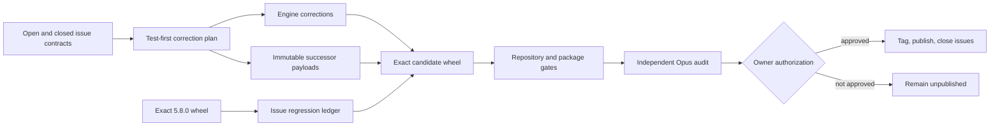

# V5 Adoption Integrity Correction Train — Specification (Standard)

## Revision History

| Version | Date | Author | Change |
| --- | --- | --- | --- |
| 0.1 | 2026-07-26 | Codex with owner-directed regression audit | Initial specification for issues #32 and #35-#49, including the verified 5.8.0 closed-issue baseline and permanent regression-proof requirement. |
| 0.2 | 2026-07-26 | Codex with Opus specification review | Resolve round-1 review findings: bound immutable TOML-guide scope, separate payload-byte and outcome compatibility, define shared path classification, make the regression ledger evolvable, correct release authorities, version diagnostic schemas, complete migration/config semantics, and require direct spec-plan traceability. |
| 0.3 | 2026-07-26 | Codex with Opus specification review | Resolve round-2 review findings: qualify the release commit after all byte-changing release preparation, update the Markdown split-ownership declaration with MD060, protect exact and default-track consumers, and preserve historical release references and lint scope. |

**Spec lifecycle:** The owner approved rev 0.3 and its governing plan on 2026-07-26 and granted the required exception to the MCP change hold for implementation through T17. This document is now change-controlled: implementation deviations belong in the [Deviations Log](#deviations-log), and scope-affecting edits require a new revision and renewed owner approval. Publication and issue closure remain separately unauthorized.

---

## 1. Purpose & Background

Project Standards 5.8.0 resolved the prior adoption-friction train, but fresh-adoption and upgrade exercises subsequently exposed sixteen additional issues across the frontmatter CLI, control-plane composition and recovery, package configuration, generated workflows, diagnostics, adoption documentation, and release-facing prose. Several issues share one failure pattern: an individual package or engine surface can appear locally correct while producing bytes, defaults, diagnostics, or guidance that conflict with another package-owned gate.

Before defining this correction train, the repository re-verified every closed GitHub issue (#3 and #8-#31) against the exact published 5.8.0 wheel. The complete source, package, compatibility, performance, coherence, Markdown, managed-document, and audit gates passed, and no closed issue had regressed. The durable [closed-issue regression audit](../reviews/2026-07-26-closed-issue-regression-audit.md) records the exact wheel identity, per-issue disposition, full command surface, and independent review digest. The audit did identify one protection gap: issue #21 is correct in current and shipped documentation, but its semantic documentation contract has no dedicated committed regression test. The correction train must preserve the verified baseline and make that proof repeatable rather than relying on another ad hoc audit.

The intended result is one internally phased, owner-approved correction train. It repairs the shared engine where the defect is engine-level, ships package behavior only through immutable successor payloads, proves fresh and migrated behavior, and qualifies one exact candidate artifact without publishing it. Publication, issue closure, and an exception to the active MCP change hold remain separate owner decisions.

---

## 2. Scope

### 2.1 In Scope

- Shared explicit-path directory classification plus command-specific diagnostics for every public frontmatter caller, including `format-frontmatter`.
- Formatter-stable JSON/JSONC semantic composition.
- Atomic reconciliation failure behavior, pre-adoption conflict guidance, and exact-path restoration of one exclusively managed whole-file target.
- TOML keyed-set matching that preserves valid entries without the optional identity field.
- Precise, structured, content-redacted TOML and Agent Handoff diagnostics.
- Immutable successor payloads for Python Tooling, Markdown Tooling, Agent Handoff, and CLI Documentation.
- Python Tooling additive configuration, non-installable repository mode, and safe fresh performance-test defaults with behavior-preserving migration.
- Markdown Tooling exclusion parity, workflow permissions, caller formatting, lint/format convergence, and safe autofix guidance.
- Agent Handoff exclusion guidance for independently managed `.agents/` files.
- Valid CLI Documentation adoption TOML and one optional consumer-owned multi-CLI usage index.
- Release-facing project/package/default consistency checks, including the current Standard Bundle Authoring 2.5 reference correction, candidate qualification, and authorized release closeout.
- A committed, machine-checkable regression ledger seeded with issues #3 and #8-#31, extended with this train before closure, and including a dedicated issue #21 semantic documentation guard.

### 2.2 Out of Scope (Non-Goals — never)

| ID | Non-Goal | Reason |
| --- | --- | --- |
| NG-001 | Walk a directory positional passed to a frontmatter command. | The supported selection authority remains explicit files or configured include/exclude globs; #32 requires a useful diagnostic, not a second discovery mode. |
| NG-002 | Rewrite unrelated consumer JSON/JSONC content to match Prettier. | Composition owns semantic units, not the physical formatting of unrelated values. |
| NG-003 | Turn managed-file restoration into general damaged-file or partial-block recovery. | The only safe authority in this train is one exact, exclusively managed whole-file target with lock-backed preconditions. |
| NG-004 | Silently treat explicit pytest performance selection with no matching tests as success. | Pytest exit code 5 remains meaningful when the consumer explicitly enables the gate. |
| NG-005 | Generate one CLI usage artifact or CI matrix per command. | #42 requires multi-CLI navigation, not multiplied generated ownership. |
| NG-006 | Publish a release or close issues without explicit owner authorization. | These are externally visible, difficult-to-reverse operations outside implementation authority. |

### 2.3 Won't Have in v1 (deferred — not never)

| ID | Deferred Capability | Why Deferred | Revisit When |
| --- | --- | --- | --- |
| WH-001 | Directory walking for frontmatter validation. | It changes file-selection semantics beyond #32. | A separately approved interface proposal defines traversal, config intersection, and compatibility. |
| WH-002 | General managed-artifact recovery. | Partial ownership and damaged-state recovery require a broader authority and threat model. | A separate recovery specification is approved. |
| WH-003 | Generated multi-CLI artifacts and command matrices. | A referenced consumer-owned index satisfies the current navigation need. | A consumer demonstrates a need for independently generated artifact identities. |
| WH-004 | Automatic configuration of every third-party tool that scans `.agents/`. | The standard cannot safely own unknown tools' configuration. | A concrete provider and ownership boundary are approved. |
| WH-005 | A new property-testing dependency. | Generated pytest parametrization can cover the bounded input domains. | The owner approves a dependency proposal supported by a coverage gap. |

### 2.4 Boundaries

| Boundary | Description |
| --- | --- |
| System owns | Project Standards engine behavior, typed diagnostics, package schemas/providers/migrations, immutable payloads, generated package artifacts, release-consistency validation, and repository regression contracts. |
| System depends on | The repository lockfiles, pinned Python and Node environments, the exact prior and candidate wheels, consumer-repository fixtures, GitHub issue evidence, and explicit owner approvals. |
| System does not own | Consumer-authored values, external tool internals, GitHub publication authorization, the active MCP implementation program, or unrelated dependency remediation. |

---

## 3. Context

### 3.1 Current State

The live issue corpus contains #32 and #35-#49. The current 5.8.0 platform already provides semantic JSON/JSONC and TOML adapters, typed reconciliation plans, atomic writes, immutable V2 payload families, migrations, package graph validation, installed-wheel parity checks, and pinned Python and Node toolchains. The open issues identify gaps or conflicting contracts within those established boundaries; they do not require a replacement control plane.

The [pre-planning regression audit](../reviews/2026-07-26-closed-issue-regression-audit.md) established this exact baseline:

- published wheel: `project_standards-5.8.0-py3-none-any.whl`;
- wheel SHA-256: `5fe1b8c6dc2e06675365f5ac9be2bc884e83be7eeb21b2b842e8a67ab18b73f4`;
- closed issue seed set: #3 and #8-#31;
- historical focused selector: 151 passing tests, retained as corroborating context because its exact transient selector was not durable;
- ordinary suite: 3,266 passed and 90 deselected;
- compatibility suite: 85 passed;
- performance suite: 5 passed;
- package, graph, schema, payload projection, coherence, Markdown, managed-document, dependency-audit, and handoff gates: passing;
- exact source-to-wheel catalog/family/payload projection: byte-equal;
- independent Opus verdict: `verified_with_advisories`, with no confirmed closed-issue regression.

GitHub numbers #1, #2, #4-#7, #33, and #34 are pull requests rather than issue records. Closed pull requests #1, #2, and #4-#6 and open pull requests #7, #33, and #34 therefore do not belong in the issue regression ledger.

Issue #21's shipped guidance is correct, but the audit needed five semantic assertions outside the committed test suite. CLI Documentation 1.1, 1.2, and 1.3 also remain byte-immutable with the invalid `command_name = null` example reported by #46; the 1.4 successor is the correction path, not an edit to those retained versions. The Node dependency audit reports a development-only `markdownlint-cli2` to `js-yaml` advisory chain; production dependencies are clean. This train must keep the pinned local/CI Markdown toolchain stable and must not expand into dependency remediation without separate approval.

### 3.2 Target State

All sixteen open issues have test-first corrections at their proper authority boundary. Engine fixes apply consistently across packages. Package-specific changes exist only in immutable successor payloads with explicit migrations and unchanged predecessor bytes. Fresh adoption and supported migration converge under the pinned formatter, linter, package, and reconciliation contracts.

The repository contains a machine-checkable issue regression ledger. Every regression-bearing issue maps to one or more stable contract IDs backed by automated tests or semantic assertions, and issue #21 has a permanent committed guard. The ledger is seeded with the audited closed issues, gains #32 and #35-#49 before those issues may close, and passes against the 5.8.0 baseline where applicable and the exact candidate wheel before release authorization.

One candidate wheel passes all required gates. Independent Opus review has no unresolved Critical or High findings. The candidate remains unpublished, the issues remain open, and implementation remains blocked until the owner separately approves the plan and grants an MCP-hold exception.

### 3.3 Assumptions

| ID | Assumption | Impact if False |
| --- | --- | --- |
| A-001 | The issue bodies and comments continue to define the requested behavior until implementation begins. | New material issue evidence requires specification and plan disposition before the affected GREEN step. |
| A-002 | The repository lockfiles remain the authority for Prettier, markdownlint-cli2, and Python tool versions. | Tool-version authority must be resolved before formatter/linter characterization or candidate comparison. |
| A-003 | Package-level behavior changes can ship as Python Tooling 1.9, Markdown Tooling 1.9, Agent Handoff 1.5, and CLI Documentation 1.4. | A different successor set requires owner approval and plan revision. |
| A-004 | The planned corrections can remain MINOR only if the NFR-008 outcome matrix proves no previously passing consumer becomes failing and NFR-009 confirms the repository classifier. | A pass-to-fail outcome or different classification blocks implementation of the affected design until the owner approves a compatible redesign or catalog-major transition. |

### 3.4 Constraints

| ID | Constraint | Source |
| --- | --- | --- |
| C-001 | Released payload bytes are immutable; behavior changes use successor payloads. | `meta/versioning.md` and ADR 0020. |
| C-002 | Package/control-plane validation uses one extracted candidate wheel first on `PYTHONPATH`. | Repository working rules. |
| C-003 | Ruff, BasedPyright strict, pytest/coverage, pip-audit, package-contract, Node, coherence, and managed-document gates remain authoritative. | Repository working rules and adopted standards. |
| C-004 | Significant non-MCP work, including implementation and release, remains blocked without an owner-directed MCP-hold exception. | Durable handoff state. |
| C-005 | Publication, issue closure, and hosted release mutation require explicit owner authorization after candidate evidence exists. | Owner instruction and `meta/versioning.md`. |
| C-006 | The current pinned Markdown dependency advisory is not remediated in this train unless separately authorized. | Scope control and the verified local/CI parity contract. |
| C-007 | No fix may weaken, delete, skip, or expected-fail an existing regression merely to make the candidate pass; behavior-preserving retargeting follows DR-002's reviewed amendment procedure. | Owner-directed closed-issue regression requirement. |
| C-008 | The governing plan shall name this specification in `spec_ref`, reuse its FR/NFR/IR/DR IDs directly, and provide total bidirectional requirement-to-task/test traceability before owner approval. | D-002 and the plan-authoring contract. |

---

## 4. Goals

| ID | Goal | Success Signal | Achieved By |
| --- | --- | --- | --- |
| G-001 | Correct all reported adoption and upgrade integrity failures at the owning boundary. | Each open issue has a focused failing regression followed by passing candidate evidence. | FR-001-FR-018, NFR-001-NFR-003 |
| G-002 | Preserve released consumers and all previously closed issue behavior. | Predecessor payload digests are unchanged, no prior pass becomes a failure, and the issue regression ledger passes in every applicable environment. | FR-019, NFR-004, NFR-005, NFR-008, DR-002 |
| G-003 | Produce one reviewable, releasable but unpublished candidate. | One extracted candidate wheel passes the complete gate and Opus has no unresolved blocker. | NFR-006, NFR-007 |
| G-004 | Keep authorization and program boundaries explicit. | No implementation starts without plan approval/MCP-hold exception and no release mutation occurs without separate authorization. | FR-020, C-004, C-005, OQ-001, OQ-003 |

---

> **§5 (Stakeholders and Users) is Full-tier** and is intentionally omitted at the Standard profile.

## 6. Glossary

| Term | Definition | Notes / Not to be confused with |
| --- | --- | --- |
| Baseline wheel | The exact published 5.8.0 wheel identified in §3.1 and used to prove pre-train behavior. | Not a source-checkout import or a newly built equivalent wheel. |
| Candidate wheel | The one final wheel built from the exact reviewed candidate commit and used for all installed-distribution gates. | Its digest is recorded before release authorization. |
| Closed-issue regression ledger | A committed machine-checkable inventory of regression-bearing issue contracts, stable regression IDs, executable proof references, environments, and amendment history. | The ledger is seeded from the audited closed set and grows before later issue closure; normal validation does not query live GitHub. |
| Closed additive configuration | A fixed, schema-declared option namespace whose values add to or explicitly modify a package baseline without permitting undeclared table keys. | Ruff rule selectors remain explicit consumer intent; "closed" describes the option surface, not an allowlist of all selector values. |
| Effective file set | The actual repository files selected by the pinned tool after applying configuration, ignore, and path semantics. | Not merely the rendered glob strings. |
| Fixed point | A state where running the declared formatter/linter/reconciler sequence again produces no change and the same passing result. | Semantic equality alone is insufficient when a package installs a physical-format gate. |
| Pre-adoption target | A declared managed whole-file destination not yet owned by the current lock. | It cannot use lock-backed restoration. |
| Restore preview | A non-mutating description of one exact managed target's current, locked, and desired digests and proposed action. | It is not general reconcile planning or `--repair-state`. |
| Successor payload | A new immutable package version that preserves its predecessor while changing behavior or guidance. | Released predecessor directories are never edited. |

---

## 7. Requirements

### 7.1 Functional Requirements

| ID | Requirement | Rationale | Acceptance Criteria | Priority |
| --- | --- | --- | --- | --- |
| FR-001 | The shared explicit-path collector shall classify a named directory separately from a missing file, and every public caller that accepts explicit files shall render an unsupported-directory diagnostic with its own config-driven no-positional invocation. | #32 reports a misleading file-not-found result in `format-frontmatter`, and the classification boundary is shared. | `format-frontmatter`, `validate-frontmatter`, `validate-id`, and every routed subcommand that supplies explicit paths return their existing usage/input exit class, name the directory, and show the correct bare invocation; config-only `validate-references` and spec/config discovery remain unchanged; #29 named-file behavior remains passing. | Must |
| FR-002 | The system shall preserve Prettier-clean JSON and JSONC as Prettier-clean after semantic composition without reformatting unrelated consumer values. | #35 exposes package-written bytes rejected by the sibling format gate. | Pinned Prettier passes composed `.vscode/settings.json` and `.claude/settings.json`; semantic ownership and unrelated lexical content remain intact. | Must |
| FR-003 | The system shall validate release-facing project version, package defaults, internal package references, and upgrade pins against the exact candidate catalog and release commit. | #36 shows release prose can contradict generated catalog truth. | Regenerating catalog/index projections is byte-idempotent; every release-current pin or version assertion in README/UPGRADING equals `pyproject.toml`, while deliberately historical examples and permalinks remain explicitly classified and preserved; every default-role row equals the candidate catalog; the Standard Bundle Authoring reference equals candidate internal version 2.5; every checked link resolves; stale or misclassified fixtures fail. | Must |
| FR-004 | The system shall make whole-file conflict diagnostics distinguish safe pre-adoption deletion/reconciliation from consumer-owned, shared, partial, or otherwise unsafe cases. | #37 lacks an actionable ownership-sensitive remedy. | Each hint names the ownership class, states whether deletion/reconcile is permitted, and gives the exact safe command when one exists; unsafe classes state why no destructive action is authorized. | Must |
| FR-005 | The system shall provide non-mutating preview and explicit apply restoration for one exact exclusively managed whole-file target backed by an authoritative lock entry. | #37 also requests a way to recover authoritative managed bytes. | The preview/apply contract in IR-002 and DR-001 passes success, no-op, race, ownership, path, digest, absence, and symlink cases. | Must |
| FR-006 | The Markdown Tooling successor shall render `contents: read` permission in both managed caller workflows at the minimum compatible scope. | #38 reports migration loss of a hardened permission block. | Both callers pass workflow-schema tests and invoke their reusable workflows with no broader permission. | Must |
| FR-007 | The TOML keyed-set adapter shall preserve valid unrelated table entries that omit the selected optional identity key while retaining structural and duplicate-key failures. | #39 reports a valid hook table rejected as malformed. | Mixed keyed/unkeyed tables round-trip; the intended entry is managed; non-table elements and duplicate selected identities fail. | Must |
| FR-008 | The Python Tooling successor shall expose closed additive configuration for Ruff `extend_include`, `extend_select`, and `extend_ignore`, and coverage `omit`. | #40 shows whole-table ownership can discard deliberate source discovery, rule selection, and coverage exclusions. | Empty lists render no bytes; nonempty unique Ruff selectors/paths render canonical native tables; an explicit `extend_ignore` may suppress a baseline-selected rule as reviewed consumer intent; invalid or empty selector/path entries fail schema/provider validation with the governing option named. | Must |
| FR-009 | The Python Tooling successor shall support a deliberately non-installable repository by omitting `[build-system]` without removing development tooling. | #41 reports no valid non-installable mode. | `build_backend = "none"` omits only `[build-system]`; lint, type, test, coverage, audit, and optional editor configuration remain available. | Must |
| FR-010 | The CLI Documentation successor shall accept one optional repository-relative, consumer-owned multi-CLI usage index while retaining one generated CLI usage artifact. | #42 reports no navigation surface for repositories with several CLIs. | Default behavior is unchanged; valid path transitions reconcile; absolute, escaping, missing, directory, symlink, and owned-output aliases fail closed. | Must |
| FR-011 | The Agent Handoff successor shall document every locked `.agents/` file class that independently configured Python or Markdown tooling should exclude. | #43 reports an installed hook can be linted by consumer tools. | Adoption guidance names the locked hook/skill surfaces, the owning external tool configurations, and copyable exclusion examples validated by tests. | Must |
| FR-012 | The Markdown Tooling successor shall converge Prettier and markdownlint table/directive behavior and keep autofix outside the normal verification recipe. | #44 reports directive movement and underscore corruption. | Repeated Prettier-plus-lint passes are a fixed point; MD060 is disabled in the successor; the split-ownership declaration changes in the same reviewed change to assert that markdownlint has no table-layout rule while Prettier owns table layout; the legacy observed-consumer fixture retains its literal MD060 form for #27; every copyable exceptional-region example uses paired block `markdownlint-disable`/`markdownlint-enable` directives that remain attached after Prettier; normal lint has no `--fix`; the optional autofix recipe requires a clean starting diff, reviewed resulting diff, and passing follow-up Prettier/lint. If a committed regression-ledger reference is retargeted, DR-002 applies; otherwise this is an ordinary behavior-preserving coherence-contract update. | Must |
| FR-013 | Agent Handoff validation shall report root-relative path, structural locus, line when known, observed measure, and allowed limit without including raw consumer content. | #45 diagnostics lack actionable location and bounds. | Typed JSON and text renderings agree on safe structural fields for shape/link findings and satisfy NFR-002. | Must |
| FR-014 | Every copyable TOML fence in CLI Documentation 1.4 and every candidate-default adoption guide changed by this train shall parse as TOML. | #46 documents `command_name = null` in released CLI Documentation 1.1-1.3, whose bytes cannot change. | A corpus test parses all `toml` fences in the defined successor/default scope; every illustrative fragment present in those successor guides, including copied-forward fragments, uses a non-`toml` fence or an explicit non-copyable marker when it is not valid TOML; retained 1.1-1.3 guides remain byte-identical and are asserted as known historical limitations, not silently excluded by editing them. | Must |
| FR-015 | Markdown Tooling shall make configured exclusions select the same intended effective file set for pinned lint and format commands without widening an existing lint corpus. | #47 reports lint-only protection from `dir/**`. | Characterization covers `dir`, `dir/`, `dir/**`, nested files, supported negation, and platform separators; declared Markdown Tooling exclusions remain the selection authority; both commands honor them by narrowing the format-selected set to the lint-selected set, never by expanding lint scope. Any characterization that requires a lint-scope expansion follows AW-004 before GREEN. | Must |
| FR-016 | The Markdown Tooling successor shall render long glob and exclusion inputs as Prettier-stable caller YAML. | #48 reports callers that fail the format gate they install. | Both managed callers pass pinned Prettier before and after repeated reconcile for short and long inputs. | Must |
| FR-017 | Fresh Python Tooling successor adoption shall default performance CI off while migration from 1.8 preserves every prior effective state explicitly. | #49 reports fresh repositories failing with pytest exit 5. | Fresh 1.9 default is false; 1.8 with absent `ci` or absent `performance` while CI is enabled migrates to explicit true; explicit false remains false; `ci.enabled = false` remains disabled without re-enabling performance; explicit true with no matching tests retains exit 5. | Must |
| FR-018 | TOML parse diagnostics shall include parser-derived line and column while preserving the original exception as the cause. | #46 exposed an invalid example and insufficient structural location. | Text and JSON diagnostics report bounded line/column for invalid TOML and satisfy NFR-002. | Must |
| FR-019 | Package behavior changes shall ship through immutable successors and shall activate as defaults only after schema, provider, migration, package, graph, projection, and cross-package validation passes. | Released payloads are immutable and the four successors interact. | Predecessor directories are byte-identical; successor manifests and migrations validate; activation occurs together after all package proofs pass. | Must |
| FR-020 | The release workflow shall stop before publication and issue closure until the owner authorizes the exact qualified candidate. | Release mutation is externally visible and separately authorized. | Before authorization, no tag/release/issue state changes; after authorization, evidence binds tag, artifacts, hosted checks, issue closures, and branch parity to the candidate digest. | Must |

### 7.2 Non-Functional Requirements

| ID | Category | Requirement | Measurement / Acceptance Criteria | Priority |
| --- | --- | --- | --- | --- |
| NFR-001 | Compatibility | The affected formatter, linter, and reconcile sequences shall reach a fixed point under the exact lockfile-derived tool versions. | Shared subprocess oracles verify executable versions, selected files, exits, semantic preservation, and unchanged bytes after the second pass. | Must |
| NFR-002 | Security | Diagnostics shall expose only structural location, identifiers, bounded measures, limits, and digests; they shall not expose raw scalar values, source lines, or consumer content. | Adversarial secret-like values never appear in exceptions, text output, JSON output, logs, or restore evidence. | Must |
| NFR-003 | Reliability | An ordinary reconciliation plan containing any error-severity finding shall return nonzero and perform no filesystem mutation, even when `--apply` is requested. | Before/after tree snapshots are byte-equal and executor entry is not reached; warning-only conflict-free plans retain current behavior. | Must |
| NFR-004 | Payload immutability | The candidate shall preserve the exact released payload bytes of Python Tooling 1.8, Markdown Tooling 1.8, Agent Handoff 1.4, CLI Documentation 1.3, and every other advertised predecessor. | Pre-train and candidate digest ledgers match for every released payload path; all changed package behavior exists only in successor paths. | Must |
| NFR-005 | Regression safety | Every issue contract recorded in the committed regression ledger shall have executable proof in each applicable baseline/candidate environment. | Seed rows cover #3 and #8-#31; candidate rows add #32 and #35-#49 before closure; every row has a stable regression ID, nonempty executable references, environment, and amendment history; #21 has a dedicated semantic guard; no unauthorized weakening/skip/deletion/expected-failure occurs. | Must |
| NFR-006 | Release quality | One exact extracted candidate wheel shall pass the complete repository source, installed-wheel, package, graph, migration, coherence, documentation, security-audit, and performance gates. | All gates run against one recorded wheel SHA-256 with the extracted wheel first on `PYTHONPATH`; any failure blocks the candidate. | Must |
| NFR-007 | Review quality | Independent Opus review of the exact candidate evidence shall have no unresolved Critical or High finding. | The verified canonical result and dispositions bind the reviewed commit/artifact; blockers stop release preparation. | Must |
| NFR-008 | Consumer outcome compatibility | Engine corrections and successor activation may change diagnostics or reconciled bytes only when every previously passing exact-selection or default-track consumer fixture remains passing; intended issue reproductions may change from failing to passing. | A baseline/candidate matrix covers released exact selections and a consumer selecting `version = "latest"` for each affected successor. Each fixture is reconciled at 5.8.0, migrated to the candidate, and compared for validation, lint, format, `reconcile --check`, and installed-workflow outcomes; no pass-to-fail transition is permitted. FR-002/FR-007 cases demonstrate semantic preservation and only fail-to-pass or message-only change, and FR-015 proves the lint-selected corpus does not widen. | Must |
| NFR-009 | Release classification | The train shall be classified against `meta/versioning.md` before affected GREEN work and again against the exact candidate. | A requirement-by-requirement analysis records no previously passing outcome made failing; `packages check-release --baseline v5.8.0` reports MINOR; any MAJOR finding or pass-to-fail probe stops for owner disposition before the affected behavior ships. | Must |

### 7.3 Interface Requirements

| ID | Interface | Requirement | Contract / Format | Acceptance Criteria |
| --- | --- | --- | --- | --- |
| IR-001 | Frontmatter explicit-path CLIs | Shared directory classification shall preserve each caller's existing usage/input exit class and identify its supported bare/config-driven invocation. | No caller walks the directory; config-only callers do not gain a positional surface. | Enumerated call-site stderr/exit assertions plus #29 named-file regressions. |
| IR-002 | Reconcile restore CLI | Restoration shall use `reconcile --restore-managed PATH` for preview and add `--apply` only as explicit confirmation. | `PATH` is one repository-contained regular-file path, never a glob/directory; mode is mutually exclusive with `--check`, `--repair-state`, `--allow-major`, and ordinary unqualified apply. | Parser, preview, apply, race, path, ownership, digest, missing, and symlink tests. |
| IR-003 | CLI Documentation config | The optional usage-index setting shall be a repository-relative path to a consumer-owned regular file. | Absent preserves 1.3 output; present contributes a referenced navigation link without transferring ownership. | Schema/provider/transition/security matrix. |
| IR-004 | Structured findings | TOML and Agent Handoff JSON findings shall carry optional typed structural fields rather than requiring consumers to parse message text. | Fields include applicable `path`, `line`, `column`, `locus`, `observed`, and `limit`; text rendering is derived from the same model. The reconciliation-plan schema advances additively from 1.1 to 1.2 and the Agent Handoff JSON envelope from 1.0 to 1.1; generated schemas retain `additionalProperties: false`, document optionality, and match exact output versions. | Generated `src/project_standards/schemas/reconciliation-plan.schema.json`, Agent Handoff envelope snapshots, prior-version rejection/recognition, text/JSON parity, release classification, and NFR-002 adversarial tests. |

### 7.4 Data Requirements

| ID | Data Entity | Requirement | Validation Rules | Ownership |
| --- | --- | --- | --- | --- |
| DR-001 | Restore preview | The system shall bind preview and apply to the exact current state (`digest` or `absent`), lock digest, desired digest, owner identity, target path, and action. | Apply revalidates every value; `noop` never writes; stale or newly appeared state fails closed; evidence records digests or `absent`, never superseded bytes. | Control plane |
| DR-002 | Issue regression ledger | The repository shall retain one authoritative ledger of regression-bearing issue contracts, stable regression IDs, executable test/assertion references, applicable environments, and amendment records. | Normal validation derives membership from committed rows and never calls GitHub; release closeout compares the live issue state read-only with the committed ledger; adding this train's rows precedes closure. Retargeting a reference requires same-behavior evidence, an amendment rationale, reviewer identity, and passing old-baseline/new-candidate proof in the same reviewed change. Duplicate IDs, unexplained issue records, dangling references, or unauthorized semantic weakening fail validation. | Repository test suite |

---

## 8. Architecture and Design

### 8.1 Architecture Summary

The train extends the existing control-plane and immutable-package architecture rather than creating a parallel mechanism. Engine-level input classification, structured adapters, diagnostics, planning, and execution stay in `src/project_standards/`. External formatter/linter behavior is observed through shared test oracles derived from repository lockfiles; no production dependency on Prettier or markdownlint is added.

Package-specific behavior is copied forward from released predecessors into new immutable payload versions. Providers and schemas render new options, explicit migrations preserve prior effective behavior, and family indexes select successors only after package validation. Release consistency is checked against the exact candidate commit and generated catalog rather than maintained as another independent version list.

The regression ledger forms an acceptance boundary around released behavior. Stable regression IDs point to existing tests where they already prove an issue and to narrow semantic guards where proof is missing. Seed rows execute against the published baseline before RED work and all applicable rows execute against the candidate. The ledger grows before later issues close and records reviewed retargeting without coupling its contract identity to a pytest node name.

### 8.2 Architecture Views

#### 8.2.1 Context View



#### 8.2.2 Container / Deployment View

> Not applicable: this train changes one Python distribution, its embedded package payloads, repository workflows, and documentation; it introduces no service, datastore, worker, or deployment topology.

#### 8.2.3 Component View

| Component | Responsibility | Interfaces | Notes |
| --- | --- | --- | --- |
| Frontmatter path collector and callers | Classify explicit positional inputs once and render caller-specific actionable diagnostics. | `format-frontmatter`, `validate-frontmatter`, `validate-id`, routed subcommands | File/config selection semantics remain unchanged. |
| Structured adapters | Compose JSON/JSONC and keyed TOML while preserving ownership and consumer content. | Planner adapter contract | Physical-format fixed point is tested with pinned external tools. |
| Planner/executor | Gate erroneous plans and restore one exact managed target safely. | `reconcile`, typed plan/action models | Ordinary apply and restore mode stay distinct. |
| Diagnostic model | Carry safe structural location and measure data through text/JSON renderers. | CLI and Agent Handoff validators | NFR-002 is the shared disclosure boundary. |
| Successor packages | Provide new configuration, generated artifacts, adoption guidance, and migrations. | V2 family manifests, schemas, providers | Released predecessors remain immutable. |
| Regression contract | Map closed issues to executable stable proof. | Pytest/contract assertions | Executes against baseline and candidate environments; reference retargeting follows DR-002. |
| Markdown split-ownership declaration | Assert one physical-layout authority per concern while preserving historical observed-consumer contracts. | `tests/coherence/declaration.py`, `tests/coherence/test_declaration.py`, observed-consumer fixtures | FR-012 updates the table-layout assertion in the same change; the #27 literal fixture remains unchanged. |
| Release consistency gate | Compare release prose and package references with exact candidate authorities. | Repository validation command/tests | Stops before tag creation on drift. |

### 8.3 Design Decisions

| ID | Decision | Rationale | Alternatives Considered | ADR |
| --- | --- | --- | --- | --- |
| D-001 | Use one correction train with internal engine, package, integration, and release phases. | The issues share formatter, reconciliation, migration, and candidate-proof boundaries. | Independent releases were rejected because they could validate conflicting package states separately. | `meta/versioning.md` |
| D-002 | Govern the train with this specification and a separate test-first plan that uses this specification's IDs directly. | Issue text alone did not encode cross-cutting regression, redaction, atomicity, review, and authorization contracts. | A parallel plan-local requirement namespace was rejected because it could drift from approved scope and acceptance. | This specification and C-008 |
| D-003 | Keep managed restoration separate from `--repair-state`. | Whole-file authoritative-byte recovery and incomplete control-plane recovery have different evidence and safety preconditions. | Extending `--repair-state` was rejected as an authority overload. | ADR 0023 |
| D-004 | Preserve lexical composition and prove external formatting through test oracles. | Consumer values and unrelated bytes remain outside package ownership. | Production formatting dependencies and whole-file rewrites were rejected. | ADR 0023 |
| D-005 | Disable Markdown table-layout lint overlap in the successor and retain Prettier as physical-format authority. | One physical-layout authority is required for a fixed point. | Teaching two formatters to converge was rejected as brittle. | Adopted Markdown Tooling contract |
| D-006 | Use one referenced consumer-owned usage index for multi-CLI navigation. | It adds navigation without multiplying generated artifacts and ownership identities. | One generated artifact per CLI was deferred. | Existing CLI Documentation ownership model |
| D-007 | Maintain a committed issue-to-proof map. | A passing one-time audit does not prevent future regression, as the issue #21 guard gap demonstrates. | Chat-only and ephemeral audit ledgers were rejected as non-durable. | Owner direction |

### 8.5 Design Constraints

- Keep released payload directories byte-identical.
- Derive tool versions and package selections from lock/catalog authorities; do not hardcode variable catalog counts.
- Preserve source-authoritative versus installed-wheel-authoritative test environments.
- Keep formatter/linter subprocess oracles test-only.
- Keep restore target resolution repository-contained and no-follow.
- Never include raw consumer content in structured diagnostics or restore evidence.
- Do not modify the active MCP specifications or implementation plan through this train.
- Do not change Node dependencies solely to remediate the current development-only audit advisory.

> **§8.4 (Solution Alternatives Considered) and §8.6 (Dependency Policy) are Full-tier** and are intentionally omitted at the Standard profile.

---

## 9. Data Model

No new persistent runtime datastore is introduced. Two repository-level data contracts are relevant:

1. **Restore preview model.** Natural identity is the repository-relative target path plus package/artifact owner identity. Required fields are current state (`digest` or `absent`), lock digest, desired digest, action (`overwrite`, `recreate`, or `noop`), and exact apply command. Apply consumes the preview as a compare-and-swap precondition and records only digests or `absent`.
2. **Issue regression ledger.** Natural identity is a stable regression ID associated with one GitHub issue contract. Each row identifies issue number, behavior protected, executable test/assertion references, source/baseline-wheel/candidate-wheel applicability, introduced release, and amendment history. The committed ledger, not live GitHub, is normal-test authority. Before release closeout, the live issue set is compared read-only with the ledger and every closing issue must already have a row. Duplicate identities, missing references, unexplained issue records, and non-executable references are validation failures.

Package schema additions remain within their successor payloads. Python Tooling adds closed arrays plus the `none` build-backend choice and corrected fresh performance default. CLI Documentation adds one optional repository-relative usage-index path. Typed diagnostics add optional structural fields without changing consumer content storage.

---

## 10. Behavior and Workflows

### 10.1 Primary Workflow

1. Refresh the live open-issue bodies/comments read-only and compare them with the approved specification.
2. Resolve the exact 5.8.0 baseline wheel and execute the seed rows in the committed issue regression ledger before any RED change.
3. Stop if any closed issue is regressed, any map entry is missing, or the baseline environment is not exact.
4. Establish pinned external-tool oracles and implement each engine correction through RED-GREEN-REFACTOR.
5. Create immutable successor payloads and migrations; never edit released predecessors.
6. Run package-local and cross-package fresh/migration/fixed-point proofs.
7. Activate all validated successors, complete `meta/versioning.md` candidate-assembly requirements 3-6 as applicable, and run release-consistency checks against the resulting release commit.
8. Build one wheel from that exact release commit, record its digest, extract it, and run every installed-authority gate against those exact bytes.
9. Execute every applicable seed and current-train regression-ledger row against the candidate.
10. Obtain and verify independent Opus candidate review; resolve every Critical/High finding.
11. Stop unpublished and request explicit release authorization.
12. Only after authorization, execute `meta/versioning.md` requirements 0-2 against the already qualified release commit, publish, verify hosted/artifact parity, close issues whose regression rows are already committed, and reconcile branches/handoff.

### 10.2 Alternate Workflows

| ID | Workflow | Expected Behavior |
| --- | --- | --- |
| AW-001 | #47 does not reproduce under the pinned tools. | Record the exact characterization and add a guard for the observed semantics; do not invent normalization. |
| AW-002 | A newly refreshed issue comment materially changes acceptance. | Stop the affected task, revise and re-review the specification/plan, and obtain owner approval before GREEN. |
| AW-003 | A baseline closed-issue regression is found. | Stop all current-train implementation, repair and verify the regression under separately approved scope, then rerun the baseline audit before revising this train. |
| AW-004 | Candidate release classification is not MINOR, or a planned correction requires a previously passing consumer or lint corpus to become failing. | Stop before candidate assembly or affected GREEN work and request owner disposition. |
| AW-005 | Opus requires specification backtrack. | Revise this specification, reconverge its review, revise the plan, and begin a new plan-review lineage. |
| AW-006 | A regression-ledger reference must move during refactor. | Preserve the stable regression ID, record same-behavior evidence and amendment rationale/reviewer, update the executable reference in the same change, and rerun every applicable baseline/candidate proof. |

### 10.3 Edge Cases

| ID | Edge Case | Expected Behavior |
| --- | --- | --- |
| EC-001 | Directory positional resembles a valid repo root. | Reject as a directory with the supported config-driven hint; do not walk. |
| EC-002 | JSONC contains comments, trailing commas, or unrelated compact consumer values. | Preserve syntax and unrelated lexical content while inserted owned fragments remain Prettier-clean. |
| EC-003 | A TOML keyed array contains valid unkeyed tables plus one matching keyed table. | Preserve unkeyed tables and manage only the match. |
| EC-004 | Restore preview observes absence and a file appears before apply. | Fail closed without writing. |
| EC-005 | Restore current bytes already equal desired bytes. | Report `noop`; apply performs no write. |
| EC-006 | A successor option is omitted or an additive list is empty. | Emit no extra bytes except the deliberately corrected fresh default. |
| EC-007 | Performance CI is explicitly true but no tests carry the marker. | Preserve pytest exit 5. |
| EC-008 | A diagnostic value contains secret-like text or newlines. | Report safe location/measure metadata only. |
| EC-009 | An issue maps only to an ad hoc command or prose inspection. | Reject the regression ledger until committed executable proof exists. |
| EC-010 | A current-train issue is ready to close but has no committed regression-ledger row. | Block closure until the row and candidate proof are committed and reviewed. |

### 10.4 State Transitions

```text
planned
  -> baseline_verified
  -> implementation_authorized
  -> engine_corrected
  -> successors_validated
  -> candidate_qualified
  -> release_authorized
  -> released
```

- `planned -> baseline_verified` requires the exact baseline and every applicable seed-ledger proof.
- `baseline_verified -> implementation_authorized` requires owner plan approval and an MCP-hold exception.
- `successors_validated -> candidate_qualified` requires one exact candidate wheel, full gates, closed-issue candidate proof, and converged Opus review.
- `candidate_qualified -> release_authorized` is owner-controlled; no automatic transition exists.
- Any material spec/plan drift returns to `planned`; any found baseline regression follows AW-003.

---

## 11. UI Pages / API Endpoints

No UI or HTTP API is introduced. The affected machine/user-facing surfaces are the CLIs and files specified in IR-001 through IR-004, successor package configuration schemas, generated workflow callers, adoption guides, and release-facing documents.

---

## 12. Error Handling and Recovery

### 12.1 Expected Failures

| ID | Failure | Required Behavior | Recovery |
| --- | --- | --- | --- |
| ERR-001 | Baseline wheel identity or closed-issue proof is incomplete. | Stop before RED and report the missing identity/evidence. | Resolve the exact baseline or add the missing committed guard, then rerun the full map. |
| ERR-002 | Ordinary reconcile planning contains an error finding. | Return nonzero and preserve the complete filesystem snapshot. | Correct the conflict/configuration and re-plan. |
| ERR-003 | Restore path, ownership, digest, absence, or file type differs from preview. | Fail closed with safe structural evidence and no mutation. | Run a new preview after resolving the ownership/path condition. |
| ERR-004 | External pinned tool version differs from lock authority. | Refuse characterization/candidate proof. | Restore the locked environment and rerun. |
| ERR-005 | Candidate predecessor bytes differ. | Block activation and release preparation. | Remove the released-payload edit and implement through a successor. |
| ERR-006 | Candidate gate or closed-issue map fails. | Reject the candidate; do not request release authorization. | Return to the owning RED/GREEN task and rebuild a new candidate. |
| ERR-007 | Opus reports unresolved Critical/High findings. | Block candidate qualification. | Disposition and correct the finding, then rerun the applicable lineage. |

### 12.2 Retry and Idempotency

Read-only issue refresh, validation, regression-map execution, formatter/linter oracles, and candidate gates may be rerun after the environment is re-established. Reconciliation and migration fixtures must reach the same second-pass fixed point. Restore apply is not retried from stale evidence; a failure requires a new preview. Publication is never retried automatically because it mutates hosted state and may duplicate external effects.

### 12.3 Rollback / Recovery

Engine and successor work remains ordinary version-controlled source until release. A failed candidate is abandoned by correcting forward on the implementation branch; released predecessor payloads provide the compatibility anchor. Restore-mode writes reuse the existing atomic write/rollback boundary and validate compare-and-swap preconditions immediately before mutation. Release rollback follows `meta/versioning.md` and requires owner direction; this specification does not authorize tag or asset deletion.

---

## 13. Security and Privacy

### 13.1 Authentication

Local validation and implementation require no new authentication. GitHub issue refresh and authorized release operations use the existing authenticated `gh`/GitHub workflow boundary; credential values are never recorded.

### 13.2 Authorization

Repository read-only audit and planning are authorized. Implementation requires both owner plan approval and a recorded MCP-hold exception. Publication, issue closure, and release mutations require a second explicit authorization for the exact qualified candidate. Absent either grant, the operation is denied.

### 13.3 Secrets

No new secret is introduced. Existing GitHub and signing credentials remain outside the repository. Documentation records identifiers and evidence only, never values.

### 13.4 Sensitive Data

Consumer repository values, source lines, hook commands, paths outside the repository, and superseded managed-file bytes may contain sensitive information. NFR-002 permits only bounded structural metadata, repository-relative paths, public identifiers, and cryptographic digests in diagnostics and evidence.

### 13.5 Threats and Mitigations

| Threat | Mitigation |
| --- | --- |
| Malicious or accidental path escape during restore | Repository containment, exact regular-file target, no glob/directory, no-follow checks, and pre-apply revalidation. |
| Time-of-check/time-of-use overwrite | Current/absent, lock, and desired compare-and-swap preconditions. |
| Secret leakage through richer diagnostics | Typed allowlisted structural fields plus adversarial non-disclosure tests. |
| Regression hidden by skipped/weakened tests | Exact closed-issue map, executable-reference validation, and C-007. |
| Wrong artifact accepted | One recorded candidate digest and extracted-wheel binding for every installed-authority gate. |
| Unauthorized hosted mutation | Separate explicit implementation and release authorization gates. |

### 13.6 Hardening Checklist

- [x] Input validation — IR-001 through IR-004 and DR-001.
- [x] Output encoding — existing CLI JSON/text encoders plus NFR-002.
- [x] Secrets excluded from source/logs — §13.3 and NFR-002.
- [x] Least privilege — FR-006 and §13.2.
- [x] Path traversal/symlink controls — IR-002 and DR-001.
- [x] Dependency posture — pinned toolchain; C-006 records the separately scoped development advisory.
- [x] Backup/restore — no owned durable datastore; managed-file recovery is specified in §12.

---

> **§14–§16 are Full-tier** and are intentionally omitted at the Standard profile.

## 17. Testing and Acceptance

### 17.1 Definition of Done

- [x] Owner has approved this specification and the governing implementation plan.
- [x] Owner has granted an explicit exception to the MCP hold before implementation.
- [ ] Every Must requirement has focused passing evidence.
- [ ] The exact baseline passes every applicable seed ledger row and the candidate passes every applicable seed/current-train row.
- [ ] Issue #21 has a dedicated committed semantic documentation guard.
- [ ] No released predecessor payload byte changed.
- [ ] Fresh and migrated successor matrices pass under pinned tools.
- [ ] One extracted candidate wheel passes the complete repository gate.
- [ ] Verified Opus review has no unresolved Critical/High finding.
- [ ] Candidate release classification is accepted.
- [ ] Release remains unpublished until explicit authorization.
- [ ] Required documentation, handoff, and traceability are current.

### 17.2 Test Strategy

| Layer | Scope | Required Evidence |
| --- | --- | --- |
| Characterization | Exact issue reproductions, current source behavior, pinned tool semantics | Failure for the intended reason before GREEN; baseline closed-issue map remains green. |
| Unit/contract | Input classification, adapters, typed diagnostics, schemas, providers, release consistency | Positive, negative, boundary, and content-redaction cases. |
| Property-style parametrization | JSON/JSONC contexts, exclusion forms, TOML keyed sets, digest races, option combinations | Generated bounded cases without a new dependency. |
| Integration | Reconcile preview/apply/fixed point, fresh adoption, migrations, workflow callers | Before/after snapshots, repeated passes, exact exits, and semantic/byte preservation. |
| Compatibility | Released payload bytes and consumer outcomes | Predecessor digest ledger, baseline/candidate outcome matrix, and issue regression ledger. |
| Candidate/release | One extracted wheel, package graph/projection/coherence, Python/Node/docs/audit/performance gates | Recorded wheel digest and exact environment binding. |
| Adversarial review | Specification, plan, and exact candidate evidence | Verified canonical Opus results and dispositions. |

### 17.3 Requirement-to-Test Traceability

| Requirement | Planned Verification | Status |
| --- | --- | --- |
| FR-001, IR-001 | Enumerated shared-helper callers for directory/missing/named/bare frontmatter behavior including #29 preservation | Planned |
| FR-002, NFR-001 | Parametrized JSON/JSONC semantic-composition to pinned-Prettier fixed point | Planned |
| FR-003 | Release-current/historical classification fixtures, stale version/default/link fixtures, and exact release-commit pass | Planned |
| FR-004 | Ownership-sensitive whole-file conflict diagnostic matrix | Planned |
| FR-005, IR-002, DR-001 | Restore preview/apply/no-op/race/path/ownership/digest/symlink matrix | Planned |
| FR-006 | Both Markdown caller permission/schema assertions | Planned |
| FR-007 | Mixed keyed/unkeyed TOML preservation and structural-hazard tests | Planned |
| FR-008 | Python Tooling schema/provider option combinations, invalid entries, and explicit baseline-rule suppression | Planned |
| FR-009 | Non-installable backend provider and full development-tooling assertions | Planned |
| FR-010, IR-003 | Usage-index default/path/transition/security matrix | Planned |
| FR-011 | Executable adoption exclusion examples and predecessor digest | Planned |
| FR-012 | Repeated table/directive/underscore Prettier-plus-lint corpus, updated split-ownership declaration, and unchanged #27 literal fixture | Planned |
| FR-013, IR-004 | Handoff structural-field schema, text/JSON parity, and no-content corpus | Planned |
| FR-014 | CLI Documentation 1.4/candidate-default TOML corpus plus immutable 1.1-1.3 known-limitation digests | Planned |
| FR-015 | Pinned lint/format effective-file-set matrix proving exclusions narrow format scope without widening lint scope | Planned |
| FR-016 | Long caller YAML pinned-Prettier and repeated-reconcile tests | Planned |
| FR-017 | Four-state 1.8 migration matrix, fresh default, and explicit exit-5 integration | Planned |
| FR-018, IR-004 | TOML line/column, exception chaining, renderer parity, and redaction | Planned |
| FR-019, NFR-004 | Successor package/graph/schema/projection/migration matrix and all-predecessor digest ledger | Planned |
| FR-020 | Authorization, tag/release, hosted parity, issue evidence, and branch parity checks | Planned |
| NFR-002 | Adversarial secret-like scalar/content non-disclosure corpus | Planned |
| NFR-003 | Error-bearing apply tree snapshot/non-entry tests and warning-only compatibility | Planned |
| NFR-005, DR-002 | Evolvable issue ledger, stable regression IDs, executable references, amendment checks, baseline/candidate runs, dedicated #21 guard, and pre-closure current-train rows | Planned |
| NFR-006 | Complete gate against one recorded extracted candidate wheel | Planned |
| NFR-007 | Verified exact-candidate Opus result and blocker dispositions | Planned |
| NFR-008 | Exact-selection and `latest` default-track baseline/candidate pass-fail matrix, including FR-002, FR-007, and FR-015 probes | Planned |
| NFR-009 | Pre-GREEN versioning analysis and exact-candidate `packages check-release --baseline v5.8.0` | Planned |

---

## 18. Deployment and Operations

### 18.1 Runtime Environment

The deliverable is the `project-standards` Python distribution with embedded immutable standards packages and repository-owned GitHub workflows. Supported runtime, Python, Node, uv, and package-manager constraints remain those of the existing repository and released catalog. No long-running service is introduced.

### 18.2 Configuration

Configuration changes are limited to successor package schemas:

- Python Tooling closed Ruff/coverage lists, `build_backend = "none"`, and corrected fresh `ci.performance` default;
- CLI Documentation optional repository-relative usage-index path;
- Markdown and Agent Handoff changes expressed through their existing provider/configuration authorities.

No secret-valued configuration is added.

### 18.3 Deployment Flow

Implementation commits remain unpublished until candidate qualification. The release commit is the qualified candidate: before building it, the implementation branch completes the byte-changing candidate-assembly portions of `meta/versioning.md`:

3. For a MAJOR only, update reusable-workflow defaults and current-major examples while preserving deliberate historical/permalink references; otherwise record that this step is not applicable.
4. Set the planned release version in `pyproject.toml` and regenerate `uv.lock` in the release commit.
5. Move `CHANGELOG.md` entries from Unreleased into the dated release section.
6. For a MAJOR only, rewrite the major-upgrade runbook and frontmatter; otherwise update only the candidate-specific 5.x guidance required by FR-003.

FR-003 then compares release-facing state with this exact release commit. Build, qualify, and obtain Opus review and owner release authorization for that commit and its artifacts without further byte changes.

After explicit release authorization, execute only the externally mutating portions of `meta/versioning.md` against the already qualified release commit:

0. Land the exact release commit on `main` before tagging; both the full-version and moving-major tags must identify a commit on `main`.
1. Create and push an annotated, GPG-signed immutable full-version tag.
2. Advance the signed moving-major `v5` tag by deleting and re-pushing the remote tag, never by moving a full-version tag.

Then create the GitHub release, verify hosted workflows, compare downloaded wheel/sdist bytes with the qualified artifacts, close only issues whose regression-ledger rows are committed, update status/handoff evidence, and prove clean `main`/`testing` parity. Any candidate byte change after qualification invalidates the evidence and requires rebuilding, retesting, Opus re-review, and renewed authorization.

### 18.5 Observability

The train's operational evidence is deterministic command output and durable repository/hosted state: typed findings, plan/apply exits, fixed-point diffs, test results, package validators, candidate digest, Opus result digest, hosted workflow conclusions, artifact hashes, issue states, and branch parity. No metrics or alerting service is added.

### 18.6 Backup and Disaster Recovery

> Not applicable: the train owns no runtime datastore or independent durable state. Git history, immutable released payloads, published artifacts, and `meta/versioning.md` provide repository recovery; restore-mode behavior concerns consumer managed files and is specified in §12.

### 18.7 Documentation Deliverables

- Updated package adoption/reference documentation for affected successors.
- Candidate-bound `README.md`, `UPGRADING.md`, catalog, changelog, and package-index consistency.
- Updated CLI reference for new or corrected interfaces.
- Current specification, implementation plan, test traceability, and handoff state.
- Per-issue release closure evidence after authorization.

---

> **§18.4 (Rollout Controls) and §20 (Success Evaluation) are Full-tier** and are intentionally omitted at the Standard profile.

## 19. Implementation Plan

### MS-0 — Baseline and Approval

- **Requirements:** NFR-005, NFR-008, NFR-009, DR-002.
- **Deliverables:** live issue refresh, exact baseline identity, durable audit reference, committed issue regression ledger, dedicated #21 guard, pinned tool oracles, exact-selection and `latest` default-track outcome matrices, and planned-change version classification.
- **Exit criteria:** seed ledger rows and pre-train gates pass; no planned change permits a pass-to-fail outcome; the plan satisfies C-008; the owner approves the spec/plan and grants the MCP-hold exception before implementation proceeds.

### MS-1 — Engine Integrity

- **Requirements:** FR-001-FR-005, FR-007, FR-013, FR-018, IR-001, IR-002, IR-004, DR-001, NFR-001-NFR-003.
- **Deliverables:** test-first CLI, adapter, diagnostic, planner, executor, and exact restore corrections.
- **Exit criteria:** focused and complete engine suites pass with atomicity, redaction, and fixed-point evidence.

### MS-2 — Immutable Successor Packages

- **Requirements:** FR-006, FR-008-FR-012, FR-014-FR-017, FR-019, IR-003, NFR-004, NFR-008.
- **Deliverables:** Python Tooling 1.9, Markdown Tooling 1.9, Agent Handoff 1.5, CLI Documentation 1.4, schemas, providers, migrations, docs, tests, and the FR-012 split-ownership declaration update with the #27 literal fixture unchanged.
- **Exit criteria:** package-local tests pass; predecessor bytes are unchanged; successors are not yet activated until integration proof.

### MS-3 — Integration and Candidate

- **Requirements:** FR-002, FR-003, FR-019, NFR-001, NFR-004-NFR-009.
- **Deliverables:** activated successors, cross-package matrices, release-consistency gate, applicable `meta/versioning.md` candidate-assembly requirements 3-6, release-version `pyproject.toml`, regenerated `uv.lock`, dated changelog section, exact release commit and candidate wheel, complete local gates, candidate regression ledger, exact classification, and Opus result.
- **Exit criteria:** one unpublished release commit and its byte-identical candidate artifacts are qualified with no unresolved blocker; any later byte change invalidates qualification.

### MS-4 — Authorized Release

- **Requirements:** FR-020.
- **Deliverables:** `meta/versioning.md` externally mutating requirements 0-2 applied to the exact qualified release commit, signed tags/release, hosted and downloaded-artifact evidence, pre-committed current-train ledger rows, issue closures, status/handoff closeout, and branch parity.
- **Exit criteria:** explicit owner authorization preceded every external mutation; the live closed issue set reconciles with the committed ledger; all release evidence binds to the qualified candidate.

### Milestone Summary

| Milestone | Outcome | Depends On |
| --- | --- | --- |
| MS-0 | Verified baseline and approved execution boundary | None |
| MS-1 | Correct engine behavior | MS-0 |
| MS-2 | Valid immutable successors | MS-0; relevant MS-1 engine foundations |
| MS-3 | One qualified unpublished candidate | MS-1, MS-2 |
| MS-4 | Authorized published release | MS-3 and owner authorization |

---

## 21. Open Questions and Decisions

| ID | Question | Current Assumption | Blocking? | Owner | Resolve By | Status |
| --- | --- | --- | --- | --- | --- | --- |
| OQ-001 | Does the owner approve the converged specification/plan and grant an exception to the MCP hold? | Approved for implementation through T17 on 2026-07-26; release remains separately gated. | Yes, before MS-1 or successor work | Owner | Before implementation | Resolved |
| OQ-002 | Does pinned-tool characterization reproduce #47's reported `dir/**` divergence exactly? | Characterize first; apply no speculative normalization. | Yes, before FR-015 GREEN | Implementer | MS-2 characterization | Open |
| OQ-003 | Does the owner authorize publication of the exact qualified candidate? | The candidate remains unpublished and issues remain open. | Yes, before MS-4 | Owner | After MS-3 evidence | Open |

---

## Deviations Log

| ID  | Spec Reference | Deviation | Reason | Approval |
| --- | -------------- | --------- | ------ | -------- |

---

## References

### Standards

- [Project Specification Standard 1.4](../../standards/project-spec/versions/1.4/README.md)
- [Standard Bundle Authoring 2.5](../../standards/standard-bundle-authoring/versions/2.5/README.md)
- [Versioning and Release Contract](../../meta/versioning.md)

### Project References

- [Consumer Standards Control Plane specification](2026-07-10-consumer-standards-control-plane-spec.md)
- [Standard Bundle Authoring V2 specification](2026-07-10-standard-bundle-authoring-v2-spec.md)
- [Current implementation plan](../plans/2026-07-25-v5-adoption-integrity-correction-train-plan.md)
- [Closed-Issue Regression Audit](../reviews/2026-07-26-closed-issue-regression-audit.md)
- [GitHub issue #32](https://github.com/L3DigitalNet/project-standards/issues/32)
- [GitHub issues #35-#49](https://github.com/L3DigitalNet/project-standards/issues?q=is%3Aissue%20is%3Aopen%20number%3A35..49)

---

## Appendix A: ID Conventions

Stable IDs allow requirements to be referenced from commits, tests, issues, ADRs, and review comments. Section numbers match the canonical Full profile, so IDs retain their meaning across profile upgrades.

| Prefix | Meaning                     | Defined In     |
| ------ | --------------------------- | -------------- |
| `G-`   | Goal                        | §4             |
| `NG-`  | Non-goal (never)            | §2.2           |
| `WH-`  | Won't have in v1 (deferred) | §2.3           |
| `A-`   | Assumption                  | §3.3           |
| `C-`   | Constraint                  | §3.4           |
| `FR-`  | Functional requirement      | §7.1           |
| `NFR-` | Non-functional requirement  | §7.2           |
| `IR-`  | Interface requirement       | §7.3           |
| `DR-`  | Data requirement            | §7.4           |
| `D-`   | Design decision             | §8.3           |
| `AW-`  | Alternate workflow          | §10.2          |
| `EC-`  | Edge case                   | §10.3          |
| `ERR-` | Error-handling requirement  | §12.1          |
| `MS-`  | Milestone                   | §19            |
| `OQ-`  | Open question               | §21            |
| `DEV-` | Deviation                   | Deviations Log |

The `R-` prefix is Full-tier and is not used in this Standard profile. Priority values never change IDs.

---

## Appendix B: Agent Implementation Contract

Binding when this specification is implemented by a coding agent.

### B.1 Implementation Rules

The implementer shall:

- Read this entire specification before making changes; in later sessions, reread at minimum §7, §21, and the Deviations Log.
- Preserve all non-goals, deferred items, constraints, and design constraints.
- Treat Must requirements and blocking open questions as hard gates.
- Execute MS-0 completely before any current-train RED/GREEN work.
- Record an underspecified consequential behavior as an `OQ-` row and never guess silently.
- Record any divergence as a `DEV-` row rather than adapting the approved contract silently.
- Add or update tests for every implemented requirement and keep §17.3 current.
- Follow the milestone order and stop when an authorization gate is closed.
- Keep changes reviewable and avoid unrelated refactors or dependency upgrades.

### B.2 Prohibited Behaviors

The implementer shall not:

- Invent requirements absent from this specification.
- Remove or weaken existing behavior except where a requirement explicitly changes it.
- Modify a released payload directory.
- Skip, delete, weaken, or expected-fail an issue regression to make the candidate pass; behavior-preserving retargeting is permitted only through DR-002's reviewed amendment procedure.
- Add external services or dependencies without owner approval.
- Store secrets or raw consumer content in source, diagnostics, logs, or evidence.
- Treat examples as exhaustive unless the requirement says so.
- Mark a requirement complete without an executable verification entry.
- Publish, close issues, or bypass the MCP hold without explicit authorization.

### B.3 Required Completion Report (verification gate)

At completion, provide:

- Summary of changes and files changed.
- Every implemented requirement mapped to its passing test or command.
- Baseline and candidate closed-issue regression-map evidence.
- Candidate wheel digest and complete gate evidence.
- Tests added or changed.
- Opus result digest and blocker dispositions.
- Deviations and approvals.
- Known limitations and remaining open questions.
- Documentation deliverables completed.

### B.4 Session Handoff

For multi-session implementation, record the current milestone, in-progress requirement IDs, and unresolved `OQ-`/`DEV-` items in the repository's Agent Handoff documents. The specification records the contract; handoff records live state.

---

> **Appendix C (Optional Modules) is Full-tier** and is intentionally omitted at the Standard profile.

## Appendix D: Tailoring

The Standard profile is the smallest appropriate profile because this train changes a typical local Python/CLI subsystem and several embedded package payloads but introduces no service topology, external paid integration, runtime datastore, scheduling, or automated decision system.

| Profile | Template File | Use For |
| --- | --- | --- |
| Light | `spec-light-template.md` | Scripts and single-session tasks |
| Standard | `spec-standard-template.md` | Typical features and services |
| Full | `spec-full-template.md` | Multi-service systems, durable data, external integrations, or multiple stakeholders |

Upgrade to Full only if approved scope adds a runtime service, durable datastore, consequential external integration, or multi-stakeholder operational rollout. A profile upgrade is additive and preserves existing section and ID references.
