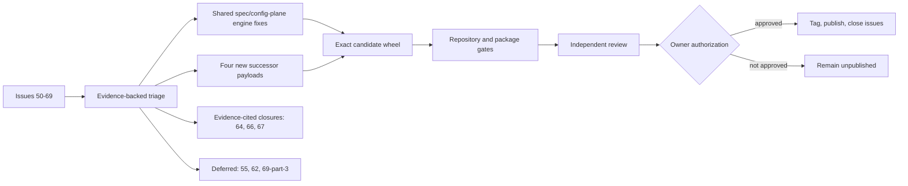

# V5 Validation Fidelity Correction Train — Specification (Standard)

## Revision History

| Version | Date | Author | Change |
| --- | --- | --- | --- |
| 0.1 | 2026-07-27 | Claude, drafting from triaged issue evidence | Initial specification for issues #50-#69: spec-engine loosening fixes, the standards-show digest fix, the migration hint reword, four new successor payloads, and the Catalog 5 default advance to v5.10.0. |

**Spec lifecycle:** This document is **living until `approved`**. It is a draft awaiting owner review and has not been authorized for implementation. Post-approval edits require a new revision row and, for scope-affecting changes, re-approval by the owner. Implementation deviations belong in the [Deviations Log](#deviations-log), not silently patched into requirements. Publication of `v5.10.0` and closure of any referenced issue remain separate, later owner decisions.

---

## 1. Purpose & Background

Project Standards 5.9.0 resolved the prior adoption-integrity correction train (issues #32 and #35-#49). Further adoption, migration, and specification-retrofit exercises against that release surfaced twenty additional issues, numbered #50 through #69. Unlike the 5.9.0 train, this batch clusters around a different failure pattern: several issues are false-positive rejections in the repository's own tooling — the specification validator and strict lint, the `standards show` inspection command, and one migration diagnostic — that reject or misreport an already-correct input rather than any generated artifact being wrong. The remainder are payload-scoped defects in four already-selected default packages (Python Tooling, Agent Handoff, Markdown Frontmatter, Markdown Tooling), each traceable to a specific rendered artifact or diagnostic.

Three further issues are not defects at all. Issue #64 reproduces a Prettier/Markdownlint MD060 disagreement already corrected in the released `markdown-tooling@1.9` (commit `367afe3`, an ancestor of the `v5.9.0` release); it needs only a durable regression fixture, not a behavior change. Issues #66 and #67 report conflicts caused by consumer-added content — a third-party `end-of-file-fixer` hook and a retained `actions/upload-artifact@v4` step — that this repository does not generate or own; both close with a documented rationale rather than a code change. Two more issues, #55 and #62, request new capabilities (a legacy-spec conversion command; a new boilerplate-divergence lint rule class) that exceed a bounded correction train's scope and are deferred, not implemented, pending separate owner-approved scoping.

The intended result is one internally phased correction train that repairs the shared engine where a defect is engine-level, ships payload-scoped behavior only through new immutable successor payloads, and proves every fix with a regression test drawn from the reporting issue's own reproduction and acceptance criteria. Every engine correction in scope is a **backward-compatible loosening**: it turns a documented false-positive failure into a pass, or corrects a diagnostic's reported value or wording, and never turns a previously passing case into a failure. Every payload correction ships in a new successor version; no released predecessor payload is edited. This specification does not itself authorize implementation, activation, or release; those remain gated exactly as this document describes.

---

## 2. Scope

### 2.1 In Scope

- Shared specification-validator section-depth relaxation so a numbered subsection beneath a valid canonical top-level section is not rejected (#50).
- Shared specification-validator compound external-ID tokenization so a declared external prefix covers a compound identifier that wholly contains it (#59).
- Shared strict specification-lint placeholder relaxation so inline-code metavariables/literals and standard Markdown autolinks are not misclassified as unfilled template placeholders (#60, #65).
- `standards show` effective-configuration digest parity with the central lock and the next reconciliation plan (#61).
- A reworded absent-`standards_version` migration hint that states tag synonymy and names the runbook-recommended literal, without changing the existing blocking behavior (#52, option (a) only).
- A new **Python Tooling 1.10** successor payload: `scripts/check.py` argument handling (#51), removal of the unconditional `from __future__ import annotations` import (#54), a checker-conditional `.mypy_cache` VS Code exclusion (#56), a corrected Python Coding companion reference plus mutable family-README errata (#57), and a required-check/ruleset rename warning (#58).
- A new **Agent Handoff 1.6** successor payload: `session-log` row/headline caps scoped to table rows only (#68), and per-section named, fence-content-excluded `max_entry_chars` findings (#69, parts 1-2).
- A new **Markdown Frontmatter 1.6** successor payload: repository-relative links replacing hardcoded `blob/main`/`blob/v5` references (#53).
- A new **Markdown Tooling 1.10** successor payload: default generated-directory lint exclusions restoring parity with the existing format-path scope (#63).
- The Catalog 5 default package advance to the four successors above once each validates independently.
- A direct regression-test corpus addition proving the already-fixed #64 conflict stays fixed.
- Documented, evidence-backed closure of #64 (already fixed), #66 and #67 (invalid — consumer-owned content), with no code change.

### 2.2 Out of Scope (Non-Goals — never)

| ID | Non-Goal | Reason |
| --- | --- | --- |
| NG-001 | Reopen or re-litigate the v5.9.0 closed-issue baseline (#3, #8-#49). | This train's scope is exactly #50-#69; the prior train's regression evidence stands on its own record. |
| NG-002 | Edit any released predecessor payload byte (python-tooling 1.1-1.9, markdown-tooling 1.1-1.9, agent-handoff 1.1-1.5, markdown-frontmatter 1.1-1.5). | Predecessor immutability is a versioning invariant (ADR 0020); every payload correction ships only through a new successor. |
| NG-003 | Turn a spec-engine or migration-diagnostic relaxation into any tightening that could fail a specification, configuration, or migration input that validated or passed before this train. | Every engine fix in scope is a documented false-positive correction; a tightening is a different, unrelated change class requiring its own review. |
| NG-004 | Automatically infer `standards_version` from repository content, or otherwise change absent-key blocking behavior, for #52. | The absent-key block is a documented, intentional safety gate (`migration.py`, `UPGRADING.md`); this train changes only the hint's wording and content, never the gate itself (declined as option (b) in the issue). |
| NG-005 | Publish `v5.10.0`, advance the moving `v5` tag, or close any GitHub issue without explicit owner authorization. | Release and issue-closure mutations are externally visible and separately authorized, as in the prior train. |

### 2.3 Won't Have in v1 (deferred — not never)

| ID | Deferred Capability | Why Deferred | Revisit When |
| --- | --- | --- | --- |
| WH-001 | A `spec import`/normalization command that scaffolds canonical structure from a pre-existing house-format specification corpus (#55). | It is a new provider/command surface, not a defect fix; sizing it correctly requires its own design review. | The owner approves a bounded conversion-tool proposal as separate scope. |
| WH-002 | A machine-checked lint rule class detecting shared-boilerplate divergence beyond the existing tooling-notes disclosure (#62). | It is a new lint-rule category with retroactive-tightening implications for every already-pinned Project Specification consumer. | The owner approves the new rule class and its impact on pinned consumers is scoped. |
| WH-003 | A consumer-facing configurable or raised `max_entry_chars` threshold for Agent Handoff's `numbered-rules` profile (#69, part 3). | It is a new schema option, not a diagnosability or accounting fix; FR-012 resolves the diagnosability and fence-masking defects in this train without it. | The owner approves a consumer-facing threshold override option. |
| WH-004 | A prominent "audit retained actions" documentation callout for consumer-owned workflow steps adjacent to #67. | #67 itself is invalid (the flagged step is consumer-added content the standard does not own); a broader audit callout is a documentation scope decision, not a fix for this report. | A consumer requests broader consumer-owned-workflow audit guidance. |

### 2.4 Boundaries

| Boundary | Description |
| --- | --- |
| System owns | Project Standards engine behavior (spec validator/lint, `standards show` digest resolution, migration diagnostics), the four successor package payloads, Catalog 5 default selection, and the regression-test corpus. |
| System depends on | The repository lockfiles, pinned Python and Node environments, the exact v5.9.0 baseline, consumer-reported issue evidence (#50-#69), and explicit owner approvals for scope and release. |
| System does not own | Consumer-authored workflow content, third-party pre-commit hooks, GitHub publication authorization, and the deferred capabilities in §2.3. |

---

## 3. Context

### 3.1 Current State

Project Standards is at `v5.9.0` (release commit `7e630554cf0f1ab014ba902e46834f0c1485cc5a`), with Catalog 5 defaults at `python-tooling@1.9`, `markdown-tooling@1.9`, `agent-handoff@1.5`, `markdown-frontmatter@1.5`, `project-spec@1.4`, `cli-documentation@1.4`, and `adr@1.2`. Twenty issues (#50-#69) are open against this release, all reported during ordinary V4-to-V5 migration and adoption exercises, none blocking (each report documents a safe workaround already in place).

Six issues are false-positive relaxations in the shared engine, which single-sources validate/lint/upgrade logic in `src/project_standards/specs/**` for every project-spec payload version (1.1-1.4 today), so a fix there applies retroactively to every pinned consumer without touching payload bytes:

- **#50** — `specs/commands/validate.py`'s `_check_sections` rejects any section number absent from the canonical registry, so an author-added numbered subsection (e.g., `### 9.1`) beneath a valid top-level section fails `SV-SECTION` even though the top-level section itself is correct.
- **#59** — the shared ID tokenizer (`registry.py`'s `ID_TOKEN`) matches only the innermost `PFX`-plus-digits pattern, so a compound external identifier built by nesting a second word between a configured external prefix and its trailing digits still emits a false `SV-ID-UNDECLARED` for that inner segment, even though the outer prefix is already declared.
- **#60** and **#65** — strict lint's `_ANGLE` scan (`lint.py`) is unmasked, so both an intentional inline-code metavariable or literal runtime representation wrapped in angle brackets, and a standard Markdown autolink wrapping a URL or mail address in angle brackets, are misclassified as an unfilled `SL-PLACEHOLDER`. The existing `_INLINE_CODE` masking primitive in `validate.py` is directly reusable for the inline-code half of this fix.
- **#61** — `standards show` hashes raw configuration while the central lock hashes schema-resolved effective configuration; on the observed fixture, four of five enabled packages already agree between `show` and the lock, and the fifth (Markdown Frontmatter) diverges, making the inspection command's reported digest ambiguous.
- **#52** — the absent-`standards_version` migration diagnostic blocks with a hint listing both `"v3"` and `"v4"` without stating they are recognized synonymous legacy tags or which one the runbook recommends, forcing an unnecessary manual authority edit and a second preview pair.

Five issues are payload-scoped defects in already-selected default packages, each reproduced against the exact released artifact:

- **#51** and **#54** — Python Tooling 1.9's generated `scripts/check.py` ignores `sys.argv` entirely (so `--help` runs the full gate) and unconditionally emits `from __future__ import annotations`, which conflicts with the cataloged Python Coding 0.6 companion's Python 3.14 rule; both defects live in the same `_script()` function (`python_tooling.py`).
- **#56** — the same package unconditionally renders a `.mypy_cache` VS Code exclusion even when the selected checker is BasedPyright, which never consumes it.
- **#57** — the immutable 1.8 and 1.9 READMEs name Python Coding 0.5 as companion, while Python Coding 0.6 has shipped since `v5.1.0`.
- **#58** — no adoption or upgrade documentation warns that renaming a consumer-owned CI job's display name can silently orphan a hosted branch-protection or ruleset required-check context.
- **#68** and **#69** — Agent Handoff 1.5's `session-log` shape profile applies `row_max_chars`/`headline_max_words` to every non-empty line rather than only table rows, making the caps unsatisfiable for an append-only permanent record (measured on one consumer: 124 over-length rows, 84% of characters lost if compressed to the cap); and its `numbered-rules` `max_entry_chars` check collapses every violation into one unlocated finding via `any()` and counts fence-masked (space-substituted, length-preserved) characters toward the measured size, penalizing sections that document a runnable command example.
- **#53** — Markdown Frontmatter 1.5's `adopt.md` and `SKILL.md` hardcode `blob/v5`/`blob/main` GitHub URLs that move a reader off a pinned release tag; the same pattern recurs across 1.2-1.5.
- **#63** — Markdown Tooling's `_lint_caller` never applies ignore/globs for generated directories, unlike the format path's existing `--ignore-path .gitignore` scope; a first lint run after routine `uv sync`/`pytest` produced 13,843 findings across 437 files, almost all inside `.venv` and `.pytest_cache`.

Three issues require no behavior change:

- **#64** reproduces a Prettier/Markdownlint MD060 conflict on an empty first table cell. `markdown-tooling@1.9` (default since `v5.9.0`) already ships `MD060: false`, tracked against the same conflict class reported in #44 and fixed in commit `367afe3`, an ancestor of the `v5.9.0` release. Only a durable direct-repro regression fixture is missing.
- **#66** reports that the standard-provided `.gitkeep` placeholders conflict with a third-party `end-of-file-fixer` pre-commit hook. That hook is not generated, referenced, or owned by any package in this repository (`grep` across `providers/`, `resources/`, and `.pre-commit-hooks.yaml` is clean); create-only artifacts are unconditionally preserved by the planner (`planner.py`), and the managed `.gitkeep` payloads pass the existing on-point test. The conflict is entirely the consumer's own hook addition.
- **#67** reports that a retained `actions/upload-artifact@v4` step now emits a hosted Node.js 20 deprecation warning. That step is consumer-added content under `workflow_ownership = "consumer-owned"`; the managed `check.yml` this repository generates contains no such step, and `adopt.md` already scopes consumer-owned retained content out of reconciliation.

### 3.2 Target State

Every open false-positive in the shared spec engine, `standards show`, and the migration diagnostic is corrected with a regression test drawn from its issue's own reproduction. Every payload-scoped defect ships in a new immutable successor payload — Python Tooling 1.10, Agent Handoff 1.6, Markdown Frontmatter 1.6, Markdown Tooling 1.10 — with released predecessor bytes unchanged. Catalog 5 activates the four successors as defaults once each validates independently and together. The repository gains a direct regression fixture proving #64 stays fixed. Issues #64, #66, and #67 close with a documented rationale citing existing evidence; no code changes for #66/#67. Issues #55, #62, and #69's configurable-threshold request remain open, explicitly deferred per §2.3. One candidate wheel passes the complete repository gate, classifies as MINOR against `meta/versioning.md`, and remains unpublished pending explicit owner authorization for `v5.10.0`.

### 3.3 Assumptions

| ID | Assumption | Impact if False |
| --- | --- | --- |
| A-001 | The issue bodies and comments referenced in this specification continue to describe the requested behavior until implementation begins. | New material issue evidence requires a specification revision and re-approval before the affected work proceeds. |
| A-002 | The repository lockfiles remain the authority for Ruff, BasedPyright, pytest, Prettier, and markdownlint-cli2 versions used to characterize and verify each fix. | Tool-version authority must be reconciled before characterization or candidate comparison. |
| A-003 | The four successor versions named in this specification (python-tooling 1.10, agent-handoff 1.6, markdown-frontmatter 1.6, markdown-tooling 1.10) are the correct next minor version for each family under its existing versioning scheme. | A different successor number requires an update to this specification before that payload is authored. |
| A-004 | Every engine and payload correction in scope remains classifiable as MINOR under `meta/versioning.md` — no previously passing outcome becomes failing. | A MAJOR finding or any pass-to-fail probe stops the affected work for owner disposition before it ships (see AW-002). |

### 3.4 Constraints

| ID | Constraint | Source |
| --- | --- | --- |
| C-001 | Released payload bytes are immutable; every payload-scoped behavior change ships through a new successor version. | `meta/versioning.md`, ADR 0020. |
| C-002 | Package and control-plane validation runs against one extracted candidate wheel first on `PYTHONPATH`, per this repository's dogfooding requirement. | Repository working rules (`CLAUDE.md`, `README.md` § Developing this repository). |
| C-003 | Ruff, BasedPyright strict, pytest/coverage, pip-audit, package-contract, Node, coherence, and managed-document gates remain authoritative for candidate qualification. | Repository working rules and adopted standards. |
| C-004 | Every engine correction in scope is a backward-compatible loosening; no fix may weaken, delete, skip, or expected-fail an existing regression to make a candidate pass. | Owner-directed regression-safety practice carried forward from SPEC-VAIC. |
| C-005 | Publication of `v5.10.0`, moving-tag advancement, and issue closure require explicit owner authorization after candidate evidence exists. | Owner instruction and `meta/versioning.md`. |
| C-006 | Issues #55, #62, and #69's configurable-threshold request are explicitly deferred (§2.3); this train neither implements nor silently narrows them. | Scope control. |

---

## 4. Goals

| ID | Goal | Success Signal | Achieved By |
| --- | --- | --- | --- |
| G-001 | Correct every reported v5.9.0 validation and diagnostic false positive at the shared-engine boundary. | Each of #50, #52, #59, #60, #61, #65 has a focused failing regression before the fix and a passing one after, with no payload byte touched. | FR-001-FR-005 |
| G-002 | Correct every reported payload-scoped defect through a new immutable successor, never a predecessor edit. | Four new successor payloads pass package-local validation; predecessor digests are unchanged. | FR-006-FR-014, NFR-002 |
| G-003 | Preserve every previously passing specification, configuration, and migration outcome. | The compatibility matrix shows no pass-to-fail transition; classification is MINOR. | NFR-001, NFR-006 |
| G-004 | Close #64/#66/#67 on documented evidence and keep deferred items explicitly tracked, not silently implemented or silently dropped. | #64 gains a regression fixture; #66/#67 closure rationale is committed; §2.3 items remain open with no code change. | FR-016, WH-001-WH-003 |
| G-005 | Keep release and issue-closure authorization boundaries explicit. | No `v5.10.0` tag, publish, or issue closure occurs without recorded owner authorization. | C-005, NG-005, OQ-003 |

---

> **§5 (Stakeholders and Users) is Full-tier** and is intentionally omitted at the Standard profile.

## 6. Glossary

| Term | Definition | Notes / Not to be confused with |
| --- | --- | --- |
| Shared spec engine | The single-sourced validate/lint/upgrade logic in `src/project_standards/specs/**`, applied to every project-spec payload version without payload-specific branching. | Not a payload; a fix here needs no new project-spec version and applies retroactively to every pinned consumer. |
| Backward-compatible loosening | A correction that turns a previously failing (false-positive) input into a pass, or changes only diagnostic wording/values, and never turns a previously passing input into a failure. | Distinct from a tightening, which narrows acceptance and can regress a pinned consumer; no tightening is in scope for this train. |
| Successor payload | A new immutable package version that preserves its predecessor unchanged while correcting behavior. | Released predecessor directories are never edited (NG-002). |
| Catalog default advance | Changing which already-advertised payload version Catalog 5 selects by default for a package family. | Does not remove or alter any previously advertised predecessor version. |
| Fence-masked structural view | The engine's practice of replacing fenced code-block content with equal-length whitespace before running structural scans, preserving line/character offsets. | Currently preserves _length_, which is exactly what #69 identifies as still counting toward a character-based size cap; FR-012 excludes that masked length from the measured size. |
| Effective configuration digest | The digest computed over a package's fully schema-resolved configuration (explicit values plus schema defaults), as the central lock records it. | Distinct from a digest computed over only the raw, consumer-declared configuration, which is what `standards show` computes today per #61. |

---

## 7. Requirements

### 7.1 Functional Requirements

| ID | Requirement | Rationale | Acceptance Criteria | Priority |
| --- | --- | --- | --- | --- |
| FR-001 | The shared specification validator's section-number check shall accept a numbered subsection whose canonical top-level ancestor is present in the registry, without requiring the subsection number itself to be a literal canonical registry entry. | #50 — an author-added `### 9.1` beneath the canonical `## 9. Data Model` heading fails `SV-SECTION` today even though §9 itself is correct and canonical. | `### 9.1` and `### 9.2` beneath `## 9. Data Model` pass `spec validate --strict`; a numbered subsection beneath a second, different canonical top-level section also passes, so the fix is not special-cased to §9; canonical top-level section presence and ascending order remain enforced; an invalid or out-of-order top-level section number still fails; both `§9.1`/`§9.2` and the second-section case are covered by new regression tests (only `## 999.` is covered today). | Must |
| FR-002 | The shared specification ID tokenizer shall recognize a compound identifier whose configured external prefix wholly contains an inner hyphenated segment as belonging to that declared external namespace, instead of emitting `SV-ID-UNDECLARED` for the inner segment alone. | #59 — the tokenizer currently matches only the innermost prefix-plus-digits pattern, so a durable adversarial-review ledger using compound external IDs cannot validate without misrepresenting the inner segment as an independent namespace. | A specification containing a compound external identifier built from a declared external prefix followed by a nested word and trailing digits validates with no `SV-ID-UNDECLARED` finding for the nested segment; an inner segment that does not correspond to any declared external prefix still fails; a genuine spec-local ID (e.g., `FR-001`) is unaffected; a dedicated compound-ID regression test is added (none exists today). | Must |
| FR-003 | The strict specification lint's unfilled-placeholder check shall mask inline code spans before scanning for angle-bracket placeholders and shall not flag a standard Markdown autolink wrapping a URL or mail address in angle brackets as a placeholder. | #60 (inline-code metavariables and literal runtime representations wrapped in angle brackets) and #65 (URL autolinks wrapped in angle brackets) share the same unmasked `_ANGLE` scan; TRIAGE combines both into one patch reusing the existing `_INLINE_CODE` masking primitive already defined in `validate.py`. | Every reproduction example from both issues (inline-code metavariables and literals; URL and mail-address autolinks) passes `spec lint --strict`; a genuine unfilled prose placeholder outside inline code and not a valid autolink scheme still fails; one combined negative-fixture sweep covering both issue classes is added to the lint test suite. | Must |
| FR-004 | `standards show` shall report, for every enabled package, the same effective-configuration digest as the central lock's `effective_config_digest` and the digest a clean reconciliation plan would produce next, including a package whose desired configuration resolves entirely from schema defaults. | #61 — `standards show` hashes raw configuration while the lock hashes schema-resolved effective configuration, so the two diverge for at least one selected package while four others already agree, making the inspection command's reported digest ambiguous. | For every enabled package in a representative multi-package fixture, including one whose configuration resolves entirely from schema defaults, `standards show`'s reported digest equals both the committed lock's `effective_config_digest` and a clean `reconcile --check --json` run's next-lock digest; a disabled or no-payload-selected package's `show` output reports no digest rather than a mismatched one. | Must |
| FR-005 | When `standards_version` is absent, the migration diagnostic's hint shall state that the `"v3"` and `"v4"` legacy platform tags are recognized as synonymous accepted values and shall name the exact `"v4"` literal and `UPGRADING.md` section the runbook recommends, while the diagnostic continues to block migration on the absent key exactly as it does today. | #52 (option (a)) — the current hint lists both tags without stating they are synonyms or naming the runbook's recommendation, forcing a manual authority edit and a second preview pair before the consumer can proceed with confidence. | The reworded hint text names both tags as synonymous, states `"v4"` as the recommended literal, and cites the exact `UPGRADING.md` section; the diagnostic's exit code, `applicable: false` JSON shape, and absent-key blocking are unchanged; a new regression test asserts the exact reworded hint text; automatic tag inference (option (b)) is not implemented, per NG-004. | Must |
| FR-006 | Python Tooling's rendered `scripts/check.py` shall parse `sys.argv`: `--help`/`-h` shall print concise usage and exit `0` without invoking any gate subprocess; an unrecognized argument shall exit nonzero without invoking any gate subprocess; invoking the script with no arguments shall preserve the existing ordered, stop-on-first-failure gate behavior exactly. | #51 — the generated `main()` ignores `sys.argv` entirely, so a routine `--help` probe runs the complete verification gate. | The issue's three acceptance-evidence cases pass: `--help` exits `0` with no subprocess call; an unknown argument exits nonzero with no subprocess call; no-argument invocation preserves exact command order and exit-code propagation; the fix lands only in the new successor payload's `resources/check.py`, its provider-rendered form, and new tests (none exist today for this script's CLI surface). | Must |
| FR-007 | Python Tooling's rendered verification script shall not unconditionally emit `from __future__ import annotations` when it has no forward reference or runtime annotation consumer that requires it. | #54 — the generated script violates its own cataloged Python Coding 0.6 companion's Python 3.14 rule against adding that import by default, with no forward reference or runtime annotation consumer to justify it. | The rendered `check.py` at the new successor version contains no `from __future__ import annotations` line; a cross-standard fixture checks the rendered script against the Python Coding version declared as python-tooling's companion; existing subprocess sequencing and exit-code propagation are unchanged. | Must |
| FR-008 | Python Tooling's rendered VS Code settings shall emit the `**/.mypy_cache` `files.exclude` entry only when the configured type checker is `mypy`, omitting it for `basedpyright` or `pyright`. | #56 — the entry renders unconditionally regardless of the selected checker, adding unremovable-without-drift MyPy-specific configuration to a repository that migrated away from MyPy. | Rendering `.vscode/settings.json` for `type_checker.name = "basedpyright"` and for `"pyright"` omits the `.mypy_cache` `files.exclude` key; rendering for `"mypy"` retains the existing behavior; the lock's `payload.toml` contribution for the `.mypy_cache` exclusion is conditioned identically so lock and rendered artifact stay consistent. | Must |
| FR-009 | The mutable `standards/python-tooling/README.md` family landing page shall carry a `Released-version errata` entry stating that the immutable 1.8 and 1.9 READMEs name a stale Python Coding companion version, and the new successor payload's own README shall correctly name its actual current companion. | #57 — the 1.8/1.9 READMEs name Python Coding 0.5 as companion though Python Coding 0.6 has shipped since `v5.1.0`, and unversioned companion metadata leaves the mismatch unresolved by anything but prose. | The family README's `Released-version errata` section gains a dated entry naming the stale and current companion versions; the new successor payload's README states the correct current companion; a coherence fixture compares declared companion prose against the actual newest reference-only Python Coding payload in the same catalog. | Must |
| FR-010 | Python Tooling's existing-project (`workflow_ownership = "consumer-owned"`) guidance shall warn that renaming a consumer-owned CI workflow's job display name can silently orphan a hosted branch-protection or ruleset required-check context, and shall instruct the consumer to inspect and coordinate hosted required-check contexts before such a rename. | #58 — no such warning exists in `UPGRADING.md` or the 1.9 `adopt.md`, so a truthful toolchain rename can pass every local and CI gate while silently breaking future mergeability. | The warning appears in root `UPGRADING.md` near the existing `workflow_ownership` guidance and in the new successor payload's `adopt.md`; a documentation-corpus test asserts both locations contain the warning. | Must |
| FR-011 | Agent Handoff's `session-log` shape profile's `row_max_chars` and `headline_max_words` checks shall apply only to the session log's table rows, not to every non-empty line of the document. | #68 — the checks currently scan every non-empty line, so prose beneath the table is capped identically to table cells, and an append-only permanent record cannot satisfy the caps without deleting history; the sibling `max_rule_summary_chars` check already scopes correctly to table lines via `_table_lines`. | A session-log fixture with long prose paragraphs below the table produces no `row_max_chars`/`headline_max_words` finding from that prose; a table row that exceeds either cap still produces its existing finding; the engine (`agent_handoff/policy.py`) and the new agent-handoff 1.6 payload provider are corrected together so packaged and engine behavior agree; a characterization fixture derived from the measured 124-row `agent-configs` corpus proves the false positives are eliminated for non-table lines. | Must |
| FR-012 | Agent Handoff's `numbered-rules` `max_entry_chars` check shall emit one finding per violating section, naming the section and its measured size against the configured limit, instead of one aggregated unlocated finding, and shall exclude fence-masked characters from the measured section size. | #69 (parts 1-2) — the current `any()` collapse names no section or size, and fence-masked (space-substituted) characters still count toward the measured size, penalizing a section that documents a runnable command example relative to one that only describes it. | A fixture with multiple violating sections produces one finding per section naming the section and reporting its measured size and the configured limit; a section whose only overage is inside a fenced code block no longer violates once fence content is excluded from the measured size; the engine (`agent_handoff/policy.py`) and the payload provider are corrected together; the configurable-threshold request (#69, part 3) is not implemented by this requirement (see WH-003). | Must |
| FR-013 | Markdown Frontmatter's adoption guide and skill documentation shall reference the CLI usage guide and other in-repository documentation with repository-relative links, not a hardcoded `blob/main` or `blob/v5` GitHub URL. | #53 — 1.5's `adopt.md` and `SKILL.md` hardcode mutable `blob/v5`/`blob/main` URLs that move a reader off a pinned release tag; the same pattern recurs across 1.2-1.5, while other selected package guides already use repository-relative references. | The new successor payload's `adopt.md` and `SKILL.md` use repository-relative links in place of every `blob/(main\|v5)` occurrence; a mutable test lint rule rejects `blob/(main\|v5)` inside any versioned payload's documentation; released 1.2-1.5 bytes remain unchanged and are documented as a known historical limitation. | Must |
| FR-014 | Markdown Tooling's lint caller shall apply default exclusions for generated Python environment and cache directories (at minimum `.venv/**` and `.pytest_cache/**`) so its effective file set no longer diverges from the format caller's existing `.gitignore`-aware scope when both Python Tooling and Markdown Tooling are enabled together. | #63 — `_lint_caller` never passes ignore/globs for generated directories while the format path already does, so a first lint run after a routine `uv sync`/`pytest` reproduces thousands of third-party findings that obscure consumer-owned findings. | A fixture repository with populated `.venv` and `.pytest_cache` directories produces zero lint findings from those paths under the new successor's default configuration, while every consumer-owned finding the prior payload reported remains reported; the generated `self-host-lint-markdown.yml` and `adopt.md` document the default exclusion. | Must |
| FR-015 | Catalog 5 shall advance its default package selections to `python-tooling@1.10`, `markdown-tooling@1.10`, `agent-handoff@1.6`, and `markdown-frontmatter@1.6` once each successor's package-local validation passes, while every predecessor payload in those four families remains byte-identical and independently selectable, and `project-spec`, `cli-documentation`, and `adr` remain at their current defaults (1.4, 1.4, 1.2). | Mirrors FR-019 of the prior train (SPEC-VAIC): payload behavior changes ship only through immutable successors, activated together once validated; no in-scope issue requires a new payload for the three unaffected families. | Predecessor payload digests are unchanged before and after the candidate; the four successor manifests, schemas, providers, and migrations validate; `standards/README.md`'s Catalog 5 table reflects the four new defaults and the three unchanged defaults. | Must |
| FR-016 | The coherence test corpus shall gain a direct regression fixture — an empty-first-cell table equivalent to #64's minimal reproduction — proving Prettier and the managed Markdownlint MD060 configuration remain mutually idempotent for that exact shape. | #64 is already fixed in the released `markdown-tooling@1.9` (`MD060: false`, commit `367afe3`, an ancestor of `v5.9.0`); this requirement closes the gap between "already fixed" and "durably regression-tested." | The new fixture round-trips through pinned Prettier and Markdownlint with no `MD060` finding under the current default (`1.9` today, `1.10` after this train); the fix is attributed to `v5.9.0`/`1.9` in the issue-closure evidence; no behavior change accompanies this requirement. | Must |

### 7.2 Non-Functional Requirements

| ID | Category | Requirement | Measurement / Acceptance Criteria | Priority |
| --- | --- | --- | --- | --- |
| NFR-001 | Compatibility | Every engine correction (FR-001-FR-005) shall be a backward-compatible loosening: no specification, consumer configuration, or migration input that validated or passed before this train shall fail after it. | A baseline/candidate outcome matrix for each of FR-001-FR-005 shows only fail-to-pass or message-only transitions, never the reverse; `packages check-release --baseline v5.9.0` (or an equivalent requirement-by-requirement analysis) reports MINOR. | Must |
| NFR-002 | Payload immutability | The candidate shall preserve the exact released payload bytes of every predecessor version in python-tooling, markdown-tooling, agent-handoff, and markdown-frontmatter. | A pre-train/candidate digest ledger for every released payload path in those four families is byte-equal. | Must |
| NFR-003 | Regression safety | Every issue with an in-scope behavior change (#50-#61 excluding #55/#62, #63, #65, #68, #69 parts 1-2) shall have a passing focused regression test in the candidate; issues closed without a code change (#64, #66, #67) shall have a recorded, evidence-cited closure rationale. | Test suite entries exist per FR-001-FR-014/FR-016; §3.1's cited evidence (file/line references, `grep` results, existing test names) is preserved in the closure record. | Must |
| NFR-004 | Release quality | One exact extracted candidate wheel shall pass the complete repository source, installed-wheel, package, graph, coherence, Markdown/documentation, and security-audit gates. | All gates run against one recorded wheel SHA-256 with the extracted wheel first on `PYTHONPATH`; any failure blocks the candidate. | Must |
| NFR-005 | Review quality | Independent review of the exact candidate evidence shall have no unresolved Critical or High finding before release authorization is requested. | The reviewed result and any dispositions bind to the reviewed commit/artifact. | Should |
| NFR-006 | Release classification | The train shall be classified against `meta/versioning.md` before affected implementation work and again against the exact candidate. | A requirement-by-requirement analysis records no previously passing outcome made failing; `packages check-release --baseline v5.9.0` (or equivalent) reports MINOR; any MAJOR finding or pass-to-fail probe stops for owner disposition (AW-002) before the affected behavior ships. | Must |

### 7.3 Interface Requirements

| ID | Interface | Requirement | Contract / Format | Acceptance Criteria |
| --- | --- | --- | --- | --- |
| IR-001 | `project-standards spec validate` / `spec lint` | Both commands shall reflect FR-001-FR-003's relaxations in their human and `--json` output without changing any other finding code, exit-code convention, or unrelated finding. | Existing `Finding` shape (`code`, `severity`, `message`, `line`, `locus`); no new finding code is introduced by FR-001-FR-003. | Text/JSON parity tests for each fixed case; unrelated findings (e.g., `SV-ORDER`, genuine `SL-PLACEHOLDER`) are unaffected. |
| IR-002 | `project-standards standards show` (given a package id argument) | The command shall report `config_digest` computed identically to the lock's `effective_config_digest` for every enabled package, per FR-004. | Existing JSON shape (`id`, `enabled`, `requested`, `resolved`, `config_digest`); no new field is required to satisfy this requirement. | Fixture comparison against `.standards/lock.toml` and a clean `reconcile --check --json` run, per FR-004's acceptance criteria. |
| IR-003 | `project-standards init --migrate` | The absent-`standards_version` diagnostic's hint text changes per FR-005; exit code, `ok`/`applicable` JSON shape, and blocking behavior are unchanged. | Existing migration-report JSON shape and exit-code convention. | Regression test asserting the exact reworded hint text and unchanged exit/JSON shape. |
| IR-004 | Generated `scripts/check.py` (Python Tooling) | The rendered script shall accept `--help`/`-h`, reject unknown arguments, and preserve no-argument gate behavior, per FR-006. | Plain argv parsing; no new dependency. | The three acceptance cases in FR-006. |

### 7.4 Data Requirements

| ID | Data Entity | Requirement | Validation Rules | Ownership |
| --- | --- | --- | --- | --- |
| DR-001 | Effective configuration digest | `standards show` shall compute its reported digest from the same schema-resolved effective configuration the lock uses, for every enabled package, including one whose desired configuration is entirely schema-default-filled. | The recomputed digest must equal the lock's `effective_config_digest` and a clean reconciliation plan's next-lock digest for every enabled package in the fixture matrix; a disabled or no-payload package reports no digest rather than a stale or mismatched one. | Control plane |
| DR-002 | Regression-test corpus entry (#64) | The repository's coherence adversarial corpus shall retain a direct-repro fixture proving the empty-first-cell MD060 conflict stays resolved under the current default Markdown Tooling payload. | The fixture round-trips through pinned Prettier and Markdownlint with no `MD060` finding; it is re-validated whenever the Markdown Tooling default advances (including to 1.10 under FR-015). | Repository test suite |

---

## 8. Architecture and Design

### 8.1 Architecture Summary

This train extends the existing shared spec engine, control plane, and immutable-package architecture; it introduces no new subsystem, command, or runtime topology. Five corrections (FR-001-FR-005) are entirely engine-level: they live in the shared spec validator/lint (`src/project_standards/specs/**`), the `standards show` digest-resolution path, and the migration-diagnostic module, and apply retroactively to every pinned consumer without a new project-spec payload version. Nine corrections (FR-006-FR-014) are payload-scoped and ship in four new successor payloads, each preserving its exact predecessor. One requirement (FR-016) adds test-only regression coverage with no behavior change. Catalog 5 activates the four successors together once each validates independently and in combination with the others.

### 8.2 Architecture Views

#### 8.2.1 Context View



#### 8.2.2 Container / Deployment View

> Not applicable: this train changes one Python distribution, its embedded package payloads, and repository documentation; it introduces no service, datastore, worker, or deployment topology.

#### 8.2.3 Component View

| Component | Responsibility | Interfaces | Notes |
| --- | --- | --- | --- |
| Shared spec validator/lint | Apply FR-001-FR-003's relaxations across every pinned project-spec payload version. | `spec validate`, `spec lint` | No new project-spec payload version is required; the fix is engine-only. |
| `standards show` digest resolver | Compute the reported `config_digest` from schema-resolved effective configuration, per FR-004. | `standards show` | Reuses the existing schema-resolution path the lock already uses. |
| Migration diagnostic module | Reword the absent-`standards_version` hint, per FR-005. | `init --migrate` | Blocking behavior is unchanged; only hint content changes. |
| Python Tooling successor (1.10) | Correct `scripts/check.py` argv handling, drop the future-annotations import, condition the `.mypy_cache` exclusion, correct the companion reference, and add the required-check warning. | Rendered `scripts/check.py`, `.vscode/settings.json`, `adopt.md` | FR-006-FR-010. |
| Agent Handoff successor (1.6) + engine mirror | Scope `session-log` caps to table rows and emit per-section named `max_entry_chars` findings with fence exclusion. | `agent_handoff/policy.py`, payload provider | FR-011-FR-012; engine and payload corrected together so behavior agrees. |
| Markdown Frontmatter successor (1.6) | Replace hardcoded `blob/main`/`blob/v5` links with repository-relative references. | `adopt.md`, `SKILL.md` | FR-013. |
| Markdown Tooling successor (1.10) | Add default generated-directory lint exclusions. | Lint caller, `self-host-lint-markdown.yml` | FR-014. |
| Catalog default advance | Activate the four successors as Catalog 5 defaults once validated. | `standards/README.md`, catalog projection | FR-015. |
| Regression corpus | Retain the #64 direct-repro fixture and every new test added by FR-001-FR-014. | Repository test suite | FR-016, NFR-003. |

### 8.3 Design Decisions

| ID | Decision | Rationale | Alternatives Considered | ADR |
| --- | --- | --- | --- | --- |
| D-001 | Ship this as one correction train with an engine phase and a successor-payload phase, activated together. | The engine fixes and the four payloads share validation, classification, and release-consistency gates; splitting them would require re-verifying the same baseline four times. | Four independent releases were rejected as unnecessary process overhead for a MINOR, loosening-only train. | `meta/versioning.md` |
| D-002 | Fix #60 and #65 in one combined patch reusing the existing `_INLINE_CODE` masking primitive, rather than two separate passes over the placeholder scan. | Both issues share the same unmasked `_ANGLE` scan; a single masked-then-autolink-aware pass avoids double-scanning the same text and keeps the fix and its negative-fixture sweep in one reviewable change. | Two independent patches were rejected as redundant given the shared root cause. | This specification |
| D-003 | Resolve #69's diagnosability and fence-masking defects now; defer the configurable-threshold request to WH-003 rather than guessing a new default cap. | Renaming the diagnostic and excluding fence content are bounded, evidence-backed corrections; choosing a new threshold value is a product decision requiring owner input the issue does not supply. | Picking an arbitrary higher default (e.g., matching the measured `agent-configs` corpus) was rejected as an unreviewed policy change disguised as a bug fix. | Owner scope discipline |
| D-004 | Keep every engine fix (#50, #52, #59, #60, #61, #65) entirely free of payload-byte changes, so it applies retroactively to every pinned consumer. | Consistent with the shared-engine precedent established by SPEC-VAIC's FR-001 (shared explicit-path collector); the spec engine, `standards show` digest path, and migration diagnostics are already single-sourced outside any payload. | Payload-local patches to each pinned project-spec version were rejected as unnecessary duplication given the single-sourced engine. | Prior-train precedent (SPEC-VAIC) |

### 8.5 Design Constraints

- Keep released payload directories byte-identical.
- Keep every engine correction a loosening; introduce no tightening as part of this train.
- Derive tool versions from lock/catalog authorities; do not hardcode variable catalog counts.
- Validate against the extracted candidate wheel first on `PYTHONPATH`, per this repository's dogfooding requirement.
- Do not implement any deferred capability in §2.3 as an unreviewed side effect of an in-scope fix.

> **§8.4 (Solution Alternatives Considered) and §8.6 (Dependency Policy) are Full-tier** and are intentionally omitted at the Standard profile.

---

## 9. Data Model

No new persistent runtime datastore is introduced. Two repository-level data contracts are relevant, both already described in DR-001 and DR-002:

1. **Effective configuration digest.** Natural identity is the package ID plus its resolved configuration. The digest the control plane already computes for the lock is reused as the single authority; `standards show` is corrected to read from the same resolution path rather than computing its own raw-config digest.
2. **Regression-test corpus entry.** Natural identity is the issue number the fixture reproduces. The #64 entry joins the existing coherence adversarial corpus under `tests/coherence/corpus/adversarial.md`, following the corpus's existing fixture conventions.

No package schema gains a new field in this train; every payload correction (FR-006-FR-014) changes rendered output or documentation, not the package's configuration schema shape.

---

## 10. Behavior and Workflows

### 10.1 Primary Workflow

1. Refresh the live bodies and comments of issues #50-#69 read-only and compare them against this specification's scope.
2. Implement each engine correction (FR-001-FR-005) through RED-GREEN-REFACTOR, adding the regression test each issue's acceptance criteria call for.
3. Author the four new successor payloads (python-tooling 1.10, agent-handoff 1.6, markdown-frontmatter 1.6, markdown-tooling 1.10) implementing FR-006-FR-014; never edit a released predecessor.
4. Add the #64 direct-repro regression fixture (FR-016).
5. Validate each successor package-locally, then activate all four as Catalog 5 defaults (FR-015).
6. Build one candidate wheel, extract it, and run the complete repository/package/coherence/compatibility gate against it first on `PYTHONPATH`.
7. Classify the candidate against `meta/versioning.md`; stop for owner disposition on any MAJOR finding or pass-to-fail probe (AW-002).
8. Record each issue's disposition — fixed with a regression test, or closed with evidence — in the issue-closure evidence set.
9. Obtain independent review of the candidate evidence; resolve any Critical/High finding.
10. Stop unpublished and request explicit owner authorization for `v5.10.0`.
11. Only after authorization: tag, publish, verify hosted/artifact parity, and close issues whose regression evidence is already committed.

### 10.2 Alternate Workflows

| ID | Workflow | Expected Behavior |
| --- | --- | --- |
| AW-001 | A refreshed issue comment materially changes acceptance criteria for an in-scope issue. | Stop the affected task, revise this specification, and obtain owner re-approval before the affected GREEN work continues. |
| AW-002 | Candidate classification is not MINOR, or a planned correction requires a previously passing case to become failing. | Stop before candidate assembly or the affected GREEN work and request owner disposition; do not ship the change as drafted. |
| AW-003 | The #64 regression fixture (FR-016) reveals an actual live defect rather than confirming the existing fix. | Treat it as a new, previously undetected regression; escalate before closing #64 and revise this specification's disposition for that issue. |

### 10.3 Edge Cases

| ID | Edge Case | Expected Behavior |
| --- | --- | --- |
| EC-001 | A specification contains both a genuine unfilled prose placeholder and an intentional inline-code metavariable or autolink. | Only the genuine placeholder is flagged; FR-003's relaxation does not suppress a real unfilled bracket-metavariable-style placeholder outside inline code and outside a recognized autolink scheme. |
| EC-002 | A numbered subsection appears beneath a top-level section number that is itself not canonical. | The top-level section number still fails `SV-SECTION`; FR-001 only stops treating a valid top-level section's numbered subsections as independent registry violations. |
| EC-003 | A package is disabled or has no payload selected. | `standards show` reports no digest for it, rather than a stale or mismatched one, per FR-004's acceptance criteria. |
| EC-004 | A session-log table row itself (not surrounding prose) exceeds `row_max_chars` or `headline_max_words`. | The existing finding remains; FR-011 narrows scope to table rows, it does not weaken the check for genuine table-row violations. |
| EC-005 | A `numbered-rules` section's measured overage is entirely inside a fenced code block. | No finding after FR-012; if overage remains once fence content is excluded, the section-named finding still fires with the corrected (fence-excluded) size. |
| EC-006 | `type_checker.name` is configured as `"mypy"`. | FR-008 preserves the existing `.mypy_cache` exclusion behavior unchanged; only the `basedpyright`/`pyright` cases newly omit it. |

### 10.4 State Transitions

```text
draft
  -> issues_reverified
  -> engine_corrected
  -> successors_validated
  -> candidate_qualified
  -> release_authorized
  -> released
```

- `draft -> issues_reverified` requires a read-only refresh of #50-#69 against this specification's recorded scope.
- `issues_reverified -> engine_corrected` requires owner approval of this specification and FR-001-FR-005 passing with their regression tests.
- `engine_corrected -> successors_validated` requires all four successor payloads passing package-local validation and FR-016's fixture landing.
- `successors_validated -> candidate_qualified` requires one exact candidate wheel, the complete gate, and MINOR classification.
- `candidate_qualified -> release_authorized` is owner-controlled; no automatic transition exists.
- Any material spec-drift returns to `draft`; a discovered baseline regression follows AW-002.

---

## 11. UI Pages / API Endpoints

> Not applicable: this train has no UI or HTTP API surface. The affected machine/user-facing surfaces are the CLIs and files named in IR-001 through IR-004 and the four successor package documentation sets.

---

## 12. Error Handling and Recovery

### 12.1 Expected Failures

| ID | Failure | Required Behavior | Recovery |
| --- | --- | --- | --- |
| ERR-001 | An engine correction turns a previously passing case into a failure. | Stop before merging that change; do not proceed to candidate assembly. | Revert or redesign the correction, then follow AW-002. |
| ERR-002 | A candidate gate or a required regression test fails. | Reject the candidate; do not request release authorization. | Return to the owning RED/GREEN task and rebuild a new candidate. |
| ERR-003 | A candidate's predecessor payload bytes differ from the released baseline. | Block activation and release preparation. | Remove the released-payload edit and reimplement through the correct successor version. |
| ERR-004 | `standards show` still diverges from the lock's `effective_config_digest` for any enabled package after FR-004. | Block release classification. | Correct the digest-resolution path and re-run the fixture matrix. |

### 12.2 Retry and Idempotency

Read-only issue refresh, validation, lint, and candidate gates may be rerun after the environment is re-established. Reconciliation and migration preview/apply retain their existing idempotency contracts; this train adds no new mutation surface. A stale digest comparison (FR-004) requires a fresh `standards show`/`reconcile --check` pair, not a cached result.

### 12.3 Rollback / Recovery

Engine and successor work remains ordinary version-controlled source until release; a failed candidate is abandoned by correcting forward on the implementation branch. Released predecessor payloads remain the compatibility anchor throughout. Release rollback follows `meta/versioning.md` and requires owner direction; this specification does not authorize tag or asset deletion.

---

## 13. Security and Privacy

### 13.1 Authentication

Local validation and implementation require no new authentication. GitHub issue refresh and authorized release operations use the existing authenticated `gh`/GitHub workflow boundary; credential values are never recorded.

### 13.2 Authorization

Repository read-only audit, implementation, and candidate qualification proceed under ordinary repository working rules. Publication of `v5.10.0`, moving-tag advancement, and issue closure require a separate explicit owner authorization after candidate evidence exists (C-005, NG-005).

### 13.3 Secrets

No new secret is introduced. Existing GitHub and signing credentials remain outside the repository.

### 13.4 Sensitive Data

No new sensitive-data surface is introduced. Diagnostic corrections in FR-003 and FR-004 change only structural classification and digest computation, never what content a diagnostic discloses.

### 13.5 Threats and Mitigations

| Threat | Mitigation |
| --- | --- |
| A loosening fix silently becomes a tightening that regresses a pinned consumer. | NFR-001's baseline/candidate outcome matrix and C-004's no-weakening constraint. |
| Wrong artifact accepted for release. | One recorded candidate digest and extracted-wheel binding for every installed-authority gate (NFR-004). |
| Unauthorized hosted mutation. | Separate explicit release/issue-closure authorization gate (C-005, NG-005). |
| A predecessor payload byte is edited to "simplify" a fix. | NFR-002's digest ledger and NG-002. |

### 13.6 Hardening Checklist

- [x] Input validation — FR-001-FR-003 and IR-001.
- [x] Output encoding — existing CLI JSON/text encoders; unchanged by this train.
- [x] Secrets excluded from source/logs — §13.3; unchanged by this train.
- [ ] Least privilege — N/A, no new privilege surface is introduced.
- [ ] Path traversal/symlink controls — N/A, no new file-path surface is introduced.
- [x] Dependency posture — pinned toolchain versions remain authoritative (A-002); no new dependency is added.
- [ ] Backup/restore — N/A, no owned durable datastore.

---

> **§14-§16 are Full-tier** and are intentionally omitted at the Standard profile.

## 17. Testing and Acceptance

### 17.1 Definition of Done

- [ ] This specification has been reviewed and approved by the owner.
- [ ] Every Must requirement has focused passing evidence.
- [ ] No released predecessor payload byte changed.
- [ ] Every corrected engine behavior (FR-001-FR-005) is a proven loosening: no previously passing case now fails.
- [ ] All four successor payloads validate package-locally and together as Catalog 5 defaults.
- [ ] The #64 regression fixture (FR-016) is committed and passing.
- [ ] #66 and #67 closure evidence is recorded with no code change.
- [ ] One extracted candidate wheel passes the complete repository gate.
- [ ] Candidate release classification is MINOR.
- [ ] Independent review has no unresolved Critical/High finding.
- [ ] Release remains unpublished until explicit owner authorization.
- [ ] Required documentation and traceability are current.

### 17.2 Test Strategy

| Layer | Scope | Required Evidence |
| --- | --- | --- |
| Characterization | Exact issue reproductions for #50-#69, current engine/payload behavior | Failure for the intended reason before GREEN. |
| Unit/contract | Spec validator/lint, `standards show` digest path, migration diagnostic, successor providers/schemas | Positive, negative, and boundary cases per FR acceptance criteria. |
| Integration | Rendered `check.py`, VS Code settings, session-log/numbered-rules fixtures, lint-caller scope | Before/after behavior comparison against the exact rendered artifact. |
| Compatibility | Predecessor payload bytes and previously passing outcomes | Predecessor digest ledger; baseline/candidate outcome matrix (NFR-001). |
| Candidate/release | One extracted wheel; package/graph/coherence/documentation/security-audit gates | Recorded wheel digest and exact environment binding. |
| Review | Specification and candidate evidence | Independent-review result and dispositions. |

### 17.3 Requirement-to-Test Traceability

| Requirement | Planned Verification | Status |
| --- | --- | --- |
| FR-001 | `§9.1`/`§9.2` and second-section numbered-subsection regression cases in the spec-validator test suite | Planned |
| FR-002 | Compound external-ID (nested-segment) regression test in the spec-validator test suite | Planned |
| FR-003 | Combined inline-code/autolink negative-fixture sweep in the spec-lint test suite | Planned |
| FR-004, DR-001 | Multi-package `standards show`/lock/`reconcile --check` digest-parity fixture, including a schema-default-filled package | Planned |
| FR-005 | Absent-`standards_version` reworded-hint regression test | Planned |
| FR-006 | `check.py` `--help`/unknown-argument/no-argument regression tests | Planned |
| FR-007 | Rendered-script future-import absence test plus cross-standard companion fixture | Planned |
| FR-008 | `.vscode/settings.json` render matrix across `basedpyright`/`pyright`/`mypy` | Planned |
| FR-009 | Family-README errata assertion plus companion-version coherence fixture | Planned |
| FR-010 | `UPGRADING.md`/`adopt.md` warning-text corpus test | Planned |
| FR-011 | Session-log table-vs-prose scoping fixture derived from the measured `agent-configs` corpus | Planned |
| FR-012 | Per-section named `max_entry_chars` fixture with and without fence-masked overage | Planned |
| FR-013 | `blob/(main\|v5)` mutable-link-rejection lint rule plus corrected-link fixture | Planned |
| FR-014 | `.venv`/`.pytest_cache` generated-directory lint-scope fixture with consumer-finding preservation | Planned |
| FR-015, NFR-002 | Predecessor-digest ledger plus Catalog 5 default-projection fixture | Planned |
| FR-016, DR-002 | Empty-first-cell MD060 direct-repro fixture in the coherence adversarial corpus | Planned |
| NFR-001, NFR-006 | Baseline/candidate outcome matrix and `packages check-release --baseline v5.9.0` (or equivalent) | Planned |
| NFR-003 | Per-issue regression-test/closure-evidence audit | Planned |
| NFR-004 | Complete gate against one recorded extracted candidate wheel | Planned |
| NFR-005 | Independent-review result and blocker dispositions | Planned |

---

## 18. Deployment and Operations

### 18.1 Runtime Environment

The deliverable is the `project-standards` Python distribution with embedded immutable standards packages and repository-owned GitHub workflows. Supported runtime, Python, Node, uv, and package-manager constraints remain those of the existing repository and released catalog. No long-running service is introduced.

### 18.2 Configuration

Configuration changes are limited to the four successor package schemas and their rendered artifacts (§7.1, FR-006-FR-014). No new consumer-facing configuration option is introduced by this train; the deferred configurable threshold (WH-003) is explicitly excluded. No secret-valued configuration is added.

### 18.3 Deployment Flow

Implementation commits remain unpublished until candidate qualification. The release commit is the qualified candidate: before building it, the implementation branch completes the applicable byte-changing candidate-assembly steps of `meta/versioning.md` (version bump, lockfile regeneration, changelog move from `## [Unreleased]`). Build, qualify, and obtain review and owner release authorization for that commit and its artifacts without further byte changes. After explicit authorization, execute only the externally mutating steps of `meta/versioning.md` — land the release commit on `main`, tag, advance the moving `v5` tag, publish, verify hosted parity, and close only issues whose regression evidence is already committed.

> **§18.4 (Rollout Controls) is Full-tier** and is intentionally omitted at the Standard profile.

### 18.5 Observability

This train's operational evidence is deterministic command output and durable repository state: typed findings, test results, package validators, the candidate digest, review result, hosted workflow conclusions, artifact hashes, and issue-closure evidence. No metrics or alerting service is added.

> **§18.6 (Backup and Disaster Recovery)** is not applicable: this train owns no runtime datastore or independent durable state. Git history and the immutable released payloads provide repository recovery.

### 18.7 Documentation Deliverables

- Updated adoption/reference documentation for the four successor payloads.
- Family-README errata entries for python-tooling (FR-009) and required-check warnings (FR-010).
- Updated `UPGRADING.md` warning (FR-010).
- Current specification, test traceability, and issue-closure evidence.

---

## 19. Implementation Plan

### MS-0 — Baseline and Approval

1. Refresh #50-#69 read-only and confirm this specification's scope against the current issue bodies.
2. Obtain owner review and approval of this specification.

### MS-1 — Engine Corrections

1. Implement FR-001-FR-005 with RED-GREEN-REFACTOR and their regression tests.
2. Prove each is a loosening per NFR-001.

### MS-2 — Successor Payloads and Regression Corpus

1. Author python-tooling 1.10 (FR-006-FR-010), agent-handoff 1.6 (FR-011-FR-012, with its engine mirror), markdown-frontmatter 1.6 (FR-013), and markdown-tooling 1.10 (FR-014).
2. Add the #64 regression fixture (FR-016).
3. Validate each successor package-locally; predecessor bytes remain unchanged.

### MS-3 — Candidate and Classification

1. Activate the four successors as Catalog 5 defaults (FR-015).
2. Build, extract, and run the complete gate against one candidate wheel.
3. Classify against `meta/versioning.md`; resolve any pass-to-fail probe before proceeding (AW-002).
4. Record #64/#66/#67 closure evidence.
5. Obtain independent review; resolve any Critical/High finding.

### MS-4 — Authorized Release

1. Request explicit owner authorization for `v5.10.0`.
2. After authorization: land on `main`, tag, advance the moving `v5` tag, publish, verify hosted/artifact parity, and close issues whose evidence is already committed.

### Milestone Summary

| Milestone | Outcome | Depends On |
| --- | --- | --- |
| MS-0 | Approved specification and reverified scope | None |
| MS-1 | Corrected shared engine | MS-0 |
| MS-2 | Valid successor payloads and regression corpus | MS-0; relevant MS-1 engine foundations |
| MS-3 | One qualified unpublished candidate | MS-1, MS-2 |
| MS-4 | Authorized published release | MS-3 and owner authorization |

---

> **§20 (Success Evaluation) is Full-tier** and is intentionally omitted at the Standard profile.

## 21. Open Questions and Decisions

| ID | Question | Current Assumption | Blocking? | Owner | Resolve By | Status |
| --- | --- | --- | --- | --- | --- | --- |
| OQ-001 | Has the owner approved this specification and authorized implementation? | Not yet; this document is a draft pending review. | Yes, before MS-1 | Owner | Before MS-1 | Open |
| OQ-002 | Does the owner confirm FR-005's exact hint wording (synonymy statement plus the `"v4"` recommendation), or prefer alternate phrasing? | The phrasing drafted in FR-005 is used as written pending objection. | No | Owner | During MS-1 | Open |
| OQ-003 | Does the owner authorize publication of the exact qualified `v5.10.0` candidate? | The candidate remains unpublished and issues remain open. | Yes, before MS-4 | Owner | After MS-3 evidence | Open |

---

## Deviations Log

| ID  | Spec Reference | Deviation | Reason | Approval |
| --- | -------------- | --------- | ------ | -------- |

---

## References

### Standards

- [Project Specification Standard 1.4](../../standards/project-spec/versions/1.4/README.md)
- [Versioning and Release Contract](../../meta/versioning.md)

### Project References

- [V5 Adoption Integrity Correction Train specification](2026-07-26-v5-adoption-integrity-correction-train-spec.md)
- [GitHub issues #50 through #69](https://github.com/L3DigitalNet/project-standards/issues?q=is%3Aissue%20is%3Aopen%20number%3A50..69)

---

## Appendix A: ID Conventions

Stable IDs allow requirements to be referenced from commits, tests, issues, ADRs, and review comments. Section numbers match the canonical Full profile, so IDs retain their meaning across profile upgrades.

| Prefix | Meaning                     | Defined In     |
| ------ | --------------------------- | -------------- |
| `G-`   | Goal                        | §4             |
| `NG-`  | Non-goal (never)            | §2.2           |
| `WH-`  | Won't have in v1 (deferred) | §2.3           |
| `A-`   | Assumption                  | §3.3           |
| `C-`   | Constraint                  | §3.4           |
| `FR-`  | Functional requirement      | §7.1           |
| `NFR-` | Non-functional requirement  | §7.2           |
| `IR-`  | Interface requirement       | §7.3           |
| `DR-`  | Data requirement            | §7.4           |
| `D-`   | Design decision             | §8.3           |
| `AW-`  | Alternate workflow          | §10.2          |
| `EC-`  | Edge case                   | §10.3          |
| `ERR-` | Error-handling requirement  | §12.1          |
| `MS-`  | Milestone                   | §19            |
| `OQ-`  | Open question               | §21            |
| `DEV-` | Deviation                   | Deviations Log |

The `R-` prefix is Full-tier and is not used in this Standard profile. Priority values never change IDs.

---

## Appendix B: Agent Implementation Contract

Binding when this specification is implemented by a coding agent.

### B.1 Implementation Rules

The implementer shall:

- Read this entire specification before making changes; in later sessions, reread at minimum §7, §21, and the Deviations Log.
- Preserve all non-goals, deferred items, constraints, and design constraints.
- Treat Must requirements and blocking open questions as hard gates.
- Execute MS-0 completely, including owner approval, before any current-train RED/GREEN work.
- Never edit a released predecessor payload; every payload-scoped fix ships in the named successor version.
- Record a underspecified consequential behavior as an `OQ-` row and never guess silently.
- Record any divergence as a `DEV-` row rather than adapting the approved contract silently.
- Add or update tests for every implemented requirement and keep §17.3 current.
- Follow the milestone order and stop when an authorization gate is closed.
- Cite the exact evidence (file/line, `grep` result, or existing test name) recorded in §3.1 when closing #64, #66, or #67.

### B.2 Prohibited Behaviors

The implementer shall not:

- Invent requirements absent from this specification.
- Remove or weaken existing behavior except where a requirement explicitly changes it.
- Modify a released payload directory.
- Turn any engine correction into a tightening that fails a previously passing case.
- Implement any deferred capability from §2.3 as a side effect of an in-scope fix.
- Add external services or dependencies without owner approval.
- Store secrets or raw consumer content in source, diagnostics, logs, or evidence.
- Mark a requirement complete without an executable verification entry.
- Publish, close issues, or bypass required authorization gates without explicit approval.

### B.3 Required Completion Report (verification gate)

At completion, provide:

- Summary of changes and files changed.
- Every implemented requirement mapped to its passing test or command.
- Predecessor-digest ledger evidence (NFR-002).
- Candidate wheel digest and complete gate evidence.
- Tests added or changed.
- Review result and blocker dispositions.
- Deviations and approvals.
- Known limitations and remaining open questions.
- Documentation deliverables completed.

### B.4 Session Handoff

For multi-session implementation, record the current milestone, in-progress requirement IDs, and unresolved `OQ-`/`DEV-` items in the repository's Agent Handoff documents. The specification records the contract; handoff records live state.

---

> **Appendix C (Optional Modules) is Full-tier** and is intentionally omitted at the Standard profile.

## Appendix D: Tailoring

The Standard profile is the smallest appropriate profile because this train changes a typical local Python/CLI subsystem and four embedded package payloads but introduces no service topology, external paid integration, runtime datastore, scheduling, or automated decision system.

| Profile | Template File | Use For |
| --- | --- | --- |
| Light | `spec-light-template.md` | Scripts and single-session tasks |
| Standard | `spec-standard-template.md` | Typical features and services |
| Full | `spec-full-template.md` | Multi-service systems, durable data, external integrations, or multiple stakeholders |

Upgrade to Full only if approved scope adds a runtime service, durable datastore, consequential external integration, or multi-stakeholder operational rollout. A profile upgrade is additive and preserves existing section and ID references.
