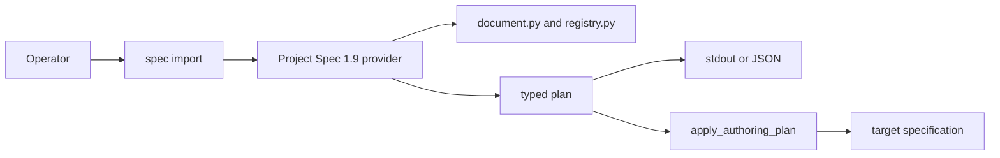

# Project Specification Preservation-First Conversion — Specification (Standard)

## Revision History

| Version | Date | Author | Change |
| --- | --- | --- | --- |
| 0.1 | 2026-08-11 | Coding agent under human review | Initial issue #55 preservation-first conversion contract. |
| 0.2 | 2026-08-11 | Owner-directed amendment | Approve deterministic mapping and digest-bound apply; resolve all open questions. |

**Spec lifecycle:** This approved specification extends the unpublished Project Specification 1.9 candidate; it neither authorizes a 1.10 package nor a separate publication. Scope-affecting changes require owner approval and a new revision row.

## 1. Purpose & Background

Repositories can have valuable house-format specifications that cannot use the canonical Project Specification template without an unsafe editorial rewrite. Existing `spec new` scaffolds and `spec upgrade` performs additive tier promotion, but neither converts such a source. This feature adds an explicit conversion path that favors preservation, determinism, and owner review over automatic interpretation.

## 2. Scope

### 2.1 In Scope

- Public `project-standards spec import` preview and guarded `--apply` behavior.
- Algorithmic exact heading mapping, raw-byte block accounting, adaptive-fenced review content, and owner-decision diagnostics.
- Selected Project Specification 1.9 provider integration, typed authoring plan, executor preconditions, rollback, structural validation, output contracts, tests, and adoption guidance.

### 2.2 Out of Scope (Non-Goals — never)

| ID | Non-Goal | Reason |
| --- | --- | --- |
| NG-001 | Fuzzy headings, semantic inference, or best-effort placement. | Plausible interpretation is not permission to move author prose. |
| NG-002 | Silent resolution or deletion of ambiguous, duplicate, or unmapped content. | The owner must make editorial decisions. |
| NG-003 | A new platform provider operation or Project Specification 1.10. | Existing `FIX`, mutation-plan, and 1.9 candidate boundaries suffice. |
| NG-004 | Required conversion during adoption. | New-spec-only and no-match consumers must remain successful. |

### 2.3 Won't Have in v1 (deferred — not never)

| ID | Deferred Capability | Why Deferred | Revisit When |
| --- | --- | --- | --- |
| WH-001 | Additional source-format profiles. | Each needs an approved exact mapping table and fixtures. | A concrete format has both. |
| WH-002 | Automatic resolution of review content. | It is editorial judgment. | An owner-approved deterministic rule exists. |

### 2.4 Boundaries

| Boundary | Description |
| --- | --- |
| System owns | CLI parsing, snapshots, deterministic planning, rendering, diagnostics, and one target mutation. |
| System depends on | Selected 1.9 templates/registry, provider schemas, and the guarded authoring executor. |
| System does not own | Source intent, owner review decisions, source cleanup, adoption choice, or publication. |

## 3. Context

### 3.1 Current State

`src/project_standards/specs/cli.py` dispatches `new` and `upgrade`. Selected-provider stdout paths return preview content, and write paths return a typed mutation plan to the executor. `new.py` scaffolds after identity resolution; `upgrade.py` is additive and source-spined. `document.py` provides fence-aware structural parsing, and `registry.py` derives canonical rules from templates. The Project Specification 1.9 payload declares authoring `mutation-plan` providers. `ProviderOperation.FIX` and `apply_authoring_plan` already provide contained, preconditioned, staged whole-file writes.

### 3.2 Target State

The selected 1.9 provider exposes `spec import`. Preview deterministically renders an in-memory typed plan and its digest to stdout only. `--apply` requires that operator-supplied digest, regenerates the plan from explicit `--id` and current snapshots, refuses a mismatch, then executes that one regenerated in-memory plan once. Each source block has one disposition: one exact mapped destination, or an adaptive-fenced entry in a clearly marked review section with an owner-decision diagnostic. The target structurally validates even when review diagnostics are present.

### 3.3 Assumptions

| ID | Assumption | Impact if False |
| --- | --- | --- |
| A-001 | An explicit target `spec_id` is supplied for preview and apply. | Refuse rather than minting any ID. |
| A-002 | An adaptive fence can contain any source block unchanged. | Do not enable that profile until its representation is corrected. |

### 3.4 Constraints

| ID | Constraint | Source |
| --- | --- | --- |
| C-001 | Preview/stdout is read-only and `--apply` is the only write confirmation. | Approved #55 design. |
| C-002 | Apply requires the preview digest, regenerates once from explicit `--id` and current snapshots, and executes that one in-memory plan once. | Approved #55 design. |
| C-003 | Every source block is preserved exactly once. | T26 acceptance. |
| C-004 | Ambiguous, duplicate, and unmapped material is review-visible and never guessed or discarded. | Approved #55 design. |
| C-005 | No-match and new-spec-only adoption remains a successful no-op. | T26 acceptance. |
| C-006 | Work extends the unpublished 1.9 candidate and leaves published predecessors unchanged. | T42 and release boundary. |

## 4. Goals

| ID | Goal | Success Signal | Achieved By |
| --- | --- | --- | --- |
| G-001 | Inspect conversion before it mutates a repository. | Preview writes nothing and shows its exact candidate. | FR-001, FR-007 |
| G-002 | Preserve source content without inferring intent. | Block accounting places every block exactly once. | FR-003–FR-005 |
| G-003 | Keep writes safe and recoverable. | Stale/fault paths publish no partial target. | FR-008, FR-009 |
| G-004 | Keep adoption independent of conversion. | No-match/new-spec-only tests exit successfully. | FR-010 |

> **§5 (Stakeholders and Users) is Full-tier** and is intentionally omitted at the Standard profile.

## 6. Glossary

| Term | Definition | Notes / Not to be confused with |
| --- | --- | --- |
| Source block | One indivisible raw byte range assigned by the importer. | Never normalized before accounting. |
| Exact mapping | Strip only an ASCII leading decimal heading prefix, including dotted numbers and optional punctuation; the remainder must exactly equal a selected `Registry.section_titles` title. | Not similarity matching or aliases. |
| Review section | A marked target section containing adaptive-fenced preserved content. | It is review-visible, not discarded. |
| Plan digest | Deterministic digest of the previewed typed plan. | It binds apply to reviewed output. |
| Typed plan | In-memory target bytes, snapshots, identity, dispositions, and diagnostics. | Apply regenerates and uses one matching plan; no file or handle exists. |

## 7. Requirements

### 7.1 Functional Requirements

| ID | Requirement | Rationale | Acceptance Criteria | Priority |
| --- | --- | --- | --- | --- |
| FR-001 | The system shall expose `project-standards spec import` through the selected provider using existing `ProviderOperation.FIX` and its authoring mutation-plan route. | Reuse the proven platform write boundary. | Dispatch confirms no new operation is introduced. | Must |
| FR-002 | The system shall require explicit `--id SPEC-XXXX` for preview and apply. | Preview/apply must not drift through random identity generation. | Missing or invalid ID exits 2; no ID is minted. | Must |
| FR-003 | The system shall strip only an ASCII leading decimal section-number prefix, including dotted numbers and optional punctuation, then map only a remainder exactly equal to a selected `Registry.section_titles` canonical title. | Recognition must be algorithmic and deterministic. | Near matches, unlisted headings, and duplicate target mappings enter review. | Must |
| FR-004 | The system shall preserve every source block exactly once at an exact destination or in review. | No author bytes may vanish or duplicate. | Byte-accounting tests cover recognized, unmapped, duplicate, ambiguous, and fence-like content. | Must |
| FR-005 | The system shall place ambiguous, duplicate, and unmapped content in review and emit owner-decision diagnostics. | Review is safer than inferred meaning. | Human/JSON output gives location, classification, and decision need. | Must |
| FR-006 | The system shall structurally validate the rendered target while allowing explicit review diagnostics. | Reviewable output must still be a valid specification. | Structural invalidity refuses; review-only diagnostics preview. | Must |
| FR-007 | The system shall make preview/stdout read-only and show target, diagnostics, deterministic plan digest, and `written: false`. | Operators must inspect and bind the candidate before mutation. | Filesystem snapshot is unchanged after preview. | Must |
| FR-008 | The system shall require `--expected-plan-digest` with `--apply`, regenerate one plan from explicit `--id` and current snapshots, refuse a digest mismatch, and pass that one in-memory plan once to `apply_authoring_plan`. | Persisted handles and reused stale plans are unnecessary and unsafe. | Changed input or wrong digest exits 2 with no writes; matching apply publishes once. | Must |
| FR-009 | The system shall refuse unsafe paths, aliases, stale preconditions, and failed staging; it shall clean staged state before failure. | Safety cannot trade away preservation. | Fault/concurrency tests leave no partial output. | Must |
| FR-010 | The system shall return a successful informational no-op for no-match and new-spec-only adoption. | Conversion is opt-in. | Selected-mode integration exits 0 with no writes. | Must |

### 7.2 Non-Functional Requirements

| ID | Category | Requirement | Measurement / Acceptance Criteria | Priority |
| --- | --- | --- | --- | --- |
| NFR-001 | Reliability | The system shall complete byte accounting and precondition checks before its first write. | Instrumentation proves stale plans publish zero targets. | Must |
| NFR-002 | Determinism | The system shall order mappings/diagnostics and compute plan digest deterministically for identical bytes/options. | Repeat preview output and digest are byte-identical. | Must |
| NFR-003 | Maintainability | The system shall isolate mapping logic from parsing, planning, and executor mechanics. | A registry-title mapping fixture can change without executor changes. | Should |

### 7.3 Interface Requirements

| ID | Interface | Requirement | Contract / Format | Acceptance Criteria |
| --- | --- | --- | --- | --- |
| IR-001 | CLI | The system shall support `project-standards spec import SOURCE --id SPEC-XXXX` preview and require `--apply --expected-plan-digest DIGEST` for a write. | All paths are consumer-root-relative and containment-checked. | Help/parser/preview/apply/refusal tests pass. |
| IR-002 | Human output | The system shall report source, target, selected 1.9 provider, mapping summary, review diagnostics, deterministic plan digest, and write state. | Concise stable terminal report. | Preview cannot claim a write. |
| IR-003 | JSON output | The system shall emit versioned `ok`, `written`, `target`, `spec_id`, `plan_digest`, `mappings`, `review`, `diagnostics`, and `error` fields. | Success and refusal objects have stable keys. | Schema tests cover preview, apply, no-op, review, and refusal. |

### 7.4 Data Requirements

| ID | Data Entity | Requirement | Validation Rules | Ownership |
| --- | --- | --- | --- | --- |
| DR-001 | Plan | The system shall retain source/target digests, bound explicit ID, mapping/review records, diagnostics, complete target bytes, and deterministic plan digest in memory. | Every block has one disposition; actions have preconditions; digest covers canonical plan bytes. | Provider/executor. |
| DR-002 | Review fence | The system shall preserve raw source bytes between an adaptive delimiter pair. | Delimiter cannot be closed by source content. | Selected provider. |

## 8. Architecture and Design

### 8.1 Architecture Summary

The CLI snapshots contained source/target paths and invokes the selected 1.9 provider through `FIX`. The provider strips only the defined numeric heading prefix, exact-matches the remainder against `Registry.section_titles`, assigns every raw block, renders mapped/review content, and validates. Preview serializes a deterministic plan/digest without a writer. Apply receives the expected digest, regenerates once from explicit ID and current snapshots, compares digests, then passes that one in-memory mutation plan to the executor.

### 8.2 Architecture Views

### 8.3 Design Decisions

| ID | Decision | Rationale | Alternatives Considered | ADR |
| --- | --- | --- | --- | --- |
| D-001 | Reuse `FIX` and mutation-plan effects. | Existing provider/executor boundary fits. | New operation rejected. | None |
| D-002 | Require explicit ID and digest-bound regeneration at apply. | Preview/apply stays stable without persisted state. | Random IDs and plan handles rejected. | None |
| D-003 | Use numeric-prefix stripping plus exact registry-title equality. | Mapping is algorithmic, not discretionary aliases. | Fuzzy/near-match mapping rejected. | None |
| D-004 | Preserve unrecognized content in adaptive review fences. | Retains bytes and exposes decisions. | Heuristic placement rejected. | None |
| D-005 | Keep review diagnostics nonfatal after structural validation. | Output is safe for owner review. | Treating review as structural failure rejected. | None |

### 8.5 Design Constraints

- No direct writer or bypass of selected-provider authority.
- No normalization, summary, or interpretation before preservation accounting.
- Later mapping profiles may add only approved exact mappings and retain accounting.

> **§8.6 (Dependency Policy) is Full-tier** and is intentionally omitted at the Standard profile.

## 9. Data Model

The transient plan records deterministic block ordinal/range/digest, disposition (`mapped` or `review`), optional mapping name, review diagnostic, source/target snapshot digests, explicit target ID, deterministic plan digest, and one whole-file target replacement. It creates no plan file, handle, or persistent registry and never changes the source document.

## 10. Behavior and Workflows

### 10.1 Primary Workflow

1. The operator supplies contained source/target paths and explicit `--id`.
2. The CLI snapshots inputs and requests an import plan through the selected provider.
3. The provider strips the defined numeric prefix, exact-matches registry titles, assigns every source block once, renders the target/review section, validates, and reports a plan digest.
4. The operator invokes `--apply --expected-plan-digest` with that digest.
5. The CLI regenerates one plan from current snapshots and explicit ID, refuses a digest mismatch, then passes the matching plan once to the executor for atomic replacement.

### 10.2 Alternate Workflows

| ID | Trigger | Behavior | Expected Result |
| --- | --- | --- | --- |
| AW-001 | No eligible source. | Informational no-op. | Exit 0, no writes. |
| AW-002 | Unlisted/ambiguous source heading. | Preserve in review and emit owner-decision diagnostic. | Successful preview with review. |
| AW-003 | Missing/invalid ID or apply digest. | Refuse before planning or mutation. | Exit 2, no writes. |

### 10.3 Edge Cases

| ID | Edge Case | Expected Behavior |
| --- | --- | --- |
| EC-001 | Source contains a fence delimiter. | Choose a safe adaptive delimiter and preserve bytes. |
| EC-002 | Two blocks match one unique target. | Preserve both in review with duplicate diagnostics. |
| EC-003 | Input changes after preview. | Regenerated plan digest differs and apply refuses without publication. |

### 10.4 State Transitions

| State | Meaning | Entry Condition | Exit Condition |
| --- | --- | --- | --- |
| Planned | Valid typed plan with snapshots. | Planning succeeds. | Previewed or applied. |
| Review required | Nonfatal review diagnostics exist. | Block has no exact disposition. | Owner decides externally. |
| Applied | Target published. | Preconditions hold. | Terminal. |
| Refused | Unsafe/stale/invalid request. | Check fails. | Re-preview after correction. |

## 11. UI Pages / API Endpoints

Not applicable: this is a local CLI with human and JSON stdout, not a UI or network API.

## 12. Error Handling and Recovery

### 12.1 Expected Failures

| ID | Failure Mode | User/System Behavior | Logging / Observability | Recovery |
| --- | --- | --- | --- | --- |
| ERR-001 | Unsafe/missing path, invalid ID, or missing expected digest. | Refuse before planning/mutation. | Stable human/JSON code. | Correct invocation. |
| ERR-002 | Target structural validation fails. | No usable plan. | Target-contract diagnostic. | Correct mapping data. |
| ERR-003 | Input changed after preview or expected digest is wrong. | Regenerate once and refuse digest mismatch before publication. | Stable mismatch code. | Re-preview current bytes and supply its digest. |
| ERR-004 | Staging/publication fails. | Clean staged state and report failure. | Executor boundary code. | Correct fault; do not reuse plan. |

### 12.2 Retry and Idempotency

Preview is repeatable for unchanged inputs and yields the same digest. Apply is never automatically retried: it regenerates one plan, compares its digest to the operator value, and either passes that one plan to the executor or refuses. A fresh retry begins with a new preview.

### 12.3 Rollback / Recovery

All replacement bytes are staged before publication and every snapshot is rechecked. A stale or staging-failed plan therefore leaves the target untouched and cleans temporary state. Recovery starts with a fresh snapshot; it never overwrites a concurrently changed target.

## 13. Security and Privacy

### 13.1 Authentication

The local command uses the invoking user's filesystem authority and introduces no network authentication surface.

### 13.2 Authorization

| Actor / Role | Allowed Actions | Denied Actions |
| --- | --- | --- |
| Local operator | Preview readable contained input; apply to a safe writable target. | Traversal, symlink escape, and writes without `--apply`. |

### 13.3 Secrets

Not applicable: import requires no credentials and must not copy source prose into diagnostics.

### 13.4 Sensitive Data

| Data | Classification | Storage | Transmission | Retention |
| --- | --- | --- | --- | --- |
| Source bytes | Consumer-controlled | Source and requested target only | Local process | No extra persistent copy. |
| Diagnostics | Consumer-controlled metadata | stdout | Local process | Caller-controlled. |

### 13.5 Threats and Mitigations

| Threat           | Impact                | Mitigation                               |
| ---------------- | --------------------- | ---------------------------------------- |
| Unsafe path      | Escape consumer root. | Existing safe-relative/no-follow checks. |
| Concurrent edit  | Lost changes.         | Snapshot preconditions/final recheck.    |
| Reinterpretation | Loss/wrong placement. | Exact mappings and review fences.        |

### 13.6 Hardening Checklist

- [x] Diagnostics do not echo source blocks by default.
- [x] No credentials, network call, or background service is introduced.
- [x] Existing containment and concurrent-edit checks remain the write authority.

> **Sections §14 (Capacity and Scale Assumptions), §15 (Risks), and §16 (Compliance, Licensing, and Data Rights) are Full-tier** and are intentionally omitted at the Standard profile.

## 17. Testing and Acceptance

### 17.1 Definition of Done

- [ ] Must requirements and acceptance criteria pass.
- [ ] Preservation accounting covers every source block exactly once.
- [ ] Preview/apply/refusal/rollback/JSON/no-match behavior is verified.
- [ ] Project Specification 1.9 adoption guidance documents limitation and workflow.

### 17.2 Test Strategy

| Layer | Scope | Required Coverage | Required? |
| --- | --- | --- | --- |
| Unit | Numeric-prefix parsing, exact registry mapping, adaptive fences, accounting. | Dotted/punctuated prefixes, near matches, duplicates, and fence-like bytes. | Yes |
| Provider | Selected 1.9 `FIX` plan. | Preview digest, explicit ID, structural validation, diagnostics. | Yes |
| Executor | Guarded apply. | Stale path, unsafe path, fault cleanup, atomic replacement. | Yes |
| CLI | Human/JSON public behavior. | Exit 0/2, read-only preview, expected-digest apply, no-match. | Yes |
| Regression | Existing new/upgrade/adoption. | No operation expansion or forced conversion. | Yes |

### 17.3 Requirement-to-Test Traceability

| Requirement ID | Test / Verification Method | Status |
| --- | --- | --- |
| FR-001–FR-002 | Provider dispatch, help, explicit-ID tests. | Not Started |
| FR-003–FR-005 | Numeric-prefix/exact-title mapping and preservation property tests. | Not Started |
| FR-006–FR-009 | Preview-digest, mismatch, executor, and fault tests. | Not Started |
| FR-010 | No-match/new-spec-only integration tests. | Not Started |
| NFR-001–NFR-003, IR-001–IR-003, DR-001–DR-002 | Accounting, determinism, output-schema, and fence tests. | Not Started |

## 18. Deployment and Operations

### 18.1 Runtime Environment

| Item              | Value                                                       |
| ----------------- | ----------------------------------------------------------- |
| Runtime           | Project Standards Python CLI and selected provider payload. |
| OS / Platform     | Supported local consumer repository.                        |
| External services | None.                                                       |
| Hosting           | Project Standards wheel.                                    |

### 18.2 Configuration Reference

Project Specification 1.9 remains selected through `.standards/config.toml`. Import is explicit; it adds no conversion-on-adoption option. Mapping profiles are immutable provider data, not consumer-supplied heuristic rules.

### 18.3 Deployment Flow

1. Extend the unpublished Project Specification 1.9 payload/provider and adoption guide.
2. Run focused provider, CLI, executor, payload, and documentation checks.
3. Leave 1.9 mutable until the consolidated v5.19 qualification; do not make a separate release.

### 18.5 Observability

Human and JSON reports distinguish preview, digest-bound apply, no-op, review-required, and refusal states; they expose stable diagnostic/error codes without leaking source blocks.

### 18.6 Backup and Disaster Recovery

Not applicable: import owns no durable service data; version control and no-partial-write behavior provide recovery for the one requested target.

### 18.7 Documentation Deliverables

- [ ] Project Specification 1.9 `adopt.md` documents import preview, plan digest, expected-digest `--apply`, review, and no-match behavior.
- [ ] Command help/JSON schemas describe exits 0/2 and stable fields.
- [ ] Fixtures demonstrate preservation without embedding sensitive source material.

## 19. Implementation Plan

Not applicable: T26 authorizes a conversion specification only; it does not authorize an implementation plan. T27 owns the separately approved implementation work.

> **§20 (Success Evaluation) is Full-tier** and is intentionally omitted at the Standard profile.

## 21. Open Questions and Decisions

No open questions remain. The initial mapping algorithm and digest-bound apply contract are approved in revision 0.2. Future mapping expansions require a new approved specification revision.

## Deviations Log

| ID | Spec Reference | Deviation | Reason | Approved? |
| --- | --- | --- | --- | --- |
| DEV-001 | §19 | No implementation plan. | T26 owns specification; T27 owns implementation. | Yes |

## References

- [Open-Issue Resolution Program Plan](../plans/2026-08-01-open-issue-resolution-program-plan.md#t26-specify-house-format-conversion-for-55)
- [Project Specification 1.9 adoption guide](../../standards/project-spec/versions/1.9/adopt.md)
- [Project Specification CLI](../../src/project_standards/specs/cli.py)
- [Specification document parser](../../src/project_standards/specs/document.py)
- [Specification registry](../../src/project_standards/specs/registry.py)
- [Control-plane schemas](../../src/project_standards/control_plane/schemas.py)
- [Selected providers](../../src/project_standards/control_plane/providers.py)
- [Guarded executor](../../src/project_standards/control_plane/executor.py)

## Appendix A: ID Conventions

| Prefix | Meaning                    | Defined In     |
| ------ | -------------------------- | -------------- |
| `G-`   | Goal                       | §4             |
| `NG-`  | Non-goal                   | §2.2           |
| `WH-`  | Deferred capability        | §2.3           |
| `A-`   | Assumption                 | §3.3           |
| `C-`   | Constraint                 | §3.4           |
| `FR-`  | Functional requirement     | §7.1           |
| `NFR-` | Non-functional requirement | §7.2           |
| `IR-`  | Interface requirement      | §7.3           |
| `DR-`  | Data requirement           | §7.4           |
| `D-`   | Design decision            | §8.3           |
| `AW-`  | Alternate workflow         | §10.2          |
| `EC-`  | Edge case                  | §10.3          |
| `ERR-` | Error handling             | §12.1          |
| `OQ-`  | Open question              | §21            |
| `DEV-` | Deviation                  | Deviations Log |

## Appendix B: Agent Implementation Contract

The implementer shall read this specification, preserve its non-goals/constraints, record scope divergence in the Deviations Log, and map every implementation claim to §17.3. The implementer shall not invent mappings, discard source bytes, add a provider operation, publish a package, or make no-match adoption fail. A blocked owner decision is an `OQ-` update, not an assumption.

> **Appendix C (Optional Modules) is Full-tier** and is intentionally omitted at the Standard profile.

## Appendix D: Tailoring

This Standard-profile document is intentionally behavioral rather than an implementation plan. That tailoring does not permit omission of its preservation, diagnostics, recovery, or test contracts.
