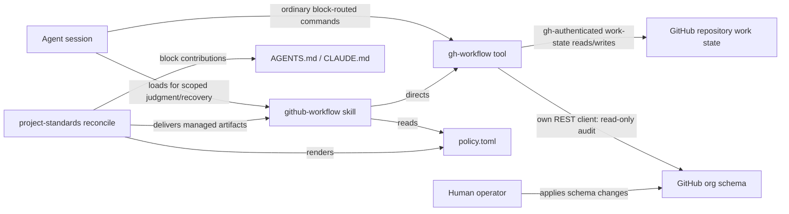
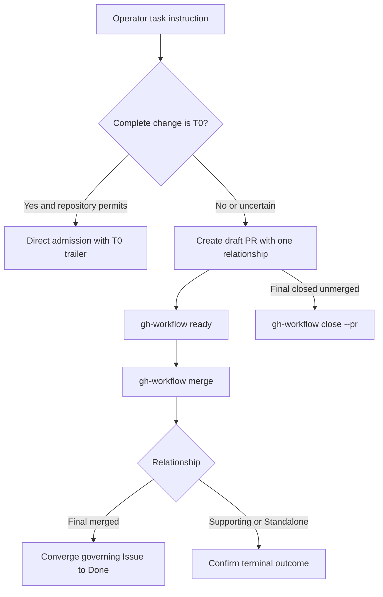
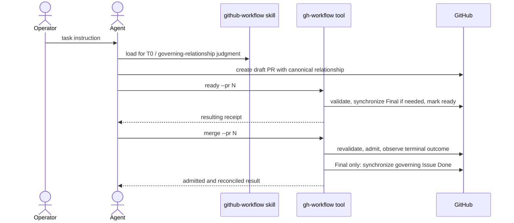

# GitHub Workflow Standard Package — Specification (Standard)

## Revision History

| Version | Date | Author | Change |
| --- | --- | --- | --- |
| 0.1 | 2026-08-06 | Claude with owner-approved design input | Initial draft from the approved github-workflow package design brief. |
| 0.2 | 2026-08-06 | Claude with owner directive | Skill tooling is Go (design D7): the org audit ships as a committed, reproducibly built linux/amd64 `gh-workflow-audit` binary the skill invokes. Adds FR-015/FR-016, NFR-005, IR-004, C-006, WH-006, D-008, EC-006, ERR-005; reworks FR-008, AW-001, OQ-002. |
| 0.3 | 2026-08-06 | Claude with owner directive | Standardized attention-first operator summaries (design D8): sixth reference `summary-format.md`, summary presentation added to the skill trigger boundary. Adds FR-017, AW-004, D-009; reworks FR-002/FR-004 and reference counts. |
| 0.4 | 2026-08-06 | Claude with owner directive | Creation receipts (design D9): agents present a consistent single-item summary after creating an issue or PR, defined in `summary-format.md`. Adds FR-018, D-010; extends the primary workflow. |
| 0.5 | 2026-08-06 | Claude with owner directive | Maintained work-state ledger at `docs/GH-WORKFLOWS.md` generated by the tool, which is consolidated and renamed `gh-workflow` with `audit` and `ledger` subcommands (design D10). Adds FR-019/FR-020, DR-003, G-005, AW-005, EC-007, WH-007, D-011; renames the FR-015 artifact and reworks FR-008/FR-016/IR-004. |
| 0.6 | 2026-08-06 | Claude with owner approval | The tool absorbs deterministic skill plumbing (design D11): mutation subcommands `new`/`set`/`close`/`reopen`, render subcommands `summary`/`receipt`, and read-only `check`; the skill routes these actions through the tool. Adds FR-021–FR-024, EC-008, D-012; reworks FR-015, IR-004, and workflow steps. |
| 0.7 | 2026-08-06 | Claude with owner directive | PR existence is repository-local policy (design D12): the package binds PR obligations only once a PR exists; the direct-push versus PR threshold varies per repo, with a stated silent-repo default. Adds D-013; reworks FR-006 and the ownership boundary. |
| 1.0 | 2026-08-06 | Claude with owner authorization | Owner approved the specification for implementation planning; no content change. |
| 1.1 | 2026-08-06 | Claude with owner-directed cross-agent review | Codex high-effort review corrections: FR-021 ordered failure-safe terminal pairing replaces the impossible cross-API atomicity claim; FR-016 platform precondition moves to the skill (EC-006); IR-002 and the component view permit `gh`-issued-token API access by the tool; NFR-005/C-006 pin the exact reproducible-build invocation; FR-019 guarantees the markdown-tooling default gate, not arbitrary consumer configs. |
| 1.2 | 2026-08-06 | Claude with owner-directed cross-agent review | Codex round-2 residue sweep: FR-021 fixes the sequence order (native state first, then `Workflow` field; rerun-as-retry idempotency); §10.1/AW-004/§8.2.1 route all work-state traffic and summary gathering through the tool; ERR-005 splits into missing/corrupt (ERR-005) and unsupported-platform (ERR-006, skill-reported, remedied only by a future platform payload); NFR-005 completes the build command with pinned `-ldflags`, output path, and package operand. |
| 1.3 | 2026-08-07 | Claude, implementation evidence | NFR-005 and C-006 amended: the fixed build invocation now pins `GOEXPERIMENT=dwarf5`. The go command resolves an unset or empty value from `$GOROOT/go.env`, and Fedora's `go.env` sets `nodwarf5`, which changed the emitted DWARF and produced a binary 253 KiB smaller than an upstream-default build of the same source. `dwarf5` is the upstream baseline, so the pin alters no code generation and makes Fedora and upstream toolchains byte-identical — the planned reproducibility-risk treatment realized. |
| 1.4 | 2026-08-07 | Claude with owner decision | DR-001 amended: the baseline `org-schema.yaml` adopts the live organization's plain-space forms for the thirteen indexed values of `Priority`, `Change risk`, and `Severity` (`P0 Immediate`, `R1 Low`, `S0 Critical`) in place of the design input's em-dash separators, per owner decision 2026-08-07. The `P`/`R`/`S` index prefixes are retained deliberately: they carry ordering the bare labels do not. A live audit now reports zero mismatches. |
| 1.5 | 2026-08-07 | Claude, implementation close-out | OQ-002 **Answered**: the frozen stdlib-`flag` CLI surface — nine subcommands, shared `--repo`/`--policy`/`--schema` defaults, and the three-value exit-code contract — is recorded inline in the packaged `SKILL.md`, and GitHub access is REST only. §17.3 completed: all 36 requirement rows Passing with their real proving commands. Live-run evidence recorded: one live read-only `audit` plus a scratch-checkout `ledger` run against the organization. OQ-001 (release placement) deliberately remains Open — an owner decision. |
| 1.6 | 2026-08-08 | Claude, owner direction | OQ-001 **Answered**: `github-workflow` 1.0 ships in v5.17.0, per owner direction 2026-08-08, which also moves the ADR train (#127/#128) to v5.18.0. |
| 1.7 | 2026-08-09 | Claude, documentation correction | Align §18.3 deployment trigger with the answered OQ-001 (ships in v5.17.0). |
| 1.8 | 2026-08-09 | Claude with owner decision (v5.18.0 D3) | FR-019 amended for `github-workflow` 1.1: the generated-file header carries the tool version and the do-not-edit notice but **not** a read timestamp, so the ledger body is a function of work state alone and regeneration against unchanged state produces no diff (issue #154). The read time is reported on `ledger`'s stdout, which is not committed content. FR-019's remaining guarantees — TOC anchors, attention-first layout, atomic whole-file write, and gate-clean output — are unchanged, as is the 1.0 payload, whose published bytes still stamp the timestamp. NFR-005's fixed invocation is parameterized by payload version rather than pinned to `1.0`: `scripts/build-gh-workflow.sh` targets the version under development, which a cut moves forward. |
| 1.9 | 2026-08-26 | Claude with owner decisions (2026-08-26) | `github-workflow` 1.5, driven by the [session-corpus efficiency review](../reviews/github-workflow/2026-08-26-0847-github-workflow-session-corpus-efficiency-review.md). **The `ledger` feature is removed outright**: FR-019, FR-020, DR-003, AW-005, EC-007, and D-011 are marked Removed or Superseded at package version 1.5; WH-007, G-005, the §2.4 ownership boundary, and the §3.2 target tree lose the generated `docs/GH-WORKFLOWS.md`; FR-015 and IR-004 drop from nine subcommands to **eight**. New FR-025 and EC-009 make the `upgrade` provider _report_ a residual `docs/GH-WORKFLOWS.md` rather than delete a file the package never declared. **Guidance is restructured**: FR-001 and FR-024 fold routing and the documented raw-`gh` forms into one complete surface and bar sending an agent to `help` for a flag that surface prints; FR-005 withdraws value-for-value vocabulary reproduction in favour of the tool's refusal path; FR-006 receives the change-risk review ladder; FR-007 and NFR-003 replace the ~12-content-line block ceiling with a 2,400 B ceiling and admit the routing table into the block; new NFR-006 budgets `SKILL.md` and `field-vocabulary.md`; EC-006 drops the per-session preflight mandate for a failure-triggered stop-and-report rule. **Issue self-definition is relaxed**: FR-009, the Glossary's standing-invariants row, §13.2, and ERR-004 let agents author acceptance criteria, admit work to `Ready`, and set `Execution mode`, reserving only `Unattended agent` to the owner (WH-005). FR-003 pins the Codex companion to a single `.agents/` target (issue #175). FR-022 is re-scoped to the shared layout engine that outlives the ledger. Adds D-014, D-015, FR-025, NFR-006, EC-009, OQ-003, OQ-004, DEV-001, DEV-002; reworks §2.1, §2.3, §2.4, §3.2, §8.2.3, §8.3 (D-003/D-012), §8.5, §10.1, §17.2, §17.3, and §19. |
| 1.10 | 2026-08-26 | Claude with owner decision (2026-08-26) | DEV-002 closed ([#192](https://github.com/L3DigitalNet/project-standards/issues/192)): `docs/specs/archive/2026-08-06-github-repo-administration-preliminary-design.md` now carries a dated amendment note at section 34 recording the 1.5 divergence in invariants 5 and 6 and pointing to this document's Glossary "Standing invariants" row and FR-009. No requirement, design decision, or other spec content changes. |
| 1.11 | 2026-08-26 | Claude with owner decision (D10, 2026-08-26) | NFR-006 amended: `SKILL.md`'s byte ceiling rises from 6,500 B to 12,000 B and `field-vocabulary.md`'s from 2,000 B to 3,200 B; the 70-line and 30-line ceilings are unchanged. The original byte figures assumed roughly 93 B/line, but the content FR-024 and FR-005 mandate for these files runs roughly 160 B/line; measured 1.5 output is 11,176 B for `SKILL.md` and 2,918 B for `field-vocabulary.md`, both over the original byte ceilings despite meeting the line ceilings. |
| 1.12 | 2026-08-26 | Claude, fresh-context release verification correction | FR-025's acceptance text amended: the offline `upgrade` provider cannot observe an undeclared consumer file's existence beyond what its pre-upgrade snapshot already shows, so on the 1.4→1.5 upgrade path it emits the residual-file advisory unconditionally instead of gating emission on a live existence check, with wording that varies on whether the snapshot observed `docs/GH-WORKFLOWS.md`. Adds DEV-003 (closed by this amendment). No other requirement, design decision, or spec content changes. |
| 1.13 | 2026-08-29 | Claude with owner directive (2026-08-29) | `github-workflow` 1.6 **replaces standing invariant 15** — “durable follow-up work discovered while implementing becomes an Issue before the session ends” — with the owner's finding-disposition rule, per owner directive 2026-08-29 (D-016). A related finding the agent can address in the session gets no issue: it is fixed in place when the repository being worked in owns it, and filed as an issue in the owning repository when an upstream dependency hosted in the organization owns it; only a finding large enough to warrant a full separate session sends the agent to ask the operator whether to file an issue or tackle it now. The specification revision amended the Glossary “Standing invariants” row, FR-007, D-003, §10.1 step 6, and the §17.3 FR-007 and NFR-003 rows; it added D-016 and DEV-004. The shipped payload also changed `pr-standard.md` and `summary-format.md`; revision 1.16 assigns those already-shipped changes to FR-006/FR-017/FR-018 and D-016. The block still carries six standing-invariant bullets and the 2,400 B rendered-body ceiling (NFR-003, FR-007) is unchanged. OQ-004, D-012, D-014, and the 1.5 `ledger` removal are untouched. |
| 1.14 | 2026-08-30 | Codex, current-implementation reconciliation | Reconciles the approved specification to the shipped `github-workflow` 1.6 baseline before any 1.7 design amendment. Records the 1.2 field-shadowing-label refusal, the 1.3 dual skill-tree delivery and symmetric drift coverage, the 1.4 renderer compatibility work, the 1.5 optional-`Target date` Ready rule, and the 1.6 finding-disposition cut. Corrects stale pre-implementation context, target-tree paths, FR-001/FR-004/FR-009/FR-015/FR-023, NFR-002, D-017, the FR-025 verification method, release/DoD/milestone state, and every pending 1.5/1.6 traceability status. Evidence came from the current payload, Go source, package/provider tests, release records, Issues #170/#171/#175, and repository history. GitHub's PR inventory contains no PR for the post-1.0 implementation train: the recent numbered commit suffixes refer to Issues, and the relevant commits have no associated PRs. No 1.7 target behavior is introduced. |
| 1.15 | 2026-08-30 | Codex, independent baseline-verification corrections | Corrects the 1.6 baseline after independent native-agent and headless-Opus implementation reviews. The revision distinguishes the skill's full mutation trigger from the managed block's narrower load directive; describes the block's condensed routing summary; records the renderer's first-closing-keyword PR heuristic and its conflict with the packaged nontrivial-PR guidance; makes the unconditional 1.5+ upgrade advisory explicit; separates schema, provider, and runtime organization validation; corrects binary/platform recovery language; and replaces overstated traceability claims with the actual current evidence. Adds DEV-005–DEV-008 for shipped cross-artifact inconsistencies. No 1.7 target behavior is introduced. |
| 1.16 | 2026-08-30 | Codex, final deep-baseline verification corrections | Resolves further current-state drift found by a fresh final-byte Opus audit: records the dead fields-not-to-create README pointer (DEV-009); assigns the full 1.6 finding-disposition change surface to FR-006/FR-017/FR-018 and D-016; removes an unrecorded `gh`-release verification claim; records stale Go source metadata while distinguishing a parsing example from runtime vocabulary (DEV-010); documents `audit --org` and `--fail-on-drift`; advances the live authoring constraint to Standard Bundle Authoring 2.7; and updates the NFR-005 worked version. The apparently conflicting `pr-standard.md` paragraphs are clarified as deferred work versus findings fixed before the PR ends, not recorded as a deviation. No 1.7 target behavior is introduced. |
| 1.17 | 2026-08-30 | Codex, final baseline provenance correction | Corrects DEV-010's historical attribution after exact-byte native verification: the em-dash fixtures are pre-1.0 residue that was not updated when the packaged vocabulary changed before 1.0 release, while only the unstamped fallback version is specifically 1.5-era. No implementation claim or 1.7 target behavior changes. |
| 1.18 | 2026-08-30 | Codex, expanded Opus baseline corrections | Records implementation behavior omitted from FR-021: `set --type` validation, response read-back, and ordered mixed mutation; and the reopen-then-close path used to reclassify a closed Issue, including its issue-left-open recovery state. Narrows FR-024's no-help-call rule to delivered guidance, cites the catalog-wide provider-registry proof, scopes the recorded live run to its 1.0-era payload, and expands DEV-010 to the full stale fixture/golden surface. No 1.7 target behavior is introduced. |
| 1.19 | 2026-08-30 | Codex, architecture baseline correction | Corrects three stale architecture/runtime surfaces after exact-byte native verification: the `gh-workflow` binary, not the skill or raw `gh`, executes the read-only organization audit through its own REST client; `gh` supplies the authentication token. No implementation claim or 1.7 target behavior changes. |
| 1.20 | 2026-08-30 | Codex, final Opus advisory reconciliation | Records the renderer's permanently empty Discovered-follow-ups tail and its conflict with verbatim-relay guidance (DEV-011); specifies the terminal-`Workflow` routing refusal in `new`/`set`; notes the 1.6 version-stamped binary rebuild; makes FR-009's current refusal-list structure observable; and records the unbound duplicate field-pinning/readiness maps (DEV-012). No 1.7 target behavior is introduced. |
| 1.21 | 2026-08-30 | Codex, terminal-refusal evidence correction | Corrects FR-021's verification attribution after exact-byte native review: `set` has the direct terminal-`Workflow` refusal fixture, while `new` is established by source inspection of its shared validator path and lacks its own direct regression case. No implementation claim or 1.7 target behavior changes. |
| 1.22 | 2026-08-30 | Codex, final cross-artifact baseline corrections | Records that read-only `receipt` projections retain the creation-only `Created` header (DEV-013), and that current renderer source/tests still cite retired FR-019 and retain ledger-derived fixture text after the live rendering contract moved to FR-022 (DEV-014). Corrects FR-019 traceability accordingly. No 1.7 target behavior is introduced. |
| 1.23 | 2026-08-30 | Codex, retired-requirement citation precision | Corrects DEV-014 after exact-byte native review: four FR-019 citations concern surviving renderer fidelity, while the fifth (`ghapi/workitems.go`) concerns the older read/client structure; adds DEV-014 to FR-022 traceability. No implementation claim or 1.7 target behavior changes. |
| 1.24 | 2026-08-30 | Codex, runtime-interface baseline | Records six shipped interfaces found by final Opus review: the renderer's full text-neutralization/table contract; the grouped REST surface then identified; `reopen` and `close` schema validation; Git-origin repository resolution and its failure mode; the managed block's formatting-suppression envelope; and `summary`'s fixed open-only single-repository projection, including the conflicting guidance that calls scope agent judgment (DEV-015). Later baseline revisions correct omissions in that REST inventory. No 1.7 target behavior is introduced. |
| 1.25 | 2026-08-30 | Codex, runtime-interface evidence correction | Corrects revision 1.24 after exact-byte native review: origin parsing is host-blind rather than GitHub-host-validating (DEV-016); removes the unimplemented EC-010 behavior; distinguishes source-only renderer/close validation claims from direct tests; and scopes the byte ceiling to the in-body markdownlint pair, excluding the outer Prettier envelope. No 1.7 target behavior is introduced. |
| 1.26 | 2026-08-30 | Codex, surface-specific renderer and Ready-baseline correction | Corrects the 1.6 baseline after the completed deep Opus review of revision 1.24 and exact-byte native review of revision 1.25: records the summary's empty blocker detail and one-sided terminal mismatch visibility (DEV-017), plain-text unneutralized receipts (DEV-018), the untyped-Issue two-field Ready fallback (DEV-019), governing-Issue-derived PR risk notes, and the issue-created/receipt-read-back failure path; and moves backtick neutralization from direct-test to source-inspection evidence. No 1.7 target behavior is introduced. |
| 1.27 | 2026-08-30 | Codex, creation/delivery/acceptance baseline correction | Corrects six remaining 1.6 omissions found by the exact-byte Opus review of revision 1.26: records the executable acceptance-criteria heading heuristic (DEV-020), authored-body replacement and JSON receipt behavior in `new`, unconditional paired skill/reference/binary delivery across single-harness selections, `audit --org`'s login-validation bypass (DEV-021), and ledger-themed mutate fixtures in DEV-014. No 1.7 target behavior is introduced. |
| 1.28 | 2026-08-30 | Codex, final invariant/detector/evidence precision correction | Corrects revision 1.27 after exact-byte native and Opus reviews: describes the acceptance detector's first-match/first-nonblank control flow exactly; records that the managed block omits the skill's open-is-not-Ready clause (DEV-022); and narrows FR-025 and FR-011 traceability to what their tests actually assert. No 1.7 target behavior is introduced. |
| 1.29 | 2026-08-30 | Codex, REST-boundary and final payload precision correction | Corrects the remaining current-state gaps found by exact-byte native and Opus reviews of revision 1.28: specifies the REST client's pagination credential boundary and resource limits (NFR-007); records single-Issue paths accepting a PR-shaped response as an Issue (DEV-023); broadens DEV-018 to the 1.6 README contradiction; distinguishes `reopen`'s two refusal messages; expands audit mismatch causes; and corrects the family-wide NFR-001 test scope. No 1.7 target behavior is introduced. |
| 1.30 | 2026-08-30 | Codex, final independent-review correction | Corrects revision 1.29 after exact-byte native and headless-Opus review: describes the 8 MiB boundary as an undetected read-prefix truncation and the error excerpt as up to 200 retained bytes plus an ellipsis; records the first-page-only check-runs verdict (DEV-024); corrects the REST inventory for embedded Issue Field values and organization-scoped mutation field-ID resolution; and narrows NFR-001/FR-024 traceability to the exact payload versions their tests exercise. No 1.7 target behavior is introduced. |
| 1.31 | 2026-08-30 | Codex, bounded-parser and admission-surface correction | Corrects six current-state omissions found by the clean headless-Opus review of revision 1.30: specifies the fail-closed YAML/TOML subsets; adds mutation-time live-schema-drift recovery (ERR-011); broadens DEV-021 to resolved repository owners used for field-ID lookup; records lifecycle-blind Ready checks (DEV-025); records nonempty/unique field assignment and no-clearing behavior (DEV-026); and narrows the block's vocabulary prohibition to tables/enumerated sets while permitting invariant-required values. No 1.7 target behavior is introduced. |
| 1.32 | 2026-08-30 | Codex, bounded-parser edge-case correction | Corrects two parser overclaims found by exact-byte native verification of revision 1.31: records the YAML reader's ordering-dependent duplicate-`values` acceptance (DEV-027) and the TOML reader's permissive bracketed-header recognition (DEV-028), and narrows their traceability claims to the directly tested and source-inspected boundaries. No 1.7 target behavior is introduced. |
| 1.33 | 2026-08-30 | Codex, instruction-strength and flag-scope correction | Corrects two current-state precision defects found by the headless-Opus review of revision 1.31: distinguishes SKILL.md's two declarative authorization boundaries from its three contiguous non-overridable hard-refusal bullets across FR-009, ERR-004, and §13.2; and states each shared CLI flag's actual subcommand scope in OQ-002, including `--policy` on all eight subcommands. Directly verifies the provider-registry and reproducible-build proof files omitted from Opus's sealed projection. No 1.7 target behavior is introduced. |
| 1.34 | 2026-08-30 | Codex, final independent-review precision correction | Corrects the residual claims found by exact-byte native and headless-Opus verification of revision 1.33: broadens DEV-022 and the affected requirements to record that the managed block omits the field-shadowing-label and enforcement-bypass hard refusals as well as the open-is-not-Ready boundary, while retaining only the organization-schema hard refusal; aligns the associated contract-test coverage statements; removes DEV-027's false implication that any duplicate-`values` case has direct test coverage; and explains both the repository-route and audit uses that place `--policy` on all eight subcommands. No 1.7 target behavior is introduced. |
| 1.35 | 2026-08-30 | Codex with owner-approved design | Defines the `github-workflow` 1.7 target after the independently verified 1.6 baseline. Adds the uniform T0-or-PR admission rule; canonical Final, Supporting, and Standalone governing-work relationships; PR-owned Standalone contracts; shared Structural/Ready/Merge/Post-merge validation; action-oriented findings; draft-first agent PRs; paired `ready`, `merge`, and Final-disposition operations; low-friction operator-authority semantics; and coordinated repair-on-touch migration. Retains the two-option consumer configuration and repository ownership of branch topology, merge method, and live enforcement. No 1.7 implementation is claimed by this revision. |
| 1.36 | 2026-08-30 | Claude, orchestrated 1.7 implementation close-out | Records that `github-workflow` 1.7 is implemented, cut as an immutable payload, and promoted to the Catalog 5 default. Marks the §17.3 and §17.3.1 rows Passing with their real proving tests, checks the satisfied §17.1 Definition-of-Done items, completes MS-4/MS-5 and the MS-6 release step, and closes or explicitly retains every deviation FR-036 governs. Two contract clarifications, neither a target-behavior change: `Final-Disposition: VALUE` carries the lowercase OUTCOME token rather than the `Workflow` display name (FR-034, DEV-029), and `--schema PATH` is accepted by all ten subcommands (IR-005). Records the implemented merge-method selection tier and `--auto` outcome contract (FR-033, DEV-030/DEV-031) and the new `cli-envelope` payload resource (DR-004). |
| 1.37 | 2026-08-31 | Claude, consumer-fleet migration close-out | Records that MS-6 item 2 — the consumer-fleet migration — is complete, closing the last open Definition-of-Done item and every milestone. All 24 locally cloned Project Standards consumers were reconciled to release 5.26.0 at `reconcile --check` and `project-standards validate` exit 0; the five that enable `github-workflow` (`agent-configs` from 1.6; `agent-ventures`, `llm-wiki`, `project-feldspar`, and `social-ventures` from 1.5) resolve 1.7 with a deployed `gh-workflow` binary byte-identical to the 1.7 payload artifact. Those five rollouts each went through a draft PR, `gh-workflow ready`, and `gh-workflow merge`, dogfooding the 1.7 admission model on its own migration; that run found DEV-032, a new retained deviation in the immutable 1.7 `pr-standard.md` Standalone example. Also checks the four §18.7 Documentation Deliverables items left unchecked at revision 1.36, each verified against the shipped v5.26.0 artifacts rather than assumed: the 1.7 payload's skill, six references, `README.md`, `adopt.md`, `agent-summary.md`, and managed block; Catalog 5's `role = "default"` 1.7 entry with 1.0–1.6 all retained; `UPGRADING.md`'s 5.26.0 refresh section covering the same-major migration, repair-on-touch of already-open PRs, and unchanged consumer configuration, alongside the `CHANGELOG.md` release note; and the `deployed.md` rollout record this revision accompanies. No requirement, design decision, or target behavior changes. |

**Spec lifecycle:** This document is **living until `approved`**, then **change-controlled**: post-approval edits require a new revision row and, for scope-affecting changes, re-approval by the owner. Implementation deviations are recorded in the [Deviations Log](#deviations-log), not silently patched into requirements. When replaced, set `status: superseded` and `superseded_by:` in the frontmatter.

**Normative precedence:** For Catalog 5 package anatomy, configuration, version selection, adoption, reconciliation, and lifecycle mechanics, [SPEC-CP01](2026-07-10-consumer-standards-control-plane-spec.md), [SPEC-BA02](2026-07-10-standard-bundle-authoring-v2-spec.md), [ADR 0023](../adr/adr-0023-unified-consumer-standards-control-plane.md), and [ADR 0024](../adr/adr-0024-catalog-scoped-package-version-channels.md) take precedence over any conflicting mechanics below. The GitHub operating model itself — Issue Types, Issue Fields, lifecycle, invariants, adoption phases — is defined by the preserved design input, [GitHub Repository Administration Standard (preliminary)](archive/2026-08-06-github-repo-administration-preliminary-design.md); this specification packages that model without redefining it.

---

## 1. Purpose & Background

L3DigitalNet repositories use GitHub as the durable control plane for local-agent development: Issues can be authoritative work contracts, seven organization-level Issue Fields carry typed operational metadata, pull requests are admission and execution records, and deterministic tooling pairs mutations that must agree. `github-workflow` delivers that operating model as a versioned Catalog 5 package and binds agent sessions to it through managed instruction blocks and repo-local skills.

This specification preserves the exact shipped `github-workflow` 1.6 baseline and defines its approved 1.7 successor. The package ships byte-identical managed skill copies for Codex and Claude Code, compact invariant-bearing instruction blocks, versioned reference material including the organization-level Issue Field schema, the `gh-workflow` binary, and the standard provider set for validation, drift detection, and upgrade.

Version 1.7 adds a uniform, low-friction admission model. A complete editorial-only T0 change may enter an integration target directly when repository instructions and GitHub allow it; every other ordinary change uses a PR. Every PR declares one authoritative governing-work relationship, and the tool validates and pairs the Ready, Merge, terminal-synchronization, or unmerged-Final disposition operation that currently matters. The operator's task instruction is sufficient authority for normal completion and for a specifically directed exception; validation is internal execution plumbing, not a second permission ceremony.

---

## 2. Scope

### 2.1 In Scope

- An adoptable `standards/github-workflow/` package family with immutable payload versions `1.0` through `1.7`; 1.6 is the independently verified implementation baseline and 1.7 is the next coordinated payload, while each earlier immutable payload retains the authoring contract current when it was published.
- Byte-identical managed copies of the mandatory repo-local skill, binary, and six on-demand reference files under `.agents/skills/github-workflow/` and `.claude/skills/github-workflow/`, plus the Codex-only companion under `.agents/skills/github-workflow/agents/openai.yaml`.
- A machine-readable organization-schema reference (`org-schema.yaml`) and a skill-driven audit over live organization state.
- A compiled Go tool, `gh-workflow` (linux/amd64), shipped as a managed artifact and invoked by the skill under the operator's `gh` authentication. Version 1.7 exposes `audit`, `new`, `set`, `close`, `reopen`, `summary`, `receipt`, `check`, `ready`, and `merge`; 1.5–1.6 exposed eight commands after removing `ledger`, while 1.0–1.4 exposed nine.
- T0 editorial-only direct admission, canonical Final/Supporting/Standalone PR relationships, PR lifecycle validation, paired Ready/Merge/Final-disposition operations, and post-event reconciliation.
- **Removed at package version 1.5:** a tool-maintained, human-facing ledger of open issues and PRs at `docs/GH-WORKFLOWS.md` in the consumer repository. In scope through 1.4 only; see FR-019/FR-020 and D-015.
- Managed markdown-block contributions to `AGENTS.md` and `CLAUDE.md` carrying condensed routing, the scoped skill-load directive, and standing invariants.
- A rendered per-consumer `policy.toml` under `.standards/packages/github-workflow/`.
- A two-option consumer configuration schema (`organization`, `harnesses`).
- Providers: `render-semantic`, `validate`, `verify`, `drift-check`, `upgrade`.
- Catalog, graph, agent-summary, and package-contract test integration required of every Catalog 5 family.

### 2.2 Out of Scope (Non-Goals — never)

| ID | Non-Goal | Reason |
| --- | --- | --- |
| NG-001 | Agent-performed mutation of organization-level Issue Fields, Issue Types, or other organization schema. | Org schema changes are human-applied by design; the skill audits and reports only. |
| NG-002 | Network access from any provider. | Providers run offline and deterministically inside the reconcile transaction; the online audit lives exclusively in the skill. |
| NG-003 | Duplicating native GitHub relationships or derivable facts as package configuration or consumer metadata (area labels, parent links, PR URLs, completion dates, agent-ready flags). | The design input's derived-state rule: store decisions and irreducible facts; derive consequences. |
| NG-004 | Encoding model or agent identity in work semantics (fields, config, or block content). | Worker identity is execution metadata; model routing changes must not touch the durable work contract. |
| NG-005 | Personal-account repository support or degraded no-fields fallback modes. | Organization-level Issue Fields do not exist on personal accounts; all repositories are migrating to the organization. |
| NG-006 | Required-check or ruleset manipulation, enforcement bypass, or treating package permission as stronger than live GitHub enforcement. | The package may validate and perform merge admission, but it never weakens the repository mechanisms that judge whether admission is permitted. |

### 2.3 Won't Have in v1 (deferred — not never)

| ID | Deferred Capability | Why Deferred | Revisit When |
| --- | --- | --- | --- |
| WH-001 | GitHub Issue Forms delivery under `.github/ISSUE_TEMPLATE/`. | Forms cannot populate Issue Fields; `.github/` is consumer-owned; agents author most issues through the skill. | Human web-UI issue capture becomes routine. |
| WH-002 | Phase-3 deterministic invariant enforcement (Actions checks, rulesets guidance as shipped artifacts). | The design input defers enforcement until the data model is proven by manual operation. | Operating experience under phases 1–2 shows stable semantics and repeated invariant violations worth automating. |
| WH-003 | A `migrate` provider and legacy signatures. | No legacy predecessor exists for this package. | Legacy label-based approximations are discovered in consumer repositories. |
| WH-004 | Multi-organization support (`organization` as a list). | Exactly one organization exists today. | A second organization appears; the change is additive. |
| WH-005 | Coordinator, claiming, and unattended dispatch machinery (design-input phases 4–5). | Phases 1–2 must prove the model manually first. | The owner authorizes the coordinator program separately. |
| WH-006 | Tool binaries for platforms beyond linux/amd64. | Every current consumer is linux/amd64; additional platforms multiply payload size with no consumer. | A non-linux/amd64 consumer appears. |
| WH-007 | Scheduled or CI-driven ledger refresh committing to consumer repositories. | Automation writing to consumer repos is phase-3 enforcement territory; session-driven refresh suffices. **Moot from package version 1.5**: the ledger is removed (FR-019/FR-020), so no refresh exists to schedule. The row is retained because its reason — the package does not commit to a consumer repository — still binds any future generated-file capability. | Phase-3 automation is authorized _and_ a package-generated consumer file is reintroduced. |

### 2.4 Boundaries

| Boundary | Description |
| --- | --- |
| System owns | The `github-workflow` package family: manifest, payloads, skill and reference artifacts, block contributions, rendered policy, config schema, providers, capabilities, catalog data, and package tests. Through package version 1.4 it also owned the generated content of `docs/GH-WORKFLOWS.md` in consumers (tool-owned, whole-file); **from 1.5 the package owns no generated consumer file**, and a `docs/GH-WORKFLOWS.md` left behind by an earlier version is consumer-owned residue the upgrade reports but never deletes (FR-025, EC-009). |
| System depends on | The `project-standards` control plane (reconcile, providers, catalog), the consumer repository filesystem, the `gh` CLI with the operator's existing authentication for skill-driven reads, and GitHub organization-level Issue Fields (GA July 2026). |
| System does not own | Live GitHub organization or repository state; consumer-owned `.github/` content; unmarked content in `AGENTS.md`/`CLAUDE.md`; repository branch names or topology; integration-target identity; merge-method selection; required-check identity; rulesets and branch protection; credentials; the operating-model text itself beyond packaging it. Repository instructions and live enforcement may narrow package permission but never widen it. |

---

## 3. Context

### 3.1 Current State

`github-workflow` 1.6 is implemented, published in Project Standards v5.25.0, and selected as the Catalog 5 default. The family retains immutable versions 1.0–1.6. The current payload installs the skill, binary, and six references as byte-identical managed copies under both `.agents/skills/` and `.claude/skills/`; installs the Codex companion only under `.agents/` when `codex` is selected; renders harness-gated instruction blocks and `policy.toml`; and provides offline render/validate/verify/drift-check/upgrade providers. The Go binary exposes eight subcommands after 1.5 removed `ledger`. Relative to 1.5, version 1.6 changes the finding-disposition guidance and successor documentation, corrects provider comments to point symmetric artifact coverage to the catalog-wide `tests/package_contract/test_provider_registry.py` proof, and rebuilds the otherwise behavior-identical binary solely with the 1.6 version stamp (NFR-005).

The historical evidence is commit- and Issue-based rather than PR-based. GitHub's repository PR inventory has no pull request for the implementation changes after the initial specification; the recent `#170`, `#171`, `#175`, `#192`, and `#196` references are Issues, and the relevant commits report no associated PR. The implementation baseline is therefore established from the immutable payloads, Go source, provider source, tests, commit history, Issue contracts, Catalog state, and release records.

### 3.2 Target State

A consumer selects `github-workflow` 1.7 in `.standards/config.toml` with the same organization and harnesses used by 1.6, reconciles, and receives only managed repository-local artifacts:

```text
consumer-repo/
├── AGENTS.md                          # consumer-owned; bounded github-workflow block (codex)
├── CLAUDE.md                          # consumer-owned; bounded github-workflow block (claude-code)
├── .agents/skills/github-workflow/
│   ├── SKILL.md                       # decision procedures, refusals, trigger boundary
│   ├── agents/openai.yaml             # Codex companion
│   ├── references/
│   │   ├── field-vocabulary.md        # Workflow semantics + pinning matrix (1.5: orientation only)
│   │   ├── org-schema.yaml            # machine-readable org baseline for the audit
│   │   ├── issue-structure.md         # canonical issue body headings + five Issue Types
│   │   ├── pr-standard.md             # PR content standard + draft-PR policy
│   │   ├── review-checklist.md        # layered review checklist (discipline only)
│   │   └── summary-format.md          # attention-first operator summary layout
│   └── bin/
│       └── gh-workflow                # compiled Go tool, ten subcommands (linux/amd64)
├── .claude/skills/github-workflow/
│   ├── SKILL.md                       # byte-identical twin of .agents copy
│   ├── references/                    # six byte-identical reference twins
│   └── bin/gh-workflow                # byte-identical executable twin
└── .standards/packages/github-workflow/
    └── policy.toml                    # rendered consumer configuration
```

Through 1.6, agent sessions load the skill before creating or mutating GitHub work state. From 1.7, the managed block directly routes ordinary mutations and summaries; the agent loads the bounded skill for triage, organization-schema audit, T0 or governing-relationship judgment, and uncommon recovery. Codex discovers the `.agents/` copy and Claude Code discovers the `.claude/` copy. The skill audits live organization schema against `org-schema.yaml` on request and reports drift for human action. Routine PR execution is draft creation followed by one paired Ready call and one paired Merge call; receipts and explicit phase checks remain available but are not mandatory ceremony. The same shared engine powers PR receipts, summaries, gates, and terminal reconciliation.

Version 1.7 adds one package-side resource that is not delivered into the consumer tree: `schemas/cli-envelope.schema.json` (payload resource id `cli-envelope`, role `tool-contract`) publishes the DR-004 envelope every subcommand emits under `--output json`. `schemas/findings.schema.json` remains the provider-findings schema and is unrelated to it. The consumer footprint above is unchanged by that addition.

Through package version 1.4 the tool additionally generated `docs/GH-WORKFLOWS.md` in the consumer, shown in earlier revisions of this tree. Package version 1.5 removes it (FR-019/FR-020, D-015), so the delivered tree above is the whole consumer footprint and the package writes nothing outside it.

### 3.3 Assumptions

| ID | Assumption | Impact if False |
| --- | --- | --- |
| A-001 | The GitHub organization Issue Types/Fields, repository issues/pulls/dependencies, check-runs/statuses, and repository issue-mutation REST surfaces are stable enough to pin the tool's reads and writes against; setting Issue Type requires repository push access. | The skill and binary need a versioned command/API or permission correction in a successor payload; immutable released payloads remain unchanged. |
| A-002 | All consuming repositories are (or are becoming) organization-owned. | A personal-account consumer would adopt a package whose field discipline cannot apply; adoption guidance must repeat the org-only boundary. |

### 3.4 Constraints

| ID | Constraint | Source |
| --- | --- | --- |
| C-001 | The current package is authored under Standard Bundle Authoring 2.7: immutable digest-pinned payload versions, schema 1.0 payloads, graph/catalog integration, and agent-summary limits. Earlier immutable payloads retain the contract current at their publication. | SPEC-BA02; repository release contract; Catalog 5 internal authority 2.7. |
| C-002 | Providers execute offline with no network access. | Reconcile transaction model (SPEC-CP01); design decision D6. |
| C-003 | The published payload is organization-agnostic; the organization login enters only through consumer configuration. | Design decision D3/D4. |
| C-004 | The operating model must function on GitHub Free organization plans. | Design input section 1.3. |
| C-005 | Every delivered artifact uses `policy = "managed"`; no create-only artifacts. | Design decision D2; bug 006 prevention. |
| C-006 | Any executable shipped with the skill is implemented in Go and delivered as a committed, digest-pinned, reproducibly built per-platform binary (`CGO_ENABLED=0`, `-trimpath`, `-buildvcs=false`, pinned arch, toolchain, and `GOEXPERIMENT`); versions 1.0–1.7 ship linux/amd64 only. | Owner directive 2026-08-06; design decision D7; ADR 0027 Go lane. |

---

## 4. Goals

| ID | Goal | Success Signal | Achieved By |
| --- | --- | --- | --- |
| G-001 | Any agent session in a consuming repository applies one consistent, low-friction GitHub work discipline. | The operator's instruction flows through T0-or-PR admission; one routing surface and paired commands complete routine PR work without duplicate approval or validation calls. | FR-001–FR-007, FR-010, FR-017, FR-018, FR-024, FR-026–FR-035 |
| G-002 | The organization schema has one versioned, auditable in-repo representation. | Skill audit compares `org-schema.yaml` to live state and reports drift without mutating. | FR-008, FR-009, FR-015, FR-016, DR-001 |
| G-003 | The package upgrades and drift-checks like every other Catalog 5 family. | `reconcile`, `drift-check`, and `upgrade` cover all delivered artifacts. | FR-011–FR-014, C-005 |
| G-004 | Later adoption phases remain additive. | Phase-3+ capability lands as new payload versions without breaking v1 consumers. | WH-002, WH-005, D-007 |
| G-005 | Work state is visible without spending model tokens gathering, reconciling, or formatting it. | Summary aggregates live attention, receipt explains one item, and check decides one gate from the same finding model. Through 1.4 the retired ledger also served this goal. | FR-017, FR-018, FR-022, FR-030, FR-031 (through 1.4 also FR-019, FR-020, DR-003) |

---

> **§5 (Stakeholders and Users) is Full-tier** and is intentionally omitted at the Standard profile.

## 6. Glossary

| Term | Definition | Notes / Not to be confused with |
| --- | --- | --- |
| Operating model | The GitHub Repository Administration Standard defined by the preserved design input: object model, Issue Types, Issue Fields, lifecycle, invariants. | Not redefined by this spec; this spec packages it. |
| Issue Field | A typed organization-level metadata field attached to Issues (GA July 2026), distinct from Project-local fields. | Not a label; not a Project column. |
| Org schema | The baseline set of Issue Types and Issue Fields the organization is expected to carry, represented in `org-schema.yaml`. | Live GitHub state is the audit subject, never package-owned. |
| Work state | GitHub issues, issue field values, PRs, lifecycle transitions, and milestones in a consumer repository. | Read-only queries are not work-state mutation. |
| Skill mandate | The versioned rule defining when agents load `SKILL.md`. Through 1.6 it covers work-state mutation, triage, org audit, and operator-requested summary. From 1.7 it covers triage, organization-schema audit, T0 or governing-relationship judgment, and uncommon recovery; ordinary block-routed mutations and summaries require no separate skill read. | From package version 1.5 the managed block routes routine actions directly while preserving a scoped load directive (DEV-006). From 1.7 the reduced boundary is normative in FR-002/FR-007. The block's invariants bind independently. |
| Standing invariants | The block-carried subset of the operating model's invariants that bind even when the skill was never loaded. Through package version 1.4: never infer readiness (design-input invariant 5); no `Execution mode` self-promotion plus the human-applied org-schema rule (invariant 6); a nontrivial PR links its governing Issue (invariant 8); terminal-state synchronization (invariants 10 and 11); durable follow-up work becomes an Issue (invariant 15). **Amended at package version 1.5** (owner decision 2026-08-26; DEV-002): invariant 5 becomes “the agent authors the acceptance criteria, sets `Workflow`, and admits work to `Ready` itself; an issue whose acceptance criteria the agent could not write is `Needs definition`, and open state alone never implies `Ready`”, and invariant 6 splits into “`Unattended agent` is the owner's grant, never a mode an agent asserts” plus the unchanged human-applied org-schema rule. Invariants 8, 10, 11, and 15 are unchanged; 1.5 additionally places the routing table in the block (FR-007, D-003, D-014). The shipped block's compressed invariant-5 bullet carries the positive self-definition and `Needs definition` clauses but omits “open state alone never implies `Ready`,” which remains in SKILL.md only. It also omits SKILL.md's field-shadowing-label and enforcement-bypass hard refusals while retaining the organization-schema refusal (DEV-022). **Replaced at package version 1.6** (owner directive 2026-08-29; D-016; DEV-004): invariant 15 is no longer “durable follow-up work becomes an Issue”; it becomes the finding-disposition rule — a related finding the agent can address in the session gets no issue and is fixed in place when the repository being worked in owns it, a finding owned by an upstream dependency hosted in the organization is filed as an issue in that dependency's repository, and only a finding large enough to warrant a full separate session sends the agent to ask the operator whether to file an issue or tackle it now. Invariants 5, 6, 8, 10, and 11 are unchanged at 1.6, and the block still carries six invariant bullets with the three DEV-022 omissions. | Numbering follows the design input's invariant list (its section 34). The 1.5 wording of invariants 5 and 6 diverges from that preserved document and is recorded as DEV-002 rather than back-patched into it; the 1.6 wording of invariant 15 diverges from it likewise and is recorded as DEV-004. DEV-022 separately records the compressed block's three omissions relative to SKILL.md. |
| Version 1.7 standing invariants | The bounded block contract restated for the active admission model. | Operator instruction is sufficient authority; T0 is the sole autonomous direct-admission class and other changes begin as draft PRs; every PR is Final, Supporting, or Standalone; open state never implies Ready; paired commands own Ready, Merge, Final disposition, and Issue terminal transitions; terminal pairing and the 1.6 finding-disposition rule remain; shadow-state labels, organization-schema mutation, and enforcement bypass remain prohibited. FR-007 is authoritative. |
| Managed artifact | A package-delivered file the control plane owns, upgrades, and drift-checks. | Distinct from create-only seeds, which this package never uses (C-005). |
| Audit | The read-only comparison of live organization schema to `org-schema.yaml`, executed by the packaged `gh-workflow` tool's `audit` subcommand under the operator's `gh` authentication, producing findings for human action. | Never a provider; never a mutation. |
| Operator summary | An on-request digest of issues and/or PRs rendered in the packaged attention-first layout (`summary-format.md`). | Read-only to gather. Through 1.6 it is a skill trigger; from 1.7 the managed block routes the command directly and the packaged renderer binds the layout without a separate skill read. |
| Receipt | A fixed single-item projection of an observed Issue or PR: identity, authoritative contract/risk, native and workflow state, and phase-relative findings. | Through 1.6 the renderer says `Created` and guidance requires it immediately after creation (DEV-013). From 1.7 the header describes current state, ordinary reads are valid, and PR creation has no mandatory receipt. |
| Admission | The first entry of new content into a repository-declared integration target. | Construction branches are pre-admission. A content-preserving later promotion is not a second admission decision. |
| T0 — Editorial-only | The complete conjunctive direct-admission predicate in FR-026. | Narrower than low risk, small, obvious, or test-covered. The trailer records an assertion; it does not prove correctness. |
| Governing work | The one canonical Final, Supporting, or Standalone declaration in a PR body. | Final/Supporting authority is same-repository and singular; other references are informational. |
| Final | A PR governed by one Issue that claims to satisfy every remaining acceptance criterion. | Successful merge authorizes Issue completion; it does not itself write `Workflow`. |
| Supporting | A PR governed by one Issue that contributes without claiming completion. | Merge/closure is lifecycle-neutral and never authorizes `Done`. |
| Standalone | A PR that owns its intended outcome, acceptance criteria, Change risk, evidence, and native lifecycle. | It has no governing Issue and may carry R1–R4. |
| Validation phase | The earliest Structural, Ready, Merge, or Post-merge/disposition predicate group a finding violates. | Derived from live state; never persisted. Pre-event phases are cumulative, while Post-merge crosses an event boundary. |
| Domain finding | A completed validation whose requested condition is not clear. | Distinct from invalid CLI usage and from an operational/API failure that prevented validation. |
| Ledger | **Removed at package version 1.5.** Through 1.4: the tool-generated, human-facing `docs/GH-WORKFLOWS.md` file listing open issues and PRs in the D8 layout with a navigational table of contents. The term is defined here because requirements scoped to 1.0–1.4 still use it. | Tool-owned whole-file; a snapshot, not live state. Not to be confused with the shared layout engine, which survives the removal and still renders `summary` and `receipt` (FR-022). |

---

## 7. Requirements

### 7.0 Version Interpretation

Requirements in this maintained specification are version-scoped. Clauses that describe an observed DEV-005–DEV-028 defect are normative records of the immutable 1.6 baseline, not permission to reproduce the defect in 1.7. An explicit “From 1.7” clause supersedes conflicting predecessor text for 1.7; where the target is carried in a successor row, FR-026–FR-036, NFR-008, IR-005, and DR-004 supersede the incompatible portion of FR-001–FR-025, NFR-001–NFR-007, IR-001–IR-004, and DR-001–DR-003. In particular, IR-005 is the complete 1.7 CLI contract, and FR-036 requires the named 1.6 defects to be absent before any deviation is marked closed. Unaffected predecessor behavior remains required.

### 7.1 Functional Requirements

| ID | Requirement | Rationale | Acceptance Criteria | Priority |
| --- | --- | --- | --- | --- |
| FR-001 | The package shall deliver byte-identical managed skill copies at `.agents/skills/github-workflow/SKILL.md` and `.claude/skills/github-workflow/SKILL.md` whose instructions cover Issue Type selection, Issue Field discipline, issue body structure, PR standard, lifecycle transitions, refusal rules, and when to consult each reference file. Both skill copies are delivered for every valid `harnesses` selection; selecting one harness does not suppress the other root's general skill tree. **Extended at package version 1.5** (D-014): the instructions shall carry one complete action-routing table covering both `gh-workflow` subcommands and the documented raw-`gh` forms (FR-024), shall not direct an agent to `gh-workflow help` or `<subcommand> -h` to confirm a flag that table prints, and shall declare the file's own length in frontmatter so a reader knows the read is bounded before making it. | The skill is the mandatory behavioral core (design D1). Claude Code discovers project skills under `.claude/skills/`, while Codex uses `.agents/skills/`; one source and digest keep their behavioral contract identical (D-017). Ungated paired delivery also preserves the `.agents/` default paths used by the binary in a Claude-Code-only consumer. Guidance is read whole-file and re-read within a session, so a routing surface split across two sections is paid for twice and a file of undeclared length is read past its end (review findings F3, F5, F8). | Both skill artifacts are present after reconcile with the same source and digest regardless of whether one or both harnesses are selected; provider validation and drift-check cover both; instructions cover each listed area. From 1.5: the routing table is the only enumeration of the command surface in the file; `metadata.lines` in the skill frontmatter equals the file's actual line count, asserted by a package test; the file is within the NFR-006 budget. | Must |
| FR-002 | The package shall declare one versioned skill-load boundary. Through 1.6, load before creating or mutating work state, performing triage or an org audit, or presenting an operator-requested issue/PR summary; plain read-only queries remain exempt. From 1.7, the managed block directly routes ordinary mutations and summaries, while the bounded skill is loaded for triage, organization-schema audit, T0 or governing-relationship judgment, and uncommon recovery. | Progressive disclosure must protect context and tool-call efficiency without hiding judgment or recovery procedures. | Version-specific SKILL.md/block contracts prove the complete load boundary, ordinary direct routes, and absence of a ceremonial skill read in the routine draft→Ready→Merge path. | Must |
| FR-003 | The package shall deliver a Codex skill companion at `.agents/skills/github-workflow/agents/openai.yaml` when `harnesses` contains `codex`, and shall declare exactly one delivered target for it. **Amended at package version 1.5** (issue #175): the companion has no `.claude/` twin. A Codex companion under `.claude/` is inert for Claude Code and pins a second digest for no consumer, so the `.agents/` target is the only `openai.yaml` artifact and it stays gated on `codex`. | Harness parity per the agent-handoff precedent; a harness-specific sidecar is delivered to the harness that reads it, not to every tree the package populates. | Artifact present iff `codex` selected; gated by the same condition as the AGENTS.md contribution. From 1.5 the payload declares exactly one artifact whose source is `skills/github-workflow/agents/openai.yaml`, targeting `.agents/…`; a `.claude/skills/github-workflow/agents/openai.yaml` artifact entry is a defect. The 1.6 companion states that the `SKILL.md` read is bounded but carries the stale approximate value 69 while the file and its frontmatter say 70 (DEV-008). | Must |
| FR-004 | The package shall deliver the six reference files (`field-vocabulary.md`, `org-schema.yaml`, `issue-structure.md`, `pr-standard.md`, `review-checklist.md`, `summary-format.md`) as byte-identical managed copies under both `.agents/skills/github-workflow/references/` and `.claude/skills/github-workflow/references/`, unconditionally for every valid harness selection. | Progressive disclosure keeps SKILL.md compact (design D1/D2), while dual roots provide native discovery to both supported harnesses and preserve the binary's fixed `.agents/` schema default (D-017, IR-004). | All twelve targets are present after reconcile as six source/digest-identical pairs even for a single-harness consumer; provider validation and drift-check cover both roots symmetrically; SKILL.md references each by relative path. From package version 1.5 the set of six reference identities shall not shrink within the 1.x line: a reference's _content_ may be reduced between payload versions (FR-005), but removing an artifact pair removes managed digests from every consumer and is not a minor-version change (D-015). | Must |
| FR-005 | **Amended at package version 1.5** (owner decision 2026-08-26; review finding F4; DEV-001, DEV-009, DEV-010, DEV-012). Through 1.4: `field-vocabulary.md` shall reproduce the operating model's seven Issue Fields with their exact value sets, the field-pinning matrix, and the fields-not-to-create list. From 1.5: `field-vocabulary.md` shall carry only the vocabulary that is **not** recoverable from the tool at the moment an agent needs it — the `Workflow` value set with the meaning of each value, the field-pinning matrix with its Initiative note, and the pairwise field-independence rule — and the requirement to reproduce all seven value sets and the fields-not-to-create list value-for-value is withdrawn. The 1.6 file also says that `README.md` records which metadata the baseline deliberately does not model, but neither the version nor family README contains that list and no README is installed beside the consumer reference (DEV-009). The authoritative runtime vocabulary surface is the tool's refusal path: `set` names the full valid value list for a rejected value, the full field-name list for an unknown field name, and the full type list for an unknown type; `new` invoked without `--type` enumerates the Issue Types; `check` reports an existing issue's pinning gaps. `org-schema.yaml` remains the machine-readable baseline (DR-001, unchanged). | A value set the binary recites on refusal costs standing context in every session that loads the file and saves nothing. The two things no refusal reaches are `Workflow` semantics — meaning rather than spelling, and the distinction between `Needs definition`, `Blocked`, and `Inbox` is a real one — and the pinning matrix, which is needed _before_ the issue exists and so before anything can be refused. The dead README pointer is a shipped documentation defect, not a substitute source. | Through 1.4: content matches the design input's field definitions (sections 6–13) and fields-not-to-create list (section 29) value-for-value. From 1.5: the file states the `Workflow` values with their meanings, the pinning matrix, the Initiative note, and the independence rule; runtime refusals emit the values loaded from the delivered `org-schema.yaml`; Go fixtures prove the refusal mechanism but several still carry the retired em-dash vocabulary rather than the delivered plain-space values (DEV-010), so they do not prove exact 1.6 value fidelity; the fields-not-to-create list has no delivered successor surface (DEV-009); the reference matrix and executable matrix currently agree but are not mechanically bound (DEV-012); nothing the file does state contradicts `org-schema.yaml`; the file is within the NFR-006 budget; the change-risk review ladder has moved to `review-checklist.md` (FR-006). | Must |
| FR-006 | `issue-structure.md` shall reproduce the five Issue Types and canonical Issue headings; `pr-standard.md` shall define admission, T0, governing-work relationships, the four-section PR contract, lifecycle coherence, draft-first behavior, and on-demand T0 audit; `review-checklist.md` shall carry the Change-risk review ladder and its mechanically validated R3/R4 treatment. Through 1.6, PR existence remains repository-local and the executable uses the narrow acceptance detector recorded by DEV-020. **From 1.7, FR-026–FR-034 supersede that admission/procedure text:** T0 is the sole autonomous direct-admission class, PR creation has no mandatory receipt, merge routes through the paired command, and the Issue/PR acceptance parser follows the documented canonical sections without the DEV-020 false negatives. The 1.6 finding-disposition rule remains. | These references are progressive-disclosure authorities for semantics too detailed for the always-loaded block and skill. | Version-specific content tests preserve 1.6 history and assert the complete 1.7 semantics; `review-checklist.md` supplies machine-testable review requirements; parser fixtures bind every canonical heading and reject ambiguity rather than silently choosing the first conflicting section. | Must |
| FR-007 | The package shall contribute the same bounded, organization-rendered GitHub Workflow block to selected harness instruction files. Through 1.6, its condensed routing and six invariants have the exact omissions recorded by DEV-006/DEV-022. **From 1.7, the block states the complete high-frequency contract within NFR-003:** operator instruction is sufficient authority; T0 is the sole autonomous direct-admission class and otherwise create draft; every PR declares Final/Supporting/Standalone; route Ready, Merge, Final unmerged closure, Issue terminal transitions, summaries, receipts, and checks through `gh-workflow`; do not infer Ready from open state; preserve terminal pairing; apply the finding-disposition rule; do not create shadow state labels, mutate organization schema through this package, or bypass live enforcement. It names the configured organization and loads `SKILL.md` only for triage, org audit, T0/relationship judgment, or uncommon recovery. It carries no full flag table, field vocabulary, body schema, exit-code list, or parser detail. | The block is the only guaranteed context for delegated work, so it must carry complete safety/routing invariants without duplicating on-demand detail. | Both harness blocks render from one source, stay at or below 2,400 bytes for the maximum valid organization login, round-trip reconcile, pass Markdown gates, and contract-test every listed invariant and route. DEV-006 and DEV-022 are closed for 1.7. | Must |
| FR-008 | The skill shall direct the org-schema audit through the packaged `gh-workflow` tool's `audit` subcommand, which compares live organization Issue Types and Issue Fields to `org-schema.yaml` read-only and reports matches, missing elements, mismatches, and extras. A mismatch means a baseline Issue Type exists but is disabled, a field's live data type differs from the baseline, or a single-select field's live value set differs from the baseline. | Versioned schema linkage with human-applied changes (design D0/D7). | Skill documents invoking the tool; the audit produces findings without any mutating call; the skill explicitly instructs agents to hand findings to a human. | Must |
| FR-009 | The skill shall keep judgment with the agent while preserving explicit authority boundaries. The agent authors acceptance criteria, chooses Issue/Standalone risk and governing relationship, sets coherent `Workflow`, and may complete the operator's task without a second permission artifact. `Unattended agent` remains an operator grant rather than an inferred execution promise. Open state alone never implies Ready. Optional categorization labels remain limited to `area/*`, `concern/*`, and `source/*`; field-shadowing labels remain prohibited. Organization-schema mutation remains outside this package route, and live enforcement is never weakened unless the operator explicitly places that distinct repository-policy action in scope. An explicit operator instruction selecting a particular admission/raw action is sufficient for that action and creates no standing exception. The agent asks only when product direction, spend, irreversible effect, or missing intent makes the requested outcome genuinely undefined. | The package should constrain authority and duplicate state, not require the operator to repeat a clear order. | Skill and block contract tests cover self-definition, operator grant, open/Ready distinction, allowed/prohibited labels, package scope, enforcement boundary, bounded explicit exception, and the no-second-approval rule. | Must |
| FR-010 | The package shall render `.standards/packages/github-workflow/policy.toml` from consumer configuration, carrying at minimum the organization login, for the skill to read at runtime. | The skill needs deterministic access to consumer config without parsing `.standards/config.toml` (agent-handoff precedent). | `policy.toml` present after reconcile; contains the configured organization; skill documents reading it. | Must |
| FR-011 | Every delivered artifact shall use `policy = "managed"`. | Upgradeability and drift visibility; zero bug-006 exposure (C-005). | Payload contains no create-only artifact entries. | Must |
| FR-012 | The package shall implement providers `render-semantic`, `validate`, `verify`, `drift-check`, and `upgrade`, and no `scaffold` or `migrate` provider. | Standard managed-artifact integrity without unneeded machinery (design D6). | Provider table matches; validate/verify/drift-check cover all managed artifacts; no network access in any provider. | Must |
| FR-013 | The package shall declare capabilities `github-workflow.audit`, `github-workflow.validate`, and `github-workflow.drift-check`, and relations `companions = ["agent-handoff"]`, `extends = []`, `conflicts = []`. | Catalog integration and declared affinity (design D5). | `payload.toml` capability and relation entries match; graph validation passes. | Must |
| FR-014 | The package shall ship the standard family documentation set: `README.md` (canonical standard), `adopt.md`, and `agent-summary.md` within the repository's agent-summary size limit. | Every Catalog 5 family carries these resources (C-001). | Resources present with payload digests; agent-summary byte limit enforced by existing repository tests. | Must |
| FR-015 | The package shall deliver `gh-workflow` as byte-identical managed linux/amd64 artifacts at `.agents/skills/github-workflow/bin/gh-workflow` and `.claude/skills/github-workflow/bin/gh-workflow`, mode `0755`, compiled from one repository Go source. Versions 1.5–1.6 expose `audit`, `new`, `set`, `close`, `reopen`, `summary`, `receipt`, and `check`; 1.7 adds `ready` and `merge` for the ten-command IR-005 surface. Both binaries are delivered unconditionally for every valid harness selection. The removed `ledger` name remains unregistered. | Owner-directed Go tooling with zero consumer toolchain requirement; one built payload source reaches both native skill roots under one digest. The 1.7 commands earn their surface by pairing validation and multi-object mutations, not by renaming raw `gh`. | Both artifacts are present with the same pinned digest and executable mode after reconcile, including in a single-harness consumer; provider validation and drift-check cover both roots; the binary is statically linked; exactly the ten 1.7 names are registered; `ledger` is rejected as unknown. | Must |
| FR-016 | The `audit` subcommand shall read the baseline from `org-schema.yaml` and resolve the organization from explicit `--org LOGIN` when supplied or from `policy.toml` otherwise, query live organization schema read-only under the operator's existing `gh` authentication, and emit a deterministic findings report distinguishing matches, missing elements, mismatches, and extras. Mismatches include a baseline Issue Type that exists but is disabled, field data-type drift, and single-select value-set drift. An explicit `--org` bypasses the policy reader and its GitHub-login shape validation; the value reaches the REST path with URL path escaping as its only containment (DEV-021). The command exits nonzero on unmet preconditions (missing authentication, unreachable API, REST pagination refusal, timeout, or read/decode failure under NFR-007) without emitting a partial report. With `--fail-on-drift`, a complete report is emitted first and detected drift then produces exit `1`; without that flag, a successful drifted audit exits `0`. | The audit must be trustworthy without human re-derivation (design D7). Flag-path validation is weaker than the rendered-policy path and is recorded rather than inferred away (DEV-021). | Offline fixture-driven tests cover every finding class, precondition failure, `--org` policy bypass, and both drift-exit modes; direct REST-client tests cover cross-origin pagination refusal and equivalent same-origin spellings, while source inspection establishes the numeric resource ceilings, the flag path's validation bypass, and path escaping; the recorded manual run exercised the 1.0-era audit against the live organization, while the later flags have offline coverage only. | Must |
| FR-017 | Through 1.6, `summary-format.md` and the renderer implement the four-category open-only summary exactly as recorded by DEV-005, DEV-011, DEV-015, DEV-017, DEV-020, and DEV-024. **From 1.7, `summary-format.md` defines the six FR-030 action categories and observed-state filtering:** drafts contribute Structural PR findings only, ready/open PRs contribute current Structural/Ready/Merge findings, terminal PRs contribute Post-merge/disposition findings, and independent Issue findings remain visible. Blocked detail uses observed blocker/PR consequence, Synchronization required replaces terminal-only mismatch wording, Disposition required remains judgment-specific, and the dead Discovered-follow-ups tail is removed. Scope is the one resolved repository and is stated as fixed. Human output compresses one line per work item per category; JSON preserves all findings. | The summary should answer what requires action now without implying unavailable scope or evidence. | Golden fixtures cover category order, action-based routing, distinct-finding duplication, observed-state filtering, blocker detail, deterministic synchronization, disposition, compression, complete CI evidence, and full JSON fidelity. The 1.7 guidance and renderer use the same scope and category vocabulary. | Must |
| FR-018 | Through 1.6, `summary-format.md` defines the creation-framed single-item receipt and the exact current behaviors recorded by DEV-005, DEV-011–DEV-013, DEV-017–DEV-020, DEV-023, and DEV-024. **From 1.7, the receipt is an observed-state projection governed by FR-030/FR-031, not mandatory creation ceremony.** It names the object, relationship or authoritative contract, current native and `Workflow` state, applicable findings grouped by transition effect, and the next useful action. It safely encodes untrusted text for its selected human/JSON surface, consumes complete CI/check evidence, rejects kind ambiguity, and uses the shared canonical-section and pinning authorities. Paired Ready and Merge operations emit one resulting receipt; raw creation need not. | A receipt should explain reality when useful, not claim an event that did not occur or add a mandatory round trip. | Golden human/JSON fixtures cover Issue/PR reads, paired-command results, untrusted text/control characters, complete CI, canonical relationships, authoritative risk, and every observed-state phase; no guidance requires a separate creation receipt. | Must |
| FR-019 | **Removed at package version 1.5** (owner decision 2026-08-26; D-015). The subcommand, the generated file, and this requirement no longer exist; the ID is retired, never reused (Appendix A). Through 1.4 the requirement read: the `ledger` subcommand shall generate or update `docs/GH-WORKFLOWS.md` from live GitHub state: a generated-file header (tool version, do-not-edit notice; no read timestamp from package version 1.1, so an unchanged work state regenerates byte-identically — the read time is reported on stdout instead), a table of contents of markdown anchor links to every section, and the open issues and PRs rendered in the attention-first layout (Needs attention, Issues table, PRs table). The write shall be atomic, whole-file, and leave the prior file intact on any failure; output shall conform unmodified to the markdown-tooling standard's default Prettier and markdownlint configuration — stricter consumer-specific rules remain consumer policy, not a package guarantee. | A human-facing, token-free persistent view of open work (design D10). | Through 1.4: fixture-driven tests verify header, TOC anchors, layout, atomicity, and gate-clean output; a recorded live run is implementation evidence. From 1.5: no `ledger` registration, no ledger layout function, no atomic-write helper, and no ledger golden fixture survives in the Go source, while every shared-engine test that `summary` and `receipt` depend on still runs (FR-022). | Must (1.0–1.4) |
| FR-020 | **Removed at package version 1.5** (owner decision 2026-08-26; D-015). Through 1.4 the requirement read: the skill shall direct agents to run `gh-workflow ledger` once after completing the work-state mutations in a task and whenever the operator requests a refresh, and to treat the ledger as a timestamped snapshot — orientation reading is fine, but live state shall be verified before mutating decisions. From 1.5 there is no post-task refresh step and no snapshot to distrust; an operator asking for the current picture is served by `gh-workflow summary` against live state (AW-004). | Keeps the ledger current at near-zero cost without trusting a stale snapshot (design D10). | Through 1.4: SKILL.md states the refresh rule and the staleness rule. From 1.5: no delivered artifact mentions `ledger`, `docs/GH-WORKFLOWS.md`, or a post-task refresh step. | Must (1.0–1.4) |
| FR-021 | The mutation subcommands shall perform validated repository-scoped work-state changes. `set` shall validate Issue Field values and optional `--type` against `org-schema.yaml` before any write. Every `--field` must be a nonempty `Name=Value`, and one invocation may name a field only once; empty names/values and duplicates are usage refusals. Field mutations set or overwrite named values only: no delivered subcommand or documented route clears a field back to unset (DEV-026); `set` and `new` additionally refuse schema-valid terminal `Workflow` values (`Done`, `Dropped`) with usage exit `2` and route them to `close`, because writing them alone would break native-state pairing. When an invocation will write Issue Fields, it resolves the validated names against the live organization field identities before its first mutation. A baseline field missing live, or a live number field whose requested baseline-accepted value is nonnumeric, is reported as schema drift with a direction to `gh-workflow audit`; the command exits before any write (ERR-011). A combined `set` invocation writes the Issue Type first, verifies from GitHub's response that the requested type actually landed rather than trusting a `200` that may silently preserve the prior type without push access, and only then writes fields. Its partial failures report what is known to have changed and direct the idempotent rerun that converges the requested state. `new` shall create a typed issue with any supplied nonterminal initial field values. Without `--body-file` it uses the canonical eight-heading scaffold; with `--body-file PATH` it reads and submits that file verbatim, replacing the scaffold without merging or validating its headings. It then reads the Issue back and emits the creation receipt in selected `human` or `json` output. If creation lands but read-back fails, the command exits nonzero, names the created Issue and URL, emits no receipt, and deliberately gives no rerun instruction because rerunning `new` could create a duplicate (ERR-009). `close` validates its fixed terminal `Workflow` value against the schema before starting. `reopen` requires `--workflow` and validates it against the schema. A schema-unknown value is refused by the shared validator with usage exit `2` and the full valid `Workflow` list, including terminal values; a schema-valid terminal value is refused separately with usage exit `2` and the schema-derived nonterminal choices. The two commands then apply terminal pairing as an ordered, idempotent sequence: resolve the `Workflow` field before mutation; change native state/reason; then write `Workflow` (design-input invariants 10 and 11). A `close` that changes the reason of an already-closed Issue first reopens it because GitHub does not reclassify a closed Issue in place, then closes it with the requested reason. An already-converged rerun writes nothing. Every partial failure reports the exact observed or provable state and the converging rerun; if the reclassifying reopen lands but the following close fails, the Issue is explicitly reported open with its prior `Workflow` untouched. Organization-schema access stays read-only. Field-identity resolution targets the resolved repository owner, not necessarily the configured policy organization: a full explicit `--repo owner/name` or origin-derived owner reaches `/orgs/{owner}/issue-fields` with URL path escaping but without GitHub-login shape validation (DEV-021). These input and clearing limits are current interface behavior, not a claim that the absent recovery is desirable (DEV-026). The Issue prefetch does not reject a PR-shaped single-Issue response before terminal processing (DEV-023). | Field mutations are the most error-prone API surface; tool validation converts vocabulary and sync discipline into mechanical refusal (design D11). | Fixture tests cover field/type vocabulary validation and both live-schema-drift precondition failures with no mutation; source inspection establishes nonempty/unique field assignment parsing and the absence of a clearing route. Fixtures also cover the direct `set` terminal-`Workflow` routing refusal, `reopen`'s required/nonterminal/schema-valid `--workflow` rules and distinct refusal output, type response read-back, type-before-fields ordering and divergence, default scaffold content, verbatim authored-body replacement, human and JSON receipt emission, failed read-back after creation, converged no-op, ordinary terminal pairing, reopen-then-close reclassification, and every partial-failure report including the issue-left-open case. Source inspection establishes `close`'s pre-sequence schema validation, that `new` calls the same terminal-refusing validator, and the missing PR-shaped-response guard on terminal prefetch; neither has a direct negative regression case for that validation. No subcommand can mutate organization schema. | Must |
| FR-022 | Through 1.6, `summary` and `receipt` share the live work-item/layout package while retaining the exact surface inconsistencies in DEV-005, DEV-011, DEV-014, DEV-017, DEV-018, and DEV-024. **From 1.7, the shared package becomes the FR-030 relationship-validation engine and its presentation adapters.** Summary and receipt consume the same typed findings and authoritative relationship/risk projection; no renderer reimplements policy. Human surfaces normalize control characters and whitespace and escape according to their actual Markdown or terminal context; JSON uses structured strings. Check runs paginate completely or produce evidence unknown. Display-width behavior and the padded/compact table fallback remain deterministic. | One invariant engine plus surface-specific safe rendering removes model gather/format work without pretending terminal text is Markdown. | Cross-surface tests feed one engine result to summary, receipt, and check and assert invariant agreement; security fixtures cover every metacharacter/control-character class; pagination fixtures cover complete and unknown evidence; stale FR-019 citations and ledger-themed fixtures are removed. | Must |
| FR-023 | `check --issue N` retains the existing typed Ready-precondition classes: pinned fields with optional Target date when semantically absent, canonical acceptance criteria, no open blocker, and Size not XL. **From 1.7 it also requires a recognized ordinary Issue Type, native open state, and lifecycle-coherent nonterminal `Workflow`; rejects PR-shaped responses; and derives pinning from one machine-readable authority shared with receipts.** `check --pr N` is added under FR-030/FR-031. | The Issue gate must not report a terminal, untyped, or wrong-kind object as Ready merely because four content checks passed. | Fixtures cover every Issue Type, missing/unknown Type, PR-shaped response, open/closed native state, every Workflow value, optional Target date, acceptance syntax, blockers, XL, and receipt/check agreement against one pinning source. DEV-012, DEV-019, DEV-020, DEV-023, and DEV-025 are closed for 1.7. | Must |
| FR-024 | The skill shall keep one complete routing/flag table and route actions through the package command when that command validates vocabulary, derives a gate, or pairs mutations. Judgment—work definition, type/risk selection, relationship classification, acceptance content, review conclusions, and explicit operator exceptions—stays with the agent. From 1.7, PR creation remains raw `gh pr create --draft`; Ready, Merge, Final unmerged closure, Issue terminal transitions, summaries, receipts, and checks route through `gh-workflow`. Comments, retitles, and actions not named by the package remain documented raw `gh`; CI waiting is subsumed by `merge` or uses the existing blocking `gh` primitive when observation alone is requested. The table never requires a help call for printed flags and never requires an immediate PR receipt or separate phase checks around the paired commands. A package command that cannot run is reported rather than reimplemented ad hoc, unless a specific operator instruction explicitly selects another action. | The tool handles deterministic invariants; the agent handles meaning. One table and paired operations minimize context, deliberation, and round trips without converting operator authority into bureaucracy. | The 1.7 skill table is the only full flag surface, fits NFR-006, and maps each routine action once. Contract tests reject stale raw-merge/post-create-receipt recipes, help referrals, duplicate surfaces, and hand-rolled polling guidance. | Must |
| FR-025 | From package version 1.5 the `upgrade` provider shall **report** — never delete — possible residual `docs/GH-WORKFLOWS.md` content, and `adopt.md` together with the shipping release's `UPGRADING.md` entry shall document manual removal. The 1.5 and 1.6 providers emit this diagnostic on every invocation of their `upgrade` route, irrespective of the source payload version (DEV-007). | The ledger was deliberately outside payload digests and drift-check (DR-003), so removing the feature leaves existing consumers holding a stale generated file that no tool owns and no check reports. Deleting it would have the package reach outside the artifact set it declared; saying nothing would leave the residue invisible, because DR-003's own exclusion is what hides it. | **Amended (DEV-003, DEV-007):** the offline `upgrade` provider (NG-002) has no live filesystem check for a path no payload declares — it can only reason from the pre-upgrade consumer snapshot it already loaded, and that snapshot is not guaranteed to enumerate every undeclared file. Every 1.5+ `upgrade` invocation therefore emits the residual-file advisory rather than gating emission on a source version or definitive existence test: when the snapshot observed `docs/GH-WORKFLOWS.md`, the advisory names the path and states the recommended manual removal; when the snapshot did not observe it, the advisory instead states that an earlier version may have left the file behind and directs the operator to check for and remove it if present. In neither wording does any provider mutate, delete, rewrite, or refuse; `adopt.md` and the release's `UPGRADING.md` entry carry the manual step; the provider stays offline and its output schema is unchanged. | Must |
| FR-026 | **From package version 1.7, admission is T0 or PR.** Admission is the first entry of new content into a repository-declared integration target; content-preserving promotion through repository-owned branch topology is not a second admission. A complete change may be committed directly only when every hunk is an unambiguous ordinary-prose spelling, grammar, punctuation, or prose-reflow correction; all propositions, obligations, instructions, identifiers, references, and machine interpretation remain unchanged; no protected surface or active governed-work scope is touched; no non-T0 change is mixed in; no more than three files and thirty added-plus-deleted lines change; applicable validation passes; and repository instructions plus live GitHub enforcement permit the push. Protected surfaces include executable source and tests, comments, scripts, structured or machine-consumed data, CI/build/deploy/infrastructure configuration, dependencies and lockfiles, schemas and migrations, generated/digest/release state, security or enforcement material, code blocks and operational command examples, and normative decisions, specifications, standards, policy, acceptance criteria, legal text, or work-state records. Uncertainty makes the change PR-bound. A direct T0 commit contains exactly one `Workflow-Admission: T0` trailer; a PR-mediated or construction-branch commit contains none. A specific operator instruction may select a different admission action for that task without a second approval artifact, but creates no standing exception and does not authorize weakening repository enforcement unless that action is itself explicit. | This is a narrow admission exception rather than a configurable small-change category. Semantic effect is the primary control; the size limit is only a blast-radius backstop. One operator instruction remains sufficient authority. | Contract tests pin the allowlist, denylist, line/file ceilings, trailer placement, mixed-change refusal, active-work exclusion, uncertainty fallback, and no-new-config rule in all delivered guidance. Scenario tests cover harmless prose corrections and one-line semantic counterexamples. No tool claims to prove semantic T0 eligibility. | Must |
| FR-027 | **Every PR in 1.7 declares exactly one canonical governing-work relationship** beneath an exact `## Governing work` heading: `Final: #N`, `Supporting: #N`, or `Standalone`. Final and Supporting resolve one existing Issue in the same repository; other Issue or cross-repository references are informational only. An Issue may have any number of Supporting PRs but at most one open Final PR. A Final claims all remaining acceptance criteria; Supporting contributes without claiming completion; Standalone is its own authoritative work contract and native lifecycle record. Package semantics come only from the canonical declaration. Agents omit GitHub closing keywords by default; if one is deliberately present, the sole accepted form is exact `Closes #N` in the body of a Final and N equals the governing Issue. Supporting, Standalone, informational references, and constituent commits contain no GitHub-recognized closing keyword. An open relationship may change only while draft and with auto-merge disabled, after which Structural and Ready validation must run again. Terminal PR relationships are immutable evidence; historical contradictions are additive evidence-integrity findings, not silently rewritten bodies. | One authoritative parent keeps acceptance, risk, lifecycle, completion, and GitHub-native side effects deterministic without forcing an Issue for every PR. | Parser and live-fixture tests cover all three canonical forms; missing, malformed, duplicate, cross-repository, nonexistent, and competing-Final relationships; every GitHub closing-keyword family in body and commits; exact matching `Closes`; draft/auto-merge mutability; and terminal immutability. | Must |
| FR-028 | **A ready PR has exactly four required contract sections:** `## Summary`, `## Governing work`, `## Acceptance coverage`, and `## Verification`. Verification records only checks actually performed. Risk/compatibility and known-limitations/follow-up text is included only when material; empty `None` boilerplate is forbidden from becoming required. Final and Supporting inherit intended outcome, acceptance criteria, authoritative `Change risk`, and `Workflow` from the governing Issue; Acceptance coverage maps the implementation and evidence without copying that contract. Standalone owns its intended outcome, explicit acceptance criteria, and authoritative `Change risk: VALUE`, where VALUE is `R1 Low`, `R2 Moderate`, `R3 High`, or `R4 Critical`; the risk line appears in `## Governing work` immediately after `Standalone`. R4 Standalone is allowed and requires, within Summary or Acceptance coverage, a documented implementation plan and recovery/rollback approach, plus recorded negative testing and independent verification before Merge admission. It does not require a manufactured Issue or a second operator approval. | Four sections preserve durable authority and evidence while removing duplicated contract text and low-value empty sections. R4 adds execution assurance, not permission ceremony. | Contract tests cover section uniqueness/order-insensitive presence, relationship-specific ownership, no risk duplication for governed PRs, all four Standalone risk values, R4 evidence, truthful Verification, and omission of empty optional sections. | Must |
| FR-029 | **Issue `Workflow` remains the sole governed-work lifecycle authority.** Any open Final or Supporting PR requires the Issue to be `In progress`, `In review`, or `Blocked`; `Inbox`, `Needs definition`, `Ready`, `Done`, and `Dropped` are incoherent. A draft Final may coexist with any of the three valid states; a ready Final requires `In review` or `Blocked`; Merge admission rejects Final while `Blocked`. Supporting may merge while `Blocked` only when its own evidence is sufficient and an explicit acceptance-coverage statement explains why admission neither resolves nor conceals the blocker. Supporting merge or closure is lifecycle-neutral and never authorizes `Done`. A merged Final authorizes deterministic convergence to `Workflow = Done` plus native Issue closed/completed; the merge event alone is evidence, not the lifecycle writer. A closed-unmerged Final requires explicit disposition and no lifecycle outcome is inferred from closure. `In review` without an open Final is not inherently invalid. | PR state constrains lifecycle coherence without creating a second lifecycle or inventing execution topology from partial evidence. | State-matrix tests cover draft/ready/merged/closed states for Final and Supporting, Blocked asymmetry, lifecycle-neutral Supporting events, Final completion, unmerged disposition, and the valid `In review`/no-Final negative control. | Must |
| FR-030 | **One shared relationship-validation engine derives Structural, Ready, Merge, and Post-merge/disposition predicates; phase is never persisted.** Structural validates canonical relationship, same-repository resolution, one-open-Final cardinality, closing-keyword discipline, and evidence integrity. Ready includes Structural plus the relationship-specific PR contract, authoritative risk, acceptance coverage, truthful Verification, and lifecycle coherence. Merge includes Ready plus risk-proportionate treatment from `review-checklist.md`, complete live required-check/protection evidence, the Final/Blocked rule, Supporting/Blocked rationale, and a fresh read that detects relevant drift. Post-merge/disposition requires a terminal PR and evaluates still-meaningful structural evidence plus terminal synchronization or disposition; it does not replay temporal pre-merge predicates against changed post-event state. A finding has stable `code`, earliest applicable `phase`, action `category`, transition `effect`, work-item identity, message, and remediation. The six categories, in display order, are Blocked, Needs definition, PR admission blocked, Synchronization required, Disposition required, and Target date passed. Classification follows the corrective action, with at most one compressed human line per work item per category; JSON retains every finding. | One invariant implementation prevents receipt, summary, and gates from disagreeing while keeping validation proportional to observed state. | Table-driven tests cover every predicate and action category, cumulative pre-event behavior, event-boundary behavior, deterministic synchronization versus judgment-required disposition, compression, full-fidelity JSON, and stable-code uniqueness. | Must |
| FR-031 | **`check`, `receipt`, and `summary` have distinct contracts.** `gh-workflow check --pr N` infers the current gate from observed state: draft/open → Ready, ready/open → Merge, merged or closed-unmerged → Post-merge/disposition. `--through PHASE` is optional for diagnostics and automation, where PHASE is `structural`, `ready`, `merge`, or `post-merge`; requesting post-merge for an open PR is a domain finding, not invalid syntax. Existing `check --issue N` retains Issue Ready-precondition semantics, strengthened in 1.7 to reject PR-shaped responses, missing/unknown Issue Type, native closed state, terminal/incoherent `Workflow`, and the DEV-020 acceptance-detector gaps. `--issue` and `--pr` are mutually exclusive. **From 1.7 `check --issue N` emits the DR-004 envelope like every other route:** its `findings` array carries one finding per _unmet_ precondition only, and the 1.6 `CheckReport` shape — which itemized every precondition class in both directions — is retired. A clear Issue gate is the absence of findings, not a list of satisfied classes. `receipt` describes one observed Issue or PR and succeeds when read/render succeeds even when findings exist; its header describes the current object rather than falsely claiming creation. `summary` aggregates the observed-state findings from the same engine and also succeeds when findings exist. Drafts surface Structural PR findings but suppress ordinary unfinished Ready content; ready PRs surface Structural, Ready, and Merge findings; terminal PRs surface Post-merge/disposition findings; independent Issue attention remains visible. `check` alone is a gate: clear returns success, domain findings return a distinct domain result, malformed invocation returns usage, and authentication/API/transport failures return a machine-distinct operational failure. Merge admission fails closed when required enforcement evidence cannot be established from an otherwise successful read. | `receipt → describe`, `summary → aggregate`, and `check → decide` eliminates false failures and repeated phase selection while preserving automation-friendly verdicts. | Human/JSON fixtures cover observed-state filtering, inferred and explicit gates, mutually exclusive selectors, open-post-merge domain result, creation-header removal, summary success with findings, check domain/usage/operational distinction, complete pagination of check runs, and unknown-enforcement failure. | Must |
| FR-032 | **Agent-created PRs are draft-first and cross Ready through one paired operation.** The agent creates the PR with the canonical relationship already structurally well formed and does not need an immediate receipt. `gh-workflow ready --pr N` performs a fresh Structural+Ready check, deterministically changes a Final governing Issue from `In progress` to `In review` when needed, marks the PR ready, verifies the result, and emits one resulting receipt. Supporting and Standalone readiness do not mutate Issue lifecycle. If the PR is externally created or its origin is unknown, validation uses observed current state and does not reconstruct whether it began draft. If any relevant state changes after a successful check, Ready must be reevaluated; the combined command keeps that check adjacent to mutation. Partial failure leaves a coherent, reported state and rerunning the same command resumes idempotently. | Draft-first makes Ready a real boundary, while one paired command removes the prior multi-call ceremony and race window. | Integration tests cover all relationships, externally ready PRs, Final lifecycle synchronization, no Supporting/Standalone lifecycle write, structural failure, Ready failure, ready-transition failure, read-back failure, idempotent rerun, and no mandatory post-create receipt. | Must |
| FR-033 | **`gh-workflow merge --pr N` owns validated PR admission without changing repository policy.** It freshly evaluates Merge, uses a merge method selected by current repository instructions or an explicit `--method METHOD` argument, where METHOD is `merge`, `squash`, or `rebase`, verifies that GitHub currently permits that method and that all live enforcement is satisfied, performs or enables the requested merge, observes a known terminal outcome, and emits one result. If no method is supplied and repository instructions do not select one, the command chooses the first live-permitted method in the fixed preference `squash`, `rebase`, `merge`; this is an operational default, not a repository configuration field. After a successful Final merge, the same operation converges the governing Issue through the existing `close --issue N --as done` semantics and validates Post-merge. A synchronization failure never attempts to roll back admitted repository content; it retries the idempotent convergence and otherwise reports Synchronization required. `--auto` is permitted only while an active mechanism retains observation until merge or another known terminal outcome; if the current operation cannot continue, it disables auto-merge before returning unless another active mechanism has accepted responsibility. Supporting and Standalone require terminal observation but no Issue completion. Dispatching or enabling auto-merge is never reported as success by itself. **1.7 implementation record (DEV-030, DEV-031).** The repository-instruction method tier is not implemented: FR-035 freezes the configuration surface, so no key or rendered artifact can carry a repository's merge-method preference. Selection is therefore explicit `--method METHOD` when supplied, otherwise the first live-permitted method in the fixed `squash`, `rebase`, `merge` order. `--auto` arms GitHub's auto-merge with the selected method and then returns the `GHW-PR-MERGE-OUTCOME-PENDING` domain finding (exit 1) naming the caller as the observer; it never disables auto-merge on the way out, because disabling a mechanism the caller just asked for would discard the admission rather than hand back responsibility for it. | Merge admission earns a package command because validation, merge, terminal observation, and Final Issue convergence must agree. A fixed fallback removes routine prompts without creating per-repository config. | Integration tests cover all merge methods and fallback order, merge queues/auto-merge, required-check pass/fail/unknown evidence, state drift, Final/Supporting/Standalone outcomes, Blocked rules, merge failure, closed-unmerged outcome, Final synchronization retry, no rollback after merge, responsibility retention, and safe auto-merge disablement. | Must |
| FR-034 | **`gh-workflow close --pr P --as OUTCOME --reason S` is the sole paired route for intentionally closing an open Final unmerged.** OUTCOME is `in-progress`, `in-review`, `blocked`, or `dropped`. The command requires one structurally resolvable same-repository Final, auto-merge absent, an allowed outcome, and a trimmed nonempty single-line reason; `done`, Supporting, Standalone, and already-terminal PRs are refused. The ordered operation (1) establishes or reuses exactly one immutable PR comment whose first two lines are exact `Final-Disposition: VALUE` and `Reason: S`, where **VALUE is the lowercase OUTCOME token (`in-progress`, `in-review`, `blocked`, or `dropped`), not the `Workflow` display name** — the engine's Post-merge predicate matches the token, so a record written with a display name reads as malformed (clarification at revision 1.36; DEV-029); (2) closes the PR unmerged; (3) converges the Issue to the selected nonterminal `Workflow`, or for Dropped invokes the existing paired Issue terminal transition; and (4) verifies the relationship. The first canonical outcome and reason are immutable. Same-outcome reruns reuse them even if a new reason argument differs; a conflicting, malformed, or multiple canonical record is refused. An open Final with a valid record is an interrupted close operation; a closed Final without one is Disposition required; a closed Final with a valid record but mismatching Issue is Synchronization required; matching state is clear. Issue state alone never proves disposition. | The command preserves the human judgment record before the event, pairs the two objects, and gives deterministic recovery without reconstructing intent. | Failure-injection tests cover every ordered boundary, same-outcome rerun, conflicting and malformed evidence, open-pending/closed-missing/closed-mismatched/clear classification, Dropped terminal pairing, and refusal of Done, Supporting, Standalone, terminal PRs, or auto-merge. | Must |
| FR-035 | **Version 1.7 changes no consumer configuration keys.** `.standards/config.toml` remains exactly `organization` plus `harnesses`, and rendered `policy.toml` remains organization plus package version. No admission mode, native-closing switch, branch name, check name, merge method, or watcher identity is persisted. All selected local consumers upgrade to the Project Standards release containing 1.7; consumers already selecting `github-workflow` resolve 1.7. Existing open PRs have no legacy mode or migration ledger: normal `summary`, `receipt`, `check`, `ready`, `merge`, or `close --pr` evaluates observed state and repairs incompatible active work when touched. Terminal PR bodies and Git history are never automatically rewritten. On explicit operator request, the T0 reference defines a bounded retrospective audit of exact trailers with outcomes Conforming, Suspected misclassification, or Unable to establish; it never mutates history, and any future helper may collect mechanical evidence but may not return semantic eligibility. | Uniform defaults minimize configuration, migration artifacts, standing context, and tool calls. Repair-on-touch scales better than a second workflow database. | Schema and rendered-policy tests prove no new keys; upgrade tests prove 1.7 selection and no ledger/history mutation; active-PR fixtures exercise repair-on-touch; T0 audit guidance is on-demand and absent from routine context. | Must |
| FR-036 | **Version 1.7 shall resolve the 1.6 defects that intersect the successor.** FR-006/FR-017/FR-018/FR-022/FR-023 and FR-027–FR-031 close DEV-005, DEV-006, and DEV-011–DEV-025; guidance/package contract cleanup closes DEV-007–DEV-010 and DEV-014; DR-001/DR-002 parser fixes close DEV-027/DEV-028. DEV-004 is closed by a dated amendment note on the preserved preliminary design, following DEV-002's precedent. DEV-001 remains an approved historical design divergence. DEV-026 is explicitly retained: 1.7 field assignment stays nonempty add/update only, duplicate names remain a usage refusal, field clearing remains outside the package route, and direct tests pin that boundary. No row is marked closed until implementation and its stated proof exist. | The exact 1.6 baseline was established so 1.7 would not silently preserve known defects or overclaim their resolution. The field-clearing gap is intentionally not expanded into unrelated interface work. | One release checklist maps every DEV row to closed proof, approved historical status, or the one explicitly retained DEV-026 boundary; contract tests prevent stale metadata/prose/fixtures and regression-pin retained behavior. | Must |

### 7.2 Non-Functional Requirements

| ID | Category | Requirement | Measurement / Acceptance Criteria | Priority |
| --- | --- | --- | --- | --- |
| NFR-001 | Compatibility | The payload shall be consumer-organization-agnostic: no concrete target organization login or environment-specific value appears in any packaged artifact source. Canonical schema `$id` values and repository-owned source links may identify `L3DigitalNet/project-standards`; they do not select a consumer organization. | The organization scan excludes canonical schema identity, rejects a concrete target login, organization assignment, or GitHub owner URL elsewhere, and verifies that consumer org values appear only in rendered outputs. | Must |
| NFR-002 | Maintainability | Every published package version shall be immutable; every content change ships as a new digest-pinned payload version. | Repository payload-immutability tests pass for all retained versions 1.0–1.7. | Must |
| NFR-003 | Usability | The managed block shall stay small enough that a session in a non-GitHub repository pays a negligible standing context cost, while still carrying what a delegated worker needs to route correctly (FR-007). | **Restated at package version 1.5**: the ceiling is **2,400 bytes** on the rendered block body, not the approximately 12 content lines of 1.0–1.4. The 1.5 body carries a routing table whose line count is structural and whose byte count varies with the length of the configured organization login, so a package test asserts a ceiling, never an equality. No field-vocabulary table or enumerated value set, issue-body structure, exit codes, or flag detail beyond the routed forms appears inline; individual values required to state standing invariants are permitted. Through 1.4 the measurement was: block content body approximately 12 lines. | Should |
| NFR-004 | Reliability | Reconcile, drift-check, and upgrade over the package shall behave deterministically with no network dependency. | Package tests run fully offline; no provider imports a network client. | Must |
| NFR-005 | Reproducibility | The tool binary shall be reproducibly buildable from repository Go source via exactly one complete invocation: `GOEXPERIMENT=dwarf5 GOOS=linux GOARCH=amd64 GOAMD64=v1 CGO_ENABLED=0 go build -trimpath -buildvcs=false -ldflags "-buildid= -X main.version=<payload-version>" -o standards/github-workflow/versions/<payload-version>/skills/github-workflow/bin/gh-workflow ./cmd/gh-workflow`, with the toolchain pinned by `go.mod` and no variable build-time stamps. The version stamp, unstamped fallback, and output path all advance to `1.7` for this implementation; a published predecessor remains byte-verified by the release baseline comparison. `GOEXPERIMENT` is pinned rather than inherited because Fedora's `go.env` sets `nodwarf5`, which otherwise changes emitted DWARF bytes. | An independent stamped rebuild from a clean worktree at the same commit yields the committed 1.7 bytes; an unstamped build reports 1.7; the release gate byte-compares the committed binary. DEV-010 remains historical evidence about 1.6 and is closed by the 1.7 version-source update. | Must |
| NFR-006 | Usability | From package version 1.5 the guidance an agent reads whole-file shall stay within a declared budget: the packaged `SKILL.md` at most 70 lines and 12,000 bytes, and `references/field-vocabulary.md` at most 30 lines and 3,200 bytes. **Amended 1.11** (D10, owner decision 2026-08-26): the byte ceilings only were raised from 6,500/2,000; the line ceilings are unchanged. The original figures assumed roughly 93 bytes/line, but the content FR-024 and FR-005 mandate for these files runs roughly 160 bytes/line — measured 1.5 output is 11,176 B for `SKILL.md` and 2,918 B for `field-vocabulary.md`, both of which would have failed the original byte ceilings despite meeting the line ceilings. | The 1.6 contract test asserts both skill ceilings and `SKILL.md`'s `metadata.lines` value. The 1.5 contract test directly asserts both vocabulary ceilings, and 1.6 preserves that source byte-for-byte; direct current measurement remains exactly 30 lines and below 3,200 bytes. Content added to either file displaces content rather than extending the file (§8.5). | Should |
| NFR-007 | Security / Reliability | The authenticated REST client shall refuse any server-supplied pagination link whose resolved scheme or normalized host/port leaves the configured API origin, failing the read rather than following or silently truncating it. Relative links and equivalent default-port spellings remain valid. Paginating readers are bounded to 50 pages; each response reader exposes at most the first 8 MiB; a non-JSON error fallback retains at most 200 body bytes on a UTF-8 boundary plus `…`; and the client timeout is 30 seconds. Through 1.6, check runs use the incomplete single-page path recorded by DEV-024. From 1.7, check runs use complete same-origin pagination with the largest safe page size and compare the advertised total to the decoded count; any unexplained truncation becomes evidence unknown rather than passing. | Direct tests pin cross-origin refusal, equivalent-origin acceptance, every numeric bound, complete multi-page check runs, total-count disagreement, and the no-partial-verdict behavior. | Must |
| NFR-008 | Efficiency | Routine 1.7 operation shall minimize standing context, repeated reads, and network/tool round trips. The agent-created PR path requires one draft-creation call, at most one paired Ready call, and at most one paired Merge call beyond implementation-specific Git pushes; no immediate receipt, separate Structural check, separate Ready check, separate lifecycle write, or separate Final synchronization call is mandatory. `SKILL.md` remains one bounded read; T0 audit, parser details, and rare recovery stay in on-demand references. Shared live reads are reused within one command, and list/check pagination uses the largest safe page size rather than one-item or hand-rolled polling loops. | Contract tests pin the routing path and absence of ceremonial calls; command integration tests assert bounded API call sets for successful Ready, Merge, summary, and receipt scenarios; the skill stays within NFR-006 and the block within NFR-003. Any added round trip requires an invariant or freshness justification in code and tests. | Should |

### 7.3 Interface Requirements

| ID | Interface | Requirement | Contract / Format | Acceptance Criteria |
| --- | --- | --- | --- | --- |
| IR-001 | Consumer configuration | The config schema shall accept exactly two options: `organization` (string, required, nonempty) and `harnesses` (array of `claude-code` \| `codex`, required, nonempty). The provider additionally validates configured `organization` as a GitHub login before rendering, and the Go policy reader repeats the same containment check for the rendered-policy runtime path. An explicit `audit --org` does not use these layers. A bare `--repo name` is completed with the validated policy organization, but a full explicit `--repo owner/name` and an origin-derived owner also bypass them; mutation field-ID resolution uses that resolved owner for an organization-scoped read (FR-016, FR-021, DEV-021). | `config.schema.json` per SPEC-BA02; provider `_organization`; Go `policy.validLogin`. | Schema tests reject missing/unknown options and empty values; provider source inspection establishes pre-render login-shape rejection, for which no direct provider regression test exists; policy tests reject invalid rendered values; valid configurations pass all three layers; source inspection establishes the audit override and resolved-repository-owner exceptions. |
| IR-002 | GitHub access | All skill and tool GitHub access shall operate under the operator's existing `gh`-managed authentication — the `gh` CLI, `gh api`, or direct GitHub API calls using the `gh`-issued token — and shall not embed, store, or request credentials. The direct REST client's bearer token remains bound to its configured API origin when following server-supplied pagination (NFR-007). | Documented commands in SKILL.md and references; direct client requests attach the operator's token. | No credential material in any artifact; all access paths work with a standard authenticated `gh`; cross-origin pagination is refused before another authenticated request is built. |
| IR-003 | Managed block | Block contributions shall use the control plane's markdown-block adapter with scope `block:github-workflow` in both `AGENTS.md` and `CLAUDE.md`. | SPEC-CP01 contribution contract. | Reconcile round-trips the block; consumer-owned surrounding content untouched. |
| IR-004 | `gh-workflow` CLI | The tool shall run non-interactively with subcommands `audit`, `new`, `set`, `close`, `reopen`, `summary`, `receipt`, and `check` — **eight from package version 1.5**, which removes `ledger`; 1.0 through 1.4 enumerated nine — support human-readable and JSON output for read-only subcommands and for `new`'s creation receipt, and resolve `org-schema.yaml` and `policy.toml` from their delivered locations without arguments. `set`, `close`, and `reopen` have no output-mode flag and emit fixed human confirmations. The schema default lives under `.agents/`, whose reference tree is therefore delivered even for a Claude-Code-only consumer (FR-004). Repo-scoped commands resolve `--repo` in order: explicit `owner/name`; bare `name` completed with the policy organization; otherwise the enclosing Git checkout's `origin` remote, following linked-worktree `gitdir` and `commondir` indirection. The origin parser strips the scheme and hostname and accepts the remaining two nonempty path segments as `owner/name`; it does not validate that the remote host is GitHub (DEV-016). `ParseRepository` checks only nonempty two-segment shape. On field-writing mutations, the resolved `Owner` supplies the organization for `/orgs/{owner}/issue-fields`; full explicit and origin-derived owners receive URL path escaping but no GitHub-login shape validation (DEV-021). Single-Issue routes do not inspect the response's `pull_request` marker, so an Issue-number command can process a PR-shaped response as an untyped Issue (DEV-023). The enumerated surface is consumer-facing contract: removing a subcommand is a contract break, permitted at 1.5 as a MINOR only by explicit owner designation (D-015), and 1.5 adds none (D-012). | Exact flag surface recorded once, in the packaged `SKILL.md` routing table (OQ-002); from package version 1.5 that table is the single complete flag surface and no reference, README, or block duplicates the flag detail. | Every subcommand runs from a consumer checkout with an authenticated `gh`; output-mode fixtures cover read-only commands and `new`; repository-resolution tests cover explicit, policy-completed, GitHub SSH/HTTPS origin-fallback, linked-worktree, malformed path, and absent-origin paths. No test or runtime check rejects a non-GitHub hostname (DEV-016), a malformed-shape repository owner before the organization lookup (DEV-021), or a PR-shaped response on an Issue-only route (DEV-023). From 1.5: `gh-workflow ledger` exits `2` as an unknown subcommand, and no packaged prose, skill guidance, or Go comment still claims nine. |
| IR-005 | `gh-workflow` 1.7 CLI | Version 1.7 adds `ready` and `merge` for ten subcommands total and extends `check`, `receipt`, and `close` with PR routes. The single complete flag surface remains in `SKILL.md`. All commands accept `--policy PATH`; repository commands accept `--repo REPOSITORY`; **all ten subcommands accept `--schema PATH`** — it is optional everywhere, and `summary` and `receipt` use it only to normalize Issue Type names (clarification at revision 1.36); all commands accept the existing `--output FORMAT` spelling, where FORMAT is `human` or `json`. `check` requires exactly one of `--issue N` or `--pr N`; PR mode optionally accepts `--through PHASE`, where PHASE is `structural`, `ready`, `merge`, or `post-merge`, while Issue mode rejects `--through`. `receipt` requires exactly one of `--issue N` or `--pr N`. `ready` requires `--pr N`. `merge` requires `--pr N`, optionally accepts `--method METHOD` with `merge`, `squash`, or `rebase`, and optionally accepts `--auto`. `close` requires exactly one mode: Issue mode uses `--issue N --as OUTCOME` with `done` or `dropped`; PR mode uses `--pr N --as OUTCOME --reason S` with `in-progress`, `in-review`, `blocked`, or `dropped`. `audit` retains `--org` and `--fail-on-drift`; existing `new`, `set`, and `reopen` flags remain compatible. The repository resolver validates explicit and origin-derived hosts/owners as intended GitHub identities; Issue-only routes reject PR-shaped responses. | Stdlib flag parsing remains non-interactive. Exit `0` means the requested read/mutation completed or a gate is clear; exit `1` means validation completed with domain findings; exit `2` means invalid invocation or local refusal; exit `3` means authentication/API/transport or another operational failure prevented completion. `receipt` and `summary` return `0` when they successfully render findings. JSON uses DR-004; human errors identify the result class and safe retry/corrective action. | Command-wiring tests prove exactly ten registrations, every flag/mutual-exclusion rule, and all four exits. Compatibility tests retain 1.6 invocations other than deliberately superseded PR procedures. Repository/kind-validation tests close DEV-016, DEV-021, and DEV-023. Golden JSON tests cover every result class and mutation command. |

### 7.4 Data Requirements

| ID | Data Entity | Requirement | Validation Rules | Ownership |
| --- | --- | --- | --- | --- |
| DR-001 | `org-schema.yaml` | The package shall represent the baseline org schema in the executable's bounded YAML subset: five Issue Types and seven Issue Fields with types and exact value lists, matching the live organization's applied schema. Per owner decision 2026-08-07, the thirteen indexed values of `Priority`, `Change risk`, and `Severity` carry the live organization's plain-space forms (`P0 Immediate`, `R1 Low`, `S0 Critical`) rather than the design input's em-dash separators; the `P`/`R`/`S` index prefixes are retained deliberately, because they carry the ordering the bare labels do not. | The runtime reader accepts blank lines, full-line comments, CRLF, exact indentation levels 0/2/4/6 with no tabs, the two required top-level block keys `issue_types` and `issue_fields`, sequence items, per-field `type` and optional block `values`, and nonempty plain or fully single/double-quoted scalars without escapes. It fails closed on other indentation, unknown keys, duplicate top-level/type keys, duplicate Issue Type/Field/value entries, an immediately repeated `values` declaration, inline top-level/field blocks, inline comments, multi-document markers, anchors, flow/block constructs, empty collections/scalars, missing field types, a `single_select` without values, or values on any other type. One ordering escapes the duplicate-`values` guard: `values`, then `type`, then another `values` declaration is accepted and the two value sequences are merged (DEV-027). Content equals the live applied schema, which is the design input's baseline schema (its section 35) under the normalization above; the managed artifact has a digest, and the historical live audit reported zero mismatches. General YAML validity alone is not the runtime acceptance criterion. | Package-owned reference; live org state is the audit subject and is never package-owned. |
| DR-002 | `policy.toml` | The rendered policy shall carry the configured organization login and the package version, and shall contain only values derivable from consumer configuration and the payload. The runtime uses a bounded TOML reader rather than a general decoder. | The reader accepts blank lines, full-line comments, scalar assignments whose values are fully double-quoted and contain no quote or backslash escapes, and any trimmed header line that begins with one `[` and ends with `]`, does not begin with `[[`, and has nonempty trimmed content between the outer delimiters. Interior bracket syntax is not validated, so text such as `[package][extra]` is accepted as the unknown table name `package][extra` (DEV-028). It rejects empty headers, array-of-table headers, headers without a final `]`, non-assignment lines, empty keys, non-double-quoted values, escapes, and duplicate fully qualified keys. A nonempty top-level `organization` must pass the GitHub-login shape check; version may come from top-level `package_version` or `version`, or `package.version`. Other syntactically accepted assignments are ignored by runtime behavior. General TOML validity alone is not the runtime acceptance criterion; `render-semantic` regenerates the managed file deterministically. | Control-plane-managed consumer artifact. |
| DR-003 | `docs/GH-WORKFLOWS.md` | **Removed at package version 1.5** with the ledger feature (FR-019/FR-020, D-015). Through 1.4: the ledger is tool-generated consumer content, not a payload artifact — excluded from package digests and drift-check, owned whole-file by the tool, and regenerated rather than merged. From 1.5 the package generates no consumer file at all; a copy left by an earlier version is reported by `upgrade` and removed by the consumer (FR-025, EC-009). | Through 1.4: generated header present; content derives only from live GitHub state and the tool version. From 1.5: no payload declares this path, no provider writes it, and no delivered artifact refers to it except the upgrade report. | Tool-owned generated file through 1.4; ordinary consumer-owned content from 1.5, maintained by the consumer or deleted. |
| DR-004 | Validation result | Version 1.7 JSON output uses one envelope with required `schema_version`, `command`, `result`, `target`, `gate`, `findings`, and `steps` members. `result` is `clear`, `domain-finding`, `usage`, or `operational-failure`; `gate` is null or a FR-030 phase. `target` identifies repository, kind, number, and URL when available. Every finding contains `code`, `phase`, `category`, `effect`, `kind`, `number`, `message`, and `remediation`. Every mutation step contains `name`, `status`, and optional `message`, where status is `completed`, `skipped`, `pending`, or `failed`. Finding codes use `GHW-{kind}-{phase}-{invariant}` with uppercase ASCII hyphenated tokens, are never reused for a different invariant, and remain stable throughout the 1.x line. Summary may add an `items` projection but does not omit any finding from `findings`. The envelope is published as the payload resource `cli-envelope` at `schemas/cli-envelope.schema.json`; `schemas/findings.schema.json` remains the separate provider-findings schema. The Issue-only structural codes `GHW-ISSUE-STRUCTURAL-BLOCKED`, `GHW-ISSUE-STRUCTURAL-DEFINITION-INCOMPLETE`, and `GHW-ISSUE-STRUCTURAL-TERMINAL-MISMATCH` are registered under the same grammar and collide with no PR code. | Go types reject missing or unknown enum values; golden fixtures cover all envelopes and phases; a registry test enforces unique codes and detects changed meaning; human and JSON renderers consume the same result object. | Derived in memory from live GitHub state; never persisted as another workflow store. |

---

## 8. Architecture and Design

### 8.1 Architecture Summary

The package is a standard Catalog 5 family with one architectural novelty: its subject is external mutable state (GitHub) rather than repository files. The design resolves that by splitting responsibilities across three planes. The **reconcile plane** stays entirely conventional — managed artifacts in both native skill roots, harness-gated block contributions, rendered policy, and offline providers. The **session plane** is the managed block, bounded skill, and `gh-workflow`: through 1.6 agents load the native-root skill at the mutation boundary; from 1.7 the block routes ordinary commands directly and the skill supplies scoped judgment and uncommon recovery, while the binary owns deterministic validation, mutation, and rendering. The **organization plane** is deliberately out of agent reach: the packaged `org-schema.yaml` gives the org schema a versioned identity, the tool audits live state against it read-only, and humans apply changes. The decisions that most shaped the current implementation are the all-managed artifact policy (D-002), the offline-provider rule (D-006), and dual native skill roots backed by one source/digest set (D-017).

### 8.2 Architecture Views

#### 8.2.1 Context View



#### 8.2.3 Component View

| Component | Responsibility | Interfaces | Notes |
| --- | --- | --- | --- |
| `SKILL.md` + `openai.yaml` | Decision procedures, refusals, trigger boundary, audit procedure | Native skill loading; `gh` | `SKILL.md` is one source delivered under both `.agents/` and `.claude/`; `openai.yaml` is Codex-only under `.agents/`. The skill directs all network interaction; the tool executes its routes under `gh`-managed authentication (IR-002, D-017). |
| `references/*` (6 files) | Authoritative vocabulary, org schema, body/PR/review structures, operator summary layout | Read by skill on demand | Each source is delivered under both skill roots with the same digest and symmetric provider coverage. Content fidelity to the operating model is a Must requirement (FR-005/006, DR-001); summary layout is FR-017. From package version 1.5 `field-vocabulary.md` carries an orientation subset and the tool's refusal path is the authoritative vocabulary surface (FR-005). |
| `bin/gh-workflow` | Org-schema audit; validated Issue mutations; shared relationship validation; summary/receipt rendering; paired Ready, Merge, and Final-disposition operations. Through 1.4 it also generated the ledger. | CLI; operator `gh` auth; YAML/TOML inputs; stdout | One static Go source binary is delivered byte-identically under both skill roots, linux/amd64, reproducibly built. It is the only skill component that touches the network. It writes GitHub work state but no consumer-repository file; admitted Git content still flows through Git/PR mechanics owned by the repository. |
| Block contributions | Complete high-frequency admission/routing invariants plus a scoped skill-load directive in every selected harness context | markdown-block adapter | Harness-gated; organization rendered from config; full flags and uncommon recovery stay in `SKILL.md`/references. |
| `policy.toml` | Runtime consumer configuration for the skill | TOML read | Rendered by `render-semantic`. |
| Providers | Render, validate, verify, drift-check, upgrade | Control-plane provider contract | Offline only (NG-002). |
| `config.schema.json` | Two-option consumer configuration contract | SPEC-BA02 config validation | Additions are additive minors. |

> §8.2.2 (Container / Deployment View) is omitted: the package has no deployable services; delivery mechanics are the control plane's (SPEC-CP01).

#### 8.2.4 Version 1.7 Admission and Reconciliation View



The operator's instruction is the authorization input. The classifier and package gates are execution controls; they do not ask the operator to restate permission. Repository instructions and GitHub enforcement may prevent an action but cannot grant something the package forbids.

### 8.3 Design Decisions

| ID | Decision | Rationale | Alternatives Considered | ADR |
| --- | --- | --- | --- | --- |
| D-001 | One mandatory skill artifact with six on-demand references. Through 1.6, mutation/summary boundaries trigger a load; from 1.7, the always-loaded block routes ordinary commands and the skill loads only for FR-002 judgment/recovery cases. | One behavioral authority with progressive disclosure, without paying a repeated skill read for routine paired operations. | Two skills (fuzzy triage/admin boundary); narrow skill + fat block (context tax); universal 1.7 mutation trigger (avoidable token/tool cost). | design brief D1; superseded load boundary D-021 |
| D-002 | All artifacts managed; no create-only; no `.github/` delivery; Issue Forms deferred. | Upgradeable, drift-visible, zero bug-006 exposure; forms cannot populate fields. | Managed forms now; create-only seed form. | design brief D2 |
| D-003 | Block carries a scoped skill-load directive plus standing invariants (design-input invariants 5, 6, 8, 10, 11, 15) with config-rendered org name. **Extended at package version 1.5**: the block additionally carries a condensed action-class routing summary, and invariants 5 and 6 carry their amended wording (Glossary; DEV-002, DEV-006). **Amended at package version 1.6**: invariant 15 carries the finding-disposition rule instead of the issue-before-session-end rule (D-016; Glossary; DEV-004); the enumerated set and its bullet count are otherwise unchanged. | Exactly the expensive-to-violate rules survive a skipped skill load; from 1.5 so does routine routing, because roughly half of observed mutations happen in delegated workers that read no guidance at all and the block is the only package-owned text a harness injects into every session (review finding F10). | Pointer-only block; full inline summary. **Rejected at 1.5:** keeping routing out of the block to protect its size — routing is what delegated workers demonstrably act on, and invariants alone did not stop raw-`gh` reinvention. The cost is real and one-sided: every session in a consuming repository pays the increase, including sessions that never touch GitHub. | design brief D3; owner decision 2026-08-26 |
| D-004 | Config is exactly `organization` + `harnesses`. | Every option is permanent contract surface; GitHub-native state is not duplicated. | Area-label, type-subset, project, field-customization options. | design brief D4 |
| D-005 | `companions = ["agent-handoff"]`; no dependencies. | Real session-closeout affinity without hidden coupling. | No declared relation. | design brief D5 |
| D-006 | Org audit is routed by the skill to the `gh-workflow` binary, whose own REST client performs it read-only under a token obtained from `gh`; providers stay offline and there is no scaffold/migrate provider. | Preserves deterministic reconcile while keeping runtime network behavior in the packaged tool; no legacy predecessor exists. | Network-capable audit provider; raw-`gh` audit procedure in skill prose. | design brief D6 |
| D-007 | v1.0 packages operating-model phases 1–2 only; later phases arrive as additive payload versions. | The data model must prove itself in manual operation before enforcement automation. | Shipping phase-3 checks now. | design brief D0 |
| D-008 | Skill executables are Go; the audit ships as a committed, reproducibly built linux/amd64 binary. | Deterministic, testable audit; zero consumer toolchain; ADR 0027 Go lane. | Source-shipped local build (agent-recommended, not selected); `go install` channel (network dependency, second version channel). | design brief D7 |
| D-009 | Operator summaries follow the packaged attention-first layout. Through 1.6, presentation is a skill trigger; from 1.7, the managed block directly routes the renderer and no separate skill read is required. | Summaries drive decisions and need one comparable shape, but the binary—not a ceremonial context load—binds that shape. | Queue-first table-led layout (owner-rejected); ad-hoc per-session formats; retain universal summary trigger. | design brief D8; amended by D-021 |
| D-010 | **Superseded for PRs at package version 1.7.** Through 1.6 agents present a creation receipt after creating an Issue or PR. From 1.7 PR creation is draft-first with no mandatory receipt; paired Ready and Merge commands return the one useful resulting projection. Issue creation still returns its built-in receipt. | Mandatory PR receipts added a round trip before the contract was complete. The Ready boundary is the earliest point where a complete PR receipt is useful. | Keep immediate PR receipt; remove receipts entirely. | design brief D9, superseded by D21 |
| D-011 | **Superseded at package version 1.5 by D-015** in its ledger half only. Through 1.4: one consolidated `gh-workflow` binary (`audit` + `ledger`); the tool maintains a human-facing ledger at `docs/GH-WORKFLOWS.md`, refreshed after mutating tasks and on demand. The consolidation half — one binary, one artifact to pin and rebuild — stands unchanged. | One artifact to pin and rebuild; token-free durable work-state visibility with a navigable, readable file. | Second separate binary (duplicate plumbing); on-demand-only refresh (silent staleness); scheduled CI refresh (phase-3, deferred as WH-007). | design brief D10, whose own “reopen when” clause anticipated the fixed ledger location proving insufficient; superseded by the owner decision of 2026-08-26 |
| D-012 | Deterministic skill plumbing moves into tool subcommands (`new`/`set`/`close`/`reopen`, `summary`/`receipt`, `check`); judgment stays with the agent. **Extended at package version 1.5**: judgment explicitly includes admitting work to `Ready` and selecting `Execution mode` other than `Unattended agent` (FR-009), and the boundary is restated as an admission test — an action earns a subcommand only when it has a vocabulary to validate or an invariant to pair. On that test **package version 1.5 adds no subcommand**; the uncovered actions become documented raw-`gh` rows in the routing table instead (FR-024). | Cuts token usage and context pollution; vocabulary and terminal-sync discipline become mechanical refusal instead of model memory. The tool never assumed otherwise about judgment: `check` has always reported that admitting the issue to the executable queue remains the agent's decision, so the pre-1.5 guidance was stricter than the implementation it described. A subcommand that validates nothing is a rename of `gh` costing a Go file, a test file, a binary rebuild, an NFR-005 reproducibility re-verification, and an amendment to FR-015/IR-004's enumerated surface. | Keeping all actions as prose `gh` procedures (token-heavy, error-prone); scripting judgment itself (boundary violation — the recorded reopen signal). **Rejected at 1.5:** `comment` and `retitle` (free text and a title validate nothing); `wait`, which had the strongest case at roughly a third of all observed commands, because the reinvention is of a _loop_ and `gh pr checks --watch` and `gh run watch --exit-status` are already blocking primitives agents were never told about; `merge`, barred outright by NG-006 rather than on cost; and a `fields` subcommand printing what `org-schema.yaml` already carries and the refusals already emit. **Reopen when:** a post-1.5 corpus window still shows hand-rolled CI wait loops after the routing row exists, or shows agents reading `org-schema.yaml` in full as a vocabulary substitute (OQ-004). | design brief D11; owner decision 2026-08-26 |
| D-013 | **Superseded at package version 1.7.** Through 1.6 PR existence is repository-local policy with a silent-repository minor/consequential threshold. From 1.7 the portable admission semantic is T0-or-PR; repositories still own branch topology and enforcement. | The earlier adjective-based threshold left agents to redefine “minor” in every repository. T0 preserves the editorial escape hatch with one uniform, narrow predicate. | Keep repository-specific thresholds; add admission-mode configuration; require PR for every character change. | design brief D12, superseded by D18 |
| D-014 | Package version 1.5 budgets and de-duplicates the guidance surface: `SKILL.md` merges its routing map and command surface into one table under the NFR-006 budget, drops the per-session preflight mandate (EC-006) and the common-mistakes section, `field-vocabulary.md` shrinks to an orientation subset (FR-005), the change-risk ladder moves to `review-checklist.md` (FR-006), and a condensed action-class routing summary is added to the managed block (FR-007, DEV-006). | Guidance is read whole-file and re-read within a session, so length is paid repeatedly; the corpus shows calls spent on `help` for flags the same file printed, a documented retype route missed inside a 157-line file, and delegated workers mutating work state without loading any guidance. Deleting a section that only restates a refusal costs nothing measurable: the observed error rate was already low and reference re-reads almost never followed an error. | Splitting `SKILL.md` into a stub plus a `procedures.md` reference — rejected because it converts one whole-file read into two when agents already re-read, and no evidence says a second hop is cheaper than a bounded 70-line file. Deleting `summary-format.md` and `review-checklist.md` on their low read counts — rejected because `summary-format.md` is FR-017/FR-018's normative layout definition that `summary` and `receipt` are generated against, so a low read count is the design working. **Reopen when:** a comparable post-1.5 corpus window shows the `help` calls, the whole-file re-reads, or the delegated-worker bypass persisting (OQ-004). | owner decision 2026-08-26; session-corpus efficiency review findings F3, F4, F5, F8, F10 |
| D-015 | The `ledger` feature is removed outright at package version 1.5 — subcommand, generated `docs/GH-WORKFLOWS.md`, and every reference to both — with no deprecation stub, and the removal ships as a **MINOR** by explicit owner designation. | The persistent file duplicates what `summary` renders on demand, costs a write into the consumer repository, and is a snapshot agents are told not to trust for mutating decisions; the shared layout engine that made it cheap survives for `summary` and `receipt` (FR-022), so the removal costs no rendering fidelity. | Retaining `ledger` for one payload version as a registered stub exiting `2` with a removal message — a clean deprecation window, rejected because the owner's decision is a deliberate contract break and a stub preserves a name nothing implements. Cutting **2.0** instead, on the argument that IR-004's enumerated subcommand list is consumer-facing contract surface and a consumer script invoking `gh-workflow ledger` now gets `unknown subcommand` and exit `2` — the stricter reading of the surface, overridden by the owner's MINOR designation of 2026-08-26, which this row records rather than re-litigates. **Reopen when:** a consumer reports breakage from the removed subcommand, which would confirm the enumerated surface is consumer-facing in practice and set the precedent for the next removal. | owner decision 2026-08-26 (supersedes design brief D10's ledger half) |
| D-016 | Standing invariant 15 is **replaced** at package version 1.6 by a finding-disposition rule: a related finding the agent can address in the session gets no issue and is fixed in place when the repository being worked in owns it; a finding owned by an upstream dependency hosted in the organization is filed as an issue in that dependency's repository; and only a finding large enough to warrant a full separate session sends the agent to ask the operator whether to file an issue or tackle it now. The rule binds the block and `SKILL.md` (FR-007), `pr-standard.md` (FR-006), the discovered-follow-up vocabulary in `summary-format.md` (FR-017/FR-018), and §10.1 step 6; it replaces invariant 15 rather than deleting it, so the block's bullet count and the NFR-003 ceiling are unchanged. | Owner directive 2026-08-29, verbatim: “An issue is not required for every bug or unexpected finding when working on a task; if an issue is found during a task that is related and can be addressed in that session then it should be addressed with no issue created. If the bug or finding is related to an upstream dependency located on L3DigitalNet then file an issue with the appropriate repo. If the bug or finding is owned by the repo the agent is working in then it should be addressed directly in the codebase without creating a separate issue. If the problem is large enough that a full separate session is warranted, then ask the user if they would like to create an issue for it or tackle it in the current session.” The packaged wording says “an upstream dependency hosted in the organization” rather than naming the login the directive names, because the payload is organization-agnostic (NFR-001) and the login reaches a consumer only through configuration. The rule's economics: an issue opened for a finding the session could already fix pays twice — once to write it and again to re-establish the context a later session lost — while the fix itself was in hand; conversely an issue is still the cheapest durable contract when the finding is owned elsewhere or when the work is session-sized and the operator declines to take it now. | Keeping standing invariant 15 as written (every discovered durable follow-up becomes an Issue before the session ends) — **rejected by the owner** on 2026-08-29: it mandates an issue for work the session was already positioned to complete. Dropping issue filing for findings entirely — rejected: an upstream-owned finding cannot be fixed from the consuming repository and session-sized work the operator declines to take now would otherwise leave no durable contract at all. **Reopen when:** in-place fixes start escaping the record — a corrected finding that leaves no commit, review, or handoff trace in the owning repository — or when an upstream finding is fixed locally instead of filed. | owner directive 2026-08-29 |
| D-017 | From package version 1.3, every general skill unit — `SKILL.md`, the binary, and six references — is installed as a byte-identical managed copy under both `.agents/skills/github-workflow/` and `.claude/skills/github-workflow/`, regardless of which valid harness subset is selected; provider validation and drift-check derive and cover both roots symmetrically. From 1.5, the Codex-format `agents/openai.yaml` is the sole exception: it is installed only under `.agents/` and only when `codex` is selected. Block contributions are likewise gated to their selected harness. | Live verification showed Claude Code discovers project skills only under `.claude/skills/`, while Codex uses `.agents/skills/` (Issue #170). Copies preserve Windows compatibility, the binary's fixed `.agents/` defaults, and existing managed-digest drift detection; one source and digest prevent behavioral divergence. Provider coverage must expand over both roots rather than maintain two literal registries (Issue #171). The OpenAI sidecar has no Claude Code consumer, so its `.claude/` copy was removed as inert duplicate state (Issue #175). | Keep only `.agents/` (silently undiscoverable to Claude Code); use symlinks (unsafe on Windows clones without Developer Mode); maintain separate source copies (drift-prone); gate each general tree by selected harness (breaks fixed `.agents/` runtime defaults in Claude-Code-only consumers); install `openai.yaml` under both roots (inert duplicate with no Claude consumer). | Issues #170, #171, #175; ADR 0021 |
| D-018 | Version 1.7 adopts one uniform T0-or-PR admission rule with no new consumer option. | Sane defaults and semantic uniformity are cheaper to understand, test, maintain, and migrate than per-repository workflow dialects. | `admission_mode`; repository-defined “minor”; PR for every typo. | approved design D14/D19 |
| D-019 | Every PR is exactly Final, Supporting, or Standalone; canonical declarations alone establish authority. | Exactly one work-contract owner avoids multi-parent lifecycle/risk ambiguity without manufacturing Issues. | Infer from closing keywords; allow multiple governing Issues; require an Issue for every PR. | approved design D15 |
| D-020 | One derived validation engine powers `check`, `receipt`, and `summary`, with cumulative pre-event predicates and a post-event boundary. | One invariant implementation prevents renderer/gate drift while letting draft incompleteness remain normal. | Persist a phase field; make receipt a gate; duplicate checks per command. | approved design D17 |
| D-021 | Ready, Merge, and Final unmerged disposition use paired, idempotent package commands. | These operations combine validation and mutations that must agree; a single call reduces race windows, tokens, and recovery ambiguity. | Raw command recipes; many explicit phase calls; event service/watcher registry. | approved design D18/D20 |
| D-022 | The operator's task instruction is sufficient authority for ordinary completion and for a specifically directed exception. R4 retains assurance controls but no second approval artifact. | The package protects state integrity; it does not require the owner to repeat an already clear order. | Issue/comment-bound break-glass approval; mandatory R4 Issue; autonomous standing bypass. | approved design D14/D16 |
| D-023 | Migration is coordinated release-and-upgrade plus repair on touch; no active-PR ledger or terminal-history rewrite. | Normal validation already discovers incompatible open work. A second migration database would add configuration, state, and tool calls without improving authority. | Per-repository migration ledger; automatic PR-body rewrite; legacy validator mode. | approved design D20 |

### 8.5 Design Constraints

- Follow SPEC-BA02 payload anatomy exactly; do not introduce novel artifact policies or provider kinds for this package.
- Keep every operating-model reproduction (FR-005/006, DR-001) faithful to the preserved design input; divergences are deviations, not editorial improvements. **Amended at package version 1.5:** the constraint binds what a reference still claims to reproduce, not how much it reproduces. FR-005 deliberately narrows `field-vocabulary.md`'s coverage and FR-006 relocates the change-risk ladder — both recorded as DEV-001 — while DR-001's `org-schema.yaml` remains a full-fidelity reproduction. Silently paraphrasing content a reference still claims to reproduce remains a deviation.
- Keep the skill's `gh` usage read-only for anything organization-scoped.
- Implement any skill-shipped executable in Go under the repository Go lane; never ship interpreted scripts with the skill (C-006).
- Do not let SKILL.md grow procedures that belong in references. The block must not grow a field-vocabulary table or enumerated value set, issue-body structure, or exit codes; individual values required by its standing invariants are allowed. **From package version 1.5 it does carry the routing table** (FR-007, D-014), which is navigation rather than vocabulary, under the NFR-003 byte ceiling. `SKILL.md` and the references stay inside the NFR-006 budget: content added to either displaces content, it does not extend the file.

> **§8.4 (Solution Alternatives Considered) and §8.6 (Dependency Policy) are Full-tier** and are intentionally omitted at the Standard profile.

---

## 9. Data Model

The package persists no consumer data beyond its managed artifacts. The two structured artifacts are contract-bearing:

- **`org-schema.yaml`** (DR-001): top-level `issue_types` (list of five names) and `issue_fields` (map of seven fields, each with `type` and, for single-selects, exact `values` lists), matching the operating model's baseline schema section byte-for-meaning. The executable reads only DR-001's fail-closed YAML subset rather than accepting every generally valid YAML representation. It exists so audits compare against a versioned artifact rather than prose. Extension fields are not pre-modeled; schema growth ships as new payload versions.
- **`policy.toml`** (DR-002): `organization` login and package version, rendered from consumer configuration. The executable reads only DR-002's comments/tables/double-quoted-assignment subset; syntactically accepted unrelated keys have no runtime effect. No history, no derived state.

Live GitHub state is never modeled or cached by the package; the audit reads it fresh each run.

---

## 10. Behavior and Workflows

### 10.1 Primary Workflow

Agent session completing an ordinary non-T0 change in a consuming repository:



Steps:

1. The operator's instruction supplies authority. The agent loads the bounded skill when T0 or governing-relationship judgment is needed; routine paired commands require no additional skill read.
2. The agent classifies the complete change. A certain T0 change follows FR-026; otherwise the agent selects Final, Supporting, or Standalone, authors the four-section body, and creates the PR as draft.
3. The agent implements and verifies the candidate. Governed work derives outcome, criteria, and risk from its Issue; Standalone carries them in the PR.
4. The agent invokes `gh-workflow ready --pr N`. The command validates the live draft, performs only the deterministic Final lifecycle synchronization, marks the PR ready, verifies the result, and returns one receipt.
5. After required review/evidence is satisfied, the agent invokes `gh-workflow merge --pr N`. The command rereads live state, applies Merge admission, observes the terminal outcome, and for a merged Final converges the Issue to Done before reporting completion.
6. If the Final is intentionally abandoned instead, the agent invokes `gh-workflow close --pr N --as ... --reason ...`; the paired operation records disposition before closure and converges the Issue.
7. Related findings follow D-016: fix repository-owned findings in the session, file organization-hosted upstream findings with their owner, and ask only when a separate-session-sized finding needs operator disposition.

Expected result:

> The ordered task completes without a second permission ceremony, and every admitted or abandoned candidate leaves coherent durable evidence.

### 10.2 Alternate Workflows

| ID | Trigger | Behavior | Expected Result |
| --- | --- | --- | --- |
| AW-001 | Operator requests an org-schema audit. | Skill invokes `gh-workflow audit`, which compares live Issue Types/Fields against `org-schema.yaml` read-only and classifies matches, missing elements, mismatches, and extras; mismatches include disabled baseline Types, field data-type drift, and single-select value-set drift. | Findings report handed to the human; no mutation. |
| AW-002 | Agent performs triage on captured issues. | Skill-guided: assign Type, recommend Priority/Size/Change risk/Severity per vocabulary; flag missing acceptance criteria as `Needs definition`. | Issues carry canonical metadata or are explicitly parked. |
| AW-003 | Read-only query (`gh issue view`, `gh pr list`, searches). | No skill load required. | Zero added context cost for reads. |
| AW-004 | Operator requests an issue/PR summary. | Through 1.6, the skill loads and invokes `gh-workflow summary`. From 1.7, the managed block routes `gh-workflow summary` directly; the binary gathers read-only state and renders per `summary-format.md`, and the agent relays the output. | Attention-first summary delivered with no mutation and no separate 1.7 skill-read ceremony. |
| AW-005 | **Removed at package version 1.5** with the ledger feature (FR-019/FR-020, D-015). Through 1.4: agent completes a task's work-state mutations, or the operator requests a ledger refresh. | Through 1.4: agent runs `gh-workflow ledger`; the tool regenerates `docs/GH-WORKFLOWS.md` from live state with no model involvement. From 1.5 there is no post-task refresh workflow; an operator asking for the current picture is AW-004. | Through 1.4: ledger current; zero token cost for the content. |
| AW-006 | Complete change certainly satisfies T0 and direct admission is permitted. | Agent runs applicable validation, commits only the T0 change directly to the repository-declared integration target, and includes exact `Workflow-Admission: T0`. | One auditable direct commit; no PR or Issue ceremony. |
| AW-007 | Operator explicitly directs a specific admission or raw-GitHub exception. | Agent follows that bounded instruction without asking for a duplicate approval artifact, while preserving unrelated package invariants and live enforcement. | Requested action completes or a concrete repository/API blocker is reported; no standing exception is inferred. |
| AW-008 | Existing open PR is incompatible with 1.7. | The next summary/receipt/check surfaces ordinary findings; while draft and auto-merge-off, the agent repairs the relationship/body and reruns Ready. Terminal history is not rewritten. | Active work becomes 1.7-coherent when touched; no migration ledger. |

### 10.3 Edge Cases

| ID | Edge Case | Expected Behavior |
| --- | --- | --- |
| EC-001 | Live org lacks a baseline element, has a disabled baseline Issue Type, exposes a different field data type, or has a different single-select value set. | Audit reports the missing element or mismatch; agent proceeds using only schema that actually exists, notes the gap in findings, and never creates or changes organization schema. |
| EC-002 | An issue is reopened after `Done`/`Dropped`. | Skill directs returning `Workflow` to a valid nonterminal state in the same action. |
| EC-003 | Issue sized `XL` is a dispatch candidate. | Skill refuses direct implementation and directs decomposition into sub-issues. |
| EC-004 | `gh` unauthenticated or network unavailable during audit. | Audit aborts with a clear finding; no partial report presented as complete. |
| EC-005 | Consumer selects only one harness. | Only that harness's instruction block is contributed, and the Codex-only `openai.yaml` companion exists only when `codex` is selected. The paired SKILL.md, reference, and binary trees remain delivered under both `.agents/` and `.claude/` regardless of selection; reconcile remains clean. |
| EC-006 | Tool binary missing, corrupted, or built for another platform. | The agent surfaces the gap distinctly instead of improvising `gh` mutations — a foreign-platform binary cannot emit its own diagnostic — and reconcile repair restores a damaged binary. **Amended at package version 1.5** (review finding F8): the skill no longer mandates a pre-execution platform/binary check before every invocation. That mandate ran in most helper-using sessions, succeeded trivially in every one of them, and its omissions produced no failure anywhere in the observed corpus. The obligation becomes failure-triggered: the skill states the binary's path, and if the binary is missing or refuses to run, the agent stops and reports rather than substituting a hand-built raw `gh` mutation — the refusals it would be bypassing are the reason the subcommand exists (FR-024). |
| EC-007 | **Removed at package version 1.5** with the ledger feature (FR-019/FR-020, D-015). Through 1.4: `docs/GH-WORKFLOWS.md` was hand-edited. | Through 1.4: the next `ledger` run overwrites it whole-file; the generated header's do-not-edit notice is the warning. Durable content belongs in issues, PRs, or repository docs, never the ledger. From 1.5 nothing regenerates the file — see EC-009. |
| EC-008 | Agent passes an invalid field value to `gh-workflow set`, passes schema-valid `Workflow = Done` or `Workflow = Dropped` through `set` or `new`, supplies `reopen --workflow` with a terminal or schema-unknown value, gives an empty field name/value, or repeats the same field name in one invocation. | For an invalid ordinary value the tool refuses the mutation and lists the valid values from `org-schema.yaml`; from package version 1.5 this is the authoritative vocabulary surface, not a fallback (FR-005). For a terminal value in `set`/`new` it returns usage exit `2` and directs the caller to `close`. For `reopen`, a schema-unknown value is refused by the shared validator with the full valid `Workflow` list, including terminal values; a schema-valid terminal value is then refused separately with the schema-derived nonterminal choices. Empty `Name=Value` parts and duplicate names are usage exit `2` refusals before a client is built. Nothing changes on GitHub in any refusal. Because an empty value cannot be expressed and every routed field mutation is add/update, the package exposes no clearing route (DEV-026). |
| EC-009 | A consumer upgrading past package version 1.4 still holds the `docs/GH-WORKFLOWS.md` an earlier version generated. | `upgrade` reports the residual path and the recommended action; nothing deletes it, because it was never a declared artifact and drift-check never saw it (DR-003, FR-025). The consumer removes the file, or keeps it as ordinary consumer-owned content it now maintains itself. Its stale contents bind nothing: from 1.5 the package's only work-state view is `gh-workflow summary` against live state. |
| EC-010 | T0 eligibility is ambiguous, mixed, or exceeds the size ceiling. | Use a draft PR. Tests or a small diff do not convert semantic change into T0. |
| EC-011 | Ready succeeds in moving a Final Issue to `In review` but GitHub fails to mark the PR ready. | Report the draft PR plus coherent `In review` Issue; rerun `ready` later. Do not roll the Issue back merely to compensate for the failed API call. |
| EC-012 | A merged Final cannot be synchronized to Done. | Keep the admitted repository state, retry the idempotent Issue transition, then report Synchronization required if it remains unresolved. Never roll back the merge for control-plane consistency. |
| EC-013 | Auto-merge cannot reach a known terminal outcome while the active operation can no longer observe it. | Disable auto-merge before returning unless the operator has explicitly transferred responsibility; report the known state. |
| EC-014 | A terminal PR has malformed or contradictory governing-work evidence. | Report an evidence-integrity finding for explicit human handling. Do not edit the terminal PR's canonical relationship. |

### 10.4 State Transitions

The operating model's `Workflow` field lifecycle (Inbox → Needs definition/Ready → In progress → In review → Done, with Blocked and Dropped branches) remains defined in `field-vocabulary.md`. Version 1.7 adds the cross-object coherence matrix in FR-029: an open governed PR means execution has begun, a ready Final is an acceptance candidate, Final merge authorizes paired completion, and Supporting events remain lifecycle-neutral. The PR never owns or persists another lifecycle field.

---

## 11. UI Pages / API Endpoints

Deleted: the package exposes no UI and no API surface of its own; its interfaces are the skill, `gh`, and control-plane contracts covered in §7.3.

---

## 12. Error Handling and Recovery

### 12.1 Expected Failures

| ID | Failure Mode | User/System Behavior | Logging / Observability | Recovery |
| --- | --- | --- | --- | --- |
| ERR-001 | Audit cannot reach GitHub or `gh` is unauthenticated. | Audit aborts; skill reports the precondition failure. | Finding in the session report. | Operator authenticates or retries; no state to repair. |
| ERR-002 | Managed artifact drift (edited skill or reference). | `drift-check` reports; `reconcile` repairs to payload content. | Control-plane findings. | Standard reconcile repair. |
| ERR-003 | Invalid consumer configuration (missing/empty/unknown option, unsupported harness, or configured organization value that is not a GitHub login). | JSON Schema rejects structural and cardinality errors; provider validation rejects invalid configured login shapes before rendering; the Go policy reader refuses a malformed rendered login at runtime. An explicit malformed `audit --org` bypasses these configuration checks and reaches GitHub as a path-escaped lookup. A full explicit or origin-derived repository owner likewise bypasses them when a mutation resolves field IDs against `/orgs/{owner}/issue-fields` (DEV-021). | Control-plane validation or provider error; runtime policy error only for independently malformed policy; audit override and mutation-owner failures surface as API errors. | Consumer corrects `.standards/config.toml`; reconcile restores a malformed managed policy. For an invalid audit override, pass a valid login or omit `--org` to use policy; for mutation field resolution, pass the intended valid repository owner or use a bare repository name completed from policy. |
| ERR-004 | Agent attempts one of FR-009's protected actions: org-schema mutation, field-shadowing labels, `Unattended agent` self-promotion, readiness inferred from open state alone, or enforcement bypass. | Through 1.6, the skill says to refuse org-schema mutation, field-shadowing labels, and enforcement bypass regardless of who asks. From 1.7, the agent still never silently bypasses live enforcement or treats package permission as stronger than GitHub; however, an operator instruction that explicitly places a distinct repository-policy change or specific raw admission action in scope is sufficient authority for that bounded action and needs no second approval artifact. Organization-schema mutation through this package, shadow-state labels, `Unattended agent` self-promotion, and open-state readiness inference remain prohibited. | Session or structured command result. | Follow the operator-scoped path when one was explicitly requested; otherwise use the ordinary package route and live enforcement. A specific exception creates no standing permission and cannot make GitHub accept an action it still forbids. |
| ERR-005 | Tool binary missing or digest-corrupted. | A missing or non-running binary triggers the skill's failure-time stop-and-report rule; a byte mismatch is detected by managed-artifact drift verification, not by a self-check inside the executable. | `drift-check` flags the missing artifact or digest mismatch. | `reconcile` repair restores the pinned binary. |
| ERR-006 | Session runs on a platform with no shipped binary. | When the binary refuses to run, the agent stops and reports the mismatch instead of substituting raw-`gh` mutations (EC-006); no pre-execution platform probe is required. | Session report. | No local recovery: a new platform payload is the only remedy (WH-006); reconcile cannot help. |
| ERR-007 | A terminal reclassification reopens an already-closed Issue, but the following close fails or GitHub reports that the requested close reason did not land. | The tool leaves `Workflow` untouched and reports that the Issue has already changed and may now be open; it never reports terminal synchronization complete. | Command error names the observed native state, prior `Workflow`, and exact rerun. | Rerun the same idempotent `close` command to converge; if GitHub still will not apply the reason, reclassify the Issue in GitHub as the error directs and rerun. |
| ERR-008 | A repo-scoped command omits `--repo` outside a Git checkout, in a checkout without `origin`, or with an origin whose post-host path does not reduce to two nonempty segments. | Repository resolution fails before GitHub access or mutation. An origin on another host with a two-segment path is instead accepted as a GitHub `owner/name`, because the parser does not validate the host (DEV-016). | Command error names the missing or malformed checkout/remote precondition. Host-blind acceptance is not reported as an error. | Pass explicit `--repo owner/name`, or configure an `origin` whose path identifies the intended GitHub repository; a bare `--repo name` is completed from policy. Until DEV-016 is corrected, explicit `--repo` is the recovery when the checkout tracks a non-GitHub remote. |
| ERR-009 | `new` creates the Issue, but the fresh read-back needed to render its receipt fails. | The Issue remains created; the command exits nonzero, names its number and URL, and emits no receipt. It does not recommend rerunning `new`, because that could create a duplicate. | Command error distinguishes completed creation from failed receipt projection. | Inspect the named Issue directly or retry the read-only receipt route after the read failure clears; do not repeat creation merely to obtain the missing receipt. |
| ERR-010 | A GitHub REST read presents pagination outside the configured API origin, exceeds 50 pages, times out after 30 seconds, or cannot be decoded from the first 8 MiB exposed by the response reader. | For these explicit failures, the client fails the complete read and emits no partial audit, summary, receipt, or readiness result. This does not apply to a valid same-origin continuation on the check-runs endpoint: that continuation is silently discarded and the first page is rendered (DEV-024). It never follows a cross-origin pagination link with the operator's bearer token. The 8 MiB bound is a truncated read prefix, not an overflow detector: a larger body is not rejected merely for being larger, and a decodable JSON value wholly contained in the prefix can be accepted. Non-JSON error fallback text retains at most 200 bytes on a UTF-8 boundary and may append `…`, producing at most 203 displayed bytes. | Cross-origin and equivalent-origin pagination tests plus source inspection of the page, response, excerpt, and timeout constants (NFR-007). | Verify the GitHub or proxy response and retry after the condition clears; do not bypass the origin or resource boundary. |
| ERR-011 | An invocation that will write Issue Fields finds that the resolved repository owner's live organization schema lacks a requested baseline field, or that the live field is numeric while a baseline-accepted requested value is not a JSON number. | Field-name/value validation against the packaged baseline has already passed, but live field-ID/type resolution fails as a precondition before the first mutation. The command exits nonzero, names the field and disagreement, emits no success receipt, and directs the operator to `gh-workflow audit`. | Direct `set` fixtures assert both messages and no mutation; source inspection proves `new`, terminal transitions, and mixed `set` resolve any requested field assignments before their first write. | Run the read-only audit and have the human correct organization schema drift or revise the intended mutation; rerun only after baseline and live identities agree. |
| ERR-012 | A requested PR gate has domain findings. | Validation completes, emits every applicable stable finding, and returns the domain-result class without presenting an API failure. | Human and JSON output name the blocked transition and remediation. | Correct the findings and rerun the same gate or paired command. |
| ERR-013 | Live enforcement evidence needed for Merge is unavailable although the remainder of the read succeeded. | Merge fails closed with an evidence-unknown domain finding. It never infers that no check or protection exists. | Finding distinguishes unknown evidence from a known failing check. | Restore authoritative visibility or use the repository's explicitly authorized manual path; then revalidate. |
| ERR-014 | Ready or Merge partially mutates GitHub before a later step fails. | The command reports every proven completed step, current observed state, and the same idempotent invocation that resumes. It never claims rollback unless it actually performed one. | Structured result contains completed step identifiers and reconciliation status. | Rerun the same command after the operational cause clears. |
| ERR-015 | `close --pr` finds missing, conflicting, malformed, or multiple Final-disposition evidence. | Missing evidence on a closed Final becomes Disposition required; conflicting/malformed/multiple evidence blocks automatic interpretation; valid evidence with mismatching Issue becomes Synchronization required. | Receipt/summary/check agree on category and finding code. | Supply judgment only where missing; otherwise correct state through the recorded outcome or obtain explicit human handling for corrupted evidence. |
| ERR-016 | Auto-merge reaches failure, conflict, disablement, or closure rather than merge. | The active merge operation observes and reports the terminal outcome; a Final closed unmerged is not auto-dispositioned. | Result distinguishes merged, closed-unmerged, disabled, conflicted, and checks-failed states. | Resolve and retry if still open, or use `close --pr` when an open Final is deliberately abandoned; a closed Final requires disposition evidence. |

### 12.2 Retry and Idempotency

- `ready`, `merge`, Issue terminal transitions, and `close --pr` are step-aware and idempotent. A rerun rereads live state, reuses durable evidence, skips already-converged steps, and resumes the first incomplete step.
- Automatic retries are bounded to idempotent read or convergence operations and never repeat PR/Issue creation. Operational errors name whether mutation may have landed.
- Audits and pre-admission gates abort on incomplete evidence rather than retrying into a guessed verdict.
- Reconcile and `render-semantic` remain deterministic; repeated runs converge on identical artifacts.

### 12.3 Rollback / Recovery

The package holds no private state requiring rollback. Artifact damage recovers through reconcile; a bad payload release selects the prior immutable version. GitHub is the durable record, so supported corrections are ordinary additive transitions. Once a PR merges, repository content is authoritative and Issue convergence never attempts a compensating code rollback. A malformed terminal relationship is handled through additive evidence rather than body mutation. Clearing an Issue Field remains outside the 1.7 package route unless implementation explicitly resolves DEV-026 without adding ceremony to ordinary operation.

---

## 13. Security and Privacy

### 13.1 Authentication

The skill uses the operator's existing `gh` authentication. The package ships, requests, and stores no credentials.

### 13.2 Authorization

| Actor / Role | Allowed Actions | Denied Actions |
| --- | --- | --- |
| Agent (via skill) | Repository work-state reads and writes; read-only org-schema audit; issue field value updates; optional `area/*`, `concern/*`, and `source/*` categorization labels; authoring acceptance criteria, deliberately setting coherent `Workflow`, choosing risk/relationship, and completing the operator's task. From 1.7, an explicitly requested bounded repository-policy or raw-admission action needs no second permission artifact. | Organization-schema mutation through this package, field-shadowing labels, `Unattended agent` self-promotion, open-state readiness inference, silent enforcement bypass, and any standing exception inferred from one bounded instruction. |
| Human operator | Everything above plus org schema changes and refusal-case decisions. | — |

### 13.3 Secrets

None. `policy.toml` and all artifacts carry configuration references only; the credential boundary is `gh`'s own storage, outside the package.

### 13.4 Sensitive Data

None handled: package artifacts are public-safe standard content plus the organization login, which is public by nature.

### 13.5 Threats and Mitigations

| Threat | Impact | Mitigation |
| --- | --- | --- |
| Issue/PR content treated as instructions or active Markdown (prompt injection / document reshaping). | Agent executes attacker-authored directives or rendered tables become misleading. | Skill treats GitHub content as untrusted data and refusal rules are non-overridable; FR-022 mechanically trims/collapses text, code-spans URLs, and escapes Markdown metacharacters before Markdown-summary table insertion. The plain-text receipt does not apply that neutralization (DEV-018). |
| Agent self-expands authority (org-schema mutation, `Unattended agent` self-promotion). | Control-plane integrity loss. | Refusals in skill and standing invariants in block (FR-009); org plane human-only (NG-001). |
| Delivered artifact tampering in a consumer. | Discipline silently weakened. | All-managed artifacts under digest drift-check (FR-011, ERR-002). |
| Committed audit binary diverges from its Go source (supply-chain drift). | Unreviewable behavior ships to consumers. | Reproducible-build verification (NFR-005) plus payload digest pinning; an independent rebuild must match the committed bytes. |
| A server-controlled pagination link redirects the authenticated REST client to another origin. | The operator's bearer token could be sent to an unintended host. | The client resolves each `rel="next"` target and refuses it unless scheme and normalized host/port remain equal to the configured API origin; the full read then fails without a partial result (NFR-007, ERR-010). |

### 13.6 Hardening Checklist

- [x] Sensitive-data redaction in logs — nothing sensitive handled; audit output contains schema names only.
- [x] CI/CD secret handling — no secrets exist in the package (§13.3).
- [x] Cookie/session settings — N/A: no web surface.
- [x] CSRF/CORS, webhook signatures, identity headers, non-root runtime — N/A: no service runtime. Network-client exposure applies only to `gh-workflow` and is bounded by NFR-007; control-plane providers remain offline.

---

> **Sections §14 (Capacity and Scale Assumptions), §15 (Risks), and §16 (Compliance, Licensing, and Data Rights) are Full-tier** and are intentionally omitted at the Standard profile.

## 17. Testing and Acceptance

### 17.1 Definition of Done

- [x] The 1.6 implementation baseline is exact, independently reviewed, and every known mismatch is recorded in DEV-005–DEV-028.
- [x] FR-026–FR-036 and IR-005 are implemented in immutable payload 1.7 with their acceptance tests passing.
- [x] Existing requirements amended for 1.7—FR-002, FR-003, FR-005–FR-007, FR-009, FR-014–FR-018, FR-021–FR-025, NFR-002, NFR-003, NFR-005–NFR-007, IR-001, IR-004, and DR-001/DR-002—pass their successor tests without mutating 1.6.
- [x] The shared engine proves one result across check, receipt, and summary; Ready/Merge/Final-disposition failure injection proves every recovery boundary.
- [x] Documentation, managed blocks, skill/reference budgets, generated policy, provider coverage, binary reproducibility, and full package gates pass.
- [x] A clean consumer adoption and a 1.6→1.7 upgrade converge, proven by the dogfood and upgrade suites.
- [x] All locally cloned consumers are updated through the owning Project Standards release workflow. **Completed 2026-08-31:** all 24 locally cloned consumers were reconciled to release 5.26.0 and each reports `reconcile --check` and `project-standards validate` at exit 0 on a clean tree in sync with `origin`. The five that enable `github-workflow` — `agent-configs` (from 1.6), `agent-ventures`, `llm-wiki`, `project-feldspar`, and `social-ventures` (from 1.5) — all resolve 1.7, and the deployed `gh-workflow` binary in each is byte-identical to the 1.7 payload artifact (`sha256:bf677a6760e7a857f09515932bf967abf2de91dab99c2c182b261b574d013981`). The remaining nineteen do not enable the package and took the release-pin advance and catalog refresh only.
- [x] The deviations intersecting 1.7 behavior are either closed by target requirements or explicitly retained in the final implementation record; no unrecorded implementation/spec mismatch remains.

### 17.2 Test Strategy

| Layer | Scope | Required Coverage | Required? |
| --- | --- | --- | --- |
| Unit / domain | Config schema accept/reject; provider render determinism; policy rendering | Both config options, unknown-option rejection, empty-value rejection | Yes |
| Integration / adapter | Reconcile delivery, block round-trip, drift repair, upgrade | Full artifact set per harness selection; EC-005 | Yes |
| Snapshot / contract | Payload digests, artifact content fidelity (FR-005/006, DR-001), agent-summary limit, byte-identical `.agents/`/`.claude/` artifact pairs with symmetric provider coverage; from package version 1.5 also the NFR-003 block byte ceiling, the NFR-006 guidance budget, the `metadata.lines` declaration (FR-001), the single `openai.yaml` target (FR-003), and removal of the runtime ledger command/guidance while retaining only adoption and upgrade-diagnostic references to its residual file | Version-specific tests plus generic package-contract tests, including the catalog-wide `tests/package_contract/test_provider_registry.py` proof | Yes |
| Database | — | N/A: no datastore | No |
| End-to-end | Dogfood composition fixture with the current package selected | Reconcile from clean fixture to target tree | Yes |
| Security | Refusal text presence; no credential material; no network imports in providers; authenticated REST pagination remains on the configured origin | FR-009 and NFR-004 assertions; direct NFR-007 cross-origin/equivalent-origin client tests | Yes |
| Go tool | Bounded org-schema/policy parsing; audit finding classification, precondition failures, JSON/human output; mutation validation, live-schema-drift refusal, assignment limits, scaffold content, terminal-sync pairing, summary/receipt rendering, readiness checks; the shared layout engine's snapshot, table, escaping, and width suites; REST pagination origin enforcement and bounded reads. Through package version 1.4 this row also covered the ledger's header, TOC anchors, atomic write, and gate-clean output; 1.5 removes those cases with the feature and keeps every shared-engine case (FR-022) | Offline fixture-driven tests via the repository Go gate (`make go-check`); reproducible-build check (NFR-005); source inspection for NFR-007 numeric bounds | Yes |
| PR admission / recovery | T0 guidance contract; relationship parser; live topology; Structural/Ready/Merge/Post-merge findings; paired Ready/Merge/Final-disposition operations; check pagination and enforcement evidence; auto-merge observation | Table-driven unit tests plus fixture-backed command tests with failure injection at every ordered mutation boundary | Yes |
| Efficiency | Normal draft→Ready→Merge route, no ceremonial receipt/check sequence, shared-read reuse, bounded pagination and wait calls | Contract assertions over guidance plus API-call-count assertions in successful command fixtures | Yes |
| Regression | Bug-006 guard: zero create-only artifacts in this family | Payload scan test | Yes |

The audit tool's live behavior was verified against the real organization by a documented manual run during the 1.0-era implementation, recorded in [the live-run evidence record](../research/2026-08-06-github-workflow-live-run-evidence.md). That run exercised `audit` and the now-retired `ledger`; it is historical integration evidence, not a 1.6 live-run claim. Current audit behavior, including `--org` and `--fail-on-drift`, is tested offline with fixtures and never by networked CI tests (NFR-004).

### 17.3 Requirement-to-Test Traceability

Commands run from the repository root. `scripts/verify.sh` is the canonical Python gate. Version-specific evidence is named explicitly under `tests/package_contract/test_github_workflow_1_N.py`. **pkg** abbreviates `tests/test_github_workflow_package.py` and **dog** abbreviates `tests/test_github_workflow_dogfood.py`. Their manifest, configuration, inventory, create-only, reconcile, and provider tests are pinned to the payload versions declared inside them, so those cases prove version-independent control-plane behavior or the named historical payload behavior only. One pkg organization-neutrality scan deliberately walks the entire retained family and therefore does cover every retained payload, including 1.6; dog does not provide an uncited 1.6 content proof. `tests/package_contract/test_provider_registry.py` is the current catalog-wide proof that each advertised provider registry matches its declared artifacts. `make go-check` runs the Go gate end to end (`go-format-check`, `go-mod-check`, `go-vet`, `go-lint`, `go-test`, `go-build`, `go-audit`, `go-verify-binary`); the `go test` selections named below are the subsets it covers. “Live run” means [the recorded 1.0-era live audit and ledger run](../research/2026-08-06-github-workflow-live-run-evidence.md); its ledger evidence is retired and it does not establish later audit flags.

**1.7 evidence (revision 1.36).** Rows below that name a Go test function are proven by `go test ./internal/ghworkflow/... ./cmd/gh-workflow/...`; rows naming a Python test are proven by `tests/package_contract/test_github_workflow_1_7.py` under the wheel runtime. The 1.7 proof set spans the orchestrated implementation legs integrated for the v5.26.0 cut, so a citation is authoritative against the integrated `testing` tree rather than any single leg branch.

The 2026-08-30 baseline reconciliation rechecked the immutable 1.6 payload, current Go implementation, provider logic, and selected package/dogfood/contract tests; the targeted run completed with all `internal/ghworkflow/...` and `cmd/gh-workflow/...` Go packages passing and 64 selected Python tests passing. A row marked **Observed with recorded deviation** accurately describes shipped behavior whose guidance, metadata, or direct test coverage is inconsistent; it is not a claim that the deviation is desirable. Rows retired at 1.5 retain their historical Passing-through-1.4 status and have no active successor obligation.

| Requirement ID | Test / Verification Method | Status |
| --- | --- | --- |
| FR-001 | `tests/package_contract/test_github_workflow_1_3.py` proves the historical paired skill targets; the 1.6 payload/provider source proves both current targets are ungated while `tests/package_contract/test_provider_registry.py` proves catalog-wide symmetric provider coverage; `test_github_workflow_1_5.py` proves the single skill routing table; `test_github_workflow_1_6.py` proves `metadata.lines` and NFR-006 budgets. No direct 1.6 single-harness reconcile regression pins the ungated pair | Passing implementation; 1.6 ungated-pair behavior source-inspected |
| FR-002 | Current 1.6 `SKILL.md` source inspection establishes the trigger; pkg/dog prove the version-independent digest and source-to-delivery mechanisms against their pinned payloads | Passing |
| FR-003 | `tests/package_contract/test_github_workflow_1_5.py::test_github_workflow_1_5__openai_companion__is_declared_under_agents_only` and the 1.5-root-scoped dogfood tests prove delivery; source inspection finds the stale 69-line prompt recorded by DEV-008 | **Observed with recorded deviation** (DEV-008) |
| FR-004 | `tests/package_contract/test_github_workflow_1_3.py` proves the historical paired targets and common source; the 1.6 manifest/provider preserves all six ungated pairs, and `tests/package_contract/test_provider_registry.py` proves their current symmetric provider coverage. No direct 1.6 single-harness reconcile regression pins the ungated pairs | Passing implementation; 1.6 ungated-pair behavior source-inspected |
| FR-005 | `tests/package_contract/test_github_workflow_1_5.py::test_github_workflow_1_5__field_vocabulary__keeps_only_what_a_refusal_cannot_say`, production source inspection showing refusals derive from the loaded schema, Go fixtures proving refusal mechanics, and the recorded live audit; DEV-009 records the dead README pointer, DEV-010 records that fixture vocabulary is not exact 1.6 evidence, and DEV-012 records the unbound executable pinning copy | **Observed with recorded deviations** (DEV-009, DEV-010, DEV-012) |
| FR-006 | Version-specific payload digest/inventory checks plus content inspection of the 1.6 `issue-structure.md`, `pr-standard.md`, and `review-checklist.md`; the 1.6 contract test asserts the finding-disposition paragraph; DEV-020 records the undisclosed machine-significant acceptance heading | **Observed with recorded deviation** (DEV-020) |
| FR-007 | `tests/package_contract/test_github_workflow_1_5.py::test_github_workflow_1_5__managed_block__routes_without_a_skill_load`, the 1.6 successor test, and provider source inspection prove the condensed routing block, byte ceiling, configured org, finding-disposition rule, Prettier ignore envelope, and scoped MD025 suppression; source inspection establishes the omitted open-is-not-Ready, field-shadowing-label, and enforcement-bypass clauses that the tests do not pin; DEV-006 records the narrower trigger and condensed/full-table distinction and DEV-022 the three SKILL.md/block omissions | **Observed with recorded deviations** (DEV-006, DEV-022) |
| FR-008 | `make go-check` → `go test ./internal/ghworkflow/audit/...` (including disabled-Type, field-data-type, and single-select-value mismatch classification); the live-run record supplies 1.0-era integration evidence only | Passing current implementation; live evidence version-scoped |
| FR-009 | `tests/package_contract/test_github_workflow_1_2.py::test_github_workflow_1_2__label_guidance__routes_categories_and_refuses_state`; the 1.5/1.6 contract tests inspect the block's self-definition, owner-grant, and retained organization-schema-refusal wording; current SKILL.md inspection confirms the three contiguous terminal `Refuse` bullets; provider source inspection confirms the block retains only the organization-schema hard refusal and omits SKILL.md's open-is-not-Ready, field-shadowing-label, and enforcement-bypass clauses, whose absence no contract test pins (DEV-022) | **Observed with recorded deviation** (DEV-022) |
| FR-010 | Dogfood proves the version-independent policy-rendering contract against its pinned payload; 1.6 provider source and rendered-policy fixtures preserve the same keys; the 1.0-era live run confirms the established read path historically | Passing |
| FR-011 | Direct inspection proves every 1.6 payload artifact and contribution is managed; pkg proves the create-only guard and seeded violation only against its pinned 1.0 payload. No version-independent guard iterates later cuts | Passing implementation; later-version regression gap recorded in this row |
| FR-012 | `PYTHONPATH=$PWD/build/wheel-runtime uv run project-standards validate`; `tests/package_contract/test_provider_registry.py` proves current declared-provider/artifact agreement; 1.6 provider source imports no network client; dog proves version-independent clean-consumer and seeded-drift behavior against its pinned payloads | Passing |
| FR-013 | `PYTHONPATH=$PWD/build/wheel-runtime uv run project-standards standards validate-graph --root .`, `standards render-catalog --root . --check`, and `tests/package_contract/test_github_workflow_1_6.py::test_github_workflow_1_6__identity__is_complete_and_current` prove retained 1.0–1.5 and default 1.6 | Passing (1.6) |
| FR-014 | `PYTHONPATH=$PWD/build/wheel-runtime uv run project-standards standards validate-packages --root .`; the 1.6 identity/projection contract tests prove the current resource set; 1.6 `agent-summary.md` is 2,978 B against the 3,000 B limit; DEV-018 records the shipped README's false receipt-neutralization/tooling claim | **Observed with recorded deviation** (DEV-018) |
| FR-015 | `make go-check` (`go-build`, `go-verify-binary`); the 1.3 contract tests prove paired binary targets, the 1.6 manifest/provider proves both are ungated, and the dogfood suite proves delivered mode `0755`; `cmd/gh-workflow/main_test.go::TestSubcommandsAreWired` proves the eight named registrations are present. No direct 1.6 single-harness reconcile regression pins the ungated pair. Source inspection shows removed `ledger` follows the generic unknown-subcommand exit-2 path; no test pins that name or excludes an extra ninth registration | Passing implementation; ungated-delivery and exact-count/name-specific regression gaps recorded in this row |
| FR-016 | `make go-check` → `go test ./internal/ghworkflow/audit/...` (every finding class, precondition failure, `--org` override, report-before-drift-failure behavior, and both drift exit modes, including disabled-Type, field-data-type, and value-set mismatch classes); source inspection establishes that `--org` bypasses login-shape validation while `url.PathEscape` contains the REST path; `go test ./internal/ghworkflow/ghapi/...` directly covers cross-origin refusal and equivalent same-origin pagination while source inspection establishes the NFR-007 numeric bounds; the recorded live run exercised only the 1.0-era audit, not the later flags | **Observed with recorded deviation** (DEV-021); later flags have offline coverage only |
| FR-017 | `make go-check` → `go test ./internal/ghworkflow/render/...` (one-repository open-Issue/open-PR snapshot, layout, attention, governing-Issue projection and risk carry-over, fixed empty blocker and follow-up detail, and fixture suites), plus source inspection of the open-only terminal-mismatch boundary and shared exact-heading detector and 1.6 contract content inspection for the disposition vocabulary; DEV-005 records the guidance/parser mismatch, DEV-011 the unpopulatable follow-up conflict, DEV-015 the misleading scope-judgment wording, DEV-017 the blocker/terminal-visibility limits, DEV-020 the acceptance-heading gap, and DEV-024 the source-inspected first-page-only CI projection | **Observed with recorded deviations** (DEV-005, DEV-011, DEV-015, DEV-017, DEV-020, DEV-024) |
| FR-018 | `make go-check` → `go test ./internal/ghworkflow/render/...` (plain-text receipt and canonical gap fixtures), plus source inspection of raw interpolation, the exact first-match/first-nonblank acceptance detector, and the missing/unrecognized-Type fallback and 1.6 contract content inspection for the shared reference's disposition vocabulary; no direct case covers duplicate canonical headings or a hash-prefixed non-heading criterion line. DEV-005 records the all-PR closing-keyword rule, DEV-011 the shared reference's unpopulatable tail, DEV-012 the unbound pinning copy, DEV-013 the creation header on read projections, DEV-018 the unneutralized receipt, DEV-019 the two-field fallback, DEV-020 the heading dependency, DEV-023 the source-inspected PR-shaped-response fallback, and DEV-024 the source-inspected first-page-only CI projection, neither with a direct fixture | **Observed with recorded deviations** (DEV-005, DEV-011, DEV-012, DEV-013, DEV-018, DEV-019, DEV-020, DEV-023, DEV-024) |
| FR-019 | Through 1.4: `make go-check` → `go test ./internal/ghworkflow/render/...` (generated-gate, markdown, atomic-write suites); live run and gate conformance in the live-run record. From 1.5 there is no `ledger` registration, ledger layout function, atomic-write helper, or ledger golden; upgrade/adoption code retains the retired feature name for residual-file diagnostics, while current renderer source/tests still carry stale FR-019 citations and render/mutate fixtures retain ledger-derived strings recorded by DEV-014 | **Retired at 1.5** (Passing through 1.4; residual metadata recorded by DEV-014) |
| FR-020 | Through 1.4: `scripts/verify.sh` (pkg: declared digests) over the SKILL.md ledger section. From 1.5 the negative proof replaces it: no delivered artifact mentions `ledger`, `docs/GH-WORKFLOWS.md`, or a post-task refresh step | **Retired at 1.5** (Passing through 1.4) |
| FR-021 | `make go-check` → `go test ./internal/ghworkflow/mutate/...` (field/type validation, `TestSetReportsSchemaDriftWhenTheOrganizationLacksTheField` and `TestSetReportsDriftWhenTheLiveFieldTypeDisagreesWithTheBaseline` with no mutation, direct `set` terminal-Workflow routing refusal, type response read-back and ordered mixed mutation, default scaffold, `TestNewWithABodyFileUsesTheAuthoredBody`, human/JSON creation receipt, `TestNewNamesTheCreatedIssueWhenTheReceiptReadFails`, `TestReopenRefusesATerminalWorkflowValue`, `TestReopenRefusesAValueOutsideTheSchema` (including their distinct nonterminal-only versus full-valid-value output), converged no-op, terminal pairing, reclassifying reopen-then-close, and partial-failure divergence reports including issue-left-open recovery); source inspection proves nonempty/unique assignment parsing, absence of field clearing, repository-owner field-ID resolution, `close`'s fixed terminal-value validation before mutation, and `new`'s use of the shared terminal-refusing validator. Direct tests do not cover `close`/`new` schema-validation regressions, rejection of a PR-shaped Issue response (DEV-023), or assignment/clearing limits (DEV-026) | **Observed with recorded deviations** (DEV-021, DEV-023, DEV-026); direct `close`/`new` validation regression gaps recorded in this row |
| FR-022 | `make go-check` → `go test ./internal/ghworkflow/render/...` (command suite, byte-for-byte fixtures including fixed empty blocker/follow-up detail and raw receipts, direct neutralization cases for backslash, pipe, asterisk, tilde, angle brackets, underscore contexts, and bare URLs, the 88-column padded/compact switch, closing-keyword PR projection/risk carry-over, and Unicode display-width tables); source inspection proves backtick and square-bracket escaping plus whitespace collapse, while square brackets reach only the opt-in generated-gate producer whose external Markdown gate ordinary `go test` skips; DEV-005 records the packaged-prose mismatch, DEV-011 the verbatim-relay conflict, DEV-014 the stale live FR-019 citations, DEV-017 the summary observation limits, and DEV-018 the raw receipt surface plus shipped README contradiction, and DEV-024 the first-page-only CI projection | **Observed with recorded deviations** (DEV-005, DEV-011, DEV-014, DEV-017, DEV-018, DEV-024) |
| FR-023 | `make go-check` → `go test ./internal/ghworkflow/mutate/...` (typed readiness classes, canonical acceptance-heading success/missing cases, Task and Feature with absent `Target date`, receipt/check distinction); source inspection confirms the exact first-match/first-nonblank detector, the field-wide exemption that also applies to Initiative, the untested missing/unrecognized-Type fallback, and the omission of native/Workflow lifecycle checks; no direct case covers duplicate canonical headings or a hash-prefixed non-heading criterion line. DEV-012 records the unbound matrix/exemption copies, DEV-019 the weaker fallback, DEV-020 the heading dependency, DEV-023 the unguarded PR-shaped response, and DEV-025 the lifecycle-blind Ready verdict | **Observed with recorded deviations** (DEV-012, DEV-019, DEV-020, DEV-023, DEV-025) |
| FR-024 | `tests/package_contract/test_github_workflow_1_5.py::test_github_workflow_1_5__skill__is_one_read_carrying_the_whole_flag_surface` proves the 1.5 routing-table cut; `tests/package_contract/test_github_workflow_1_6.py::test_github_workflow_1_6__skill__stays_one_read_within_its_budget` pins the current skill's completeness claim, metadata line count, and line/byte budget; source inspection confirms `set --type`, documented raw-`gh` forms, and absence of help referrals in delivered guidance while runtime usage retains `-h`; no historical `gh` version baseline is claimed; DEV-006 distinguishes the block summary and DEV-013 records the read-route receipt header conflict | **Observed with recorded deviation** (DEV-013) |
| FR-026 | `tests/package_contract/test_github_workflow_1_7.py::test_github_workflow_1_7__references__carry_the_admission_and_finding_model` proves the T0 predicate, denylist, ceilings, and trailer in `pr-standard.md`; `::test_github_workflow_1_7__managed_block__carries_the_whole_high_frequency_contract` proves the always-loaded T0 route and operator-exception wording; `::test_github_workflow_1_7__configuration__is_byte_identical_to_the_predecessor` proves the no-new-config rule | Passing |
| FR-027 | `go test ./internal/ghworkflow/relation/...`: `TestParseBodyDeclaration`, `TestParseBodyIgnoresFencedContent`, `TestParseBodyClosingKeywords`, `TestParseBodyNeverInfersRelationship`, `TestParseBodyR4Evidence`, and `TestEvaluateTerminalEvidenceIntegrity` cover every relationship, cardinality, closing keyword, non-inference, and terminal-evidence case | Passing |
| FR-028 | `relation.TestParseBodyR4Evidence` and `TestEvaluateStructural` cover the governed and Standalone R1–R4 body contracts in the engine; `test_github_workflow_1_7__references__carry_the_admission_and_finding_model` pins the same contract in the delivered `pr-standard.md` | Passing |
| FR-029 | `relation.TestEvaluateLifecycleMatrix` walks relationship × PR state × Issue `Workflow`; `TestEvaluateSupportingBlockedRationale` covers the Blocked asymmetry; `mutate.TestMergeLeavesTheIssueAloneForASupportingPullRequest` and `TestReadyDoesNotTouchIssueLifecycleForASupportingPullRequest` prove lifecycle neutrality outside Final | Passing |
| FR-030 | `relation.TestEvaluateClearGate`, `TestEvaluateStopsAtRequestedPhase`, and `TestFindingShapeAndCodeGrammar` prove the shared engine and code grammar; `render.TestCheckReceiptAndSummaryAgreeOnOnePullRequest` proves cross-surface equivalence; `render.TestFindingCategoriesFollowTheDisplayOrder` and `TestOrderFindingsSortsUnknownCategoriesLast` prove the display order | Passing |
| FR-031 | `mutate.TestCheckPullRequestInfersTheGateFromObservedState`, `TestCheckPostMergeOnAnOpenPullRequestIsADomainFinding`, `TestCheckSelectorsAreMutuallyExclusive`, `TestCheckReportsTheStructuralAndLifecycleIssueClasses`, and `TestCheckIssueRejectsAPullRequestShapedResponse`; `relation.TestInferGate` and `TestObservedStateFilter`; `render.TestReceiptHeaderStatesTheObservedState` and `TestObservedStateFilterMatrix`; `ghapi.TestCheckRunsPaginateAcrossPages`, `TestCheckRunsRefuseAnUnexplainedShortRead`, and `TestBranchEnforcementDistinguishesAbsentFromUnreadable` for complete pagination and enforcement-unknown fail-closed; `cli.TestResultExitCodes` and `TestClassify` for the four result classes | Passing |
| FR-032 | `go test ./internal/ghworkflow/mutate/...`: `TestReadyCarriesADraftFinalAcrossReady`, `TestReadyIsIdempotent`, `TestReadyRecordsEveryOrderedBoundaryOnFailure` (failure injected at each ordered boundary), `TestReadyDoesNotTouchIssueLifecycleForASupportingPullRequest`, and `TestReadyReportsLiveSchemaDriftBeforeWriting` (ERR-011, zero writes) | Passing |
| FR-033 | `mutate.TestMergeAdmitsAFinalAndConvergesItsIssue`, `TestMergeUsesTheFirstPermittedMethodAndHonorsAnExplicitOne`, `TestMergeNeverRollsBackAfterAdmission`, `TestMergeReportsAFailedAdmissionWithoutTouchingTheIssue`, `TestMergeAutoRetainsObservationResponsibility`, and `TestMergeLeavesTheIssueAloneForASupportingPullRequest`; `ghapi.TestMergePullRequestPinsTheValidatedHead`, `TestMergeMethodNormalizationIsSharedAcrossSurfaces`, `TestGetRepositoryMergeSettings`, and `TestBranchEnforcementDistinguishesAbsentFromUnreadable`; `relation.TestEvaluateMergeEvidence` proves fail-closed on unknown enforcement or unknown merge settings before any merge call | **Passing with recorded deviations** (DEV-030, DEV-031) |
| FR-034 | `mutate.TestClosePullRequestRecordsTheDispositionBeforeClosing`, `TestClosePullRequestRefusesTheRoutesItDoesNotOwn`, `TestClosePullRequestReusesAnExistingRecordOnRerun`, `TestClosePullRequestRefusesAConflictingRecord`, `TestClosePullRequestRecordsAPartialFailure`, `TestClosePullRequestDroppedRunsTheTerminalIssuePairing`, `TestClosePullRequestRecordsADispositionOnAnAlreadyClosedFinal`, `TestClosePullRequestIsIdempotentAgainstAnExistingMatchingRecord`, `TestClosePullRequestReportsALiveSchemaDriftAsAFinding`, and `TestClosePullRequestReportsAFailedFieldIdentityReadAsOperational`; `ghapi.TestIssueCommentsAndCreateComment` proves the record read/write path; `relation.TestEvaluatePostMerge` and `TestEvaluateTerminalEvidenceIntegrity` prove the four disposition classifications | Passing |
| FR-035 | `test_github_workflow_1_7__configuration__is_byte_identical_to_the_predecessor` proves no config-schema or rendered-policy key changed; `::test_github_workflow_1_7__identity__is_complete_and_current` and `::test_github_workflow_1_7__payload_projection__tracks_advertisement` prove 1.7 selection and advertisement; `::test_github_workflow_1_7__references__carry_the_admission_and_finding_model` pins the on-demand T0 retrospective-audit contract; repair-on-touch is exercised by the observed-state command fixtures rather than a dedicated migration fixture | Passing |
| FR-036 | The revision 1.36 disposition pass below: every DEV row intersecting 1.7 behavior is Closed with a named proof, Partially closed with the residue stated, or explicitly Retained. Regression pins for the closed rows are the FR-027, FR-031, FR-033, FR-034, IR-005, DR-001, and DR-002 tests cited in this table | Passing |
| NFR-001 | `tests/test_github_workflow_package.py`'s positive organization scan walks every retained payload including 1.6 and finds no concrete organization while explicitly exempting the canonical schema `$id`; its seeded literal/owner-URL negative controls and compiled-binary undecodable-file assertion exercise only the pinned 1.0 payload; the 1.6 contract test checks organization-neutral new guidance | Passing current source; family-wide positive scan with negative controls pinned to 1.0 |
| NFR-002 | Pkg proves the family-wide published-payload transition guards (unchanged patch, mutation forbidden, deletion forbidden); version-specific predecessor-byte tests extend that invariant through 1.6 | Passing |
| NFR-003 | `tests/package_contract/test_github_workflow_1_5.py` and its 1.6 successor assert the rendered body is at most 2,400 B for the tested 10- and 12-character organization logins; direct evaluation of the same 1.6 provider at the accepted 39-character maximum produces 2,399 B. Dog proves version-independent block insertion and consumer-prose preservation against its pinned payloads | Passing implementation; maximum-login bound source-verified rather than regression-pinned |
| NFR-004 | Current provider inspection proves no network import; dog proves deterministic independent reconcile and fixed-point behavior against its pinned payloads; the provider suite runs with network access blocked | Passing |
| NFR-005 | `make go-check` → `go-verify-binary` (`scripts/build-gh-workflow.sh --verify`): stamped rebuild to a scratch directory and byte-compare against the committed binary; DEV-010 records the unstamped fallback-version residue | **Observed with recorded deviation** (DEV-010) |
| IR-001 | Pkg covers the two-option JSON Schema; 1.6 provider source inspection establishes its untested pre-render login-shape refusal; `go test ./internal/ghworkflow/policy/...` covers runtime malformed-policy-login refusal; source inspection establishes both the explicit `audit --org` and resolved-repository-owner bypasses recorded by DEV-021 | **Observed with recorded deviation** (DEV-021); provider regression gap recorded in the requirement row |
| IR-002 | `make go-check` → `go test ./internal/ghworkflow/ghauth/... ./internal/ghworkflow/ghapi/...`; the client suite proves cross-origin pagination refusal and equivalent-origin acceptance, while source inspection proves the NFR-007 numeric bounds; the 1.0-era live run exercised `audit` and the now-retired `ledger` under the operator's existing `gh` login | Passing current authentication implementation; live evidence historical |
| IR-003 | Dog proves the version-independent harness-gated block, profile-drift, and surrounding-prose behavior against its pinned payloads; 1.6 provider source preserves the same contribution scopes | Passing |
| IR-004 | `make go-check` → `go test ./internal/ghworkflow/cli/... ./internal/ghworkflow/render/... ./internal/ghworkflow/mutate/... ./cmd/gh-workflow/...`; output fixtures cover the read-only commands and `new` JSON receipt while source inspection confirms no output flag on the other mutations; repository-resolution fixtures cover explicit, policy-completed, GitHub SSH/HTTPS origin, linked-worktree, malformed path, and absent-origin paths; source inspection proves the parser discards the host and accepts any remaining `owner/name` path (DEV-016) and that field-ID reads use the unvalidated resolved owner (DEV-021); `TestSubcommandsAreWired` proves the eight named registrations are present and 1.5/1.6 payload tests prove current prose says eight; source inspection proves `ledger` reaches generic usage failure and that Issue-only routes do not reject PR-shaped responses (DEV-023) | **Observed with recorded deviations** (DEV-016, DEV-021, DEV-023); exact-count/name-specific regression gap recorded in FR-015 row |
| IR-005 | `cmd/gh-workflow/main_test.go::TestSubcommandsAreWired` proves exactly ten registrations; `mutate.TestCheckSelectorsAreMutuallyExclusive`, `TestSubcommandsRejectPositionalArguments`, and `render.TestUsageFailures` prove the flag and mutual-exclusion rules; `cli.TestResultExitCodes`, `TestClassify`, and `TestRunClassifiesOperationalFailures` prove all four exits; `ghapi.TestValidateLogin`, `TestValidateRepositoryName`, `TestValidateHost`, and `TestInvalidIdentityIsRefusedBeforeAnyRequest` plus `render.TestOriginRepository` and `TestParseRepository` prove the repository host/owner boundary; `mutate.TestCheckIssueRejectsAPullRequestShapedResponse` proves the Issue/PR kind boundary; `test_github_workflow_1_7__surface__is_ten_subcommands_everywhere_it_is_stated` proves the guidance states the same surface | Passing |
| DR-001 | `make go-check` → `go test ./internal/ghworkflow/orgschema/...` covers the baseline plus fail-closed unknown/missing keys, indentation/tabs, field/value invariants, tested duplicate/inline/flow/anchor/empty cases, CRLF, and missing-file behavior; source inspection establishes the remaining bounded-scalar/multi-document rules and the ordering-dependent duplicate-`values` acceptance recorded by DEV-027, for which no direct regression case exists; the 1.6 manifest pins the current schema digest; the 1.0-era live-run `audit` reported 12 match / 0 missing / 0 mismatch / 0 extra against the then-live organization | **Observed with recorded deviation** (DEV-027); live evidence historical |
| DR-002 | `make go-check` → `go test ./internal/ghworkflow/policy/...` covers accepted top-level/table version forms and rejection of missing/table-scoped organization, unquoted/array values, malformed assignments, an unterminated table, invalid login, duplicates, and missing files; source inspection establishes escape, unknown-key, and bounded-subset behavior plus the permissive interior-bracket header recognition recorded by DEV-028, for which no direct regression case exists; dog proves the version-independent rendered-policy contract against its pinned payload, and 1.6 provider source preserves the same output | **Observed with recorded deviation** (DEV-028) |
| DR-003 | Through 1.4: `scripts/verify.sh` (pkg: payload inventory equals the tracked payload tree — the ledger is absent from it; dog: clean consumer reports no findings); the live run wrote the ledger in a scratch consumer only. From 1.5 the requirement is retired and its residue is covered by FR-025 | **Retired at 1.5** (Passing through 1.4) |
| DR-004 | `cli.TestWriteEnvelopeJSON`, `TestWriteEnvelopeEmptyGateAndCollections`, `TestWriteEnvelopeHumanCompression`, `TestWriteEnvelopeReportsWriteFailure`, and `TestMarshalJSONFailureYieldsNoBytes` prove the envelope, enums, human compression, and FR-016 write-blocking; `relation.TestFindingShapeAndCodeGrammar` is the code registry/grammar test; `render.TestSummaryJSONOutput`, `mutate.TestCheckEmitsJSON`, and `TestNewEmitsTheReceiptAsJSON` are the golden JSON surfaces; `test_github_workflow_1_7__envelope_schema__matches_the_documented_vocabulary` binds the published `cli-envelope` schema to the documented vocabulary | Passing |
| FR-025 | `tests/package_contract/test_github_workflow_1_5.py::test_github_workflow_1_5__upgrade_provider__reports_the_orphaned_ledger_file` exercises both snapshot states but asserts only their shared warning severity, path, non-refusal, and removal instruction; source inspection proves the branch-specific wording plus 1.5/1.6 unconditional emission and no mutation; adoption/release prose records manual removal. No test regression-pins the wording distinction and no dogfood upgrade test covers the file | **Observed with recorded deviation** (DEV-007) |
| NFR-006 | `tests/package_contract/test_github_workflow_1_6.py::test_github_workflow_1_6__skill__stays_one_read_within_its_budget` proves the 70-line/12,000-byte skill ceilings plus `metadata.lines`; `test_github_workflow_1_5__field_vocabulary__keeps_only_what_a_refusal_cannot_say` pins the 30-line/3,200-byte vocabulary ceilings and 1.6 preserves that source; DEV-008 records the stale companion count | **Observed with recorded deviation** (DEV-008) |
| NFR-007 | `go test ./internal/ghworkflow/ghapi/...` directly exercises cross-origin pagination refusal and equivalent relative/default-port same-origin spellings. Source inspection establishes the 50-page ceiling on paginating list readers, 8 MiB read-prefix bound, 200 retained error bytes plus the appended ellipsis, and 30-second client timeout; source inspection also establishes the single-page check-runs path and ignored `total_count` (DEV-024); no direct test pins the numeric bounds or paginated-CI behavior | **Observed with recorded deviation** (DEV-024); numeric limits and single-page CI behavior source-inspected |
| NFR-008 | `mutate.TestReadyCarriesADraftFinalAcrossReady` (8 requests, 3 non-GET) and `TestMergeAdmitsAFinalAndConvergesItsIssue` (14 requests, 4 non-GET) assert call counts on the successful routes; `render.TestSummaryReusesSharedReadsWithinOneCommand` and `TestReceiptPullRequestCallCount` bound the read surfaces and prove the open-PR list is read once per command; `test_github_workflow_1_7__skill__stays_one_read_within_its_budget` and `::test_github_workflow_1_7__managed_block__carries_the_whole_high_frequency_contract` prove the no-ceremony guidance route | Passing |

#### 17.3.1 Planned 1.7 Proof for Amended Predecessor Requirements

The table above preserves exact 1.6 evidence. The rows below record the additive 1.7 proof for the same maintained IDs, delivered at revision 1.36.

| Requirement | Additional 1.7 proof | Status |
| --- | --- | --- |
| FR-002 | `test_github_workflow_1_7__skill__stays_one_read_within_its_budget` and `::test_github_workflow_1_7__managed_block__carries_the_whole_high_frequency_contract` prove the reduced 1.7 load boundary and the block's direct mutation/summary routes. | Passing |
| FR-003 | `test_github_workflow_1_7__skill__stays_one_read_within_its_budget` pins `metadata.lines: 69` against the 69-line file, and the delivered `agents/openai.yaml` states the same 69; the single `.agents/` delivery target is unchanged (DEV-008 closed). | Passing |
| FR-005 | The 1.7 `field-vocabulary.md` carries no `README.md` pointer (DEV-009 closed) and `::test_github_workflow_1_7__references__carry_the_admission_and_finding_model` pins the pinning-matrix and optional-field authorities it does carry. | Passing |
| FR-006, FR-007 | `::test_github_workflow_1_7__references__carry_the_admission_and_finding_model` proves the complete PR/T0 reference set; `::test_github_workflow_1_7__managed_block__carries_the_whole_high_frequency_contract` proves the bounded always-loaded block, its restored safety boundaries, and the routine routes (DEV-006, DEV-022 closed). | Passing |
| FR-009 | `::test_github_workflow_1_7__managed_block__carries_the_whole_high_frequency_contract` and the 1.7 `SKILL.md` refusal block prove operator instruction is sufficient authority, exceptions stay bounded, and no second approval artifact or enforcement bypass appears. | Passing |
| FR-014 | `::test_github_workflow_1_7__identity__is_complete_and_current` and `::test_github_workflow_1_7__payload_projection__tracks_advertisement` prove the 1.7 README/agent-summary set and its advertisement; the README's receipt-safety sentence still describes the plain-text `receipt` as Markdown-escaped (DEV-018 residue). | **Observed with recorded deviation** (DEV-018) |
| FR-015, IR-004 | `cmd/gh-workflow/main_test.go::TestSubcommandsAreWired` proves exactly ten registrations and no `ledger`; `::test_github_workflow_1_7__surface__is_ten_subcommands_everywhere_it_is_stated` and `::test_github_workflow_1_7__tool_binary__is_declared_and_built_for_this_version` prove paired delivery and the stated surface; `mutate` and `render` command suites retain the 1.6 flag spellings. | Passing |
| FR-016, IR-001 | `ghapi.TestValidateLogin` and `TestInvalidIdentityIsRefusedBeforeAnyRequest` apply one GitHub identity boundary at the client, so `audit --org`, explicit repositories, and origin-derived owners all pass through it (DEV-021 closed); `::test_github_workflow_1_7__configuration__is_byte_identical_to_the_predecessor` proves the two-option config is unchanged. | Passing |
| FR-017, FR-018, FR-022 | `render.TestSummaryMatchesGolden`, `TestSummaryWithNoOpenWorkStillRendersEverySection`, `TestFindingCategoriesFollowTheDisplayOrder`, `TestReceiptHeaderStatesTheObservedState`, `TestTerminalMismatchDetection`, `TestGapsFollowThePinningMatrix`, and the `safetext` suite (`TestSanitizeTextNeutralizesTerminalControl`, `TestSanitizeTextIsIdempotent`, `TestRenderedSurfacesCarryNoTerminalControl`) prove six-category observed-state output, safe untrusted-text encoding, current-state headers, and the removal of the follow-up and creation ceremony (DEV-011, DEV-013, DEV-017 closed). | Passing |
| FR-021 | `mutate.TestRepositoryResolutionFromTheRepoFlag`, `TestSetRefusesAnUnknownFieldAndListsTheSchemaFields`, `TestSetRequiresAnIssueAndSomethingToWrite`, and `TestCheckIssueRejectsAPullRequestShapedResponse` prove validated repository/Issue identity, duplicate/empty-assignment refusal, and PR-shaped rejection (DEV-023 closed); the no-field-clearing boundary is retained deliberately (DEV-026). | **Passing with retained deviation** (DEV-026) |
| FR-023, FR-024 | `mutate.TestCheckReportsTheStructuralAndLifecycleIssueClasses` proves the TYPE-MISSING, native-state, and workflow-incoherent classes (DEV-019, DEV-025 closed); the 1.7 `issue-structure.md` discloses the machine-significant `## Acceptance criteria` heading exactly (DEV-020 closed); `::test_github_workflow_1_7__skill__stays_one_read_within_its_budget` proves the complete one-read flag surface inside the guidance budget. | Passing |
| FR-025 | The 1.7 `upgrade` provider gates `_residual_ledger_diagnostic` on the pre-upgrade snapshot actually carrying `docs/GH-WORKFLOWS.md`, so the 1.6→1.7 path is silent for a consumer that never ran `ledger` (DEV-007 closed). No dedicated 1.7 contract test asserts that gate; the evidence is provider source plus the retained 1.5 contract test. | **Passing by source inspection** — no version-specific test |
| NFR-002 | `::test_github_workflow_1_7__predecessor__keeps_its_released_bytes` extends the family immutability guard through 1.6 while 1.7 is added. | Passing |
| NFR-003, NFR-006 | `::test_github_workflow_1_7__managed_block__carries_the_whole_high_frequency_contract` renders the block at the 39-character maximum login (2,392 B against the 2,400 B ceiling); `::test_github_workflow_1_7__skill__stays_one_read_within_its_budget` measures 69 lines / 11,978 B against 70 / 12,000, and the vocabulary at 30 lines / 3,111 B against 30 / 3,200. | Passing |
| NFR-005 | `make go-check` → `go-verify-binary` (`scripts/build-gh-workflow.sh --verify`) rebuilds the 1.7 binary and byte-compares it against the committed artifact; `cmd/gh-workflow/main_test.go::TestVersionStampReachesTheHelpOutput` and `TestLdflagsVersionStampIsLinkerEffective` prove the stamp, and `cli.TestDefaultVersion` pins the unstamped fallback at `1.7` (DEV-010's version half closed). | **Passing with recorded deviation** (DEV-010 residue) |
| NFR-007 | `ghapi.TestCheckRunsPaginateAcrossPages`, `TestCheckRunsRefuseAnUnexplainedShortRead`, and `TestListsCompareTheAdvertisedTotalHeader` prove complete check evidence and evidence-unknown failure on unexplained truncation (DEV-024 closed); `TestPaginationRefusesACrossOriginNextLink`, `TestPaginationAcceptsEquivalentSpellingsOfTheSameOrigin`, `TestRedirectRefusedOffOrigin`, and `TestRedirectRefusedOnSchemeDowngrade` prove the origin boundary. Array-shaped list endpoints carry no total-count cross-check; that residue is backlog, not 1.7 scope. | **Passing with a stated gap** |
| DR-001 | `orgschema.TestParseRejectsDuplicateFieldKeysInEveryOrdering` rejects a duplicate `values` declaration in every legal ordering while `TestParseBaseline` and `TestParseAcceptsSubsetVariations` preserve the bounded YAML language (DEV-027 closed). | Passing |
| DR-002 | `policy.TestParseRejectsMalformedTableHeaders` rejects embedded and unbalanced table brackets while `TestParseAcceptsWellFormedTableHeaders` and `TestParseAcceptsRenderedPolicy` preserve rendered-policy compatibility (DEV-028 closed). | Passing |

---

## 18. Deployment and Operations

### 18.1 Runtime Environment

| Item | Value |
| --- | --- |
| Runtime | The `project-standards` control plane (Python) for delivery; `gh` CLI plus the static `gh-workflow` binary in agent sessions (no consumer Go toolchain); when a repo-scoped command omits `--repo`, an enclosing Git checkout whose `origin` path parses to `owner/name` (the 1.6 parser does not validate the host; DEV-016) |
| OS / Platform | Consumer repository working trees; no service runtime |
| Datastore | None |
| External services | GitHub: the binary's REST client for tool routes, authenticated with a token obtained from `gh`; documented raw-`gh` routes where the skill assigns them |
| Scheduling | None |
| Hosting | Distributed inside the `project-standards` release |

### 18.2 Configuration

| Setting | Required? | Default | Description |
| --- | --- | --- | --- |
| `organization` | Yes | — | GitHub organization login; rendered into the block and `policy.toml`; audit target. |
| `harnesses` | Yes | — | Any of `claude-code`, `codex`; gates block contributions and the Codex companion. |

Environment matrix: not applicable — one delivery environment (the consumer repository); no per-environment variance exists.

### 18.3 Deployment Flow

1. Preserve immutable 1.6 and implement the approved requirements as new payload 1.7 on the repository's `testing` branch.
2. Run targeted package/Go tests during implementation, then the repository's complete release gate including reproducible binary verification and clean 1.6→1.7 consumer upgrade.
3. Release 1.7 inside the next Project Standards release under the repository release contract; do not publish the package through a separate version channel.
4. Enumerate every locally cloned repository with Project Standards installed, update it to the newest Project Standards release, and verify reconciliation. Repositories already selecting `github-workflow` must resolve 1.7.
5. Treat package reconciliation and live active-PR repair as separate evidence. Repair incompatible open PRs when touched or surfaced; do not rewrite terminal history.
6. Rollback selects immutable 1.6 and reconciles managed artifacts. GitHub work-state mutations already completed under 1.7 remain durable and are corrected through ordinary lifecycle operations, not payload rollback.

> **§18.4 (Rollout Controls) is Full-tier** and is intentionally omitted at the Standard profile.

### 18.5 Observability

Control-plane findings (validate/verify/drift-check) are the operational signal for delivered artifacts; skill session reports carry audit findings. No services, metrics, or alerts exist — the alerting table is not applicable to a file-delivery package.

### 18.6 Backup and Disaster Recovery

Deleted: the package owns no durable data; every delivered artifact regenerates from the immutable payload.

### 18.7 Documentation Deliverables

- [x] Baseline family `README.md`, `adopt.md`, `agent-summary.md`, catalog, graph, and release records are complete through 1.6.
- [x] Version 1.7 skill, six references, companion, README/adoption/agent-summary, and managed block express the new contract without stale 1.6 procedures.
- [x] Catalog/index/graph select immutable 1.7 and preserve all predecessors.
- [x] `UPGRADING.md` and release notes describe the coordinated same-major migration, repair-on-touch active PRs, and unchanged consumer configuration.
- [x] Handoff/release records identify the Project Standards release and completed local-consumer rollout.

---

## 19. Implementation Plan

MS-0 through MS-3 are completed historical provenance for versions 1.0–1.6. **At specification revision 1.36 MS-4 and MS-5 are complete over commit range `26cdfb75..db744fb0`, and MS-6's release step lands in v5.26.0. At specification revision 1.37 the consumer-fleet migration (MS-6 item 2) is complete, so every milestone is closed.**

### MS-0 — Family scaffold

1. `standards/github-workflow/` family: `standard.toml`, version `1.0` payload skeleton, config schema.
2. Graph/catalog wiring and empty-content digests validating end to end.

Exit: `project-standards validate` and graph/catalog checks pass with placeholder-free scaffold.

### MS-1 — Content artifacts

1. SKILL.md, openai.yaml, six references authored (FR-001–FR-006, FR-008, FR-009, FR-017, FR-018; DR-001).
2. Block contribution content and `render-semantic` rendering (FR-007, FR-010).
3. `gh-workflow` (all nine subcommands at package version 1.0; eight from 1.5 — FR-015) implemented under the repository Go lane, reproducible build wired, binary committed (FR-015, FR-016, FR-019, FR-021–FR-023, NFR-005); OQ-002 resolved and recorded.

Exit: reconcile of a fixture consumer produces the §3.2 target tree; content-fidelity checks pass.

### MS-2 — Providers and tests

1. validate/verify/drift-check/upgrade providers (FR-012); capabilities/relations (FR-013).
2. Package-contract, config, regression (bug-006 guard), dogfood, and Go-gate audit-tool tests per §17.2.

Exit: full repository gate green including the family.

### MS-3 — Release integration

1. Family docs (FR-014), catalog/index, handoff and release documentation (§18.7).
2. Manual org audit run recorded as evidence; release-train placement decided (OQ-001).

Exit: Definition of Done (§17.1) satisfied except owner acceptance items.

### MS-4 — Shared PR model

1. Cut immutable payload 1.7 and update guidance, reference, managed-block, parser, repository/Issue-kind validation, and shared finding model for FR-006, FR-018, FR-023, and FR-026–FR-031.
2. Preserve two-option configuration and all immutable predecessors.

Exit: Structural/Ready/Merge/Post-merge fixtures and package content contracts pass; 1.6 remains byte-identical. **Completed** over commit range `26cdfb75..db744fb0`.

### MS-5 — Paired operations

1. Implement `ready`, `merge`, PR-mode `close`, the IR-005 result classes, complete enforcement/check reads, and failure-injected recovery.
2. Rebuild and byte-verify the 1.7 binary; update all source metadata and affected fixtures.

Exit: FR-032–FR-034, NFR-005, NFR-008, and IR-005 pass the Go and package gates. **Completed** over commit range `26cdfb75..db744fb0`; the 1.7 binary was rebuilt and byte-verified and the family default moved to 1.7.

### MS-6 — Release and consumer migration

1. Complete docs, upgrade evidence, clean adoption, full repository gate, and Project Standards release.
2. Update every locally cloned Project Standards consumer; verify all existing github-workflow consumers resolve 1.7; repair active PRs when touched.

Exit: §17.1 complete, release published, local-consumer rollout recorded, and no unrecorded target deviation remains. **Completed at specification revision 1.37 (2026-08-31):** v5.26.0 published, all 24 locally cloned consumers reconciled to 5.26.0, and all five `github-workflow` consumers resolving 1.7 with byte-identical deployed binaries. The five 1.7 rollouts each landed through a draft PR, `gh-workflow ready`, and `gh-workflow merge`, so the 1.7 tooling admitted its own migration; that dogfooding produced DEV-032.

### Milestone Summary

| Milestone | Deliverable | Exit Criteria |
| --- | --- | --- |
| MS-0 Family scaffold | Valid empty family | Completed — validators and graph/catalog checks passed |
| MS-1 Content artifacts | Delivered tree complete | Completed — fixture reconcile matched target state; fidelity checks passed |
| MS-2 Providers and tests | Full contract coverage | Completed — repository gate passed |
| MS-3 Release integration | Shippable package | Completed — 1.0 shipped in v5.17.0; current 1.6 shipped in v5.25.0 |
| MS-4 Shared PR model | 1.7 guidance, relationships, and validation engine | Completed — commit range `26cdfb75..db744fb0`; 1.6 bytes unchanged |
| MS-5 Paired operations | Ready/Merge/Final-disposition implementation | Completed — commit range `26cdfb75..db744fb0`; binary rebuilt and byte-verified |
| MS-6 Release and migration | Project Standards release plus local-consumer rollout | Completed — v5.26.0 published; 24 consumers at 5.26.0 and all 5 `github-workflow` consumers at 1.7 (2026-08-31) |

---

> **§20 (Success Evaluation) is Full-tier** and is intentionally omitted at the Standard profile.

## 21. Open Questions and Decisions

| ID | Question | Current Assumption | Blocking? | Owner | Needed By | Status |
| --- | --- | --- | --- | --- | --- | --- |
| OQ-001 | Which release train ships `github-workflow` 1.0? | Ships in v5.17.0, per owner direction 2026-08-08. | No | Owner | MS-3 | **Answered** (2026-08-08) |
| OQ-002 | Exact `gh-workflow` CLI flag surface and GitHub API usage (REST vs GraphQL) for Issue Fields. | Implementer selects during MS-1 against the then-current GA API and records it in the skill references. | No | Implementer | MS-1 | **Answered** (2026-08-07) |
| OQ-003 | Does “the agent sets `Execution mode` by judgment” extend to `Unattended agent`? | It does not: `Unattended agent` is the owner's grant, because WH-005 defers every mechanism that would act on it, so an agent setting it writes a promise nothing keeps. | No | Owner | package version 1.5 | **Answered** (2026-08-26) — the owner confirmed agents set acceptance criteria, `Ready` admission, and `Execution mode` by judgment; `Unattended agent` remains reserved to the owner in FR-009. |
| OQ-004 | Did the 1.5 guidance restructure actually change agent behaviour? | Unknown. The byte arithmetic behind D-014 supports the direction of the cut, but whether removing the `help` mandate stops the `help` calls, and whether the block's routing table reaches delegated workers, are measurable only after 1.5 has been deployed for a comparable window. | No | Owner | after 1.5 has been deployed for a window comparable to the review's | **Open** — re-run the session-corpus analysis and compare; the outcome is the reopen trigger recorded on D-012 and D-014. |

**OQ-002 — answer.** The CLI is a stdlib `flag` surface: nine subcommands at package versions 1.0 through 1.4 and **eight from 1.5** (FR-015, IR-004), long flags only, no interactive prompting, and no third-party CLI dependency. Shared flags have distinct scopes: `--repo` appears on every subcommand except the organization-scoped `audit`; `--policy` appears on all eight — the seven repository-scoped routes use it to complete a bare repository name, while `audit` uses it as the default organization source when `--org` is omitted (FR-016); and `--schema` appears on the five value-validating subcommands `audit`, `new`, `set`, `close`, and `reopen`. Each has a working default so an ordinary invocation carries no flags at all. The read-only commands and `new`'s creation receipt support `--output human|json`; `set`, `close`, and `reopen` do not. Exit codes are `0` success or eligible, `1` precondition failure or reported divergence, `2` usage error or refusal. The complete surface is recorded inline in the packaged `SKILL.md`, which is the artifact an agent actually loads. **Amended at package version 1.5** (FR-001, FR-024): the former **Routing map** and **Command surface** sections merge into one two-column routing table, that table is declared complete, and the skill no longer names `gh-workflow help` or `gh-workflow <subcommand> -h` as the authority to consult — the corpus shows those calls happening at the routing moment for flags the same file had already printed. The runtime help output still exists; the guidance simply stops spending a call on it. GitHub access is **REST only** through one origin-pinned, bounded, paginating stdlib `net/http` client; no GraphQL query is issued. NFR-007 records its same-origin pagination rule, 50-page ceiling on paginating list readers, first-page-only check-runs exception (DEV-024), 8 MiB read-prefix bound without overflow detection, error fallback retaining at most 200 body bytes plus an appended ellipsis, and 30-second timeout. The 1.6 client uses `GET /orgs/{org}/issue-types` and `/issue-fields` for the audit; field-writing mutation subcommands also use `/orgs/{repo.Owner}/issue-fields` to resolve field names to numeric IDs while leaving organization schema unchanged; this owner comes from repository resolution rather than necessarily from configured policy and carries DEV-021's validation bypass. Repository `GET`s cover open and individual Issues, open and individual pull requests, blocking dependencies, check runs, and commit status; Issue Field values are decoded from the Issue responses rather than fetched from a separate repository endpoint. Write paths use `POST /repos/{owner}/{repo}/issues` for creation, `POST /repos/{owner}/{repo}/issues/{n}/issue-field-values` for partial field updates, and `PATCH /repos/{owner}/{repo}/issues/{n}` for native state/reason or Issue Type. Every call runs under the operator's `gh`-issued token (IR-002), and Issue Type writes require repository push access, which FR-021's response read-back verifies rather than assuming.

**Version 1.7 extension.** IR-005 is the authoritative successor surface: ten commands, PR routes for `check`/`receipt`/`close`, new paired `ready` and `merge`, human/JSON output for every command, optional diagnostic `--through`, distinct clear/domain/usage/operational results, and the exact relationship/merge/disposition flags. REST remains the access mechanism. Check runs become a complete paginated read, and repository-owner plus Issue/PR-kind inputs are validated rather than retaining DEV-016/DEV-021/DEV-023.

---

## Deviations Log

| ID | Spec Reference | Deviation | Reason | Approved? |
| --- | --- | --- | --- | --- |
| DEV-001 | FR-005, FR-006, §8.5 | From package version 1.5 `field-vocabulary.md` no longer reproduces the design input's field definitions (its sections 6–13) or its fields-not-to-create list (section 29) value-for-value, and the change-risk review ladder moves to `review-checklist.md`. The archived design input is not amended. | The withdrawn field names and value sets are emitted by the tool's refusal path at the moment an agent needs them, so reproducing those lists in a file loaded whole-file charges standing context for nothing. The fields-not-to-create list did not receive an equivalent delivered replacement; that separately verified residue is recorded by DEV-009. §8.5 classified the coverage reduction as a deviation rather than an editorial improvement, so it is recorded here instead of being absorbed into FR-005 silently. | Yes — owner decision 2026-08-26 (D4), with the missing-list residue recorded by DEV-009. |
| DEV-002 | Glossary “Standing invariants”; FR-009; D-003 | The 1.5 wording of design-input invariants 5 and 6 diverges from the preserved design input: invariant 5 now has the agent author acceptance criteria and admit work to `Ready` itself, and invariant 6 splits so that only `Unattended agent` is barred from self-promotion. Invariant numbering, and the archived document's invariant text, are unchanged. | The package's own `check` subcommand has always returned admission to the agent, so the pre-1.5 guidance contradicted the tool it described. Amending the spec without amending the archived design input creates a divergence the owner may close separately by amending the design input; until then it is recorded here. | **Closed** ([#192](https://github.com/L3DigitalNet/project-standards/issues/192)) — owner decision 2026-08-26 (D2). The archived design input now carries a dated amendment note pointing to this row and to the Glossary "Standing invariants" wording, at `docs/specs/archive/2026-08-06-github-repo-administration-preliminary-design.md` section 34; its preserved invariant text is unchanged, per this document's own preservation rule. |
| DEV-003 | FR-025 | The original FR-025 acceptance text stated the `upgrade` provider "is silent when [the residual file] does not exist," implying a live existence check the offline provider cannot perform for a path no payload declares. A fresh-context release verification of the 1.5 cut found the NFR-001 offline-provider test red against that wording. | The offline provider (NG-002) only ever sees the pre-upgrade consumer snapshot it already loaded; it has no filesystem access to confirm absence independently of that snapshot. Conditioning silence on an existence test the provider cannot reliably perform is a defect in the requirement, not the implementation. | **Closed** — this amendment (2026-08-26). FR-025's acceptance criteria now require the advisory to be emitted unconditionally on the 1.4→1.5 upgrade path, with wording that varies on whether the snapshot observed the path rather than on a live existence check. |
| DEV-004 | Glossary “Standing invariants”; FR-007; D-003; §10.1 step 6 | The 1.6 wording of design-input invariant 15 diverges from the preserved design input, whose original invariant remains visible. The package carries the finding-disposition rule at that invariant's position (D-016). | The owner's 2026-08-29 directive changes the operating model's disposition rule, while the archived text remains preserved as historical evidence. | **Closed** — a dated 2026-08-30 amendment note in the archived design's section 34 records the authoritative 1.6 rule, points back to this specification, and leaves the original numbered invariant unchanged. |
| DEV-005 | FR-006, FR-017, FR-018, FR-022, §10.1 step 3 | The packaged PR guidance says a nontrivial PR should reference its governing Issue, but the 1.6 renderer recognizes only the first GitHub closing-keyword `#N` in a PR body and reports every PR without such a match as missing a governing link. It neither recognizes an ordinary reference nor classifies triviality. | The renderer reused GitHub's native closing syntax as its only machine-readable relationship, while the guidance retained a broader human-semantic rule. Both shipped surfaces are current implementation facts, so the baseline records the conflict instead of silently choosing one. | **Closed at 1.7** — the relationship model is now the explicit `Final:` / `Supporting:` / `Standalone` body declaration parsed by `relation.ParseBody`; a closing keyword is corroborating evidence, never the relationship itself (`relation.TestParseBodyDeclaration`, `TestParseBodyClosingKeywords`, `TestParseBodyNeverInfersRelationship`). |
| DEV-006 | Glossary “Skill mandate”; FR-007; FR-024; D-003; D-014 | From 1.5 the managed block no longer reproduces the skill's full mutation-boundary load mandate and does not literally duplicate the skill's seventeen-row routing table. It carries a narrower load directive and a condensed nine-row action-class summary, while asserting that its table is complete and referring one raw-`gh` row back to `SKILL.md`. | The 2,400-byte always-loaded budget forced compression, but the specification previously described the compressed artifact as the full mandate and full table. The shipped block is useful routine routing; it is not a byte-for-byte or row-for-row copy of the skill surface. | **Closed at 1.7** — the block is no longer described as a copy of the skill. It carries the complete high-frequency contract in its own right and the skill carries the judgment it deliberately omits (`test_github_workflow_1_7__managed_block__carries_the_whole_high_frequency_contract`). |
| DEV-007 | FR-025 | The 1.5 and 1.6 `upgrade` providers emit the residual-ledger diagnostic on every invocation, including 1.5→1.6, rather than only when the source payload generated the ledger. The fallback still says “Version 1.5 removes” the feature. | `run_upgrade` has no source-version gate and always calls `_orphaned_ledger_diagnostic`; its docstring treats unconditional reporting as intentional, but the prior specification scoped the behavior to 1.4→1.5. | **Closed at 1.7** — `_residual_ledger_diagnostics` now emits only when the pre-upgrade snapshot actually carries `docs/GH-WORKFLOWS.md`, so a 1.6→1.7 upgrade in a repository that never ran `ledger` is silent. Evidence is provider source; no version-specific contract test asserts the gate. |
| DEV-008 | FR-003, NFR-006 | The 1.6 `.agents/` Codex companion says `SKILL.md` is “about 69 lines,” while the file, its frontmatter, and the managed block say 70. The contract test pins the latter two but not the companion. | The sidecar copied the 1.5 count when the 1.6 guidance added one line. The approximate statement remains bounded but is stale metadata and exposes a missing cross-artifact assertion. | **Closed at 1.7** — the 1.7 `SKILL.md` is 69 lines, its frontmatter declares `lines: 69`, and the Codex companion states 69; `test_github_workflow_1_7__skill__stays_one_read_within_its_budget` pins the first two. |
| DEV-009 | FR-005; DEV-001 | The 1.6 `field-vocabulary.md` says `README.md` records metadata the baseline deliberately does not model, but neither the 1.6 version README nor the family README contains the fields-not-to-create list, and README resources are not installed beside the consumer's delivered reference. | The 1.5 reduction removed the list but retained a pointer whose target content was never added and whose relative consumer path does not exist. Runtime refusals still expose valid field names and values, but they do not reproduce the design input's explicit list of fields the organization should not create. | **Closed at 1.7** — the 1.7 `field-vocabulary.md` carries no `README.md` pointer, so no delivered file promises content that is not installed. |
| DEV-010 | FR-005; NFR-005; DR-001 | Current Go source and tests retain stale metadata and vocabulary from different eras. `cli.DefaultVersion` is `1.5`, so an unstamped build reports 1.5 even though the required linker-stamped 1.6 artifact reports 1.6. The `mutate/fields.go` assignment-parser comment uses `P0 — Immediate` as an example even though the live schema now uses `P0 Immediate`; that comment illustrates pre-validation Unicode input rather than accepted vocabulary, but is stale and misleading. More importantly, the org-schema fixture and assertion, mutate fixture and refusal assertion, and render fixtures/goldens still use pre-1.0 em-dash values while describing or projecting schema-derived state, so they prove parsing, refusal, and rendering mechanics but not exact 1.6 vocabulary fidelity. | The packaged vocabulary changed to plain-space forms before 1.0 release, but the copied test fixtures, assertions, goldens, and parser example were never updated; the later 1.6 cut updated the linker stamp without advancing the 1.5 fallback constant. Production mutation validation still loads the delivered schema and therefore uses the correct plain-space values; the defect is stale source metadata and false-fidelity test evidence, not runtime vocabulary. | **Partially closed at 1.7** — `cli.DefaultVersion` is now `1.7`, so a stamped and an unstamped build agree (`cli.TestDefaultVersion`, `cmd/gh-workflow/main_test.go::TestLdflagsVersionStampIsLinkerEffective`). **Retained residue:** the em-dash vocabulary forms still appear in `mutate/fields.go`'s parser comment and in the `render` golden fixtures; they are test-local strings that no delivered artifact reads. |
| DEV-011 | FR-017, FR-018, FR-022 | The 1.6 `summary-format.md` defines agent-authored Discovered-follow-up entries and the skill says to relay `summary` output verbatim, but the renderer has no follow-up input and always appends the fixed empty-state line. The rich golden fixture confirms that no observed state can populate the section. | The guidance and reference evolved a finding-disposition vocabulary while the shared render model retained its earlier fixed tail. Filling the reference's entries would require editing output the same guidance says not to edit. | **Closed at 1.7** — the renderer's fixed "Discovered follow-ups" tail is removed (`render/layout.go`) and the 1.7 `summary-format.md` defines no agent-authored tail, so verbatim relay no longer conflicts with an unfilled slot (`render.TestSummaryMatchesGolden`, `TestSummaryWithNoOpenWorkStillRendersEverySection`). |
| DEV-012 | FR-005, FR-018, FR-023 | The normative field-pinning matrix in `field-vocabulary.md` is duplicated by the hand-maintained executable map in `internal/ghworkflow/render/model.go`, and `check` separately owns the `readinessOptional` map for `Target date`. The current copies agree, but no contract test or machine-readable source binds them. | `org-schema.yaml` describes fields and values but cannot express per-Type pins or “pinned but optional for readiness,” so the implementation copied the guidance into Go without a cross-artifact assertion. Silent drift would change receipt gaps or Ready admission. | **Retained at 1.7.** The pinning matrix is still duplicated between `field-vocabulary.md` and `render.pinnedFields`, and `check` still owns `readinessOptional` separately; no cross-artifact assertion binds them. The duplication is now documented in source as deliberate, because `org-schema.yaml` cannot express per-Type pins. A successor should give the matrix a machine-readable home or add a contract test. |
| DEV-013 | FR-018, FR-024 | `receipt --issue N` and `receipt --pr N` are routed as ordinary read-only projections, but the sole human renderer always begins `Created {kind} #N`; `summary-format.md` and SKILL.md separately say receipts are bound to creation. Reading an existing item therefore emits a factually creation-framed header even though no creation occurred. | Creation receipts and later read projections share one renderer with no mode input. The routing surface expanded the command's use without giving its header equivalent context. | **Closed at 1.7** — observed-state reads use `render.Receipt`, whose header states the observed state, while `render.CreationReceipt` keeps the `Created` header for the mutation that created the item (`render.TestReceiptHeaderStatesTheObservedState`). |
| DEV-014 | FR-019, FR-022 | Five current Go source/test comments still cite retired `spec FR-019`: four cite it as authority for the surviving Markdown-fidelity contract (`render/model.go`, `render/markdown.go`, `render/markdown_test.go`, and `render/gate_generated_test.go`), while `ghapi/workitems.go` pairs it with FR-022 for older repository-read/client structure. Current render fixtures and the `mutate/command_test.go` Issue constants also retain ledger-derived titles/body text despite removal of the ledger surface. | The shared renderer and read client survived the ledger removal, but their comments and illustrative fixture content were not fully retargeted when FR-019 was retired. Runtime behavior is current; the requirement references and fixture narrative are stale metadata. | **Retained at 1.7.** Retired-FR-019 citations still stand in `ghapi/workitems.go`, `render/markdown.go`, `render/model.go`, `render/markdown_test.go`, and `render/gate_generated_test.go`, and ledger-themed fixture text remains in `mutate/command_test.go`, `render/fixture_test.go`, and `render/command_test.go`. Runtime behavior is current; these are stale internal references with no delivered surface. A successor should retarget them to FR-022. |
| DEV-015 | FR-017 | The 1.6 SKILL.md routing table assigns “the scope requested” to agent judgment for `summary`, but the command has no scope selector: it always reads all open Issues and all open pull requests from exactly one resolved repository. | Guidance described the operator's conceptual request while the binary exposes one fixed projection. An agent cannot realize the advertised judgment through the named command. | **Retained at 1.7.** The 1.7 `SKILL.md` routing table still assigns "the scope requested" to agent judgment for `summary`, while `runSummary` exposes no scope selector and always reads all open Issues and PRs from one resolved repository. The guidance still advertises a judgment the command cannot accept. |
| DEV-016 | IR-004, ERR-008, §18.1 | The 1.6 repository resolver discards the origin scheme and hostname and accepts any remaining two-segment `owner/name` path. For example, a GitLab origin for `acme/repo` is silently interpreted as the GitHub repository `acme/repo`; no source check or regression test validates the host. | The URL parser normalizes path shape but treats the hostname as transport syntax rather than repository identity. The resulting GitHub API calls can target a repository unrelated to the checkout, so the prior specification's “valid GitHub origin” claim overstated both implementation and evidence. | **Closed at 1.7** — `render.originRepository` validates the origin host through `ghapi.ValidateHost` before accepting `owner/name`, so a non-GitHub origin is refused rather than reinterpreted (`ghapi.TestValidateHost`, `render.TestOriginRepository`, `render.TestRepositoryRefusalsAreIdentityErrors`). |
| DEV-017 | FR-017, FR-022 | `summary-format.md` defines a `{blocker}` detail for Blocked entries, but the 1.6 summary source does not read blocking dependencies and the renderer always substitutes `—`. Its fixed open-only snapshot also makes terminal synchronization detection one-sided: open Issues with terminal `Workflow` values are visible, while closed Issues with nonterminal values are outside the snapshot. | The renderer reuses a layout slot whose data source exists only on the separate `check` path, and summary deliberately reads open work only. The prior specification named the category without recording either observation limit. | **Closed at 1.7** — Blocked entries now render the shared finding's own `message`, so the 1.6 `{blocker}` slot with no data source is gone; the observed-state filter makes terminal-mismatch visibility symmetric (`render.TestObservedStateFilterMatrix`, `TestTerminalMismatchDetection`, `TestFindingCategoriesFollowTheDisplayOrder`). |
| DEV-018 | FR-014, FR-018, FR-022, §13.5 | The 1.6 receipt renderer is plain text and interpolates GitHub-authored titles and URLs verbatim. It applies none of the escaping, trimming, whitespace collapsing, or URL code-spanning used by the Markdown summary. The shipped 1.6 README nevertheless says both `summary` and `receipt` satisfy Markdown tooling unmodified and broadly describes title escaping, so the canonical package documentation contradicts the runtime receipt surface as well as the prior specification's shared-engine neutralization claim. | Receipt and summary share work-item models and formatting helpers but not their output-safety boundary: receipt explicitly bypasses cell escaping because it targets a terminal rather than a linted file, while the README describes the two output paths together. | **Partially closed at 1.7** — every rendered surface, receipt included, passes through `render.SanitizeText`, so terminal-control injection from GitHub-authored text is closed (`render.TestRenderedSurfacesCarryNoTerminalControl`, `TestSanitizeTextNeutralizesTerminalControl`). **Retained residue:** the 1.7 README still describes `summary` **and** `receipt` output as Markdown-escaped, while `render.Receipt` deliberately skips cell escaping because it targets a terminal. The README overclaims for `receipt`. |
| DEV-019 | FR-018, FR-023 | For an Issue whose Type is empty or unrecognized, the 1.6 executable pinning function falls back to `Workflow` and `Priority` only. Receipt gaps omit the ordinary Type-specific fields, and `check` can admit the Issue as Ready when those two fields and the other non-pinning preconditions pass. No direct Ready test covers the untyped case. | The fallback was intended to retain the two fields common to every known Type, but it silently weakens the Type-specific contract precisely when Issue Type metadata is absent or outside the baseline vocabulary. The delivered pinning reference describes only the five recognized Types. | **Closed at 1.7 for admission** — an Issue whose Type is empty or outside the baseline now yields `GHW-ISSUE-STRUCTURAL-TYPE-MISSING` and cannot reach a clear Ready gate (`mutate.TestCheckReportsTheStructuralAndLifecycleIssueClasses`). The two-field `PinnedFields` fallback survives for receipt gap lists only, where it can no longer weaken an admission decision, and is documented as such in source. |
| DEV-020 | FR-006, FR-017, FR-018, FR-023 | The 1.6 executable selects only the first case-insensitive exact ATX heading `Acceptance criteria` at levels one through six. It skips following blank lines, then returns present only when the first nonblank trimmed line does not begin with `#`; any hash-prefixed line returns absent even if it is not a valid heading, and a later populated canonical section is ignored after an empty first match. Alternate heading wording or syntax does not count. Delivered `issue-structure.md` says most headings are optional but does not state that this exact heading and control flow are machine-significant. | Summary gaps, receipts, and `check` share one narrow regular-expression detector. The canonical scaffold supplies the recognized heading but leaves it empty, while authored bodies can replace the scaffold wholesale. The prior specification named only the semantic condition and therefore hid a load-bearing syntax contract. | **Closed at 1.7** — `issue-structure.md` now states that `## Acceptance criteria` is machine-significant, names the exact level-2 spelling, says a synonym reads as absent, and says the section is satisfied by at least one nonempty item; the detector is unchanged and now matches its disclosure. |
| DEV-021 | FR-016, FR-021, IR-001, IR-004, ERR-003 | Two organization-path inputs bypass both provider validation and the Go policy reader's `validLogin` check. An explicit `audit --org LOGIN` is inserted into the audit path after `url.PathEscape`. Separately, field-writing mutations resolve identities from `/orgs/{repo.Owner}/issue-fields`; a full explicit `--repo owner/name` or origin-derived owner is checked only for nonempty two-segment repository shape before the same path escaping. A bare repository name instead uses the validated policy organization. Malformed bypass values ordinarily reach GitHub as remote lookups rather than local usage errors. | Both routes branch around policy loading: one is an audit selector, while the other treats repository ownership as the field-schema ownership boundary. The prior specification enumerated three validation layers and recorded only the audit exception, leaving the wider mutation path and its repository-owner organization rule implicit. | **Closed at 1.7** — `ghapi` validates the organization login at the client boundary (`ghapi.go`) and every owner through `ValidateLogin`, so `audit --org` and resolved repository owners share one identity boundary (`ghapi.TestValidateLogin`, `TestInvalidIdentityIsRefusedBeforeAnyRequest`). |
| DEV-022 | Glossary “Standing invariants”; FR-007; FR-009 | The 1.6 managed block's invariant-5 bullet says agents author acceptance criteria, set `Workflow`, admit work to `Ready`, and use `Needs definition` when they cannot write criteria, but omits SKILL.md's explicit clause that open state alone never implies `Ready`. Of SKILL.md's three contiguous non-overridable hard refusals, the block restates only organization-schema mutation; it contains neither the field-shadowing-label namespaces nor the enforcement-bypass refusal. FR-007/FR-009 previously claimed broader standing-refusal mirroring. The 1.6 contract test pins the block's positive self-definition, `Unattended agent` grant, and retained organization-schema refusal, but no test pins the absence of the three omitted clauses. | The always-loaded block compressed the fuller skill rules under its 2,400-byte ceiling. The three omissions matter specifically for delegated workers that never load SKILL.md, which is the population the block exists to bind. | **Closed at 1.7** — the block carries the open-is-not-Ready clause, the field-shadowing-label refusal, and the enforcement-bypass refusal alongside the organization-schema refusal (`test_github_workflow_1_7__managed_block__carries_the_whole_high_frequency_contract`). |
| DEV-023 | FR-018, FR-021, FR-023, IR-004 | The single-Issue REST reader does not inspect the response's `pull_request` marker. If `GET /repos/{owner}/{repo}/issues/{number}` returns a PR-shaped Issue response, `receipt --issue`, `check --issue`, and the Issue prefetch used by terminal mutations continue as though the number identified an ordinary Issue. The object then has no Issue Type or field-value projection and reaches the untyped fallback described by DEV-019; only the list reader filters PR-shaped entries. No direct fixture exercises this condition. | GitHub's Issues API model is shared for Issues and PRs, but the list path alone applies the implementation's `IsPullRequest` distinction. The prior specification treated the `--issue` argument as a runtime kind boundary that the client does not enforce. | **Closed at 1.7** — `check --issue` reads the raw response and refuses a PR-shaped Issue with a usage error naming `check --pr` (`mutate.TestCheckIssueRejectsAPullRequestShapedResponse`). |
| DEV-024 | FR-017, FR-018, FR-022, NFR-007, OQ-002 | `CIState` decodes `/commits/{ref}/check-runs` through the single-object reader rather than the paginating list reader. It sends no explicit `per_page`, discards a same-origin next-page link, and never compares the decoded `total_count` with `len(check_runs)`. If the first page contains any runs, the combined-status fallback is skipped and the renderer's failure-dominant summary considers only that page; a failing run on a later page can therefore be rendered as `passing` in both `summary` and `receipt --pr`. No direct fixture exercises a paginated check-runs response. | The check-runs response is a JSON object containing a list, so it was routed through the generic object decoder even though the list can paginate. The shared low-level client still validates a supplied next-page origin, but the higher-level reader ignores a valid same-origin continuation and the available truncation signal. | **Closed at 1.7** — check runs are read through the paginating list reader with an explicit page size, the same-origin next link is followed, and a short read against the advertised `total_count` is an evidence-integrity failure rather than a silent verdict (`ghapi.TestCheckRunsPaginateAcrossPages`, `TestCheckRunsRefuseAnUnexplainedShortRead`, `TestListsCompareTheAdvertisedTotalHeader`). |
| DEV-025 | FR-023; Glossary “Standing invariants” | `check --issue` computes Ready eligibility from exactly four classes: pinned fields populated (with the Target-date exception), acceptance criteria present, no open blocking dependencies, and Size not XL. Although the fetched work item carries native state and `Workflow`, the gate does not test whether the Issue is open or the value is lifecycle-coherent; a closed Issue with terminal `Workflow` can pass and print `Ready preconditions met` when the four classes pass. No direct fixture covers a closed or terminal Issue. | The phase-3 check was implemented as a mechanical work-contract gate, while native/terminal synchronization remains a separately rendered invariant. That split leaves lifecycle evidence available but unused at the admission decision. | **Closed at 1.7** — `check --issue` now evaluates native state and `Workflow` coherence as first-class classes (`GHW-ISSUE-READY-NATIVE-STATE`, `GHW-ISSUE-READY-WORKFLOW-INCOHERENT`), so a closed or terminally-labelled Issue cannot pass the gate (`mutate.TestCheckReportsTheStructuralAndLifecycleIssueClasses`). |
| DEV-026 | FR-021, EC-008, §12.3 | The `new`/`set` field parser requires nonempty `Name=Value` pairs and refuses a repeated field name in one invocation. Every delivered field mutation adds or overwrites named values; an empty value cannot be expressed, the lower client refuses an empty assignment list, and no skill row documents a clearing API. A value set in error can be overwritten but cannot be returned to unset through the packaged routing surface. No direct fixture pins the empty/duplicate parser refusals or absence of clearing. | The package chose the partial-update POST endpoint so one field write never clears the other six, but exposed no intentional one-field clear operation. The shared flag collector also treats duplicates as ambiguous rather than last-one-wins. | **Retained at 1.7 (deliberate).** Field clearing stays outside package scope: the partial-update endpoint keeps one field write from clearing the other six, and duplicate assignments remain ambiguous rather than last-one-wins. `mutate.TestSetRequiresAnIssueAndSomethingToWrite` and the field-parser refusals regression-pin both boundaries. |
| DEV-027 | DR-001 | The bounded `org-schema.yaml` reader rejects a second `values` declaration only while its `inValues` flag remains set. Parsing `type` clears that flag, so the otherwise duplicate sequence `values` → `type` → `values` is accepted and both value blocks are merged. No direct fixture covers any duplicate-`values` declaration ordering. | Duplicate detection is represented by parser control state rather than an independent per-field seen-key set. Source control flow would reject an immediate second declaration, but changing the legal key order bypasses the guard; the existing duplicate fixtures cover Issue Type and Issue Field entries, not the `values` key. | **Closed at 1.7** — the reader tracks seen field keys independently of indentation mode, so `values` → `type` → `values` is rejected like every other duplicate ordering (`orgschema.TestParseRejectsDuplicateFieldKeysInEveryOrdering`). |
| DEV-028 | DR-002 | The bounded `policy.toml` reader treats any trimmed line beginning with one `[` and ending with `]` as a table header unless the trimmed interior is empty. It does not validate interior bracket syntax, so `[package][extra]` becomes the unknown table name `package][extra` and is accepted; assignments beneath it are ignored unless their resulting fully qualified keys are otherwise recognized. The direct malformed-table test covers only a missing closing bracket. | Header parsing strips one outer prefix/suffix instead of recognizing the intended one-table-name grammar. Unknown accepted keys are intentionally ignored, so the permissive header can silently turn intended policy assignments into irrelevant entries. | **Closed at 1.7** — table-header recognition rejects embedded and unbalanced brackets while still accepting every rendered-policy form (`policy.TestParseRejectsMalformedTableHeaders`, `TestParseAcceptsWellFormedTableHeaders`). |
| DEV-029 | FR-034 | The `Final-Disposition: VALUE` record carries the lowercase OUTCOME token (`in-progress`, `in-review`, `blocked`, `dropped`) rather than the `Workflow` display name (`In progress`, `In review`, `Blocked`, `Dropped`) the approved 1.7 text named. `mutate/closepr.go` writes the token and the Post-merge predicate matches the token. | The record is a machine-read pairing artifact, and the token is the argument the operator already typed on `--as`. Reusing the display name would have made the record depend on the organization's field vocabulary, which `org-schema.yaml` can change without a package cut. | **Closed at 1.7 by specification clarification.** FR-034 is amended at revision 1.36 to state the token form; this is a wording correction to the approved requirement, not a behavior change, and `mutate.TestClosePullRequestRecordsTheDispositionBeforeClosing` and `TestClosePullRequestRefusesAConflictingRecord` pin the written and matched forms. |
| DEV-030 | FR-033 | FR-033 says the merge method may be selected "by current repository instructions". No such tier is implemented: selection is an explicit `--method METHOD` when supplied, otherwise the first live-permitted method in the fixed `squash`, `rebase`, `merge` order. | FR-035 freezes the consumer configuration surface at `organization` plus `harnesses`, so no rendered artifact can carry a per-repository merge-method preference, and the package does not read a repository's own instruction files. The two requirements cannot both hold; FR-035 is the narrower and more recently approved constraint. | **Retained at 1.7 (deliberate).** The fixed preference order is the whole selection tier, proven by `mutate.TestMergeUsesTheFirstPermittedMethodAndHonorsAnExplicitOne`. Reopening it requires an owner decision to relax FR-035. |
| DEV-031 | FR-033 | FR-033 says `--auto` "disables auto-merge before returning unless another active mechanism has accepted responsibility." The implementation never disables it: it arms auto-merge with the selected method, then returns the `GHW-PR-MERGE-OUTCOME-PENDING` domain finding (Synchronization required, exit 1) whose remediation names the caller as the observer. | Disabling a mechanism the caller explicitly asked for would discard the admission rather than hand responsibility back, and would race GitHub's own auto-merge. The nonzero domain result already satisfies FR-033's controlling rule that dispatch is never reported as success. | **Retained at 1.7.** `mutate.TestMergeAutoRetainsObservationResponsibility` pins the arm-and-report behavior. A successor should either amend FR-033's disable clause or implement it; until then the finding, not a disable call, is the responsibility handoff. |
| DEV-032 | FR-006, FR-028 | The 1.7 `pr-standard.md` shows the Standalone risk declaration as `Change risk: R2`, but the shipped Ready gate accepts only the four full `org-schema.yaml` labels. `relation.parse` pins `R1 Low`, `R2 Moderate`, `R3 High`, and `R4 Critical`, so a PR copying the delivered example is refused with `GHW-PR-READY-RISK-INVALID` (“the `Change risk:` value is not one of the four accepted values”) and blocked from Ready. FR-028 already states the full-label form, so the executable is correct and the delivered reference example is wrong. | Found on 2026-08-31 by dogfooding the 1.7 admission model on the consumer-fleet migration PRs, after the 1.7 payload was cut. Payload bytes are immutable (SPEC-BA02), so the example cannot be corrected inside 1.7, and the mismatch is one line of illustrative prose rather than a behavior defect: the finding's own remediation text prints the four accepted values, so an agent that reads the refusal recovers on the next attempt. | **Retained at 1.7 (unavoidable).** A conforming PR must write `Change risk: R2 Moderate`. Correcting the example requires a future payload version; a successor cut should replace the example with a full label and add a reference-content assertion binding the example to the four accepted values so the two cannot drift again. |

---

## References

### Standards

- ISO/IEC/IEEE 29148:2018 — Requirements engineering.
- IEEE 1016-2009 — Software Design Description.
- ISO/IEC/IEEE 42010:2022 — Architecture description.

### Project References

- [github-workflow package design brief](2026-08-06-github-workflow-package-design.md) — approved design authority for every D-decision.
- [GitHub Repository Administration Standard (preliminary)](archive/2026-08-06-github-repo-administration-preliminary-design.md) — the packaged operating model.
- [SPEC-CP01 — Consumer Standards Control Plane](2026-07-10-consumer-standards-control-plane-spec.md); [SPEC-BA02 — Standard Bundle Authoring V2](2026-07-10-standard-bundle-authoring-v2-spec.md) — normative package mechanics.
- [SPEC-DPEY — Agent Handoff Standard Package](2026-07-09-agent-handoff-standard-package.md) — structural precedent.
- [github-workflow session-corpus efficiency review](../reviews/github-workflow/2026-08-26-0847-github-workflow-session-corpus-efficiency-review.md) — the measured evidence behind the revision 1.9 amendments (findings F3–F10).
- `standards/agent-handoff/versions/1.9/payload.toml` — payload vocabulary precedent.

---

## Appendix A: ID Conventions

| Prefix | Meaning                     | Defined In     |
| ------ | --------------------------- | -------------- |
| `G-`   | Goal                        | §4             |
| `NG-`  | Non-goal (never)            | §2.2           |
| `WH-`  | Won't have in v1 (deferred) | §2.3           |
| `A-`   | Assumption                  | §3.3           |
| `C-`   | Constraint                  | §3.4           |
| `FR-`  | Functional requirement      | §7.1           |
| `NFR-` | Non-functional requirement  | §7.2           |
| `IR-`  | Interface requirement       | §7.3           |
| `DR-`  | Data requirement            | §7.4           |
| `D-`   | Design decision             | §8.3           |
| `AW-`  | Alternate workflow          | §10.2          |
| `EC-`  | Edge case                   | §10.3          |
| `ERR-` | Error-handling requirement  | §12.1          |
| `MS-`  | Milestone                   | §19            |
| `OQ-`  | Open question               | §21            |
| `DEV-` | Deviation                   | Deviations Log |

The `R-` (Risk) prefix is Full-tier (§15) and is not used at the Standard profile. Priority values (`Must/Should/Could`) are column values, not ID prefixes — IDs never change when priorities do.

---

## Appendix B: Agent Implementation Contract

Binding when this spec is implemented by a coding agent.

### B.1 Implementation Rules

The implementer shall:

- Read this entire specification before making changes; per session thereafter, re-read at minimum §7 (Requirements), §21 (Open Questions), and the Deviations Log.
- Preserve all explicit non-goals, won't-haves, constraints, and design constraints.
- Treat **Must** requirements as mandatory and **blocking** open questions as hard stops for the affected work.
- On encountering underspecified behavior: file an `OQ-` row **with a proposed default assumption** and proceed on it only if non-blocking — never guess silently.
- On any divergence from the spec: record a `DEV-` row (spec reference, what, why) rather than adapting silently.
- Add or update tests for every implemented requirement; keep §17.3 (traceability) current.
- Follow the milestone order in §19; do not build later milestones on unproven earlier ones.
- Prefer small, reviewable changes; avoid broad refactors unless the spec requires them.
- Document any discovered mismatch between the spec and existing code as a `DEV-` or `OQ-` row.

### B.2 Prohibited Behaviors

The implementer shall not:

- Invent requirements not present in this spec.
- Remove existing behavior unless explicitly required.
- Introduce external services or dependencies not agreed with the owner without an approved `OQ-`.
- Store secrets in source control or print them in CI logs.
- Ignore failing tests unrelated to the change without documenting them.
- Treat examples as exhaustive or normative unless explicitly stated.
- Mark a requirement complete without a verification entry in §17.3.

### B.3 Required Completion Report (verification gate)

At completion, provide:

- Summary of changes and files changed.
- **Requirements implemented, each mapped to the test or command that proves it** — i.e., the completed §17.3 matrix. Claims without verification entries are not accepted.
- Tests added or changed.
- Deviations (`DEV-` rows) and their approval status.
- Known limitations and remaining open questions.
- Documentation deliverables completed (§18.7).

### B.4 Session Handoff

For multi-session implementations: record current milestone, in-progress requirement IDs, and unresolved `OQ-`/`DEV-` items in the repository's handoff documents at the end of each session, per the repo's documentation convention.

---

> **Appendix C (Optional Modules) is Full-tier** and is intentionally omitted at the Standard profile.

## Appendix D: Tailoring

This specification uses the **Standard** profile: the package is a single-repository artifact bundle with no durable data, no service runtime, and one stakeholder, so Light is too thin for a versioned package contract and Full's §5/§14–§16/§20 tiers add no decisions this project has made. Upgrading later is additive per the template's stable numbering.
