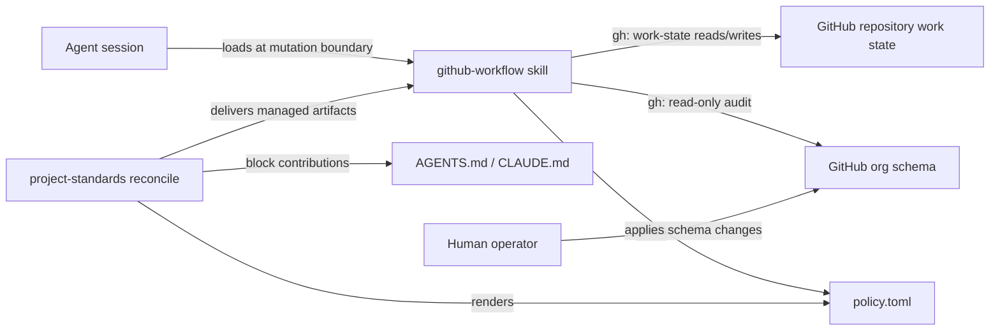
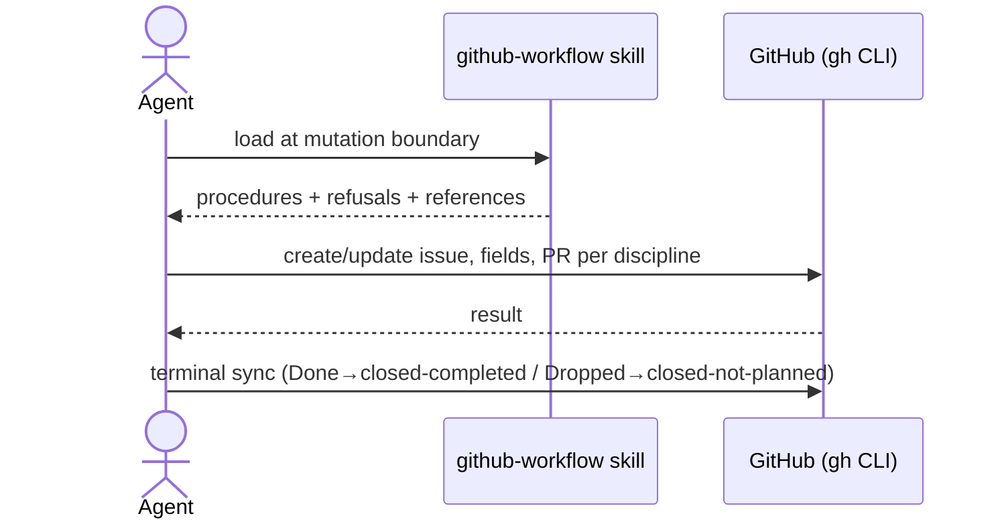

# GitHub Workflow Standard Package — Specification (Standard)

## Revision History

| Version | Date | Author | Change |
| --- | --- | --- | --- |
| 0.1 | 2026-08-06 | Claude with owner-approved design input | Initial draft from the approved github-workflow package design brief. |
| 0.2 | 2026-08-06 | Claude with owner directive | Skill tooling is Go (design D7): the org audit ships as a committed, reproducibly built linux/amd64 `gh-workflow-audit` binary the skill invokes. Adds FR-015/FR-016, NFR-005, IR-004, C-006, WH-006, D-008, EC-006, ERR-005; reworks FR-008, AW-001, OQ-002. |

**Spec lifecycle:** This document is **living until `approved`**, then **change-controlled**: post-approval edits require a new revision row and, for scope-affecting changes, re-approval by the owner. Implementation deviations are recorded in the [Deviations Log](#deviations-log), not silently patched into requirements. When replaced, set `status: superseded` and `superseded_by:` in the frontmatter.

**Normative precedence:** For Catalog 5 package anatomy, configuration, version selection, adoption, reconciliation, and lifecycle mechanics, [SPEC-CP01](2026-07-10-consumer-standards-control-plane-spec.md), [SPEC-BA02](2026-07-10-standard-bundle-authoring-v2-spec.md), [ADR 0023](../adr/adr-0023-unified-consumer-standards-control-plane.md), and [ADR 0024](../adr/adr-0024-catalog-scoped-package-version-channels.md) take precedence over any conflicting mechanics below. The GitHub operating model itself — Issue Types, Issue Fields, lifecycle, invariants, adoption phases — is defined by the preserved design input, [GitHub Repository Administration Standard (preliminary)](archive/2026-08-06-github-repo-administration-preliminary-design.md); this specification packages that model without redefining it.

---

## 1. Purpose & Background

L3DigitalNet repositories use GitHub as the durable control plane for local-agent development: Issues are authorized work contracts, seven organization-level Issue Fields carry typed operational metadata, pull requests are execution evidence, and deterministic mechanisms — not model judgment — enforce policy. That operating model currently exists only as an advice-style document. Nothing delivers it into a repository, keeps it versioned, or binds agent sessions to its discipline.

This specification defines `github-workflow`, a new Catalog 5 consumer package that delivers the operating model's adoption phases 1–2 (canonical work model plus manual operation) to organization-owned consumer repositories. The package ships a mandatory skill as its behavioral core, a compact invariant-bearing instruction block for agent harnesses, versioned reference material including the organization-level Issue Field schema, and the standard provider set for validation, drift detection, and upgrade.

After successful implementation, any agent session in a consuming repository loads the same discipline before touching GitHub work state, the organization schema has one versioned in-repo representation that agents can audit against live GitHub state, and the whole contract upgrades through the ordinary reconcile lifecycle. The first release deliberately excludes enforcement automation, dispatch coordination, and unattended execution; the package must remain fully functional without them, and later phases must be addable as additive versions.

---

## 2. Scope

### 2.1 In Scope

- An adoptable `standards/github-workflow/` package family at payload version `1.0` under the Standard Bundle Authoring 2.6 contract.
- A mandatory repo-local skill at `.agents/skills/github-workflow/` with a Codex companion and five on-demand reference files.
- A machine-readable organization-schema reference (`org-schema.yaml`) and a skill-driven audit over live organization state.
- A compiled Go audit tool, `gh-workflow-audit` (linux/amd64), shipped as a managed artifact and invoked by the skill under the operator's `gh` authentication.
- Managed markdown-block contributions to `AGENTS.md` and `CLAUDE.md` carrying the skill mandate and standing invariants.
- A rendered per-consumer `policy.toml` under `.standards/packages/github-workflow/`.
- A two-option consumer configuration schema (`organization`, `harnesses`).
- Providers: `render-semantic`, `validate`, `verify`, `drift-check`, `upgrade`.
- Catalog, graph, agent-summary, and package-contract test integration required of every Catalog 5 family.

### 2.2 Out of Scope (Non-Goals — never)

| ID | Non-Goal | Reason |
| --- | --- | --- |
| NG-001 | Agent-performed mutation of organization-level Issue Fields, Issue Types, or other organization schema. | Org schema changes are human-applied by design; the skill audits and reports only. |
| NG-002 | Network access from any provider. | Providers run offline and deterministically inside the reconcile transaction; the online audit lives exclusively in the skill. |
| NG-003 | Duplicating native GitHub relationships or derivable facts as package configuration or consumer metadata (area labels, parent links, PR URLs, completion dates, agent-ready flags). | The design input's derived-state rule: store decisions and irreducible facts; derive consequences. |
| NG-004 | Encoding model or agent identity in work semantics (fields, config, or block content). | Worker identity is execution metadata; model routing changes must not touch the durable work contract. |
| NG-005 | Personal-account repository support or degraded no-fields fallback modes. | Organization-level Issue Fields do not exist on personal accounts; all repositories are migrating to the organization. |
| NG-006 | Merge gating, required-check manipulation, or any mechanism letting the package bypass or weaken repository enforcement boundaries. | Enforcement is deterministic GitHub policy territory; an implementation agent must not control the mechanisms judging its own work. |

### 2.3 Won't Have in v1 (deferred — not never)

| ID | Deferred Capability | Why Deferred | Revisit When |
| --- | --- | --- | --- |
| WH-001 | GitHub Issue Forms delivery under `.github/ISSUE_TEMPLATE/`. | Forms cannot populate Issue Fields; `.github/` is consumer-owned; agents author most issues through the skill. | Human web-UI issue capture becomes routine. |
| WH-002 | Phase-3 deterministic invariant enforcement (Actions checks, rulesets guidance as shipped artifacts). | The design input defers enforcement until the data model is proven by manual operation. | Operating experience under phases 1–2 shows stable semantics and repeated invariant violations worth automating. |
| WH-003 | A `migrate` provider and legacy signatures. | No legacy predecessor exists for this package. | Legacy label-based approximations are discovered in consumer repositories. |
| WH-004 | Multi-organization support (`organization` as a list). | Exactly one organization exists today. | A second organization appears; the change is additive. |
| WH-005 | Coordinator, claiming, and unattended dispatch machinery (design-input phases 4–5). | Phases 1–2 must prove the model manually first. | The owner authorizes the coordinator program separately. |
| WH-006 | Audit-tool binaries for platforms beyond linux/amd64. | Every current consumer is linux/amd64; additional platforms multiply payload size with no consumer. | A non-linux/amd64 consumer appears. |

### 2.4 Boundaries

| Boundary | Description |
| --- | --- |
| System owns | The `github-workflow` package family: manifest, payloads, skill and reference artifacts, block contributions, rendered policy, config schema, providers, capabilities, catalog data, and package tests. |
| System depends on | The `project-standards` control plane (reconcile, providers, catalog), the consumer repository filesystem, the `gh` CLI with the operator's existing authentication for skill-driven reads, and GitHub organization-level Issue Fields (GA July 2026). |
| System does not own | Live GitHub organization or repository state; consumer-owned `.github/` content; unmarked content in `AGENTS.md`/`CLAUDE.md`; repository rulesets and branch protection; credentials; the operating-model text itself beyond packaging it. |

---

## 3. Context

### 3.1 Current State

The GitHub Repository Administration Standard exists as a preserved advice-style document in this repository's archive. No package delivers it; consumer repositories have no versioned linkage to the operating model, no skill binds agent sessions to its discipline, and the organization-level Issue Field schema has no in-repo representation to audit against. Catalog 5 has seven consumer packages; the closest structural precedent is `agent-handoff` 1.9, which established the managed-skill, harness-gated-contribution, rendered-policy, and provider patterns this package reuses. Bug 006 is open: create-only artifacts cannot reach existing consumers and are invisible to drift-check.

### 3.2 Target State

A consumer selects `github-workflow` in `.standards/config.toml` with its organization and harnesses, reconciles, and receives only managed repository-local artifacts:

```text
consumer-repo/
├── AGENTS.md                          # consumer-owned; bounded github-workflow block (codex)
├── CLAUDE.md                          # consumer-owned; bounded github-workflow block (claude-code)
├── .agents/skills/github-workflow/
│   ├── SKILL.md                       # decision procedures, refusals, trigger boundary
│   ├── agents/openai.yaml             # Codex companion
│   ├── references/
│       ├── field-vocabulary.md        # seven fields, values, pinning, fields-not-to-create
│       ├── org-schema.yaml            # machine-readable org baseline for the audit
│       ├── issue-structure.md         # canonical issue body headings + five Issue Types
│       ├── pr-standard.md             # PR content standard + draft-PR policy
│       └── review-checklist.md        # layered review checklist (discipline only)
│   └── bin/
│       └── gh-workflow-audit          # compiled Go audit tool (linux/amd64)
└── .standards/packages/github-workflow/
    └── policy.toml                    # rendered consumer configuration
```

Agent sessions load the skill before creating or mutating GitHub work state. The skill audits live organization schema against `org-schema.yaml` on request and reports drift for human action.

### 3.3 Assumptions

| ID | Assumption | Impact if False |
| --- | --- | --- |
| A-001 | The GitHub organization-level Issue Fields GA API/MCP surface is stable enough to pin the skill's audit procedure against. | The skill's audit reference needs a version note and command correction in a payload revision; the package contract is unaffected. |
| A-002 | All consuming repositories are (or are becoming) organization-owned. | A personal-account consumer would adopt a package whose field discipline cannot apply; adoption guidance must repeat the org-only boundary. |

### 3.4 Constraints

| ID | Constraint | Source |
| --- | --- | --- |
| C-001 | The package is authored under Standard Bundle Authoring 2.6: immutable digest-pinned payload versions, schema 1.0 payloads, graph/catalog integration, and agent-summary limits. | SPEC-BA02; repository release contract. |
| C-002 | Providers execute offline with no network access. | Reconcile transaction model (SPEC-CP01); design decision D6. |
| C-003 | The published payload is organization-agnostic; the organization login enters only through consumer configuration. | Design decision D3/D4. |
| C-004 | The operating model must function on GitHub Free organization plans. | Design input section 1.3. |
| C-005 | Every delivered artifact uses `policy = "managed"`; no create-only artifacts. | Design decision D2; bug 006. |
| C-006 | Any executable shipped with the skill is implemented in Go and delivered as a committed, digest-pinned, reproducibly built per-platform binary; v1.0 ships linux/amd64 only. | Owner directive 2026-08-06; design decision D7; ADR 0027 Go lane. |

---

## 4. Goals

| ID | Goal | Success Signal | Achieved By |
| --- | --- | --- | --- |
| G-001 | Any agent session in a consuming repository applies one consistent GitHub work discipline. | Skill loads on work-state mutation; block invariants present in every harness context. | FR-001–FR-007, FR-010 |
| G-002 | The organization schema has one versioned, auditable in-repo representation. | Skill audit compares `org-schema.yaml` to live state and reports drift without mutating. | FR-008, FR-009, FR-015, FR-016, DR-001 |
| G-003 | The package upgrades and drift-checks like every other Catalog 5 family. | `reconcile`, `drift-check`, and `upgrade` cover all delivered artifacts. | FR-011–FR-014, C-005 |
| G-004 | Later adoption phases remain additive. | Phase-3+ capability lands as new payload versions without breaking v1 consumers. | WH-002, WH-005, D-007 |

---

> **§5 (Stakeholders and Users) is Full-tier** and is intentionally omitted at the Standard profile.

## 6. Glossary

| Term | Definition | Notes / Not to be confused with |
| --- | --- | --- |
| Operating model | The GitHub Repository Administration Standard defined by the preserved design input: object model, Issue Types, Issue Fields, lifecycle, invariants. | Not redefined by this spec; this spec packages it. |
| Issue Field | A typed organization-level metadata field attached to Issues (GA July 2026), distinct from Project-local fields. | Not a label; not a Project column. |
| Org schema | The baseline set of Issue Types and Issue Fields the organization is expected to carry, represented in `org-schema.yaml`. | Live GitHub state is the audit subject, never package-owned. |
| Work state | GitHub issues, issue field values, PRs, lifecycle transitions, and milestones in a consumer repository. | Read-only queries are not work-state mutation. |
| Skill mandate | The rule that agents load the `github-workflow` skill before creating or mutating work state or performing triage or an org audit. | Delivered by the managed block; the block also binds invariants independently. |
| Standing invariants | The block-carried subset of the operating model's invariants that bind even when the skill was never loaded: never infer readiness (design-input invariant 5); no `Execution mode` self-promotion plus the human-applied org-schema rule (invariant 6); a nontrivial PR links its governing Issue (invariant 8); terminal-state synchronization (invariants 10 and 11); durable follow-up work becomes an Issue (invariant 15). | Numbering follows the design input's invariant list (its section 34). |
| Managed artifact | A package-delivered file the control plane owns, upgrades, and drift-checks. | Distinct from create-only seeds, which this package never uses (C-005). |
| Audit | The read-only comparison of live organization schema to `org-schema.yaml`, executed by the packaged `gh-workflow-audit` Go tool under the operator's `gh` authentication, producing findings for human action. | Never a provider; never a mutation. |

---

## 7. Requirements

### 7.1 Functional Requirements

| ID | Requirement | Rationale | Acceptance Criteria | Priority |
| --- | --- | --- | --- | --- |
| FR-001 | The package shall deliver a skill at `.agents/skills/github-workflow/SKILL.md` whose instructions cover Issue Type selection, Issue Field discipline, issue body structure, PR standard, lifecycle transitions, refusal rules, and when to consult each reference file. | The skill is the mandatory behavioral core (design D1). | Skill artifact present after reconcile; instructions cover each listed area; package tests assert artifact digest. | Must |
| FR-002 | The skill shall declare its trigger boundary: load before creating or mutating work state (issues, issue field values, PRs, lifecycle transitions, milestones) or performing triage or an org audit; plain read-only queries are exempt. | Bounds context cost while making mutation discipline unavoidable (design D1). | SKILL.md states the boundary and the read-only exemption verbatim in its trigger description. | Must |
| FR-003 | The package shall deliver a Codex skill companion at `.agents/skills/github-workflow/agents/openai.yaml` when `harnesses` contains `codex`. | Harness parity per the agent-handoff precedent. | Artifact present iff `codex` selected; gated by the same condition as the AGENTS.md contribution. | Must |
| FR-004 | The package shall deliver the five reference files (`field-vocabulary.md`, `org-schema.yaml`, `issue-structure.md`, `pr-standard.md`, `review-checklist.md`) under `.agents/skills/github-workflow/references/`. | Progressive disclosure keeps SKILL.md compact (design D1/D2). | All five present after reconcile with pinned digests; SKILL.md references each by relative path. | Must |
| FR-005 | `field-vocabulary.md` shall reproduce the operating model's seven Issue Fields with their exact value sets, the field-pinning matrix, and the fields-not-to-create list. | Agents need the authoritative vocabulary without loading the full operating model. | Content matches the design input's field definitions (sections 6–13) and fields-not-to-create list (section 29) value-for-value. | Must |
| FR-006 | `issue-structure.md` shall reproduce the five Issue Types and the canonical issue body headings; `pr-standard.md` shall reproduce the PR content standard and draft-PR policy; `review-checklist.md` shall reproduce the layered review checklist with an explicit no-automation statement. | Reference fidelity to the operating model (design D1). | Content matches the design input sections 4, 16, and 21–23; review-checklist.md states it gates nothing. | Must |
| FR-007 | The package shall contribute a bounded markdown block to `CLAUDE.md` when `harnesses` contains `claude-code` and to `AGENTS.md` when `harnesses` contains `codex`, containing the skill mandate, the standing invariants, and the configured organization name. | The block is the always-loaded defense (design D3). | Blocks render from config via `render-semantic`; both contain the five standing invariants enumerated in the Glossary in agent-directive phrasing; block body stays within approximately 12 content lines. | Must |
| FR-008 | The skill shall direct the org-schema audit through the packaged `gh-workflow-audit` tool, which compares live organization Issue Types and Issue Fields to `org-schema.yaml` read-only and reports matches, missing elements, value mismatches, and extras. | Versioned schema linkage with human-applied changes (design D0/D7). | Skill documents invoking the tool; the audit produces findings without any mutating call; the skill explicitly instructs agents to hand findings to a human. | Must |
| FR-009 | The skill shall refuse — and instruct agents to refuse — organization-schema mutation, `Execution mode` self-promotion, readiness inference from open state alone, and enforcement bypass. | The refusal set is the package's safety boundary (NG-001, NG-006; design D1). | Each refusal stated imperatively in SKILL.md; refusals mirrored in the block where they are standing invariants. | Must |
| FR-010 | The package shall render `.standards/packages/github-workflow/policy.toml` from consumer configuration, carrying at minimum the organization login, for the skill to read at runtime. | The skill needs deterministic access to consumer config without parsing `.standards/config.toml` (agent-handoff precedent). | `policy.toml` present after reconcile; contains the configured organization; skill documents reading it. | Must |
| FR-011 | Every delivered artifact shall use `policy = "managed"`. | Upgradeability and drift visibility; zero bug-006 exposure (C-005). | Payload contains no create-only artifact entries. | Must |
| FR-012 | The package shall implement providers `render-semantic`, `validate`, `verify`, `drift-check`, and `upgrade`, and no `scaffold` or `migrate` provider. | Standard managed-artifact integrity without unneeded machinery (design D6). | Provider table matches; validate/verify/drift-check cover all managed artifacts; no network access in any provider. | Must |
| FR-013 | The package shall declare capabilities `github-workflow.audit`, `github-workflow.validate`, and `github-workflow.drift-check`, and relations `companions = ["agent-handoff"]`, `extends = []`, `conflicts = []`. | Catalog integration and declared affinity (design D5). | `payload.toml` capability and relation entries match; graph validation passes. | Must |
| FR-014 | The package shall ship the standard family documentation set: `README.md` (canonical standard), `adopt.md`, and `agent-summary.md` within the repository's agent-summary size limit. | Every Catalog 5 family carries these resources (C-001). | Resources present with payload digests; agent-summary byte limit enforced by existing repository tests. | Must |
| FR-015 | The package shall deliver `gh-workflow-audit` as a managed artifact at `.agents/skills/github-workflow/bin/gh-workflow-audit` with mode `0755`, compiled for linux/amd64 from repository Go source. | Owner-directed Go tooling with zero consumer toolchain requirement (design D7). | Artifact present with pinned digest and executable mode after reconcile; binary is statically linked (`CGO_ENABLED=0`). | Must |
| FR-016 | The audit tool shall read the baseline from `org-schema.yaml` and the organization from `policy.toml`, query live organization schema read-only under the operator's existing `gh` authentication, emit a deterministic findings report distinguishing matches, missing elements, value mismatches, and extras, and exit nonzero on unmet preconditions (missing auth, unreachable API, unsupported platform) without emitting a partial report. | The audit must be trustworthy without human re-derivation (design D7). | Offline fixture-driven tests cover every finding class and precondition failure; a recorded manual run against the live organization is implementation evidence. | Must |

### 7.2 Non-Functional Requirements

| ID | Category | Requirement | Measurement / Acceptance Criteria | Priority |
| --- | --- | --- | --- | --- |
| NFR-001 | Compatibility | The payload shall be organization-agnostic: no organization login, repository name, or environment-specific value appears in any packaged artifact source. | Grep of payload sources finds no hardcoded organization; org values appear only in rendered consumer outputs. | Must |
| NFR-002 | Maintainability | Package version `1.0` shall be immutable once released; every content change ships as a new digest-pinned payload version. | Repository payload-immutability tests pass for the new family. | Must |
| NFR-003 | Usability | The managed block shall stay compact enough that non-GitHub sessions pay negligible context cost. | Block content body approximately 12 lines; no field vocabulary or body-structure detail inline. | Should |
| NFR-004 | Reliability | Reconcile, drift-check, and upgrade over the package shall behave deterministically with no network dependency. | Package tests run fully offline; no provider imports a network client. | Must |
| NFR-005 | Reproducibility | The audit-tool binary shall be reproducibly buildable from repository Go source with `CGO_ENABLED=0`, `-trimpath`, and the toolchain pinned by `go.mod`. | An independent documented rebuild yields the committed bytes; verified in the repository gate or release evidence. | Must |

### 7.3 Interface Requirements

| ID | Interface | Requirement | Contract / Format | Acceptance Criteria |
| --- | --- | --- | --- | --- |
| IR-001 | Consumer configuration | The config schema shall accept exactly two options: `organization` (string, required, nonempty) and `harnesses` (array of `claude-code` \| `codex`, required, nonempty). | `config.schema.json` per SPEC-BA02. | Schema validation rejects missing/unknown options and empty values; package tests cover accept and reject cases. |
| IR-002 | `gh` CLI | The skill's audit and work-state procedures shall use `gh` (CLI or its API subcommands) under the operator's existing authentication, and shall not embed or request credentials. | Documented commands in SKILL.md and references. | No credential material in any artifact; commands runnable with a standard authenticated `gh`. |
| IR-003 | Managed block | Block contributions shall use the control plane's markdown-block adapter with scope `block:github-workflow` in both `AGENTS.md` and `CLAUDE.md`. | SPEC-CP01 contribution contract. | Reconcile round-trips the block; consumer-owned surrounding content untouched. |
| IR-004 | `gh-workflow-audit` CLI | The tool shall run non-interactively, support human-readable and JSON findings modes, and require no arguments for the default audit, resolving `org-schema.yaml` and `policy.toml` from their delivered locations. | Exact flag surface recorded in the skill references (OQ-002). | Tool runs from a consumer checkout with an authenticated `gh` and produces findings in both modes. |

### 7.4 Data Requirements

| ID | Data Entity | Requirement | Validation Rules | Ownership |
| --- | --- | --- | --- | --- |
| DR-001 | `org-schema.yaml` | The package shall represent the baseline org schema in YAML: five Issue Types and seven Issue Fields with types and exact value lists, matching the operating model's baseline schema. | Parses as YAML; content equals the design input's baseline schema (its section 35); covered by an artifact digest. | Package-owned reference; live org state is the audit subject and is never package-owned. |
| DR-002 | `policy.toml` | The rendered policy shall carry the configured organization login and the package version, and shall contain only values derivable from consumer configuration and the payload. | Valid TOML; regenerated deterministically by `render-semantic`. | Control-plane-managed consumer artifact. |

---

## 8. Architecture and Design

### 8.1 Architecture Summary

The package is a standard Catalog 5 family with one architectural novelty: its subject is external mutable state (GitHub) rather than repository files. The design resolves that by splitting responsibilities across three planes. The **reconcile plane** stays entirely conventional — managed artifacts, harness-gated block contributions, rendered policy, and offline providers, all identical in mechanics to the `agent-handoff` precedent. The **session plane** is the skill: agents load it at the mutation boundary and it carries every judgment-requiring procedure, including all `gh` interaction. The **organization plane** is deliberately out of agent reach: the packaged `org-schema.yaml` gives the org schema a versioned identity, the skill audits live state against it read-only, and humans apply changes. The two decisions that most shaped the design are the all-managed artifact policy (D-002, eliminating bug-006 exposure entirely) and the offline-provider rule (D-006, keeping the reconcile transaction deterministic by exiling all network work to the skill).

### 8.2 Architecture Views

#### 8.2.1 Context View



#### 8.2.3 Component View

| Component | Responsibility | Interfaces | Notes |
| --- | --- | --- | --- |
| `SKILL.md` + `openai.yaml` | Decision procedures, refusals, trigger boundary, audit procedure | Skill loading; `gh` | The only component permitted network interaction, via the operator's `gh`. |
| `references/*` (5 files) | Authoritative vocabulary, org schema, body/PR/review structures | Read by skill on demand | Content fidelity to the operating model is a Must requirement (FR-005/006, DR-001). |
| `bin/gh-workflow-audit` | Deterministic read-only org-schema audit | CLI; operator `gh` auth; YAML/TOML inputs | Static Go binary, linux/amd64, reproducibly built (NFR-005); the only skill component that touches the network, and only in sessions. |
| Block contributions | Skill mandate + standing invariants in every harness context | markdown-block adapter | Harness-gated; org name rendered from config. |
| `policy.toml` | Runtime consumer configuration for the skill | TOML read | Rendered by `render-semantic`. |
| Providers | Render, validate, verify, drift-check, upgrade | Control-plane provider contract | Offline only (NG-002). |
| `config.schema.json` | Two-option consumer configuration contract | SPEC-BA02 config validation | Additions are additive minors. |

> §8.2.2 (Container / Deployment View) is omitted: the package has no deployable services; delivery mechanics are the control plane's (SPEC-CP01).

### 8.3 Design Decisions

| ID | Decision | Rationale | Alternatives Considered | ADR |
| --- | --- | --- | --- | --- |
| D-001 | One mandatory skill with a mutation-boundary trigger and five on-demand reference files. | Single mandatory-skill story; progressive disclosure guards size. | Two skills (fuzzy triage/admin boundary); narrow skill + fat block (context tax). | design brief D1 |
| D-002 | All artifacts managed; no create-only; no `.github/` delivery; Issue Forms deferred. | Upgradeable, drift-visible, zero bug-006 exposure; forms cannot populate fields. | Managed forms now; create-only seed form. | design brief D2 |
| D-003 | Block carries skill mandate plus standing invariants (design-input invariants 5, 6, 8, 10, 11, 15) with config-rendered org name. | Exactly the expensive-to-violate rules survive a skipped skill load. | Pointer-only block; full inline summary. | design brief D3 |
| D-004 | Config is exactly `organization` + `harnesses`. | Every option is permanent contract surface; GitHub-native state is not duplicated. | Area-label, type-subset, project, field-customization options. | design brief D4 |
| D-005 | `companions = ["agent-handoff"]`; no dependencies. | Real session-closeout affinity without hidden coupling. | No declared relation. | design brief D5 |
| D-006 | Org audit is skill-driven via `gh`; providers stay offline; no scaffold/migrate. | Preserves deterministic reconcile; no legacy predecessor exists. | Network-capable audit provider. | design brief D6 |
| D-007 | v1.0 packages operating-model phases 1–2 only; later phases arrive as additive payload versions. | The data model must prove itself in manual operation before enforcement automation. | Shipping phase-3 checks now. | design brief D0 |
| D-008 | Skill executables are Go; the audit ships as a committed, reproducibly built linux/amd64 binary. | Deterministic, testable audit; zero consumer toolchain; ADR 0027 Go lane. | Source-shipped local build (agent-recommended, not selected); `go install` channel (network dependency, second version channel). | design brief D7 |

### 8.5 Design Constraints

- Follow SPEC-BA02 payload anatomy exactly; do not introduce novel artifact policies or provider kinds for this package.
- Keep every operating-model reproduction (FR-005/006, DR-001) faithful to the preserved design input; divergences are deviations, not editorial improvements.
- Keep the skill's `gh` usage read-only for anything organization-scoped.
- Implement any skill-shipped executable in Go under the repository Go lane; never ship interpreted scripts with the skill (C-006).
- Do not let SKILL.md grow procedures that belong in references; the block must not grow vocabulary that belongs in references.

> **§8.4 (Solution Alternatives Considered) and §8.6 (Dependency Policy) are Full-tier** and are intentionally omitted at the Standard profile.

---

## 9. Data Model

The package persists no consumer data beyond its managed artifacts. The two structured artifacts are contract-bearing:

- **`org-schema.yaml`** (DR-001): top-level `issue_types` (list of five names) and `issue_fields` (map of seven fields, each with `type` and, for single-selects, exact `values` lists), matching the operating model's baseline schema section byte-for-meaning. It exists so audits compare against a versioned artifact rather than prose. Extension fields are not pre-modeled; schema growth ships as new payload versions.
- **`policy.toml`** (DR-002): `organization` login and package version, rendered from consumer configuration. No history, no derived state.

Live GitHub state is never modeled or cached by the package; the audit reads it fresh each run.

---

## 10. Behavior and Workflows

### 10.1 Primary Workflow

Agent session mutating work state in a consuming repository:



Steps:

1. Agent determines the action touches work state (creation, mutation, triage, or audit) and loads the skill.
2. Agent selects the Issue Type and populates fields per `field-vocabulary.md`; authors bodies per `issue-structure.md`.
3. Agent applies PR discipline per `pr-standard.md`; links the governing Issue for nontrivial PRs.
4. Agent keeps `Workflow` transitions legal and terminal states synchronized with GitHub close reasons.
5. Discovered durable follow-up work becomes an Issue before the session ends.

Expected result:

> Work state changes conform to the operating model without any enforcement automation having run.

### 10.2 Alternate Workflows

| ID | Trigger | Behavior | Expected Result |
| --- | --- | --- | --- |
| AW-001 | Operator requests an org-schema audit. | Skill invokes `gh-workflow-audit`, which compares live Issue Types/Fields against `org-schema.yaml` read-only and classifies matches, missing, mismatched values, extras. | Findings report handed to the human; no mutation. |
| AW-002 | Agent performs triage on captured issues. | Skill-guided: assign Type, recommend Priority/Size/Change risk/Severity per vocabulary; flag missing acceptance criteria as `Needs definition`. | Issues carry canonical metadata or are explicitly parked. |
| AW-003 | Read-only query (`gh issue view`, `gh pr list`, searches). | No skill load required. | Zero added context cost for reads. |

### 10.3 Edge Cases

| ID | Edge Case | Expected Behavior |
| --- | --- | --- |
| EC-001 | Live org lacks a baseline field or value (audit mismatch). | Audit reports drift; agent proceeds using only fields that exist, notes the gap in findings; never creates org fields. |
| EC-002 | An issue is reopened after `Done`/`Dropped`. | Skill directs returning `Workflow` to a valid nonterminal state in the same action. |
| EC-003 | Issue sized `XL` is a dispatch candidate. | Skill refuses direct implementation and directs decomposition into sub-issues. |
| EC-004 | `gh` unauthenticated or network unavailable during audit. | Audit aborts with a clear finding; no partial report presented as complete. |
| EC-005 | Consumer selects only one harness. | Only that harness's block and companion artifacts are delivered; reconcile remains clean. |
| EC-006 | Audit tool missing or invoked on an unsupported platform. | Tool or skill reports the precondition failure distinctly; the agent surfaces the gap instead of improvising `gh` mutations; reconcile repair restores a damaged binary. |

### 10.4 State Transitions

The operating model's `Workflow` field lifecycle (Inbox → Needs definition/Ready → In progress → In review → Done, with Blocked and Dropped branches) is defined authoritatively in the design input sections 6 and 18 and reproduced for agents in `field-vocabulary.md`. This specification binds only the package-enforced discipline over it: transitions agents perform must be legal per that lifecycle, and terminal synchronization (design-input invariants 10 and 11) is a standing invariant in the managed block.

---

## 11. UI Pages / API Endpoints

Deleted: the package exposes no UI and no API surface of its own; its interfaces are the skill, `gh`, and control-plane contracts covered in §7.3.

---

## 12. Error Handling and Recovery

### 12.1 Expected Failures

| ID | Failure Mode | User/System Behavior | Logging / Observability | Recovery |
| --- | --- | --- | --- | --- |
| ERR-001 | Audit cannot reach GitHub or `gh` is unauthenticated. | Audit aborts; skill reports the precondition failure. | Finding in the session report. | Operator authenticates or retries; no state to repair. |
| ERR-002 | Managed artifact drift (edited skill or reference). | `drift-check` reports; `reconcile` repairs to payload content. | Control-plane findings. | Standard reconcile repair. |
| ERR-003 | Invalid consumer configuration (unknown org value shape, empty harnesses). | Config schema validation rejects before any artifact change. | Control-plane validation errors. | Consumer corrects `.standards/config.toml`. |
| ERR-004 | Agent attempts a refused operation (org mutation, Execution-mode self-promotion). | Skill directive: refuse and surface to the human. | Session report. | Human decides; no automated path exists by design. |
| ERR-005 | Audit binary missing, corrupted, or wrong platform. | Tool exits nonzero with a precondition message; no partial findings. | `drift-check` flags the digest mismatch. | `reconcile` repair restores the pinned binary. |

### 12.2 Retry and Idempotency

- Retried operations: none are package-owned; `gh` calls follow the operator's normal retry judgment in-session.
- Non-retried operations: audits abort on precondition failure rather than retrying (EC-004).
- Idempotency: reconcile and `render-semantic` are deterministic; repeated runs converge on identical artifacts.

### 12.3 Rollback / Recovery

The package holds no state requiring rollback. Artifact damage recovers via reconcile repair; a bad payload release recovers via the repository's standard version-rollback lifecycle (select the prior payload version). Work-state mistakes in GitHub (wrong field, wrong close reason) are corrected through the same skill discipline that made them — the operating model treats GitHub as the durable record, so corrections are ordinary transitions, not restores.

---

## 13. Security and Privacy

### 13.1 Authentication

The skill uses the operator's existing `gh` authentication. The package ships, requests, and stores no credentials.

### 13.2 Authorization

| Actor / Role | Allowed Actions | Denied Actions |
| --- | --- | --- |
| Agent (via skill) | Repository work-state reads and writes; read-only org-schema audit; issue field value updates. | Org schema mutation; `Execution mode` self-promotion; enforcement bypass; readiness inference. |
| Human operator | Everything above plus org schema changes and refusal-case decisions. | — |

### 13.3 Secrets

None. `policy.toml` and all artifacts carry configuration references only; the credential boundary is `gh`'s own storage, outside the package.

### 13.4 Sensitive Data

None handled: package artifacts are public-safe standard content plus the organization login, which is public by nature.

### 13.5 Threats and Mitigations

| Threat | Impact | Mitigation |
| --- | --- | --- |
| Issue/PR content treated as instructions (prompt injection via work items). | Agent executes attacker-authored directives. | Skill directs treating GitHub content as untrusted data; refusal rules are non-overridable by work-item text. |
| Agent self-expands authority (org mutation, mode promotion). | Control-plane integrity loss. | Refusals in skill and standing invariants in block (FR-009); org plane human-only (NG-001). |
| Delivered artifact tampering in a consumer. | Discipline silently weakened. | All-managed artifacts under digest drift-check (FR-011, ERR-002). |
| Committed audit binary diverges from its Go source (supply-chain drift). | Unreviewable behavior ships to consumers. | Reproducible-build verification (NFR-005) plus payload digest pinning; an independent rebuild must match the committed bytes. |

### 13.6 Hardening Checklist

- [x] Sensitive-data redaction in logs — nothing sensitive handled; audit output contains schema names only.
- [x] CI/CD secret handling — no secrets exist in the package (§13.3).
- [ ] Cookie/session settings — N/A: no web surface.
- [ ] CSRF/CORS, webhook signatures, network exposure, identity headers, non-root runtime — N/A: no service runtime; the only executable surface is control-plane providers running offline.

---

> **Sections §14 (Capacity and Scale Assumptions), §15 (Risks), and §16 (Compliance, Licensing, and Data Rights) are Full-tier** and are intentionally omitted at the Standard profile.

## 17. Testing and Acceptance

### 17.1 Definition of Done

- [ ] All **Must** requirements implemented; acceptance criteria pass.
- [ ] Automated tests cover required behavior, error cases, and edge cases.
- [ ] Traceability matrix (§17.3) complete — every Must/Should requirement maps to a passing verification.
- [ ] Documentation deliverables (§18.7) produced.
- [ ] Security-sensitive behavior reviewed; hardening checklist (§13.6) resolved.
- [ ] Deviations Log reviewed and accepted by owner.
- [ ] No known blocking defects.

### 17.2 Test Strategy

| Layer | Scope | Required Coverage | Required? |
| --- | --- | --- | --- |
| Unit / domain | Config schema accept/reject; provider render determinism; policy rendering | Both config options, unknown-option rejection, empty-value rejection | Yes |
| Integration / adapter | Reconcile delivery, block round-trip, drift repair, upgrade | Full artifact set per harness selection; EC-005 | Yes |
| Snapshot / contract | Payload digests, artifact content fidelity (FR-005/006, DR-001), agent-summary limit | Existing package-contract test patterns extended to the new family | Yes |
| Database | — | N/A: no datastore | No |
| End-to-end | Dogfood composition fixture with the new package selected | Reconcile from clean fixture to target tree | Yes |
| Security | Refusal text presence; no credential material; no network imports in providers | FR-009, NFR-004 assertions | Yes |
| Go audit tool | Finding classification, precondition failures, JSON/human output | Offline fixture-driven tests via the repository Go gate (`make go-check`); reproducible-build check (NFR-005) | Yes |
| Regression | Bug-006 guard: zero create-only artifacts in this family | Payload scan test | Yes |

The audit tool's live behavior is verified by a documented manual run against the real organization (recorded as implementation evidence); its comparison logic is tested offline with fixtures, never by networked CI tests (NFR-004).

### 17.3 Requirement-to-Test Traceability

| Requirement ID | Test / Verification Method | Status |
| --- | --- | --- |
| FR-001–FR-016 | To be completed by the implementer per Appendix B.3 | Not Started |
| NFR-001–NFR-005 | To be completed by the implementer per Appendix B.3 | Not Started |
| IR-001–IR-004, DR-001–DR-002 | To be completed by the implementer per Appendix B.3 | Not Started |

---

## 18. Deployment and Operations

### 18.1 Runtime Environment

| Item | Value |
| --- | --- |
| Runtime | The `project-standards` control plane (Python) for delivery; `gh` CLI plus the static Go audit binary in agent sessions (no consumer Go toolchain) |
| OS / Platform | Consumer repository working trees; no service runtime |
| Datastore | None |
| External services | GitHub (skill-only, via `gh`) |
| Scheduling | None |
| Hosting | Distributed inside the `project-standards` release |

### 18.2 Configuration

| Setting | Required? | Default | Description |
| --- | --- | --- | --- |
| `organization` | Yes | — | GitHub organization login; rendered into the block and `policy.toml`; audit target. |
| `harnesses` | Yes | — | Any of `claude-code`, `codex`; gates block contributions and the Codex companion. |

Environment matrix: not applicable — one delivery environment (the consumer repository); no per-environment variance exists.

### 18.3 Deployment Flow

1. Trigger: inclusion in a `project-standards` release train (placement decided by the owner; after v5.17.0).
2. CI checks: the repository's standard gate (validators, package-contract tests, coherence, markdown gates) plus the Go gate for the audit tool.
3. Release per the repository release contract; consumers adopt by selecting the package and reconciling.
4. Rollback: consumers reselect the prior payload version; the control plane repairs artifacts.

> **§18.4 (Rollout Controls) is Full-tier** and is intentionally omitted at the Standard profile.

### 18.5 Observability

Control-plane findings (validate/verify/drift-check) are the operational signal for delivered artifacts; skill session reports carry audit findings. No services, metrics, or alerts exist — the alerting table is not applicable to a file-delivery package.

### 18.6 Backup and Disaster Recovery

Deleted: the package owns no durable data; every delivered artifact regenerates from the immutable payload.

### 18.7 Documentation Deliverables

- [ ] Family `README.md`, `adopt.md`, `agent-summary.md` shipped in the payload (FR-014).
- [ ] `standards/catalog.md` and index/graph data updated.
- [ ] Repository handoff docs updated per convention at implementation time.
- [ ] `UPGRADING.md`/release notes entry in the shipping release.

---

## 19. Implementation Plan

### MS-0 — Family scaffold

1. `standards/github-workflow/` family: `standard.toml`, version `1.0` payload skeleton, config schema.
2. Graph/catalog wiring and empty-content digests validating end to end.

Exit: `project-standards validate` and graph/catalog checks pass with placeholder-free scaffold.

### MS-1 — Content artifacts

1. SKILL.md, openai.yaml, five references authored (FR-001–FR-006, FR-008, FR-009; DR-001).
2. Block contribution content and `render-semantic` rendering (FR-007, FR-010).
3. `gh-workflow-audit` implemented under the repository Go lane, reproducible build wired, binary committed (FR-015, FR-016, NFR-005); OQ-002 resolved and recorded.

Exit: reconcile of a fixture consumer produces the §3.2 target tree; content-fidelity checks pass.

### MS-2 — Providers and tests

1. validate/verify/drift-check/upgrade providers (FR-012); capabilities/relations (FR-013).
2. Package-contract, config, regression (bug-006 guard), dogfood, and Go-gate audit-tool tests per §17.2.

Exit: full repository gate green including the new family.

### MS-3 — Release integration

1. Family docs (FR-014), catalog/index, handoff and release documentation (§18.7).
2. Manual org audit run recorded as evidence; release-train placement decided (OQ-001).

Exit: Definition of Done (§17.1) satisfied except owner acceptance items.

### Milestone Summary

| Milestone | Deliverable | Exit Criteria |
| --- | --- | --- |
| MS-0 Family scaffold | Valid empty family | Validators and graph/catalog checks pass |
| MS-1 Content artifacts | Delivered tree complete | Fixture reconcile matches target state; fidelity checks pass |
| MS-2 Providers and tests | Full contract coverage | Repository gate green |
| MS-3 Release integration | Shippable package | DoD satisfied pending owner acceptance |

---

> **§20 (Success Evaluation) is Full-tier** and is intentionally omitted at the Standard profile.

## 21. Open Questions and Decisions

| ID | Question | Current Assumption | Blocking? | Owner | Needed By | Status |
| --- | --- | --- | --- | --- | --- | --- |
| OQ-001 | Which release train ships `github-workflow` 1.0? | After the v5.17.0 ADR train; exact release decided at plan time. | No | Owner | MS-3 | Open |
| OQ-002 | Exact `gh-workflow-audit` CLI flag surface and GitHub API usage (REST vs GraphQL) for Issue Fields. | Implementer selects during MS-1 against the then-current GA API and records it in the skill references. | No | Implementer | MS-1 | Open |

---

## Deviations Log

| ID  | Spec Reference | Deviation      | Reason | Approved? |
| --- | -------------- | -------------- | ------ | --------- |
| —   | —              | None recorded. | —      | —         |

---

## References

### Standards

- ISO/IEC/IEEE 29148:2018 — Requirements engineering.
- IEEE 1016-2009 — Software Design Description.
- ISO/IEC/IEEE 42010:2022 — Architecture description.

### Project References

- [github-workflow package design brief](2026-08-06-github-workflow-package-design.md) — approved design authority for every D-decision.
- [GitHub Repository Administration Standard (preliminary)](archive/2026-08-06-github-repo-administration-preliminary-design.md) — the packaged operating model.
- [SPEC-CP01 — Consumer Standards Control Plane](2026-07-10-consumer-standards-control-plane-spec.md); [SPEC-BA02 — Standard Bundle Authoring V2](2026-07-10-standard-bundle-authoring-v2-spec.md) — normative package mechanics.
- [SPEC-DPEY — Agent Handoff Standard Package](2026-07-09-agent-handoff-standard-package.md) — structural precedent.
- `standards/agent-handoff/versions/1.9/payload.toml` — payload vocabulary precedent.

---

## Appendix A: ID Conventions

| Prefix | Meaning                     | Defined In     |
| ------ | --------------------------- | -------------- |
| `G-`   | Goal                        | §4             |
| `NG-`  | Non-goal (never)            | §2.2           |
| `WH-`  | Won't have in v1 (deferred) | §2.3           |
| `A-`   | Assumption                  | §3.3           |
| `C-`   | Constraint                  | §3.4           |
| `FR-`  | Functional requirement      | §7.1           |
| `NFR-` | Non-functional requirement  | §7.2           |
| `IR-`  | Interface requirement       | §7.3           |
| `DR-`  | Data requirement            | §7.4           |
| `D-`   | Design decision             | §8.3           |
| `AW-`  | Alternate workflow          | §10.2          |
| `EC-`  | Edge case                   | §10.3          |
| `ERR-` | Error-handling requirement  | §12.1          |
| `MS-`  | Milestone                   | §19            |
| `OQ-`  | Open question               | §21            |
| `DEV-` | Deviation                   | Deviations Log |

The `R-` (Risk) prefix is Full-tier (§15) and is not used at the Standard profile. Priority values (`Must/Should/Could`) are column values, not ID prefixes — IDs never change when priorities do.

---

## Appendix B: Agent Implementation Contract

Binding when this spec is implemented by a coding agent.

### B.1 Implementation Rules

The implementer shall:

- Read this entire specification before making changes; per session thereafter, re-read at minimum §7 (Requirements), §21 (Open Questions), and the Deviations Log.
- Preserve all explicit non-goals, won't-haves, constraints, and design constraints.
- Treat **Must** requirements as mandatory and **blocking** open questions as hard stops for the affected work.
- On encountering underspecified behavior: file an `OQ-` row **with a proposed default assumption** and proceed on it only if non-blocking — never guess silently.
- On any divergence from the spec: record a `DEV-` row (spec reference, what, why) rather than adapting silently.
- Add or update tests for every implemented requirement; keep §17.3 (traceability) current.
- Follow the milestone order in §19; do not build later milestones on unproven earlier ones.
- Prefer small, reviewable changes; avoid broad refactors unless the spec requires them.
- Document any discovered mismatch between the spec and existing code as a `DEV-` or `OQ-` row.

### B.2 Prohibited Behaviors

The implementer shall not:

- Invent requirements not present in this spec.
- Remove existing behavior unless explicitly required.
- Introduce external services or dependencies not agreed with the owner without an approved `OQ-`.
- Store secrets in source control or print them in CI logs.
- Ignore failing tests unrelated to the change without documenting them.
- Treat examples as exhaustive or normative unless explicitly stated.
- Mark a requirement complete without a verification entry in §17.3.

### B.3 Required Completion Report (verification gate)

At completion, provide:

- Summary of changes and files changed.
- **Requirements implemented, each mapped to the test or command that proves it** — i.e., the completed §17.3 matrix. Claims without verification entries are not accepted.
- Tests added or changed.
- Deviations (`DEV-` rows) and their approval status.
- Known limitations and remaining open questions.
- Documentation deliverables completed (§18.7).

### B.4 Session Handoff

For multi-session implementations: record current milestone, in-progress requirement IDs, and unresolved `OQ-`/`DEV-` items in the repository's handoff documents at the end of each session, per the repo's documentation convention.

---

> **Appendix C (Optional Modules) is Full-tier** and is intentionally omitted at the Standard profile.

## Appendix D: Tailoring

This specification uses the **Standard** profile: the package is a single-repository artifact bundle with no durable data, no service runtime, and one stakeholder, so Light is too thin for a versioned package contract and Full's §5/§14–§16/§20 tiers add no decisions this project has made. Upgrading later is additive per the template's stable numbering.
