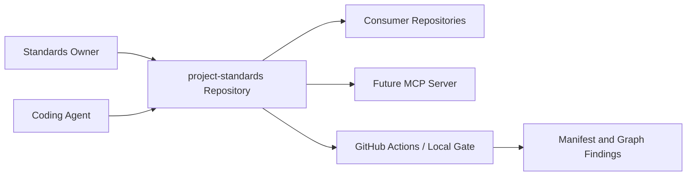
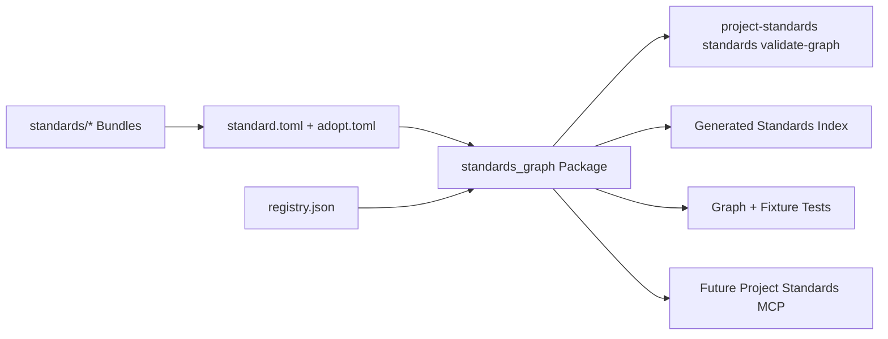
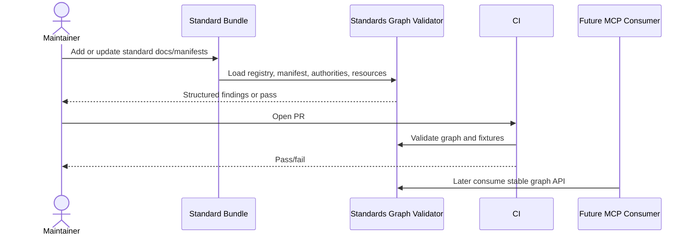
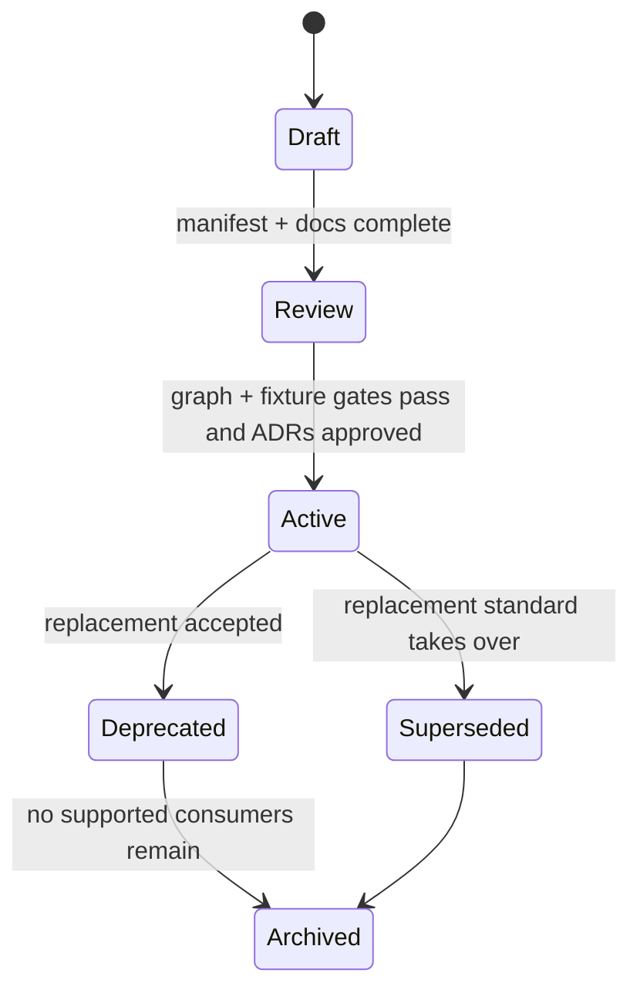

# Project Standards Meta-Repository MCP Readiness Preparation — Specification (Full)

## Revision History

| Version | Date | Author | Change |
| --- | --- | --- | --- |
| 0.6 | 2026-07-09 | Coding agent | Aligned the manifest example, adoption-mode references, and authority tuple with the implemented ADR 0017-0021 package methodology. |
| 0.5 | 2026-07-09 | Coding agent | Added ADR 0017-0021 package-methodology references after the adoption, lifecycle, provenance, versioning, and packaged-skill decisions were recorded. |
| 0.4 | 2026-07-09 | Coding agent | Resolved accepted ADR references from placeholders to recorded ADR paths. |
| 0.3 | 2026-07-07 | ChatGPT | Review pass: tightened independent-standard-package rules, relationship taxonomy, MCP-evidence alignment, and graph gates for package independence. |
| 0.2 | 2026-07-07 | ChatGPT | Normalized `spec_id` from mnemonic placeholder to Project Spec-compatible `SPEC-[0-9A-Z]{4}` form. |
| 0.1 | 2026-07-07 | ChatGPT | Initial full specification for preparing the `project-standards` meta-repository for a future scalable MCP server. |

**Spec lifecycle:** This document is living until `approved`, then change-controlled. Implementation deviations are recorded in the [Deviations Log](#deviations-log), not silently patched into requirements. This spec intentionally excludes implementation of the MCP server itself; it prepares the standards repository so a later MCP server can be thin, generic, and manifest-driven.

---

## 1. Purpose & Background

The `project-standards` repository is already a single source of truth for standards, schemas, templates, reusable workflows, and project tooling. It defines standards that consumer repositories adopt rather than vendoring and independently modifying their own copies. The next strategic improvement is to make the repository _mechanically self-describing_ so future agent-facing integrations — especially a Project Standards MCP server — can discover, compose, validate, and expose standards without hardcoded per-standard logic.

The preparation work in this spec turns the repository from a well-structured standards collection into a standards platform. The platform shall define a meta-contract for every standard bundle, including manifests, authority declarations, resource indexes, artifact ownership, compatibility metadata, validator/fixer/drift provider declarations, and graph-level validation. The result should be a repository where adding a new standard is primarily a data/documentation/validation change, not a tool-code change.

This is preparation only. The future MCP server should be able to read these contracts, but the server itself is deliberately out of scope here. The goal is to ensure that, before MCP work starts, the repository already answers:

**Non-negotiable composition rule:** standards are independent packages by default. A standard may recommend a companion, declare that it extends another standard, or consume a generic platform capability, but it must not hide a hard standard-to-standard dependency. Any extension relationship that cannot stand alone must be explicit in `standard.toml`, justified by ADR, surfaced in generated indexes, and rejected by graph validation if it is undeclared.

- What standards exist?
- What does each standard govern?
- What files/config/workflows does each standard own or contribute?
- Which standards compose safely?
- Which standard owns each formatting, linting, validation, generation, or review authority?
- What resources should an agent lazy-load?
- What deterministic checks keep standards honest?
- What ADRs explain the alignment decisions?

---

## 2. Scope

### 2.1 In Scope

- A formal **Standard Bundle Authoring Standard** that governs how standards are added and maintained inside `project-standards`.
- A standard-independence contract: standards are independently adoptable by default, with companion/extension relationships declared explicitly and never inferred from prose.
- A formal **independent standard package** contract: every standard must remain adoptable on its own, and standard groups must be recommendations/composition profiles rather than hidden hard dependencies.
- A machine-readable `standard.toml` manifest for every standard bundle.
- Validation schemas/models for `standard.toml`, `adopt.toml`, authority declarations, resource indexes, and provider declarations.
- A standards graph validator that proves bundle metadata, registry entries, adoption artifacts, and authority declarations are internally consistent.
- Updates to existing standards so each one declares its identity, lifecycle, resources, authorities, capabilities, explicit relationships, artifacts, validators, fixers, drift checks, agent summaries, and exception process.
- ADRs that lock in the composition model, manifest model, graph validation model, provider plugin model, and future agent/tooling integration boundaries.
- Tests and CI gates that prevent new standards from conflicting with existing standards or requiring implicit adoption of another standard.
- A relationship taxonomy that distinguishes `independent`, `companion`, `extends`, `conflicts`, and `consumes_platform` without hidden `requires` semantics.
- Documentation and generated indexes that humans and future tools can use without manually reading the entire repository.
- A readiness gate that must pass before a separate MCP server implementation spec begins.

### 2.2 Out of Scope (Non-Goals — never)

| ID | Non-Goal | Reason |
| --- | --- | --- |
| NG-001 | Implement the MCP server in this work. | This spec prepares the repository. MCP design and implementation require a separate downstream spec after readiness gates pass. |
| NG-002 | Replace the existing CLI, validators, schemas, or reusable workflows with MCP. | MCP should become an access/orchestration layer over canonical repository contracts, not the canonical authority. |
| NG-003 | Make standards depend on a running service to be usable. | Consumer repositories must remain usable through docs, CLI, and CI without MCP. |
| NG-004 | Require every standard to have identical implementation mechanics. | Standards may be documentation-only, copy-adopted, validator-enforced, CLI-backed, reference-only, or internal-only as long as they declare their capabilities honestly. |
| NG-005 | Hide conflicts through precedence rules. | Conflicting standards should be redesigned or explicitly rejected by graph validation, not silently resolved by priority. |
| NG-006 | Treat agent-specific summaries as canonical replacements for full standards. | Agent summaries are derived/companion artifacts. The canonical standard remains the full bundle documentation and machine contracts. |

### 2.3 Won't Have in v1 (deferred — not never)

| ID | Deferred Capability | Why Deferred | Revisit When |
| --- | --- | --- | --- |
| WH-001 | Remote standards registry service. | Local package/repo contracts are sufficient for MCP readiness and avoid auth/network complexity. | After local stdio MCP is proven useful across real consumer repos. |
| WH-002 | Automated bulk migration of all consumer repositories. | The meta-repo must first prove its graph and adoption contracts. | After at least two consumer repos adopt the new manifest model manually. |
| WH-003 | Full semantic contradiction detection across prose. | Deterministic graph checks can catch ownership/capability conflicts; prose contradiction detection needs a later review workflow. | After the manifest and authority map are stable. |
| WH-004 | Marketplace-style third-party standards. | The immediate need is first-party `L3DigitalNet/project-standards` governance. | After first-party standards prove composability and versioning. |

### 2.4 Boundaries

| Boundary | Description |
| --- | --- |
| System owns | Meta-repository bundle contracts, manifests, schemas, graph validation, generated indexes, standard-specific documentation updates, ADR backlog, tests, and CI wiring. |
| System depends on | Existing `project-standards` package structure, current standards bundles, registry, adopt engine, Markdown/frontmatter rules, project-spec tooling, Python tooling, and GitHub Actions. |
| System does not own | Future MCP runtime implementation, consumer repo business logic, third-party MCP clients, remote auth, or external standards registries. |

---

## 3. Context

### 3.1 Current State

The repository already has many prerequisites for scalable agent integration:

- Standards are grouped as bundles under `standards/{standard-id}/`, typically with `README.md`, `adopt.md`, templates, examples, and resources.
- The Python package includes schemas, validators, an adopt engine, standard bundles, registry handling, and project-spec tooling.
- The adopt engine already uses generic artifact kinds (`file`, `workflow-caller`, `fragment`) and can plan and execute adoption across multiple standards.
- Existing standards include Markdown Frontmatter, ADR, Python Tooling, Markdown Tooling, Project Specification, CLI Documentation, and Python Coding.
- The standards already distinguish concerns such as frontmatter semantics vs. Markdown physical formatting, and Python toolchain vs. Python coding rules.

Current gaps:

- There is no single meta-standard defining what every standard bundle must declare.
- `adopt.toml` is artifact-focused but not a complete standard manifest.
- There is no authoritative authority map describing which standard owns which concern over which files.
- There is no graph validator proving arbitrary standards can be co-adopted safely.
- Registry metadata does not yet express capabilities, dependencies, resources, provider hooks, or composability rules.
- Individual standards are not uniformly self-describing for future lazy loading.
- ADRs do not yet lock the future MCP-facing architecture boundaries.

### 3.2 Target State

The repository exposes a complete, validated standards graph:

```text
project-standards/
├── standards/
│   ├── README.md
│   ├── standard-bundle-authoring/
│   │   ├── README.md
│   │   ├── adopt.md
│   │   ├── templates/
│   │   └── examples/
│   ├── markdown-frontmatter/
│   │   ├── README.md
│   │   ├── adopt.md
│   │   ├── standard.toml
│   │   ├── agent-summary.md
│   │   └── ...
│   └── {every-standard}/
│       ├── README.md
│       ├── adopt.md or explicit non-adoptability marker
│       ├── standard.toml
│       ├── agent-summary.md
│       ├── templates/
│       ├── examples/
│       └── resources/
├── src/project_standards/
│   ├── standards_graph/
│   │   ├── models.py
│   │   ├── loader.py
│   │   ├── validate.py
│   │   ├── authority.py
│   │   ├── compatibility.py
│   │   └── render.py
│   ├── schemas/
│   │   ├── standard-manifest.schema.json
│   │   ├── authority-map.schema.json
│   │   └── registry.json
│   └── ...
└── docs/adr/
    └── adr-NNNN-*.md
```

A future MCP server can then be thin:

1. Load the standard registry and manifests.
2. Expose manifest-declared resources.
3. Use existing provider declarations for validation, fixing, drift, and planning.
4. Keep tools generic because new standards are added as metadata and plugins, not top-level MCP tools.

### 3.3 Assumptions

| ID | Assumption | Impact if False |
| --- | --- | --- |
| A-001 | `project-standards` remains the canonical source of truth for standards. | If a different repository becomes canonical, manifests and docs must move or support remote source resolution. |
| A-002 | The future MCP server will be packaged with or adjacent to the existing Python package. | If MCP becomes a separate language/runtime, the manifest and schema contracts still apply, but provider loading must use a different adapter layer. |
| A-003 | Existing standards can be updated without breaking current consumers when changes are additive. | If current consumers are brittle, rollout needs versioned migration guidance and compatibility shims. |
| A-004 | Standards are intended to compose unless explicitly impossible. | If standards are allowed to be mutually exclusive by default, the authority graph loses much of its value. |
| A-005 | Future agents benefit more from stable generic operations than per-standard tools. | If a client requires per-standard affordances, those should be prompts/resources, not canonical tool contracts. |

### 3.4 Constraints

| ID | Constraint | Source |
| --- | --- | --- |
| C-001 | Do not implement the MCP server in this specification. | User scope decision. |
| C-002 | Use the Full Project Specification structure. | User instruction and Project Specification Standard. |
| C-003 | Preserve existing CLI/docs/CI usability for non-MCP consumers. | Repository design goal. |
| C-004 | New standards must not require MCP tool changes under normal circumstances. | Scalability requirement. |
| C-005 | Standards must not silently conflict over formatting, linting, validation, code generation, or artifact ownership. | Composability requirement. |
| C-006 | Documentation remains human-readable and repo-local; machine manifests supplement, not replace, prose. | Maintainability requirement. |
| C-007 | Unsafe path handling, symlink writes, and untrusted instruction-like content must be treated conservatively. | Existing adopt engine safety model and Python Coding agent trust boundary. |
| C-008 | Standards must be independently adoptable by default; standard-to-standard hard dependencies are prohibited unless modeled as an explicit extension with ADR approval. | User goal: arbitrary standards packages should compose without hidden coupling. |

---

## 4. Goals

| ID | Goal | Success Signal | Achieved By |
| --- | --- | --- | --- |
| G-001 | Make standards self-describing. | Every standard has validated metadata and resource declarations. | FR-001, FR-002, FR-007, FR-012 |
| G-002 | Preserve arbitrary safe co-adoption. | Pairwise and selected combinatorial graph checks pass for all standards. | FR-004, FR-010, FR-017 |
| G-003 | Keep future MCP tools generic. | Adding a new standard requires no MCP tool-code change unless a new generic operation is introduced. | FR-002, FR-006, FR-009, FR-018 |
| G-004 | Improve agent context efficiency. | Each standard has an agent summary, canonical resource index, and rationale/source path. | FR-007, FR-013, FR-014 |
| G-005 | Improve maintainability of standards. | CI fails on manifest drift, registry drift, authority collisions, missing resources, and artifact conflicts. | FR-010, FR-011, FR-018 |
| G-006 | Lock alignment decisions in ADRs. | Required ADR set exists and is referenced from standards and specs. | FR-016 |
| G-007 | Prepare for later MCP without coupling to MCP. | Readiness gate passes and a downstream MCP spec can consume manifests directly. | FR-019, MS-5 |
| G-008 | Preserve independent standard packages. | Any active standard can be adopted alone unless a narrow, ADR-approved extension exception is declared and graph-validated. | FR-006, FR-017, FR-021, FR-022 |

---

## 5. Stakeholders and Users

| Role / Stakeholder | Concern | Involvement |
| --- | --- | --- |
| Standards owner / architect | Standards remain coherent, scalable, and non-conflicting. | Approves ADRs, scope, and readiness gate. |
| Coding agent implementer | Needs deterministic requirements, manifests, tests, and clear verification. | Implements repository changes from this spec. |
| Future MCP server implementer | Needs stable machine contracts to expose standards without hardcoding. | Consumes manifests and graph APIs in a later spec. |
| Consumer repository maintainer | Needs adoption to remain understandable and safe without MCP. | Validates migration/adoption workflows. |
| Human reviewer | Needs traceability between goals, requirements, ADRs, and tests. | Reviews PRs and approves deviations. |

---

## 6. Glossary

| Term | Definition | Notes / Not to be confused with |
| --- | --- | --- |
| Standard | A governed bundle that defines rules, templates, schemas, workflows, or review contracts for consumer repositories. | Not every document under `standards/` is necessarily adoptable. |
| Standard bundle | Directory containing a standard's canonical docs, adoption guide, manifests, templates, examples, and resources. | Existing bundle anatomy should be extended, not replaced. |
| `standard.toml` | Proposed manifest declaring identity, lifecycle, resources, capabilities, authorities, compatibility, and provider hooks. | Different from current `adopt.toml`, which is artifact-focused. |
| `adopt.toml` | Existing or evolved artifact manifest used to plan materialized files, workflow callers, and fragments. | May be referenced by `standard.toml`. |
| Authority | A declared owner for a concern over a target set, such as `python` + `**/*.py` + `format` + `ruff`. | Authority is about preventing conflicting tools/rules. |
| Capability | A machine-readable feature provided or consumed by a standard, such as `markdown.format` or `python.typecheck.strict`. | Capabilities support relevance and platform-provider resolution; they must not create hidden hard adoption dependencies. |
| Standard package | A self-contained adoptable standards unit: canonical docs, metadata, optional artifacts/providers, and validation. | A package may recommend or integrate with another package but must not require it silently. |
| Standard group | A curated recommendation profile that names multiple standard packages for a project type. | Groups simplify adoption decisions but do not make member standards inseparable. |
| Relationship edge | A typed relationship between standards or capabilities: `companion`, `extends`, `conflicts`, or `consumes_platform`. | The graph validator enforces allowed relationships and blocks hidden dependencies. |
| Standards graph | Derived graph of standards, versions, capabilities, relationships, authorities, artifacts, and resources. | The graph is validation input for future MCP, not MCP itself. |
| Provider | A Python implementation hook for validation, fixing, drift checking, ID generation, extraction, or rendering. | Providers are registered generically by operation. |
| Resource | A lazily loadable canonical document, template, example, schema, manifest, or generated report. | Future MCP resources should be generated from manifests. |
| Prompt | A reusable agent workflow template, such as adoption review or exception ADR drafting. | Standard-specific prompts are safer than per-standard tools. |
| Drift | Difference between a consumer repo's adopted artifact/config and the canonical version or declared contract. | Drift may be allowed only with documented exception. |
| Meta-standard | A standard governing how other standards are authored, versioned, validated, and composed. | Required before scaling standards count. |
| Companion standard | A standard that is often useful with another standard but is not required for the first standard to be valid or adopted. | Example: Markdown Tooling is a companion to Markdown Frontmatter; neither should silently require the other. |
| Extension standard | A standard that intentionally builds on another standard's authority or schema surface. | Rare; must be explicit in manifest metadata and justified by ADR. |
| Hard dependency | A hidden or mandatory standard-to-standard requirement that prevents independent adoption. | Prohibited by default; use explicit `extends` metadata only for rare ADR-backed extension standards. |

---

## 7. Requirements

### 7.1 Functional Requirements

| ID | Requirement | Rationale | Acceptance Criteria | Priority |
| --- | --- | --- | --- | --- |
| FR-001 | The repository shall define a Standard Bundle Authoring Standard. | New standards need a uniform authoring contract. | `standards/standard-bundle-authoring/README.md` exists, validates, and defines required files, manifests, authority rules, relationship rules, resource rules, and CI gates. | Must |
| FR-002 | Each standard shall declare a validated `standard.toml` manifest. | Future tooling and MCP must discover standards without hardcoding. | Every active/adoptable standard has `standard.toml`; graph validation fails on missing or invalid manifests. | Must |
| FR-003 | The existing `adopt.toml` model shall be retained or evolved as an artifact-focused manifest. | The current adopt engine already solves artifact planning and write safety. | Artifact declarations remain generic and are referenced from `standard.toml` or embedded without losing current behavior. | Must |
| FR-004 | Each standard shall declare authority tuples for every concern it governs. | Conflict-free composition requires a formal ownership model. | Authority declarations include domain, target, concern, owner, mutability, and conflict policy. | Must |
| FR-005 | The repository shall maintain a config namespace registry. | Multiple standards must not collide in `.project-standards.yml`. | Graph validation rejects duplicate namespaces and undeclared top-level config keys. | Must |
| FR-006 | Each standard shall declare provided capabilities, consumed platform capabilities, optional companions, extension relationships, and conflicts without implying hidden hard dependencies. | Generic tooling needs relevance resolution while preserving independent standards packages. | Capability and relation declarations are validated against registries; standard-to-standard hard dependencies fail unless modeled as explicit extension ADRs. | Must |
| FR-007 | Each standard shall declare resource descriptors for canonical docs, adoption docs, templates, examples, schemas, agent summaries, and rationale/source docs. | Future MCP/resource consumers must lazy-load relevant content. | `standard.toml` exposes URI-safe resource IDs and file paths; validation fails when paths are missing. | Must |
| FR-008 | Each standard shall declare lifecycle and compatibility metadata. | Tooling must know draft/active/deprecated status and version relationships. | Manifest includes status, default contract, supported versions, release behavior, and compatibility notes. | Must |
| FR-009 | Standards shall declare provider hooks for validators, fixers, drift checks, ID generation, extraction, rendering, and semantic review when applicable. | Tool operations should remain generic while behavior varies by standard. | Provider declarations resolve to importable or documented implementations; missing optional providers are explicit. | Must |
| FR-010 | The package shall provide a standards graph validator. | The repository must fail fast when standard metadata conflicts or drifts. | `project-standards standards validate-graph` or equivalent runs in CI and reports structured findings. | Must |
| FR-011 | Existing repository verification shall include manifest and graph validation. | New contracts must be enforced continuously. | `scripts/check.py` and/or CI run manifest/schema/graph tests before success. | Must |
| FR-012 | Existing standards shall be retrofitted to the new manifest model. | MCP readiness is not achieved while standards remain partially implicit. | Markdown Frontmatter, ADR, Python Tooling, Markdown Tooling, Project Specification, CLI Documentation, and Python Coding have manifests or explicit draft/non-adoptable manifests. | Must |
| FR-013 | Each standard shall include or declare a compact agent summary when useful. | Agents need day-to-day context efficiency without weakening canonical standards. | Active standards either provide `agent-summary.md` or explain why not. | Should |
| FR-014 | The repository shall generate a standards index from manifests. | Human and machine views should not drift. | Generated or checked index lists all standards, statuses, versions, capabilities, relationships, resources, and adoption mode. | Must |
| FR-015 | The repository shall document upgrade and migration behavior for manifest adoption. | Current consumers need a safe transition path. | `UPGRADING.md` or standard-specific adopt guides explain compatibility and migration steps. | Should |
| FR-016 | The repository shall add ADRs for the major alignment decisions in this spec. | Long-term alignment requires durable decisions, not only implementation code. | ADRs listed in §8.3 exist or are tracked as blocking deliverables. | Must |
| FR-017 | The graph validator shall prove safe arbitrary co-adoption within declared constraints. | The design goal is arbitrary selection of non-conflicting standards. | Pairwise tests across all active standards pass; selected all-standard and profile-based combinations pass. | Must |
| FR-018 | The repository shall include dogfood consumer fixtures for adoption/composition. | Unit tests alone do not prove consumer experience. | Fixtures simulate representative consumer repos and verify adoption, validation, drift, and conflict behavior. | Must |
| FR-019 | The repository shall define MCP-readiness criteria without implementing MCP. | MCP work should start only when the meta-repo is prepared. | A documented readiness checklist passes and is referenced by the downstream roadmap spec. | Must |
| FR-020 | The repository shall document the exception path for standards that cannot follow a rule. | Real standards may need documented deviation while preserving auditability. | Meta-standard includes exception ADR requirements and graph annotation format. | Should |
| FR-021 | The graph validator shall reject undeclared standard-to-standard hard dependencies and surface companion/extension relationships explicitly. | Arbitrary adoption cannot be safe when standards silently rely on one another. | Fixture standards prove optional companions do not block adoption; extension standards require explicit `extends` metadata and ADR; hidden `requires` relationships fail validation. | Must |
| FR-022 | The repository shall define a standard relationship taxonomy. | `requires`/`depends_on` language is too ambiguous for scalable composition. | Manifest schema allows explicit relationship kinds and rejects undeclared or ambiguous dependency fields. | Must |

### 7.2 Non-Functional Requirements

| ID | Category | Requirement | Measurement / Acceptance Criteria | Priority |
| --- | --- | --- | --- | --- |
| NFR-001 | Scalability | Adding a normal new standard shall not require adding a new generic operation or MCP tool. | New-standard fixture adds a manifest and docs; existing graph tooling discovers it automatically. | Must |
| NFR-002 | Determinism | Graph validation shall produce stable, structured findings. | Re-running the command on unchanged input yields identical JSON findings except timestamps if explicitly enabled. | Must |
| NFR-003 | Maintainability | Manifest schemas shall be readable, documented, and tested. | Schema docs include examples and invalid cases; tests cover missing required fields and collisions. | Must |
| NFR-004 | Backward compatibility | Current consumers shall not break merely because manifests are added. | Existing validation/adoption workflows continue unless intentionally migrated. | Must |
| NFR-005 | Context efficiency | Agent summaries shall be compact and link to full canonical docs. | Each summary stays below a documented size target or records an exception. | Should |
| NFR-006 | Safety | Write-path metadata shall reject unsafe paths, symlink escape risk, and undeclared writes. | Existing adopt safety tests remain passing; new manifest tests cover path traversal and ownership collisions. | Must |
| NFR-007 | Extensibility | Provider hooks shall support new standards without central switch statements. | Provider loading is registry-based and tested with a fake provider. | Must |
| NFR-008 | Observability | Validation failures shall identify standard ID, file path, rule ID, and remediation hint. | JSON and human outputs include these fields. | Should |
| NFR-009 | Human usability | Humans shall be able to understand standard relationships without running MCP. | Generated docs and diagrams explain graph, authorities, relationships, and compatibility. | Must |
| NFR-010 | Independence | Standard packages shall not become indivisible suites merely because a group recommends them together. | A fixture proves each active standard can validate/adopt alone, with optional companion warnings but no hard failure. | Must |

### 7.3 Interface Requirements

| ID | Interface | Requirement | Contract / Format | Acceptance Criteria |
| --- | --- | --- | --- | --- |
| IR-001 | Manifest file | The system shall define `standard.toml` for every standard bundle. | TOML validated by Pydantic and/or JSON Schema. | Invalid manifest fixture fails with actionable error. |
| IR-002 | Artifact manifest | The system shall preserve generic artifact kinds. | `file`, `workflow-caller`, `fragment`, with future kinds gated by schema and tests. | Existing adopt tests continue passing. |
| IR-003 | CLI | The system shall expose a graph validation command. | `project-standards standards validate-graph [--json]`. | Command exits 0 on valid repo, 1 on graph findings, 2 on invocation/config error. |
| IR-004 | Generated index | The system shall render a standards catalog. | Markdown and optional JSON output. | Generated index matches manifests and fails check when stale. |
| IR-005 | Provider registry | The system shall allow standards to declare operation providers. | Python import path or declarative command provider, operation type, input/output schema. | Fake provider test validates dispatch without central switch. |
| IR-006 | Readiness report | The system shall produce an MCP-readiness report. | Markdown and/or JSON checklist. | Report enumerates all blocking gaps before MCP implementation begins. |
| IR-007 | Relationship taxonomy | The system shall expose standard relationships using explicit, finite edge kinds. | Manifest schema and JSON graph output. | Unknown relationship kinds and implicit hard dependencies fail graph validation. |

### 7.4 Data Requirements

| ID | Data Entity | Requirement | Validation Rules | Ownership |
| --- | --- | --- | --- | --- |
| DR-001 | Standard manifest | Store standard identity, lifecycle, versions, resources, capabilities, authorities, providers, and adoption mode. | Required fields; unique `standard.id`; valid status; valid paths; no unknown capability unless declared experimental. | `standards_graph` package. |
| DR-002 | Authority tuple | Represent ownership of a concern over a target. | Unique non-conflicting tuple unless explicitly declared as extension; mutating authorities cannot overlap silently. | Authority graph validator. |
| DR-003 | Capability and relation | Represent provided features, consumed platform capabilities, optional companions, explicit extensions, and conflicts. | Namespaced kebab/dot notation; declared in capability/relationship registries; no hidden standard-to-standard hard dependency; extension graph acyclic and ADR-backed. | Capability and relationship registry. |
| DR-004 | Config namespace | Reserve top-level or nested config keys. | Unique namespace; declared owning standard; no duplicate ownership. | Config namespace registry. |
| DR-005 | Resource descriptor | Identify lazy-loadable standard content. | Resource ID unique per standard; path exists; MIME type known; audience declared. | Resource index generator. |
| DR-006 | Provider declaration | Bind generic operations to standard-specific behavior. | Operation type enum; import path/command exists or is marked planned; output schema declared for structured providers. | Provider registry. |
| DR-007 | Relationship edge | Represent independent, companion, extension, conflict, and platform-capability relationships. | No undeclared standard IDs; no ambiguous dependency language; no hidden `requires` edge; extensions need ADR, independent-mode analysis, and tests. | Relationship graph. |
| DR-008 | Standard group | Represent recommended bundles of independent standards for project profiles. | Group membership may not imply hidden adoption dependency; all member packages retain standalone adoption paths. | Generated standards index. |
| DR-009 | ADR backlog item | Track required architecture decisions. | ADR ID/filename, status, owning requirement, target milestone. | Documentation owner. |

---

## 8. Architecture and Design

### 8.1 Architecture Summary

The preparation architecture is manifest-first and graph-validated. Standards remain ordinary Markdown-first bundles, but each bundle gains a validated manifest describing its machine contract. A new standards graph layer loads the registry, manifests, artifact declarations, resources, authorities, capabilities, and providers. It then validates the whole repository as a graph rather than as unrelated files.

The future MCP server should consume the graph layer rather than parsing standards directly. This is why the meta-repository work is valuable before server work starts: MCP becomes a client of a stable internal standards API, not the first place where standards metadata is invented.

### 8.2 Architecture Views

#### 8.2.1 Context View



#### 8.2.2 Container / Deployment View



#### 8.2.3 Component View

| Component | Responsibility | Interfaces | Notes |
| --- | --- | --- | --- |
| Standard Bundle Authoring Standard | Defines the rules every standard must follow. | `standards/standard-bundle-authoring/README.md`, `adopt.md`. | Becomes the meta-standard. |
| `standard.toml` schema/model | Validates standard identity, resources, authorities, capabilities, providers. | TOML, JSON Schema, Pydantic model. | Required for all active standards. |
| Existing `adopt.toml` model | Describes materialized adoption artifacts. | Current adopt engine. | Retain current safety semantics. |
| Standards graph loader | Loads registry and manifests into one typed graph. | Python API and CLI. | Future MCP consumes this. |
| Authority graph validator | Detects mutating authority collisions and config namespace conflicts. | CLI findings, tests. | Core to arbitrary co-adoption. |
| Resource index generator | Produces human and future-machine resource catalog. | Markdown/JSON generated outputs. | Supports lazy loading. |
| Provider registry | Maps generic operations to standard-specific implementations. | Python entrypoints/import paths and declarative command providers. | Prevents central switch statements. |
| Dogfood fixtures | Simulate consumer repos and standard combinations. | pytest fixtures. | Proves adoption behavior. |

### 8.3 Design Decisions

The following ADRs should be created or updated as part of this preparation work. Filenames use placeholders until actual sequence numbers are assigned.

| ID | Decision | Rationale | Alternatives Considered | ADR |
| --- | --- | --- | --- | --- |
| D-001 | Create a Standard Bundle Authoring Standard. | Scaling standards requires a standard for standards. | Keep conventions informal; document in README only. | `adr-0001-standard-bundle-authoring-contract.md` |
| D-002 | Use `standard.toml` as the primary manifest for standard metadata. | Machine consumers need stable, validated metadata independent of prose. | Encode everything in `README.md`; expand `registry.json` only. | `adr-0002-manifest-first-standard-discovery.md` |
| D-003 | Preserve `adopt.toml` as artifact-focused and reference it from `standard.toml`. | Current adopt engine already has useful safety and planning behavior. | Merge all artifact fields into one large manifest immediately. | `adr-0003-separate-standard-and-artifact-manifests.md` |
| D-004 | Use authority tuples to enforce conflict-free composition. | Arbitrary co-adoption is impossible to prove from prose alone. | Rely on standard authors to notice conflicts manually. | `adr-0004-authority-map-and-conflict-free-composition.md` |
| D-005 | Keep future agent/MCP tools generic over `standard_id` and operation. | Per-standard tools do not scale and increase context/tool clutter. | Add a new tool for every standard. | `adr-0005-stable-generic-agent-tooling-interface.md` |
| D-006 | Use provider registries for validators, fixers, drift checks, ID generation, and extraction. | Standard-specific behavior should be pluggable without central switch statements. | Hardcode each standard in CLI/MCP. | `adr-0006-standard-provider-plugin-model.md` |
| D-007 | Add graph validation to the normal verification gate. | A manifest model is only useful if continuously enforced. | Run validation manually before releases only. | `adr-0007-standard-graph-validation-gate.md` |
| D-008 | Require config namespace ownership. | `.project-standards.yml` must not become a collision-prone dumping ground. | Allow standards to add arbitrary config keys. | `adr-0008-consumer-config-namespace-registry.md` |
| D-009 | Require agent summaries as companions, not replacements. | Agents need compact context, but canonical standards need full evidence/rationale. | Only full standards; only summaries. | `adr-0009-agent-summary-and-canonical-standard-split.md` |
| D-010 | Treat standards resources as lazy-loadable URI-like assets. | Future MCP can expose resources directly from manifests. | Let each client discover file paths independently. | `adr-0010-standard-resource-uris-and-index.md` |
| D-011 | Require dogfood consumer fixtures for composition. | Pairwise/fixture tests catch failures unit tests miss. | Test only individual standards. | `adr-0011-dogfood-consumer-fixtures-for-standards-composition.md` |
| D-012 | Defer MCP implementation until meta-repo readiness gate passes. | Avoid encoding missing metadata directly into MCP implementation. | Build MCP immediately and backfill repo later. | `adr-0012-mcp-readiness-before-server-implementation.md` |
| D-013 | Treat standards as independent packages and groups as recommendation profiles. | Arbitrary adoption fails if standards secretly require one another. | Model standards as suites with implicit dependencies; rejected because it harms composability and MCP scalability. | `adr-0013-independent-standard-packages-and-relationship-taxonomy.md` |

### 8.4 Solution Alternatives Considered

| Alternative | Why Rejected |
| --- | --- |
| Build the MCP server immediately and let it hardcode current standards. | Fast initial demo, but creates a second standards implementation and makes new standards require tool-code changes. |
| Put all metadata in `registry.json`. | The registry would become too broad and distant from each standard bundle; per-bundle manifests keep ownership local. |
| Replace `adopt.toml` with a new manifest in one step. | Higher migration risk; current artifact planning already works and should be reused. |
| Use prose-only rules for conflict avoidance. | Agents and CI cannot reliably prove non-conflict from prose. |
| Allow precedence rules to resolve authority conflicts. | Precedence hides design errors and makes arbitrary co-adoption unpredictable. |
| Allow standards to require other standards implicitly. | Hidden dependencies make arbitrary adoption unreliable and push dependency resolution into agents instead of graph validation. |
| Generate agent summaries automatically from full standards only. | Useful later, but summaries should be reviewed artifacts because weakening canonical rules is a real risk. |

### 8.5 Design Constraints

- The repository remains usable without MCP.
- The canonical standard remains Markdown/prose plus machine contracts, not code alone.
- Manifests must be validated in source checkout and packaged wheel contexts.
- New validators/providers must not require network access for normal repository checks.
- New standard additions must fail closed when metadata is incomplete.
- Existing artifact write safety must not be weakened.
- Standard-to-standard dependencies must be optional companions or explicit ADR-backed extensions; hidden hard dependencies are invalid.
- Draft standards may be included only if their non-adoptable/draft status is explicit.
- Active standards must avoid hard adoption dependencies on other standards; any unavoidable exception requires an ADR, relationship manifest entry, independent-mode analysis, and graph tests.
- Standard groups may recommend sets of standards but must never be the only way to adopt an individual member standard.

### 8.6 Dependency Policy

| Dependency | Allowed? | Reason |
| --- | --- | --- |
| Pydantic v2 | Conditional | Acceptable for typed manifest models if already compatible with package policy; useful for structured validation. |
| `tomllib` | Yes | Standard-library TOML reader for Python 3.11+. |
| `jsonschema` | Yes | Already used for frontmatter validation; suitable for JSON Schema validation. |
| Network services | No | Meta-repo validation should run offline. |
| MCP SDK | No for this spec | MCP implementation is out of scope; adding SDK belongs to downstream MCP spec. |
| Graph library dependency | Avoid | The standards graph is small and can likely use standard library data structures. |

---

## 9. Data Model

### Proposed `standard.toml` Structure

```toml
[standard]
id = "markdown-tooling"
name = "Markdown Tooling"
summary = "Formatting and structural linting for Markdown and adjacent structured text."
status = "active" # draft | review | active | deprecated | archived | superseded
adoption = "copy-adopt" # validator | copy-adopt | cli | reference-only | none

[versions]
supported = ["1.0", "1.1"]
latest = "1.1"

[config]
namespaces = ["markdown_tooling"]

[capabilities]
provides = ["markdown.format", "markdown.lint.structure", "yaml.format", "json.format"]
consumes_platform = [] # generic capabilities supplied by tooling/platform, not other standards

[relations]
companions = ["markdown-frontmatter"] # useful together, never auto-required
extends = [] # explicit extension only; requires ADR
conflicts = [] # exceptional; normally redesign to avoid conflict

[resources]
readme = "README.md"
adopt = "adopt.md"

[[authority]]
domain = "markdown"
target = "**/*.md"
concern = "physical-formatting"
owner = "prettier"
mutates = true

[[authority]]
domain = "markdown"
target = "**/*.md"
concern = "structure-lint"
owner = "markdownlint"
mutates = false

[[providers]]
operation = "drift-check"
kind = "documentation-only"
optional = true
```

### Authority Tuple

```text
(domain, target, concern, owner, mutates, standard_id, package_version)
```

Collision rule:

- Two mutating authorities conflict when their `domain`, overlapping `target`, and same `concern` are owned by different owners and no explicit, ADR-backed `extends` relation exists.
- Non-mutating validators may overlap only when their concerns are distinct or one declares itself advisory.
- Shared artifacts may be reused only when they are the same canonical source and ownership is declared.

### Provider Declaration

| Field | Meaning | Required |
| --- | --- | --- |
| `operation` | Generic operation, e.g. `validate`, `fix`, `drift-check`, `id-next`, `extract`, `semantic-review`. | Yes |
| `kind` | `python`, `command`, `workflow`, or `documentation-only`. | Yes |
| `entrypoint` | Import path or command reference. | Required for executable providers. |
| `input_schema` | Structured input schema or named built-in schema. | Should |
| `output_schema` | Structured output schema. | Should |
| `optional` | Whether absence blocks adoption. | Yes |

### Standard Relationship Model

Relationships are explicit graph data, not prose implications. The default relationship between any two standards is **independent**.

| Relationship | Meaning | Adoption effect | Validation rule |
| --- | --- | --- | --- |
| `independent` | No relationship declared. | Either standard may be adopted alone. | Default. |
| `companion` | Often useful together. | Planner may recommend the companion, but must not require it. | Must be surfaced as advice only. |
| `extends` | One standard intentionally builds on another standard's authority/schema. | Planner must surface the extension and parent relationship explicitly. | Requires ADR, acyclic graph, and explicit authority compatibility. |
| `conflicts` | Standards cannot safely co-exist as designed. | Planner refuses the combination. | Must be exceptional, ADR-backed, and preferably temporary. |
| `consumes_platform` | Standard needs a generic platform capability such as validation or package tooling. | Satisfied by package/provider infrastructure, not by another standard. | Capability must exist in the platform capability registry. |

A manifest field named `requires` is reserved and invalid for standard-to-standard dependencies in v1. Use `relations.extends` for rare extension relationships and `relations.companions` for recommendations.

### Generated Index Data

The generated standards index should include:

- standard ID;
- display name;
- status;
- adoption mode;
- default contract;
- supported versions;
- config namespace;
- capabilities provided/consumed; relationships;
- resources;
- artifact count;
- provider operations;
- relationship edges and recommendation groups;
- known companions;
- independence/exception state;
- readiness state.

---

## 10. Behavior and Workflows

### 10.1 Primary Workflow



Steps:

1. Author or update the standard's canonical documentation.
2. Add/update `standard.toml`, resource declarations, authority tuples, capabilities, provider hooks, and artifact manifest references.
3. Run manifest validation and graph validation.
4. Update generated standards index.
5. Run fixture adoption/composition tests.
6. Record any new alignment decision in ADR form.
7. Merge only when the normal gate and graph gate pass.

Expected result:

> The repository contains enough validated metadata for future tooling to discover, load, compose, validate, and expose standards without hardcoding individual standards.

### 10.2 Alternate Workflows

| ID | Trigger | Behavior | Expected Result |
| --- | --- | --- | --- |
| AW-001 | Existing standard has no adoption artifacts. | Manifest sets `adoption = "reference-only"` or `"none"` and omits `adopt.toml`. | Graph validation passes because non-adoptability is explicit. |
| AW-002 | Draft standard should not be offered for adoption. | Manifest sets `status = "draft"` and `adoption = "reference-only"` or `"none"`. | Generated index and future tools mark it non-adoptable. |
| AW-003 | Two standards share a file. | Both reference the same shared artifact path and declare ownership semantics. | Graph deduplicates or accepts shared source. |
| AW-004 | A standard needs a project-specific exception. | Exception is documented as an ADR and declared in manifest or config. | Graph reports exception as acknowledged rather than silent conflict. |
| AW-005 | A new artifact kind is proposed. | Meta-standard requires schema update, tests, and ADR if semantics affect writes. | Generic adoption tools gain the new kind once, not per standard. |

### 10.3 Edge Cases

| ID | Edge Case | Expected Behavior |
| --- | --- | --- |
| EC-001 | Manifest path points outside bundle. | Validation fails with unsafe path error. |
| EC-002 | Standard declares a resource file that does not exist. | Validation fails and names the missing path. |
| EC-003 | Two standards claim different formatters for Markdown. | Authority graph fails with conflict. |
| EC-004 | Standard exists in registry but no bundle exists. | Graph validation fails registry/bundle parity. |
| EC-005 | Bundle exists but missing registry entry. | Graph validation fails registry/bundle parity unless status explicitly excludes it. |
| EC-006 | Provider entrypoint cannot be imported. | Validation fails for required provider; warns for optional provider if marked planned. |
| EC-007 | Standard-specific agent summary contradicts canonical standard. | Semantic review flags contradiction; deterministic validation verifies only presence/linkage. |
| EC-008 | Draft standard appears in adoption resolver. | Graph marks it non-adoptable unless explicitly opted into experimental adoption. |

### 10.4 State Transitions



| State | Meaning | Entry Condition | Exit Condition |
| --- | --- | --- | --- |
| Draft | Standard is under design and not generally adoptable. | Initial creation. | Complete bundle, manifest, and review request. |
| Review | Candidate standard ready for validation and human review. | Graph validation can run. | ADRs approved and tests pass. |
| Active | Current standard available for use/adoption. | All gates pass. | Deprecated, superseded, or archived decision. |
| Deprecated | Still valid for existing consumers but discouraged for new work. | Replacement path exists. | Archived after support window. |
| Superseded | Replaced by a newer standard or contract. | Supersession ADR and migration path exist. | Archived when no longer relevant. |
| Archived | Historical only. | No active consumers or maintained contract. | None. |

---

## 11. UI Pages / API Endpoints

No user-facing web UI or HTTP API is in scope. The relevant surfaces are repository files, CLI commands, generated Markdown/JSON reports, and future MCP consumption. If a future web UI or remote registry is introduced, it requires a separate spec.

| Surface | Purpose | Key Actions | Authorization |
| --- | --- | --- | --- |
| CLI graph validation | Validate manifests and composability. | Run check, emit findings, emit JSON. | Local repo permissions. |
| Generated standards index | Human-readable catalog. | Review standard state, resources, capabilities, dependencies. | Repository read access. |
| Manifest files | Machine-readable standard contracts. | Edit in PR, validate in CI. | Repository write access. |
| ADRs | Durable decisions. | Review and approve architecture choices. | Repository write/review access. |

---

## 12. Error Handling and Recovery

### 12.1 Expected Failures

| ID | Failure Mode | User/System Behavior | Logging / Observability | Recovery |
| --- | --- | --- | --- | --- |
| ERR-001 | Invalid manifest syntax. | Graph validation exits non-zero and reports file/line where possible. | CLI stderr and JSON finding. | Fix TOML/schema violation. |
| ERR-002 | Authority conflict. | Validation fails and lists conflicting standards/concerns/targets. | Structured finding with both standard IDs. | Redesign authority, declare extension relation, or document exception if valid. |
| ERR-003 | Missing resource path. | Validation fails. | Finding includes standard ID and path. | Add file or remove resource descriptor. |
| ERR-004 | Artifact destination collision. | Adoption/graph planning fails. | Finding includes destination and sources. | Use shared artifact or redesign destination ownership. |
| ERR-005 | Provider import failure. | Required provider fails validation. | Finding includes entrypoint and exception summary. | Fix import path or mark provider planned/optional. |
| ERR-006 | Generated index stale. | CI fails. | Diff or stale-file finding. | Regenerate index. |
| ERR-007 | Current consumers rely on old docs. | Migration docs identify compatibility impact. | Release notes and upgrade guide. | Keep additive changes backward-compatible or release major version. |

### 12.2 Retry and Idempotency

- Validation commands are read-only and idempotent.
- Generated index commands should be deterministic.
- Adoption fixture tests may create temporary directories only under pytest `tmp_path` or equivalent.
- Write operations in existing adopt engine remain atomic and guarded; this spec does not add new consumer write operations beyond generated docs inside the standards repo.

### 12.3 Rollback / Recovery

If the manifest model creates unexpected breakage:

1. Revert graph validation from the required CI gate while keeping docs and manifests in branch for repair.
2. Keep existing standard docs, CLI, and workflows as the fallback canonical surface.
3. Restore the last passing `registry.json` and bundle state.
4. Open an ADR/deviation documenting the failure and revised rollout path.

---

## 13. Security and Privacy

### 13.1 Authentication

No new external authentication is introduced. Work happens through normal repository access controls.

### 13.2 Authorization

| Actor / Role | Allowed Actions | Denied Actions |
| --- | --- | --- |
| Standards owner | Approve ADRs, approve standard lifecycle changes, approve exceptions. | None within repository governance. |
| Coding agent | Modify files requested by the task, run local validation, propose ADRs. | Merge without review, bypass gates, introduce remote services, change secrets. |
| Future MCP implementer | Consume graph contracts after readiness. | Encode unvalidated per-standard assumptions before readiness gate. |
| Consumer repo maintainer | Adopt released standards and document exceptions. | Mutate canonical standards from consumer repo. |

### 13.3 Secrets

No secrets are required. The repository must not add secrets for manifest validation or graph generation.

| Secret | Storage Location | Access Pattern | Rotation / Notes |
| --- | --- | --- | --- |
| None | N/A | N/A | Any future GitHub token or remote registry credential is out of scope. |

### 13.4 Sensitive Data

| Data | Classification | Storage | Transmission | Retention |
| --- | --- | --- | --- | --- |
| Standards metadata | Public/internal depending on repository visibility | Git repository | GitHub/local clone | Repository history |
| Consumer fixture data | Internal test data | Git repository | CI/local clone | Repository history |
| Real consumer repo secrets | Restricted | Not stored | Not accessed | N/A |

### 13.5 Threats and Mitigations

| Threat | Impact | Mitigation |
| --- | --- | --- |
| Prompt/tool poisoning through standard docs or generated outputs. | Future agents may treat data as authority. | Python Coding agent trust boundary remains normative; generated outputs are data unless explicitly in instruction hierarchy. |
| Path traversal in manifests. | Generated/adopted files could escape expected root. | Validate relative paths and reject `..`, absolute paths, and unsafe symlink behavior. |
| Hidden authority conflict. | Consumer repos receive contradictory tooling. | Authority graph fails mutating conflicts. |
| Overbroad provider execution. | Validation could execute untrusted commands. | Providers are first-party, declared, local, and reviewed; no network by default. |
| Drift between docs and manifests. | Future MCP exposes stale or wrong information. | Generated index checks and manifest path validation. |

### 13.6 Hardening Checklist

- [x] No new secrets required.
- [x] No new network service required.
- [x] Manifest paths validated as safe relative paths.
- [x] Provider execution limited to first-party declarations.
- [x] Graph validation fails closed.
- [x] Agent summaries are not canonical replacements.
- [ ] Required ADRs approved before readiness gate.
- [ ] Dogfood fixtures prove no silent authority collisions.

---

## 14. Capacity and Scale Assumptions

| Dimension | v1 Expectation | Growth Assumption | Design Consequence |
| --- | --- | --- | --- |
| Standards count | 7–12 first-party standards | Dozens over time | Manifests and graph validation must avoid central switch statements. |
| Resource count | 5–20 resources per standard | Hundreds total | Resource indexes must be generated and lazy-loadable. |
| Artifact count | 0–20 artifacts per standard | Many shared artifacts | Artifact ownership and collision detection must be deterministic. |
| Consumer fixtures | 3–6 representative repos | More profiles later | Fixtures should be compact and generated where practical. |
| Validation runtime | Seconds locally | Should remain under normal CI tolerance | Avoid network and heavyweight dependencies. |

---

## 15. Risks

| ID | Risk | Likelihood | Impact | Mitigation | Owner |
| --- | --- | --- | --- | --- | --- |
| R-001 | Manifest model becomes too complex and discourages adding standards. | Med | High | Start with required minimal fields plus optional advanced sections; document examples. | Standards owner |
| R-002 | Graph validator encodes policy too rigidly. | Med | Med | Use ADR-backed rules and explicit exception process. | Standards owner |
| R-003 | Agent summaries drift from canonical standards. | Med | High | Add semantic review checklist and optional generated-diff hints; summaries must link to canonical docs. | Documentation owner |
| R-004 | Existing consumers are surprised by package/CLI changes. | Low | Med | Keep changes additive; document upgrade steps. | Release owner |
| R-005 | Per-standard provider model becomes a plugin free-for-all. | Med | Med | Restrict provider operations to known enum and validate import paths. | Tooling owner |
| R-006 | MCP assumptions leak into meta-repo prep. | Med | Med | Keep MCP-specific runtime and transport choices out of this spec; only define general resource/tooling contracts. | Spec owner |
| R-007 | Conflict graph misses semantic conflicts expressed only in prose. | High | Med | Catch mechanical conflicts deterministically and add semantic review contract for prose contradictions. | Reviewer |

---

## 16. Compliance, Licensing, and Data Rights

- [x] OSS license compatibility of new dependencies checked before adding them.
- [x] No scraped/ingested external data introduced.
- [x] No PII/regulatory regime introduced.
- [x] Existing standards source registers remain the evidence mechanism for source-backed claims.
- [ ] New meta-standard documents its own evidence convention if it cites external standards or protocol docs.

---

## 17. Testing and Acceptance

### 17.1 Definition of Done

- [x] Required ADRs in §8.3 are created or intentionally scoped with an approved deferral.
- [x] Standard Bundle Authoring Standard exists and is validated.
- [x] `standard.toml` schema/model exists and is tested.
- [x] Every existing standard has a manifest or explicit draft/non-adoptable manifest.
- [x] Authority graph validation catches positive and negative cases.
- [x] Config namespace registry catches duplicates and undeclared keys.
- [x] Generated standards index exists and is checked for freshness.
- [x] Dogfood consumer fixtures pass.
- [x] Existing CLI/adopt/frontmatter/spec tests still pass.
- [ ] MCP-readiness report shows no blocking gaps.
- [x] Graph validation proves active standards have no undeclared hard dependencies and that all companion/extension relationships are indexed.
- [ ] Documentation deliverables (§18.7) complete.

### 17.2 Test Strategy

| Layer | Scope | Required Coverage | Required? |
| --- | --- | --- | --- |
| Unit | Manifest parsing, schema validation, authority comparison, capability graph. | Valid and invalid fixtures, edge cases, deterministic findings. | Yes |
| Integration | Graph validation across real repository standards. | All active standards; missing resource; duplicate namespace; authority conflict; hidden hard dependency; invalid extension relation. | Yes |
| Adoption fixture | Consumer repo combinations. | Pairwise standard combinations and representative all-standard profile. | Yes |
| Regression | Existing adopt engine and validators. | Existing tests remain passing. | Yes |
| Snapshot / generated docs | Standards index. | Stale generated output detection. | Yes |
| Security | Path traversal and provider safety. | Unsafe paths, symlink-like destination metadata, untrusted command provider refusal. | Yes |
| Semantic review | Agent summaries and ADR completeness. | Checklist-based review; not binary automation in v1. | Should |

### 17.3 Requirement-to-Test Traceability

| Requirement ID | Test / Verification Method | Status |
| --- | --- | --- |
| FR-001 | `standards/standard-bundle-authoring/README.md`; graph validation; catalog includes `standard-bundle-authoring`. | Passing |
| FR-002 | `tests/test_standard_manifest.py::test_real_manifests_validate`; `tests/test_standards_graph_cli.py::test_current_repo_validate_graph_require_all_manifests_passes_after_retrofit`. | Passing |
| FR-003 | `tests/test_standards_graph_discovery.py::test_build_graph_loads_linked_artifact_manifest`; artifact-linkage tests in `tests/test_standards_graph_validators.py`. | Passing |
| FR-004 | `tests/test_standards_graph_validators.py::test_mutating_authority_conflict_is_error` and compatible-extension coverage. | Passing |
| FR-005 | `tests/test_standards_graph_validators.py::test_duplicate_config_namespace_is_error`. | Passing |
| FR-006 | Relationship, companion, capability, and platform-consumption tests in `tests/test_standards_graph_validators.py`. | Passing |
| FR-007 | Resource-path loader tests in `tests/test_standard_manifest.py` and provider-schema resource checks in `tests/test_standards_graph_validators.py`. | Passing |
| FR-008 | Lifecycle enum and version-consistency tests in `tests/test_standard_manifest.py`. | Passing |
| FR-009 | `tests/test_provider_runner.py`; provider declaration and resource checks in manifest/graph tests. | Passing |
| FR-010 | `tests/test_standards_graph_cli.py` human, JSON, load-error, and current-repository cases. | Passing |
| FR-011 | `.github/workflows/validate-standards-graph.yml`; `tests/test_standards_graph_workflow.py`. | Passing |
| FR-012 | Nine real `standards/*/standard.toml` files; `test_real_manifests_validate`; required-manifest graph gate. | Passing |
| FR-013 | Nine `agent-summary.md` resources; `test_real_manifests_have_compact_agent_summaries`; generated catalog resource URIs; semantic review against canonical READMEs. | Passing |
| FR-014 | `standards/catalog.md`; `tests/test_standards_graph_catalog.py`; `render-catalog --check`. | Passing |
| FR-015 | `UPGRADING.md` v5 manifest/graph migration posture. | Passing |
| FR-016 | ADRs 0001-0013 are active and pass managed frontmatter/ADR validation. | Passing |
| FR-017 | Individual, pairwise, and all-standard coverage in `tests/test_standards_composition.py`. | Passing |
| FR-018 | `tests/test_adopt_dogfood.py` and `tests/test_standards_composition.py`. | Passing |
| FR-019 | Step 07 must produce the MCP-readiness report and no-blocker checklist. | Blocked — Step 07 deliverable |
| FR-020 | Standard Bundle Authoring exception rules; ADR-backed extension tests in `tests/test_standards_graph_validators.py`. | Passing |
| FR-021 | Companion, extension, hidden dependency, unknown target, and cycle tests in graph validation. | Passing |
| FR-022 | Relationship enums/schema; `tests/test_standard_manifest.py::test_relations_rejects_requires_key`. | Passing |

---

## 18. Deployment and Operations

### 18.1 Runtime Environment

| Item              | Value                                               |
| ----------------- | --------------------------------------------------- |
| Runtime           | Python package/tooling inside `project-standards`.  |
| OS / Platform     | Local development and GitHub Actions runners.       |
| Datastore         | Git repository files only.                          |
| External services | GitHub Actions for CI; no runtime external service. |
| Scheduling        | None.                                               |
| Hosting           | GitHub repository / local clone / packaged wheel.   |

Runtime services: none. This is repository tooling and documentation, not a deployed service.

### 18.2 Configuration

| Setting | Required? | Default | Description |
| --- | --- | --- | --- |
| `PROJECT_STANDARDS_EXPERIMENTAL_GRAPH` | No | unset | Optional temporary feature flag if graph validation is staged before becoming required. Prefer removing once stable. |
| `.project-standards.yml` | Yes for repo validation | existing | Existing config remains the consumer-facing validation config. |

**Environment matrix:**

| Aspect | Dev | CI | Release |
| --- | --- | --- | --- |
| Graph validation | Run manually and through check script. | Required before merge. | Required before tag. |
| Generated index | Can be regenerated locally. | Checked for freshness. | Included in release. |
| Provider import checks | Local package/import context. | Installed package or source checkout. | Wheel/source distribution verified if applicable. |

### 18.3 Deployment Flow

1. Branch from `main`.
2. Add ADRs and meta-standard foundation.
3. Add manifest schema/model and graph validator.
4. Retrofit existing standards.
5. Add generated index and fixtures.
6. Run full local gate.
7. Open PR with human review.
8. CI runs existing checks plus graph validation.
9. Merge after readiness criteria pass.
10. Release under normal semantic/versioning policy if consumer-facing package behavior changes.

### 18.4 Rollout Controls

- Stage graph validation as warning-only only if needed; final readiness requires it to be blocking.
- Keep manifest addition additive for current consumers.
- Use ADRs to document any temporary exceptions.
- Avoid MCP-specific code until the downstream spec starts.

### 18.5 Observability

Minimum signals:

- CLI human output with file path, standard ID, rule ID, and remediation.
- `--json` output for graph findings.
- CI summary grouping manifest errors, authority conflicts, resource errors, provider errors, and generated-index drift.
- Optional generated readiness report.

| Alert | Trigger | Severity | Owner / Action |
| --- | --- | --- | --- |
| Graph validation failure | CI check fails. | Warning / Blocking for PR | Standards owner reviews finding and fixes or documents exception. |
| Generated index stale | CI check fails. | Warning | Regenerate index. |
| Existing standard missing manifest | CI check fails after enforcement. | Blocking | Add manifest or explicit exclusion. |

### 18.6 Backup and Disaster Recovery

No durable runtime data is owned. Repository history and normal GitHub backups cover source files. If generated indexes are lost, regenerate from manifests.

### 18.7 Documentation Deliverables

- [x] Standard Bundle Authoring Standard.
- [x] `standard.toml` schema reference and examples.
- [x] Standards graph validation CLI usage.
- [x] Generated standards index.
- [x] ADRs listed in §8.3.
- [x] Updated adopt guides or bundle docs for every existing standard.
- [x] `UPGRADING.md` / migration notes for manifest introduction.
- [ ] MCP-readiness report template/checklist.

---

## 19. Implementation Plan

### Waves

| Wave | Scope | Exit Criteria |
| --- | --- | --- |
| Wave 0 | Decision foundation and baseline inventory. | Required ADR drafts and current-state inventory complete. |
| Wave 1 | Manifest and graph infrastructure. | Schema/model/CLI/tests pass on fake fixtures. |
| Wave 2 | Retrofit real standards. | Every active/draft standard has accurate metadata and resources. |
| Wave 3 | Composition proof and generated docs. | Graph and dogfood fixtures pass; index generated. |
| Wave 4 | Readiness gate. | MCP-readiness report has no blocking gaps. |

### MS-0 — Foundation

1. Inventory current standards, registry entries, bundles, `adopt.toml` files, validators, templates, examples, and workflows.
2. Create the ADR backlog in §8.3.
3. Draft the Standard Bundle Authoring Standard outline.
4. Define initial vocabulary for statuses, adoption modes, authority concerns, capabilities, provider operations, config namespaces, and relationship types (`companion`, `extends`, `conflicts`, `consumes_platform`).
5. Identify migration risks for existing consumers.

### MS-1 — Core workflow

1. Add `standard.toml` schema/model.
2. Add fake valid/invalid standard fixtures.
3. Add graph loader over registry + manifests.
4. Add graph validator rules for required manifest fields, path existence, registry parity, config namespace uniqueness, and authority collisions.
5. Add CLI command with human and JSON output.

### MS-2 — Domain logic

1. Implement capability graph validation.
2. Implement authority overlap detection.
3. Implement standard relationship validation: independent default, optional companions, ADR-backed extensions, hidden dependency rejection.
4. Implement provider declaration validation.
5. Implement resource descriptor validation.
6. Implement generated standards index rendering.
7. Add tests for pairwise and all-standard composition.

### MS-3 — User and admin experience

1. Update docs so standard authors know how to add a standard.
2. Add examples of common standard types: reference-only, copy-adopt, cli-backed, validator-backed, internal-only, draft.
3. Add remediation hints to validation errors.
4. Add a readiness report command or documented checklist.

### MS-4 — Automation / notifications / external actions

No external automation is required. CI integration is the only automation in scope.

1. Add graph validation to local check script.
2. Add graph validation to GitHub Actions.
3. Add generated index freshness check.
4. Add dogfood fixture tests.

### MS-5 — Hardening and production readiness

1. Retrofit all existing standards and resolve findings.
2. Approve required ADRs or record explicit deferrals.
3. Run full gate and review generated index.
4. Produce MCP-readiness report.
5. Freeze the graph/manifest contract enough for downstream MCP design.

### Milestone Summary

| Milestone | Deliverable | Exit Criteria |
| --- | --- | --- |
| MS-0 Foundation | ADR backlog and vocabulary | Human-approved direction and no missing baseline inventory |
| MS-1 Core workflow | Manifest model + graph CLI | Fake fixtures validate and fail correctly |
| MS-2 Domain logic | Authority/capability/provider/resource validation | Conflict and compatibility tests pass |
| MS-3 UX/API | Author docs and remediation | A new standard can be added from docs alone |
| MS-4 Automation | CI and generated docs | CI catches drift/conflicts automatically |
| MS-5 Readiness | Retrofitted standards and readiness report | Downstream MCP spec can start without hardcoding standards |

---

## 20. Success Evaluation

| Area | Target | Measurement |
| --- | --- | --- |
| Functional correctness | All active standards have valid manifests and no graph conflicts. | `validate-graph` passes. |
| Composability | Arbitrary active-standard combinations are safe unless explicitly rejected. | Pairwise/all-standard fixture tests. |
| MCP readiness | Future MCP can load resources and operations from manifests. | Readiness report and downstream design review. |
| Maintainability | Adding a sample standard requires no generic tool-code change. | Fake new-standard fixture. |
| Agent efficiency | Agents can load compact summaries and resource indexes. | Every standard has resource descriptors and summaries/exceptions. |
| Backward compatibility | Existing validation/adoption behavior remains intact. | Existing test suite and consumer fixture pass. |

---

## 21. Open Questions and Decisions

| ID | Question | Current Assumption | Blocking? | Owner | Needed By | Status |
| --- | --- | --- | --- | --- | --- | --- |
| OQ-001 | Should `standard.toml` live under `standards/{id}/` only, or also be mirrored into packaged `bundles/{id}/`? | Canonical manifests live in `standards/{id}/`; only executable installed-wheel providers require a byte-identical runtime mirror. | Yes | Standards owner | MS-1 | Resolved |
| OQ-002 | Should `adopt.toml` be referenced from `standard.toml` or eventually merged? | Keep `standard.toml` and `adopt.toml` separate and link them, per ADR 0003. | No | Standards owner | MS-1 | Resolved |
| OQ-003 | What is the exact capability naming convention? | Use validated dot-separated capability identifiers. | Yes | Standards owner | MS-1 | Resolved |
| OQ-004 | How strict should graph validation be for draft standards? | Draft/reference manifests validate structurally without becoming adoptable. | No | Standards owner | MS-2 | Resolved |
| OQ-005 | Should agent summaries be hand-authored, generated, or both? | Hand-authored first; generated checks later. | No | Documentation owner | MS-3 | Open |
| OQ-006 | Should graph validation support semantic version ranges for standard contracts? | Use explicit versions only; ranges require a demonstrated compatibility need. | No | Tooling owner | MS-2 | Deferred |
| OQ-007 | What is the minimum readiness gate before MCP design starts? | No blocking graph findings, all manifests present, accepted core ADRs, a fresh catalog, and the Step-07 report. | Yes | Standards owner | MS-5 | Resolved |
| OQ-008 | How should the current ADR-on-frontmatter relationship be modeled without violating independence? | Use independent packages plus companion relationships by default; use `extends` only with explicit ADR metadata. | Yes | Standards owner | MS-1 | Resolved |

---

## Deviations Log

| ID | Spec Reference | Deviation | Reason | Approved? |
| --- | --- | --- | --- | --- |
| — | N/A | No implementation deviations recorded through Step 06. | Implemented behavior follows the accepted ADRs and requirements. | N/A |

---

## References

### Standards

- Project Specification Standard — `standards/project-spec/README.md`.
- Full Project Specification Template — `standards/project-spec/templates/spec-full-template.md`.
- Markdown Frontmatter Standard — `standards/markdown-frontmatter/README.md`.
- Markdown Tooling Standard — `standards/markdown-tooling/README.md`.
- Python Tooling SSOT Standard — `standards/python-tooling/README.md`.
- Python Coding Standard — `standards/python-coding/README.md`.
- ADR Standard — `standards/adr/README.md`.
- Existing package internals — `src/project_standards/README.md`.
- Existing adopt manifest loader — `src/project_standards/adopt/manifest.py`.
- Existing adopt engine — `src/project_standards/adopt/engine.py`.
- Project Standards MCP Specification Reference Pack — supporting source register and reference summaries for MCP-facing assumptions.
- Existing registry — `src/project_standards/schemas/registry.json`.

### Project References

- `docs/superpowers/specs/` — existing project-spec documents.
- `docs/adr/` — target ADR directory.
- `.project-standards.yml` — current standards validation config.
- `scripts/check.py` — candidate local gate integration point.

---

## Appendix A: ID Conventions

Stable IDs allow requirements to be referenced from commits, tests, issues, ADRs, and review comments — and let an implementer's completion claims be mechanically checked.

| Prefix | Meaning                     | Defined In     |
| ------ | --------------------------- | -------------- |
| `G-`   | Goal                        | §4             |
| `NG-`  | Non-goal (never)            | §2.2           |
| `WH-`  | Won't have in v1 (deferred) | §2.3           |
| `A-`   | Assumption                  | §3.3           |
| `C-`   | Constraint                  | §3.4           |
| `FR-`  | Functional requirement      | §7.1           |
| `NFR-` | Non-functional requirement  | §7.2           |
| `IR-`  | Interface requirement       | §7.3           |
| `DR-`  | Data requirement            | §7.4           |
| `D-`   | Design decision             | §8.3           |
| `AW-`  | Alternate workflow          | §10.2          |
| `EC-`  | Edge case                   | §10.3          |
| `ERR-` | Error-handling requirement  | §12.1          |
| `R-`   | Risk                        | §15            |
| `MS-`  | Milestone                   | §19            |
| `OQ-`  | Open question               | §21            |
| `DEV-` | Deviation                   | Deviations Log |

Priority values (`Must/Should/Could`) are column values, not ID prefixes — IDs never change when priorities do.

---

## Appendix B: Agent Implementation Contract

Binding when this spec is implemented by a coding agent.

### B.1 Implementation Rules

The implementer shall:

- Read this entire specification before making changes; per session thereafter, re-read at minimum §7 (Requirements), §8.3 (Design Decisions), §17.3 (Traceability), §21 (Open Questions), and the Deviations Log.
- Preserve all explicit non-goals, won't-haves, constraints, and design constraints.
- Treat **Must** requirements as mandatory and **blocking** open questions as hard stops for the affected work.
- On encountering underspecified behavior: file an `OQ-` row with a proposed default assumption and proceed on it only if non-blocking.
- On any divergence from the spec: record a `DEV-` row rather than adapting silently.
- Add or update tests for every implemented requirement; keep §17.3 current.
- Follow the milestone order in §19; do not build later milestones on unproven earlier ones.
- Prefer small, reviewable changes; avoid broad refactors unless the spec requires them.
- Preserve existing standards behavior unless a requirement explicitly changes it.
- Do not introduce MCP runtime code under this spec.

### B.2 Prohibited Behaviors

The implementer shall not:

- Implement the MCP server in this work.
- Add per-standard MCP tools or tool-code assumptions.
- Treat future MCP needs as a reason to bypass current CLI/docs/CI contracts.
- Remove existing standard behavior unless explicitly required.
- Weaken current validation to make new graph checks pass.
- Add external services or network dependencies.
- Add dependencies outside §8.6 without an approved `OQ-`.
- Mark a requirement complete without a verification entry in §17.3.

### B.3 Required Completion Report (verification gate)

At completion, provide:

- Summary of changes and files changed.
- Requirements implemented, each mapped to tests or commands.
- Tests added or changed.
- ADRs created or updated.
- Generated docs/indexes updated.
- Deviations and approval status.
- Known limitations and remaining open questions.
- Whether MCP-readiness gate passed or which blockers remain.

### B.4 Session Handoff

For multi-session implementation, record current milestone, in-progress requirement IDs, unresolved `OQ-` items, unresolved `DEV-` items, and failing checks in the repository's session-state/handoff documents at the end of each session.

---

## Appendix C: Optional Modules

### C.1 External Data Integration

No external data integration is required. Future MCP registry or remote source integration is out of scope.

### C.2 Scheduled Work, Throttling, and Circuit Breaker

No scheduled work is required. CI validation is event-triggered by normal repository workflows.

### C.3 Identity / Entity Resolution

Standard identity resolution is in scope and deterministic:

1. Resolve `standard.id` from `standard.toml`.
2. Confirm matching directory name unless an explicit alias is declared.
3. Confirm registry entry uses the canonical ID.
4. Confirm resource URIs derive from canonical ID.
5. Reject ambiguous aliases.

### C.4 Scoring / Ranking / Decision Logic

No numeric scoring is required. Relevance ranking for future MCP is deferred; this spec only ensures resources and capabilities are available for later ranking.

### C.5 Relational Schema Examples

No relational database is used. The manifest schema and graph model are file-backed.

---

## Appendix D: Tailoring Guide

This is intentionally a **Full** spec because it modifies repository governance, standards architecture, validation layers, ADRs, and future integration readiness. A Standard-tier spec would be too small because it would under-specify authority conflicts, lifecycle, security, and operations. A Light-tier spec would be inappropriate because this is multi-step, cross-standard, and foundational.
