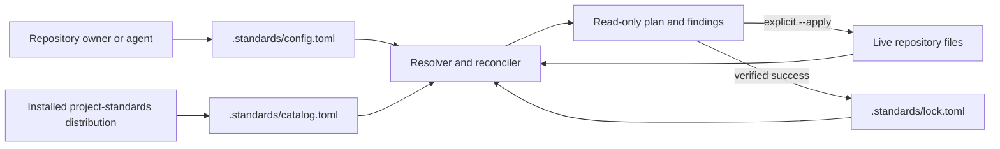
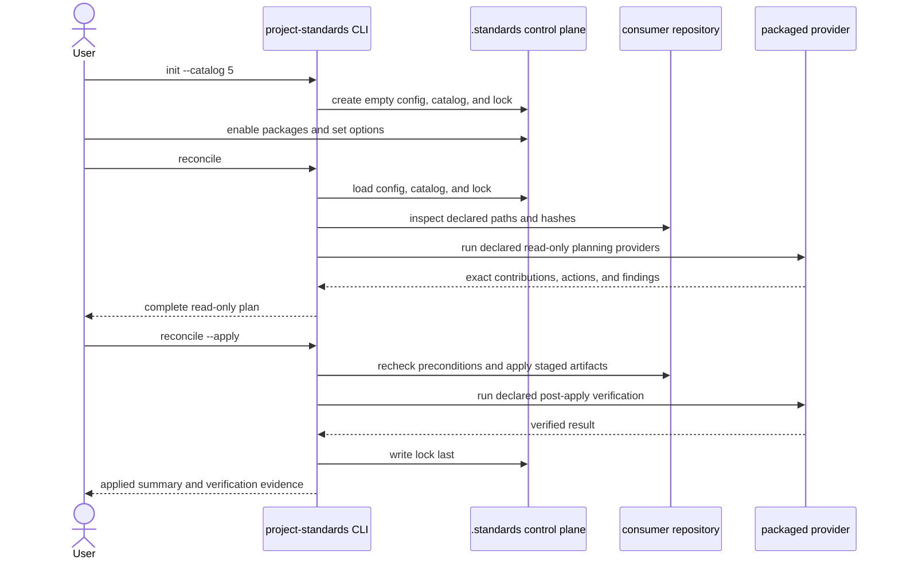

# Consumer Standards Control Plane — Specification (Full)

## Revision History

| Version | Date | Author | Change |
| --- | --- | --- | --- |
| 0.1 | 2026-07-10 | Codex with owner design review | Initial full specification from the approved control-plane, reconciliation, version-channel, migration, and safety design. |
| 0.2 | 2026-07-10 | Codex with specification review | Resolve round-1 findings and follow-up consistency gaps across recovery, migration, version transitions, provider phases, concurrency, package-local state, referenced extensions, ADR coverage, and examples. |
| 0.3 | 2026-07-10 | Codex with owner-approved round-2 review | Separate persistent accepted-major authorization from enabled/applied package state and define the exact three-file plain-init scaffold. |
| 0.4 | 2026-07-10 | Codex with converged review and owner direction | Clarify the audit-only role of accepted-track catalog lineage and approve the specification for implementation planning. |
| 0.5 | 2026-07-10 | Codex with owner-approved SPEC-BA02 reconciliation | Align desired config and package-payload examples with the fixed option namespace, canonical V2 payload tree, and installed projection already approved and implemented by SPEC-BA02; no behavior or scope changes. |
| 0.6 | 2026-07-11 | Codex implementation closeout | Record mechanism-level core evidence in requirement traceability; retain Partial or Not Started status for real-package migration, conversion, compatibility, catalog refresh, and activation work. No requirement or scope changes. |

**Spec lifecycle:** This document is living until `approved`, then change-controlled. Implementation deviations are recorded in the [Deviations Log](#deviations-log), not silently patched into requirements. The control plane is a v5 platform contract and must be approved before its implementation plan or the separate `project-toolbox` specification proceeds.

---

## 1. Purpose & Background

Consumer repositories currently adopt standards through package-specific procedures that copy files, print configuration fragments, invoke specialized commands, and sometimes maintain package-specific provenance state. The behavior works, but the consumer has no single inventory of available and installed standards, no unified desired-state file, no generic removal path, and no central lock describing which package owns each managed artifact. Configuration lives in `.project-standards.yml`, while adoption state is inferred from files or held by individual packages.

This specification introduces a consumer-side standards control plane rooted at `.standards/`. A consumer initializes one catalog line, selects independently adoptable standards and their options in one TOML file, previews a deterministic reconciliation plan, and explicitly applies installation, upgrade, repair, or removal. The installed `project-standards` distribution supplies a complete offline catalog, immutable versioned payloads, schemas, providers, and migrations. Validation remains read-only.

The design separates the SemVer `project-standards` release, each standard package's immutable `major.minor` payload version, the consumer's package selector, and any package-owned schema/behavior contract version. Absent a matching candidate authorization or accepted-major lock record, `version = 'latest'` selects the non-breaking default for the installed catalog major. A package option such as `contract_version` independently selects a supported consumer contract inside that payload. Breaking package majors may ship early as explicit candidates without forcing a catalog-major release. A consumer may opt into one by applying `latest` with authorization for the named package and target major, or may combine that authorization with an exact pin. The lock stores that accepted-major authorization independently from enabled/applied package state, so disable/re-enable cannot silently discard it; a later catalog major may promote that line to the ordinary default.

The resulting control plane is the foundation for a separate `project-toolbox` standard. That standard will provide provider-neutral, project-local workflows and skills without depending on GitHub or any other standard. It is deliberately specified after this platform contract so it can use one stable adoption, configuration, versioning, and drift model.

---

## 2. Scope

### 2.1 In Scope

- A neutral `project-standards init --catalog CATALOG_MAJOR` bootstrap that creates `.standards/` without enabling any standard.
- A unified `.standards/config.toml` for catalog selection, desired package state, version selectors, and package options under `standards.STANDARD_ID.config`.
- Tool-managed `.standards/catalog.toml` and `.standards/lock.toml` files.
- Package-owned resources and durable state under `.standards/packages/STANDARD_ID/` when no external discovery path is required.
- Optional consumer-owned referenced extensions under `.standards/extensions/STANDARD_ID/` when no conventional external path is required.
- Versioned configuration schemas for each consumer-facing package's fixed option namespace.
- Embedded, immutable payloads for every catalog-advertised installable package version.
- Catalog-scoped non-breaking defaults and opt-in breaking-candidate package versions.
- A read-only reconciliation planner and explicit apply path for install, update, repair, and removal.
- Central artifact ownership, provenance, shared-reference, effective-configuration, and a distinct persistent accepted-major authorization partition.
- Generic provider dispatch from trusted catalog manifests.
- Migration from `.project-standards.yml` and existing installed artifacts into the unified control plane.
- V5 read-only legacy-config compatibility and a v6 removal boundary.
- Compatibility work for every current standard package, adoption mode, provider, workflow, and artifact.
- A package-by-package composition and migration verification matrix.
- Governing ADRs plus amendments or supersession of conflicting ADRs and versioning policy.

### 2.2 Out of Scope (Non-Goals — never)

| ID | Non-Goal | Reason |
| --- | --- | --- |
| NG-001 | Mutate repository state during validation, CI checks, catalog inspection, or reconciliation planning. | Configuration and pull-request content are untrusted data; mutation requires explicit authorization. |
| NG-002 | Install or manage user-global, home-directory, machine-level, filesystem-root, or sibling-repository state. | Standard adoption is bounded to one consuming project. |
| NG-003 | Let consumer configuration define executable commands, Python entrypoints, remote artifact URLs, or arbitrary package sources. | Executable providers and payloads come only from the trusted installed catalog. |
| NG-004 | Force all installed artifacts under `.standards/`. | External tools and harnesses require conventional paths such as `.agents/skills/`, `.github/workflows/`, and `pyproject.toml`. |
| NG-005 | Create implicit hard dependencies between standard packages. | Packages remain independent by default and may only recommend companions or consume generic platform capabilities. |
| NG-006 | Implement the `project-toolbox` or `agent-managed-repo` standards in this specification. | Each is a separate standard with a separate authority boundary and specification. |
| NG-007 | Store secret values in configuration, catalogs, locks, payloads, logs, or migration reports. | Only credential references may be stored in repository documentation or configuration. |
| NG-008 | Silently merge legacy YAML and unified TOML configuration. | Two active configuration authorities would make resolution and migration ambiguous. |

### 2.3 Won't Have in v1 (deferred — not never)

| ID | Deferred Capability | Why Deferred | Revisit When |
| --- | --- | --- | --- |
| WH-001 | Remote or third-party standards registries. | The first release must prove deterministic first-party offline catalogs and package ownership. | The embedded catalog works across real consumers and a trust/signing design is approved. |
| WH-002 | Automatic self-update of the `project-standards` executable or its external workflow/package pin. | Package-manager and CI-pin mutation require a separate trust and rollout contract. | A catalog-major upgrade workflow is proven manually and separately specified. |
| WH-003 | Fleet-wide reconciliation across multiple repositories. | The authority boundary is one project; multi-repo mutation needs separate authorization and coordination. | Independent repository reconciliation is stable and an operator workflow is approved. |
| WH-004 | A general third-party extension marketplace for toolbox capabilities. | `project-toolbox` v1 will first prove managed core workflows and local extensions. | The separate toolbox standard's operational suite is stable. |

### 2.4 Boundaries

| Boundary | Description |
| --- | --- |
| System owns | Consumer control-plane schemas, loaders, catalog generation, version resolution, reconciliation, central lock state, embedded payloads, provider dispatch, migration, diagnostics, compatibility fixtures, and governing documentation. |
| System depends on | The installed `project-standards` distribution, one writable consumer repository for apply operations, TOML parsing, current standard manifests, artifact manifests, provider declarations, and external tools that consume materialized artifacts. |
| System does not own | The package manager or workflow pin that installed `project-standards`; consumer-authored project content; secrets; external tool semantics; remote repositories; or the policy content of individual standards. |

---

## 3. Context

### 3.1 Current State

The repository has a manifest-driven standard graph, explicit authorities and relationships, generated catalog documentation, an artifact-plane `adopt.toml`, provider declarations, provenance classes, managed/create-only installation policies, and project-local skill and hook placement. These are the correct primitives for composition.

The consumer surface remains fragmented:

- `.project-standards.yml` contains validator and package configuration but no complete standard inventory.
- `project-standards adopt` receives standard IDs imperatively and writes current bundle artifacts directly.
- Each packaged standard has one current `adopt.toml` payload even when its manifest lists several supported contract versions.
- Fragments require manual or package-specific merging.
- Generic install, update, removal, and central drift state do not exist.
- Agent Handoff maintains a package-specific provenance lock because no central consumer lock exists.
- Standard adoption guides repeat platform mechanics that should be common.
- Package `supported` versions and consumer-selectable contract versions are separate planes, but the current one-payload layout cannot install each claimed package version.
- Aggregate apply is not composition-safe today: Agent Handoff plus Python Tooling can partially write before colliding on `AGENTS.md`, Agent Handoff plus Markdown Frontmatter can collide on `.project-standards.yml`, and the specialized aggregate path drops non-handoff fragments.

### 3.2 Target State

Every initialized consumer carries a committed, reviewable control plane:

```text
.standards/
├── config.toml          # user-owned desired state and package options
├── catalog.toml         # tool-owned snapshot from the installed distribution
├── lock.toml            # tool-owned applied state and provenance
├── extensions/          # optional consumer-owned inputs; created only when needed
│   └── STANDARD_ID/
└── packages/            # package-owned state; created on first materialization
    └── STANDARD_ID/     # package-owned resources/state without required external paths
```

Plain init creates only the `.standards/` directory and its three TOML files; neither optional subdirectory exists yet. No package is enabled by default. The user then edits `config.toml` or uses equivalent CLI commands, previews reconciliation, and explicitly applies it. The planner resolves versions, validates package options, runs declared read-only planning providers, checks authorities and destinations, classifies changes, and reports every conflict before mutation. The executor alone writes the reviewed artifact plan, invokes declared read-only post-apply verification, and writes the lock last.

Files that external tools discover at fixed paths remain there. The lock records their owner, version, provenance, install policy, content hash, and shared references. Every durable entry below `packages/STANDARD_ID/` is likewise declared, centrally inventoried, and committed with the repository; transient or ignored runtime state does not belong in that namespace. Consumer-owned package inputs may use `extensions/STANDARD_ID/` when no conventional path is needed; packages may read and hash those referenced inputs but never manage their content. Package-specific duplicate locks are retired.

### 3.3 Assumptions

| ID | Assumption | Impact if False |
| --- | --- | --- |
| A-001 | Consumers commit the durable `.standards/` tree, including `config.toml`, `catalog.toml`, `lock.toml`, declared package-owned entries under `packages/`, and any consumer-authored referenced inputs under `extensions/`. | Reproducibility and review require a different durable-state mechanism. |
| A-002 | The installed `project-standards` distribution is the trusted source for catalog metadata, payloads, schemas, providers, and migrations. | Remote trust, signatures, and source resolution must be specified before reconciliation can proceed. |
| A-003 | Standard payloads are small enough that retaining supported immutable versions in the distribution is practical. | A content-addressed external package store becomes necessary. |
| A-004 | The `project-standards` major release is the default compatibility boundary for package `latest` resolution. | A separate catalog-version authority and upgrade policy are required. |
| A-005 | Existing package artifacts can be classified as managed, create-only, shared, or consumer-owned without losing required behavior. | A package-specific exception and migration strategy are required before that package can move. |

### 3.4 Constraints

| ID | Constraint | Source |
| --- | --- | --- |
| C-001 | The control plane must launch with v5 and remain compatible with every v5 consumer-facing standard. | Owner scope decision. |
| C-002 | Initialization enables no standard and writes only the minimum `.standards/` scaffold unless migration is explicitly requested. | Owner design decision. |
| C-003 | Validation and planning are read-only; apply is explicit. | Owner safety decision. |
| C-004 | Without matching candidate authorization or a previously accepted-major track, `version = 'latest'` must remain on the non-breaking default within one catalog major. | Owner version-channel decision. |
| C-005 | A breaking package major may be catalog-advertised before promotion but requires package-specific explicit authorization. | Owner version-channel decision. |
| C-006 | A previously authorized package major must not be silently downgraded or forgotten during reconciliation, disable, or re-enable. | Owner reconciliation decision. |
| C-007 | Every ordinary package option must be expressible in `.standards/config.toml`. | Owner unified-configuration decision. |
| C-008 | All catalog-advertised installable versions must work offline from the installed distribution. | Owner payload decision. |
| C-009 | Standards remain independently selectable and must not require another standard. | ADR 0013 and owner confirmation. |
| C-010 | Existing user-authored content and unrelated dirty-tree changes must be preserved. | Repository working rules and adoption safety contract. |

---

## 4. Goals

| ID | Goal | Success Signal | Achieved By |
| --- | --- | --- | --- |
| G-001 | Give consumers one neutral standards entry point. | An empty repository initializes a valid control plane with no enabled package. | FR-001, FR-002, FR-017 |
| G-002 | Make desired, applied, and persistent authorization state explicit. | Configuration, catalog, applied package state, accepted-major authorization, and package-local state validate, accurately describe a reconciled repository, and have bounded recovery when one authority is missing. | FR-003–FR-006, FR-032, FR-034 |
| G-003 | Make adoption lifecycle safe and repeatable. | Install, update, repair, and removal plans are deterministic, reviewable, explicit, idempotent, and concurrency-safe. | FR-007–FR-010, FR-029, FR-034–FR-036, NFR-001–NFR-004, NFR-009 |
| G-004 | Support non-breaking defaults and opt-in breaking candidates. | Catalog tests prove `latest`, pins, candidate authorization, disable/re-enable retention, explicit exit, and promotion semantics. | FR-011–FR-016, FR-033 |
| G-005 | Preserve independent package composition. | Each package, all pairs, and the full supported set reconcile without undeclared dependencies or ownership conflicts. | FR-018–FR-023, FR-029, FR-031, FR-035 |
| G-006 | Centralize user-selectable package configuration. | Every normal option validates under its owned namespace and materializes through its package provider without conflating package and consumer contracts. | FR-003, FR-004, FR-024, FR-030, FR-036 |
| G-007 | Preserve offline reproducibility. | An installed-wheel test initializes and reconciles every advertised version without network access. | FR-005, FR-006, FR-016, FR-028 |
| G-008 | Provide a stable foundation for `project-toolbox`. | The later toolbox spec can declare workflows, skills, options, and managed artifacts without new adoption machinery. | FR-018, FR-019, FR-024 |

---

## 5. Stakeholders and Users

| Role / Stakeholder | Concern | Involvement |
| --- | --- | --- |
| Consumer repository owner | Understandable package choices, safe updates, explicit breaking opt-in, and low repository clutter. | Selects catalog/package versions, approves apply operations, and reviews migrations. |
| Standard package author | Stable package schema, version/promotion rules, provider contract, and compatibility gates. | Authors versioned payloads, config schemas, migrations, tests, and documentation. |
| Coding agent | Deterministic inventory, instructions, ownership, safe commands, and actionable findings. | Plans and applies authorized changes under the spec and installed skills. |
| `project-standards` maintainer | Coherent releases, migration support, manageable wheel size, and enforceable compatibility. | Implements platform code, publishes catalogs, and approves ADRs. |
| CI and review systems | Read-only, reproducible validation with no hidden mutation. | Validate config, lock, package conformance, and repository drift. |

---

## 6. Glossary

| Term | Definition | Notes / Not to be confused with |
| --- | --- | --- |
| Control plane | The `.standards/` files and `project-standards` behavior that describe and reconcile consumer standard state. | Does not replace externally discovered tool configuration. |
| Catalog major | The `project-standards` major release line selected in `config.toml`, such as `5`. | The compatibility boundary for ordinary `latest` resolution. |
| Tool release | Exact SemVer version of the installed `project-standards` distribution, such as `5.3.0`. | Different from package `major.minor` versions. |
| Standard package version | Immutable `major.minor` contract and payload for one standard. | Several package versions may exist in one catalog release. |
| Consumer contract version | Package-owned schema or behavior version selected as a standard option, such as the Markdown Frontmatter schema contract. | Not the package payload selector and never inferred from it. |
| Default track | Ordinary package version resolved by `version = 'latest'` for the selected catalog major. | Used when no matching candidate authorization or accepted-major track overrides ordinary resolution; remains non-breaking within that catalog major. |
| Breaking candidate | Available package major excluded from ordinary `latest` resolution until explicitly authorized or promoted in a later catalog major. | Released and installable, but not the catalog default. |
| Desired state | User-owned package selection and options in `config.toml`. | Not proof that artifacts are installed. |
| Applied state | Tool-owned enabled-package resolutions, options, ownership, and provenance in `lock.toml`. | Written only after successful apply and verification; removed for a successfully disabled package. |
| Accepted-major track | Tool-owned authorization for one non-default package major, stored separately from enabled-package applied state in `lock.toml`. | Survives disable/re-enable; removed or replaced only by an authorized exit/transition or matching catalog promotion. |
| Versioned payload | Immutable package resources, artifact manifest, config schema, providers, migrations, documentation, and digest for one version. | The current one-payload bundle is insufficient for candidate versions. |
| Reconciliation | Comparing desired state, catalog, lock, and live files to plan or apply convergent changes. | Planning is read-only; apply is explicit. |
| Managed artifact | Package-owned file that the reconciler may update or remove only when its recorded preconditions hold. | Different from create-only and consumer-owned content. |
| Referenced extension | Consumer-owned package input named by a typed config option and hashed as a reconciliation input. | Prefer `.standards/extensions/STANDARD_ID/` unless an external tool requires a conventional path; never place it in the package-owned namespace. |
| Semantic contribution | A package-owned, key- or marker-scoped change composed with other contributions against one virtual planned tree. | Replaces unowned printed fragments and whole-file collisions for shared structured/instruction files. |

---

## 7. Requirements

### 7.1 Functional Requirements

| ID | Requirement | Rationale | Acceptance Criteria | Priority |
| --- | --- | --- | --- | --- |
| FR-001 | The system shall provide `project-standards init --catalog CATALOG_MAJOR` to create `.standards/` and exactly three regular files—`config.toml`, `catalog.toml`, and `lock.toml`—when no legacy or unified control-plane authority exists. | Consumers need one neutral, Git-trackable bootstrap with no placeholder state. | A fresh-repository fixture initializes successfully, enumerates exactly those three files, and validates all three schemas. | Must |
| FR-002 | Initialization shall enable no standard and shall write no other path inside or outside `.standards/` unless legacy migration is explicitly requested; plain init shall stop without writes when it detects legacy authority. If init fails before publishing any scaffold file, it shall remove the transient empty `.standards/` directory created solely for locking. | Bootstrap must not impose a policy bundle, create split authority, or leave failed-init debris. | Filesystem assertions prove successful plain init creates only FR-001's three files—no optional directory, placeholder, ignore file, or lock artifact—and every pre-publication failure restores the prior tree. | Must |
| FR-003 | `config.toml` shall declare the expected catalog major and, under each `standards.STANDARD_ID` record, the enabled state, version selector, and package settings in its `config` table. | Desired state and options need one user-owned source. | Schema fixtures accept valid selectors/settings and reject unknown or misplaced keys. | Must |
| FR-004 | Every consumer-facing package version shall publish a machine-readable configuration schema with defaults for its fixed `standards.STANDARD_ID.config` namespace. | Options must be version-aware and collision-free. | Catalog validation rejects missing schemas, invalid defaults, and options outside the selected package record. | Must |
| FR-005 | `catalog.toml` shall list every package available in the installed distribution, including non-enabled, reference-only, internal, stable, retained, and candidate versions. | Users and tools need complete local discovery. | The generated catalog matches packaged manifests and includes all graph nodes and version channels. | Must |
| FR-006 | `lock.toml` shall record the exact tool release, catalog major and digest, config digest, enabled-package applied records, effective-option digests, artifact ownership/provenance/hashes, referenced-input paths/digests, shared references, and accepted package-major tracks in a separate persistent authorization partition. | Applied state and authorization history must be reproducible without conflating disabled packages with installed ones. | Lock schema and reconciliation tests detect every material mismatch, keep disabled packages out of applied records, retain their accepted tracks, and assign no managed ownership to referenced inputs. | Must |
| FR-007 | `project-standards reconcile` shall build and display a complete read-only plan from config, catalog, lock, live repository state, and a virtual tree containing every planned semantic contribution. | Users must inspect changes before mutation, and cross-package conflicts must be known before writes. | Plan fixtures cover create, semantic merge, update, repair, remove, preserve, no-op, and conflict actions without filesystem writes. | Must |
| FR-008 | `project-standards reconcile --apply` shall execute only a conflict-free plan, run post-apply verification, and write the lock last. | Mutation requires explicit, recoverable authorization. | Apply tests prove precondition rechecks, atomic replacement, verification, and lock-last behavior. | Must |
| FR-009 | `project-standards validate` and `reconcile --check` shall report desired-state, lock, config, catalog, and artifact drift without applying changes. | Validation and CI must remain safe. | Mutation spies prove all validation/check paths are read-only. | Must |
| FR-010 | `standards disable` shall set `enabled = false` while preserving the package's selector and options. Successful reconciliation shall remove the package's applied record and only unchanged, exclusively owned managed artifacts, including package-local artifacts under `.standards/packages/STANDARD_ID/`; it shall retain any accepted-major track and preserve shared, create-only, consumer-owned, modified, and ambiguous content. A modified or undeclared package-namespace entry shall block removal, and the empty namespace shall be pruned only after every declared entry is removed safely. | Removal must not destroy project work or silently revoke version authorization. | Removal fixtures verify config preservation, applied-record removal, accepted-track retention, content preservation, reference counting, package-local conflict handling, namespace pruning, and actionable findings. | Must |
| FR-011 | Within a selected catalog major, `version = 'latest'` shall resolve to the package's declared non-breaking default, not necessarily the numerically highest available version, unless the current apply carries matching FR-013 authorization or the lock's independent authorization partition carries an FR-014 accepted-major track. | Breaking candidates must not surprise ordinary consumers while explicit and durable opt-ins remain usable across disable/re-enable. | Resolver tests keep ordinary consumers on the compatible default and exercise only the two declared candidate-track exceptions, including re-enable from a retained track. | Must |
| FR-012 | Consumers shall be able to pin an exact catalog-advertised package version. | Projects need deterministic opt-out from automatic package updates. | Exact-pin fixtures remain unchanged across compatible catalog refreshes. | Must |
| FR-013 | A catalog may advertise a breaking package candidate, but entry to a major that is not the selected catalog's default shall require `--allow-major STANDARD_ID@TARGET_MAJOR` or equivalent authorization matching both package and target major. With `version = 'latest'`, authorization shall select the newest compatible advertised candidate within that major; an exact selector shall remain an exact pin. A bare package ID shall never choose among candidate majors. | Package betas should ship without forcing a tool-major release, weakening pins, or creating ambiguous candidate selection. | Candidate fixtures cover `latest` and exact pins, fail closed without matching target-major authorization, isolate authorization to one package/major, and remain deterministic with several candidate majors and versions. | Must |
| FR-014 | After a breaking package major is authorized, the independent accepted-track record shall survive package disablement. Ordinary reconciliation or re-enable with `version = 'latest'` shall retain that major and track compatible updates within it without repeated authorization or silent downgrade; an exact selector shall remain fixed under FR-012. | Authorization must be durable and convergent without weakening explicit pins or depending on continuous enablement. | Lock/resolver tests preserve the track through disable, remove only applied package state, resume and update the accepted `latest` major on re-enable, and keep exact candidate pins fixed. | Must |
| FR-015 | Promoting a breaking candidate to the ordinary default track shall require a new `project-standards` catalog major. For packages following the prior catalog's default track, the consumer's explicit catalog-major transition and apply shall authorize the new catalog's declared defaults without redundant package flags. Exact selectors shall remain fixed and accepted tracks on a different major shall remain sticky; any accepted-track record matching the promoted default major shall normalize to the ordinary default and be removed, whether the selector is `latest` or exact and whether the package is enabled or disabled. | Default-track breaking changes need one explicit consumer boundary without double authorization or silent loss of stronger package intent. | Release-policy and upgrade tests reject default package-major changes within one tool major, apply promoted defaults only after catalog-major opt-in, preserve exact selectors and different-major accepted tracks, and normalize every matching enabled and disabled track without changing an exact selected version. | Must |
| FR-016 | Every catalog-advertised installable package version shall have an embedded immutable payload containing version-specific manifests, documentation/resources, config schema, providers, migrations, and digest metadata. | Multiple selectable versions must be genuinely installable offline. | Installed-wheel tests adopt every advertised version with network access disabled. | Must |
| FR-017 | The catalog control plane shall be the single supported entry point for new adoption; the v5 `adopt` command shall remain only as a compatibility wrapper over init, desired-state update, and reconciliation. | Package guides should not reimplement platform mechanics. | CLI tests prove wrapper equivalence and emit the documented deprecation notice. | Must |
| FR-018 | Reconciliation shall invoke only manifest-declared providers from the trusted installed payload selected for the resolved package version and only according to their declared phase and side-effect contract. | Package behavior must remain generic without arbitrary or mistimed execution. | Provider tests reject config-supplied entrypoints, dispatch the version-correct packaged provider, and reject undeclared phases or effects. | Must |
| FR-019 | Package resources and durable state that need no conventional discovery path shall live under `.standards/packages/STANDARD_ID/`; required external artifacts shall remain at their declared consumer paths and be centrally locked. | The control plane should reduce clutter without breaking third-party discovery. | Path-policy tests accept both classes and reject undeclared destinations. | Must |
| FR-020 | The central lock shall replace package-specific artifact/provenance locks; specialized package-local durable state may remain only under `.standards/packages/STANDARD_ID/` without duplicating the central inventory. | Applied state needs one authority. | Agent Handoff migration tests import and retire its prior lock without losing required state. | Must |
| FR-021 | The system shall provide a previewable and explicitly applied migration from legacy YAML configuration and recognized installed artifacts into the unified control plane; a successful apply shall retire `.project-standards.yml` as a visible removal action only after every recognized setting is represented and the unified state validates. | Existing consumers need a safe v5 path, and the result cannot retain two configuration authorities. | Migration fixtures cover every current namespace, package, ownership class, ambiguous-state stop, previewed legacy-file removal, failure preservation, and an applied state in which the legacy path is absent. | Must |
| FR-022 | During v5, validation may read `.project-standards.yml` only when unified config is absent and shall emit a migration warning; both files together shall fail as split authority, and v6 shall remove legacy support. | Migration needs a bounded compatibility window. | Legacy-mode fixtures prove read-only fallback, dual-file rejection, and the documented removal gate. | Must |
| FR-023 | Every current standard package shall work independently and in supported composition after migration to the control plane. | V5 cannot strand existing standards. | Individual, all-pairs, and all-packages real-apply fixtures pass from both fresh and migrated states, followed by every enabled package validator. | Must |
| FR-024 | Every normal user-selectable package option shall be expressible in `config.toml`; packages shall materialize required external tool config from that desired state. A separate consumer-owned config file is allowed only as an explicitly typed, repository-relative reference, outside `.standards/packages/`, when the data is unsuitable for ordinary TOML options or an external tool requires its own file. | Consumers need one configuration authority without pretending every specialized external format is inline TOML. | Configurable-package fixtures validate options, defaults, referenced extensions, materialization, drift, version migration, and rejection of undeclared or package-owned reference paths. | Must |
| FR-025 | Reconciliation under a newer installed tool release in the same configured catalog major shall preview and apply the new generated catalog snapshot and compatible package updates. | Minor and patch catalog improvements should flow without config edits. | Same-major refresh fixtures update catalog/lock while preserving pins and non-breaking defaults. | Must |
| FR-026 | The CLI shall provide list, inspect, enable, disable, and version-selection operations that make explicit edits equivalent to manual `config.toml` changes; disable shall change only `enabled` unless the user separately edits selector/options. | Users and agents need discoverable, non-destructive configuration helpers. | Round-trip tests prove CLI edits produce schema-valid config, preserve selector/options on disable, and yield the same reconciliation plan as equivalent manual edits. | Should |
| FR-027 | Consumer adoption guides shall describe package-specific suitability, options, artifacts, companions, and verification while delegating common install, version, lock, upgrade, and removal mechanics to the control-plane guide. | Package procedures should stay concise and consistent. | Documentation tests and review show no package repeats or contradicts platform adoption mechanics. | Must |
| FR-028 | Init, catalog inspection, planning, apply, validation, migration, and package-provider execution shall require no network access for catalog-advertised content. | Reconciliation must be deterministic and available offline. | Installed-wheel end-to-end tests pass with network access disabled. | Must |
| FR-029 | The planner shall compose every structured-file, config, and bounded-instruction contribution against one virtual planned tree before writing; package integrations shall declare semantic ownership instead of printing untracked fragments or competing for whole files. | Current aggregate adoption can drop fragments or partially write before discovering collisions. | Real-apply fixtures for every package pair and the full set prove preflight composition of TOML, YAML, JSON, Markdown blocks, VS Code files, and workflow artifacts. | Must |
| FR-030 | Package selection and consumer contract selection shall remain distinct: `standards.STANDARD_ID.version` selects an installable package payload, while any schema/behavior contract version is a versioned package option under `config`. | Existing package and registry contract versions are different and cannot be reinterpreted safely. | Migration and resolver tests preserve both values independently for every currently registered contract. | Must |
| FR-031 | The implementation shall replace approved SPEC-BA01 with a separately reviewed SPEC-BA02 for the breaking Standard Bundle Authoring contract, while retaining SPEC-BA01 and its completed plan as history. | Versioned payloads, channels, config schemas, migrations, and central reconciliation materially change the authoring contract. | SPEC-BA02 is approved, indexed, and traceable before authoring-standard implementation begins. | Must |
| FR-032 | The system shall detect an incomplete control plane and provide a read-only recovery plan: regenerate a missing catalog from the matching installed distribution, reconstruct a missing lock only from config plus unambiguous payload/content evidence, and refuse to infer or recreate missing user-owned config. Missing-lock reconstruction shall never infer accepted-major authorization history. | Committed control-plane files may be lost independently through merges or manual deletion. | Missing-file fixtures cover every combination, require explicit `--repair-state --apply` for lock reconstruction, re-require candidate authorization when needed, and never invent desired config, managed ownership, or accepted tracks. | Must |
| FR-033 | Any package-major transition outside FR-015's explicit catalog-major promotion of a prior default track, including entry to or exit from an accepted candidate, shall require matching `--allow-major STANDARD_ID@TARGET_MAJOR` authorization and a declared migration or rollback path. Candidate entry may use `latest` resolution from FR-013 or an exact pin; exit from an accepted major shall require an exact target version even after disablement. Successful transition shall replace the independent accepted-track record when the target remains non-default or remove it when the target is the selected catalog's default major; changing that exact selector back to `latest` on the already recorded major shall require no further authorization. | Candidate opt-in must be reversible without silent downgrade, ambiguous selection, weakened pin semantics, disable/re-enable bypass, or redundant authorization during a catalog-major upgrade. | Tests cover `latest` and pinned entry, exact-target exit before and after disable, several candidate majors, successful and refused downgrade, absent migration/rollback support, target-major matching, catalog-promotion exemption, sticky pins/tracks, authorization-record replacement/removal, and subsequent same-major `latest` behavior. | Must |
| FR-034 | Every durable entry materialized under `.standards/packages/STANDARD_ID/` shall be declared by the selected payload or a bounded provider-output contract, committed and reviewable with the repository, and inventoried in the central lock with ownership, provenance, policy, and content digest. Packages shall not store transient, cache, ignored, secret, or separately locked state there. | Package namespaces need the same reproducibility, drift, and lifecycle guarantees as conventional-path artifacts. | Fixtures prove package-local creation and hashing, edit drift, safe update/removal, modified and undeclared-content conflicts, empty-directory pruning, and absence of transient or duplicate lock state. | Must |
| FR-035 | Every catalog provider shall declare a phase and effect contract. Read-only planning, validation, extraction, and verification providers shall consume declared immutable input snapshots and return typed outputs. Operations that intend repository mutation, including `fix`, `scaffold`, and `upgrade`, shall return a complete typed mutation plan for platform-executor apply rather than write directly. An existing explicit mutating CLI invocation may remain the apply authorization for its non-reconciliation authoring operation; reconciliation itself still requires `--apply`. The executor shall be the only supported repository writer, and legacy direct-write providers shall not be advertised as v5-compatible. | A complete preflight plan and compatible generic provider model are impossible if package code may introduce unplanned writes. | Graph, payload, installed-wheel, and filesystem-spy tests inventory every provider, prove current mutating operations return complete plans without changing the live fixture, preserve documented CLI authorization behavior, reject undeclared returned effects before executor invocation, and prove executor-only application plus read-only post-apply verification. | Must |
| FR-036 | Explicitly referenced package extensions shall remain consumer-owned and repository-relative, be declared through the resolved package's config schema, and live outside `.standards/packages/STANDARD_ID/`; `.standards/extensions/STANDARD_ID/` is the preferred location when no conventional external path is required. After canonical path resolution, a referenced input shall not overlap any applied or planned managed artifact or semantic target in v1. The central lock shall record its path and digest without claiming, overwriting, or deleting content; disabling the package shall remove only the lock reference and preserve the file. | Specialized package input needs a reproducible authority boundary distinct from package-managed state and output ownership. | Tests cover preferred and conventional paths, path/symlink containment, missing/changed input, lock digest updates, disable/re-enable preservation, and rejection of package-namespace or current/planned-output aliases across packages. | Must |

### 7.2 Non-Functional Requirements

| ID | Category | Requirement | Measurement / Acceptance Criteria | Priority |
| --- | --- | --- | --- | --- |
| NFR-001 | Determinism | Identical config, catalog, lock, and live-file inputs shall produce byte-identical plans and generated control-plane files. | Golden-plan tests and repeated generation produce no diff. | Must |
| NFR-002 | Idempotency | A second successful init, migration, or reconciliation shall produce no repository change. | Every end-to-end fixture runs the operation twice and asserts an empty second diff. | Must |
| NFR-003 | Safety | All reads and writes shall remain within the resolved repository root and reject traversal, absolute paths, symlink escape, and global destinations. | Boundary and adversarial path tests cover every file operation. | Must |
| NFR-004 | Recoverability | Interrupted or failed apply operations shall leave the previous lock authoritative and produce enough evidence for the next run to detect and repair partial state. | Fault-injection tests cover each write/verify boundary. | Must |
| NFR-005 | Performance | Planning a catalog of 100 packages and 1,000 artifacts shall complete within five seconds on the repository's normal Linux CI runner, excluding package-specific external validators. | A deterministic performance test or benchmark records the threshold. | Should |
| NFR-006 | Maintainability | Adding a package or package version shall require manifest/payload registration, not a package-specific branch in shared init, resolver, planner, executor, or validator code. | Architecture tests and review find no package-ID dispatch outside declared adapters/providers. | Must |
| NFR-007 | Compatibility | The v5 implementation shall preserve all current supported package behavior or document and test an approved v5 migration. | Compatibility matrix and installed-wheel fixtures pass for every package. | Must |
| NFR-008 | Diagnostics | Every read-only and mutating command shall provide stable human output and structured `--json` findings/actions with documented exit codes. | CLI contract tests snapshot success, drift, conflict, config error, and apply failure outputs. | Should |
| NFR-009 | Concurrency | Every initialized-repository command shall take a non-blocking advisory lock on the `.standards/` directory: shared for read-only operations and exclusive for config edits, migration, repair, and apply. Init may atomically create the directory before taking its exclusive lock but shall write no file first; a pre-publication failure shall remove that transient empty directory. | Multiprocess tests prove concurrent readers succeed, concurrent mutation/read-versus-write fails with a stable finding, the lock spans post-apply verification and lock replacement, failed init cleans up, and process exit releases it without a committed or ignored lock file. | Must |

### 7.3 Interface Requirements

| ID | Interface | Requirement | Contract / Format | Acceptance Criteria |
| --- | --- | --- | --- | --- |
| IR-001 | CLI bootstrap | The system shall expose `project-standards init --catalog CATALOG_MAJOR [--migrate] [--apply]`. | Local CLI; preview unless an apply flag is present for migration. | Help, argument, JSON, idempotency, and filesystem tests pass. |
| IR-002 | CLI package selection | The system shall expose the `standards list`, `show`, `enable`, `disable`, and `version` operations. | Edits only `.standards/config.toml`; supports human and JSON output. | CLI/manual-edit plan equivalence passes. |
| IR-003 | CLI reconciliation | The system shall expose `project-standards reconcile [--check] [--apply] [--allow-major ID@MAJOR] [--repair-state]`. | Plan by default; check is read-only; apply mutates; repeatable authorization is package-and-target-major scoped; repair is explicit. | Full command matrix, ambiguous-candidate, and exit-code tests pass. |
| IR-004 | CLI validation | Existing validators and generic providers shall resolve unified config by repository root and accept explicit override only for supported migration/debug use. | `.standards/config.toml` is canonical; legacy fallback is v5-only. | Every validator and reusable workflow passes unified-config fixtures. |
| IR-005 | Desired-state file | `.standards/config.toml` shall use a versioned TOML schema with a platform container and package-keyed `standards` records whose `config` tables are validated by the selected payload. | UTF-8 TOML; repository-relative references only. | Schema, formatter, migration, and round-trip tests pass. |
| IR-006 | Catalog and lock files | `.standards/catalog.toml` and `.standards/lock.toml` shall use generated canonical TOML with stable ordering. | Tool-owned UTF-8 TOML; committed and reviewable. | Generation is deterministic and parser/generator round trips are lossless. |

### 7.4 Data Requirements

| ID | Data Entity | Requirement | Validation Rules | Ownership |
| --- | --- | --- | --- | --- |
| DR-001 | Desired config | Store catalog-major intent, package selectors, and package settings without applied-state claims. | Versioned schema; declared namespaces/options only; no secrets or executable values. | Consumer-owned. |
| DR-002 | Catalog snapshot | Store the complete inventory and version-channel metadata supplied by the installed distribution. | Must match the installed catalog digest and configured major; no consumer edits. | Platform-owned. |
| DR-003 | Central lock | Store enabled-package applied records separately from persistent accepted-major authorization records, plus digests, effective config, referenced inputs, artifacts, owners, policies, and shared references. | Written last; canonical order; disabled packages have no applied record; accepted tracks contain only standard ID by key, accepted non-default major, and authorizing catalog lineage; artifact/input hashes verify; referenced inputs carry no managed owner; no duplicate package locks. | Platform-owned. |
| DR-004 | Versioned payload | Retain one immutable complete payload per advertised package version. | Version/digest identity, contained paths, config schema, manifests, resources, providers, and migration graph required. | Standard package-owned. |
| DR-005 | Package-local durable state | Store deterministic, non-generic package resources or state only below `.standards/packages/STANDARD_ID/`. | Every entry is declared by the selected payload or provider-output contract, committed, centrally inventoried and hashed; no transient/cache data, ignore-only paths, secrets, or duplicate locks. | Declaring package-owned. |
| DR-006 | Migration evidence | Report legacy sources, inferred ownership, preserved ambiguity, and applied conversion without storing sensitive content. | Repository-confined; read-only until apply; stable JSON schema. | Platform-owned report; consumer owns source content. |
| DR-007 | Referenced extension | Store specialized consumer-authored package input at an explicitly configured repository-relative path, preferably `.standards/extensions/STANDARD_ID/` when no conventional path is required. | Resolved schema declares the reference; canonical path is contained, outside `.standards/packages/`, and disjoint from every applied/planned managed or semantic target; lock records path/digest as input, never managed ownership; no secrets. | Consumer-owned. |

---

## 8. Architecture and Design

### 8.1 Architecture Summary

The installed distribution is a trusted, versioned local catalog. Initialization materializes its catalog snapshot and empty desired/applied/authorization state into the consumer repository. Package selection remains declarative. The central lock has separate enabled-package and accepted-track partitions. A resolver combines the configured catalog major, installed tool release, catalog channels, exact selectors, and persistent accepted-major authorization independently of whether a package is currently enabled. It chooses one immutable payload per enabled package before package options are validated against that payload's schema.

The planner compares resolved desired state with the central lock and live files. It uses existing authority, destination, provenance, install-policy, and relationship metadata to classify actions and conflicts. Package-specific behavior enters only through version-selected manifest providers. The executor stages content, rechecks preconditions, applies contained writes, invokes verification, and updates the central lock last.

Legacy migration is an adapter into the same models. It parses recognized configuration, inventories declared signals and content matches, preserves ambiguity, and produces a normal reconciliation plan. It does not create a parallel migration engine.

### 8.2 Architecture Views

#### 8.2.1 Context View



#### 8.2.2 Package Payload View

```text
standards/STANDARD_ID/
├── README.md
├── standard.toml               # V2 family index
└── versions/
    └── PACKAGE_VERSION/
        ├── payload.toml
        ├── config.schema.json
        ├── README.md
        ├── agent-summary.md
        ├── adopt.md             # consumer availability only
        └── ...                  # every additional regular file is declared

src/project_standards/payloads/STANDARD_ID/PACKAGE_VERSION/
└── relative file symlinks to the canonical payload
```

The top-level `standard.toml` indexes immutable package versions and their aggregate digests. Repository-owned `catalogs/CATALOG_MAJOR.toml` assigns version channels separately. Each version's `payload.toml` freezes its identity, options, outputs, providers, migrations, and complete resource inventory. The symlink-only installed projection preserves one authored source while wheel tests prove byte-identical payload parity.

#### 8.2.3 Component View

| Component | Responsibility | Interfaces | Key Constraint |
| --- | --- | --- | --- |
| Bootstrap service | Create the neutral control plane and route optional legacy migration. | `init`; config/catalog/lock generators. | Enables no package by default. |
| Control-plane models | Parse and validate config, catalog, lock, package release, and migration report schemas. | Typed Python models and generated schemas. | Reject unknown keys and invalid ownership. |
| Catalog builder | Build the complete snapshot from graph manifests and embedded payloads. | Installed distribution resources; `catalog.toml`. | Deterministic, offline, catalog-major scoped. |
| Version resolver | Resolve exact, default, retained, and candidate tracks. | Config, catalog, enabled-package lock records, independent accepted-track records, authorization flags. | Never silently cross, forget, or downgrade a package major through disable/re-enable. |
| Reconciliation planner | Produce ordered actions and conflicts from desired/applied/live state. | Artifact manifests, authorities, relationships, hashes, read-only planning providers. | May invoke declared deterministic planning providers; performs no writes. |
| Executor | Apply a validated plan and verify it. | Staged files, read-only verification providers, filesystem adapter. | Sole artifact writer; contained writes; lock written last. |
| Provider runner | Invoke version-selected package behavior according to declared phase/effects. | Manifest operation, trusted entrypoint, immutable input snapshots, typed findings/content/mutation plans. | No config-defined executable surface or direct repository mutation; mutating intent returns a plan. |
| Semantic adapter registry | Compose owned TOML/YAML/JSON keys, Markdown blocks, and set-like contributions against the virtual tree. | Typed contribution declarations and format-specific adapters. | Detect every overlap before writes; preserve unrelated content. |
| Migrator | Convert legacy config/state into control-plane inputs. | YAML/config adapters and declared package signatures. | Preserve ambiguity and user content. |
| Compatibility suite | Prove each package and composition works. | Source and installed-wheel fixtures. | Package-complete, not sample-only. |

#### Current Package Migration Matrix

| Package | Current Consumer Surface | Required V5 Control-Plane Migration |
| --- | --- | --- |
| `adr` | Validator package; `markdown.adr` YAML config, ADR template, config fragment, and two validation providers. | Move settings to `config.markdown.adr`, add a versioned payload/schema, remove the fragment, preserve Frontmatter compatibility metadata, and eliminate or explicitly resolve the current hidden Frontmatter adoption dependency. |
| `agent-handoff` | CLI package; strict YAML config, create-only knowledge, managed skill/hook, semantic harness/instruction integrations, specialized providers, and a separate lock. | Move options to `config.agent_handoff`, keep knowledge create-only, move generic ownership to the central planner/lock, convert scaffold/upgrade and rendering operations to typed plans, retain read-only validation providers, store non-discovered policy under its package directory, and retire its lock. |
| `cli-documentation` | Copy-adopt package; metadata-only YAML version, consumer usage doc, GitHub workflow, printed config fragment, and workflow drift provider. | Add package options for profile/entrypoint/CI, make the usage doc create-only, generate or externalize editable workflow values, remove the fragment, and make GitHub/Python assumptions conditional. |
| `markdown-frontmatter` | Validator package; whole YAML config, GitHub caller, skill/script files, validators, and formatter. | Move all settings to `config.markdown.frontmatter`, keep package and schema contract versions distinct, convert formatter fixes to typed plans, update every tool/skill/workflow to unified config and lock resolution, and remove whole-config ownership. |
| `markdown-tooling` | Copy-adopt package; Markdown configs, shared EditorConfig/VS Code recommendations, two GitHub callers, workflow providers, and manual instruction/settings guidance. | Add lint/format/CI options, classify managed versus extensible root config, semantically union per-package VS Code/instruction contributions, centrally lock shared ownership, and compose exclusions required by other packages. |
| `project-spec` | CLI package; `spec` YAML config, validation workflow, templates, and six providers. | Move settings to `config.spec`, bind templates/providers/workflow to the resolved payload, convert scaffold/upgrade to typed plans, remove the fragment/YAML grep, and encode its separate-doc-schema scope relative to Frontmatter. |
| `python-coding` | Draft reference-only package with documentation-only semantic review and no artifacts/config. | Keep catalog-visible but non-default while draft; advertise only reconstructed payloads, optionally materialize reference resources under its package directory, and perform no root writes. |
| `python-tooling` | Copy-adopt package; metadata-only YAML version, `pyproject.toml` fragment, Python/workflow/script files, whole agent instructions and VS Code files, shared artifacts, and workflow validation. | Add a comprehensive option schema, semantically compose root/config/instruction/VS Code contributions, make type-checker selection fan out coherently, preflight key-level `pyproject.toml` ownership, and add mandatory real-apply tests with Agent Handoff and Markdown Tooling. |
| `standard-bundle-authoring` | Internal non-adoptable package defining the current singleton manifest/payload contract. | Keep catalog-visible and non-enableable; replace its contract through SPEC-BA02 with channels, immutable releases, config schemas, migrations, digests, semantic contributions, and central reconciliation. |

Five packages currently target `.project-standards.yml`; after migration no package owns that file or installs a config fragment. The matrix is a release contract, not an illustrative sample: a package that has not completed its row cannot be advertised as v5-control-plane compatible.

### 8.3 Design Decisions

| ID | Decision | Rationale | Alternatives Considered | ADR Disposition |
| --- | --- | --- | --- | --- |
| D-001 | Use one `.standards/` consumer control plane. | One visible inventory and authority reduces sprawl, ambiguity, and package-specific machinery. | Ride-along bootstrap per package; keep imperative adoption only. | New ADR 0023; supersede ADRs 0003, 0008, and 0017 while preserving their still-valid plane separation and namespace principles. |
| D-002 | Use unified TOML for package selection and settings. | One source avoids YAML/TOML precedence and lets every package publish options. | Split desired state from legacy YAML; relocate YAML unchanged. | New ADR 0023; supersede ADR 0008's file-specific decision while retaining namespace ownership. |
| D-003 | Keep validation/planning read-only and make apply explicit. | CI and untrusted repository changes must not trigger installation or executable hooks. | Reconcile automatically during validation. | New ADR 0023. |
| D-004 | Scope ordinary package `latest` to the catalog major's non-breaking default, with only explicit current authorization or a recorded accepted-major track as exceptions. | Breaking candidates can ship early without surprising existing consumers. | Numerically highest version; package major always forces tool major immediately. | New ADR 0024; supersede ADR 0020 and amend `meta/versioning.md`. |
| D-005 | Permit explicit breaking candidates and retain accepted package-major tracks independently of package enablement. | Users can beta-test package majors, disable them without revoking authorization, and later resume safely while normal consumers stay compatible. | Prerelease the entire tool distribution; require exact pins only; clear tracks on disable. | New ADR 0024. |
| D-006 | Embed every advertised versioned payload. | Offline and deterministic selection requires actual historical and candidate content. | Remote retrieval; one current payload. | New ADR 0024; ADR 0023 supersedes ADR 0003 and ADR 0019 is amended for versioned provenance. |
| D-007 | Maintain one central lock with separate applied-package and persistent accepted-track partitions. | Duplicate package locks create drift, while disabled-package tombstones would conflate installed state with authorization history. | Keep independent locks; retain stale applied records while disabled; aggregate summaries only. | New ADR 0023; amend ADRs 0019, 0021, and 0022. |
| D-008 | Keep required integration artifacts in conventional paths. | External tools and harnesses will not discover arbitrary `.standards/` locations. | Move or symlink everything below `.standards/`. | New ADR 0023; retain project-local destination rules in ADRs 0021 and 0022. |
| D-009 | Initialize no standard by default. | The platform is neutral and packages remain explicit independent choices. | Install `project-toolbox` or a baseline profile automatically. | New ADR 0023; reinforce ADR 0013. |
| D-010 | Require package-versioned option schemas. | Unified config must remain type-safe as package choices evolve. | Free-form tables; one global monolithic schema. | New ADR 0023; amend the Standard Bundle Authoring contract. |
| D-011 | Make the platform executor the sole artifact writer. | Deterministic read-only providers and plan-returning `fix`/`scaffold`/`upgrade` operations preserve generic behavior without bypassing preflight review. | Let trusted package providers mutate declared paths directly; exempt authoring providers; forbid providers entirely. | New ADR 0023; extend ADR 0006 and the Standard Bundle Authoring contract with phase/effect and typed-mutation-plan declarations. |
| D-012 | Separate consumer-owned referenced extensions from package-owned state and managed outputs. | Distinct, non-overlapping input namespaces preserve unified-plane locality without letting package lifecycle operations claim or rewrite consumer content. | Mix consumer files into package namespaces; allow input/output aliasing; require all extensions at repository root. | New ADR 0023; extend the unified configuration and central-lock input contracts. |
| D-013 | Scope non-default major authorization to a package and target major and retain it across disable/re-enable. | `ID@MAJOR` handles multiple candidate majors while allowing `latest` to follow compatible versions; package disablement is not a major transition, and catalog-major opt-in already authorizes promoted defaults for prior-default followers. | Bare package flag; clear authorization on disable; require exact pins for all candidate entry; require both catalog and package authorization for promoted defaults. | New ADR 0024; supersede ADR 0020. |

#### ADR Reconciliation Matrix

| Existing Decision or Policy | Required Action | Reason |
| --- | --- | --- |
| ADR 0001 — Bundle Authoring Contract | Retain; extend through new ADR/SPEC-BA02 | Its meta-standard decision remains, but the governed contract gains versioned releases, schemas, migrations, channels, and reconciliation metadata. |
| ADR 0002 — Manifest-First Discovery | Retain; clarify through new ADR | `standard.toml` remains authored authority; release manifests and consumer catalogs are declared derivatives rather than a replacement central SSOT. |
| ADR 0003 — Separate Standard and Artifact Manifests | Supersede with ADR 0023 | Preserve metadata/artifact separation but replace the singleton `adopt.toml` and unchanged adopt-engine decision with immutable version payloads and reconciliation. |
| ADR 0004 — Authority Map | Retain; extend through new ADR | Reconciliation consumes authority tuples and adds platform files, package directories, semantic contributions, version scope, and shared lock references. |
| ADR 0005 — Generic Tooling Interface | Retain | Init, resolve, reconcile, validate, and provider dispatch remain generic over standard identity. |
| ADR 0006 — Provider Plugin Model | Retain; extend through new ADR | Providers become package-version selected and catalog-trusted; read-only operations consume snapshots, mutating `fix`/`scaffold`/`upgrade` intent returns typed plans, and repository writes belong to the platform executor. |
| ADR 0007 — Graph Validation Gate | Retain; extend through new ADR | Graph validation expands to catalog channels, payload completeness, option schemas, migrations, and release-policy checks. |
| ADR 0008 — Consumer Config Namespace Registry | Supersede | Namespace ownership remains, but `.project-standards.yml` and its top-level model are replaced by `.standards/config.toml`. |
| ADR 0009 — Agent Summary Split | Retain | Versioned payloads carry matching canonical docs and summaries without changing their authority relationship. |
| ADR 0010 — Resource URIs and Index | Retain; extend through new ADR | Resource identity must include or resolve through a package version. |
| ADR 0011 — Dogfood Fixtures | Retain; expand acceptance suite | Existing composition intent remains, but tests must perform real reconciliation, migration, interruption, version-channel, and offline-wheel paths. |
| ADR 0012 — MCP Readiness | Retain; extend readiness gate | Control-plane and package-compatibility evidence become additional prerequisites without changing read-before-server intent. |
| ADR 0013 — Independent Packages | Retain; clarify through new ADR | All packages consume the generic platform but never require another package; catalog selection stays independent. |
| ADR 0014 — Frontmatter Value Policy | Amend | Replace the configuration path and update the managed-document scope, including `docs/workflows/`. |
| ADR 0015 — Standards Frontmatter Exclusion | Amend | Replace configuration paths and exclude package-managed `.standards/packages/**` resources from ordinary managed-document rules where applicable. |
| ADR 0016 — Frontmatter Skill Packaging | Amend | Preserve skill ownership/destination while moving adoption, payload, drift, and lock behavior to the control plane. |
| ADR 0017 — Unified Adoption Methodology | Supersede | The new control plane becomes the single consumer adoption entry point. |
| ADR 0018 — Package Lifecycle | Amend | Package lifecycle and per-version stable/candidate/retained channels must be distinct. |
| ADR 0019 — Artifact Provenance | Amend | Provenance applies per immutable versioned payload and central installed lock; referenced consumer inputs carry digests without managed ownership. |
| ADR 0020 — Package Versioning | Supersede | `latest` no longer means highest available; package candidates and catalog-major promotion become explicit. |
| ADR 0021 — Skill Installation | Amend | Project-local destination remains; ownership and drift move to the central lock. |
| ADR 0022 — Hook Installation | Amend | Project-local destination remains; ownership and drift move to the central lock. |
| `meta/versioning.md` | Amend | Adding an opt-in breaking candidate is non-breaking at the tool plane; promoting it to default requires a tool major. |
| Standard Bundle Authoring Standard | Supersede through SPEC-BA02 and a package-major revision | Add release payload anatomy, config schemas, channel metadata, migrations, semantic contributions, and control-plane adoption guidance while retaining SPEC-BA01 as history. |

### 8.4 Solution Alternatives Considered

| Alternative | Why Rejected |
| --- | --- |
| Let any adopted package bootstrap shared metadata | Repeats platform artifacts, complicates ownership, and makes package order observable. |
| Keep `.project-standards.yml` beside a new desired-state TOML file | Creates permanent precedence, migration, and namespace ambiguity. |
| Apply desired state during validation | Makes CI and untrusted pull requests capable of repository mutation and hook installation. |
| Retrieve package versions from Git or a remote registry | Introduces network, trust, availability, and mutable-reference risks before they are needed. |
| Store only the current artifact payload | Makes advertised historical and candidate versions impossible to install faithfully. |
| Make every breaking package release a tool-major release | Prevents early opt-in testing and couples unrelated package evolution. |
| Move all artifacts below `.standards/` | Breaks tools and harnesses with fixed discovery paths. |
| Keep package-specific locks | Preserves duplicate applied-state authorities and prevents generic removal/composition. |

### 8.5 Design Constraints

- The configured catalog major and executing tool major must match before mutation.
- A same-major tool update may refresh the catalog only when it preserves default-track compatibility.
- An older same-major tool release must not replace or apply against a catalog snapshot produced by a newer release it cannot verify.
- A candidate-major authorization is scoped to one standard ID and target major and recorded durably; `latest` resolves within that authorized major, while an exact selector remains pinned.
- Disable removes enabled-package applied state but never its independent accepted-major authorization; re-enable consults that record before the ordinary default.
- Resolver output is complete before config-schema validation and provider selection.
- Read-only planning-provider output is complete and incorporated before the planner finalizes; the final plan is complete before any filesystem write or post-apply verification.
- Config, catalog, and lock parsers reject unknown keys by default.
- Catalog and lock generators use stable ordering and omit volatile timestamps.
- Configuration values cannot name executable entrypoints or external artifact sources.
- Package release payloads are immutable after publication.
- Consumer-authored content never becomes managed merely because its path resembles a known artifact.

### 8.6 Dependency Policy

| Dependency | Allowed? | Reason |
| --- | --- | --- |
| Python standard library `tomllib` | Yes | Parse trusted and consumer TOML without a new runtime dependency. |
| Existing Pydantic/schema generation stack | Yes | Continue typed model and generated-schema conventions. |
| Existing adopt engine concepts | Conditional | Reuse safe planning/execution behavior but refactor it behind control-plane models rather than preserving imperative-only semantics. |
| Network client or remote registry SDK | No | V1 is fully embedded and offline. |
| Package-specific code in shared resolver/planner | No | Package behavior belongs in manifests, schemas, providers, and migrations. |
| External secret store client | No | The control plane stores references only and does not resolve secrets. |

---

## 9. Data Model

### Desired Configuration

```toml
[project_standards]
schema_version = '1.0'
catalog = '5'

[standards.markdown-frontmatter]
enabled = true
version = 'latest'

[standards.markdown-frontmatter.config]
contract_version = '1.1'
required = true
include = ['docs/**/*.md']
exclude = ['docs/generated/**']
```

`project_standards` and `standards` are platform containers. Each package ID owns one package-payload selection record and its nested `config` table under `standards`. A package-owned `contract_version` or equivalent selects that standard's consumer schema/behavior contract independently from the package payload. Omitted package options receive version-specific schema defaults. When a package schema permits a referenced extension, the option contains a repository-relative path to consumer-owned input outside `.standards/packages/`; `.standards/extensions/STANDARD_ID/` is preferred when no external convention dictates another path. The file stores desired intent only; it does not claim that installation succeeded.

### Catalog Snapshot

This schema example uses an existing standard with an illustrative future breaking candidate. Release fixtures must substitute package versions and digests that are actually embedded in the catalog under test.

```toml
[project_standards]
schema_version = '1.0'
catalog = '5'
release = '5.3.0'
digest = 'sha256:catalog-content-digest'

[standards.markdown-frontmatter]
status = 'active'
available = ['1.2', '2.0']
default = '1.2'
candidates = ['2.0']

[standards.markdown-frontmatter.versions.'1.2']
channel = 'stable'
availability = 'consumer'
payload_digest = 'sha256:stable-payload-digest'

[standards.markdown-frontmatter.versions.'2.0']
channel = 'breaking-candidate'
availability = 'consumer'
payload_digest = 'sha256:candidate-payload-digest'
```

The catalog is generated from the installed distribution and committed. It includes `reference-only` and `internal` payloads that cannot be enabled so humans and tools see the complete standards graph. Volatile generation timestamps are excluded to preserve deterministic output.

### Central Lock

```toml
[project_standards]
schema_version = '1.0'
catalog = '5'
release = '5.3.0'
catalog_digest = 'sha256:catalog-content-digest'
config_digest = 'sha256:desired-config-digest'

[standards.markdown-frontmatter]
requested = 'latest'
resolved = '2.0'
selection = 'breaking-candidate'
payload_digest = 'sha256:candidate-payload-digest'
effective_config_digest = 'sha256:normalized-options-digest'

[accepted_tracks.markdown-frontmatter]
major = 2
authorized_catalog = '5'

[[artifacts]]
path = '.standards/packages/markdown-frontmatter/agent-summary.md'
owners = ['markdown-frontmatter']
policy = 'managed'
provenance = 'source-owned'
content_digest = 'sha256:artifact-content-digest'
```

The example assumes candidate major `2` was selected by applying `latest` with matching `ID@2` authorization, so compatible updates can continue within the accepted major. An exact candidate selector would instead remain pinned under FR-012. The lock records resolved facts, not user intent. The `standards` partition contains enabled-package applied state only. The separate `accepted_tracks` partition is durable evidence that a non-default package major was authorized; it records only the package key, accepted major, and authorizing catalog lineage. `authorized_catalog` is audit provenance for diagnostics and migration reports, not a resolver input.

On successful disable, the package's applied, artifact, and referenced-input records are removed, but its accepted-track record remains. Re-enable with `latest` resumes that major without new authorization; if the catalog no longer advertises a compatible version on the retained major, resolution fails closed instead of falling back to the ordinary default. An FR-033 transition to another non-default major replaces the record, while exit to the selected catalog's default removes it. A matching catalog promotion also removes the exceptional record whether the package is enabled or disabled; exact pins and accepted tracks on other majors remain sticky. Missing-lock recovery never reconstructs this authorization history. Shared artifacts list every current owner, and package-local artifacts use the same central records, hashes, and drift rules as conventional-path artifacts.

### Package Release Payload

Each immutable release payload contains:

- `payload.toml`: version identity and availability; config-schema pointer; capabilities; relations; complete resources; whole artifacts; semantic contributions; provider phase/effect contracts; referenced extensions; legacy signatures/state; and migrations.
- `config.schema.json`: accepted options and defaults for this version.
- Version-specific canonical documentation, agent summary, consumer adoption guide when applicable, provider code/schemas, migration evidence, and other declared resources.
- Per-resource digests plus the family index's aggregate payload digest, covering every regular file including `payload.toml`.

Top-level `standard.toml` remains the package-series manifest and catalog authoring source. A released snapshot is immutable; a correction requires a new package version.

The migration must not reinterpret today's `standard.toml` `supported` list as proof that an installable historical payload exists. V5 may advertise a package version as installable only after its immutable payload is reconstructed and verified. Older consumer contract/schema versions may remain supported inside a current package payload without becoming independently installable package versions.

### Semantic Contributions

A semantic contribution declares a target, adapter type, ownership scope, source or read-only render provider, install policy, and conflict rule. Supported v5 adapters cover:

- TOML tables and keys, including `pyproject.toml`;
- JSON objects and keys, including VS Code and harness settings;
- YAML mappings and workflow documents;
- delimiter-bounded Markdown instruction blocks; and
- set-like lists such as extension recommendations.

The planner loads each declared input once, invokes any deterministic read-only render or migration-planning provider, renders all contributions in deterministic package/manifest order, detects overlapping ownership, and produces one final virtual target. Provider output is data returned to the planner, never an unplanned filesystem side effect. The executor never writes one package's whole file and then asks another package to patch the result. Unowned legacy `fragment` actions are migrated into config options or semantic contributions; they are not silently discarded or left as untracked console instructions.

---

## 10. Behavior and Workflows

### 10.1 Primary Workflow



Expected result:

> The repository converges to the selected package versions and options, every managed artifact has one central provenance record, consumer content remains preserved, and a second reconciliation is a no-op.

### 10.2 Alternate Workflows

| ID | Trigger | Behavior | Expected Result |
| --- | --- | --- | --- |
| AW-001 | User runs `standards enable` or `disable`. | CLI changes only `enabled`, preserves selector/options, then reports that reconciliation is pending. | Manual and CLI config edits produce the same plan without erasing package intent. |
| AW-002 | Same-major tool release changes the embedded catalog. | Reconciliation previews catalog refresh and compatible default-track updates. | Pins remain pinned; defaults advance only compatibly. |
| AW-003 | User authorizes a breaking candidate. | With config on `latest`, user applies with matching `--allow-major ID@MAJOR`; resolver chooses the newest compatible candidate in that major and creates the independent accepted-track record. An exact config selector remains pinned. | The major target is unambiguous, and later `latest` updates do not cross, forget, or downgrade the accepted major. |
| AW-004 | User changes catalog major. | New tool validates migration availability, preserves exact pins and accepted tracks on different majors, removes matching exceptional track records, previews changes for packages following the prior default, and requires explicit apply. | Promoted defaults occur only after catalog-major opt-in and normalize matching enabled or disabled tracks without duplicate package flags. |
| AW-005 | Legacy config is present. | Init/migrate reads legacy inputs, produces a migration and ownership report that includes legacy-file removal, and writes only with explicit apply. It removes the legacy file only after the converted state validates. | Unified files replace legacy authority, the legacy path is absent, and Git history retains recovery evidence. |
| AW-006 | User disables a package. | CLI preserves selector/options; planner computes reference-aware removal; successful apply removes package/artifact/input records but retains accepted-track authorization. | Only unchanged exclusively managed files are deleted, and re-enable cannot silently fall back to another major. |
| AW-007 | User exits an accepted breaking-candidate major. | User pins an exact version on the target line and previews/applies with matching `--allow-major ID@MAJOR`; planner requires a declared reverse migration path even after prior disablement. Success replaces the track for another non-default major or removes it for the default. | Artifacts migrate safely, the authorization partition records only the resulting exceptional major, and a later same-major change to `latest` needs no new authorization. |
| AW-008 | A package materializes durable resources or state below its package namespace. | Reconciliation declares and hashes every entry in the central lock and applies ordinary drift/update rules. | Package-local state remains committed, reviewable, and removable without a secondary inventory. |
| AW-009 | A package needs specialized consumer-authored input outside ordinary TOML options. | Consumer stores it at a typed referenced path, preferably below `.standards/extensions/STANDARD_ID/`, and reconciliation hashes it as read-only input. | The package reacts to content changes without owning or deleting the extension. |
| AW-010 | User invokes a provider-backed `fix`, `scaffold`, or `upgrade` command. | Provider returns a typed plan; CLI validates paths/preconditions, displays the action summary, and passes it to the platform executor under that explicit command authorization. | User-facing behavior remains documented while package code performs no direct repository write. |
| AW-011 | User re-enables a package whose accepted track survived disablement. | Resolver consults the independent track before the ordinary default and selects the newest compatible advertised version on that major. | Re-enable with `latest` resumes the authorized major without another flag or implicit downgrade. |

### 10.3 Edge Cases

| ID | Edge Case | Expected Behavior |
| --- | --- | --- |
| EC-001 | Legacy YAML exists during plain init, or both legacy YAML and unified TOML exist. | Plain init stops and routes to migration; dual authority fails validation; neither case merges or mutates. |
| EC-002 | Config requests a package version absent from the catalog. | Report a configuration error and list available versions/channels. |
| EC-003 | `latest` default is older than an available candidate. | Resolve the declared default unless the current apply authorizes that package and candidate major or an accepted-major track already applies. |
| EC-004 | Lock records an accepted candidate major but config says `latest`, whether the package remained enabled or is being re-enabled. | Stay on the accepted major and select its newest compatible advertised version. |
| EC-005 | Installed artifact was modified locally. | Report conflict; neither overwrite nor delete it without a separately specified resolution. |
| EC-006 | Shared artifact loses one owner. | Retain the file and remove only that owner's reference. |
| EC-007 | Config selects a valid option for another package version only. | Fail against the resolved version's schema before planning writes. |
| EC-008 | Apply is interrupted before lock write. | Preserve the previous lock; next plan reports partial live drift and safe repair actions. |
| EC-009 | Installed tool major differs from configured catalog major. | Allow read-only inspection but refuse catalog refresh or apply until the catalog selection is explicitly updated. |
| EC-010 | An internal package is marked enabled. | Reject the desired state and explain that the package is catalog-visible but non-adoptable. |
| EC-011 | Installed tool release is older than the committed same-major catalog or lock release. | Refuse mutation and catalog downgrade; instruct the user to restore the recorded or newer compatible tool release. |
| EC-012 | One control-plane file is missing. | Missing config fails closed and must be restored or migrated; missing catalog is regenerated only from the matching installed distribution; missing lock requires an explicit recovery plan and unambiguous evidence. |
| EC-013 | User requests a non-promotion package-major transition without matching `ID@MAJOR` authorization or declared migration/rollback support, or requests an accepted-major exit without an exact target. | Refuse the transition before writes and report every missing precondition. |
| EC-014 | A package namespace contains a modified managed entry or undeclared content. | Preserve every affected path, report drift or ambiguity, and block update, disable, and namespace pruning until the content is resolved. |
| EC-015 | A referenced extension is missing, escapes the repository, points into `.standards/packages/`, or aliases an applied/planned managed output after canonical resolution. | Reject the desired state or report missing/conflicting input before provider execution; never reinterpret the path as package-managed state. |
| EC-016 | A provider declares/returns an unsupported effect, or runtime checks observe a direct live write outside the supported snapshot/plan API. | Reject before invocation when possible; otherwise stop immediately, preserve the prior lock, report a trusted-provider integrity incident and affected paths, and perform no further operation. |
| EC-017 | A disabled package's retained accepted major has no compatible version in the current catalog when re-enabled with `latest`. | Fail resolution and preserve the track; never fall back to the ordinary default. Require a compatible catalog or an explicit FR-033 exact-target transition. |

### 10.4 State Transitions

| State | Meaning | Entry Condition | Exit Condition |
| --- | --- | --- | --- |
| Uninitialized | No unified control plane exists. | Repository has not run init or migration. | Successful init or migration. |
| Incomplete | At least one required control-plane file is absent while another remains. | Deletion, merge loss, or partial commit. | Restore config from version control, or explicitly apply a safe catalog/lock recovery plan. |
| Initialized | Control plane exists with no enabled packages, applied package records, or accepted-track records. | Successful plain init. | Desired state, catalog, lock, or live material input changes. |
| Pending | A read-only plan contains non-conflicting actions. | Desired, catalog, lock, or live state differs. | Apply succeeds, config reverts, or conflict appears. |
| Conflicted | Planning found ambiguity, unsafe paths, incompatible versions, modified managed files, or authority collision. | One or more blocking findings exist. | User or package migration resolves every finding. |
| Applying | Explicit mutation is in progress. | A current conflict-free plan and apply authorization exist. | Verification succeeds or apply fails/interruption occurs. |
| Reconciled | Desired, applied, authorization, catalog, and live state agree. | Apply and post-verification succeed; lock written. | A material input changes. |

---

## 11. UI Pages / API Endpoints

No browser UI or network API is in scope. The supported surfaces are the CLI and the versioned TOML/JSON schemas defined in §7.3 and §9. Future MCP access may expose read-only catalog and reconciliation-plan data through generic operations, but it must consume this control plane rather than define another authority.

---

## 12. Error Handling and Recovery

### 12.1 Expected Failures

| ID | Failure Mode | User/System Behavior | Observability | Recovery |
| --- | --- | --- | --- | --- |
| ERR-001 | Invalid config, catalog, lock, or package schema | Fail before resolution or planning with file/path/field findings. | Human message plus structured finding code. | Correct or migrate the invalid file; rerun read-only validation. |
| ERR-002 | Unavailable or unauthorized version or accepted track | Fail resolution and show available default, retained, candidate, and recorded accepted-major information. | Resolver finding names package, selector, and unavailable/unauthorized major. | Restore a compatible catalog, change an exact selector, or explicitly authorize the FR-033 target; never clear a retained track implicitly. |
| ERR-003 | Authority, destination, or ownership conflict | Produce a non-applicable plan and no writes. | Conflict includes every owner, source, and target. | Redesign manifests or record an approved ADR-backed exception. |
| ERR-004 | Modified managed artifact | Preserve the file and stop the affected update/removal. | Expected and actual digests are reported without file content. | Review local intent, then adopt a package-supported migration or explicit resolution. |
| ERR-005 | Provider failure | Stop apply, preserve prior lock, and report provider operation and stable error class. | Provider stdout/stderr is bounded and secrets-redacted. | Fix permanent input/config errors or rerun transient external checks explicitly. |
| ERR-006 | Filesystem or interruption failure | Stop, leave prior lock, and report successfully applied actions. | Incomplete-state result is emitted in human and JSON forms. | Rerun planning; repair from previous lock and live hashes. |
| ERR-007 | Legacy migration ambiguity or incomplete conversion | Stop before writes and preserve `.project-standards.yml` and every source artifact. | Migration report lists evidence, unmapped settings, and unresolved ownership. | Owner or local agent resolves ambiguity and reruns migration; the legacy file is removed only by a fully validated apply. |
| ERR-008 | Catalog/tool major mismatch | Refuse mutation and explain both versions and the required explicit upgrade. | Stable version-mismatch finding. | Update the external tool pin and configured catalog major intentionally. |
| ERR-009 | Required control-plane file is missing | Report which authority is missing and expose only its sanctioned recovery path; perform no implicit write. | Stable missing-config, missing-catalog, or missing-lock finding. | Restore user config, regenerate catalog from a matching distribution, or explicitly apply an evidence-backed lock repair. |
| ERR-010 | Another process holds an incompatible control-plane lock | Fail immediately without reading a potentially changing state or writing any path. | Stable busy-control-plane finding identifies the repository but not another process's sensitive arguments. | Wait for the active command to finish, then rerun and recompute the plan. |
| ERR-011 | Undeclared content exists in a package-owned namespace | Preserve the content and block the affected package update/removal; do not infer ownership from location. | Stable finding reports the package, repository-relative path, and digest without file content. | Relocate or remove the content intentionally, or add an explicit reviewed package migration that declares its ownership. |
| ERR-012 | Provider violates its declared phase or effect contract | Reject invalid declarations/returned effects before executor invocation. If an out-of-contract live write is observed, stop immediately, retain the prior lock, and perform no further operation; prevention of malicious trusted code is outside the v1 sandbox boundary. | Stable integrity finding names package, provider operation, declared phase, observed effect, and affected paths without exposing content. | Restore affected content from version control/previous-lock evidence, correct the trusted provider, and publish a new immutable package version before re-enabling it. |

### 12.2 Retry and Idempotency

The platform does not automatically retry mutation or provider execution. Configuration, ownership, schema, version, and path failures are permanent until inputs change. A user may rerun after transient filesystem or external validator failure; precondition hashes and the previous lock make the rerun safe. Init, migration apply, and reconciliation apply are idempotent at their successful fixed point.

### 12.3 Rollback / Recovery

The previous lock remains the recovery baseline until the new desired state passes post-apply verification. Generated content is staged before replacement, and each destination is replaced atomically where the platform permits. An interrupted multi-file apply may leave some live files at new content while the old lock remains. The next planner compares both states, reports the partial transition, and proposes repair; it never marks success from file presence alone.

A package-major migration that cannot be reversed automatically must declare that fact in its payload and migration metadata before installation. The apply plan must then identify rollback limitations. Exact older payloads remain available while advertised, but downgrade is never inferred or performed silently. Package disablement is neither a package-major exit nor authorization revocation; its accepted-track record remains available to recovery and later re-enable.

---

## 13. Security and Privacy

### 13.1 Authentication

No network authentication is required. The local user or authorized agent runs the CLI with existing repository filesystem permissions. External package-manager, Git host, and workflow authentication remain outside this system.

### 13.2 Authorization

| Actor / Role | Allowed Actions | Denied Actions |
| --- | --- | --- |
| Validation/CI process | Parse, validate, inspect, run declared read-only planning/verification providers, plan, and report. | Apply, migrate, execute direct-write providers, or authorize candidate majors. |
| Repository owner or explicitly authorized agent | Edit desired config, preview plans, apply reconciliation, and authorize named package majors. | Bypass path containment, install arbitrary providers, or mutate global state. |
| Package provider | Consume declared immutable input snapshots and return deterministic findings, content, or mutation plans through its phase-specific interface. | Write live repository state directly, read undeclared inputs or secrets, escape the repository, change another package's state, or update the tool/catalog pin. |

Installed catalog providers are trusted code. The phase/effect contract is an authoring, packaging, and compatibility boundary, not an operating-system sandbox for malicious Python. The runner supplies immutable snapshots and no supported live-write API; graph/payload validation and installed-wheel mutation-spy tests gate publication. A provider that bypasses that API through raw operating-system access is a trusted-distribution integrity defect handled by ERR-012, not a behavior configuration can authorize.

### 13.3 Secrets

The control plane has no secret values. Package settings may contain environment-variable names, OpenBao paths, secret names, or other credential references only. Schemas and diagnostics must reject or redact fields designated as secret material.

### 13.4 Sensitive Data

| Data | Classification | Storage | Transmission | Retention |
| --- | --- | --- | --- | --- |
| Package/config selection | Internal repository metadata | Committed TOML | Normal Git transport outside this spec | Repository history |
| Artifact digests and paths | Internal repository metadata | Committed lock | Normal Git transport outside this spec | Repository history |
| Referenced extension content | Consumer project data; package schema may narrow it | Consumer-owned repository path | Normal Git transport outside this spec | Consumer controlled |
| Migration findings | Internal; may reveal filenames | CLI output or explicitly saved report | None by default | User controlled |
| Secret values | Prohibited | Not stored | Not transmitted | None |

### 13.5 Threats and Mitigations

| Threat | Impact | Mitigation |
| --- | --- | --- |
| Untrusted pull request enables a package or candidate | Unexpected code/artifact installation | Validation is read-only; apply and candidate authorization are explicit local actions. |
| Config injects an executable entrypoint or remote payload | Arbitrary code execution | Schemas prohibit entrypoints/URLs; providers and payloads resolve only from trusted catalog manifests. |
| Trusted provider bypasses its phase API and writes live state | Unreviewed mutation during validation or apply | Immutable-snapshot APIs and prepublication/installed-wheel mutation-spy conformance prevent supported direct writes; observed bypass is an integrity incident under ERR-012, not a claimed OS sandbox. |
| Malicious or malformed artifact path escapes repository | External file overwrite | Resolve root, reject absolute/traversal/symlink escape, and recheck before write. |
| Referenced input aliases a managed or semantic output | Ownership loop, unstable plans, or consumer-content overwrite | Canonically resolve all input/output paths and reject any applied or planned overlap before provider execution. |
| Stale plan overwrites concurrent user changes | Data loss | Plan captures hashes and executor rechecks immediately before mutation. |
| Lock tampering hides drift | Incorrect ownership or deletion | Validate lock against catalog/config/live hashes; fail closed on inconsistent state. |
| Candidate authorization leaks across packages | Unintended breaking upgrade | Authorization flag and lock record are scoped to one standard ID and target major. |
| Diagnostic output exposes secrets or content | Confidentiality loss | Store references only; report paths/digests and redact provider output. |

### 13.6 Hardening Checklist

- [x] Session/cookie, CSRF/CORS, webhook, and network-listener controls are not applicable; the system is a local CLI with no network API.
- [x] Sensitive-data redaction is required for provider and migration diagnostics.
- [x] CI secret handling is limited to references; validation never resolves credentials.
- [x] Filesystem operations are repository-confined and run with the invoking user's permissions.
- [x] Config and repository content are treated as untrusted data rather than instruction authority.
- [x] Executable providers are selected only from the installed trusted catalog.
- [x] Planning and verification providers are read-only; the platform executor is the sole artifact writer.

---

## 14. Capacity and Scale Assumptions

| Dimension | V1 Expectation | Growth Assumption | Design Consequence |
| --- | --- | --- | --- |
| Catalog size | Fewer than 25 first-party packages and 10 versions per package | Up to 100 packages and 1,000 total artifacts without redesign | In-memory typed models and deterministic sorting are sufficient. |
| Repository artifact count | Fewer than 250 managed/shared artifacts | Up to 1,000 declared artifacts | Hash only declared paths; avoid repository-wide content scans. |
| Config size | Fewer than 5,000 TOML lines | Package schemas may grow independently | Namespace validation and lazy package schema loading. |
| Concurrent writers | One mutating process | Multiple read-only checks may run concurrently | Shared/exclusive advisory locking on the `.standards/` directory plus hash preconditions prevents overlapping apply/config operations without adding a lock artifact. |
| Payload volume | Mostly Markdown, TOML, JSON, YAML, and small scripts | Wheel grows with retained versions | Track distribution size and revisit external storage only when measured cost is material. |

---

## 15. Risks

| ID | Risk | Likelihood | Impact | Mitigation | Owner |
| --- | --- | --- | --- | --- | --- |
| R-001 | Control-plane scope delays v5 Step 07 and release. | High | High | Implement in milestones, keep `project-toolbox` separate, and make each schema/provider gate independently reviewable. | Standards owner |
| R-002 | Versioned payload snapshots create maintenance or wheel-size burden. | Medium | Medium | Enforce immutability/provenance, measure wheel size, and retain only catalog-supported versions. | Package maintainer |
| R-003 | Migrating root artifacts exposes unresolved ownership conflicts. | High | High | Complete the existing root-artifact decision first or as an explicit control-plane prerequisite; block ambiguous packages. | Standards owner |
| R-004 | Central lock semantics diverge from specialized package behavior. | Medium | High | Require a package compatibility matrix, provider adapters, and migration tests before retiring any lock. | Implementer |
| R-005 | Legacy fallback becomes permanent dual-config debt. | Medium | Medium | Emit v5 warnings, prohibit dual authority, document v6 removal, and test the release gate. | Standards owner |
| R-006 | Candidate version channels confuse users. | Medium | Medium | Use explicit channel/default terminology, show resolver reasoning, and scope authorization by package. | Documentation owner |
| R-007 | Config-driven materialization overwrites locally intentional tool settings. | Medium | High | Declare authority/install policy, compare hashes, preserve conflicts, and support referenced extension files when justified. | Package author |
| R-008 | Current package manifests cannot represent all historical installable versions. | High | High | Add immutable release payload anatomy and migrate each supported package before advertising it. | Standards maintainer |

---

## 16. Compliance, Licensing, and Data Rights

No regulatory or personal-data processing requirement applies. All embedded payloads inherit the repository license unless a package resource records an approved compatible license and required notice. Migration must preserve third-party notices. Package manifests and catalog generation must make license inheritance or exceptions visible without copying secret or proprietary consumer data into payloads.

---

## 17. Testing and Acceptance

### 17.1 Definition of Done

- [ ] All Must requirements are implemented and mapped to passing evidence in §17.3.
- [ ] ADR 0023 records the consumer control-plane, unified configuration, explicit reconciliation, neutral bootstrap, and central-lock decisions.
- [ ] ADR 0024 records catalog-scoped package channels, candidates, promotion, and embedded versioned payloads.
- [ ] Conflicting ADRs and `meta/versioning.md` are amended or superseded according to §8.3.
- [ ] SPEC-BA02 supersedes SPEC-BA01 as the reviewed implementation contract for the breaking Standard Bundle Authoring revision.
- [ ] Config, catalog, lock, package-release, migration-report, provider-phase, referenced-extension, and package-option schemas/contracts are generated and validated.
- [ ] Every current package migrates and passes individual, pairwise, all-packages, and installed-wheel fixtures.
- [ ] Legacy YAML migration and v5 read-only fallback pass for every current namespace.
- [ ] Successful migration previews and removes `.project-standards.yml` only after complete conversion and validation; failed migration preserves it.
- [ ] Candidate authorization, retention, promotion, pinning, and no-downgrade tests pass.
- [ ] Candidate-major entry requires matching package-and-major authorization, candidate `latest` remains compatible-trackable, exact selectors remain pinned, and exact-target exit plus catalog-major promotion preserve the documented authorization boundaries.
- [ ] Accepted-track records are separate from enabled-package applied state, survive disable/re-enable, fail closed when unavailable, and normalize only through FR-015 or FR-033.
- [ ] Package payload selectors and consumer contract/schema selectors remain independent in configuration, migration, resolution, and validation.
- [ ] Semantic contributions compose against one virtual tree, and every package pair/full-set real apply completes or fails before any write.
- [ ] Init, plan, apply, removal, interruption recovery, path safety, and no-network tests pass.
- [ ] Plain init produces exactly the three Git-trackable TOML files with no optional directories, placeholders, ignore files, lock artifacts, or failed-init debris.
- [ ] Missing config, catalog, and lock states produce only their sanctioned read-only recovery plans.
- [ ] Shared/exclusive control-plane concurrency tests prevent overlapping mutation without creating a lock artifact.
- [ ] Every package-local durable entry is committed, centrally hashed, drift-checked, and safely removed; modified or undeclared namespace content blocks package removal.
- [ ] Every provider is phased; read-only operations use immutable snapshots, current `fix`/`scaffold`/`upgrade` operations return complete typed plans, and the platform executor performs every supported artifact write.
- [ ] Referenced extension inputs remain consumer-owned, cannot alias managed/planned outputs, are centrally hashed without managed ownership, and survive package disable/re-enable.
- [ ] This repository dogfoods the control plane and has no package-specific provenance lock.
- [ ] Consumer, package-author, migration, upgrade, and release documentation is current.
- [ ] Full repository quality and coherence gates pass.
- [ ] Deviations Log is reviewed and accepted by the owner.

### 17.2 Test Strategy

| Layer | Scope | Required Coverage | Required? |
| --- | --- | --- | --- |
| Unit/domain | Schemas, selectors, version tracks, hashes, ownership, actions, state transitions | Every branch and invalid enum/shape; property tests for resolution/order where useful | Yes |
| Integration | Init, config edits, resolver, planner, executor, providers, migration | Success, no-op, conflict, partial failure, recovery, and package-specific adapters | Yes |
| Snapshot/contract | TOML generation, JSON output, plans, findings, help text, catalog | Stable canonical output with intentional reviewed changes | Yes |
| Composition | Each package, all pairs, and complete supported set | Fresh install, upgrade, disable, migration, shared artifacts, authorities | Yes |
| Security | Paths, symlinks, entrypoints, provider effects, extension references, URLs, config trust, candidate authorization, redaction | Every threat in §13.5 | Yes |
| Installed distribution | Wheel contents, payload parity, offline init/reconcile/provider execution | Every advertised installable version | Yes |
| Performance | 100-package/1,000-artifact planning fixture | NFR-005 threshold and deterministic result | Yes |
| Documentation | Spec, ADR, manifests, schemas, guides, catalog, upgrade and release docs | Link, lint, spec validation, generated-drift, and review gates | Yes |

### 17.3 Requirement-to-Test Traceability

| Requirement IDs | Planned Verification | Status |
| --- | --- | --- |
| FR-001, FR-002, IR-001 | Init CLI, exact three-file enumeration, absent optional/placeholder/lock paths, failure cleanup, idempotency, and filesystem-boundary tests | Complete (core) |
| FR-003, FR-004, FR-005, FR-006, IR-005, IR-006, DR-001, DR-002, DR-003 | Config/catalog/partitioned-lock schema, enabled-versus-authorized state, generation, strictness, digest, and round-trip tests | Complete (core) |
| FR-007, FR-008, FR-009, FR-010, IR-002, IR-003, NFR-001, NFR-002, NFR-003, NFR-004 | Planner/executor/removal, disable config preservation, applied-record removal, accepted-track retention, conflict, and fault-injection suites | Complete (core) |
| FR-011, FR-012, FR-013, FR-014, FR-015 | Default, pin, candidate `latest`/target-major authorization, disable/re-enable retention, unavailable-track failure, catalog-promotion normalization, sticky-intent, and no-downgrade resolver tests | Complete (core) |
| FR-016, FR-028, DR-004 | Versioned-payload completeness, parity, digest, and offline installed-wheel tests | Partial — synthetic catalog complete; real package payload activation deferred |
| FR-017, FR-026 | Unified entrypoint, adoption-wrapper, non-destructive config-edit, and CLI contract tests | Complete (core) |
| FR-018, FR-019, FR-020, FR-034, FR-035, DR-005, ERR-011, ERR-012 | Version-selected/phased provider, current direct-writer-to-plan migration, executor-only writes, path policy, package-local commit/hash/drift/removal, central-lock, and Agent Handoff migration tests | Partial — generic mechanisms complete; current provider and Agent Handoff conversion deferred |
| FR-021, FR-022, DR-006 | Legacy namespace/artifact migration, ambiguity, fallback, and dual-authority tests | Not Started |
| FR-023, NFR-006, NFR-007 | Individual, all-pairs, all-packages, fresh, migrated, and no-hardcode composition tests | Partial — synthetic composition and no-hardcode proof complete; real and migrated package matrices deferred |
| FR-024, FR-036, DR-007 | Versioned package-option schema, referenced-extension ownership/canonical-path/output-collision/hash, default, external materialization, preservation, and option-migration tests | Partial — schema, extension, and ownership mechanisms complete; real option migrations deferred |
| FR-025 | Same-major catalog refresh and compatible-update tests | Not Started |
| FR-027 | Package adoption-guide inventory and content review | Not Started |
| FR-029 | Virtual-tree semantic contribution, all-pairs real-apply, collision, and no-partial-write tests | Partial — all-adapter synthetic fixed point complete; real all-pairs apply deferred |
| FR-030 | Package-version versus consumer-contract migration, resolver, config, and validator tests | Partial — version/contract separation is modeled; real migration and validator integration deferred |
| FR-031 | SPEC-BA02 approval, index, supersession, and traceability review | Complete |
| FR-032 | Partial-control-plane detection, catalog regeneration, lock reconstruction, candidate reauthorization, and missing-config refusal tests | Complete (core) |
| FR-033 | Candidate-major `latest`/pinned entry, exact exit before/after disable, rollback support, target-major authorization, catalog-promotion exemption, sticky tracks, authorization-record replacement/removal, and subsequent-`latest` tests | Complete (core) |
| NFR-005 | 100-package/1,000-artifact planning benchmark | Complete |
| NFR-008 | Human/JSON output and exit-code contract tests | Complete (core) |
| NFR-009, ERR-010 | Multiprocess shared/exclusive directory-lock, fail-fast, failed-init cleanup, full-lifecycle, and process-exit tests | Complete (core) |
| IR-004 | Every validator/provider/reusable-workflow unified-config fixture | Not Started |
| NFR-003, ERR-001, ERR-002, ERR-003, ERR-004, ERR-005, ERR-006, ERR-007, ERR-008, ERR-009 | Security boundary, error contract, and recovery suites | Partial — core boundaries and recovery complete; legacy migration and real-package failures deferred |

---

## 18. Deployment and Operations

### 18.1 Runtime Environment

| Item              | Value                                                            |
| ----------------- | ---------------------------------------------------------------- |
| Runtime           | Supported Python version and installed `project-standards` wheel |
| OS/platform       | Repository-local filesystem; Linux is the primary tested target  |
| Datastore         | Committed TOML files and materialized repository artifacts       |
| External services | None required for control-plane operation                        |
| Scheduling        | None; commands run explicitly or read-only in CI                 |
| Hosting           | Consumer repository and normal Git remote outside this spec      |

There is no daemon, database, background worker, or network listener.

### 18.2 Configuration

| Setting | Required? | Default | Description |
| --- | --- | --- | --- |
| `project_standards.schema_version` | Yes | `1.0` at v5 launch | Control-plane config schema. |
| `project_standards.catalog` | Yes | Supplied explicitly to init | Expected `project-standards` catalog major. |
| `standards.STANDARD_ID.enabled` | Yes for selected record | `false` when absent | Desired package presence. |
| `standards.STANDARD_ID.version` | Yes when enabled | `latest` | Exact package version or catalog-default selector. |
| `standards.STANDARD_ID.config` | Package-specific | Version-specific defaults | User-selectable standard options validated by the selected payload. |
| `standards.STANDARD_ID.config.REFERENCE_OPTION` | Package-specific exception | None | Typed repository-relative reference to consumer-owned specialized input; preferred under `.standards/extensions/STANDARD_ID/` when no conventional path is required. |

The executing tool's exact release is not user-configured as an applied fact; it is discovered and recorded in catalog/lock. Accepted-major tracks are also tool-owned lock authorization, never config options. `standards disable` preserves the user-owned selector and options while changing only `enabled`. External package and workflow pins remain the authority for installing the tool release.

### 18.3 Deployment Flow

1. Implement and approve new ADRs and contract changes.
2. Build versioned payloads and compatibility fixtures for every current package.
3. Run source and installed-wheel gates, including offline reconciliation.
4. Dogfood `.standards/` in this repository and migrate its existing config/state.
5. Update v5 changelog, upgrading guide, package guides, catalog, and release evidence.
6. Merge the release commit to `main`, publish v5, and move the `v5` tag per `meta/versioning.md`.
7. Pilot migration in representative consumer repositories before broad rollout.

Rollback before publication is a normal commit revert. After publication, full release tags remain immutable. A corrective release must preserve v5 compatibility or advance the tool major if it changes default consumer outcomes.

### 18.4 Rollout Controls

- New consumers use the unified control plane immediately.
- Existing v5 consumers may validate in read-only legacy mode while scheduling migration.
- Candidate package majors remain excluded from ordinary defaults and require explicit package-and-target-major authorization; an exact selector is optional and remains a pin.
- Accepted-major authorization survives package disable/re-enable, fails closed when its major is unavailable, and normalizes only through explicit exit/transition or matching catalog promotion.
- V6 removes legacy YAML fallback only after migration evidence is complete and documented.
- A package that fails the compatibility matrix remains unavailable in the unified catalog rather than shipping a partial migration.

### 18.5 Observability

There is no runtime monitoring service. Every command emits a stable result summary and optional JSON containing catalog/tool versions, resolved package versions, action/finding codes, affected paths, provider status, and whether mutation occurred. Diagnostics never include secret values or full modified-file content.

### 18.6 Backup and Disaster Recovery

No separate backup system applies. The durable `.standards/` tree, including package-local managed state and consumer-owned referenced extensions, plus managed project files are committed to Git. Recovery uses the previous commit plus immutable embedded payloads. Apply operations must not rely on uncommitted backup copies as their only rollback path.

### 18.7 Documentation Deliverables

- [ ] Consumer control-plane guide and complete configuration reference.
- [ ] Catalog/package authoring and version-promotion guide.
- [ ] Legacy `.project-standards.yml` migration runbook.
- [ ] V4-to-v5 `UPGRADING.md` instructions.
- [ ] ADR 0023 and ADR 0024 plus the reconciliation matrix updates.
- [ ] Revised Standard Bundle Authoring, adoption, versioning, lifecycle, provenance, skill, and hook documentation.
- [ ] Updated adoption guide for every consumer-facing package.
- [ ] Package compatibility matrix with implementation evidence.
- [ ] Updated README, standards index/catalog, changelog, TODO/status, and handoff spec/plan index.

---

## 19. Implementation Plan

A separate detailed executable plan follows only after this specification is reviewed and approved.

### Waves

| Wave | Milestones | Exit Gate |
| --- | --- | --- |
| Contract | MS-0 | ADRs, amended policies, data contracts, and red schemas approved |
| Core | MS-1–MS-2 | Neutral init through deterministic read-only plan works from installed wheel |
| Mutation | MS-3 | Explicit apply, central lock, removal, providers, and recovery pass |
| Compatibility | MS-4 | Every existing package and legacy migration passes |
| Release | MS-5 | Dogfood, documentation, full gate, and v5 release evidence pass |

### MS-0 — Decisions and Contracts

- Accept ADR 0023 and ADR 0024.
- Amend or supersede the decisions listed in §8.3.
- Author, review, and approve SPEC-BA02 as the successor contract for versioned standard bundles.
- Freeze config, catalog, partitioned lock/accepted-track, package-release, migration-report, provider-phase, referenced-extension, and option-schema contracts.
- Add failing schema, exact-scaffold, resolver, disable/re-enable, unavailable-track, provider-effect, referenced-input, payload-completeness, and release-policy tests.

### MS-1 — Control-Plane Models and Bootstrap

- Implement typed models, strict loaders, canonical generators, and schemas.
- Implement neutral `init`, catalog generation, config editing, and read-only validation.
- Implement incomplete-state detection and read-only catalog/lock recovery planning without config inference.
- Implement shared/exclusive advisory directory locking for every control-plane command.
- Add installed-wheel exact-three-file scaffold, failed-init cleanup, and idempotency tests.

### MS-2 — Version Resolution and Planning

- Implement exact/default/candidate/accepted-track/promotion resolution, including retained disabled tracks and unavailable-track failure.
- Implement immutable payload discovery and version-selected schemas/providers.
- Refactor the adopt engine into a deterministic control-plane planner.
- Implement phase-declared read-only planning providers and typed consumer-owned extension inputs.
- Implement semantic contribution declarations and virtual-tree adapters for shared structured and instruction files.
- Add ownership, shared-reference, removal, conflict, and JSON plan contracts.

### MS-3 — Apply, Lock, and Recovery

- Implement staged contained executor-only mutation, precondition rechecks, and read-only post-apply provider verification.
- Implement partitioned central lock generation, accepted-track lifecycle across disable/re-enable, package-local durable-state inventory/removal, and retirement of generic support for package-specific locks.
- Implement interruption recovery and all security/path boundaries.

### MS-4 — Package Compatibility and Migration

- Create immutable payloads and option schemas for every current package version advertised in v5.
- Migrate every current config namespace and artifact/provider surface.
- Convert every current direct-write `fix`, `scaffold`, and `upgrade` provider to return a typed executor plan while preserving its user-facing command behavior.
- Preserve package payload selectors and consumer contract/schema selectors as separate values.
- Import and retire Agent Handoff's lock.
- Pass individual, all-pairs, all-packages, legacy, shared-artifact, and root-ownership fixtures.

### MS-5 — Dogfood and Release

- Migrate this repository to `.standards/` and run all local/installed-wheel/offline gates.
- Update all documentation deliverables and v5 traceability.
- Pilot representative consumer migrations.
- Complete v5 release evidence and retain the v6 legacy-removal gate.

### Milestone Summary

| Milestone | Primary Requirements | Completion Evidence |
| --- | --- | --- |
| MS-0 | FR-003–FR-006, FR-011–FR-016, FR-031, D-001–D-013 | Accepted ADRs, approved SPEC-BA02, schemas, red contract tests, reviewed impact matrix |
| MS-1 | FR-001–FR-006, FR-026, FR-032 | Typed models, exact neutral scaffold, catalog, state repair, config edit, installed-wheel tests |
| MS-2 | FR-007, FR-011–FR-019, FR-025, FR-029–FR-030, FR-033, FR-035–FR-036 | Resolver, disabled-track retention, provider-phase, referenced-input, semantic-composition, and deterministic-planning suites |
| MS-3 | FR-008–FR-010, FR-018–FR-020, FR-034–FR-035 | Executor-only apply, provider verification, partitioned central lock, disable/re-enable lifecycle, package-local removal, safety, recovery tests |
| MS-4 | FR-021–FR-024, FR-027–FR-028, FR-035 | Complete package/provider-migration/composition/offline matrix |
| MS-5 | All Must requirements | Dogfood, full gate, docs, pilot migrations, v5 release evidence |

---

## 20. Success Evaluation

| Area | Target | Measurement |
| --- | --- | --- |
| Neutral bootstrap | Exactly three TOML files, zero standards, zero optional/placeholder paths, and zero outside-`.standards/` writes on plain init | Fresh-repository filesystem fixture |
| Reproducibility | 100% deterministic config/catalog/lock/plan generation | Repeated generation and installed-wheel golden tests |
| Package compatibility | Every current package passes alone, every pair, and the supported full set | Composition matrix |
| Offline operation | Every advertised package version initializes and reconciles without network | Network-disabled wheel suite |
| Update safety | Zero unauthorized major transitions, silent downgrades, or accepted-track loss across disable/re-enable | Resolver and candidate-track lifecycle suite |
| Content preservation | Zero overwritten/deleted modified, create-only, shared, or consumer-owned files | Mutation and migration preservation suite |
| Configuration unity | Every normal package option validates through `config.toml` | Package schema inventory and option fixtures |
| Applied-state unity | Zero package-specific artifact locks after migration | Repository and fixture inventory |
| Migration completeness | Every current namespace and package migrates or stops with actionable ambiguity | Legacy migration matrix |
| Release readiness | All project quality, spec, graph, coherence, security, and wheel gates pass | V5 release verification record |

---

## 21. Open Questions and Decisions

No implementation-blocking design question remains after owner review.

| ID | Decision | Status | Resolution |
| --- | --- | --- | --- |
| OQ-001 | Control-plane location | resolved | Use `.standards/` at the consumer project root. |
| OQ-002 | Configuration authority | resolved | Use one `.standards/config.toml`; do not retain a parallel active YAML config. |
| OQ-003 | Bootstrap behavior | resolved | Initialize exactly `config.toml`, `catalog.toml`, and `lock.toml`; create no optional directory, placeholder, ignore, or lock artifact. |
| OQ-004 | Mutation boundary | resolved | Validation and planning are read-only; only explicit apply mutates. |
| OQ-005 | Package `latest` semantics | resolved | Resolve the selected catalog's non-breaking default unless matching current authorization or an accepted-major lock track explicitly scopes `latest` to a candidate major. |
| OQ-006 | Breaking package releases | resolved | Advertise opt-in candidates, require package-specific major authorization, and promote only at a catalog major. |
| OQ-007 | Candidate retention | resolved | Preserve an accepted package major independently of enablement and never silently forget or downgrade it. |
| OQ-008 | Payload distribution | resolved | Embed every advertised immutable package payload for offline use. |
| OQ-009 | Applied-state ownership | resolved | Use one central lock with separate enabled-package applied and persistent accepted-track partitions; retire package-specific provenance locks. |
| OQ-010 | Package options | resolved | Express ordinary options under the fixed `standards.STANDARD_ID.config` namespace with versioned schemas. |
| OQ-011 | Existing consumers | resolved | Provide explicit migration, v5 read-only fallback, dual-authority rejection, and v6 fallback removal. |
| OQ-012 | `project-toolbox` scope | resolved | Specify and implement it separately after this control-plane contract. |
| OQ-013 | Provider mutation boundary | resolved | Read-only providers consume snapshots; `fix`/`scaffold`/`upgrade` return typed mutation plans; the platform executor alone performs supported repository writes. |
| OQ-014 | Referenced extension ownership | resolved | Keep consumer-owned references outside package-managed namespaces and all applied/planned outputs, prefer `.standards/extensions/STANDARD_ID/`, and hash without claiming ownership. |
| OQ-015 | Package-major authorization scope | resolved | Use `ID@MAJOR`; candidate entry may resolve `latest` within that major or remain exactly pinned, authorization survives disable/re-enable, exits require an exact target, and catalog-major promotion authorizes defaults only for prior-default followers. |

---

## Deviations Log

| ID  | Date | Requirement | Deviation               | Reason | Approved By | Status |
| --- | ---- | ----------- | ----------------------- | ------ | ----------- | ------ |
| —   | —    | —           | No deviations recorded. | —      | —           | —      |

---

## References

### Standards

- [Standard Bundle Authoring Standard](../../../standards/standard-bundle-authoring/README.md)
- [Project Specification Standard](../../../standards/project-spec/README.md)
- [Versioning Standard](../../../meta/versioning.md)
- [ADR 0004 — Authority Map and Conflict-Free Composition](../../adr/adr-0004-authority-map-and-conflict-free-composition.md)
- [ADR 0013 — Independent Standard Packages and Relationship Taxonomy](../../adr/adr-0013-independent-standard-packages-and-relationship-taxonomy.md)
- [ADR 0017 — Unified Standard Adoption Methodology](../../adr/adr-0017-unified-standard-adoption-methodology.md)
- [ADR 0019 — Packaged Artifact Parity and Provenance](../../adr/adr-0019-packaged-artifact-parity-and-provenance.md)
- [ADR 0020 — Standard Package Versioning Methodology](../../adr/adr-0020-standard-package-versioning-methodology.md)
- [ADR 0021 — Standard-Packaged Skill Installation Methodology](../../adr/adr-0021-standard-packaged-skill-installation-methodology.md)
- [ADR 0022 — Standard-Packaged Hook Installation Methodology](../../adr/adr-0022-standard-packaged-hook-installation-methodology.md)

### Project References

- [Meta-repository MCP readiness — SPEC-MT01](2026-07-07-project-standards-meta-repo-mcp-readiness-spec.md)
- [Current generated standards catalog](../../../standards/catalog.md)
- [Current consumer configuration example](../../../.project-standards.yml)
- [Current adopt-engine documentation](../../../src/project_standards/README.md#adopt-engine)

---

## Appendix A: ID Conventions

| Prefix | Meaning                                       | Defined In     |
| ------ | --------------------------------------------- | -------------- |
| `G-`   | Goal                                          | §4             |
| `NG-`  | Permanent non-goal                            | §2.2           |
| `WH-`  | Deferred v1 capability                        | §2.3           |
| `A-`   | Assumption                                    | §3.3           |
| `C-`   | Constraint                                    | §3.4           |
| `FR-`  | Functional requirement                        | §7.1           |
| `NFR-` | Non-functional requirement                    | §7.2           |
| `IR-`  | Interface requirement                         | §7.3           |
| `DR-`  | Data requirement                              | §7.4           |
| `D-`   | Design decision                               | §8.3           |
| `AW-`  | Alternate workflow                            | §10.2          |
| `EC-`  | Edge case                                     | §10.3          |
| `ERR-` | Error-handling requirement                    | §12.1          |
| `R-`   | Project risk                                  | §15            |
| `MS-`  | Implementation milestone                      | §19            |
| `OQ-`  | Design question or recorded resolution        | §21            |
| `DEV-` | Approved or proposed implementation deviation | Deviations Log |

IDs are stable and are not renumbered when priority, status, or implementation order changes. Plans, tests, commits, ADRs, reviews, and completion reports reference these IDs directly.

---

## Appendix B: Agent Implementation Contract

### B.1 Implementation Rules

- Read this complete specification before implementation; reread §7, §21, and the Deviations Log at each session start.
- Treat Must requirements, accepted ADRs, and the central ownership model as binding.
- Use test-driven development for each behavioral change and preserve red/green evidence where required by the implementation workflow.
- Implement schemas and pure resolver/planner behavior before mutation.
- Preserve unrelated dirty-tree changes and all consumer-owned content.
- Keep shared control-plane code generic over package identity; use manifests, schemas, providers, and migrations for package behavior.
- Keep config, catalog, lock, payload, and JSON output deterministic and schema-versioned.
- Update §17.3 as each requirement receives passing evidence.
- Record every divergence in the Deviations Log and obtain approval before continuing when it changes user-visible behavior or authority.

### B.2 Prohibited Behaviors

- Do not mutate during validate, check, inspect, list, plan, or CI execution.
- Do not install any standard during neutral initialization.
- Do not silently merge config authorities, authorize a package major, downgrade an accepted track, or change the catalog major.
- Do not drop an accepted-track record merely because its package is disabled or absent from enabled-package applied state.
- Do not fetch catalog-advertised resources from a network.
- Do not accept config-defined executable entrypoints, artifact URLs, absolute paths, traversal, or global destinations.
- Do not overwrite or delete modified, shared, create-only, consumer-owned, or ambiguously owned content.
- Do not let a package provider write repository state directly or return an effect outside its declared planning/verification contract.
- Do not store consumer-owned referenced extensions, transient data, caches, or ignored state in `.standards/packages/STANDARD_ID/`.
- Do not introduce package-ID conditionals into generic resolver/planner/executor code.
- Do not retain a package-specific artifact lock after its central-lock migration is complete.
- Do not mark a requirement complete without the evidence required by §17.3.

### B.3 Required Completion Report (verification gate)

At completion, provide:

- Summary of control-plane, versioning, package, migration, and documentation changes.
- Files changed, grouped by schemas/models, catalog/payloads, reconciliation, providers/migrations, tests, and docs.
- Every implemented requirement mapped to a fresh test or verification command.
- Source and installed-wheel gate results, including offline and composition suites.
- Package-by-package compatibility and migration status.
- ADR amendments/supersession and release-policy status.
- Deviations and approval status.
- Known limitations and the v6 legacy-removal status.

### B.4 Session Handoff

At the end of each implementation session, record the active milestone, requirement IDs, open findings, and deviations through this repository's Agent Handoff convention. Keep the durable specification pointer in `docs/handoff/specs-plans.md`, current work in `docs/TODO.md` and injected state, and current project outcomes in `docs/STATUS.md`. Do not duplicate the specification into handoff files.

---

## Appendix C: Optional Modules

No optional Full-template domain modules apply. The control plane has no remote data integration, scheduled job, entity-resolution system, scoring engine, automated external action, or relational datastore. Remote/third-party catalogs and fleet reconciliation are explicitly deferred in §2.3.

---

## Appendix D: Tailoring Guide

The Full profile is intentional because this work changes the consumer configuration authority, adoption entry point, package-version model, payload layout, mutation boundary, migration path, every current standard package, and v5 release policy. It also introduces durable control-plane state and security-sensitive repository mutation.

The detailed implementation plan may split the milestones across sessions, but it must not split these cross-cutting contracts into inconsistent sources:

- Catalog-major and package-version resolution.
- Desired versus applied state.
- Central ownership, provenance, and shared references.
- Read-only validation versus explicit mutation.
- Package option schema ownership.
- Embedded payload immutability and offline operation.
- Legacy migration and current-package compatibility.
- Repository confinement and consumer-content preservation.

If scope expands to remote catalogs, third-party package trust, self-updating tool pins, fleet-wide mutation, or default standard profiles, revise and reapprove this specification before implementation.
