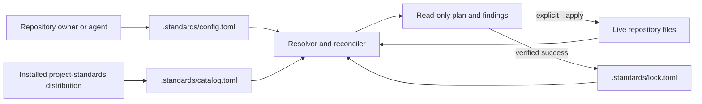
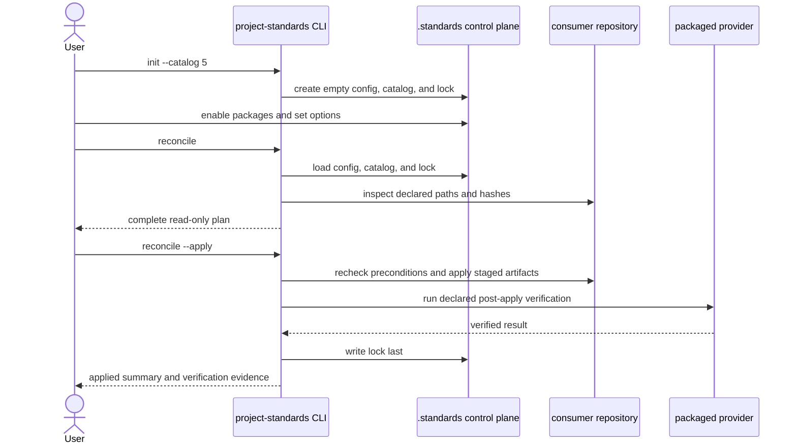

# Consumer Standards Control Plane — Specification (Full)

## Revision History

| Version | Date | Author | Change |
| --- | --- | --- | --- |
| 0.1 | 2026-07-10 | Codex with owner design review | Initial full specification from the approved control-plane, reconciliation, version-channel, migration, and safety design. |

**Spec lifecycle:** This document is living until `approved`, then change-controlled. Implementation deviations are recorded in the [Deviations Log](#deviations-log), not silently patched into requirements. The control plane is a v5 platform contract and must be approved before its implementation plan or the separate `project-toolbox` specification proceeds.

---

## 1. Purpose & Background

Consumer repositories currently adopt standards through package-specific procedures that copy files, print configuration fragments, invoke specialized commands, and sometimes maintain package-specific provenance state. The behavior works, but the consumer has no single inventory of available and installed standards, no unified desired-state file, no generic removal path, and no central lock describing which package owns each managed artifact. Configuration lives in `.project-standards.yml`, while adoption state is inferred from files or held by individual packages.

This specification introduces a consumer-side standards control plane rooted at `.standards/`. A consumer initializes one catalog line, selects independently adoptable standards and their options in one TOML file, previews a deterministic reconciliation plan, and explicitly applies installation, upgrade, repair, or removal. The installed `project-standards` distribution supplies a complete offline catalog, immutable versioned payloads, schemas, providers, and migrations. Validation remains read-only.

The design separates the SemVer `project-standards` release, each standard package's immutable `major.minor` payload version, the consumer's package selector, and any package-owned schema/behavior contract version. `version = 'latest'` selects a package payload from the non-breaking default track for the installed catalog major; a package option such as `contract_version` independently selects a supported consumer contract inside that payload. Breaking package majors may ship early as explicit candidates without forcing a catalog-major release. A consumer may opt into one with package-specific `--allow-major` authorization; the next catalog major may later promote that line to the ordinary default.

The resulting control plane is the foundation for a separate `project-toolbox` standard. That standard will provide provider-neutral, project-local workflows and skills without depending on GitHub or any other standard. It is deliberately specified after this platform contract so it can use one stable adoption, configuration, versioning, and drift model.

---

## 2. Scope

### 2.1 In Scope

- A neutral `project-standards init --catalog CATALOG_MAJOR` bootstrap that creates `.standards/` without enabling any standard.
- A unified `.standards/config.toml` for catalog selection, desired package state, version selectors, and namespaced package options.
- Tool-managed `.standards/catalog.toml` and `.standards/lock.toml` files.
- Package-owned resources under `.standards/packages/STANDARD_ID/` when no external discovery path is required.
- Versioned configuration schemas for each consumer-facing standard namespace.
- Embedded, immutable payloads for every catalog-advertised installable package version.
- Catalog-scoped non-breaking defaults and opt-in breaking-candidate package versions.
- A read-only reconciliation planner and explicit apply path for install, update, repair, and removal.
- Central artifact ownership, provenance, shared-reference, effective-configuration, and accepted-major records.
- Generic provider dispatch from trusted catalog manifests.
- Migration from `.project-standards.yml` and existing installed artifacts into the unified control plane.
- V5 read-only legacy-config compatibility and a v6 removal boundary.
- Compatibility work for every current standard package, adoption mode, provider, workflow, and artifact.
- A package-by-package composition and migration verification matrix.
- Governing ADRs plus amendments or supersession of conflicting ADRs and versioning policy.

### 2.2 Out of Scope (Non-Goals — never)

| ID | Non-Goal | Reason |
| --- | --- | --- |
| NG-001 | Mutate repository state during validation, CI checks, catalog inspection, or reconciliation planning. | Configuration and pull-request content are untrusted data; mutation requires explicit authorization. |
| NG-002 | Install or manage user-global, home-directory, machine-level, filesystem-root, or sibling-repository state. | Standard adoption is bounded to one consuming project. |
| NG-003 | Let consumer configuration define executable commands, Python entrypoints, remote artifact URLs, or arbitrary package sources. | Executable providers and payloads come only from the trusted installed catalog. |
| NG-004 | Force all installed artifacts under `.standards/`. | External tools and harnesses require conventional paths such as `.agents/skills/`, `.github/workflows/`, and `pyproject.toml`. |
| NG-005 | Create implicit hard dependencies between standard packages. | Packages remain independent by default and may only recommend companions or consume generic platform capabilities. |
| NG-006 | Implement the `project-toolbox` or `agent-managed-repo` standards in this specification. | Each is a separate standard with a separate authority boundary and specification. |
| NG-007 | Store secret values in configuration, catalogs, locks, payloads, logs, or migration reports. | Only credential references may be stored in repository documentation or configuration. |
| NG-008 | Silently merge legacy YAML and unified TOML configuration. | Two active configuration authorities would make resolution and migration ambiguous. |

### 2.3 Won't Have in v1 (deferred — not never)

| ID | Deferred Capability | Why Deferred | Revisit When |
| --- | --- | --- | --- |
| WH-001 | Remote or third-party standards registries. | The first release must prove deterministic first-party offline catalogs and package ownership. | The embedded catalog works across real consumers and a trust/signing design is approved. |
| WH-002 | Automatic self-update of the `project-standards` executable or its external workflow/package pin. | Package-manager and CI-pin mutation require a separate trust and rollout contract. | A catalog-major upgrade workflow is proven manually and separately specified. |
| WH-003 | Fleet-wide reconciliation across multiple repositories. | The authority boundary is one project; multi-repo mutation needs separate authorization and coordination. | Independent repository reconciliation is stable and an operator workflow is approved. |
| WH-004 | A general third-party extension marketplace for toolbox capabilities. | `project-toolbox` v1 will first prove managed core workflows and local extensions. | The separate toolbox standard's operational suite is stable. |

### 2.4 Boundaries

| Boundary | Description |
| --- | --- |
| System owns | Consumer control-plane schemas, loaders, catalog generation, version resolution, reconciliation, central lock state, embedded payloads, provider dispatch, migration, diagnostics, compatibility fixtures, and governing documentation. |
| System depends on | The installed `project-standards` distribution, one writable consumer repository for apply operations, TOML parsing, current standard manifests, artifact manifests, provider declarations, and external tools that consume materialized artifacts. |
| System does not own | The package manager or workflow pin that installed `project-standards`; consumer-authored project content; secrets; external tool semantics; remote repositories; or the policy content of individual standards. |

---

## 3. Context

### 3.1 Current State

The repository has a manifest-driven standard graph, explicit authorities and relationships, generated catalog documentation, an artifact-plane `adopt.toml`, provider declarations, provenance classes, managed/create-only installation policies, and project-local skill and hook placement. These are the correct primitives for composition.

The consumer surface remains fragmented:

- `.project-standards.yml` contains validator and package configuration but no complete standard inventory.
- `project-standards adopt` receives standard IDs imperatively and writes current bundle artifacts directly.
- Each packaged standard has one current `adopt.toml` payload even when its manifest lists several supported contract versions.
- Fragments require manual or package-specific merging.
- Generic install, update, removal, and central drift state do not exist.
- Agent Handoff maintains a package-specific provenance lock because no central consumer lock exists.
- Standard adoption guides repeat platform mechanics that should be common.
- Package `supported` versions and consumer-selectable contract versions are separate planes, but the current one-payload layout cannot install each claimed package version.
- Aggregate apply is not composition-safe today: Agent Handoff plus Python Tooling can partially write before colliding on `AGENTS.md`, Agent Handoff plus Markdown Frontmatter can collide on `.project-standards.yml`, and the specialized aggregate path drops non-handoff fragments.

### 3.2 Target State

Every initialized consumer carries a committed, reviewable control plane:

```text
.standards/
├── config.toml          # user-owned desired state and package options
├── catalog.toml         # tool-owned snapshot from the installed distribution
├── lock.toml            # tool-owned applied state and provenance
└── packages/
    └── STANDARD_ID/     # package-owned resources/state without required external paths
```

The user initializes the selected catalog major once. No package is enabled by default. The user then edits `config.toml` or uses equivalent CLI commands, previews reconciliation, and explicitly applies it. The planner resolves versions, validates package options, checks authorities and destinations, classifies changes, and reports every conflict before mutation. The executor installs trusted embedded payloads, runs declared providers, verifies results, and writes the lock last.

Files that external tools discover at fixed paths remain there. The lock records their owner, version, provenance, install policy, content hash, and shared references. Package-specific duplicate locks are retired.

### 3.3 Assumptions

| ID | Assumption | Impact if False |
| --- | --- | --- |
| A-001 | Consumers commit `config.toml`, `catalog.toml`, and `lock.toml` with the repository. | Reproducibility and review require a different durable-state mechanism. |
| A-002 | The installed `project-standards` distribution is the trusted source for catalog metadata, payloads, schemas, providers, and migrations. | Remote trust, signatures, and source resolution must be specified before reconciliation can proceed. |
| A-003 | Standard payloads are small enough that retaining supported immutable versions in the distribution is practical. | A content-addressed external package store becomes necessary. |
| A-004 | The `project-standards` major release is the default compatibility boundary for package `latest` resolution. | A separate catalog-version authority and upgrade policy are required. |
| A-005 | Existing package artifacts can be classified as managed, create-only, shared, or consumer-owned without losing required behavior. | A package-specific exception and migration strategy are required before that package can move. |

### 3.4 Constraints

| ID | Constraint | Source |
| --- | --- | --- |
| C-001 | The control plane must launch with v5 and remain compatible with every v5 consumer-facing standard. | Owner scope decision. |
| C-002 | Initialization enables no standard and writes only the minimum `.standards/` scaffold unless migration is explicitly requested. | Owner design decision. |
| C-003 | Validation and planning are read-only; apply is explicit. | Owner safety decision. |
| C-004 | `version = 'latest'` must remain non-breaking within one catalog major. | Owner version-channel decision. |
| C-005 | A breaking package major may be catalog-advertised before promotion but requires package-specific explicit authorization. | Owner version-channel decision. |
| C-006 | A previously authorized package major must not be silently downgraded on later reconciliation. | Owner reconciliation decision. |
| C-007 | Every ordinary package option must be expressible in `.standards/config.toml`. | Owner unified-configuration decision. |
| C-008 | All catalog-advertised installable versions must work offline from the installed distribution. | Owner payload decision. |
| C-009 | Standards remain independently selectable and must not require another standard. | ADR 0013 and owner confirmation. |
| C-010 | Existing user-authored content and unrelated dirty-tree changes must be preserved. | Repository working rules and adoption safety contract. |

---

## 4. Goals

| ID | Goal | Success Signal | Achieved By |
| --- | --- | --- | --- |
| G-001 | Give consumers one neutral standards entry point. | An empty repository initializes a valid control plane with no enabled package. | FR-001, FR-002, FR-017 |
| G-002 | Make desired and applied standard state explicit. | Configuration, catalog, and lock schemas validate and accurately describe a reconciled repository. | FR-003–FR-006 |
| G-003 | Make adoption lifecycle safe and repeatable. | Install, update, repair, and removal plans are deterministic, reviewable, explicit, and idempotent. | FR-007–FR-010, FR-029, NFR-001–NFR-004 |
| G-004 | Support non-breaking defaults and opt-in breaking candidates. | Catalog tests prove `latest`, pins, candidate authorization, retention, and promotion semantics. | FR-011–FR-016 |
| G-005 | Preserve independent package composition. | Each package, all pairs, and the full supported set reconcile without undeclared dependencies or ownership conflicts. | FR-018–FR-023, FR-029, FR-031 |
| G-006 | Centralize user-selectable package configuration. | Every normal option validates under its owned namespace and materializes through its package provider without conflating package and consumer contracts. | FR-003, FR-004, FR-024, FR-030 |
| G-007 | Preserve offline reproducibility. | An installed-wheel test initializes and reconciles every advertised version without network access. | FR-005, FR-006, FR-016, FR-028 |
| G-008 | Provide a stable foundation for `project-toolbox`. | The later toolbox spec can declare workflows, skills, options, and managed artifacts without new adoption machinery. | FR-018, FR-019, FR-024 |

---

## 5. Stakeholders and Users

| Role / Stakeholder | Concern | Involvement |
| --- | --- | --- |
| Consumer repository owner | Understandable package choices, safe updates, explicit breaking opt-in, and low repository clutter. | Selects catalog/package versions, approves apply operations, and reviews migrations. |
| Standard package author | Stable package schema, version/promotion rules, provider contract, and compatibility gates. | Authors versioned payloads, config schemas, migrations, tests, and documentation. |
| Coding agent | Deterministic inventory, instructions, ownership, safe commands, and actionable findings. | Plans and applies authorized changes under the spec and installed skills. |
| `project-standards` maintainer | Coherent releases, migration support, manageable wheel size, and enforceable compatibility. | Implements platform code, publishes catalogs, and approves ADRs. |
| CI and review systems | Read-only, reproducible validation with no hidden mutation. | Validate config, lock, package conformance, and repository drift. |

---

## 6. Glossary

| Term | Definition | Notes / Not to be confused with |
| --- | --- | --- |
| Control plane | The `.standards/` files and `project-standards` behavior that describe and reconcile consumer standard state. | Does not replace externally discovered tool configuration. |
| Catalog major | The `project-standards` major release line selected in `config.toml`, such as `5`. | The compatibility boundary for ordinary `latest` resolution. |
| Tool release | Exact SemVer version of the installed `project-standards` distribution, such as `5.3.0`. | Different from package `major.minor` versions. |
| Standard package version | Immutable `major.minor` contract and payload for one standard. | Several package versions may exist in one catalog release. |
| Consumer contract version | Package-owned schema or behavior version selected as a standard option, such as the Markdown Frontmatter schema contract. | Not the package payload selector and never inferred from it. |
| Default track | Package version resolved by `version = 'latest'` for the selected catalog major. | Must remain non-breaking within that catalog major. |
| Breaking candidate | Available package major excluded from ordinary `latest` resolution until explicitly authorized or promoted in a later catalog major. | Released and installable, but not the catalog default. |
| Desired state | User-owned package selection and options in `config.toml`. | Not proof that artifacts are installed. |
| Applied state | Tool-owned resolved versions, options, ownership, and provenance in `lock.toml`. | Written only after successful apply and verification. |
| Versioned payload | Immutable package resources, artifact manifest, config schema, providers, migrations, documentation, and digest for one version. | The current one-payload bundle is insufficient for candidate versions. |
| Reconciliation | Comparing desired state, catalog, lock, and live files to plan or apply convergent changes. | Planning is read-only; apply is explicit. |
| Managed artifact | Package-owned file that the reconciler may update or remove only when its recorded preconditions hold. | Different from create-only and consumer-owned content. |
| Semantic contribution | A package-owned, key- or marker-scoped change composed with other contributions against one virtual planned tree. | Replaces unowned printed fragments and whole-file collisions for shared structured/instruction files. |

---

## 7. Requirements

### 7.1 Functional Requirements

| ID | Requirement | Rationale | Acceptance Criteria | Priority |
| --- | --- | --- | --- | --- |
| FR-001 | The system shall provide `project-standards init --catalog CATALOG_MAJOR` to create a valid `.standards/config.toml`, `catalog.toml`, and `lock.toml` when no legacy or unified control-plane authority exists. | Consumers need one neutral bootstrap. | A fresh-repository fixture initializes successfully and all three schemas validate. | Must |
| FR-002 | Initialization shall enable no standard and shall write no path outside `.standards/` unless legacy migration is explicitly requested; plain init shall stop without writes when it detects legacy authority. | Bootstrap must not impose a policy bundle or create split authority. | Filesystem assertions prove fresh init changes only the minimum scaffold and legacy init changes nothing while reporting the migration command. | Must |
| FR-003 | `config.toml` shall declare the expected catalog major, each standard's enabled state and version selector, and package settings under owned `config` namespaces. | Desired state and options need one user-owned source. | Schema fixtures accept valid selectors/settings and reject unknown or misplaced keys. | Must |
| FR-004 | Every consumer-facing package version shall publish a machine-readable configuration schema with defaults and namespace ownership. | Options must be version-aware and collision-free. | Catalog validation rejects missing schemas, duplicate namespaces, invalid defaults, and undeclared settings. | Must |
| FR-005 | `catalog.toml` shall list every package available in the installed distribution, including non-enabled, reference-only, internal, stable, retained, and candidate versions. | Users and tools need complete local discovery. | The generated catalog matches packaged manifests and includes all graph nodes and version channels. | Must |
| FR-006 | `lock.toml` shall record the exact tool release, catalog major and digest, config digest, resolved package versions, effective-option digests, artifact ownership/provenance/hashes, shared references, and accepted package-major tracks. | Applied state must be reproducible and auditable. | Lock schema and reconciliation tests detect every material mismatch. | Must |
| FR-007 | `project-standards reconcile` shall build and display a complete read-only plan from config, catalog, lock, live repository state, and a virtual tree containing every planned semantic contribution. | Users must inspect changes before mutation, and cross-package conflicts must be known before writes. | Plan fixtures cover create, semantic merge, update, repair, remove, preserve, no-op, and conflict actions without filesystem writes. | Must |
| FR-008 | `project-standards reconcile --apply` shall execute only a conflict-free plan, run post-apply verification, and write the lock last. | Mutation requires explicit, recoverable authorization. | Apply tests prove precondition rechecks, atomic replacement, verification, and lock-last behavior. | Must |
| FR-009 | `project-standards validate` and `reconcile --check` shall report desired-state, lock, config, catalog, and artifact drift without applying changes. | Validation and CI must remain safe. | Mutation spies prove all validation/check paths are read-only. | Must |
| FR-010 | Disabling a package shall remove only unchanged, exclusively owned managed artifacts; it shall preserve shared, create-only, consumer-owned, modified, and ambiguous content. | Removal must not destroy project work. | Removal fixtures verify preservation, reference counting, and actionable conflict findings. | Must |
| FR-011 | Within a selected catalog major, `version = 'latest'` shall resolve to the package's declared non-breaking default, not necessarily the numerically highest available version. | Breaking candidates must not surprise ordinary consumers. | Resolver tests keep default-track consumers on the compatible package line. | Must |
| FR-012 | Consumers shall be able to pin an exact catalog-advertised package version. | Projects need deterministic opt-out from automatic package updates. | Exact-pin fixtures remain unchanged across compatible catalog refreshes. | Must |
| FR-013 | A catalog may advertise a breaking package candidate, but installation or transition to its major shall require `--allow-major STANDARD_ID` or an equivalent explicit package-specific authorization. | Package betas should ship without forcing a tool-major release. | Candidate fixtures fail closed without authorization and succeed only for the named package with authorization. | Must |
| FR-014 | After a breaking package major is authorized, ordinary reconciliation shall retain that major and track compatible updates within it without repeated authorization or silent downgrade. | Applied authorization must be durable and convergent. | Lock/resolver tests preserve an accepted candidate track when the catalog default remains older. | Must |
| FR-015 | Promoting a breaking candidate to the ordinary default track shall require a new `project-standards` catalog major. | Default-track breaking changes need one explicit consumer boundary. | Release-policy tests reject a default package-major change within one tool major. | Must |
| FR-016 | Every catalog-advertised installable package version shall have an embedded immutable payload containing version-specific manifests, documentation/resources, config schema, providers, migrations, and digest metadata. | Multiple selectable versions must be genuinely installable offline. | Installed-wheel tests adopt every advertised version with network access disabled. | Must |
| FR-017 | The catalog control plane shall be the single supported entry point for new adoption; the v5 `adopt` command shall remain only as a compatibility wrapper over init, desired-state update, and reconciliation. | Package guides should not reimplement platform mechanics. | CLI tests prove wrapper equivalence and emit the documented deprecation notice. | Must |
| FR-018 | Reconciliation shall invoke only manifest-declared providers from the trusted installed payload selected for the resolved package version. | Package behavior must remain generic without arbitrary execution. | Provider tests reject config-supplied entrypoints and dispatch the version-correct packaged provider. | Must |
| FR-019 | Package resources that need no conventional discovery path shall live under `.standards/packages/STANDARD_ID/`; required external artifacts shall remain at their declared consumer paths and be centrally locked. | The control plane should reduce clutter without breaking third-party discovery. | Path-policy tests accept both classes and reject undeclared destinations. | Must |
| FR-020 | The central lock shall replace package-specific artifact/provenance locks; specialized package runtime state may remain only under `.standards/packages/STANDARD_ID/` without duplicating the central inventory. | Applied state needs one authority. | Agent Handoff migration tests import and retire its prior lock without losing required state. | Must |
| FR-021 | The system shall provide a previewable and explicitly applied migration from legacy YAML configuration and recognized installed artifacts into the unified control plane. | Existing consumers need a safe v5 path. | Migration fixtures cover every current namespace, package, ownership class, and ambiguous-state stop. | Must |
| FR-022 | During v5, validation may read `.project-standards.yml` only when unified config is absent and shall emit a migration warning; both files together shall fail as split authority, and v6 shall remove legacy support. | Migration needs a bounded compatibility window. | Legacy-mode fixtures prove read-only fallback, dual-file rejection, and the documented removal gate. | Must |
| FR-023 | Every current standard package shall work independently and in supported composition after migration to the control plane. | V5 cannot strand existing standards. | Individual, all-pairs, and all-packages real-apply fixtures pass from both fresh and migrated states, followed by every enabled package validator. | Must |
| FR-024 | Every normal user-selectable package option shall be expressible in `config.toml`; packages shall materialize required external tool config from that desired state, while separate package config files remain explicitly referenced exceptions. | Consumers need one configuration authority. | A configurable-package fixture validates options, defaults, materialization, drift, and version migration. | Must |
| FR-025 | Reconciliation under a newer installed tool release in the same configured catalog major shall preview and apply the new generated catalog snapshot and compatible package updates. | Minor and patch catalog improvements should flow without config edits. | Same-major refresh fixtures update catalog/lock while preserving pins and non-breaking defaults. | Must |
| FR-026 | The CLI shall provide list, inspect, enable, disable, and version-selection operations that make explicit edits equivalent to manual `config.toml` changes. | Users and agents need discoverable configuration helpers. | Round-trip tests prove CLI edits produce schema-valid config and the same reconciliation plan as manual edits. | Should |
| FR-027 | Consumer adoption guides shall describe package-specific suitability, options, artifacts, companions, and verification while delegating common install, version, lock, upgrade, and removal mechanics to the control-plane guide. | Package procedures should stay concise and consistent. | Documentation tests and review show no package repeats or contradicts platform adoption mechanics. | Must |
| FR-028 | Init, catalog inspection, planning, apply, validation, migration, and package-provider execution shall require no network access for catalog-advertised content. | Reconciliation must be deterministic and available offline. | Installed-wheel end-to-end tests pass with network access disabled. | Must |
| FR-029 | The planner shall compose every structured-file, config, and bounded-instruction contribution against one virtual planned tree before writing; package integrations shall declare semantic ownership instead of printing untracked fragments or competing for whole files. | Current aggregate adoption can drop fragments or partially write before discovering collisions. | Real-apply fixtures for every package pair and the full set prove preflight composition of TOML, YAML, JSON, Markdown blocks, VS Code files, and workflow artifacts. | Must |
| FR-030 | Package selection and consumer contract selection shall remain distinct: `standards.STANDARD_ID.version` selects an installable package payload, while any schema/behavior contract version is a versioned package option under `config`. | Existing package and registry contract versions are different and cannot be reinterpreted safely. | Migration and resolver tests preserve both values independently for every currently registered contract. | Must |
| FR-031 | The implementation shall replace approved SPEC-BA01 with a separately reviewed SPEC-BA02 for the breaking Standard Bundle Authoring contract, while retaining SPEC-BA01 and its completed plan as history. | Versioned payloads, channels, config schemas, migrations, and central reconciliation materially change the authoring contract. | SPEC-BA02 is approved, indexed, and traceable before authoring-standard implementation begins. | Must |

### 7.2 Non-Functional Requirements

| ID | Category | Requirement | Measurement / Acceptance Criteria | Priority |
| --- | --- | --- | --- | --- |
| NFR-001 | Determinism | Identical config, catalog, lock, and live-file inputs shall produce byte-identical plans and generated control-plane files. | Golden-plan tests and repeated generation produce no diff. | Must |
| NFR-002 | Idempotency | A second successful init, migration, or reconciliation shall produce no repository change. | Every end-to-end fixture runs the operation twice and asserts an empty second diff. | Must |
| NFR-003 | Safety | All reads and writes shall remain within the resolved repository root and reject traversal, absolute paths, symlink escape, and global destinations. | Boundary and adversarial path tests cover every file operation. | Must |
| NFR-004 | Recoverability | Interrupted or failed apply operations shall leave the previous lock authoritative and produce enough evidence for the next run to detect and repair partial state. | Fault-injection tests cover each write/verify boundary. | Must |
| NFR-005 | Performance | Planning a catalog of 100 packages and 1,000 artifacts shall complete within five seconds on the repository's normal Linux CI runner, excluding package-specific external validators. | A deterministic performance test or benchmark records the threshold. | Should |
| NFR-006 | Maintainability | Adding a package or package version shall require manifest/payload registration, not a package-specific branch in shared init, resolver, planner, executor, or validator code. | Architecture tests and review find no package-ID dispatch outside declared adapters/providers. | Must |
| NFR-007 | Compatibility | The v5 implementation shall preserve all current supported package behavior or document and test an approved v5 migration. | Compatibility matrix and installed-wheel fixtures pass for every package. | Must |
| NFR-008 | Diagnostics | Every read-only and mutating command shall provide stable human output and structured `--json` findings/actions with documented exit codes. | CLI contract tests snapshot success, drift, conflict, config error, and apply failure outputs. | Should |

### 7.3 Interface Requirements

| ID | Interface | Requirement | Contract / Format | Acceptance Criteria |
| --- | --- | --- | --- | --- |
| IR-001 | CLI bootstrap | The system shall expose `project-standards init --catalog CATALOG_MAJOR [--migrate] [--apply]`. | Local CLI; preview unless an apply flag is present for migration. | Help, argument, JSON, idempotency, and filesystem tests pass. |
| IR-002 | CLI package selection | The system shall expose the `standards list`, `show`, `enable`, `disable`, and `version` operations. | Edits only `.standards/config.toml`; supports human and JSON output. | CLI/manual-edit plan equivalence passes. |
| IR-003 | CLI reconciliation | The system shall expose `project-standards reconcile [--check] [--apply] [--allow-major ID]`. | Plan by default; check is read-only; apply mutates; authorization is package-scoped. | Full command matrix and exit-code tests pass. |
| IR-004 | CLI validation | Existing validators and generic providers shall resolve unified config by repository root and accept explicit override only for supported migration/debug use. | `.standards/config.toml` is canonical; legacy fallback is v5-only. | Every validator and reusable workflow passes unified-config fixtures. |
| IR-005 | Desired-state file | `.standards/config.toml` shall use a versioned TOML schema with platform, standards, and config containers. | UTF-8 TOML; repository-relative references only. | Schema, formatter, migration, and round-trip tests pass. |
| IR-006 | Catalog and lock files | `.standards/catalog.toml` and `.standards/lock.toml` shall use generated canonical TOML with stable ordering. | Tool-owned UTF-8 TOML; committed and reviewable. | Generation is deterministic and parser/generator round trips are lossless. |

### 7.4 Data Requirements

| ID | Data Entity | Requirement | Validation Rules | Ownership |
| --- | --- | --- | --- | --- |
| DR-001 | Desired config | Store catalog-major intent, package selectors, and package settings without applied-state claims. | Versioned schema; declared namespaces/options only; no secrets or executable values. | Consumer-owned. |
| DR-002 | Catalog snapshot | Store the complete inventory and version-channel metadata supplied by the installed distribution. | Must match the installed catalog digest and configured major; no consumer edits. | Platform-owned. |
| DR-003 | Applied lock | Store resolved versions, digests, accepted tracks, effective config, artifacts, owners, policies, and shared references. | Written last; canonical order; content hashes verified; no duplicate package locks. | Platform-owned. |
| DR-004 | Versioned payload | Retain one immutable complete payload per advertised package version. | Version/digest identity, contained paths, config schema, manifests, resources, providers, and migration graph required. | Standard package-owned. |
| DR-005 | Package runtime state | Store specialized non-generic state only below `.standards/packages/STANDARD_ID/`. | Declared schema/path; no duplicate artifact inventory; no secret values. | Declaring package-owned. |
| DR-006 | Migration evidence | Report legacy sources, inferred ownership, preserved ambiguity, and applied conversion without storing sensitive content. | Repository-confined; read-only until apply; stable JSON schema. | Platform-owned report; consumer owns source content. |

---

## 8. Architecture and Design

### 8.1 Architecture Summary

The installed distribution is a trusted, versioned local catalog. Initialization materializes its catalog snapshot and empty desired/applied state into the consumer repository. Package selection remains declarative. A resolver combines the configured catalog major, installed tool release, catalog channels, exact selectors, and prior accepted-major tracks. It chooses one immutable payload per enabled package before package options are validated against that payload's schema.

The planner compares resolved desired state with the central lock and live files. It uses existing authority, destination, provenance, install-policy, and relationship metadata to classify actions and conflicts. Package-specific behavior enters only through version-selected manifest providers. The executor stages content, rechecks preconditions, applies contained writes, invokes verification, and updates the central lock last.

Legacy migration is an adapter into the same models. It parses recognized configuration, inventories declared signals and content matches, preserves ambiguity, and produces a normal reconciliation plan. It does not create a parallel migration engine.

### 8.2 Architecture Views

#### 8.2.1 Context View



#### 8.2.2 Package Payload View

```text
standards/STANDARD_ID/
├── README.md
├── standard.toml
└── releases/
    └── PACKAGE_VERSION/
        ├── package.toml
        ├── adopt.toml
        ├── config.schema.json
        ├── resources/
        ├── providers/
        └── migrations/

src/project_standards/bundles/STANDARD_ID/versions/PACKAGE_VERSION/
└── immutable distribution mirror of the released payload
```

The top-level `standard.toml` describes the package series and catalog channels. Each released `package.toml` freezes the version-specific contract and points only within its payload. Provenance validation proves canonical-to-distribution parity or a declared deterministic transform.

#### 8.2.3 Component View

| Component | Responsibility | Interfaces | Key Constraint |
| --- | --- | --- | --- |
| Bootstrap service | Create the neutral control plane and route optional legacy migration. | `init`; config/catalog/lock generators. | Enables no package by default. |
| Control-plane models | Parse and validate config, catalog, lock, package release, and migration report schemas. | Typed Python models and generated schemas. | Reject unknown keys and invalid ownership. |
| Catalog builder | Build the complete snapshot from graph manifests and embedded payloads. | Installed distribution resources; `catalog.toml`. | Deterministic, offline, catalog-major scoped. |
| Version resolver | Resolve exact, default, retained, and candidate tracks. | Config, catalog, lock, authorization flags. | Never silently cross or downgrade a package major. |
| Reconciliation planner | Produce ordered actions and conflicts from desired/applied/live state. | Artifact manifests, authorities, relationships, hashes. | No writes or provider execution. |
| Executor | Apply a validated plan and verify it. | Staged files, declared providers, filesystem adapter. | Contained writes; lock written last. |
| Provider runner | Invoke version-selected package behavior. | Manifest operation and trusted entrypoint. | No config-defined executable surface. |
| Semantic adapter registry | Compose owned TOML/YAML/JSON keys, Markdown blocks, and set-like contributions against the virtual tree. | Typed contribution declarations and format-specific adapters. | Detect every overlap before writes; preserve unrelated content. |
| Migrator | Convert legacy config/state into control-plane inputs. | YAML/config adapters and declared package signatures. | Preserve ambiguity and user content. |
| Compatibility suite | Prove each package and composition works. | Source and installed-wheel fixtures. | Package-complete, not sample-only. |

#### Current Package Migration Matrix

| Package | Current Consumer Surface | Required V5 Control-Plane Migration |
| --- | --- | --- |
| `adr` | Validator package; `markdown.adr` YAML config, ADR template, config fragment, and two validation providers. | Move settings to `config.markdown.adr`, add a versioned payload/schema, remove the fragment, preserve Frontmatter compatibility metadata, and eliminate or explicitly resolve the current hidden Frontmatter adoption dependency. |
| `agent-handoff` | CLI package; strict YAML config, create-only knowledge, managed skill/hook, semantic harness/instruction integrations, specialized providers, and a separate lock. | Move options to `config.agent_handoff`, keep knowledge create-only, move generic ownership to the central planner/lock, retain package rendering/validation providers, store non-discovered policy under its package directory, and retire its lock. |
| `cli-documentation` | Copy-adopt package; metadata-only YAML version, consumer usage doc, GitHub workflow, printed config fragment, and workflow drift provider. | Add package options for profile/entrypoint/CI, make the usage doc create-only, generate or externalize editable workflow values, remove the fragment, and make GitHub/Python assumptions conditional. |
| `markdown-frontmatter` | Validator package; whole YAML config, GitHub caller, skill/script files, validators, and formatter. | Move all settings to `config.markdown.frontmatter`, keep package and schema contract versions distinct, update every tool/skill/workflow to unified config and lock resolution, and remove whole-config ownership. |
| `markdown-tooling` | Copy-adopt package; Markdown configs, shared EditorConfig/VS Code recommendations, two GitHub callers, workflow providers, and manual instruction/settings guidance. | Add lint/format/CI options, classify managed versus extensible root config, semantically union per-package VS Code/instruction contributions, centrally lock shared ownership, and compose exclusions required by other packages. |
| `project-spec` | CLI package; `spec` YAML config, validation workflow, templates, and six providers. | Move settings to `config.spec`, bind templates/providers/workflow to the resolved payload, remove the fragment/YAML grep, and encode its separate-doc-schema scope relative to Frontmatter. |
| `python-coding` | Draft reference-only package with documentation-only semantic review and no artifacts/config. | Keep catalog-visible but non-default while draft; advertise only reconstructed payloads, optionally materialize reference resources under its package directory, and perform no root writes. |
| `python-tooling` | Copy-adopt package; metadata-only YAML version, `pyproject.toml` fragment, Python/workflow/script files, whole agent instructions and VS Code files, shared artifacts, and workflow validation. | Add a comprehensive option schema, semantically compose root/config/instruction/VS Code contributions, make type-checker selection fan out coherently, preflight key-level `pyproject.toml` ownership, and add mandatory real-apply tests with Agent Handoff and Markdown Tooling. |
| `standard-bundle-authoring` | Internal non-adoptable package defining the current singleton manifest/payload contract. | Keep catalog-visible and non-enableable; replace its contract through SPEC-BA02 with channels, immutable releases, config schemas, migrations, digests, semantic contributions, and central reconciliation. |

Five packages currently target `.project-standards.yml`; after migration no package owns that file or installs a config fragment. The matrix is a release contract, not an illustrative sample: a package that has not completed its row cannot be advertised as v5-control-plane compatible.

### 8.3 Design Decisions

| ID | Decision | Rationale | Alternatives Considered | ADR Disposition |
| --- | --- | --- | --- | --- |
| D-001 | Use one `.standards/` consumer control plane. | One visible inventory and authority reduces sprawl, ambiguity, and package-specific machinery. | Ride-along bootstrap per package; keep imperative adoption only. | New ADR 0023; supersede ADRs 0003, 0008, and 0017 while preserving their still-valid plane separation and namespace principles. |
| D-002 | Use unified TOML for package selection and settings. | One source avoids YAML/TOML precedence and lets every package publish options. | Split desired state from legacy YAML; relocate YAML unchanged. | New ADR 0023; supersede ADR 0008's file-specific decision while retaining namespace ownership. |
| D-003 | Keep validation/planning read-only and make apply explicit. | CI and untrusted repository changes must not trigger installation or executable hooks. | Reconcile automatically during validation. | New ADR 0023. |
| D-004 | Scope package `latest` to the catalog major's non-breaking default. | Breaking candidates can ship early without surprising existing consumers. | Numerically highest version; package major always forces tool major immediately. | New ADR 0024; supersede ADR 0020 and amend `meta/versioning.md`. |
| D-005 | Permit explicit breaking candidates and retain accepted package-major tracks. | Users can beta-test package majors while normal consumers stay compatible. | Prerelease the entire tool distribution; require exact pins only. | New ADR 0024. |
| D-006 | Embed every advertised versioned payload. | Offline and deterministic selection requires actual historical and candidate content. | Remote retrieval; one current payload. | New ADR 0024; ADR 0023 supersedes ADR 0003 and ADR 0019 is amended for versioned provenance. |
| D-007 | Maintain one central lock. | Duplicate package locks create drift and unclear applied-state authority. | Keep independent locks; aggregate summaries only. | New ADR 0023; amend ADRs 0019, 0021, and 0022. |
| D-008 | Keep required integration artifacts in conventional paths. | External tools and harnesses will not discover arbitrary `.standards/` locations. | Move or symlink everything below `.standards/`. | New ADR 0023; retain project-local destination rules in ADRs 0021 and 0022. |
| D-009 | Initialize no standard by default. | The platform is neutral and packages remain explicit independent choices. | Install `project-toolbox` or a baseline profile automatically. | New ADR 0023; reinforce ADR 0013. |
| D-010 | Require package-versioned option schemas. | Unified config must remain type-safe as package choices evolve. | Free-form tables; one global monolithic schema. | New ADR 0023; amend the Standard Bundle Authoring contract. |

#### ADR Reconciliation Matrix

| Existing Decision or Policy | Required Action | Reason |
| --- | --- | --- |
| ADR 0001 — Bundle Authoring Contract | Retain; extend through new ADR/SPEC-BA02 | Its meta-standard decision remains, but the governed contract gains versioned releases, schemas, migrations, channels, and reconciliation metadata. |
| ADR 0002 — Manifest-First Discovery | Retain; clarify through new ADR | `standard.toml` remains authored authority; release manifests and consumer catalogs are declared derivatives rather than a replacement central SSOT. |
| ADR 0003 — Separate Standard and Artifact Manifests | Supersede with ADR 0023 | Preserve metadata/artifact separation but replace the singleton `adopt.toml` and unchanged adopt-engine decision with immutable version payloads and reconciliation. |
| ADR 0004 — Authority Map | Retain; extend through new ADR | Reconciliation consumes authority tuples and adds platform files, package directories, semantic contributions, version scope, and shared lock references. |
| ADR 0005 — Generic Tooling Interface | Retain | Init, resolve, reconcile, validate, and provider dispatch remain generic over standard identity. |
| ADR 0006 — Provider Plugin Model | Retain; extend through new ADR | Providers become package-version selected and catalog-trusted, with config migration and post-apply operations. |
| ADR 0007 — Graph Validation Gate | Retain; extend through new ADR | Graph validation expands to catalog channels, payload completeness, option schemas, migrations, and release-policy checks. |
| ADR 0008 — Consumer Config Namespace Registry | Supersede | Namespace ownership remains, but `.project-standards.yml` and its top-level model are replaced by `.standards/config.toml`. |
| ADR 0009 — Agent Summary Split | Retain | Versioned payloads carry matching canonical docs and summaries without changing their authority relationship. |
| ADR 0010 — Resource URIs and Index | Retain; extend through new ADR | Resource identity must include or resolve through a package version. |
| ADR 0011 — Dogfood Fixtures | Retain; expand acceptance suite | Existing composition intent remains, but tests must perform real reconciliation, migration, interruption, version-channel, and offline-wheel paths. |
| ADR 0012 — MCP Readiness | Retain; extend readiness gate | Control-plane and package-compatibility evidence become additional prerequisites without changing read-before-server intent. |
| ADR 0013 — Independent Packages | Retain; clarify through new ADR | All packages consume the generic platform but never require another package; catalog selection stays independent. |
| ADR 0014 — Frontmatter Value Policy | Amend | Replace the configuration path and update the managed-document scope, including `docs/workflows/`. |
| ADR 0015 — Standards Frontmatter Exclusion | Amend | Replace configuration paths and exclude package-managed `.standards/packages/**` resources from ordinary managed-document rules where applicable. |
| ADR 0016 — Frontmatter Skill Packaging | Amend | Preserve skill ownership/destination while moving adoption, payload, drift, and lock behavior to the control plane. |
| ADR 0017 — Unified Adoption Methodology | Supersede | The new control plane becomes the single consumer adoption entry point. |
| ADR 0018 — Package Lifecycle | Amend | Package lifecycle and per-version stable/candidate/retained channels must be distinct. |
| ADR 0019 — Artifact Provenance | Amend | Provenance applies per immutable versioned payload and central installed lock. |
| ADR 0020 — Package Versioning | Supersede | `latest` no longer means highest available; package candidates and catalog-major promotion become explicit. |
| ADR 0021 — Skill Installation | Amend | Project-local destination remains; ownership and drift move to the central lock. |
| ADR 0022 — Hook Installation | Amend | Project-local destination remains; ownership and drift move to the central lock. |
| `meta/versioning.md` | Amend | Adding an opt-in breaking candidate is non-breaking at the tool plane; promoting it to default requires a tool major. |
| Standard Bundle Authoring Standard | Supersede through SPEC-BA02 and a package-major revision | Add release payload anatomy, config schemas, channel metadata, migrations, semantic contributions, and control-plane adoption guidance while retaining SPEC-BA01 as history. |

### 8.4 Solution Alternatives Considered

| Alternative | Why Rejected |
| --- | --- |
| Let any adopted package bootstrap shared metadata | Repeats platform artifacts, complicates ownership, and makes package order observable. |
| Keep `.project-standards.yml` beside a new desired-state TOML file | Creates permanent precedence, migration, and namespace ambiguity. |
| Apply desired state during validation | Makes CI and untrusted pull requests capable of repository mutation and hook installation. |
| Retrieve package versions from Git or a remote registry | Introduces network, trust, availability, and mutable-reference risks before they are needed. |
| Store only the current artifact payload | Makes advertised historical and candidate versions impossible to install faithfully. |
| Make every breaking package release a tool-major release | Prevents early opt-in testing and couples unrelated package evolution. |
| Move all artifacts below `.standards/` | Breaks tools and harnesses with fixed discovery paths. |
| Keep package-specific locks | Preserves duplicate applied-state authorities and prevents generic removal/composition. |

### 8.5 Design Constraints

- The configured catalog major and executing tool major must match before mutation.
- A same-major tool update may refresh the catalog only when it preserves default-track compatibility.
- An older same-major tool release must not replace or apply against a catalog snapshot produced by a newer release it cannot verify.
- A candidate-major authorization is scoped to one standard ID and recorded durably.
- Resolver output is complete before config-schema validation and provider selection.
- Planner output is complete before any provider execution or filesystem write.
- Config, catalog, and lock parsers reject unknown keys by default.
- Catalog and lock generators use stable ordering and omit volatile timestamps.
- Configuration values cannot name executable entrypoints or external artifact sources.
- Package release payloads are immutable after publication.
- Consumer-authored content never becomes managed merely because its path resembles a known artifact.

### 8.6 Dependency Policy

| Dependency | Allowed? | Reason |
| --- | --- | --- |
| Python standard library `tomllib` | Yes | Parse trusted and consumer TOML without a new runtime dependency. |
| Existing Pydantic/schema generation stack | Yes | Continue typed model and generated-schema conventions. |
| Existing adopt engine concepts | Conditional | Reuse safe planning/execution behavior but refactor it behind control-plane models rather than preserving imperative-only semantics. |
| Network client or remote registry SDK | No | V1 is fully embedded and offline. |
| Package-specific code in shared resolver/planner | No | Package behavior belongs in manifests, schemas, providers, and migrations. |
| External secret store client | No | The control plane stores references only and does not resolve secrets. |

---

## 9. Data Model

### Desired Configuration

```toml
[project_standards]
schema_version = '1.0'
catalog = '5'

[standards.project-toolbox]
enabled = true
version = 'latest'

[standards.markdown-frontmatter]
enabled = true
version = 'latest'

[config.markdown.frontmatter]
contract_version = '1.1'
required = true
include = ['docs/**/*.md']
exclude = ['docs/generated/**']

[config.python_tooling]
type_checker = 'basedpyright'
python_version = '3.14'
coverage_threshold = 85
```

`project_standards`, `standards`, and `config` are platform containers. Package IDs own their package-payload selection records under `standards`. Standard manifests continue to declare dotted option namespaces beneath `config`. A package-owned `contract_version` or equivalent selects that standard's consumer schema/behavior contract independently from the package payload. Omitted package options receive version-specific schema defaults. The file stores desired intent only; it does not claim that installation succeeded.

### Catalog Snapshot

```toml
[project_standards]
schema_version = '1.0'
catalog = '5'
release = '5.3.0'
digest = 'sha256:catalog-content-digest'

[standards.project-toolbox]
status = 'active'
adoption = 'copy-adopt'
available = ['1.2', '2.0']
default = '1.2'
candidates = ['2.0']

[standards.project-toolbox.versions.'1.2']
channel = 'stable'
payload_digest = 'sha256:stable-payload-digest'

[standards.project-toolbox.versions.'2.0']
channel = 'breaking-candidate'
payload_digest = 'sha256:candidate-payload-digest'
```

The catalog is generated from the installed distribution and committed. It includes packages that cannot be enabled (`adoption = 'none'`) so humans and tools see the complete standards graph. Volatile generation timestamps are excluded to preserve deterministic output.

### Applied Lock

```toml
[project_standards]
schema_version = '1.0'
catalog = '5'
release = '5.3.0'
catalog_digest = 'sha256:catalog-content-digest'
config_digest = 'sha256:desired-config-digest'

[standards.project-toolbox]
requested = 'latest'
resolved = '2.0'
track_major = 2
selection = 'breaking-candidate'
major_authorized = true
payload_digest = 'sha256:candidate-payload-digest'
effective_config_digest = 'sha256:normalized-options-digest'

[[artifacts]]
path = '.agents/workflows/project-toolbox/review-spec.md'
owners = ['project-toolbox']
policy = 'managed'
provenance = 'source-owned'
content_digest = 'sha256:artifact-content-digest'
```

The lock records resolved facts, not user intent. `major_authorized = true` is durable evidence that the package major was accepted; later resolution stays on that major until the config pins another supported version or a separately authorized transition occurs. Shared artifacts list every current owner.

### Package Release Payload

Each immutable release payload contains:

- `package.toml`: version identity, lifecycle channel, config schema, capabilities, authorities, relations, resources, providers, migrations, and artifact-manifest pointer.
- `adopt.toml`: materialized artifacts with destinations, owners, provenance, install policies, modes, and transforms.
- `config.schema.json`: accepted options and defaults for this version.
- Version-specific documentation and resources.
- Version-selected provider and migration declarations.
- A digest manifest covering every payload file.

Top-level `standard.toml` remains the package-series manifest and catalog authoring source. A released snapshot is immutable; a correction requires a new package version.

The migration must not reinterpret today's `standard.toml` `supported` list as proof that an installable historical payload exists. V5 may advertise a package version as installable only after its immutable payload is reconstructed and verified. Older consumer contract/schema versions may remain supported inside a current package payload without becoming independently installable package versions.

### Semantic Contributions

A semantic contribution declares a target, adapter type, ownership scope, source/render provider, install policy, and conflict rule. Supported v5 adapters cover:

- TOML tables and keys, including `pyproject.toml`;
- JSON objects and keys, including VS Code and harness settings;
- YAML mappings and workflow documents;
- delimiter-bounded Markdown instruction blocks; and
- set-like lists such as extension recommendations.

The planner loads the live target once, renders all contributions in deterministic package/manifest order, detects overlapping ownership, and produces one final virtual target. It never writes one package's whole file and then asks another package to patch the result. Unowned legacy `fragment` actions are migrated into config options or semantic contributions; they are not silently discarded or left as untracked console instructions.

---

## 10. Behavior and Workflows

### 10.1 Primary Workflow



Expected result:

> The repository converges to the selected package versions and options, every managed artifact has one central provenance record, consumer content remains preserved, and a second reconciliation is a no-op.

### 10.2 Alternate Workflows

| ID | Trigger | Behavior | Expected Result |
| --- | --- | --- | --- |
| AW-001 | User runs `standards enable` or `disable`. | CLI makes a schema-aware edit to desired config, then reports that reconciliation is pending. | Manual and CLI config edits produce the same plan. |
| AW-002 | Same-major tool release changes the embedded catalog. | Reconciliation previews catalog refresh and compatible default-track updates. | Pins remain pinned; defaults advance only compatibly. |
| AW-003 | User authorizes a breaking candidate. | Resolver selects the candidate payload for the named package and records its accepted major after apply. | Future compatible updates stay on the accepted major without downgrade. |
| AW-004 | User changes catalog major. | New tool validates migration availability, previews default-track transitions, and requires explicit apply. | Breaking defaults occur only after the catalog-major opt-in. |
| AW-005 | Legacy config is present. | Init/migrate reads legacy inputs, produces a migration and ownership report, and writes only with explicit apply. | Unified files replace legacy authority without losing project content. |
| AW-006 | User disables a package. | Planner computes reference-aware removal and preservation actions. | Only unchanged exclusively managed files are deleted. |

### 10.3 Edge Cases

| ID | Edge Case | Expected Behavior |
| --- | --- | --- |
| EC-001 | Legacy YAML exists during plain init, or both legacy YAML and unified TOML exist. | Plain init stops and routes to migration; dual authority fails validation; neither case merges or mutates. |
| EC-002 | Config requests a package version absent from the catalog. | Report a configuration error and list available versions/channels. |
| EC-003 | `latest` default is older than an available candidate. | Resolve the declared default unless an accepted-major track applies. |
| EC-004 | Lock records an accepted candidate major but config still says `latest`. | Stay on the accepted major and select its newest compatible advertised version. |
| EC-005 | Installed artifact was modified locally. | Report conflict; neither overwrite nor delete it without a separately specified resolution. |
| EC-006 | Shared artifact loses one owner. | Retain the file and remove only that owner's reference. |
| EC-007 | Config selects a valid option for another package version only. | Fail against the resolved version's schema before planning writes. |
| EC-008 | Apply is interrupted before lock write. | Preserve the previous lock; next plan reports partial live drift and safe repair actions. |
| EC-009 | Installed tool major differs from configured catalog major. | Allow read-only inspection but refuse catalog refresh or apply until the catalog selection is explicitly updated. |
| EC-010 | An internal package is marked enabled. | Reject the desired state and explain that the package is catalog-visible but non-adoptable. |
| EC-011 | Installed tool release is older than the committed same-major catalog or lock release. | Refuse mutation and catalog downgrade; instruct the user to restore the recorded or newer compatible tool release. |

### 10.4 State Transitions

| State | Meaning | Entry Condition | Exit Condition |
| --- | --- | --- | --- |
| Uninitialized | No unified control plane exists. | Repository has not run init or migration. | Successful init or migration. |
| Initialized | Control plane exists with no pending desired/applied difference. | Empty or reconciled state. | Config/catalog/live drift appears. |
| Pending | A read-only plan contains non-conflicting actions. | Desired, catalog, lock, or live state differs. | Apply succeeds, config reverts, or conflict appears. |
| Conflicted | Planning found ambiguity, unsafe paths, incompatible versions, modified managed files, or authority collision. | One or more blocking findings exist. | User or package migration resolves every finding. |
| Applying | Explicit mutation is in progress. | A current conflict-free plan and apply authorization exist. | Verification succeeds or apply fails/interruption occurs. |
| Reconciled | Desired, applied, catalog, and live state agree. | Apply and post-verification succeed; lock written. | A material input changes. |

---

## 11. UI Pages / API Endpoints

No browser UI or network API is in scope. The supported surfaces are the CLI and the versioned TOML/JSON schemas defined in §7.3 and §9. Future MCP access may expose read-only catalog and reconciliation-plan data through generic operations, but it must consume this control plane rather than define another authority.

---

## 12. Error Handling and Recovery

### 12.1 Expected Failures

| ID | Failure Mode | User/System Behavior | Observability | Recovery |
| --- | --- | --- | --- | --- |
| ERR-001 | Invalid config, catalog, lock, or package schema | Fail before resolution or planning with file/path/field findings. | Human message plus structured finding code. | Correct or migrate the invalid file; rerun read-only validation. |
| ERR-002 | Unavailable or unauthorized version | Fail resolution and show available default, retained, and candidate versions. | Resolver finding names package and selector. | Change selector or explicitly authorize the candidate. |
| ERR-003 | Authority, destination, or ownership conflict | Produce a non-applicable plan and no writes. | Conflict includes every owner, source, and target. | Redesign manifests or record an approved ADR-backed exception. |
| ERR-004 | Modified managed artifact | Preserve the file and stop the affected update/removal. | Expected and actual digests are reported without file content. | Review local intent, then adopt a package-supported migration or explicit resolution. |
| ERR-005 | Provider failure | Stop apply, preserve prior lock, and report provider operation and stable error class. | Provider stdout/stderr is bounded and secrets-redacted. | Fix permanent input/config errors or rerun transient external checks explicitly. |
| ERR-006 | Filesystem or interruption failure | Stop, leave prior lock, and report successfully applied actions. | Incomplete-state result is emitted in human and JSON forms. | Rerun planning; repair from previous lock and live hashes. |
| ERR-007 | Legacy migration ambiguity | Stop before writes and preserve source files. | Migration report lists evidence and unresolved ownership. | Owner or local agent resolves ambiguity and reruns migration. |
| ERR-008 | Catalog/tool major mismatch | Refuse mutation and explain both versions and the required explicit upgrade. | Stable version-mismatch finding. | Update the external tool pin and configured catalog major intentionally. |

### 12.2 Retry and Idempotency

The platform does not automatically retry mutation or provider execution. Configuration, ownership, schema, version, and path failures are permanent until inputs change. A user may rerun after transient filesystem or external validator failure; precondition hashes and the previous lock make the rerun safe. Init, migration apply, and reconciliation apply are idempotent at their successful fixed point.

### 12.3 Rollback / Recovery

The previous lock remains the recovery baseline until the new desired state passes post-apply verification. Generated content is staged before replacement, and each destination is replaced atomically where the platform permits. An interrupted multi-file apply may leave some live files at new content while the old lock remains. The next planner compares both states, reports the partial transition, and proposes repair; it never marks success from file presence alone.

A package-major migration that cannot be reversed automatically must declare that fact in its payload and migration metadata before installation. The apply plan must then identify rollback limitations. Exact older payloads remain available while advertised, but downgrade is never inferred or performed silently.

---

## 13. Security and Privacy

### 13.1 Authentication

No network authentication is required. The local user or authorized agent runs the CLI with existing repository filesystem permissions. External package-manager, Git host, and workflow authentication remain outside this system.

### 13.2 Authorization

| Actor / Role | Allowed Actions | Denied Actions |
| --- | --- | --- |
| Validation/CI process | Parse, validate, inspect, plan, and report. | Apply, migrate, enable executable providers for mutation, or authorize candidate majors. |
| Repository owner or explicitly authorized agent | Edit desired config, preview plans, apply reconciliation, and authorize named package majors. | Bypass path containment, install arbitrary providers, or mutate global state. |
| Package provider | Read declared repository inputs and mutate only declared authorized targets during apply. | Read secrets, escape the repository, change other packages' state, or update the tool/catalog pin. |

### 13.3 Secrets

The control plane has no secret values. Package settings may contain environment-variable names, OpenBao paths, secret names, or other credential references only. Schemas and diagnostics must reject or redact fields designated as secret material.

### 13.4 Sensitive Data

| Data | Classification | Storage | Transmission | Retention |
| --- | --- | --- | --- | --- |
| Package/config selection | Internal repository metadata | Committed TOML | Normal Git transport outside this spec | Repository history |
| Artifact digests and paths | Internal repository metadata | Committed lock | Normal Git transport outside this spec | Repository history |
| Migration findings | Internal; may reveal filenames | CLI output or explicitly saved report | None by default | User controlled |
| Secret values | Prohibited | Not stored | Not transmitted | None |

### 13.5 Threats and Mitigations

| Threat | Impact | Mitigation |
| --- | --- | --- |
| Untrusted pull request enables a package or candidate | Unexpected code/artifact installation | Validation is read-only; apply and candidate authorization are explicit local actions. |
| Config injects an executable entrypoint or remote payload | Arbitrary code execution | Schemas prohibit entrypoints/URLs; providers and payloads resolve only from trusted catalog manifests. |
| Malicious or malformed artifact path escapes repository | External file overwrite | Resolve root, reject absolute/traversal/symlink escape, and recheck before write. |
| Stale plan overwrites concurrent user changes | Data loss | Plan captures hashes and executor rechecks immediately before mutation. |
| Lock tampering hides drift | Incorrect ownership or deletion | Validate lock against catalog/config/live hashes; fail closed on inconsistent state. |
| Candidate authorization leaks across packages | Unintended breaking upgrade | Authorization flag and lock record are scoped to one standard ID and target major. |
| Diagnostic output exposes secrets or content | Confidentiality loss | Store references only; report paths/digests and redact provider output. |

### 13.6 Hardening Checklist

- [x] Session/cookie, CSRF/CORS, webhook, and network-listener controls are not applicable; the system is a local CLI with no network API.
- [x] Sensitive-data redaction is required for provider and migration diagnostics.
- [x] CI secret handling is limited to references; validation never resolves credentials.
- [x] Filesystem operations are repository-confined and run with the invoking user's permissions.
- [x] Config and repository content are treated as untrusted data rather than instruction authority.
- [x] Executable providers are selected only from the installed trusted catalog.

---

## 14. Capacity and Scale Assumptions

| Dimension | V1 Expectation | Growth Assumption | Design Consequence |
| --- | --- | --- | --- |
| Catalog size | Fewer than 25 first-party packages and 10 versions per package | Up to 100 packages and 1,000 total artifacts without redesign | In-memory typed models and deterministic sorting are sufficient. |
| Repository artifact count | Fewer than 250 managed/shared artifacts | Up to 1,000 declared artifacts | Hash only declared paths; avoid repository-wide content scans. |
| Config size | Fewer than 5,000 TOML lines | Package schemas may grow independently | Namespace validation and lazy package schema loading. |
| Concurrent writers | One authorized apply process | Multiple read-only checks may run concurrently | Apply uses a repository-local lock and hash preconditions; readers do not mutate. |
| Payload volume | Mostly Markdown, TOML, JSON, YAML, and small scripts | Wheel grows with retained versions | Track distribution size and revisit external storage only when measured cost is material. |

---

## 15. Risks

| ID | Risk | Likelihood | Impact | Mitigation | Owner |
| --- | --- | --- | --- | --- | --- |
| R-001 | Control-plane scope delays v5 Step 07 and release. | High | High | Implement in milestones, keep `project-toolbox` separate, and make each schema/provider gate independently reviewable. | Standards owner |
| R-002 | Versioned payload snapshots create maintenance or wheel-size burden. | Medium | Medium | Enforce immutability/provenance, measure wheel size, and retain only catalog-supported versions. | Package maintainer |
| R-003 | Migrating root artifacts exposes unresolved ownership conflicts. | High | High | Complete the existing root-artifact decision first or as an explicit control-plane prerequisite; block ambiguous packages. | Standards owner |
| R-004 | Central lock semantics diverge from specialized package behavior. | Medium | High | Require a package compatibility matrix, provider adapters, and migration tests before retiring any lock. | Implementer |
| R-005 | Legacy fallback becomes permanent dual-config debt. | Medium | Medium | Emit v5 warnings, prohibit dual authority, document v6 removal, and test the release gate. | Standards owner |
| R-006 | Candidate version channels confuse users. | Medium | Medium | Use explicit channel/default terminology, show resolver reasoning, and scope authorization by package. | Documentation owner |
| R-007 | Config-driven materialization overwrites locally intentional tool settings. | Medium | High | Declare authority/install policy, compare hashes, preserve conflicts, and support referenced extension files when justified. | Package author |
| R-008 | Current package manifests cannot represent all historical installable versions. | High | High | Add immutable release payload anatomy and migrate each supported package before advertising it. | Standards maintainer |

---

## 16. Compliance, Licensing, and Data Rights

No regulatory or personal-data processing requirement applies. All embedded payloads inherit the repository license unless a package resource records an approved compatible license and required notice. Migration must preserve third-party notices. Package manifests and catalog generation must make license inheritance or exceptions visible without copying secret or proprietary consumer data into payloads.

---

## 17. Testing and Acceptance

### 17.1 Definition of Done

- [ ] All Must requirements are implemented and mapped to passing evidence in §17.3.
- [ ] ADR 0023 records the consumer control-plane, unified configuration, explicit reconciliation, neutral bootstrap, and central-lock decisions.
- [ ] ADR 0024 records catalog-scoped package channels, candidates, promotion, and embedded versioned payloads.
- [ ] Conflicting ADRs and `meta/versioning.md` are amended or superseded according to §8.3.
- [ ] SPEC-BA02 supersedes SPEC-BA01 as the reviewed implementation contract for the breaking Standard Bundle Authoring revision.
- [ ] Config, catalog, lock, package-release, migration-report, and package-option schemas are generated and validated.
- [ ] Every current package migrates and passes individual, pairwise, all-packages, and installed-wheel fixtures.
- [ ] Legacy YAML migration and v5 read-only fallback pass for every current namespace.
- [ ] Candidate authorization, retention, promotion, pinning, and no-downgrade tests pass.
- [ ] Package payload selectors and consumer contract/schema selectors remain independent in configuration, migration, resolution, and validation.
- [ ] Semantic contributions compose against one virtual tree, and every package pair/full-set real apply completes or fails before any write.
- [ ] Init, plan, apply, removal, interruption recovery, path safety, and no-network tests pass.
- [ ] This repository dogfoods the control plane and has no package-specific provenance lock.
- [ ] Consumer, package-author, migration, upgrade, and release documentation is current.
- [ ] Full repository quality and coherence gates pass.
- [ ] Deviations Log is reviewed and accepted by the owner.

### 17.2 Test Strategy

| Layer | Scope | Required Coverage | Required? |
| --- | --- | --- | --- |
| Unit/domain | Schemas, selectors, version tracks, hashes, ownership, actions, state transitions | Every branch and invalid enum/shape; property tests for resolution/order where useful | Yes |
| Integration | Init, config edits, resolver, planner, executor, providers, migration | Success, no-op, conflict, partial failure, recovery, and package-specific adapters | Yes |
| Snapshot/contract | TOML generation, JSON output, plans, findings, help text, catalog | Stable canonical output with intentional reviewed changes | Yes |
| Composition | Each package, all pairs, and complete supported set | Fresh install, upgrade, disable, migration, shared artifacts, authorities | Yes |
| Security | Paths, symlinks, entrypoints, URLs, config trust, candidate authorization, redaction | Every threat in §13.5 | Yes |
| Installed distribution | Wheel contents, payload parity, offline init/reconcile/provider execution | Every advertised installable version | Yes |
| Performance | 100-package/1,000-artifact planning fixture | NFR-005 threshold and deterministic result | Yes |
| Documentation | Spec, ADR, manifests, schemas, guides, catalog, upgrade and release docs | Link, lint, spec validation, generated-drift, and review gates | Yes |

### 17.3 Requirement-to-Test Traceability

| Requirement IDs | Planned Verification | Status |
| --- | --- | --- |
| FR-001–FR-002, IR-001 | Init CLI, minimum-scaffold, idempotency, and filesystem-boundary tests | Not Started |
| FR-003–FR-006, IR-005–IR-006, DR-001–DR-003 | Config/catalog/lock schema, generation, strictness, digest, and round-trip tests | Not Started |
| FR-007–FR-010, IR-003, NFR-001–NFR-004 | Planner/executor/removal/conflict/fault-injection test suites | Not Started |
| FR-011–FR-015 | Default, pin, candidate, accepted-track, promotion, and no-downgrade resolver tests | Not Started |
| FR-016, FR-028, DR-004 | Versioned-payload completeness, parity, digest, and offline installed-wheel tests | Not Started |
| FR-017, FR-026, IR-002 | Unified entrypoint, adoption-wrapper, config-edit, and CLI contract tests | Not Started |
| FR-018–FR-020, DR-005 | Version-selected provider, path policy, central-lock, and Agent Handoff migration tests | Not Started |
| FR-021–FR-022, DR-006 | Legacy namespace/artifact migration, ambiguity, fallback, and dual-authority tests | Not Started |
| FR-023, NFR-006–NFR-007 | Individual, all-pairs, all-packages, fresh, migrated, and no-hardcode composition tests | Not Started |
| FR-024 | Versioned package-option schema, default, external materialization, and option-migration tests | Not Started |
| FR-025 | Same-major catalog refresh and compatible-update tests | Not Started |
| FR-027 | Package adoption-guide inventory and content review | Not Started |
| FR-029 | Virtual-tree semantic contribution, all-pairs real-apply, collision, and no-partial-write tests | Not Started |
| FR-030 | Package-version versus consumer-contract migration, resolver, config, and validator tests | Not Started |
| FR-031 | SPEC-BA02 approval, index, supersession, and traceability review | Not Started |
| NFR-005 | 100-package/1,000-artifact planning benchmark | Not Started |
| NFR-008 | Human/JSON output and exit-code contract tests | Not Started |
| IR-004 | Every validator/provider/reusable-workflow unified-config fixture | Not Started |
| NFR-003, ERR-001–ERR-008 | Security boundary, error contract, and recovery suites | Not Started |

---

## 18. Deployment and Operations

### 18.1 Runtime Environment

| Item              | Value                                                            |
| ----------------- | ---------------------------------------------------------------- |
| Runtime           | Supported Python version and installed `project-standards` wheel |
| OS/platform       | Repository-local filesystem; Linux is the primary tested target  |
| Datastore         | Committed TOML files and materialized repository artifacts       |
| External services | None required for control-plane operation                        |
| Scheduling        | None; commands run explicitly or read-only in CI                 |
| Hosting           | Consumer repository and normal Git remote outside this spec      |

There is no daemon, database, background worker, or network listener.

### 18.2 Configuration

| Setting | Required? | Default | Description |
| --- | --- | --- | --- |
| `project_standards.schema_version` | Yes | `1.0` at v5 launch | Control-plane config schema. |
| `project_standards.catalog` | Yes | Supplied explicitly to init | Expected `project-standards` catalog major. |
| `standards.STANDARD_ID.enabled` | Yes for selected record | `false` when absent | Desired package presence. |
| `standards.STANDARD_ID.version` | Yes when enabled | `latest` | Exact package version or catalog-default selector. |
| `config.NAMESPACE` | Package-specific | Version-specific defaults | User-selectable standard options. |

The executing tool's exact release is not user-configured as an applied fact; it is discovered and recorded in catalog/lock. External package and workflow pins remain the authority for installing that release.

### 18.3 Deployment Flow

1. Implement and approve new ADRs and contract changes.
2. Build versioned payloads and compatibility fixtures for every current package.
3. Run source and installed-wheel gates, including offline reconciliation.
4. Dogfood `.standards/` in this repository and migrate its existing config/state.
5. Update v5 changelog, upgrading guide, package guides, catalog, and release evidence.
6. Merge the release commit to `main`, publish v5, and move the `v5` tag per `meta/versioning.md`.
7. Pilot migration in representative consumer repositories before broad rollout.

Rollback before publication is a normal commit revert. After publication, full release tags remain immutable. A corrective release must preserve v5 compatibility or advance the tool major if it changes default consumer outcomes.

### 18.4 Rollout Controls

- New consumers use the unified control plane immediately.
- Existing v5 consumers may validate in read-only legacy mode while scheduling migration.
- Candidate package majors remain excluded from normal defaults and require explicit package-scoped authorization.
- V6 removes legacy YAML fallback only after migration evidence is complete and documented.
- A package that fails the compatibility matrix remains unavailable in the unified catalog rather than shipping a partial migration.

### 18.5 Observability

There is no runtime monitoring service. Every command emits a stable result summary and optional JSON containing catalog/tool versions, resolved package versions, action/finding codes, affected paths, provider status, and whether mutation occurred. Diagnostics never include secret values or full modified-file content.

### 18.6 Backup and Disaster Recovery

No separate backup system applies. Config, catalog, lock, and project files are committed to Git. Recovery uses the previous commit plus immutable embedded payloads. Apply operations must not rely on uncommitted backup copies as their only rollback path.

### 18.7 Documentation Deliverables

- [ ] Consumer control-plane guide and complete configuration reference.
- [ ] Catalog/package authoring and version-promotion guide.
- [ ] Legacy `.project-standards.yml` migration runbook.
- [ ] V4-to-v5 `UPGRADING.md` instructions.
- [ ] ADR 0023 and ADR 0024 plus the reconciliation matrix updates.
- [ ] Revised Standard Bundle Authoring, adoption, versioning, lifecycle, provenance, skill, and hook documentation.
- [ ] Updated adoption guide for every consumer-facing package.
- [ ] Package compatibility matrix with implementation evidence.
- [ ] Updated README, standards index/catalog, changelog, TODO/status, and handoff spec/plan index.

---

## 19. Implementation Plan

A separate detailed executable plan follows only after this specification is reviewed and approved.

### Waves

| Wave | Milestones | Exit Gate |
| --- | --- | --- |
| Contract | MS-0 | ADRs, amended policies, data contracts, and red schemas approved |
| Core | MS-1–MS-2 | Neutral init through deterministic read-only plan works from installed wheel |
| Mutation | MS-3 | Explicit apply, central lock, removal, providers, and recovery pass |
| Compatibility | MS-4 | Every existing package and legacy migration passes |
| Release | MS-5 | Dogfood, documentation, full gate, and v5 release evidence pass |

### MS-0 — Decisions and Contracts

- Accept ADR 0023 and ADR 0024.
- Amend or supersede the decisions listed in §8.3.
- Author, review, and approve SPEC-BA02 as the successor contract for versioned standard bundles.
- Freeze config, catalog, lock, package-release, migration-report, and option-schema contracts.
- Add failing schema, resolver, payload-completeness, and release-policy tests.

### MS-1 — Control-Plane Models and Bootstrap

- Implement typed models, strict loaders, canonical generators, and schemas.
- Implement neutral `init`, catalog generation, config editing, and read-only validation.
- Add installed-wheel minimum-scaffold and idempotency tests.

### MS-2 — Version Resolution and Planning

- Implement exact/default/candidate/accepted-track/promotion resolution.
- Implement immutable payload discovery and version-selected schemas/providers.
- Refactor the adopt engine into a deterministic control-plane planner.
- Implement semantic contribution declarations and virtual-tree adapters for shared structured and instruction files.
- Add ownership, shared-reference, removal, conflict, and JSON plan contracts.

### MS-3 — Apply, Lock, and Recovery

- Implement staged contained mutation, precondition rechecks, provider execution, and post-apply verification.
- Implement central lock generation and retire generic support for package-specific locks.
- Implement interruption recovery and all security/path boundaries.

### MS-4 — Package Compatibility and Migration

- Create immutable payloads and option schemas for every current package version advertised in v5.
- Migrate every current config namespace and artifact/provider surface.
- Preserve package payload selectors and consumer contract/schema selectors as separate values.
- Import and retire Agent Handoff's lock.
- Pass individual, all-pairs, all-packages, legacy, shared-artifact, and root-ownership fixtures.

### MS-5 — Dogfood and Release

- Migrate this repository to `.standards/` and run all local/installed-wheel/offline gates.
- Update all documentation deliverables and v5 traceability.
- Pilot representative consumer migrations.
- Complete v5 release evidence and retain the v6 legacy-removal gate.

### Milestone Summary

| Milestone | Primary Requirements | Completion Evidence |
| --- | --- | --- |
| MS-0 | FR-003–FR-006, FR-011–FR-016, FR-031, D-001–D-010 | Accepted ADRs, approved SPEC-BA02, schemas, red contract tests, reviewed impact matrix |
| MS-1 | FR-001–FR-006, FR-026 | Typed models, neutral init, catalog, config edit, installed-wheel tests |
| MS-2 | FR-007, FR-011–FR-019, FR-025, FR-029–FR-030 | Resolver, semantic composition, and deterministic planning suites |
| MS-3 | FR-008–FR-010, FR-018–FR-020 | Apply, provider, central lock, removal, safety, recovery tests |
| MS-4 | FR-021–FR-024, FR-027–FR-028 | Complete package/migration/composition/offline matrix |
| MS-5 | All Must requirements | Dogfood, full gate, docs, pilot migrations, v5 release evidence |

---

## 20. Success Evaluation

| Area | Target | Measurement |
| --- | --- | --- |
| Neutral bootstrap | Zero standards and zero outside-`.standards/` writes on default init | Fresh-repository filesystem fixture |
| Reproducibility | 100% deterministic config/catalog/lock/plan generation | Repeated generation and installed-wheel golden tests |
| Package compatibility | Every current package passes alone, every pair, and the supported full set | Composition matrix |
| Offline operation | Every advertised package version initializes and reconciles without network | Network-disabled wheel suite |
| Update safety | Zero unauthorized major transitions or silent downgrades | Resolver and candidate-track suite |
| Content preservation | Zero overwritten/deleted modified, create-only, shared, or consumer-owned files | Mutation and migration preservation suite |
| Configuration unity | Every normal package option validates through `config.toml` | Package schema inventory and option fixtures |
| Applied-state unity | Zero package-specific artifact locks after migration | Repository and fixture inventory |
| Migration completeness | Every current namespace and package migrates or stops with actionable ambiguity | Legacy migration matrix |
| Release readiness | All project quality, spec, graph, coherence, security, and wheel gates pass | V5 release verification record |

---

## 21. Open Questions and Decisions

No implementation-blocking design question remains after owner review.

| ID | Decision | Status | Resolution |
| --- | --- | --- | --- |
| OQ-001 | Control-plane location | resolved | Use `.standards/` at the consumer project root. |
| OQ-002 | Configuration authority | resolved | Use one `.standards/config.toml`; do not retain a parallel active YAML config. |
| OQ-003 | Bootstrap behavior | resolved | Initialize the minimum scaffold and enable no standard. |
| OQ-004 | Mutation boundary | resolved | Validation and planning are read-only; only explicit apply mutates. |
| OQ-005 | Package `latest` semantics | resolved | Resolve the non-breaking default scoped to the selected catalog major. |
| OQ-006 | Breaking package releases | resolved | Advertise opt-in candidates, require package-specific major authorization, and promote only at a catalog major. |
| OQ-007 | Candidate retention | resolved | Preserve an accepted package major and never silently downgrade it. |
| OQ-008 | Payload distribution | resolved | Embed every advertised immutable package payload for offline use. |
| OQ-009 | Applied-state ownership | resolved | Use one central lock and retire package-specific provenance locks. |
| OQ-010 | Package options | resolved | Express ordinary options under owned `config.toml` namespaces with versioned schemas. |
| OQ-011 | Existing consumers | resolved | Provide explicit migration, v5 read-only fallback, dual-authority rejection, and v6 fallback removal. |
| OQ-012 | `project-toolbox` scope | resolved | Specify and implement it separately after this control-plane contract. |

---

## Deviations Log

| ID  | Date | Requirement | Deviation               | Reason | Approved By | Status |
| --- | ---- | ----------- | ----------------------- | ------ | ----------- | ------ |
| —   | —    | —           | No deviations recorded. | —      | —           | —      |

---

## References

### Standards

- [Standard Bundle Authoring Standard](../../../standards/standard-bundle-authoring/README.md)
- [Project Specification Standard](../../../standards/project-spec/README.md)
- [Versioning Standard](../../../meta/versioning.md)
- [ADR 0004 — Authority Map and Conflict-Free Composition](../../adr/adr-0004-authority-map-and-conflict-free-composition.md)
- [ADR 0013 — Independent Standard Packages and Relationship Taxonomy](../../adr/adr-0013-independent-standard-packages-and-relationship-taxonomy.md)
- [ADR 0017 — Unified Standard Adoption Methodology](../../adr/adr-0017-unified-standard-adoption-methodology.md)
- [ADR 0019 — Packaged Artifact Parity and Provenance](../../adr/adr-0019-packaged-artifact-parity-and-provenance.md)
- [ADR 0020 — Standard Package Versioning Methodology](../../adr/adr-0020-standard-package-versioning-methodology.md)
- [ADR 0021 — Standard-Packaged Skill Installation Methodology](../../adr/adr-0021-standard-packaged-skill-installation-methodology.md)
- [ADR 0022 — Standard-Packaged Hook Installation Methodology](../../adr/adr-0022-standard-packaged-hook-installation-methodology.md)

### Project References

- [Meta-repository MCP readiness — SPEC-MT01](2026-07-07-project-standards-meta-repo-mcp-readiness-spec.md)
- [Current generated standards catalog](../../../standards/catalog.md)
- [Current consumer configuration example](../../../.project-standards.yml)
- [Current adopt-engine documentation](../../../src/project_standards/README.md#adopt-engine)

---

## Appendix A: ID Conventions

| Prefix | Meaning                                       | Defined In     |
| ------ | --------------------------------------------- | -------------- |
| `G-`   | Goal                                          | §4             |
| `NG-`  | Permanent non-goal                            | §2.2           |
| `WH-`  | Deferred v1 capability                        | §2.3           |
| `A-`   | Assumption                                    | §3.3           |
| `C-`   | Constraint                                    | §3.4           |
| `FR-`  | Functional requirement                        | §7.1           |
| `NFR-` | Non-functional requirement                    | §7.2           |
| `IR-`  | Interface requirement                         | §7.3           |
| `DR-`  | Data requirement                              | §7.4           |
| `D-`   | Design decision                               | §8.3           |
| `AW-`  | Alternate workflow                            | §10.2          |
| `EC-`  | Edge case                                     | §10.3          |
| `ERR-` | Error-handling requirement                    | §12.1          |
| `R-`   | Project risk                                  | §15            |
| `MS-`  | Implementation milestone                      | §19            |
| `OQ-`  | Design question or recorded resolution        | §21            |
| `DEV-` | Approved or proposed implementation deviation | Deviations Log |

IDs are stable and are not renumbered when priority, status, or implementation order changes. Plans, tests, commits, ADRs, reviews, and completion reports reference these IDs directly.

---

## Appendix B: Agent Implementation Contract

### B.1 Implementation Rules

- Read this complete specification before implementation; reread §7, §21, and the Deviations Log at each session start.
- Treat Must requirements, accepted ADRs, and the central ownership model as binding.
- Use test-driven development for each behavioral change and preserve red/green evidence where required by the implementation workflow.
- Implement schemas and pure resolver/planner behavior before mutation.
- Preserve unrelated dirty-tree changes and all consumer-owned content.
- Keep shared control-plane code generic over package identity; use manifests, schemas, providers, and migrations for package behavior.
- Keep config, catalog, lock, payload, and JSON output deterministic and schema-versioned.
- Update §17.3 as each requirement receives passing evidence.
- Record every divergence in the Deviations Log and obtain approval before continuing when it changes user-visible behavior or authority.

### B.2 Prohibited Behaviors

- Do not mutate during validate, check, inspect, list, plan, or CI execution.
- Do not install any standard during neutral initialization.
- Do not silently merge config authorities, authorize a package major, downgrade an accepted track, or change the catalog major.
- Do not fetch catalog-advertised resources from a network.
- Do not accept config-defined executable entrypoints, artifact URLs, absolute paths, traversal, or global destinations.
- Do not overwrite or delete modified, shared, create-only, consumer-owned, or ambiguously owned content.
- Do not introduce package-ID conditionals into generic resolver/planner/executor code.
- Do not retain a package-specific artifact lock after its central-lock migration is complete.
- Do not mark a requirement complete without the evidence required by §17.3.

### B.3 Required Completion Report (verification gate)

At completion, provide:

- Summary of control-plane, versioning, package, migration, and documentation changes.
- Files changed, grouped by schemas/models, catalog/payloads, reconciliation, providers/migrations, tests, and docs.
- Every implemented requirement mapped to a fresh test or verification command.
- Source and installed-wheel gate results, including offline and composition suites.
- Package-by-package compatibility and migration status.
- ADR amendments/supersession and release-policy status.
- Deviations and approval status.
- Known limitations and the v6 legacy-removal status.

### B.4 Session Handoff

At the end of each implementation session, record the active milestone, requirement IDs, open findings, and deviations through this repository's Agent Handoff convention. Keep the durable specification pointer in `docs/handoff/specs-plans.md`, current work in `docs/TODO.md` and injected state, and current project outcomes in `docs/STATUS.md`. Do not duplicate the specification into handoff files.

---

## Appendix C: Optional Modules

No optional Full-template domain modules apply. The control plane has no remote data integration, scheduled job, entity-resolution system, scoring engine, automated external action, or relational datastore. Remote/third-party catalogs and fleet reconciliation are explicitly deferred in §2.3.

---

## Appendix D: Tailoring Guide

The Full profile is intentional because this work changes the consumer configuration authority, adoption entry point, package-version model, payload layout, mutation boundary, migration path, every current standard package, and v5 release policy. It also introduces durable control-plane state and security-sensitive repository mutation.

The detailed implementation plan may split the milestones across sessions, but it must not split these cross-cutting contracts into inconsistent sources:

- Catalog-major and package-version resolution.
- Desired versus applied state.
- Central ownership, provenance, and shared references.
- Read-only validation versus explicit mutation.
- Package option schema ownership.
- Embedded payload immutability and offline operation.
- Legacy migration and current-package compatibility.
- Repository confinement and consumer-content preservation.

If scope expands to remote catalogs, third-party package trust, self-updating tool pins, fleet-wide mutation, or default standard profiles, revise and reapprove this specification before implementation.
