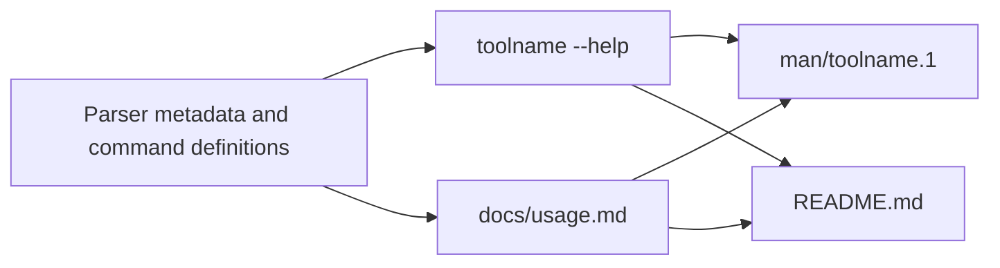

# CLI Documentation Standard 1.1

- **Status:** Active; immutable package version 1.1; documentation contract 1.0.
- **Owner:** Project standards / repository template.
- **Last updated:** 2026-07-11.
- **Last source check:** 2026-07-07.
- **Scope:** User-facing usage documentation for command-line tools: help text, canonical Markdown usage references, man pages, and optional CI checks across script and packaged profiles.

---

## Table of Contents

- [CLI Documentation Standard 1.1](#cli-documentation-standard-11)
  - [Table of Contents](#table-of-contents)
  - [Evidence convention](#evidence-convention)
  - [Requirement language](#requirement-language)
  - [Version assumptions](#version-assumptions)
  - [1. Purpose](#1-purpose)
  - [2. Scope and sibling relations](#2-scope-and-sibling-relations)
  - [3. Profiles](#3-profiles)
  - [4. Usage-doc structure and notation](#4-usage-doc-structure-and-notation)
  - [5. Help-text boundary](#5-help-text-boundary)
  - [6. Option entries](#6-option-entries)
  - [7. Examples](#7-examples)
  - [8. Packaged CLIs](#8-packaged-clis)
  - [9. CI drift prevention](#9-ci-drift-prevention)
  - [10. Accessibility and localization](#10-accessibility-and-localization)
  - [11. Templates](#11-templates)
  - [12. Adoption](#12-adoption)
  - [13. Exceptions process](#13-exceptions-process)
  - [14. Update process and review cadence](#14-update-process-and-review-cadence)
  - [15. Source register](#15-source-register)

## Evidence convention

This document separates **source-backed facts** from **project policy decisions**.

- Source-backed facts cite source IDs such as `[S01]`.
- Every source ID is listed in [§15 Source register](#15-source-register).
- Policy decisions are local standards for this ecosystem. They may be informed by sources, but the final choice is a standard, not a claim that an upstream source mandates it.
- Two research inputs ground the facts here: the CLI documentation-framework synthesis (man-page section model, help-vs-docs boundary, notation, accessibility) and the packaged/`src`-layout follow-up report `[S19]` (entry points, man-page packaging limits, generated docs tooling, installed-wrapper CI). The narrative rationale behind the rules lives in [`resources/research-notes.md`](resources/research-notes.md); this document carries the rules only.

---

## Requirement language

Requirement keywords follow RFC 2119.

- **MUST**, **REQUIRED**, and **SHALL** indicate absolute requirements.
- **MUST NOT** and **SHALL NOT** indicate absolute prohibitions.
- **SHOULD** and **RECOMMENDED** indicate strong defaults; exceptions are allowed only when the reason is understood and project-scoped.
- **SHOULD NOT** and **NOT RECOMMENDED** indicate strong discouragement; exceptions require a specific reason.
- **MAY** and **OPTIONAL** indicate permitted choices.

Lowercase modal verbs in running text carry the same normative force as their uppercase equivalents; uppercase is a typographic convention, not a stronger requirement level. Imperative bullets under **Rules** are normative even when they do not repeat an uppercase keyword — the leading verb controls the default requirement strength:

| Leading wording | Default meaning |
| --- | --- |
| "Do not" / "Never" | **MUST NOT** |
| Direct commands such as "Use", "Document", "Generate", "Keep", "Reserve" | **MUST** |
| "Prefer" | **SHOULD** |
| "Avoid" | **SHOULD NOT** |
| "Consider" | Advisory; use judgment unless the bullet also says **MUST**, **SHOULD**, or **MAY** |

Policy decision: uppercase keywords and the verb mapping make the standard deterministic for coding agents. They are not used to make every stylistic preference sound more important than it is.

---

## Version assumptions

The following tool behaviors are assumed current as of the last source check. They shape the CI rules in [§9](#9-ci-drift-prevention); reverify them when a referenced tool changes. These assumptions apply only when a consumer selects the corresponding Python parser or packaging tools; the default package profile selects neither Python nor CI.

- Python 3.14 `argparse` emits colored help by default and adds did-you-mean suggestions for mistyped arguments. `argparse` exits with status `2` on invalid arguments. `[S09]`
- Click rewraps help text to the terminal width and a configured maximum content width, and exposes defaults and environment variables in help when configured. `[S12]`
- Typer builds on Click and adds grouped help panels (`rich_help_panel`). `[S13]`

Rules:

- Any tool version pinned in the shipped templates (help2man, sphinx-click, mkdocs-click, sphinxcontrib-typer, sphinx-argparse-cli, and the build backend's `shared-data` support) is a **template default to recheck**, not a fixed requirement of this standard. `[S19]`
- CI pipelines that unpack a built wheel to inspect shipped files MUST pin `wheel >= 0.47.0` (CVE-2026-24049, a path-traversal fix). `[S19]`

---

## 1. Purpose

A CLI's **command-line surface is a public interface**: command names, subcommands, option spellings, default behaviors with semantic effect, exit codes, environment variables, file locations, and output formats all affect user automation and operator expectations. This standard defines how to document that interface consistently and how to keep the documentation from drifting away from the tool.

The interface is published through up to four coordinated artifacts, tied together by a **single source of truth**: the parser definitions own the accepted surface and generate `--help`; the canonical Markdown usage reference owns the complete user contract; the man page is a generated artifact, not hand-maintained; and the README stays intentionally shorter, leading users to the authoritative usage reference. `[S01]` `[S06]` This model minimizes drift without forcing every distribution style into the same repository layout: a single-file script often collapses the set to `script --help` plus a compact README, while a packaged CLI keeps a full `docs/usage.md`.



The artifact chain is the intended relationship, not a literal build dependency in every project. Which artifacts are mandatory is set by the profile ([§3](#3-profiles)).

---

## 2. Scope and sibling relations

**In scope** — the user-facing documentation of a CLI's usage: the man-style section registry for usage references; synopsis notation; the boundary between help text and full docs; the option-entry contract; example style; exit-code, environment, and file documentation; the packaged-CLI concerns of entry-point naming and man-page shipping; the CI checks that prevent drift; and accessibility and localization policy for CLI docs.

**Out of scope** — this standard does not govern:

- **Markdown formatting of the docs** — a usage doc is ordinary `.md`, formatted by Prettier and linted by markdownlint under the [Markdown Tooling Standard](https://github.com/L3DigitalNet/project-standards/blob/main/standards/markdown-tooling/README.md).
- **The implementation toolchain** — uv, Ruff, BasedPyright, pytest, and packaging are owned by the [Python Tooling SSOT Standard](https://github.com/L3DigitalNet/project-standards/blob/main/standards/python-tooling/README.md); how the CLI code is shaped is owned by the [Python Coding Standard](https://github.com/L3DigitalNet/project-standards/blob/main/standards/python-coding/README.md).
- **Pre-implementation definition** — the requirements, design, and plan for a tool are a project specification under the [Project Specification Standard](https://github.com/L3DigitalNet/project-standards/blob/main/standards/project-spec/README.md); a spec _defines_ the tool, this standard documents the shipped interface.
- **Managed-doc metadata** — where a usage doc is a managed Markdown file, its YAML frontmatter is governed by the [Markdown Frontmatter Standard](https://github.com/L3DigitalNet/project-standards/blob/main/standards/markdown-frontmatter/README.md).

**Relationship to sibling standards** — this standard governs the interface documentation; the siblings govern the toolchain that produces it, the format that surrounds it, and the plan that precedes it.

| Sibling | Relationship |
| --- | --- |
| Markdown Tooling | Formats and lints the usage docs; this standard governs their content and structure. |
| Python Tooling / Coding | Own the toolchain and code shape of the CLI a usage doc describes. |
| Project Specification | Owns the pre-implementation definition; this standard owns the post-implementation usage reference. |
| Markdown Frontmatter | Governs the metadata block on managed usage docs. |

---

## 3. Profiles

The standard defines three profiles that form a strict ladder — **Script ⊂ Packaged ⊂ Packaged-deep** — each a superset of the previous. Profiles select by distribution shape and by a recorded judgment on usage-reference maintainability.

| Profile | Selection criterion | MUST | SHOULD / MAY |
| --- | --- | --- | --- |
| **Script** | Single-file, run in place, no packaging | `--help` and `--version`; a compact README (per the single-file template); documented exit codes | usage doc MAY; man page MAY |
| **Packaged** | Installed via `[project.scripts]` entry points; a single-page usage reference remains maintainable (see selection signals below) | Script tier **plus**: `docs/usage.md` using the man-style section registry, covering **every leaf command**, with `NAME`/`SYNOPSIS` keyed to the **entry-point name** (never the module path or filename); a CI smoke test of the **installed** entry point | man page SHOULD-if-practical — generated, shipped via the build backend's `shared-data`, and documented as best-effort because wheels cannot reach the system `MANPATH` |
| **Packaged, deep** | Adopter selects it when the single-page reference is no longer maintainable (see selection signals below) | Packaged tier, except the usage reference MUST be **generated** per-command (`docs/cli/<command>.md`, pip-style) from parser metadata (sphinx-click / mkdocs-click / sphinxcontrib-typer / sphinx-argparse-cli); hand-maintained per-command pages are prohibited; plus one shared-concepts page (common environment variables, exit codes, config) | docs-site hosting MAY |

**Profile selection is a recorded adopter judgment**, exactly like the Project Specification profile choice: the adopter records the chosen profile and its rationale in the usage doc or repo docs. It is guided by signals, not validator-checked numbers.

Rules:

- Selection signals that the **Packaged-deep** profile is warranted: more than roughly 5–7 **top-level** subcommands; **or** a second nesting level **combined with** a leaf-command count large enough that the single page demonstrably drifts or becomes unnavigable. `[S19]`
- **Nesting level alone is a signal, never a trigger.** A small two-group CLI is not forced into the deep profile by nesting; the deep profile's _generated, never hand-maintained_ mandate only pays for itself at scale. `[S19]`
- The Packaged tier's **every-leaf-command** MUST is the guard that keeps a shallow profile choice from hiding undocumented commands: a documented usage reference MUST cover every leaf command the tool exposes.
- **Every `[project.scripts]` key is a public command** unless the adopter explicitly classifies it as internal, in writing, in the usage doc. `[S19]`

**Multi-entry-point packages** (several `[project.scripts]` keys in one `pyproject.toml`) map one usage-reference page to each **installed command name** by default, with shared concepts factored into one cross-referenced page. `[S19]` **Grouped-page provision:** closely related single-purpose commands from one distribution MAY share a combined reference page — or the primary command's usage doc — provided **each installed command gets its own complete entry** (`NAME`, `SYNOPSIS`, `OPTIONS`, `EXIT STATUS`), following the man-page precedent for grouping related commands. `[S01]`

---

## 4. Usage-doc structure and notation

A usage reference MUST use man-style section names even though the source is Markdown, so it converts cleanly to a man page and keeps heading meaning stable across projects. Sections MUST appear in the conventional order below. `[S01]`

| Man-style section | Markdown heading | Include |
| --- | --- | --- |
| `NAME` | `## NAME` | `toolname` — one-line purpose, lowercase sentence style where practical |
| `SYNOPSIS` | `## SYNOPSIS` | Formal invocation grammar only; no explanations mixed in |
| `DESCRIPTION` | `## DESCRIPTION` | What the tool does, what it does not do, default behavior, stdin/stdout/stderr model if relevant |
| `OPTIONS` | `## OPTIONS` | Every flag, option-argument, positional, and subcommand the user can invoke |
| `EXIT STATUS` | `## EXIT STATUS` | Enumerated exit codes and exact conditions |
| `ENVIRONMENT` | `## ENVIRONMENT` | Environment variables that affect behavior |
| `FILES` | `## FILES` | Config, state, cache, lock, socket, and generated-output paths, with defaults |
| `EXAMPLES` | `## EXAMPLES` | Task-first, copy-pasteable examples with safe defaults |
| `NOTES` / `CAVEATS` | `## NOTES` or `## CAVEATS` | Edge cases, non-obvious behavior, destructive warnings, platform caveats |
| `SEE ALSO` | `## SEE ALSO` | Related commands, sibling tools, other docs |
| `STANDARDS` (optional) | `## STANDARDS` | Conformance or compatibility claims, when they matter |
| `HISTORY` (optional) | `## HISTORY` | Material version-to-version behavior changes that affect users |

Rules:

- A README MUST NOT force this order; front-load install, quick start, and common tasks in a README instead. The reference page is for completeness and stability; the README is for entry. `[S01]`

A usage doc MUST use exactly **one** synopsis notation system and MUST NOT mix it with classic man-page typography in the same source. The required Markdown notation is the GitHub CLI convention. `[S08]` Mixing conventions is the failure mode to avoid, because the same placeholder can then read as optional in one place and required in another. `[S01]` `[S04]`

| Notation         | Meaning                               |
| ---------------- | ------------------------------------- |
| `toolname`       | literal token typed exactly           |
| `<path>`         | required replaceable value            |
| `[<path>]`       | optional replaceable value            |
| `[--flag]`       | optional flag                         |
| `{check \| fix}` | required mutually exclusive choice    |
| `[fast \| safe]` | optional mutually exclusive choice    |
| `<file>...`      | one or more repeatable values         |
| `--`             | end-of-options marker, when supported |

Example `SYNOPSIS` forms:

```text
toolname [OPTIONS] <input>
toolname [GLOBAL OPTIONS] <command> [COMMAND OPTIONS] [ARGS]...
toolname {check | fix} [--format <fmt>] <path>...
toolname [--output <file>] -- <path>...
```

---

## 5. Help-text boundary

Help text and the usage doc have distinct jobs, and the boundary MUST be explicit. `--help` is concise orientation; the usage doc is the exhaustive contract. `[S06]`

| Surface | Purpose | Include | Exclude |
| --- | --- | --- | --- |
| `toolname --help` | Fast orientation | usage line, short description, common flags, common subcommands, 1–3 examples, pointer to full docs | complete semantics, exhaustive caveats, long tutorials, every edge case |
| `toolname <subcommand> --help` | Task-local reference | subcommand usage, local options, short explanation, maybe one example | unrelated global detail |
| `docs/usage.md` | Canonical user contract | complete behavior, all options, exit codes, environment, files, caveats, examples | internal implementation details not needed to use the tool |
| man page | Installed terminal reference | the same user contract as the usage doc, optimized for terminal lookup | repository-specific contributor notes |
| README | Onboarding | install, quick start, common tasks, link to the usage doc | exhaustive option-by-option treatment |

Rules:

- Help text MUST be generated from the parser, never hand-written separately. Hand-maintained help drifts from the accepted surface the parser actually enforces. `[S06]`
- `--help` SHOULD lead with examples, because users reach for them first. `[S06]`

---

## 6. Option entries

Every documented option MUST answer the same questions in the same order. The required fields:

| Field | Required | Why it matters |
| --- | --- | --- |
| Spelling | yes | exact short and long forms |
| Value syntax | if applicable | what replaces the metavar |
| Meaning | yes | explains behavior, not just restates the flag |
| Default | if any | prevents guesswork |
| Allowed values | if constrained | reduces invalid invocations |
| Mutually exclusive / depends on | if applicable | prevents ambiguous combinations |
| Applies to | for subcommands or scoped flags | avoids leaking global assumptions |
| Safety impact | if any | especially for destructive or non-idempotent actions |
| Environment / config interaction | if any | documents precedence |
| Since / deprecated | if versioned | supports compatibility-aware users |

An option entry MUST be short but complete. These fields match what `argparse`, Click, and Typer expose as parser metadata — names, defaults, metavars, choices, help text, and grouping — and what `man-pages(7)` expects of `OPTIONS`. `[S01]`

```markdown
### `--format <fmt>`, `-f <fmt>`

Select the output format.

Allowed values: `text`, `json`, `markdown`.

Default: `text` when writing to a terminal; `json` when piped.

Mutually exclusive with `--raw`.

Environment: overrides `TOOLNAME_FORMAT`.

Since: `1.4.0`.
```

---

## 7. Examples

Examples MUST be written **task-first**, not syntax-first: a short task label, a copy-pasteable command, then output only when it materially clarifies behavior. Common cases come first. `[S06]`

Rules:

- Examples MUST be copy-paste-safe. For destructive or stateful commands, bias examples toward safety: put `--dry-run`, explicit file paths, and explicit output targets into the docs before showing irreversible operations.
- Any credentials, hostnames, account IDs, or file paths in examples MUST use clearly fake placeholders.

Preferred pattern:

````markdown
### Preview changes without writing files

```bash
toolname sync --dry-run ./workspace
```

Shows planned actions and writes nothing.
````

---

## 8. Packaged CLIs

For a packaged, installable CLI, the user-facing invocation is the **installed wrapper name** — the `[project.scripts]` entry-point key — not the module file. `[S19]`

Rules:

- The entry-point name is the command contract. `NAME` and `SYNOPSIS` MUST use the entry-point key as the command name, never the module path or file name. `[S19]`
- **`prog` discipline:** `__main__.py` and the entry point MUST call the same `main()`, and `prog` MUST be pinned to the entry-point name, so `python -m pkg` and the installed command agree in help output. `[S19]`
- Automated help, man-page, or doc generation MUST shell out to the **installed** command (after `pip install .` / `uv tool install .`), not `python -m pkg.__main__` or a source file — the two invocation styles can disagree on `prog` unless it is pinned. `[S19]`
- A man page SHOULD be shipped where practical, generated (for example via `help2man` from `--help`/`--version`, or a parser-to-man tool) and installed through the build backend's `shared-data`. `[S02]` `[S19]` Man-page installation is best-effort and MUST be documented as such: wheels install under `sys.prefix` (the virtualenv), not the system `MANPATH`, so `man toolname` frequently fails unless the tool is installed system-wide or `MANPATH` is extended. `--help` and the usage reference remain the non-negotiable primary channels regardless. `[S19]`
- Under the **Packaged-deep** profile the per-command reference MUST be generated from parser metadata (sphinx-click / mkdocs-click / sphinxcontrib-typer / sphinx-argparse-cli), one page per command, plus one shared-concepts page; hand-maintained per-command pages are prohibited. `[S16]` `[S17]` `[S19]`
- Multi-entry-point packages MUST document one usage-reference page per installed command name, with shared concepts (config format, common environment variables, shared exit-code table) factored into one cross-referenced page, subject to the [§3](#3-profiles) grouped-page provision. `[S19]`

---

## 9. CI drift prevention

Documentation drift is prevented by CI checks that fail on real user-visible divergence between the docs, `--help`, the parser, and the man page. The following checks are mandated at the Packaged profile and above.

| Check | Purpose | Requirement |
| --- | --- | --- |
| Installed-wrapper smoke | proves the built, installed entry point actually runs and renders help | required |
| Subcommand help smoke | keeps local help intact | required for subcommand CLIs |
| Inventory parity | every `[project.scripts]` key and parser leaf appears in the docs | required |
| Option / exit-code parity | each documented option and exit code exists in the parser | required |
| Generated man-page diff | catches a stale shipped man page | required if a man page is committed |
| Example execution | protects copy-paste examples | required for simple, safe examples; fixture-backed for complex ones |

Rules:

- The installed-wrapper smoke test MUST build an artifact, install it into a throwaway environment, and invoke the **installed** command via subprocess — not an in-process runner or `python -m pkg`, which miss broken entry-point metadata and `prog` drift. `[S19]`
- Snapshot tests of help output MUST normalize `NO_COLOR` and a fixed terminal width before comparing, because Python 3.14 `argparse` colors help by default and Click rewraps by width. `[S09]` `[S12]`
- Tests MUST NOT assert on `argparse` section headings (for example "optional arguments" versus "options"), which drift across Python versions. Compare semantic extracts or normalized text instead. `[S09]`
- Exit codes MUST be enumerated with their conditions, reserving `2` for usage errors where the parser stack does so naturally (the `argparse` default). `[S09]`

Package contract 1.0 keeps executable selection outside desired package configuration. `command_name` is documentation-only and MUST NOT affect shell commands, executable paths, workflow variables, provider selection, or rendered run bytes. When CI is enabled, the consumer supplies a repository-relative `workflow_path`; reconciliation records that file as a consumer-owned referenced input rather than package-owned workflow output. The rendered GitHub workflow reads the reviewed repository variable `CLI_DOCS_COMMAND`, validates it as a basename, and invokes it quoted.

For the Python/uv profile, the workflow MUST build a wheel, create a throwaway virtual environment, install the built wheel, and smoke the installed wrapper. The generic profile MAY smoke a wrapper already installed on the selected runner. Exact V1 workflow bytes remain a recognized migration state; arbitrary edits fail verification. CI-disabled configuration has no workflow path, referenced-input lock, provider verification, Python assumption, or GitHub ownership.

---

## 10. Accessibility and localization

CLI docs MUST remain usable without color or terminal-specific rendering, and MUST keep the executable command surface identical across locales. `[S14]`

Rules:

- Docs and help MUST NOT rely on color-only meaning, and the tool MUST honor `NO_COLOR` to disable ANSI color output. `[S05]` `[S14]`
- Headings MUST stay semantic and examples MUST remain valid in plain text, so published docs are structurally navigable and degrade predictably. `[S14]`
- Where docs are localized, translate explanatory prose, headings, and instructional text; build from gettext-compatible sources and localize the man page and long-form docs. `[S10]`
- Never translate the command surface: command names, subcommand spellings, option names, placeholders with programmatic meaning, shell examples, or environment-variable names. They are executable syntax, not prose. `[S10]`
- Documentation changes that alter command names, option spellings, semantic defaults, exit codes, environment variables, file locations, or output formats MUST be versioned as interface changes, not editorial edits. `[S11]` A human-facing changelog SHOULD group changes as `Added`, `Changed`, `Deprecated`, `Removed`, `Fixed`, and `Security`, with each released version linked. `[S18]`

---

## 11. Templates

The package ships create-only and reference scaffolds. Fill the placeholders and delete guidance comments before committing.

| Template | Use for |
| --- | --- |
| [`templates/usage-doc.md`](templates/usage-doc.md) | The canonical man-style `docs/usage.md` reference; option-entry and example blocks are embedded. |
| [`templates/readme-single-file.md`](templates/readme-single-file.md) | The compact single-file-script README (Script profile). |
| `render-workflow` provider | Optional GitHub Actions content derived from enabled CI options. The generated workflow stays consumer-owned and no `.github/workflows/**` path is claimed. |

---

## 12. Adoption

The V5 control-plane lifecycle is documented by `project-standards`; package-specific profile, command-name, and conditional CI choices are in [`adopt.md`](adopt.md). Reconciliation creates `docs/usage.md` only when absent. The workflow renderer returns consumer-owned content and never claims a GitHub workflow path. This payload does not print or install a legacy YAML configuration fragment.

---

## 13. Exceptions process

Choosing a smaller profile, omitting an optional section, or shipping a man page as best-effort is **tailoring**, not an exception — the profiles and checks are built to accept it. A true exception is deviating from a MUST this standard states: documenting a command surface under a name other than its entry-point key, hand-maintaining per-command pages under the deep profile, or omitting a leaf command from the usage reference. Record a genuine exception in the adopter's usage doc or repo docs, stating what the standard requires, what the project does instead, which CI drift guards are consequently disabled, and why tailoring does not already cover it — the same shape the [Project Specification Standard](https://github.com/L3DigitalNet/project-standards/blob/main/standards/project-spec/README.md#7-exceptions-process) uses. An exception forfeits the drift guarantees the standard exists to provide, so prefer tailoring wherever it suffices.

---

## 14. Update process and review cadence

Review this standard when:

- A **referenced tool's behavior** shifts — `argparse` help/color/exit behavior, Click wrapping, Typer help panels, or a parser-to-docs or man-page generator ([Version assumptions](#version-assumptions), [§9](#9-ci-drift-prevention)).
- The **Python packaging story** for entry points, wheels, or `shared-data` man-page installation changes ([§8](#8-packaged-clis)).
- A **referenced external convention** changes — the GitHub CLI syntax guide, `man-pages(7)`, `NO_COLOR`, WCAG, Semantic Versioning, or Keep a Changelog (verify the [§15](#15-source-register) register on review).
- The **profile ladder or mandated CI checks** ([§3](#3-profiles), [§9](#9-ci-drift-prevention)) change.

Review cadence:

- Light review: quarterly.
- Full review: annually.
- Immediate review: after any change to the profile ladder, the mandated CI checks, or an upstream tool or convention this standard pins to.

Until the standard is released for adoption it is reviewed continuously; the cadence above takes effect at first release.

---

## 15. Source register

Source-backed facts in this document cite the IDs below. In-repo context entries carry no external URL. The `Last checked` date is when each source was last confirmed current.

| ID | Source | URL | What it grounds | Last checked |
| --- | --- | --- | --- | --- |
| S01 | Linux `man-pages(7)` | [man7.org/linux/man-pages/man7/man-pages.7.html](https://man7.org/linux/man-pages/man7/man-pages.7.html) | Section names and order, `SYNOPSIS`/`DESCRIPTION`/`OPTIONS` semantics, grouped related commands | 2026-07-07 |
| S02 | GNU `help2man` | [gnu.org/software/help2man](https://www.gnu.org/software/help2man/) | Man-page generation from `--help`/`--version`; localized man pages | 2026-07-07 |
| S03 | In-repo single-file scripts README | _in-repo context (no external URL)_ | The portable-script distribution pattern the Script profile supports | 2026-07-07 |
| S04 | Prior in-repo CLI documentation-structure research | _in-repo context (no external URL)_ | Man-style sections plus modern Markdown notation, and the notation-ambiguity hazard | 2026-07-07 |
| S05 | `NO_COLOR` convention | [no-color.org](https://no-color.org/) | Plain-text opt-out from ANSI color output | 2026-07-07 |
| S06 | Command Line Interface Guidelines (clig.dev) | [clig.dev](https://clig.dev/) | Help-vs-documentation boundary, examples-first help, terminal and web docs | 2026-07-07 |
| S07 | GNU Coding Standards — command-line interfaces | [gnu.org/prep/standards/html_node/Command_002dLine-Interfaces.html](https://www.gnu.org/prep/standards/html_node/Command_002dLine-Interfaces.html) | `--help`, `--version`, long-option and GNU/POSIX expectations | 2026-07-07 |
| S08 | GitHub CLI command-line syntax guide | [github.com/cli/cli/blob/trunk/docs/command-line-syntax.md](https://github.com/cli/cli/blob/trunk/docs/command-line-syntax.md) | Markdown synopsis notation (`<arg>`, `[arg]`, `{a \| b}`, `...`) | 2026-07-07 |
| S09 | Python `argparse` documentation | [docs.python.org/3/library/argparse.html](https://docs.python.org/3/library/argparse.html) | Parser-generated help, exit `2` on usage errors, Python 3.14 colored help and suggestions | 2026-07-07 |
| S10 | GNU gettext manual + Sphinx internationalization | [gnu.org/software/gettext/manual/gettext.html](https://www.gnu.org/software/gettext/manual/gettext.html) | gettext/PO-based localization workflow for prose and man pages (with Sphinx intl) | 2026-07-07 |
| S11 | Semantic Versioning | [semver.org](https://semver.org/) | Public-API change semantics applied to the command surface | 2026-07-07 |
| S12 | Click documentation | [click.palletsprojects.com/en/stable/documentation](https://click.palletsprojects.com/en/stable/documentation/) | Generated help, width-based rewrapping, displayed defaults and env vars | 2026-07-07 |
| S13 | Typer — command help | [typer.tiangolo.com/tutorial/commands/help](https://typer.tiangolo.com/tutorial/commands/help/) | Docstring-sourced help, rich help panels, grouping | 2026-07-07 |
| S14 | W3C WCAG 2.2 | [w3.org/TR/WCAG22](https://www.w3.org/TR/WCAG22/) | Perceivable/operable/understandable/robust principles; no color-only meaning | 2026-07-07 |
| S15 | `argparse-manpage` | [github.com/praiskup/argparse-manpage](https://github.com/praiskup/argparse-manpage) | Man-page generation from `ArgumentParser` objects | 2026-07-07 |
| S16 | `sphinx-click` | [sphinx-click.readthedocs.io](https://sphinx-click.readthedocs.io/en/latest/) | Click parser to Sphinx docs, nested-command support | 2026-07-07 |
| S17 | `sphinx-argparse` | [sphinx-argparse.readthedocs.io](https://sphinx-argparse.readthedocs.io/en/latest/) | `argparse` to Sphinx documentation generation | 2026-07-07 |
| S18 | Keep a Changelog | [keepachangelog.com/en/1.1.0](https://keepachangelog.com/en/1.1.0/) | Human-curated, grouped, dated changelog structure | 2026-07-07 |
| S19 | CLI Usage Documentation for Packaged `src/`-Layout Python Projects (in-repo research report, 2026-07-07) | [`docs/research/2026-07-07-cli-usage-docs-packaged-src-layout-python.md`](https://github.com/L3DigitalNet/project-standards/blob/main/docs/research/2026-07-07-cli-usage-docs-packaged-src-layout-python.md) | Entry points as source of truth, man-page-in-wheels limits, generated docs tooling, multi-entry-point layout, installed-wrapper CI smoke, CVE-2026-24049 | 2026-07-07 |
