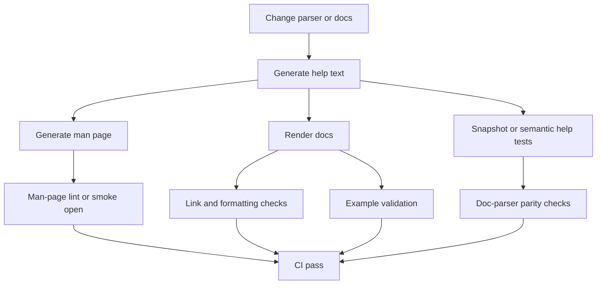

# CLI Documentation Standard — Research Notes

This document is **rationale, not rules**. It carries the argumentative background behind the CLI Documentation Standard — why the requirements in [`../README.md`](../README.md) look the way they do. Where a claim traces to an external source, it cites the same `[S##]` IDs as the README's [source register](../README.md#15-source-register); nothing here overrides or restates a requirement, and nothing here should be read as adding one.

## Standards landscape

The standards and conventions behind this document play different roles. Treat them as a stack, not as competitors.

| Source | Authority | What it governs | How to use it |
| --- | --- | --- | --- |
| `man-pages(7)` | Primary | Section names, section meanings, classic synopsis semantics, what to omit from `DESCRIPTION` | Structural baseline for the canonical reference and generated man page |
| POSIX Utility Syntax Guidelines | Primary | Option / option-argument / operand model, end-of-options mindset, utility grammar discipline | Grammar discipline for flag and operand behavior |
| GNU Coding Standards | Primary | `--help`, `--version`, long options, consistency of common flag names, GNU vs POSIX option behavior | Expectations users bring to GNU-like CLIs |
| clig.dev | High-value community guidance | Help vs documentation, examples, terminal docs, discoverability | UX policy for help text and documentation layering |
| GitHub CLI syntax guide | Practical modern convention | Markdown synopsis notation | Standard notation for Markdown `SYNOPSIS` sections |
| `argparse` | Primary implementation doc | Generated help, usage formatting, exit behavior, color, suggestion behavior | Parser-driven help and test expectations |
| Click | Primary implementation doc | Help generation, short help, argument documentation, defaults, env-var exposure | Parser-driven help for Click CLIs |
| Typer | Primary implementation doc | Command docstrings, grouped help panels, rich help output | Parser-driven help for Typer CLIs |
| `help2man` | Primary GNU tool | Man-page generation from `--help` and `--version`; localized man pages | Lowest-friction man-page pipeline |
| `argparse-manpage`, `sphinx-click`, `sphinx-argparse` | Practical tooling | Parser→man page and parser→published docs | Language-specific doc extraction |

This lines up with the two research inputs behind the standard: the CLI documentation-framework synthesis (man-page section model, help-vs-docs boundary, notation, accessibility) and the prior in-repo CLI documentation-structure research, both of which independently converged on canonical man-style sections, modern Markdown notation in Markdown sources, and a clear separation between help text and full documentation. `[S01]` `[S04]`

## Four standards details worth policy

A few standards details mattered enough to become explicit rules rather than background color.

**First**, `man-pages(7)` treats `SYNOPSIS` as a brief summary of interface syntax — brackets for optional items, vertical bars for alternatives, ellipses for repetition — while `DESCRIPTION` explains what the program does and omits internals unless they are necessary to understand the interface. That is a strong baseline for human-facing usage docs, not just generated `.1` files, which is why [README §4](../README.md#4-usage-doc-structure-and-notation) keeps the man-style section registry even for a Markdown source. `[S01]`

**Second**, GNU recommends following POSIX guidelines for command-line options, providing long-option equivalents for one-letter options where appropriate, using consistent long names such as `--verbose`, and supporting both `--help` and `--version`. GNU also flags that its own `getopt` option-reordering behavior is an extension rather than POSIX behavior — worth knowing so a project's docs don't imply a stricter grammar than its parser actually accepts. `[S07]`

**Third**, clig.dev is not a formal standard, but it is unusually useful because it draws a clean line between **help text** and **documentation**: concise help for quick orientation, web-based docs for discoverability, terminal docs for installed-version accuracy, and man pages because users still reflexively reach for `man`. It also recommends leading with examples in help text, because users prefer them — the basis for [README §5](../README.md#5-help-text-boundary)'s help-text boundary and the `--help` SHOULD-lead-with-examples rule. `[S06]`

**Fourth**, modern Markdown docs benefit from GitHub CLI's notation rules because classic man-page typography does not map naturally onto Markdown: literal text for fixed tokens, `<placeholder>` for required replaceable values, `[item]` for optional items, `{a | b}` for required mutually exclusive choices, and `...` for repeatable arguments. That is the clearest reusable convention for Markdown sources, and it is why [README §4](../README.md#4-usage-doc-structure-and-notation) mandates exactly one notation system per document. `[S08]` `[S04]`

## Tooling comparison

The tooling landscape splits into a single-file/script half (man-page generation from `--help`) and a packaged half (parser-to-docs generation and installed-entry-point testing).

| Tool | Role | Why it earned a place in the standard |
| --- | --- | --- |
| `help2man` | Man-page generation from `--help`/`--version` | Lowest-friction pipeline for any CLI with decent help output; supports localized man pages via `--locale`. `[S02]` |
| `argparse-manpage` | `argparse` → man page | Avoids hand-documenting parser arguments twice for `argparse` CLIs. `[S15]` |
| `sphinx-click` | Click → Sphinx docs | Extracts Click command trees, including nested subcommands, into published docs. `[S16]` |
| `sphinx-argparse` / `sphinx-argparse-cli` | `argparse` → Sphinx docs | `sphinx-argparse` covers general `argparse` extraction; `sphinx-argparse-cli` specifically markets subcommand-friendly rendering. `[S17]` `[S19]` |
| `sphinxcontrib-typer` | Typer → Sphinx docs | Uses Typer's own Rich console formatting for HTML/text/SVG output; the Typer analog of `sphinx-click`. `[S19]` |
| `mkdocs-click`, `mkdocs-typer2` | Click/Typer → MkDocs | Both recurse into subcommands automatically when pointed at the root command/group, generating one page tree per invocation rather than one block per subcommand — this is what makes the Packaged-deep profile's "generated, never hand-maintained" per-command page requirement ([README §3](../README.md#3-profiles), [§8](../README.md#8-packaged-clis)) practical instead of a maintenance burden. `mkdocs-typer2` is the maintained successor to the stale `mkdocs-typer`. `[S19]` |
| `pytest-console-scripts`, `python-cli-test-helpers` | Installed-entry-point testing | Both exist specifically because in-process testing (Click's `CliRunner`, direct function calls, `python -m pkg`) does not prove the packaged, installed console-script entry point actually works — a bad entry-point string or missing package metadata slips through unit-level tests. This is the direct grounding for [README §9](../README.md#9-ci-drift-prevention)'s installed-wrapper smoke test, which must invoke the installed command via `subprocess`, not an in-process runner. `[S19]` |

**Supporting context for [README §9](../README.md#9-ci-drift-prevention):** the CI checks that table mandates were arrived at as the tail end of a pipeline —

— and two checks that were considered but folded into other rules rather than kept as separate table rows: **color normalization** and **width normalization** are subsumed into the README §9 rule that snapshot tests of help output must normalize `NO_COLOR` and a fixed terminal width. A **broken-link / docs-build** check (useful once a Packaged-deep adopter actually stands up a generated multi-page docs site) was left out of the mandated baseline because docs-site hosting itself is optional (`MAY`) under the Packaged-deep profile — an adopter who does build a hosted site should add a link/build check for it, but the standard does not require the site in the first place.

## Man pages in wheels: why the man page is best-effort

The Packaged-CLI research report's footgun finding is the reason [README §8](../README.md#8-packaged-clis) documents man-page installation as best-effort rather than requiring it outright:

- setuptools' own docs say plainly that `data_files` is deprecated and does not work reliably with wheels.
- PEP 427 (the wheel format spec) defines exactly eight fixed `sysconfig`-mapped subkeys for a wheel's `.data/` directory, with no dedicated "man page" category — a man page has to ride under the generic `data` subkey, mapped to `share/man/man1/` via `sysconfig`, and every installer is free to interpret unknown subkey names differently.
- A multi-year PyPA discourse thread confirms no PEP has been accepted to formalize OS-integration files (man pages, `.desktop` launchers, systemd units) for wheels; current behavior is implementation-defined per installer.
- The practical modern replacement is Hatchling's `[tool.hatch.build.targets.wheel.shared-data]` (and Flit's analogous `shared-data`), which map source files to `share/man/man1/toolname.1` inside the wheel's `.data/data/` directory — the backend-native successor to setuptools' deprecated `data_files`.

**Bottom line:** modern Python packaging can still ship a man page, but there is no first-class "man page" packaging primitive and no guarantee it lands on the runtime `MANPATH` — installed files go under `sys.prefix` (the virtualenv), not `/usr/share/man`, for the common `pip install` case. `man toolname` will frequently fail to find a wheel-installed man page unless `MANPATH` is extended or the tool is installed system-wide (for example via `pipx`, or an OS package built from the sdist). That is exactly why `--help` and the usage reference — never the man page — are the non-negotiable primary channels in this standard, regardless of whether the man page installs correctly in a given environment. `[S19]`

## Localization, versioning, changelogs, and accessibility

**Observation.** GNU gettext is an established internationalization standard, and Sphinx uses gettext-based extraction and PO/POT workflows for whole-document translation. `[S10]` `help2man` can generate localized man pages using `--locale` when both the program and `help2man` support the locale. `[S02]` `[S10]` Semantic Versioning formalizes change semantics around a declared public API. `[S11]` Keep a Changelog argues for a human-curated, grouped changelog with dated, linkable versions. `[S18]` WCAG 2.2 frames accessibility around four principles — perceivable, operable, understandable, and robust — and explicitly requires keyboard operability. `[S14]` The `NO_COLOR` convention gives users a straightforward way to disable ANSI color output. `[S05]` `[S14]`

**Inference.** For CLI documentation, the command surface itself is part of the public API: command names, subcommands, option spellings, default behaviors with semantic effect, exit codes, environment variables, file locations, and output formats all affect user automation and operator expectations. Documentation changes that alter those semantics should therefore be versioned like interface changes, not treated as editorial trivia. `[S11]` Localized documentation should translate explanatory prose, headings, and surrounding instructional text, but command literals should stay stable across locales because they are executable syntax, not prose. `[S10]` Accessibility for CLI docs is mostly about structure and degradation: semantic headings, keyboard-friendly terminal/manual access, no color-only meaning, readable examples, predictable plain-text fallbacks, and explicit language metadata on published docs. `[S14]`

**Recommendation.** Four policies followed from this reasoning, and all four are now rules in [README §10](../README.md#10-accessibility-and-localization): stamp canonical usage docs with the tool version (or an "applies to version range" note) and mark option entries with `Since:` / `Deprecated:` when relevant; keep a human-facing changelog with grouped sections (`Added`, `Changed`, `Deprecated`, `Removed`, `Fixed`, `Security`) and a link for each released version; if localizing, build from gettext-compatible sources and localize the man page and long-form docs, but never translate command spellings, syntactic placeholders, shell commands, or environment-variable names; and add an accessibility gate — honor `NO_COLOR`, avoid color-only semantics, keep examples valid in plain text, and check that published docs stay structurally navigable. `[S05]` `[S10]` `[S11]` `[S14]` `[S18]`

## Open questions

Two questions surfaced during research and remain open; they are not blocking anything this standard currently requires, but are worth revisiting.

| # | Question | Why it's open |
| --- | --- | --- |
| 1 | What is the recommended versioned-docs-hosting pattern specifically for packaged-CLI reference pages — Read the Docs' native version selector for Sphinx sites, `mike` for MkDocs Material multi-version sites, or a single-version static site like `docs.astral.sh`? | The generation tooling ([Tooling comparison](#tooling-comparison) above) is well covered, but no source directly compared hosting/versioning strategies for CLI reference docs specifically. |
| 2 | Does the PEP 772 Python Packaging Council have (or gain) an active proposal to formalize man-page/OS-integration-file installation in wheels? | PEP 772 (accepted 2026-04-16) creates a binding Python Packaging Council, but no source addresses a post-PEP-772 agenda item on this. A formal standard here would remove the best-effort caveat in [README §8](../README.md#8-packaged-clis) and [Man pages in wheels](#man-pages-in-wheels-why-the-man-page-is-best-effort) above. |

`[S19]`

## Pointers

- The packaged/`src`-layout research report this standard's packaged-CLI half is grounded in: [`docs/research/2026-07-07-cli-usage-docs-packaged-src-layout-python.md`](https://github.com/L3DigitalNet/project-standards/blob/main/docs/research/2026-07-07-cli-usage-docs-packaged-src-layout-python.md).
- The original draft this document, the README, `adopt.md`, and the templates were all split out of is preserved in git history rather than in the working tree — retrieve it with `git log --follow -- standards/cli-documentation/cli-documentation-standards.md`.
