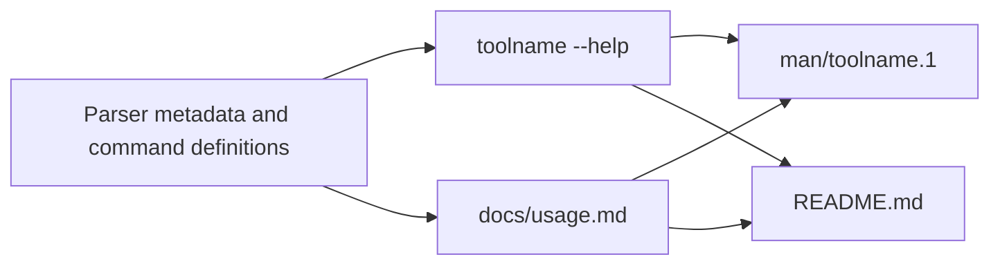

# CLI Documentation Standard 1.6

- **Status:** Active; immutable package version 1.6; documentation contract 1.0.
- **Owner:** Project standards / repository template.
- **Last updated:** 2026-08-01.
- **Last source check:** 2026-08-01.
- **Scope:** User-facing usage documentation for command-line tools: help text, canonical Markdown usage references, man pages, shell completions, and optional CI checks across run-in-place and installed profiles.

---

## Table of Contents

- [CLI Documentation Standard 1.6](#cli-documentation-standard-16)
  - [Table of Contents](#table-of-contents)
  - [Evidence convention](#evidence-convention)
  - [Requirement language](#requirement-language)
  - [Version assumptions](#version-assumptions)
  - [1. Purpose](#1-purpose)
  - [2. Scope and sibling relations](#2-scope-and-sibling-relations)
  - [3. Profiles](#3-profiles)
  - [4. Usage-doc structure and notation](#4-usage-doc-structure-and-notation)
  - [5. Help-text boundary](#5-help-text-boundary)
  - [6. Option entries](#6-option-entries)
  - [7. Examples](#7-examples)
  - [8. Packaged CLIs](#8-packaged-clis)
  - [9. CI drift prevention](#9-ci-drift-prevention)
  - [10. Accessibility and localization](#10-accessibility-and-localization)
  - [11. Templates](#11-templates)
  - [12. Adoption](#12-adoption)
  - [13. Exceptions process](#13-exceptions-process)
  - [14. Update process and review cadence](#14-update-process-and-review-cadence)
  - [15. Source register](#15-source-register)

## Evidence convention

This document separates **source-backed facts** from **project policy decisions**.

- Source-backed facts cite source IDs such as `[S01]`.
- Every source ID is listed in [§15 Source register](#15-source-register).
- Policy decisions are local standards for this ecosystem. They may be informed by sources, but the final choice is a standard, not a claim that an upstream source mandates it.
- Three research inputs ground the facts here: the CLI documentation-framework synthesis (man-page section model, help-vs-docs boundary, notation, accessibility); the packaged/`src`-layout Python report `[S19]` (entry points, wheel man-page limits, generated docs tooling, installed-wrapper CI); and the 2026-08-01 Go source review `[S20]`–`[S25]` (built executables, Cobra document and completion generation, ancillary-file packaging, toolchain selection, and reviewed repository variables). The narrative rationale behind the rules lives in [`resources/research-notes.md`](resources/research-notes.md); this document carries the rules only.

---

## Requirement language

Requirement keywords follow RFC 2119.

- **MUST**, **REQUIRED**, and **SHALL** indicate absolute requirements.
- **MUST NOT** and **SHALL NOT** indicate absolute prohibitions.
- **SHOULD** and **RECOMMENDED** indicate strong defaults; exceptions are allowed only when the reason is understood and project-scoped.
- **SHOULD NOT** and **NOT RECOMMENDED** indicate strong discouragement; exceptions require a specific reason.
- **MAY** and **OPTIONAL** indicate permitted choices.

Lowercase modal verbs in running text carry the same normative force as their uppercase equivalents; uppercase is a typographic convention, not a stronger requirement level. Imperative bullets under **Rules** are normative even when they do not repeat an uppercase keyword — the leading verb controls the default requirement strength:

| Leading wording | Default meaning |
| --- | --- |
| "Do not" / "Never" | **MUST NOT** |
| Direct commands such as "Use", "Document", "Generate", "Keep", "Reserve" | **MUST** |
| "Prefer" | **SHOULD** |
| "Avoid" | **SHOULD NOT** |
| "Consider" | Advisory; use judgment unless the bullet also says **MUST**, **SHOULD**, or **MAY** |

Policy decision: uppercase keywords and the verb mapping make the standard deterministic for coding agents. They are not used to make every stylistic preference sound more important than it is.

---

## Version assumptions

The following tool behaviors are assumed current as of the last source check. They shape the CI rules in [§9](#9-ci-drift-prevention); reverify them when a referenced tool changes. These assumptions apply only when a consumer selects the corresponding parser, build, packaging, or CI tools; the default package profile selects neither a language nor CI.

- Python 3.14 `argparse` emits colored help by default and adds did-you-mean suggestions for mistyped arguments. `argparse` exits with status `2` on invalid arguments. `[S09]`
- Click rewraps help text to the terminal width and a configured maximum content width, and exposes defaults and environment variables in help when configured. `[S12]`
- Typer builds on Click and adds grouped help panels (`rich_help_panel`). `[S13]`
- Go's `go build -o <output> <package>` compiles one selected `main` package to an explicitly named executable; `go install` instead installs executables under `GOBIN` or its documented default. `[S20]`
- Cobra can generate Markdown for an entire command tree, man pages, and Bash, Zsh, Fish, and PowerShell completion scripts from the command model. `[S21]` `[S22]`
- `actions/setup-go` accepts `go.mod` through `go-version-file`; the rendered Go workflow pins the reviewed action commit rather than a moving tag. `[S24]`

Rules:

- Any tool version pinned in the shipped templates (help2man, Python parser-to-doc generators, Cobra, packaging tools, and CI actions) is a **template default to recheck**, not a fixed requirement of this standard. `[S19]` `[S21]` `[S24]`
- CI pipelines that unpack a built wheel to inspect shipped files MUST pin `wheel >= 0.47.0` (CVE-2026-24049, a path-traversal fix). `[S19]`

---

## 1. Purpose

A CLI's **command-line surface is a public interface**: command names, subcommands, option spellings, default behaviors with semantic effect, exit codes, environment variables, file locations, and output formats all affect user automation and operator expectations. This standard defines how to document that interface consistently and how to keep the documentation from drifting away from the tool.

The interface is published through up to four coordinated artifacts, tied together by a **single source of truth**: the parser definitions own the accepted surface and generate `--help`; the canonical Markdown usage reference owns the complete user contract; the man page is a generated artifact, not hand-maintained; and the README stays intentionally shorter, leading users to the authoritative usage reference. `[S01]` `[S06]` This model minimizes drift without forcing every distribution style into the same repository layout: a single-file script often collapses the set to `script --help` plus a compact README, while a packaged CLI keeps a full `docs/usage.md`.



The artifact chain is the intended relationship, not a literal build dependency in every project. Which artifacts are mandatory is set by the profile ([§3](#3-profiles)).

---

## 2. Scope and sibling relations

**In scope** — the user-facing documentation of a CLI's usage: the man-style section registry for usage references; synopsis notation; the boundary between help text and full docs; the option-entry contract; example style; exit-code, environment, file, and shell-completion documentation; the installed-CLI concerns of executable naming and generated artifact shipping; the CI checks that prevent drift; and accessibility and localization policy for CLI docs.

**Out of scope** — this standard does not govern:

- **Markdown formatting of the docs** — a usage doc is ordinary `.md`, formatted by Prettier and linted by markdownlint under the [Markdown Tooling Standard](../../../markdown-tooling/README.md).
- **The implementation toolchain** — Python tooling and code shape are owned by the [Python Tooling SSOT Standard](../../../python-tooling/README.md) and [Python Coding Standard](../../../python-coding/README.md). Go module, build, test, lint, release, and language-selection policy remains with the adopting repository's Go authorities. This standard governs only the user-facing CLI documentation and its drift evidence.
- **Pre-implementation definition** — the requirements, design, and plan for a tool are a project specification under the [Project Specification Standard](../../../project-spec/README.md); a spec _defines_ the tool, this standard documents the shipped interface.
- **Managed-doc metadata** — where a usage doc is a managed Markdown file, its YAML frontmatter is governed by the [Markdown Frontmatter Standard](../../../markdown-frontmatter/README.md).

**Relationship to sibling standards** — this standard governs the interface documentation; the siblings govern the toolchain that produces it, the format that surrounds it, and the plan that precedes it.

| Sibling | Relationship |
| --- | --- |
| Markdown Tooling | Formats and lints the usage docs; this standard governs their content and structure. |
| Language tooling / coding | Owns implementation, build, test, packaging, and release mechanics; this standard maps documented executable surfaces onto those authorities. |
| Project Specification | Owns the pre-implementation definition; this standard owns the post-implementation usage reference. |
| Markdown Frontmatter | Governs the metadata block on managed usage docs. |

---

## 3. Profiles

The standard defines three profiles that form a strict ladder — **Script ⊂ Packaged ⊂ Packaged-deep** — each a superset of the previous. Profiles select by distribution shape and by a recorded judgment on usage-reference maintainability.

| Profile | Selection criterion | MUST | SHOULD / MAY |
| --- | --- | --- | --- |
| **Script** | Run in place rather than installed or published as a named distribution artifact; typically one source file or one direct runtime invocation | `--help` and `--version`; a compact README (per the single-file template); documented exit codes | usage doc MAY; man page MAY |
| **Packaged** | Installed or published as one or more named executable commands; a single-page usage reference remains maintainable (see selection signals below) | Script tier **plus**: `docs/usage.md` using the man-style section registry, covering **every leaf command**, with `NAME`/`SYNOPSIS` keyed to the **installed executable name** rather than a module or source path; a CI smoke test of the built distribution command | generated man page SHOULD-if-practical; generated shell completions MAY and, when shipped, MUST follow the documentation and drift rules below |
| **Packaged, deep** | Adopter selects it when the single-page reference is no longer maintainable (see selection signals below) | Packaged tier, except the usage reference MUST be **generated** per-command (`docs/cli/<command>.md`, pip-style) from parser or command-tree metadata using an applicable generator; hand-maintained per-command pages are prohibited; plus one shared-concepts page (common environment variables, exit codes, config) | docs-site hosting MAY |

**Profile selection is a recorded adopter judgment**, exactly like the Project Specification profile choice: the adopter records the chosen profile and its rationale in the usage doc or repo docs. It is guided by signals, not validator-checked numbers.

Rules:

- Selection signals that the **Packaged-deep** profile is warranted: more than roughly 5–7 **top-level** subcommands; **or** a second nesting level **combined with** a leaf-command count large enough that the single page demonstrably drifts or becomes unnavigable. `[S19]`
- **Nesting level alone is a signal, never a trigger.** A small two-group CLI is not forced into the deep profile by nesting; the deep profile's _generated, never hand-maintained_ mandate only pays for itself at scale. `[S19]`
- The Packaged tier's **every-leaf-command** MUST is the guard that keeps a shallow profile choice from hiding undocumented commands: a documented usage reference MUST cover every leaf command the tool exposes.
- **Every executable name published by the distribution authority is a public command** unless the adopter explicitly classifies it as internal, in writing, in the usage doc. For Python, `[project.scripts]` is that authority. For Go, use the explicit release/build inventory, not the incidental set of directories that happen to contain `package main`. `[S19]` `[S20]`

**Multi-command distributions** map one usage-reference page to each **installed executable name** by default, with shared concepts factored into one cross-referenced page. Python distributions commonly derive that set from several `[project.scripts]` keys; Go distributions derive it from their explicit build or release targets. `[S19]` `[S20]` **Grouped-page provision:** closely related single-purpose commands from one distribution MAY share a combined reference page — or the primary command's usage doc — provided **each installed command gets its own complete entry** (`NAME`, `SYNOPSIS`, `OPTIONS`, `EXIT STATUS`), following the man-page precedent for grouping related commands. `[S01]`

When adopting this package for several CLIs, `usage_index_path` MAY identify one repository-relative, consumer-owned Markdown index that links those per-command references. Reconciliation records the index as a referenced input and a fresh create-only `docs/usage.md` scaffold links to it. The package does not generate one artifact or CI job per command.

---

## 4. Usage-doc structure and notation

A usage reference MUST use man-style section names even though the source is Markdown, so it converts cleanly to a man page and keeps heading meaning stable across projects. Sections MUST appear in the conventional order below. `[S01]`

| Man-style section | Markdown heading | Include |
| --- | --- | --- |
| `NAME` | `## NAME` | `toolname` — one-line purpose, lowercase sentence style where practical |
| `SYNOPSIS` | `## SYNOPSIS` | Formal invocation grammar only; no explanations mixed in |
| `DESCRIPTION` | `## DESCRIPTION` | What the tool does, what it does not do, default behavior, stdin/stdout/stderr model if relevant |
| `OPTIONS` | `## OPTIONS` | Every flag, option-argument, positional, and subcommand the user can invoke |
| `EXIT STATUS` | `## EXIT STATUS` | Enumerated exit codes and exact conditions |
| `ENVIRONMENT` | `## ENVIRONMENT` | Environment variables that affect behavior |
| `SHELL COMPLETION` (optional) | `## SHELL COMPLETION` | Supported shells, generation command, activation or package-managed installation, and whether completion descriptions or dynamic values require external state |
| `FILES` | `## FILES` | Config, state, cache, lock, socket, and generated-output paths, with defaults |
| `EXAMPLES` | `## EXAMPLES` | Task-first, copy-pasteable examples with safe defaults |
| `NOTES` / `CAVEATS` | `## NOTES` or `## CAVEATS` | Edge cases, non-obvious behavior, destructive warnings, platform caveats |
| `SEE ALSO` | `## SEE ALSO` | Related commands, sibling tools, other docs |
| `STANDARDS` (optional) | `## STANDARDS` | Conformance or compatibility claims, when they matter |
| `HISTORY` (optional) | `## HISTORY` | Material version-to-version behavior changes that affect users |

Rules:

- A README MUST NOT force this order; front-load install, quick start, and common tasks in a README instead. The reference page is for completeness and stability; the README is for entry. `[S01]`

A usage doc MUST use exactly **one** synopsis notation system and MUST NOT mix it with classic man-page typography in the same source. The required Markdown notation is the GitHub CLI convention. `[S08]` Mixing conventions is the failure mode to avoid, because the same placeholder can then read as optional in one place and required in another. `[S01]` `[S04]`

| Notation         | Meaning                               |
| ---------------- | ------------------------------------- |
| `toolname`       | literal token typed exactly           |
| `<path>`         | required replaceable value            |
| `[<path>]`       | optional replaceable value            |
| `[--flag]`       | optional flag                         |
| `{check \| fix}` | required mutually exclusive choice    |
| `[fast \| safe]` | optional mutually exclusive choice    |
| `<file>...`      | one or more repeatable values         |
| `--`             | end-of-options marker, when supported |

Example `SYNOPSIS` forms:

```text
toolname [OPTIONS] <input>
toolname [GLOBAL OPTIONS] <command> [COMMAND OPTIONS] [ARGS]...
toolname {check | fix} [--format <fmt>] <path>...
toolname [--output <file>] -- <path>...
```

---

## 5. Help-text boundary

Help text and the usage doc have distinct jobs, and the boundary MUST be explicit. `--help` is concise orientation; the usage doc is the exhaustive contract. `[S06]`

| Surface | Purpose | Include | Exclude |
| --- | --- | --- | --- |
| `toolname --help` | Fast orientation | usage line, short description, common flags, common subcommands, 1–3 examples, pointer to full docs | complete semantics, exhaustive caveats, long tutorials, every edge case |
| `toolname <subcommand> --help` | Task-local reference | subcommand usage, local options, short explanation, maybe one example | unrelated global detail |
| `docs/usage.md` | Canonical user contract | complete behavior, all options, exit codes, environment, files, caveats, examples | internal implementation details not needed to use the tool |
| man page | Installed terminal reference | the same user contract as the usage doc, optimized for terminal lookup | repository-specific contributor notes |
| README | Onboarding | install, quick start, common tasks, link to the usage doc | exhaustive option-by-option treatment |

Rules:

- Help text MUST be generated from the parser, never hand-written separately. Hand-maintained help drifts from the accepted surface the parser actually enforces. `[S06]`
- `--help` SHOULD lead with examples, because users reach for them first. `[S06]`

---

## 6. Option entries

Every documented option MUST answer the same questions in the same order. The required fields:

| Field | Required | Why it matters |
| --- | --- | --- |
| Spelling | yes | exact short and long forms |
| Value syntax | if applicable | what replaces the metavar |
| Meaning | yes | explains behavior, not just restates the flag |
| Default | if any | prevents guesswork |
| Allowed values | if constrained | reduces invalid invocations |
| Mutually exclusive / depends on | if applicable | prevents ambiguous combinations |
| Applies to | for subcommands or scoped flags | avoids leaking global assumptions |
| Safety impact | if any | especially for destructive or non-idempotent actions |
| Environment / config interaction | if any | documents precedence |
| Since / deprecated | if versioned | supports compatibility-aware users |

An option entry MUST be short but complete. These fields match what `argparse`, Click, Typer, and command-tree libraries such as Cobra expose as command metadata — names, defaults, value syntax, choices or validation, help text, and grouping — and what `man-pages(7)` expects of `OPTIONS`. `[S01]` `[S21]`

```markdown
### `--format <fmt>`, `-f <fmt>`

Select the output format.

Allowed values: `text`, `json`, `markdown`.

Default: `text` when writing to a terminal; `json` when piped.

Mutually exclusive with `--raw`.

Environment: overrides `TOOLNAME_FORMAT`.

Since: `1.4.0`.
```

---

## 7. Examples

Examples MUST be written **task-first**, not syntax-first: a short task label, a copy-pasteable command, then output only when it materially clarifies behavior. Common cases come first. `[S06]`

Rules:

- Examples MUST be copy-paste-safe. For destructive or stateful commands, bias examples toward safety: put `--dry-run`, explicit file paths, and explicit output targets into the docs before showing irreversible operations.
- Any credentials, hostnames, account IDs, or file paths in examples MUST use clearly fake placeholders.

Preferred pattern:

````markdown
### Preview changes without writing files

```bash
toolname sync --dry-run ./workspace
```

Shows planned actions and writes nothing.
````

---

## 8. Packaged CLIs

For an installed or published CLI, the user-facing invocation is the **installed executable name**, not a module, package, or source-file path. The distribution's explicit command inventory is the authority for public command names.

Rules:

- The executable name is the command contract. `NAME` and `SYNOPSIS` MUST use that installed name, never an implementation module, import path, package selector, or source filename.
- Automated help snapshots and executable-output generators MUST invoke the built distribution command, not a source-only shortcut that can bypass packaging metadata, linker-supplied version data, startup wiring, or the installed name.
- A man page SHOULD be shipped where practical and MUST be generated from command metadata and/or normalized `--help` plus `--version` output rather than maintained independently. `[S02]`
- Under the **Packaged-deep** profile, the per-command reference MUST be generated from parser or command-tree metadata, one page per command plus one shared-concepts page; hand-maintained per-command pages are prohibited. Python generators include sphinx-click, mkdocs-click, sphinxcontrib-typer, and sphinx-argparse-cli. Cobra's `doc.GenMarkdownTree` is an applicable Go generator. `[S16]` `[S17]` `[S19]` `[S21]`
- Multi-command distributions MUST document one usage-reference page per installed executable name, with shared concepts (config format, common environment variables, shared exit-code table) factored into one cross-referenced page, subject to the [§3](#3-profiles) grouped-page provision.

### Python mapping

- Every `[project.scripts]` key is an installed executable name unless explicitly classified as internal. `[S19]`
- `__main__.py` and the entry point MUST call the same `main()`, and parser display names MUST be pinned to the installed executable name so `python -m pkg` and the installed command agree in help output. `[S19]`
- Automated help, man-page, or doc generation MUST shell out to the installed wrapper after building and installing the wheel, not invoke `python -m pkg.__main__` or a source file. `[S19]`
- A wheel MAY carry a generated man page through backend `shared-data`, but the usage docs MUST describe installation as best-effort: wheel data installs under the selected prefix and frequently does not reach the system `MANPATH`. `--help` and the usage reference remain primary. `[S19]`

### Go mapping

- The explicit build or release configuration MUST inventory the public executable names and the single `main` package that produces each one. A `cmd/` directory is a common layout, not a public-interface registry by itself. `[S20]`
- Automated help snapshots MUST invoke the built executable. Do not substitute `go run`, because it does not prove the named artifact, release-time linker values, or distribution wiring. `[S20]`
- `go build -o <explicit-output> <single-main-package>` is the baseline CI mapping because it proves the selected package produces the documented executable name. `go install` remains a valid user installation method when the project supports it, but its destination follows `GOBIN`/`GOPATH` rules and it installs the executable rather than a complete OS-integration bundle. `[S20]`
- Cobra users SHOULD generate deep Markdown with `doc.GenMarkdownTree` and man pages with `doc.GenManTree`; another framework MAY use an equivalent command-model generator or a deterministic executable-output generator. `[S21]`
- Go release archives and OS-package definitions MAY carry generated man pages and completion files. Document whether a channel merely includes those files or installs them into the platform's man/completion search paths. GoReleaser's package-manager integrations demonstrate both mappings; the exact release tool remains consumer-owned. `[S23]`

### Generated shell completions

When a CLI exposes shell completion, the usage reference MUST document:

- every supported shell and the exact generation command;
- temporary activation separately from persistent or package-managed installation;
- output paths only when the selected shell or package channel defines them;
- whether descriptions, file completion, network-backed values, or other dynamic behavior differ by shell; and
- how to regenerate or verify committed completion artifacts.

Completion scripts generated from the command model MUST NOT be edited independently. If generated scripts are committed or shipped, CI MUST regenerate and compare them after normalizing only documented volatile content. Cobra provides generation APIs for Bash, Zsh, Fish, and PowerShell, with shell-specific capability differences that the usage reference must not conceal. `[S22]`

---

## 9. CI drift prevention

Documentation drift is prevented by CI checks that fail on real user-visible divergence between the docs, `--help`, the parser, and the man page. The following checks are mandated at the Packaged profile and above.

| Check | Purpose | Requirement |
| --- | --- | --- |
| Built-distribution command smoke | proves the built wheel wrapper or compiled executable actually runs and renders help | required |
| Subcommand help smoke | keeps local help intact | required for subcommand CLIs |
| Inventory parity | every published executable name and command-tree leaf appears in the docs | required |
| Option / exit-code parity | each documented option and exit code exists in the parser | required |
| Generated man-page diff | catches a stale shipped man page | required if a man page is committed |
| Generated completion diff | catches stale shell scripts or unsupported-shell claims | required if completion artifacts are committed or shipped |
| Example execution | protects copy-paste examples | required for simple, safe examples; fixture-backed for complex ones |

Rules:

- The built-distribution smoke test MUST invoke the built command via a subprocess. Python MUST build and install a wheel into a throwaway environment before invoking its wrapper. Go MUST build one explicit `main` package to a throwaway executable path before invoking that binary. In-process runners, `python -m`, and `go run` do not satisfy this check. `[S19]` `[S20]`
- Snapshot tests of help output MUST normalize only controls the selected runtime supports. Set `NO_COLOR` when supported, fix terminal width when the renderer wraps by width, and keep semantic comparison separate from runtime-specific headings or decoration. `[S05]` `[S09]` `[S12]`
- Python tests MUST NOT assert on `argparse` section headings (for example "optional arguments" versus "options"), which drift across Python versions. Compare semantic extracts or normalized text instead. `[S09]`
- Exit codes MUST be enumerated with their exact conditions. Reserve `2` for usage errors only when the selected parser or application contract actually does so; `argparse` supplies that behavior, but it is not a language-neutral default. `[S09]`
- Generated documentation, man pages, and completion scripts MUST be derived from the same command model or built executable as `--help`. A committed artifact diff is a drift check, not a second authoring path. `[S21]` `[S22]`

Package contract 1.0 keeps executable selection outside desired package configuration. `command_name` is documentation-only and MUST NOT affect shell commands, executable paths, workflow variables, provider selection, or rendered run bytes. When CI is enabled, the consumer supplies a repository-relative `workflow_path`; reconciliation records that file as a consumer-owned referenced input rather than package-owned workflow output. The `workflow_ownership` option records the migration-time ownership decision: `referenced` (the default) verifies the recognized workflow as a referenced input, while `consumer-owned` relinquishes a customized legacy workflow entirely to the consumer with CI left disabled. The separate `usage_ownership` option defaults to `managed`, which creates `docs/usage.md` only when absent; selecting `consumer-owned` preserves a customized legacy usage reference and leaves the path outside reconciliation and lock state. An optional `usage_index_path` identifies one repository-relative, consumer-owned regular Markdown file. It is locked as a referenced input and linked from a fresh managed usage scaffold without transferring ownership. The rendered GitHub workflow reads the reviewed repository variable `CLI_DOCS_COMMAND`, validates it as a basename, and invokes it quoted.

For the Python/uv profile, the workflow MUST build a wheel, create a throwaway virtual environment, install the built wheel, and smoke the installed wrapper. For the Go profile, the reviewed `CLI_DOCS_GO_PACKAGE` repository variable MUST be `.` or one explicit contained `./relative/package` without patterns or traversal; the workflow reads the toolchain from `go.mod`, builds that package to a temporary executable named by `CLI_DOCS_COMMAND`, and smokes the binary. The generic profile MAY smoke a command already installed on the selected runner. Repository variables are accessed through GitHub's `vars` context, validated before shell use, and quoted at every boundary. `[S20]` `[S24]` `[S25]` Exact V1 workflow bytes remain a recognized migration state; arbitrary edits fail verification. CI-disabled configuration has no workflow path, referenced-input lock, provider verification, language assumption, or GitHub ownership.

---

## 10. Accessibility and localization

CLI docs MUST remain usable without color or terminal-specific rendering, and MUST keep the executable command surface identical across locales. `[S14]`

Rules:

- Docs and help MUST NOT rely on color-only meaning, and the tool MUST honor `NO_COLOR` to disable ANSI color output. `[S05]` `[S14]`
- Headings MUST stay semantic and examples MUST remain valid in plain text, so published docs are structurally navigable and degrade predictably. `[S14]`
- Where docs are localized, translate explanatory prose, headings, and instructional text; build from gettext-compatible sources and localize the man page and long-form docs. `[S10]`
- Never translate the command surface: command names, subcommand spellings, option names, placeholders with programmatic meaning, shell examples, or environment-variable names. They are executable syntax, not prose. `[S10]`
- Documentation changes that alter command names, option spellings, semantic defaults, exit codes, environment variables, file locations, or output formats MUST be versioned as interface changes, not editorial edits. `[S11]` A human-facing changelog SHOULD group changes as `Added`, `Changed`, `Deprecated`, `Removed`, `Fixed`, and `Security`, with each released version linked. `[S18]`

---

## 11. Templates

The package ships create-only and reference scaffolds. Fill the placeholders and delete guidance comments before committing.

| Template | Use for |
| --- | --- |
| [`templates/usage-doc.md`](templates/usage-doc.md) | The canonical man-style `docs/usage.md` reference; option-entry and example blocks are embedded. |
| [`templates/readme-single-file.md`](templates/readme-single-file.md) | The compact single-file-script README (Script profile). |
| `render-workflow` provider | Optional GitHub Actions content derived from enabled CI options. The generated workflow stays consumer-owned and no `.github/workflows/**` path is claimed. |

---

## 12. Adoption

The V5 control-plane lifecycle is documented by `project-standards`; package-specific profile, command-name, ownership, optional usage-index, and conditional CI choices are in [`adopt.md`](adopt.md). With `usage_ownership = "managed"`, reconciliation creates `docs/usage.md` only when absent. A configured usage index must already be a contained regular Markdown file; the package references but never writes or removes it. The workflow renderer returns consumer-owned content and never claims a GitHub workflow path. This payload does not print or install a legacy YAML configuration fragment.

---

## 13. Exceptions process

Choosing a smaller profile, omitting an optional section, or shipping a man page as best-effort is **tailoring**, not an exception — the profiles and checks are built to accept it. A true exception is deviating from a MUST this standard states: documenting a command surface under a name other than its installed executable name, hand-maintaining per-command pages under the deep profile, editing generated completion scripts independently, or omitting a leaf command from the usage reference. Record a genuine exception in the adopter's usage doc or repo docs, stating what the standard requires, what the project does instead, which CI drift guards are consequently disabled, and why tailoring does not already cover it — the same shape the [Project Specification Standard 1.6](../../../project-spec/versions/1.6/README.md#7-exceptions-process) uses. An exception forfeits the drift guarantees the standard exists to provide, so prefer tailoring wherever it suffices.

---

## 14. Update process and review cadence

Review this standard when:

- A **referenced tool's behavior** shifts — parser help/color/exit behavior, wrapping, generated docs, man pages, shell completions, `go build`, or CI setup actions ([Version assumptions](#version-assumptions), [§9](#9-ci-drift-prevention)).
- A **distribution or packaging story** changes — Python entry points or wheel data, Go build/install semantics, release archives, OS packages, man pages, or completion installation ([§8](#8-packaged-clis)).
- A **referenced external convention** changes — the GitHub CLI syntax guide, `man-pages(7)`, `NO_COLOR`, WCAG, Semantic Versioning, or Keep a Changelog (verify the [§15](#15-source-register) register on review).
- The **profile ladder or mandated CI checks** ([§3](#3-profiles), [§9](#9-ci-drift-prevention)) change.

Review cadence:

- Light review: quarterly.
- Full review: annually.
- Immediate review: after any change to the profile ladder, the mandated CI checks, or an upstream tool or convention this standard pins to.

Until the standard is released for adoption it is reviewed continuously; the cadence above takes effect at first release.

---

## 15. Source register

Source-backed facts in this document cite the IDs below. In-repo context entries carry no external URL. The `Last checked` date is when each source was last confirmed current.

| ID | Source | URL | What it grounds | Last checked |
| --- | --- | --- | --- | --- |
| S01 | Linux `man-pages(7)` | [man7.org/linux/man-pages/man7/man-pages.7.html](https://man7.org/linux/man-pages/man7/man-pages.7.html) | Section names and order, `SYNOPSIS`/`DESCRIPTION`/`OPTIONS` semantics, grouped related commands | 2026-07-07 |
| S02 | GNU `help2man` | [gnu.org/software/help2man](https://www.gnu.org/software/help2man/) | Man-page generation from `--help`/`--version`; localized man pages | 2026-07-07 |
| S03 | In-repo single-file scripts README | _in-repo context (no external URL)_ | The portable-script distribution pattern the Script profile supports | 2026-07-07 |
| S04 | Prior in-repo CLI documentation-structure research | _in-repo context (no external URL)_ | Man-style sections plus modern Markdown notation, and the notation-ambiguity hazard | 2026-07-07 |
| S05 | `NO_COLOR` convention | [no-color.org](https://no-color.org/) | Plain-text opt-out from ANSI color output | 2026-07-07 |
| S06 | Command Line Interface Guidelines (clig.dev) | [clig.dev](https://clig.dev/) | Help-vs-documentation boundary, examples-first help, terminal and web docs | 2026-07-07 |
| S07 | GNU Coding Standards — command-line interfaces | [gnu.org/prep/standards/html_node/Command_002dLine-Interfaces.html](https://www.gnu.org/prep/standards/html_node/Command_002dLine-Interfaces.html) | `--help`, `--version`, long-option and GNU/POSIX expectations | 2026-07-07 |
| S08 | GitHub CLI command-line syntax guide | [github.com/cli/cli/blob/trunk/docs/command-line-syntax.md](https://github.com/cli/cli/blob/trunk/docs/command-line-syntax.md) | Markdown synopsis notation (`<arg>`, `[arg]`, `{a \| b}`, `...`) | 2026-07-07 |
| S09 | Python `argparse` documentation | [docs.python.org/3/library/argparse.html](https://docs.python.org/3/library/argparse.html) | Parser-generated help, exit `2` on usage errors, Python 3.14 colored help and suggestions | 2026-07-07 |
| S10 | GNU gettext manual + Sphinx internationalization | [gnu.org/software/gettext/manual/gettext.html](https://www.gnu.org/software/gettext/manual/gettext.html) | gettext/PO-based localization workflow for prose and man pages (with Sphinx intl) | 2026-07-07 |
| S11 | Semantic Versioning | [semver.org](https://semver.org/) | Public-API change semantics applied to the command surface | 2026-07-07 |
| S12 | Click documentation | [click.palletsprojects.com/en/stable/documentation](https://click.palletsprojects.com/en/stable/documentation/) | Generated help, width-based rewrapping, displayed defaults and env vars | 2026-07-07 |
| S13 | Typer — command help | [typer.tiangolo.com/tutorial/commands/help](https://typer.tiangolo.com/tutorial/commands/help/) | Docstring-sourced help, rich help panels, grouping | 2026-07-07 |
| S14 | W3C WCAG 2.2 | [w3.org/TR/WCAG22](https://www.w3.org/TR/WCAG22/) | Perceivable/operable/understandable/robust principles; no color-only meaning | 2026-07-07 |
| S15 | `argparse-manpage` | [github.com/praiskup/argparse-manpage](https://github.com/praiskup/argparse-manpage) | Man-page generation from `ArgumentParser` objects | 2026-07-07 |
| S16 | `sphinx-click` | [sphinx-click.readthedocs.io](https://sphinx-click.readthedocs.io/en/latest/) | Click parser to Sphinx docs, nested-command support | 2026-07-07 |
| S17 | `sphinx-argparse` | [sphinx-argparse.readthedocs.io](https://sphinx-argparse.readthedocs.io/en/latest/) | `argparse` to Sphinx documentation generation | 2026-07-07 |
| S18 | Keep a Changelog | [keepachangelog.com/en/1.1.0](https://keepachangelog.com/en/1.1.0/) | Human-curated, grouped, dated changelog structure | 2026-07-07 |
| S19 | CLI Usage Documentation for Packaged `src/`-Layout Python Projects (in-repo research report, 2026-07-07) | [`docs/research/2026-07-07-cli-usage-docs-packaged-src-layout-python.md`](../../../../docs/research/2026-07-07-cli-usage-docs-packaged-src-layout-python.md) | Entry points as source of truth, man-page-in-wheels limits, generated docs tooling, multi-entry-point layout, installed-wrapper CI smoke, CVE-2026-24049 | 2026-07-07 |
| S20 | Go command documentation | [pkg.go.dev/cmd/go](https://pkg.go.dev/cmd/go) | `go build -o`, single-main-package executable output, `go install`, and `GOBIN` behavior | 2026-08-01 |
| S21 | Cobra document generation | [Markdown](https://github.com/spf13/cobra/blob/main/site/content/docgen/md.md) and [man pages](https://github.com/spf13/cobra/blob/main/site/content/docgen/man.md) | Whole-command-tree Markdown and man-page generation from Cobra command metadata | 2026-08-01 |
| S22 | Cobra shell completions | [github.com/spf13/cobra/blob/main/site/content/completions/\_index.md](https://github.com/spf13/cobra/blob/main/site/content/completions/_index.md) | Bash, Zsh, Fish, and PowerShell generation plus shell-specific completion behavior | 2026-08-01 |
| S23 | GoReleaser package-manager integrations | [Homebrew Casks](https://goreleaser.com/customization/publish/homebrew_casks/) and [AUR](https://goreleaser.com/customization/publish/aur/) | Distribution of generated man pages and completion files through Go release channels | 2026-08-01 |
| S24 | `actions/setup-go` | [github.com/actions/setup-go](https://github.com/actions/setup-go) | `go-version-file: go.mod`, action versioning, and Go toolchain setup in GitHub Actions | 2026-08-01 |
| S25 | GitHub Actions contexts | [docs.github.com/actions/reference/workflows-and-actions/contexts](https://docs.github.com/en/actions/reference/workflows-and-actions/contexts) | Repository configuration variables through the `vars` context | 2026-08-01 |
