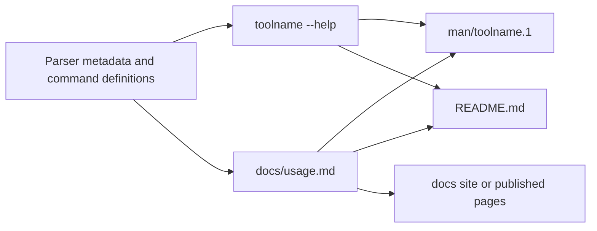
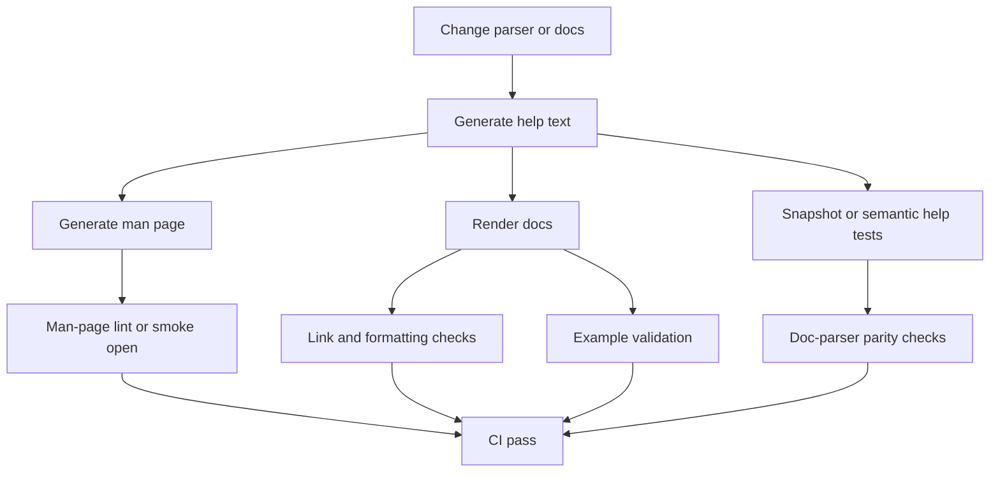

# Reusable Framework for User-Facing CLI Usage Documentation

Date: 2026-07-06

## Executive Summary

A reusable, standards-aligned CLI documentation framework should treat **the command-line surface as a public interface** and publish that interface through four coordinated artifacts: a concise in-tool `--help` surface, a canonical Markdown usage reference, an installable man page, and a short onboarding README. The standards base is not one single document; it is a layered stack. `man-pages(7)` gives the canonical manual-page section model and explicitly defines what belongs in `SYNOPSIS`, `DESCRIPTION`, `OPTIONS`, `EXIT STATUS`, `ENVIRONMENT`, `FILES`, and `SEE ALSO`. GNU coding standards add expected behaviors such as `--help`, `--version`, and consistent long-option names. clig.dev distinguishes concise help from exhaustive docs and still recommends man pages. GitHub CLI’s syntax guide is the clearest modern reference for Markdown synopsis notation such as `<arg>`, `[arg]`, `{a | b}`, and `...`. Python’s `argparse`, Click, and Typer then show how parser metadata can generate or structure help automatically. 1

The strongest reusable pattern is a **single-source-of-truth model**: parser definitions own the actual accepted CLI surface and generate `--help`; the full Markdown usage document owns the complete user contract; the man page is generated from help, parser metadata, or the Markdown source; and the README stays intentionally shorter, leading users to the authoritative usage reference. This model minimizes drift without forcing every distribution style into the same repository layout. It works for packaged, full-repo CLIs and also for portable single-file scripts, which often collapse the documentation set to `script --help` plus a compact README. That is also consistent with your current scripts repository model, which already mixes a top-level README with executable single-file commands and direct `--help` invocation. 2 3

The main structural recommendation is straightforward. For the **canonical usage reference**, keep **man-style headings and section names** even if the source is Markdown: `NAME`, `SYNOPSIS`, `DESCRIPTION`, `OPTIONS`, `EXIT STATUS`, `ENVIRONMENT`, `FILES`, `EXAMPLES`, `NOTES` or `CAVEATS`, and `SEE ALSO`. For Markdown notation, use the modern angle-bracket convention and do not mix it with classic man-page italics in the same source document. That specific ambiguity is well recognized and your in-repo research already converged on the same conclusion. 1 4

For automation and long-term maintainability, generate help from the parser, not by hand; generate the man page from the parser or from standardized help; test for drift in CI; and version the docs against the CLI surface. If you localize, use gettext-based tooling for prose docs and localized man pages, but do **not** localize command names, subcommand spellings, option names, placeholders with programmatic meaning, or shell examples. Accessibility needs an explicit policy too: no color-only meaning, support `NO_COLOR`, keep headings semantic, make help and docs keyboard- and screen-reader-friendly, and normalize color and wrapping in CI because modern help generators can emit ANSI color and rewrap text dynamically. 5

## Bottom line

The most robust default is this:

| Decision area | Recommended default |
| --- | --- | --- |
| Canonical user reference | `docs/usage.md` with man-style headings |
| In-tool help | Generated from parser metadata; concise by default, full on `-h` / `--help` |
| README for full-repo CLI | Short install + quick start + links to usage docs |
| README for single-file script | Compact self-contained document with quick start, synopsis, options summary, examples, exit/env notes |
| Synopsis notation in Markdown | GitHub CLI style: `<arg>`, `[arg]`, `{a | b}`,`...` |
| Actual man page | Generated artifact, not hand-maintained if practical |
| Parser as source of truth | Yes, for accepted flags, option spelling, metavars, defaults exposed in help |
| Exit code policy | Document all codes; reserve `2` for usage errors where the parser stack naturally does so |
| Localization | Translate prose and man pages; keep command surface untranslated |
| Drift prevention | CI checks on `--help`, docs/man generation, example validation, doc→parser parity |

This recommendation is standards-aligned rather than strictly standards-bound: the standards define the shape of the interface and the manual; the framework defines how to keep those surfaces synchronized in modern repositories. 1



The artifact chain above is the intended relationship, not necessarily a literal build dependency in every project. In a single-file script, `README.md`, the parser, and `script --help` often become the entire public documentation surface. In a full-repo CLI, `docs/usage.md` is usually the right canonical reference layer. clig.dev explicitly recommends both web-based and terminal-based documentation, and help2man plus parser-aware generators exist precisely to avoid double-maintaining the same interface description. 6 3

## Standards landscape

The relevant standards and conventions play different roles. Treat them as a stack, not as competitors.

| Source | Authority | What it governs | How to use it |
| --- | --- | --- | --- |
| `man-pages(7)` | Primary | Section names, section meanings, classic synopsis semantics, what to omit from `DESCRIPTION` | Structural baseline for the canonical reference and generated man page |
| POSIX Utility Syntax Guidelines | Primary | Option / option-argument / operand model, end-of-options mindset, utility grammar discipline | Grammar discipline for flag and operand behavior |
| GNU Coding Standards | Primary | `--help`, `--version`, long options, consistency of common flag names, GNU vs POSIX option behavior | Expectations users bring to GNU-like CLIs |
| clig.dev | High-value community guidance | Help vs documentation, examples, terminal docs, discoverability | UX policy for help text and documentation layering |
| GitHub CLI syntax guide | Practical modern convention | Markdown synopsis notation | Standard notation for Markdown `SYNOPSIS` sections |
| `argparse` | Primary implementation doc | Generated help, usage formatting, exit behavior, color, suggestion behavior | Parser-driven help and test expectations |
| Click | Primary implementation doc | Help generation, short help, argument documentation, defaults, env-var exposure | Parser-driven help for Click CLIs |
| Typer | Primary implementation doc | Command docstrings, grouped help panels, rich help output | Parser-driven help for Typer CLIs |
| `help2man` | Primary GNU tool | Man-page generation from `--help` and `--version`; localized man pages | Lowest-friction man-page pipeline |
| `argparse-manpage`, `sphinx-click`, `sphinx-argparse` | Practical tooling | Parser→man page and parser→published docs | Language-specific doc extraction |

This synthesis aligns with the documentation research already in your repo, which reached the same high-level conclusion: use canonical man-style sections, modern Markdown notation in Markdown sources, and keep help text distinct from full documentation. 1 4

A few standards details matter enough to adopt as explicit policy.

First, `man-pages(7)` says `SYNOPSIS` is a brief summary of interface syntax, uses brackets for optional items, vertical bars for alternatives, and ellipses for repetition, while `DESCRIPTION` should explain what the program does and omit internals unless those internals are necessary to understand the interface. That makes it a strong baseline for human-facing usage docs, not just generated `.1` files. 1

Second, GNU says it is a good idea to follow POSIX guidelines for command-line options, to provide long options equivalent to one-letter options where appropriate, to use consistent long names such as `--verbose`, and to support both `--help` and `--version`. GNU also calls out that GNU `getopt` behavior allowing option reordering is an extension rather than POSIX behavior; that matters when your docs imply a stricter grammar than your parser actually accepts. 7

Third, clig.dev is not a formal standard, but it is unusually useful because it clearly separates **help text** from **documentation**. It recommends concise help for quick orientation, web-based docs for discoverability, terminal docs for installed-version accuracy, and man pages because users still reflexively reach for `man`. It also explicitly recommends leading with examples in help text because users prefer them. 6

Fourth, modern Markdown docs benefit from GitHub CLI’s notation rules because classic man-page typography does not map naturally to Markdown. GitHub CLI’s guide uses literal text for fixed tokens, `<placeholder>` for required replaceable values, `[item]` for optional items, `{a | b}` for required mutually exclusive choices, and `...` for repeatable arguments. That is the clearest reusable convention for Markdown sources. 8

## Canonical document structure and notation

The cleanest reusable approach is to keep one **canonical usage-reference template** that mirrors man-page section names, even if the source file is Markdown. This preserves portability to man-page generation and keeps the meaning of headings stable across projects. `man-pages(7)` is explicit that sections should be arranged in a conventional order and that consistency helps readers. 1

### Mapping table

The following mapping is the recommended default for CLI usage-reference documents.

| Man-style section | Markdown heading | Include |
| --- | --- | --- |
| `NAME` | `## NAME` | `toolname` — one-line purpose, in lowercase sentence style where practical |
| `SYNOPSIS` | `## SYNOPSIS` | Formal invocation grammar only; no explanations mixed in |
| `DESCRIPTION` | `## DESCRIPTION` | What the tool does, what it does not do, default behavior, stdin/stdout/stderr model if relevant |
| `OPTIONS` | `## OPTIONS` | Every flag, option-argument, positional, and subcommand entry the user can invoke |
| `EXIT STATUS` | `## EXIT STATUS` | Enumerated exit codes and exact conditions |
| `ENVIRONMENT` | `## ENVIRONMENT` | Environment variables that affect behavior |
| `FILES` | `## FILES` | Config files, state/cache/history files, lockfiles, sockets, generated outputs, default paths |
| `EXAMPLES` | `## EXAMPLES` | Task-first, copy-pasteable examples with safe defaults |
| `NOTES` / `CAVEATS` | `## NOTES` or `## CAVEATS` | Edge cases, non-obvious behavior, destructive warnings, platform caveats |
| `SEE ALSO` | `## SEE ALSO` | Related commands, sibling tools, other docs |
| `STANDARDS` | optional | If conformance or compatibility claims matter |
| `HISTORY` | optional | If behavior changed materially by version and that affects users |

This is the strict reference-page model. For a README, do not force the same order; front-load install, quick start, and common tasks there instead. The reference page is for completeness and stability; the README is for entry. 1

### Synopsis notation

In Markdown, pick **one** notation system and never mix it with the classic man-page typography in the same source. The recommended Markdown notation is:

| Notation         | Meaning                              |
| ---------------- | ------------------------------------ |
| `toolname`       | literal token typed exactly          |
| `<path>`         | required replaceable value           |
| `[<path>]`       | optional replaceable value           |
| `[--flag]`       | optional flag                        |
| `{check \| fix}` | required mutually exclusive choice   |
| `[fast \| safe]` | optional mutually exclusive choice   |
| `<file>...`      | one or more repeatable values        |
| `--`             | end of options marker when supported |

Example `SYNOPSIS` forms:

```bash
toolname [OPTIONS] <input>
toolname [GLOBAL OPTIONS] <command> [COMMAND OPTIONS] [ARGS]...
toolname {check | fix} [--format <fmt>] <path>...
toolname [--output <file>] -- <path>...

```

Classic man pages use typographic distinction instead of angle brackets, but Markdown sources are better served by the GitHub-style convention. The failure mode to avoid is mixing both conventions in one document, because the same placeholder can then look optional in one place and required in another. 1 4

### What belongs in `--help` and what belongs in full docs

The documentation boundary should be explicit.

| Surface | Purpose | Include | Exclude |
| --- | --- | --- | --- |
| `toolname --help` | Fast orientation | usage line, short description, common flags, common subcommands, 1–3 examples, pointer to full docs/support | complete semantics, exhaustive caveats, long tutorials, every edge case |
| `toolname subcommand --help` | Task-local reference | subcommand usage, local options, short explanation, maybe one example | unrelated global detail |
| `docs/usage.md` | Canonical user contract | complete behavior, all options, exit codes, env, files, caveats, examples | internal implementation details not needed to use the tool |
| man page | Installed terminal reference | same user contract as usage doc, optimized for terminal/manual lookup | repository-specific contributor notes |
| README | Onboarding | install, quick start, common tasks, link or path to full usage docs | exhaustive option-by-option treatment |

clig.dev draws this line directly: help text is for immediate orientation and common tasks; documentation is where you go into full detail. help2man and GNU further imply that high-quality `--help` should include the usage synopsis, a brief explanation, option list formatting with aligned descriptions, influential environment variables when relevant, and at least a few examples when practical. 6

### Option-entry style

Every option entry in the full docs should answer the same questions in the same order. The most reusable fields are:

| Field | Required | Why it matters |
| --- | --- | --- |
| Spelling | yes | exact short and long forms |
| Value syntax | if applicable | tells users what replaces the metavar |
| Meaning | yes | explains behavior, not just restates the flag |
| Default | if any | prevents guesswork |
| Allowed values | if constrained | reduces invalid invocations |
| Mutually exclusive / depends on | if applicable | prevents ambiguous combinations |
| Applies to | for subcommands or scoped flags | avoids leaking global assumptions |
| Safety impact | if any | especially for destructive or non-idempotent actions |
| Environment/config interaction | if any | documents precedence |
| Since / deprecated | if versioned | supports compatibility-aware users |

A good option entry is short but complete:

```markdown
### `--format <fmt>`, `-f <fmt>`

Select the output format.

Allowed values: `text`, `json`, `markdown`.

Default: `text` when writing to a terminal; `json` when piped.

Mutually exclusive with `--raw`.

Environment: overrides `TOOLNAME_FORMAT`.

Since: `1.4.0`.
```

This style is consistent with what `man-pages(7)` expects from `OPTIONS` and with what Click, Typer, and argparse naturally expose as parser metadata: names, defaults, metavars, choices, help text, and grouping. 1

### Example style

Examples should be written **task-first**, not syntax-first. clig.dev explicitly recommends leading with examples and putting the common cases first. The safest reusable style is: short task label, copy-pasteable command, then output only when it materially clarifies behavior. 6

Preferred pattern:

````markdown
### Preview changes without writing files

```bash
toolname sync --dry-run ./workspace
```
````

Shows planned actions and writes nothing.

For destructive or stateful commands, bias examples toward safety. Put `--dry-run`, explicit file paths, and explicit output targets into docs before you show irreversible operations. If examples include credentials, hostnames, account IDs, or file paths, use clearly fake placeholders. That point is not a formal CLI-doc standard, but it is a hard practical rule for copy-paste safety.

## Reusable templates and examples

The templates below are intended to be copied into new projects with minimal editing.

### Reusable Markdown template for canonical usage docs

````markdown
# toolname

## NAME

`toolname` — one-line description of the command.

## SYNOPSIS

```bash
toolname [OPTIONS] <input>
toolname <command> [COMMAND OPTIONS] [ARGS]...
toolname (--help | --version)

```

## DESCRIPTION

Explain what the command does, what problem it solves, what it does not do, and the default operating model. Mention stdin/stdout/stderr behavior if relevant.

## OPTIONS

### Global options

#### `--help`, `-h`

Show help and exit.

#### `--version`, `-V`

Show version information and exit.

#### `--verbose`, `-v`

Increase diagnostic output.

Default: off.

#### `--output <file>`, `-o <file>`

Write primary output to `<file>` instead of standard output.

Default: standard output.

Environment: overrides `TOOLNAME_OUTPUT`.

### Command options

#### `--format <fmt>`, `-f <fmt>`

Select the output format.

Allowed values: `text`, `json`, `markdown`.

Default: `text`.

Mutually exclusive with `--raw`.

Since: `1.2.0`.

## EXIT STATUS

| Code | Meaning                          |
| ---- | -------------------------------- |
| `0`  | Success                          |
| `1`  | Runtime or operational failure   |
| `2`  | Usage error or invalid arguments |

## ENVIRONMENT

- `TOOLNAME_FORMAT` — default format when `--format` is not provided.
- `NO_COLOR` — disable ANSI color output when supported.

## FILES

- `$XDG_CONFIG_HOME/toolname/config.toml` — optional per-user configuration.
- `$XDG_STATE_HOME/toolname/` — optional state directory.

## EXAMPLES

### Validate one file

```bash
toolname check ./input.txt

```

### Write JSON output to a file

```bash
toolname inspect --format json --output report.json ./input.txt

```

### Preview a destructive operation

```bash
toolname apply --dry-run ./workspace

```

## NOTES

- Output format is stable within a major version.
- Paths are interpreted relative to the current working directory unless absolute.

## SEE ALSO

`toolname-config(5)`, related-command(1)
````

This template is intentionally conservative. It will convert cleanly into a man page or remain perfectly readable as Markdown. It also matches the structure your prior in-repo research recommended. citeturn2view0turn5view0 fileciteturn0file1

### Compact single-file README template

For single-file scripts, the documentation set should usually be compressed into one README plus `script --help`. Your current repository already uses that distribution style: executable scripts with direct `--help` invocation and no required installable package boundary. fileciteturn0file0

````markdown
# toolname

One-line description.

## Quick start

Run directly:

```bash
./toolname --help

```

Or, if your runtime requires an interpreter/runner:

```bash
runtime toolname --help

```

## Synopsis

```bash
toolname [OPTIONS] <input>
toolname (--help | --version)

```

## Common tasks

### Inspect a file

```bash
toolname inspect ./input.txt

```

### Write output to a file

```bash
toolname inspect --output result.txt ./input.txt

```

### Preview changes

```bash
toolname apply --dry-run ./workspace

```

## Options summary

- `-h`, `--help` — show help and exit
- `-V`, `--version` — show version and exit
- `-v`, `--verbose` — increase diagnostic output
- `-o`, `--output <file>` — write output to a file
- `-n`, `--dry-run` — preview actions without changing anything

For full option details, run:

```bash
./toolname --help

```

## Exit status

- `0` success
- `1` runtime failure
- `2` usage error

## Environment

- `NO_COLOR` — disable ANSI color output
- `TOOLNAME_*` — project-specific defaults, if supported

## Notes

- Relative paths are resolved from the current working directory.
- Prefer `--dry-run` before destructive operations.
````

### Example option-entry block

```markdown
#### `--jobs <n>`, `-j <n>`

Run up to `<n>` tasks concurrently.

Allowed values: positive integers.

Default: number of available CPUs.

Mutually exclusive with `--sequential`.

Safety: higher values may increase system load and remote API rate usage.

Environment: overrides `TOOLNAME_JOBS`.
```

### Example task-first example block

````markdown
### Export Markdown without ANSI color

```bash
NO_COLOR=1 toolname report --format markdown ./input > report.md
```
````

Use this form when saving output to files, issue trackers, or generated docs.

### Authoring and review checklist

| Area | Review question |
| --- | --- |
| Name line | Does `NAME` fit the `toolname — short description` pattern? |
| Synopsis | Does `SYNOPSIS` describe real parser behavior, not an aspirational interface? |
| Notation | Does the document use one notation system consistently? |
| Help boundary | Is `--help` concise while the usage doc stays exhaustive? |
| Options | Does every documented option state defaults, values, conflicts, and scope when relevant? |
| Examples | Are examples task-first, copy-pasteable, and safety-biased? |
| Exit codes | Are all user-visible exit codes documented with conditions? |
| Environment | Are all effective env vars listed, with precedence rules if needed? |
| Files | Are config/state/log/cache paths listed with defaults? |
| Versioning | Are newly introduced or deprecated flags marked by version when relevant? |
| Accessibility | Can the docs be understood without color or terminal-specific rendering? |
| Localization | Are localizable prose and non-localizable command literals clearly separated? |
| Drift | Do docs, `--help`, parser definitions, and man page agree? |
| Links and references | Do README and help point to the authoritative usage doc? |

## Automation, lifecycle, and governance

Automation is where this framework becomes sustainable instead of aspirational. The parser should generate accepted syntax and most help text; the docs pipeline should generate or validate downstream artifacts; CI should prove that the surfaces still match after each change. That is exactly the problem space addressed by argparse, Click, Typer, help2man, argparse-manpage, sphinx-click, and sphinx-argparse. citeturn5view1turn6view0turn8view2turn13view0turn14view1turn15view0turn15view1

### Recommended tooling

| Use case | Best-fit default | Why |
| --- | --- | --- |
| Any CLI with decent `--help` and `--version` | `help2man` | Lowest friction; generates simple man page from actual command output |
| Python `argparse` CLI | `argparse-manpage` or `sphinx-argparse` | Avoids documenting parser arguments twice; can generate man pages or published docs |
| Python Click CLI | Click help + `sphinx-click` + optional `help2man` | Click already generates strong help; Sphinx extraction is good for published docs |
| Python Typer CLI | Typer help + optional `help2man` | Typer builds on Click and offers grouping/help-panel ergonomics |
| Multi-page/project docs | Sphinx with gettext i18n | Strong publishing, versioning, and localization workflow |
| Localized man pages | `help2man --locale` | Built-in localized man-page generation when program and tool support the locale |

As of July 2026, Python 3.14’s `argparse` includes built-in help color and suggestion support, Click exposes defaults and env vars in help when configured, and Typer supports command and parameter grouping through `rich_help_panel`. Those version-specific behaviors are useful, but they also mean your CI must normalize color and output wrapping before comparing help snapshots. citeturn6view6turn22view0turn18view0turn18view1turn8view3

### CI workflow



### Practical CI checks

The highest-value checks are the ones that fail on real user-visible drift:

| Check | Purpose | Recommendation |
| --- | --- | --- |
| `tool --help` smoke test | entrypoint works and help renders | required |
| `tool subcommand --help` smoke tests | local help stays intact | required for subcommand CLIs |
| Parser→docs parity | each documented option actually exists | required |
| Docs→parser parity | each public parser option is documented unless intentionally hidden | required |
| Generated man-page diff | prevents stale shipped man pages | required if man page is committed |
| Example execution | protects copy-paste examples | required for simple/safe examples; smoke or fixture-backed for complex ones |
| Color normalization | avoids ANSI noise in snapshots | required if help can be colored |
| Width normalization | avoids wrapping-based diffs | required for snapshot tests |
| Broken-link/docs build | catches missing references and formatting issues | required for multi-page docs |

A few implementation cautions matter enough to standardize. `argparse` exits with status code `2` on invalid arguments by default, and Python 3.14 adds colored help output by default. Click rewraps help text based on terminal width and max content width, which can make raw snapshot tests brittle. Typer inherits Click-style help generation and adds richer grouping surfaces. Recommendation: in CI, disable or normalize color, fix the terminal width, and compare either semantic extracts or normalized text rather than raw terminal output where possible. Also, do not write brittle tests that depend on exact `argparse` section headings like “optional arguments”; your own research already flags that as a real drift hazard across Python versions. 9 4

### Localization, versioning, changelogs, and accessibility

**Observation.** GNU gettext is an established internationalization standard and Sphinx uses gettext-based extraction and PO/POT workflows for whole-document translation. help2man can generate localized man pages using `--locale` when both the program and help2man support the locale. Semantic Versioning formalizes change semantics around a declared public API, and Keep a Changelog argues for a human-curated, grouped changelog with dated, linkable versions. WCAG 2.2 frames accessibility around four principles—perceivable, operable, understandable, and robust—and explicitly requires keyboard operability. The `NO_COLOR` convention gives users a straightforward way to disable ANSI color output. 10

**Inference.** For CLI documentation, the command surface itself is part of the public API: command names, subcommands, option spellings, default behaviors with semantic effect, exit codes, environment variables, file locations, and output formats all affect user automation and operator expectations. Therefore documentation changes that alter those semantics should be versioned like interface changes, not treated as editorial trivia. Localized documentation should translate explanatory prose, headings, and surrounding instructional text, but command literals should remain stable across locales because they are executable syntax, not prose. Accessibility for CLI docs is mostly about structure and degradation: semantic headings, keyboard-friendly terminal/manual access, no color-only meaning, readable examples, predictable plain-text fallbacks, and explicit language metadata on published docs. 11

**Recommendation.** Adopt four policies. First, stamp canonical usage docs with the tool version or “applies to version range” and mark option entries with `Since:` and `Deprecated:` when relevant. Second, keep a human-facing changelog using grouped sections such as `Added`, `Changed`, `Deprecated`, `Removed`, `Fixed`, and `Security`, and link each released version. Third, if you localize, build from gettext-compatible sources and localize the man page and long-form docs, but never translate command spellings, placeholders that are part of syntax, shell commands, or environment-variable names. Fourth, add an accessibility gate: support `NO_COLOR`, avoid color-only semantics, ensure examples remain valid in plain text, and check that published docs are structurally navigable. 11

## Sources

### Primary and authoritative

- Linux `man-pages(7)` for section order, section meanings, and classic synopsis semantics. 1
- GNU Coding Standards for `--help`, `--version`, long options, and GNU/POSIX CLI expectations. 7
- GitHub CLI command-line syntax guide for modern Markdown synopsis notation. 8
- Python `argparse` documentation for parser-generated help, exit code `2` on usage errors, abbreviation behavior, and colored help in Python 3.14. 9
- Click documentation for generated help, short help, argument documentation, displayed defaults, env vars, wrapping, and help option customization. 12
- Typer documentation for command help sourced from docstrings, rich help, and help panels. 13
- GNU `help2man` manual for man-page generation from `--help`/`--version`, recommended help content, include-file section order, and localized man pages. 2
- GNU gettext manual and Sphinx internationalization docs for localization workflows. 10
- W3C WCAG 2.2 and `NO_COLOR` for accessibility and plain-text color opt-out. 14

### Practical implementation tooling

- `argparse-manpage` for generating man pages from Python `ArgumentParser` objects. 15
- `sphinx-click` for extracting Click application docs into Sphinx. 16
- `sphinx-argparse` for Sphinx documentation generated from `argparse`. 17

### Lifecycle and governance conventions

- Semantic Versioning for public-API version semantics. 11
- Keep a Changelog for human-curated changelog structure and grouped change types. 18

### In-repo material used as context

- Your current single-file scripts README, which demonstrates the portable-script distribution pattern this framework must support. 3
- Your prior CLI documentation-structure research, which already synthesizes man-style sections, modern Markdown synopsis notation, and the man-pages/POSIX vs angle-bracket ambiguity. 4

---

## Sources

- [en.wikipedia.org](https://en.wikipedia.org/wiki/Automake)
- [en.wikipedia.org](https://en.wikipedia.org/wiki/Man_page)
- [en.wikipedia.org](https://en.wikipedia.org/wiki/PerlTidy)
- [en.wikipedia.org](https://en.wikipedia.org/wiki/Indent_%28Unix%29)
- [en.wikipedia.org](https://en.wikipedia.org/wiki/GNU_Octave)
- [en.wikipedia.org](https://en.wikipedia.org/wiki/Autoconf)
- [arxiv.org](https://arxiv.org/abs/2602.20762)
- [man7.org](https://man7.org/linux/man-pages/man7/man-pages.7.html)
- [gnu.org](https://www.gnu.org/prep/standards/html_node/Command_002dLine-Interfaces.html)
- [clig.dev](https://clig.dev/)
- [github.com](https://github.com/cli/cli/blob/trunk/docs/command-line-syntax.md)
- [docs.python.org](https://docs.python.org/3/library/argparse.html)
- [click.palletsprojects.com](https://click.palletsprojects.com/en/stable/documentation/)
- [typer.tiangolo.com](https://typer.tiangolo.com/tutorial/commands/help/)
- [en.wikipedia.org](https://en.wikipedia.org/wiki/Texinfo)
- [en.wikipedia.org](https://en.wikipedia.org/wiki/Web_Content_Accessibility_Guidelines)
- [en.wikipedia.org](https://en.wikipedia.org/wiki/EN_301_549)
- [en.wikipedia.org](https://en.wikipedia.org/wiki/Web_Accessibility_Initiative)
- [zh.wikipedia.org](https://zh.wikipedia.org/wiki/Web%E5%86%85%E5%AE%B9%E6%97%A0%E9%9A%9C%E7%A2%8D%E6%8C%87%E5%8D%97)
- [pt.wikipedia.org](https://pt.wikipedia.org/wiki/Diretrizes_de_Acessibilidade_para_o_Conte%C3%BAdo_da_Web)
- [it.wikipedia.org](https://it.wikipedia.org/wiki/Web_Content_Accessibility_Guidelines)
- [arxiv.org](https://arxiv.org/abs/2601.00592)
- [arxiv.org](https://arxiv.org/abs/2311.07575)
- [arxiv.org](https://arxiv.org/abs/2107.06799)
- [sphinx-doc.org](https://www.sphinx-doc.org/en/master/usage/advanced/intl.html)
- [gnu.org](https://www.gnu.org/software/gettext/manual/gettext.html)
- [w3.org](https://www.w3.org/TR/WCAG22/)
- [no-color.org](https://no-color.org/)
- [gnu.org](https://www.gnu.org/software/help2man/)
- [github.com](https://github.com/praiskup/argparse-manpage)
- [sphinx-click.readthedocs.io](https://sphinx-click.readthedocs.io/en/latest/)
- [sphinx-argparse.readthedocs.io](https://sphinx-argparse.readthedocs.io/en/latest/)
- [semver.org](https://semver.org/)
- [keepachangelog.com](https://keepachangelog.com/en/1.1.0/)
