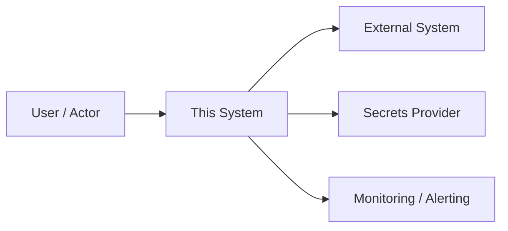
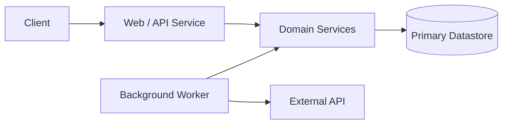
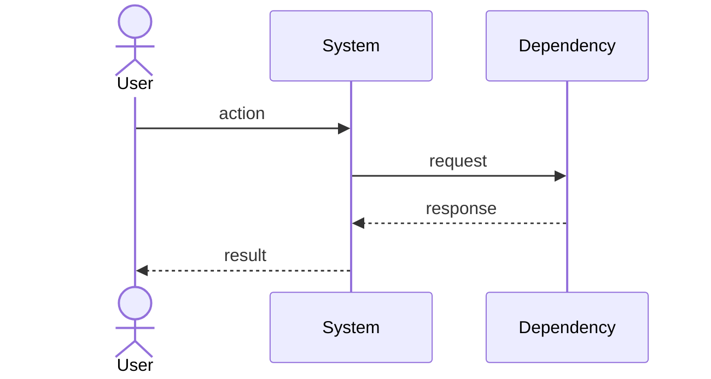
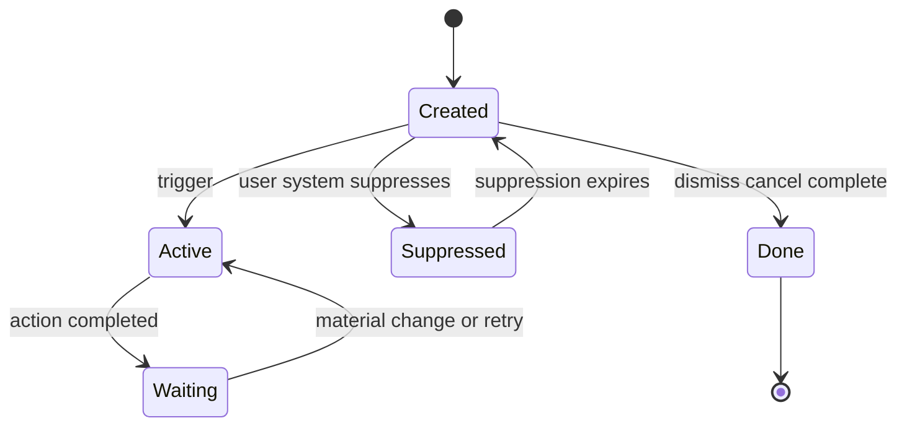

# `Project Feature Name` — Specification (Standard)

> Template notes:
>
> This is the **Standard** spec template — for typical features and services. Two sibling templates exist: `spec-light-template.md` (scripts, small tools, single-session agent tasks) and `spec-full-template.md` (multi-service systems, durable data, external integrations, or multiple stakeholders). If the project needs Full-tier sections, copy your content into that template (see [Appendix D](#appendix-d-tailoring)).
>
> **Numbering is stable across all three profiles** (it matches `spec-full-template.md`). A Standard spec omits the Full-only sections, so section **and appendix** numbers have intentional gaps — §5, §8.4, §8.6, §14–§16, §18.4, §20, and Appendix C are absent by design. That is expected, not missing content; a section keeps the same number no matter which profile a spec uses, and upgrading to Full only _adds_ sections.
>
> 1. Replace `angle bracket` placeholders. Delete guidance blockquotes and "Suggested prompts" lists once used.
> 2. **Prose-first for narrative sections** (Purpose, Background, Architecture Summary, Recovery); tables only for enumerable facts. Do not fill a table with one-word cells when a paragraph would explain more.
> 3. Requirements must be specific, testable, necessary, feasible, traceable, and unambiguous. Use "The system shall…" for mandatory behavior. Never write "fast," "easy," "robust," or "secure" without a measurable criterion.
> 4. Some sections are conditional (§11 UI/API surface, §18.6 Backup/DR) — keep them if applicable, or delete with a one-line reason.
> 5. Diagrams are Mermaid (renders natively in GitHub/GitLab/VS Code/Obsidian). Use only the views that are useful.
>
> **Standards note:** Structure and terminology borrow from ISO/IEC/IEEE 29148:2018 (requirements), IEEE 1016-2009 (design description), and ISO/IEC/IEEE 42010:2022 (architecture description) without claiming formal compliance. Full citations in References. (IEEE 830-1998 is superseded; do not use it as an authority.)

---

## Revision History

| Version | Date           | Author     | Change        |
| ------- | -------------- | ---------- | ------------- |
| 0.1     | `YYYY MM DD` | `author` | Initial draft |

**Spec lifecycle:** This document is **living until `approved`**, then **change-controlled**: post-approval edits require a new revision row and, for scope-affecting changes, re-approval by the owner. Implementation deviations are recorded in the [Deviations Log](#deviations-log), not silently patched into requirements. When replaced, set `status: superseded` and `superseded_by:` in the frontmatter.

---

## 1. Purpose & Background

Describe, in prose, the problem this software, feature, or subsystem solves.

Include:

- The user, business, operational, or technical problem, and who has it.
- What event, pain point, or opportunity triggered the work now.
- What outcome should exist after successful implementation.
- The intended first-release scope: what is deliberately optimized for now, and what must remain possible later.
- The compounding value or long-term asset, if any (accumulated data history, audit trail, automation reliability, reusable platform capability, reduced toil).

Author notes:

- Who needs this system, and what job are they trying to complete?
- Why are existing tools insufficient?
- What must the MVP accomplish without overbuilding?
- What future directions should not be blocked by early design choices?

Example framing:

> This project provides `capability` so that `user system` can `desired outcome` without `current pain or failure mode`.

---

## 2. Scope

### 2.1 In Scope

- `included capability`
- `included workflow`
- `included integration`

### 2.2 Out of Scope (Non-Goals — never)

Things this system is **intentionally never** going to do. The reason column prevents relitigating the exclusion later.

| ID     | Non-Goal                                 | Reason  |
| ------ | ---------------------------------------- | ------- |
| NG-001 | `thing we are intentionally not doing` | `why` |

### 2.3 Won't Have in v1 (deferred — not never)

Things that are goals eventually but **excluded from this release** to control scope. Distinct from Non-Goals: these have a revisit trigger.

| ID | Deferred Capability | Why Deferred | Revisit When |
| --- | --- | --- | --- |
| WH-001 | `feature deferred to avoid scope creep` | `cost risk uncertainty missing validation` | `trigger milestone metric user demand date` |

### 2.4 Boundaries

| Boundary | Description |
| --- | --- |
| System owns | `data behavior APIs jobs UI files` |
| System depends on | `external services databases queues hardware user actions` |
| System does not own | `systems data decisions or processes outside this scope` |

---

## 3. Context

### 3.1 Current State

Describe the existing implementation, workflow, or operating environment: systems involved, known limitations, relevant prior decisions, operational constraints, known failure modes.

### 3.2 Target State

Describe the desired end state after this work is complete.

### 3.3 Assumptions

| ID    | Assumption     | Impact if False                          |
| ----- | -------------- | ---------------------------------------- |
| A-001 | `assumption` | `what breaks and what we d do instead` |

### 3.4 Constraints

| ID | Constraint | Source |
| --- | --- | --- |
| C-001 | `technical business legal operational security schedule hosting compatibility or tooling constraint` | `who or what imposes it` |

---

## 4. Goals

Goals are outcomes; requirements (§7) are behaviors. A goal should be traceable to the requirements that achieve it.

| ID    | Goal     | Success Signal        | Achieved By    |
| ----- | -------- | --------------------- | -------------- |
| G-001 | `goal` | `observable result` | `FR NFR ids` |

---

> **§5 (Stakeholders and Users) is Full-tier** and is intentionally omitted at the Standard profile.

## 6. Glossary

Define every domain term an implementer could misread. Ambiguous terminology is a top source of requirement misinterpretation — by coding agents especially.

| Term     | Definition             | Notes / Not to be confused with |
| -------- | ---------------------- | ------------------------------- |
| `term` | `precise definition` | `disambiguation`              |

---

## 7. Requirements

> **Quality rule:** Each requirement is one testable statement with a stable ID, a rationale, an acceptance criterion, and a priority. Priorities: **Must** (release-blocking), **Should** (important, briefly deferrable), **Could** (nice-to-have, must not delay release). Anything "Won't" belongs in §2.3, not here.

### 7.1 Functional Requirements

| ID | Requirement | Rationale | Acceptance Criteria | Priority |
| --- | --- | --- | --- | --- |
| FR-001 | The system shall `specific behavior`. | `why this exists` | `how to verify it` | Must |
| FR-001 | The system shall `duplicate behavior`. | `why this exists` | `how to verify it` | Should |

### 7.2 Non-Functional Requirements

Quality attributes: performance, reliability, maintainability, usability, observability, portability, compatibility, scalability.

| ID | Category | Requirement | Measurement / Acceptance Criteria | Priority |
| --- | --- | --- | --- | --- |
| NFR-001 | Performance | The system shall `requirement`. | `measurable threshold` | Must |
| NFR-002 | Reliability | The system shall `requirement`. | `measurable threshold or behavior` | Must |
| NFR-003 | Observability | The system shall `logging metrics tracing audit requirement`. | `observable evidence` | Should |

### 7.3 Interface Requirements

APIs, CLIs, UIs, files, databases, queues, protocols, external systems, hardware.

| ID | Interface | Requirement | Contract / Format | Acceptance Criteria |
| --- | --- | --- | --- | --- |
| IR-001 | `HTTP API CLI file DB external service` | The system shall `interface behavior`. | `OpenAPI path command syntax schema protocol` | `verification` |

If the system exposes or consumes an HTTP API: provide or reference an OpenAPI document; define request/response schemas, error responses, authentication and authorization behavior; define pagination, filtering, sorting, and versioning if applicable.

### 7.4 Data Requirements

| ID | Data Entity | Requirement | Validation Rules | Ownership |
| --- | --- | --- | --- | --- |
| DR-001 | `entity` | The system shall `store read transform retain delete or validate`. | `rules` | `owning system` |

Cover where applicable: schema changes, migrations, retention, backup/restore expectations, privacy classification, import/export, idempotency, audit trail.

---

## 8. Architecture and Design

### 8.1 Architecture Summary

Describe the proposed architecture **in plain prose**: major components, data flow, control flow, runtime boundaries, trust boundaries, external dependencies, and the two or three decisions that most shaped the design (reference §8.3).

### 8.2 Architecture Views

Use only the views that are useful for this project.

#### 8.2.1 Context View

#### 8.2.2 Container / Deployment View

Deployable units: services, databases, workers, containers, VMs, LXCs, queues, storage.

#### 8.2.3 Component View

| Component | Responsibility | Interfaces | Notes |
| --- | --- | --- | --- |
| `component` | `what it owns` | `HTTP CLI queue DB repository SDK webhook` | `failure behavior scaling key constraints` |

Guidance: keep domain logic separate from framework glue where practical; make integration-specific code replaceable through interfaces or adapters; document any intentionally accepted coupling.

### 8.3 Design Decisions

| ID | Decision | Rationale | Alternatives Considered | ADR |
| --- | --- | --- | --- | --- |
| D-001 | `decision` | `why` | `alternatives and why rejected` | `link if durable` |

> **§8.4 (Solution Alternatives Considered) is Full-tier** and is intentionally omitted at the Standard profile.

### 8.5 Design Constraints

Constraints the implementer must not violate:

- `constraint`

> **§8.6 (Dependency Policy) is Full-tier** and is intentionally omitted at the Standard profile.

---

## 9. Data Model

Define persistent storage concretely: schemas or collection/document definitions, migrations, indexes, retention, constraints. Concrete DDL belongs here when the datastore is relational.

Define for each entity:

- natural keys and uniqueness constraints;
- required vs. optional fields;
- normalization rules;
- expected read/write access patterns and the indexes they need;
- what must be stored to reproduce historical results (provenance);
- retention and archival policy;
- future extension fields and why they are safe.

---

## 10. Behavior and Workflows

### 10.1 Primary Workflow

Steps:

1. `step`

Expected result:

> `result`

### 10.2 Alternate Workflows

| ID     | Trigger       | Behavior     | Expected Result |
| ------ | ------------- | ------------ | --------------- |
| AW-001 | `condition` | `behavior` | `result`      |

### 10.3 Edge Cases

| ID     | Edge Case     | Expected Behavior     |
| ------ | ------------- | --------------------- |
| EC-001 | `edge case` | `expected behavior` |

### 10.4 State Transitions

Use if the feature has meaningful states (workflows, alerts, approvals, lifecycle).

| State     | Meaning     | Entry Condition | Exit Condition |
| --------- | ----------- | --------------- | -------------- |
| `state` | `meaning` | `condition`   | `condition`  |

For stateful automation, also define: trigger conditions, deduplication fingerprint fields, cooldown/hysteresis/escalation behavior, supported user actions, audit records, expiry and cleanup rules.

---

## 11. UI Pages / API Endpoints

> Applies if the system has a UI or API surface. If it has neither, delete this section with a one-line reason.

Minimum user/admin/API surface for the release. API-only products: replace pages with endpoints and contracts.

| Page or Endpoint | Purpose | Key Actions | Authorization |
| --- | --- | --- | --- |
| `dashboard list` | `overview and filtering` | `sort filter inspect export` | `role session API scope` |
| `detail` | `inspect one entity` | `view facts history actions` | `rule` |
| `settings rules` | `configure policies thresholds` | `create edit disable` | `rule` |
| `operations admin` | `inspect jobs failures audit trail` | `retry pause override` | `rule` |

For each, specify: data source and primary query; filters/sorts; empty and error states; pagination strategy; latency target; audit requirements for state-changing actions.

**Accessibility & i18n:** state the target (e.g., WCAG 2.1 AA; single-locale v1 with strings externalized) or explicitly declare it out of scope with a reason.

---

## 12. Error Handling and Recovery

### 12.1 Expected Failures

| ID | Failure Mode | User/System Behavior | Logging / Observability | Recovery |
| --- | --- | --- | --- | --- |
| ERR-001 | `failure` | `what happens` | `what is logged emitted` | `retry rollback manual repair fail closed` |

### 12.2 Retry and Idempotency

- Retried operations: `operations` — classify failures as **transient** (retry) vs. **permanent/configuration** (do not retry; alert).
- Non-retried operations: `operations`
- Idempotency key / deduplication strategy: `strategy`

If the system runs scheduled or high-volume external work, define its throttling, retry caps, and circuit-breaker behavior here (or upgrade to the Full template, which carries a dedicated scheduling module in Appendix C.2).

### 12.3 Rollback / Recovery

Describe, in prose, how to recover from partial failure — what state can be inconsistent, how it is detected, and the repair procedure.

---

## 13. Security and Privacy

### 13.1 Authentication

How users, services, or agents authenticate: `session auth SSO API keys mutual TLS`.

### 13.2 Authorization

| Actor / Role | Allowed Actions | Denied Actions |
| ------------ | --------------- | -------------- |
| `role`     | `allowed`     | `denied`     |

### 13.3 Secrets

Store credential **references** here (env var names, secret-manager paths) — never values.

| Secret | Storage Location | Access Pattern | Rotation / Notes |
| --- | --- | --- | --- |
| `secret name` | `secret manager path env var` | `how used` | `rotation expectation` |

### 13.4 Sensitive Data

| Data | Classification | Storage | Transmission | Retention |
| --- | --- | --- | --- | --- |
| `data` | public / internal / confidential / restricted | `storage` | `transport` | `retention` |

### 13.5 Threats and Mitigations

| Threat     | Impact     | Mitigation     |
| ---------- | ---------- | -------------- |
| `threat` | `impact` | `mitigation` |

### 13.6 Hardening Checklist

Confirm each item is addressed above or mark N/A with a reason:

- [ ] Cookie/session settings (secure, httponly, samesite, rotation)
- [ ] CSRF/CORS policy and allowed origins
- [ ] Webhook/API signature validation
- [ ] Sensitive-data redaction in logs
- [ ] CI/CD secret handling (never printed, never committed)
- [ ] Network exposure (reverse proxy, private network, firewall, service bindings)
- [ ] Identity-header trust rules if behind an auth proxy
- [ ] Run as non-root; least-privilege filesystem and network access

---

> **Sections §14 (Capacity and Scale Assumptions), §15 (Risks), and §16 (Compliance, Licensing, and Data Rights) are Full-tier** and are intentionally omitted at the Standard profile.

## 17. Testing and Acceptance

### 17.1 Definition of Done

- [ ] All **Must** requirements implemented; acceptance criteria pass.
- [ ] Automated tests cover required behavior, error cases, and edge cases.
- [ ] Traceability matrix (§17.3) complete — every Must/Should requirement maps to a passing verification.
- [ ] Documentation deliverables (§18.7) produced.
- [ ] Security-sensitive behavior reviewed; hardening checklist (§13.6) resolved.
- [ ] Deviations Log reviewed and accepted by owner.
- [ ] No known blocking defects.

### 17.2 Test Strategy

| Layer | Scope | Required Coverage | Required? |
| --- | --- | --- | --- |
| Unit / domain | `pure logic validation permissions` | `critical branches and edge cases` | No |
| Integration / adapter | `external APIs parsers webhooks imports` | `success retry malformed input rate limits` | No |
| Snapshot / contract | `normalized output API schemas` | `diffs reviewed intentionally` | No |
| Database | `migrations constraints repositories` | `empty DB and upgrade path` | No |
| End-to-end | `primary user journey` | `happy path one failure path` | No |
| Security | `auth permissions CSRF signatures redaction` | `critical misuse cases` | No |
| Operations | `deploy rollback health backup restore alerting` | `production readiness checks` | No |
| Regression | `prior bugs fragile behavior` | `pinned by test` | No |

### 17.3 Requirement-to-Test Traceability

The implementer fills this in as the completion evidence ([Appendix B.3](#b3-required-completion-report-verification-gate)).

| Requirement ID | Test / Verification Method | Status |
| --- | --- | --- |
| FR-001 | `test name command or manual check` | Passing |

---

## 18. Deployment and Operations

### 18.1 Runtime Environment

| Item              | Value                                          |
| ----------------- | ---------------------------------------------- |
| Runtime           | `Python Node Go`                        |
| OS / Platform     | `Linux container LXC VM managed service` |
| Datastore         | `database`                                   |
| External services | `services`                                   |
| Scheduling        | `cron systemd timer queue worker`         |
| Hosting           | `location provider`                          |

Runtime services:

| Service | Purpose | Start Mode | Health Signal |
| --- | --- | --- | --- |
| `web service` | `serve UI API` | `systemd container orchestrator` | `health endpoint` |
| `worker` | `background jobs` | `service queue worker` | `heartbeat job records` |

### 18.2 Configuration

| Setting         | Required? | Default     | Description     |
| --------------- | --------- | ----------- | --------------- |
| `CONFIG NAME` | No  | `default` | `description` |

**Environment matrix** — differences between environments (auth mode, data, secrets source, external-service sandboxes):

| Aspect                                    | Dev       | Staging   | Prod      |
| ----------------------------------------- | --------- | --------- | --------- |
| `secrets source auth external APIs` | `value` | `value` | `value` |

### 18.3 Deployment Flow

1. Trigger: `merge to main release tag manual approval`
2. CI checks: `tests lint type checks security checks build`
3. Artifact build or source sync.
4. Runtime configuration and secret rendering.
5. Database migrations — expand/contract rule where applicable (new columns added before old ones removed; no release depends on a same-release schema drop).
6. Service restart or rollout.
7. Smoke test and health check.
8. Rollback procedure: `how and how long it takes`.

> **§18.4 (Rollout Controls) is Full-tier** and is intentionally omitted at the Standard profile.

### 18.5 Observability

Minimum signals:

- `/healthz` (liveness) and `/readyz` (deploy readiness) or equivalents
- Structured logs with correlation IDs
- Job/run records: every scheduled or background job reports start, finish, status, counts, and failure class
- Metrics: throughput, latency, error rate, and cost
- Dead-man heartbeat for scheduled jobs (alert on _absence_ of success, not just presence of failure)

| Alert | Trigger | Severity | Owner / Action |
| --- | --- | --- | --- |
| `alert` | `precise condition` | Info / Warning / Critical | `who responds runbook link` |

### 18.6 Backup and Disaster Recovery

> Required if the system owns durable data. If it owns none, delete this section with a one-line reason.

**RPO (max acceptable data loss):** `duration` · **RTO (max acceptable restore time):** `duration`

| Asset | Backup Method | Frequency | Retention | Restore Test Cadence |
| --- | --- | --- | --- | --- |
| `database` | `dump snapshot WAL PITR` | `frequency` | `retention` | `cadence owner` |
| `files artifacts` | `method` | `frequency` | `retention` | `cadence` |

Also define: encryption requirements; disaster scenarios covered; scenarios explicitly **not** covered in v1.

### 18.7 Documentation Deliverables

Checklist tied to the DoD:

- [ ] README / user-facing docs updated
- [ ] Runbooks: deploy, rollback, incident response, backup restore, secret rotation
- [ ] Configuration reference (§18.2) matches shipped defaults
- [ ] Handoff/state docs updated per repo convention

---

## 19. Implementation Plan

Break the work into ordered milestones with observable exit criteria. Each step should be actionable by an implementer without inventing sequencing. Scale the ladder to the project — a small tool may need only MS-0–MS-2.

> **§19 Waves (Full-tier)** — for breadth that ships incrementally — is intentionally omitted at the Standard profile; the milestone ladder below is the Standard plan.

### MS-0 — Foundation

1. Repository/application skeleton and dependency management.
2. Configuration strategy for local and production.
3. Initial schema and migrations.
4. Authentication/authorization baseline.
5. Health/readiness endpoints.
6. CI checks and deployment pipeline.
7. **Demonstrate rollback from a known release.**

### MS-1 — Core workflow

1. First end-to-end input path implemented and persisted.
2. Idempotency/deduplication behavior.
3. Operational run/audit metadata recorded.
4. Tests for success and common failure cases.

### MS-2 — Domain logic

1. Core rules/calculations/decisions implemented.
2. Missing, ambiguous, or low-confidence inputs handled.
3. Decision provenance persisted (see §9).
4. Edge-case and threshold tests.

### MS-3 — User and admin experience

1. Main list/detail surfaces (§11) with pagination, filtering, empty/error states.
2. Configuration/settings flow.
3. State-changing actions with audit trail.

### MS-4 — Automation / notifications / external actions `[if applicable]`

1. Trigger loop with deduplication fingerprint ledger.
2. Cooldown, retry, and suppression rules.
3. Delivery/action status tracking; duplicate and stale-action tests.

### MS-5 — Hardening and production readiness

1. Monitoring and alerting wired (§18.5).
2. Backups wired; **restore test executed**.
3. Storage/cost/throughput safeguards; load test at expected volume.
4. Runbooks written (§18.7); open blockers closed or explicitly accepted.

### Milestone Summary

| Milestone | Deliverable | Exit Criteria |
| --- | --- | --- |
| MS-0 Foundation | Deployable skeleton | CI passes; deploy works; health checks pass; rollback demonstrated |
| MS-1 Core workflow | First end-to-end path | Input flows to persisted result with observability |
| MS-2 Domain logic | Decisions complete | Results reproducible, explained, tested |
| MS-3 UX/API | Usable interface | Primary user completes MVP tasks without developer intervention |
| MS-4 Automation | Action loop | Deduped, observable, auditable actions in production-like environment |
| MS-5 Production readiness | Hardening | Restore tested; monitoring active; blockers closed or accepted |

---

> **§20 (Success Evaluation) is Full-tier** and is intentionally omitted at the Standard profile.

## 21. Open Questions and Decisions

Questions may proceed on a recorded **current assumption** unless marked blocking. Blocking questions halt the affected work until answered ([Appendix B.1](#b1-implementation-rules)).

| ID | Question | Current Assumption | Blocking? | Owner | Needed By | Status |
| --- | --- | --- | --- | --- | --- | --- |
| OQ-001 | `question` | `assumption this spec proceeds on` | No | `owner` | `milestone date` | Answered |

---

## Deviations Log

Maintained by the **implementer** during the build ([Appendix B](#appendix-b-agent-implementation-contract)). Any divergence from this spec is recorded here — never silently patched into requirements text.

| ID | Spec Reference | Deviation | Reason | Approved? |
| --- | --- | --- | --- | --- |
| DEV-001 | `FR xxx n` | `what was done differently` | `why` | No / Pending |

---

## References

### Standards

- ISO/IEC/IEEE 29148:2018 — Requirements engineering.
- IEEE 1016-2009 — Software Design Description.
- ISO/IEC/IEEE 42010:2022 — Architecture description.
- OpenAPI Specification — HTTP API contracts.
- (IEEE 830-1998 — historical only; superseded by 29148.)

### Project References

- `ADR architecture doc repository ticket API contract prior spec links`

---

## Appendix A: ID Conventions

Stable IDs allow requirements to be referenced from commits, tests, issues, ADRs, and review comments — and let an implementer's completion claims be mechanically checked. Section numbers below match `spec-full-template.md`, so an ID keeps the same "Defined In" reference across every profile.

| Prefix | Meaning                     | Defined In     |
| ------ | --------------------------- | -------------- |
| `G-`   | Goal                        | §4             |
| `NG-`  | Non-goal (never)            | §2.2           |
| `WH-`  | Won't have in v1 (deferred) | §2.3           |
| `A-`   | Assumption                  | §3.3           |
| `C-`   | Constraint                  | §3.4           |
| `FR-`  | Functional requirement      | §7.1           |
| `NFR-` | Non-functional requirement  | §7.2           |
| `IR-`  | Interface requirement       | §7.3           |
| `DR-`  | Data requirement            | §7.4           |
| `D-`   | Design decision             | §8.3           |
| `AW-`  | Alternate workflow          | §10.2          |
| `EC-`  | Edge case                   | §10.3          |
| `ERR-` | Error-handling requirement  | §12.1          |
| `MS-`  | Milestone                   | §19            |
| `OQ-`  | Open question               | §21            |
| `DEV-` | Deviation                   | Deviations Log |

The `R-` (Risk) prefix is Full-tier (§15) and is not used at the Standard profile. Priority values (`Must/Should/Could`) are column values, not ID prefixes — IDs never change when priorities do.

---

## Appendix B: Agent Implementation Contract

Binding when this spec is implemented by a coding agent. (Applies equally well to human contractors.)

### B.1 Implementation Rules

The implementer shall:

- Read this entire specification before making changes; per session thereafter, re-read at minimum §7 (Requirements), §21 (Open Questions), and the Deviations Log — Background and References may be read once.
- Preserve all explicit non-goals, won't-haves, constraints, and design constraints.
- Treat **Must** requirements as mandatory and **blocking** open questions as hard stops for the affected work.
- On encountering underspecified behavior: file an `OQ-` row **with a proposed default assumption** and proceed on it only if non-blocking — never guess silently.
- On any divergence from the spec: record a `DEV-` row (spec reference, what, why) rather than adapting silently.
- Add or update tests for every implemented requirement; keep §17.3 (traceability) current.
- Follow the milestone order in §19; do not build later milestones on unproven earlier ones.
- Prefer small, reviewable changes; avoid broad refactors unless the spec requires them.
- Document any discovered mismatch between the spec and existing code as a `DEV-` or `OQ-` row.

### B.2 Prohibited Behaviors

The implementer shall not:

- Invent requirements not present in this spec.
- Remove existing behavior unless explicitly required.
- Introduce external services or dependencies not agreed with the owner without an approved `OQ-`.
- Store secrets in source control or print them in CI logs.
- Ignore failing tests unrelated to the change without documenting them.
- Treat examples as exhaustive or normative unless explicitly stated.
- Mark a requirement complete without a verification entry in §17.3.

### B.3 Required Completion Report (verification gate)

At completion, provide:

- Summary of changes and files changed.
- **Requirements implemented, each mapped to the test or command that proves it** — i.e., the completed §17.3 matrix. Claims without verification entries are not accepted.
- Tests added or changed.
- Deviations (`DEV-` rows) and their approval status.
- Known limitations and remaining open questions.
- Documentation deliverables completed (§18.7).

### B.4 Session Handoff

For multi-session implementations: record current milestone, in-progress requirement IDs, and unresolved `OQ-`/`DEV-` items in the repository's session-state/handoff documents at the end of each session, per the repo's documentation convention. The spec records _what and why_; handoff docs record _where work stands_.

---

> **Appendix C (Optional Modules) is Full-tier** — external-integration, scheduling, entity-resolution, and scoring modules — and is intentionally omitted at the Standard profile.

## Appendix D: Tailoring

Pick the smallest profile that fits; upgrade if the project grows. Because numbering is stable across profiles, upgrading is **additive**: insert the missing sections at their canonical numbers and set `profile:` in the frontmatter — no existing section or ID reference changes.

| Profile | Template File | Use For |
| --- | --- | --- |
| **Light** | `spec-light-template.md` | Scripts, small tools, single-session agent tasks |
| **Standard** | this file | Typical features and services |
| **Full** | `spec-full-template.md` | Multi-service systems, durable data, external integrations, or multiple stakeholders |

Rules of thumb:

- Owns durable data → §18.6 Backup/DR is required.
- Talks to external paid/rate-limited APIs, makes automated decisions users must trust, or spans multiple services/stakeholders → upgrade to **Full** (adds §5, §8.4, §8.6, §14–§16, §18.4, §20, §19 Waves, and Appendix C modules).
- Implemented by a coding agent → Appendix B is required (it is the cheapest section and the highest-leverage one).
